### RocketMQ的源码整体分析

解读的源码版本基于RocketMQ5.1.0

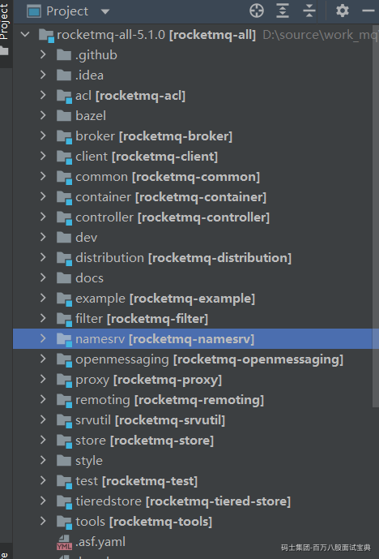

RocketMQ的源码是非常的多，我们没有必要把RocketMQ所有的源码都读完，所以我们把核心、重点的源码进行解读，RocketMQ核心流程如下：

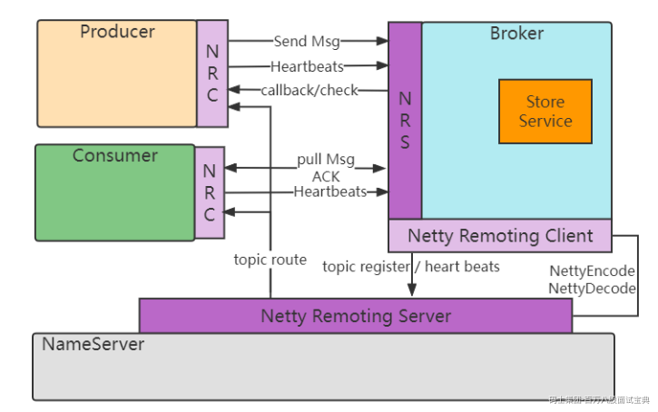

## 1、NameServer的模块

命名服务，更新和路由发现 broker服务。  
NameServer 要作用是为消息生产者、消息消费者提供关于主题 Topic 的路由信息，NameServer除了要存储路由的基础信息，还要能够管理 Broker节点，包括路由注册、路由删除等功能

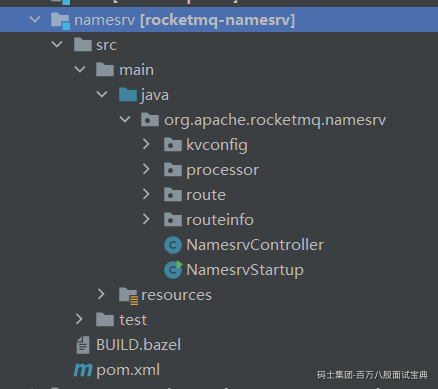

## 2、Produce/Consumer模块

在源码中属于client子模块，java版本的mq客户端实现

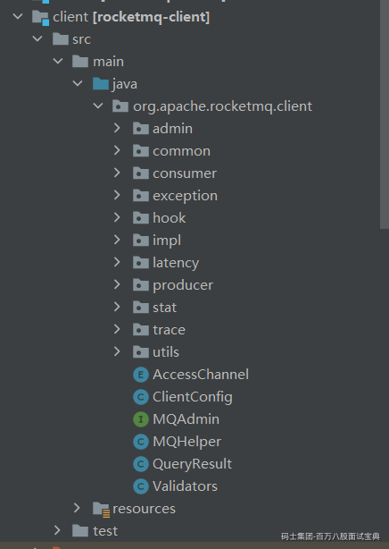

## 3、broker模块

mq的核心。它能接收producer和consumer的请求，并调用store层服务对消息进行处理。HA服务的基本单元，支持同步双写，异步双写等模式。

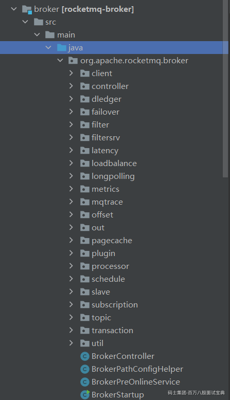

## 4、Remote模块

基于netty的底层通信实现，所有服务间的交互都基于此模块。

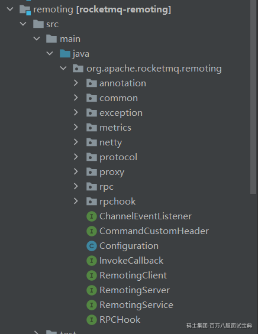

# NameServer源码分析

从业务流程上，我们先不看源码，我们来分析一下NameSerever要干哪些活！然后基于业务点进行源码分析。

1、启动作为注册中心

启动监听，等待Broker、Producer、Comsumer连接来注册。

2、路由注册与发现

Broker在启动时向所有NameServer注册（包括主题队列信息、broker信息、集群信息、broker存活信息、过滤服务器信息、broker和主题队列映射信息）

3、路由剔除

移除心跳超时的Broker相关路由信息。NameServer与每台Broker服务保持长连接，并间隔10S检查Broker是否存活，如果检测到Broker宕机，则从路由注册表中将其移除。这样就可以实现RocketMQ的高可用。

## NameServer的启动流程分析

启动入口，NameServer是以main方法启动的。这里要注意一个点，就是NameServer所有的存储的信息都是基于内存，而这些信息的来源都是broker启动的时候发过来的，所以可以这么认为，NameServer就是一个内存版的zookeeper，一个精简版的zookeeper。

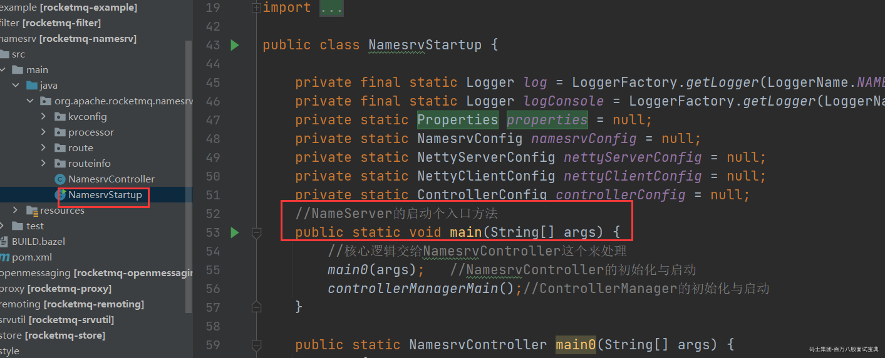

NameServer存储的核心类:基于ConcurrentHashMap存储。

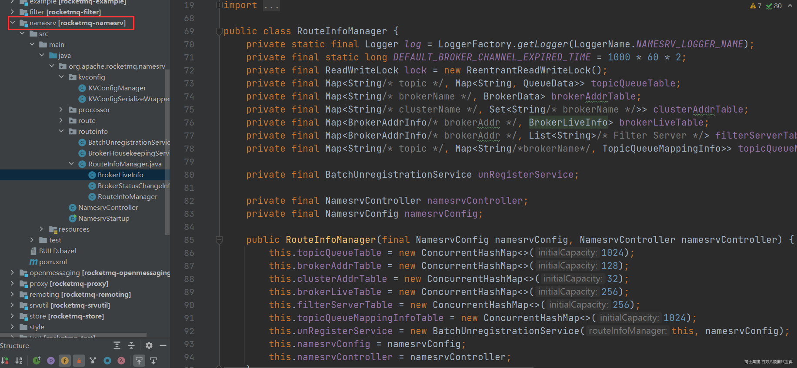

## NameServer的对外提供的功能

从流程图中，可以看出：

NameServer主要对外提供两类功能：

1、注册/查询Broker

2、注册/查询Topic路由信息

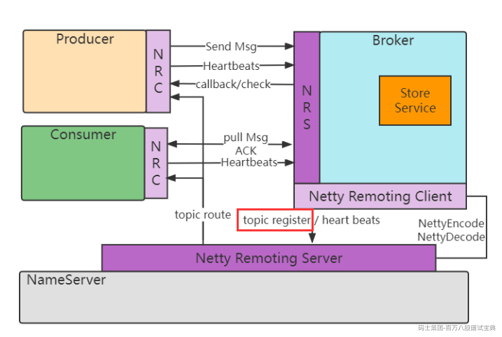

源码中的核心就是RouteInfoManager类提供的对外方法。

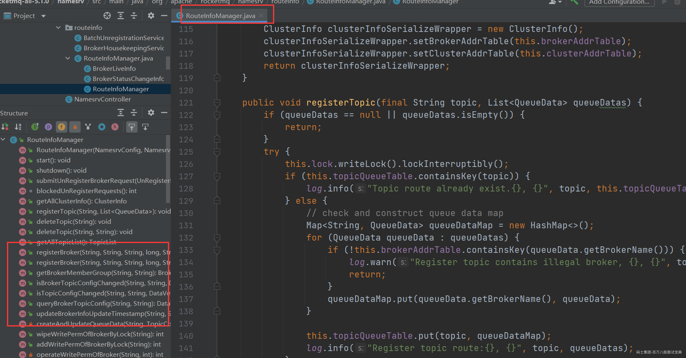

### 注册/查询Broker

注册

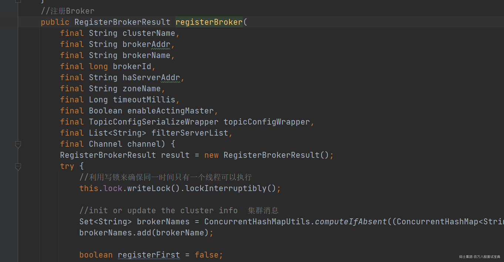

查询

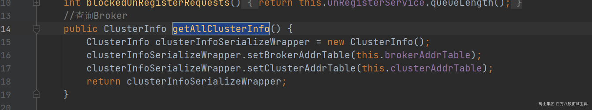

### 注册/查询Topic路由信息

注册

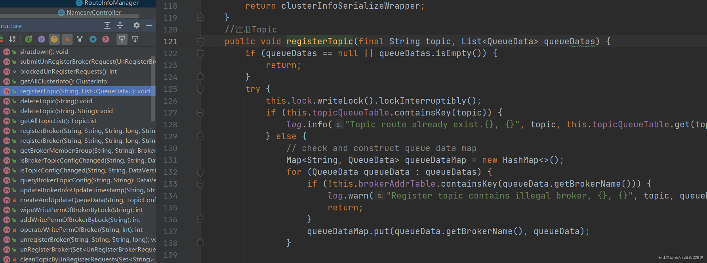

查询

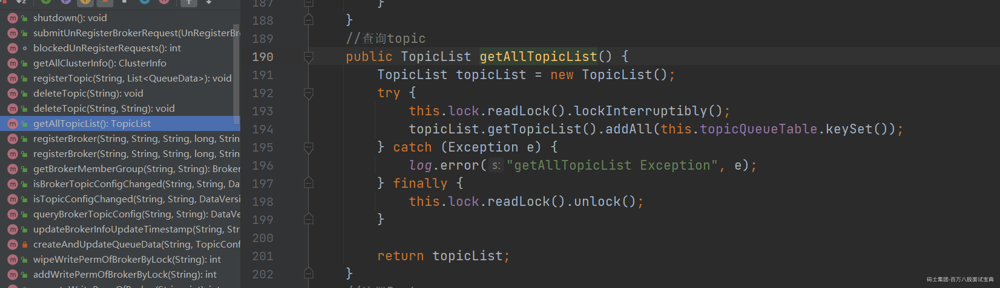

### 其他组件调用NameServer的功能

#### 注册/查询Broker

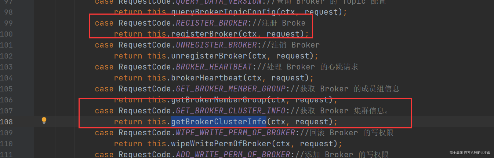

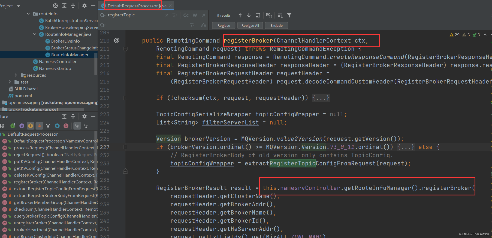

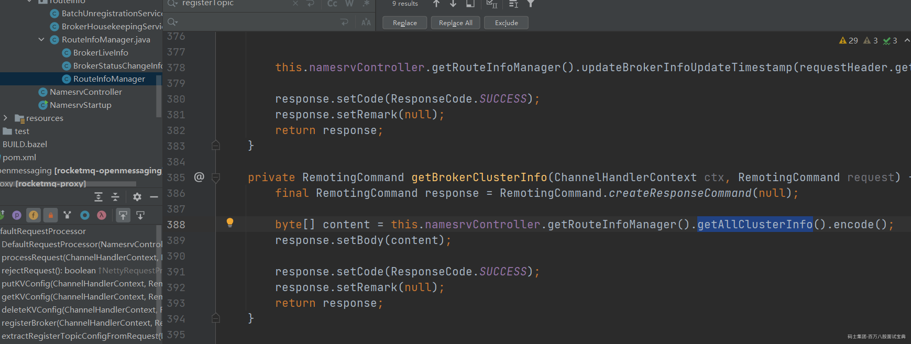

#### 注册/查询Topic路由信息

注册Topic路由信息

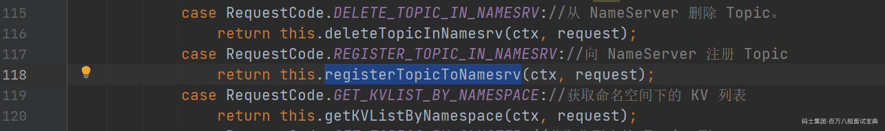

查询Topic路由信息

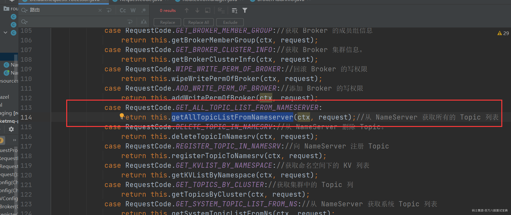

### 读写锁设计

RouteInfoManager类中有一个读写锁的设计

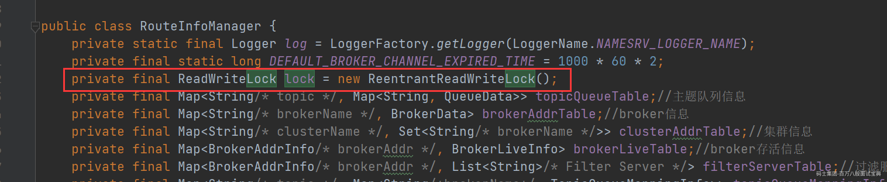

注册拿写锁

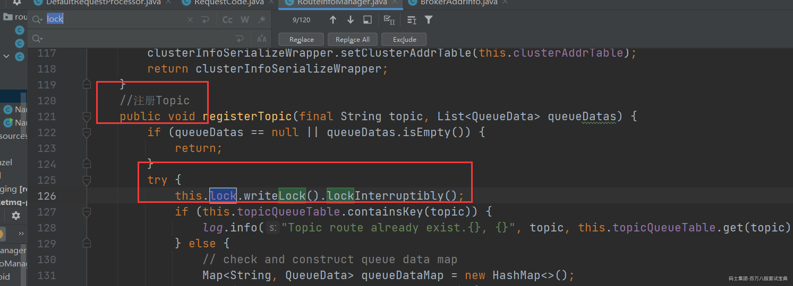

查询拿读锁

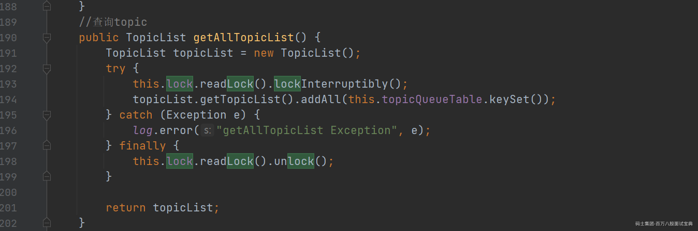

同时包括Broker的注册与查询。

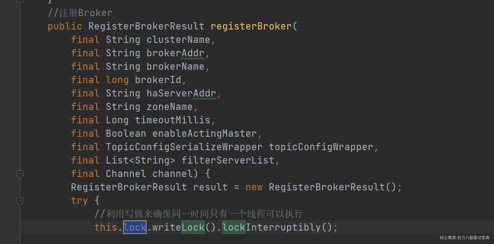

RocketMQ的RouteInfoManager是用来管理NameServer中的路由信息的，包括Topic和Broker之间的映射关系、Broker和集群之间的映射关系等。由于大量的生产者和消费者都需要访问这些路由信息，因此RouteInfoManager需要支持高并发读取操作。

对于读取路由信息的操作，RouteInfoManager使用读锁进行保护，多个线程可以同时获取读锁进行并发读取。而对于更新路由信息的操作，RouteInfoManager使用写锁进行保护，只允许单个线程获取写锁进行更新，避免了并发更新操作导致的数据一致性问题。

### 定时任务剔除超时Broker

核心控制器会启动定时任务： 每隔1s扫描一次Broker,移除不活跃的Broker。

Broker每隔1s向NameServer发送一个心跳包，心跳包包含BrokerId，Broker地址，Broker名称，Broker所属集群名称、Broker关联的FilterServer列表。但是如果Broker宕机，NameServer无法收到心跳包，

此时NameServer如何来剔除这些失效的Broker呢？

NameServer会每隔5s扫描brokerLiveTable状态表，如果BrokerLive的**lastUpdateTimestamp**的时间戳距当前时间超过120s，则认为Broker失效，移除该Broker，关闭与Broker连接，同时更新topicQueueTable、brokerAddrTable、brokerLiveTable、filterServerTable。

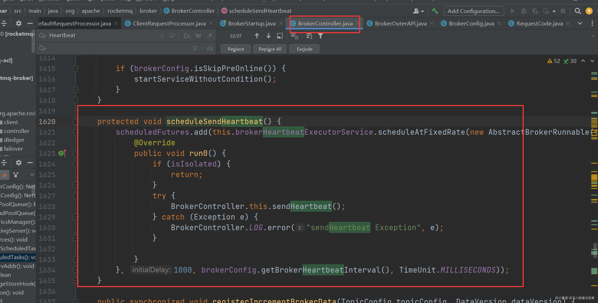

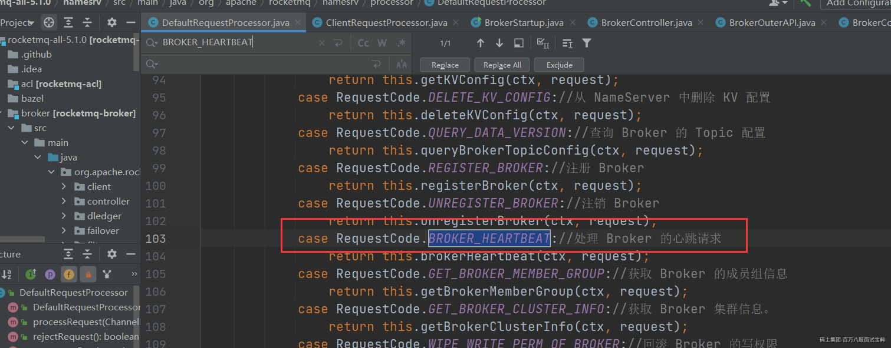

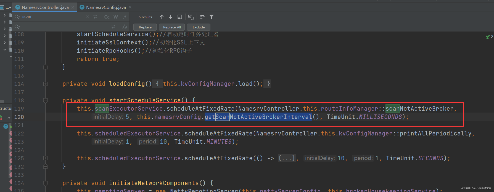

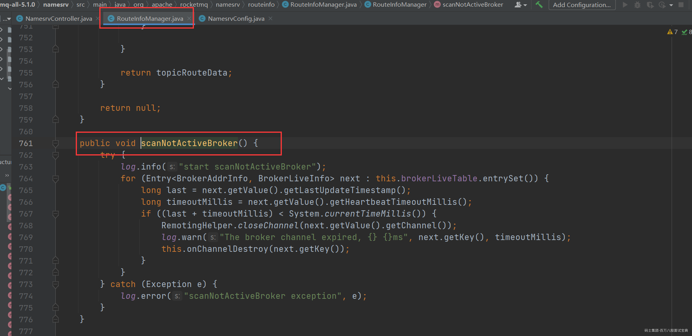

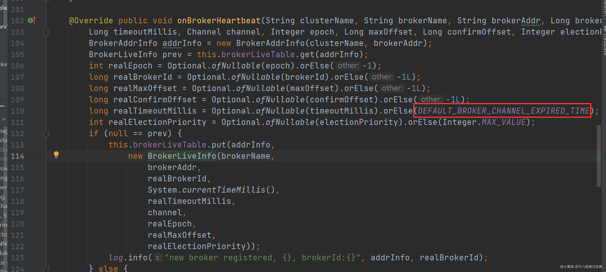

路由剔除机制中，Borker每隔30S向NameServer发送一次心跳，而NameServer是每隔10S扫描确定有没有不可用的主机（120S没心跳），那么问题就来了！这种设计是存在问题的，就是NameServer中认为可用的Broker，实际上已经宕机了，那么，某一时间段，从NameServer中读到的路由中包含了不可用的主机，会导致消息的生产/消费异常，不过不用担心，在生产和消费端有故障规避策略及重试机制可以解决以上问题（原理后续源码解读）。这个设计符合RocketMQ的设计理念：整体设计追求简单与性能，同时这样设计NameServer是可以做到无状态化的，可以随意的部署多台，其代码也非常简单，非常轻量。

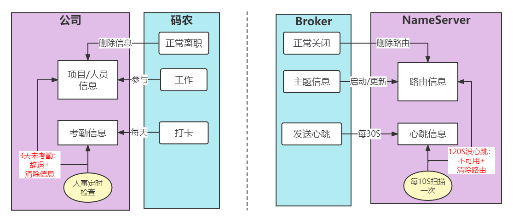

**RocketMQ有两个触发点来删除路由信息：**

- NameServer定期扫描brokerLiveTable检测上次心跳包与当前系统的时间差，如果时间超过10s，则需要移除broker。

- Broker在正常关闭的情况下，会执行unregisterBroker指令这两种方式路由删除的方法都是一样的，都是从相关路由表中删除与该broker相关的信息。在消费者启动之后，第一步都要从NameServer中获取Topic相关信息

#### 与老版本的差别
