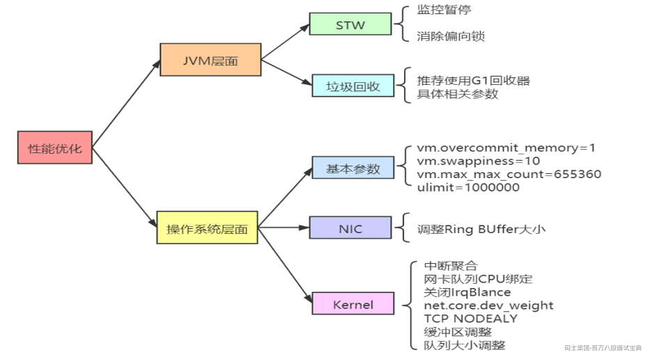
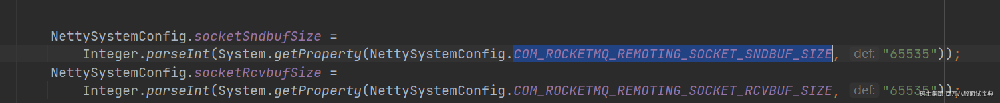

<https://rocketmq.apache.org/zh/docs/streams/02RocketMQ%20Streams%20Concept#streambuilder-1>

# RocketMQ流处理

流（Stream）是指一系列连续的数据元素按照特定的顺序组成的数据序列。

流可以是输入流（Input Stream）或输出流（Output Stream），用于表示数据的输入和输出。

在下图中，通过RocketMQ的Streams的处理，可以从source topic（源主题）进行处理，最后把数据加工处理到sink topic（目标主题）


```plain
 <dependencies>
    <dependency>
        <groupId>org.apache.rocketmq</groupId>

        <artifactId>rocketmq-streams</artifactId>

            <!-- 根据需要修改 -->
        <version>1.1.0</version>

    </dependency>

</dependencies>

```

API文档地址：https://rocketmq.apache.org/zh/docs/streams/02RocketMQ%20Streams%20Concept#streambuilder-1

# RocketMQ性能调优



## **JVM层面**

### ***STW***

#### ***监控暂停***

 rocketmq-console/rocketmq-dashboard这个是官方提供了一个WEB项目，可以查看rocketmq数据和执行一些操作。但是这个监控界面又没有权限控制，并且还有一些消耗性能的查询操作，如果要提高性能，建议这个可以暂停。

一般的公司在运维方面会有专门的监控组件，如zabbix会做统一处理。或者是简单的shell命令

监控的方式有很多，比如简单点的，我们可以写一个shell脚本，监控执行rocketmqJava进程的存活状态，如果rocketmq crash了，发送告警。

#### ***消除偏向锁***

大家了解，在JDK1.8 sync有偏向锁，但是在RocketMQ都是多线程的执行，所以竞争比较激烈，建议把偏向锁取消，以免没有必要的开销。（默认是禁止了）

-XX:-UseBiasedLocking: 禁用偏向锁

### **垃圾回收**

RocketMQ推荐使用G1垃圾回收器（默认是G1）。

-Xms8g -Xmx8g -Xmn4g:这个就是很关键的一块参数了，也是重点需要调整的，就是默认的堆大小是8g内存，新生代是4g内存。

如果是内存比较大，比如有48g的内存，所以这里完全可以给他们翻几倍，比如给堆内存20g，其中新生代给10g，甚至可以更多些，当然要留一些内存给操作系统来用

-XX:+UseG1GC -XX:G1HeapRegionSize=16m:这几个参数也是至关重要的，这是选用了G1垃圾回收器来做分代回收，对新生代和老年代都是用G1来回收。这里把G1的region大小设置为了16m,这个因为机器内存比较多，所以region大小可以调大一些给到16m，不然用2m的region, 会导致region数量过多。

-XX:G1ReservePercent=25:这个参数是说，在G1管理的老年代里预留25%的空闲内存，保证新生代对象晋升到老年代的时候有足够空间，避免老年代内存都满了，新生代有对象要进入老年代没有充足内存了。默认值是10%，略微偏少，这里RocketMQ给调大了一些

-XX:initiatingHeapOccupancyPercent= :30:这个参数是说，当堆内存的使用率达到30%之后就会自动启动G1的并发垃圾回收，开始尝试回收一些垃圾对象。默认值是45%，这里调低了一些，也就是提高了GC的频率，但是避免了垃圾对象过多，一次垃圾回收耗时过长的问题

-XX:-OmitStackTraceInFastThrow:这个参数是说，有时候JVM会抛弃-些异常堆栈信息，因此这个参数设置之后，就是禁用这个特性，要把完整的异常堆栈信息打印出来。

-XX:+AIwaysPreTouch:这个参数的意思是我们刚开始指定JVM用多少内存，不会真正分配给他，会在实际需要使用的时候再分配给他

所以使用这个参数之后，就是强制让JVM启动的时候直接分配我们指定的内存，不要等到使用内存的时候再分配

-XX:MaxDirectMemorySize=15g:这是说RocketMQ里大量用了NIO中的direct buffer，这里限定了direct buffer最多申请多少，如果你机器内存比较大，可以适当调大这个值，不了解direct buffer是什么，可以自己查看JVM三期。

-XX:-UseLargePages:这个参数的意思是禁用大内存页，某些情况下会导致内存浪费或实例无法启动。默认启动。

## **操作系统层面**

#### ***基本参数***

**vm.overcommit\_memory=1**

是否允许内存的过量分配

当为0的时候，当用户申请内存的时候，内核会去检查是否有这么大的内存空间

当为1的时候，内核始终认为，有足够大的内存空间，直到它用完了为止

当为2的时候，内核禁止任何形式的过量分配内存

**vm.** **swappiness=10**

swappiness=0 仅在内存不足的情况下，当剩余空闲内存低于vm.min\_free\_kbytes limit时，使用交换空间

swappiness=1 内核版本3.5及以上、Red Hat内核版本2.6.32-303及以上，进行最少量的交换，而不禁用交换

swappiness=10 当系统存在足够内存时，推荐设置为该值以提高性能

swappiness=60 默认值

swappiness=100 内核将积极的使用交换空间

**vm.max\_max\_count=655360**

定义了一个进程能拥有的最多的内存区域，默认为65536

**ulimit=1000000**

limits.conf 设置用户能打开的最大文件数.

1、查看当前大小

ulimit -a

2、临时修改

ulimit -n 1000000

3、永久修改

vim /etc/security/limits.conf

#### ***NIC***

一个请求到RocketMQ的应用，一般会经过网卡、内核空间、用户空间。

**网卡**

网络接口控制器（英语：network interface controller，NIC）

因 Ring Buffer 写满导致丢包的情况很多。当业务流量过大且出现网卡丢包的时候，建议调整Ring Buffer的大小，这个大小的设置一定程度上是可以缓解丢包的状况。

在Linux操作系统中，可以通过修改网络接口的Ring Buffer大小来调整其大小。

1. 使用 `ifconfig` 或 `ip` 命令查看当前网络接口的配置信息，找到要调整Ring Buffer大小的接口名称。

2. 使用 `ethtool` 命令来查看和修改网络接口的参数。

例如，使用以下命令查看当前Ring Buffer大小：

```plain
ethtool -g 
```

其中， `<interface_name>` 是要调整Ring Buffer大小的网络接口名称。  
3. 使用 `ethtool -G` 命令来修改Ring Buffer大小。例如，使用以下命令将Ring Buffer大小设置为新值：

```plain
ethtool -G <interface_name> rx <new_size> tx <new_size>
```

其中， `<new_size>` 是要设置的新的Ring Buffer大小。  
4. 使用 `ethtool` 命令再次验证Ring Buffer大小是否已经成功修改。

#### ***Kernel***

##### 中断聚合

在中断（IRQ），

在操作系统级别，是可以做软中断聚合的优化。

什么是中断？

举例，假如你是一位开发同学，和你对口的产品经理一天有10个小需求需要让你帮忙来处理。她对你有两种中断方式：

· 第一种：产品经理想到一个需求，就过来找你，和你描述需求细节，然后让你帮你来改

· 第二种：产品经理想到需求后，不来打扰你，等攒够5个来找你一次，你集中处理

我们现在不考虑及时性，只考虑你的工作整体效率，你觉得那种方案下你的工作效率会高呢？或者换句话说，你更喜欢哪一种工作状态呢？

很明显，只要你是一个正常的开发，都会觉得第二种方案更好。对人脑来讲，频繁的中断会打乱你的计划，你脑子里刚才刚想到一半技术方案可能也就废了。当产品经理走了以后，你再想捡起来刚被中断之的工作的时候，很可能得花点时间回忆一会儿才能继续工作。

对于CPU来讲也是一样，CPU要做一件新的事情之前，要加载该进程的地址空间，load进程代码，读取进程数据，各级别cache要慢慢热身。因此如果能适当降低中断的频率，多攒几个包一起发出中断，对提升CPU的工作效率是有帮助的。所以，网卡允许我们对硬中断进行合并。

##### 网卡队列CPU绑定

现在的主流网卡基本上都是支持多队列的，我们可以通过将不同的队列分给不同的CPU核心来处理，从而加快Linux内核处理网络包的速度。这是最为有用的一个优化手段。

每一个队列都有一个中断号，可以独立向某个CPU核心发起硬中断请求，让CPU来poll包。通过将接收进来的包被放到不同的内存队列里，多个CPU就可以同时分别向不同的队列发起消费了。这个特性叫做RSS（Receive Side Scaling，接收端扩展）。通过ethtool工具可以查看网卡的队列情况。

##### 关闭IRQBalance

IRQBalance主要功能是可以合理的调配使用各个CPU核心，特别是对于目前主流多核心的CPU，简单的说就是能够把压力均匀的分配到各个CPU核心上，对提升性能有很大的帮助。

但实际中往往影响cpu的使用均衡，建议服务器环境中关闭

##### net.core.dev\_weight

每个CPU一次NAPI中断能够处理网络包数量的最大值，可以根据实际情况调整。

##### TCP NODEALY

Nagle算法用于对缓冲区内的一定数量的消息进行自动连接。该处理过程(称为Nagling)，通过减少必须发送的封包的数量，提高了网络应用 程序系统的效率。（Nagle虽然解决了小封包问题，但也导致了较高的不可预测的延迟，同时降低了吞吐量。）

RocketMQ通讯层已经禁止了

##### 缓冲区调整



*(⚠️ 图片缺失:源知识库原图已失效)*
