# Redis面试题

## 1、为什么Redis单线程模型效率也能那么高？

**C语言实现，效率高**

C语言程序运行时要比其他语言编写的程序快得多，因为它“离底层机器很近”

**单线程的优势**

使用了单线程后，可维护性高。多线程模型虽然在某些方面表现优异，但是它却引入了程序执行顺序的不确定性，带来了并发读写的一系列问题，增加了系统复杂度、同时可能存在线程切换、甚至加锁解锁、死锁造成的性能损耗

**Pipeline**

Redis主要受限于内存和网络，几乎不会占用太多CPU。可以将命令和pipeline结合起来使用，减少命令在网络上的传输时间，将多次网络IO缩减为一次网络IO，通过使用pipeline每秒可以处理100万个请求。

**存储实现优化**

Redis的基础数据结构每一种至少有2种及2种以上的实现，在不同的大小或长度下选用适合的数据类型，达到极致的存储效率，从而提高写入和读取速度。

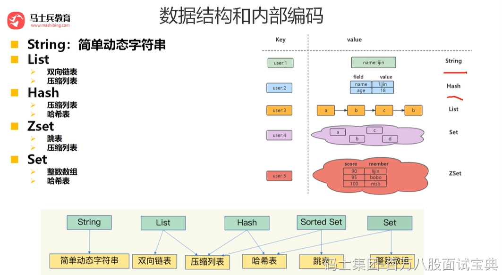

## 2、Redis6.0为什么要引入多线程呢？

**Redis多线程比单线程性能提升一倍：**

Redis 作者 antirez 在 RedisConf 2019分享时曾提到：Redis 6 引入的多线程 IO 特性对性能提升至少是一倍以上。国内也有大牛曾使用unstable版本在阿里云esc进行过测试，GET/SET 命令在4线程 IO时性能相比单线程是几乎是翻倍了

**巨头公司的需求**

Redis将所有数据放在内存中，内存的响应时长大约为100纳秒，对于小数据包，Redis服务器可以处理80,000到100,000 QPS，这也是Redis处理的极限了，对于80%的公司来说，单线程的Redis已经足够使用了。

但随着越来越复杂的业务场景，有些公司动不动就上亿的交易量，因此需要更大的QPS。

**集群方案的问题**

常见的解决方案是在分布式架构中对数据进行分区并采用多个服务器，但该方案有非常大的缺点，例如要管理的Redis服务器太多，维护代价大；

某些适用于单个Redis服务器的命令不适用于数据分区；

数据分区无法解决热点读/写问题；数据偏斜，重新分配和放大/缩小变得更加复杂等等。

1.纯内存KV操作

Redis的操作都是基于内存的，CPU不是 Redis性能瓶颈,，Redis的瓶颈是机器内存和网络带宽。

在计算机的世界中，CPU的速度是远大于内存的速度的，同时内存的速度也是远大于硬盘的速度。redis的操作都是基于内存的，绝大部分请求是纯粹的内存操作，非常迅速。

2.单线程操作

使用单线程可以省去多线程时CPU上下文会切换的时间，也不用去考虑各种锁的问题，不存在加锁释放锁操作，没有死锁问题导致的性能消耗。对于内存系统来说，多次读写都是在一个CPU上，没有上下文切换效率就是最高的！既然单线程容易实现，而且 CPU 不会成为瓶颈，那就顺理成章的采用单线程的方案了

Redis 单线程指的是网络请求模块使用了一个线程，即一个线程处理所有网络请求，其他模块该使用多线程，仍会使用了多个线程。

3.I/O 多路复用

为什么 Redis 中要使用 I/O 多路复用这种技术呢？

首先，Redis 是跑在单线程中的，所有的操作都是按照顺序线性执行的，但是由于读写操作等待用户输入或输出都是阻塞的，所以 I/O 操作在一般情况下往往不能直接返回，这会导致某一文件的 I/O 阻塞导致整个进程无法对其它客户提供服务，而 I/O 多路复用就是为了解决这个问题而出现的

4.Reactor 设计模式

Redis基于Reactor模式开发了自己的网络事件处理器，称之为文件事件处理器(File Event Hanlder)。


## 3、讲一讲Redis常见数据结构以及使用场景

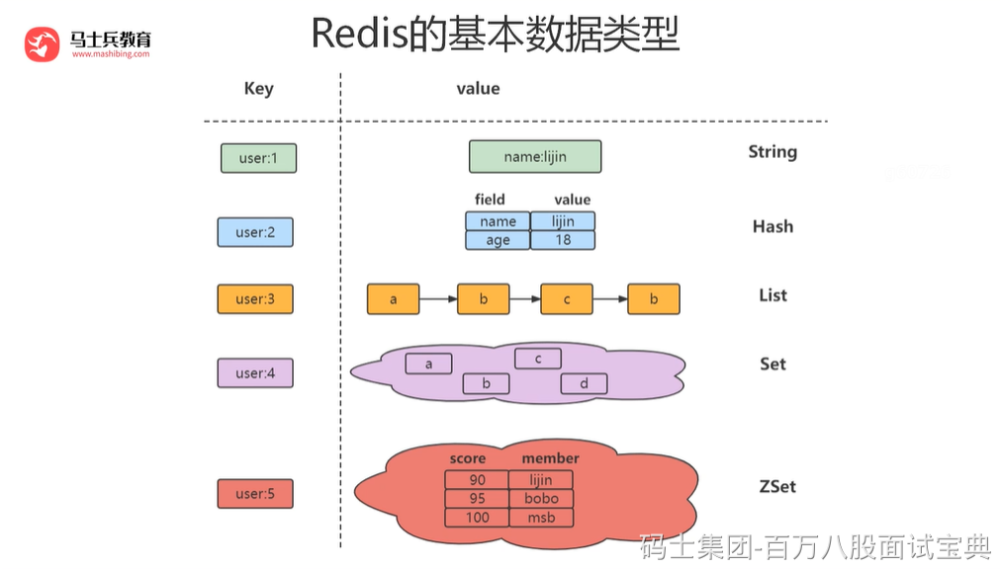

### 字符串（String）

**适合场景**

**缓存功能**

Redis 作为缓存层，MySQL作为存储层，绝大部分请求的数据都是从Redis中获取。由于Redis具有支撑高并发的特性,所以缓存通常能起到加速读写和降低后端压力的作用。

**计数**

使用Redis 作为计数的基础工具，它可以实现快速计数、查询缓存的功能,同时数据可以异步落地到其他数据源。

**共享Session**

一个分布式Web服务将用户的Session信息（例如用户登录信息)保存在各自服务器中，这样会造成一个问题，出于负载均衡的考虑，分布式服务会将用户的访问均衡到不同服务器上，用户刷新一次访问可能会发现需要重新登录，这个问题是用户无法容忍的。

为了解决这个问题,可以使用Redis将用户的Session进行集中管理,，在这种模式下只要保证Redis是高可用和扩展性的,每次用户更新或者查询登录信息都直接从Redis中集中获取。

**限速**

比如，很多应用出于安全的考虑,会在每次进行登录时,让用户输入手机验证码,从而确定是否是用户本人。但是为了短信接口不被频繁访问,会限制用户每分钟获取验证码的频率，例如一分钟不能超过5次。一些网站限制一个IP地址不能在一秒钟之内方问超过n次也可以采用类似的思路。

### 哈希(Hash)

Java里提供了HashMap，Redis中也有类似的数据结构，就是哈希类型。但是要注意，哈希类型中的映射关系叫作field-value，注意这里的value是指field对应的值，不是键对应的值。

**适合场景**

哈希类型比较适宜存放对象类型的数据，我们可以比较下，如果数据库中表记录user为：

|  |  |  |
| --- | --- | --- |
| id | name | age |
| 1 | lijin | 18 |
| 2 | msb | 20 |

**1、使用String类型**

需要一条条去插入获取。

set user:1:name lijin;

set user:1:age 18;

set user:2:name msb;

set user:2:age 20;

**优点：简单直观，每个键对应一个值**

**缺点：键数过多，占用内存多，用户信息过于分散，不用于生产环境**

**2、使用hash类型**

hmset user:1 name lijin age 18

hmset user:2 name msb age 20

优点：简单直观，使用合理可减少内存空间消耗

### 列表（list）

列表( list)类型是用来存储多个有序的字符串，a、b、c、c、b四个元素从左到右组成了一个有序的列表,列表中的每个字符串称为元素(element)，一个列表最多可以存储(2^32-1)个元素(*4294967295*)。


**适合场景**

每个用户有属于自己的文章列表，现需要分页展示文章列表。此时可以考虑使用列表,因为列表不但是有序的,同时支持按照索引范围获取元素。

消息队列，Redis 的 lpush+brpop命令组合即可实现阻塞队列，生产者客户端使用lrpush从列表左侧插入元素，多个消费者客户端使用brpop命令阻塞式的“抢”列表尾部的元素,多个客户端保证了消费的负载均衡和高可用性。

### 集合（set）

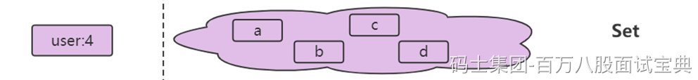

集合( set）类型也是用来保存多个的字符串元素,但和列表类型不一样的是，集合中不允许有重复元素,并且集合中的元素是无序的,不能通过索引下标获取元素。

**适合场景**

集合类型比较典型的使用场景是标签(tag)。例如一个用户可能对娱乐、体育比较感兴趣，另一个用户可能对历史、新闻比较感兴趣，这些兴趣点就是标签。有了这些数据就可以得到喜欢同一个标签的人，以及用户的共同喜好的标签，这些数据对于用户体验以及增强用户黏度比较重要。

例如一个电子商务的网站会对不同标签的用户做不同类型的推荐，比如对数码产品比较感兴趣的人，在各个页面或者通过邮件的形式给他们推荐最新的数码产品，通常会为网站带来更多的利益。

除此之外，集合还可以通过生成随机数进行比如抽奖活动，以及社交图谱等等。

### 有序集合（ZSET）


有序集合相对于哈希、列表、集合来说会有一点点陌生,但既然叫有序集合,那么它和集合必然有着联系,它保留了集合不能有重复成员的特性,但不同的是,有序集合中的元素可以排序。但是它和列表使用索引下标作为排序依据不同的是,它给每个元素设置一个分数( score)作为排序的依据。

有序集合中的元素不能重复，但是score可以重复，就和一个班里的同学学号不能重复,但是考试成绩可以相同。

有序集合提供了获取指定分数和元素范围查询、计算成员排名等功能，合理的利用有序集合，能帮助我们在实际开发中解决很多问题。

有序集合比较典型的使用场景就是排行榜系统。例如视频网站需要对用户上传的视频做排行榜，榜单的维度可能是多个方面的:按照时间、按照播放数量、按照获得的赞数。

## 4、pipeline有什么好处，为什么要用 pipeline？

Redis客户端执行一条命令分为如下4个部分:1）发送命令2）命令排队3）命令执行4）返回结果。


其中1和4花费的时间称为Round Trip Time (RTT,往返时间)，也就是数据在网络上传输的时间。

Redis提供了批量操作命令(例如mget、mset等)，有效地节约RTT。

但大部分命令是不支持批量操作的，例如要执行n次 hgetall命令，并没有mhgetall命令存在，需要消耗n次RTT。

举例：Redis的客户端和服务端可能部署在不同的机器上。例如客户端在本地，Redis服务器在阿里云的广州，两地直线距离约为800公里，那么1次RTT时间=800 x2/ ( 300000×2/3 ) =8毫秒，(光在真空中传输速度为每秒30万公里,这里假设光纤为光速的2/3 )。而Redis命令真正执行的时间通常在微秒(1000微妙=1毫秒)级别，所以才会有Redis 性能瓶颈是网络这样的说法。

Pipeline（流水线)机制能改善上面这类问题,它能将一组 Redis命令进行组装,通过一次RTT传输给Redis,再将这组Redis命令的执行结果按顺序返回给客户端,没有使用Pipeline执行了n条命令,整个过程需要n次RTT。


使用Pipeline 执行了n次命令，整个过程需要1次RTT。


Pipeline并不是什么新的技术或机制，很多技术上都使用过。而且RTT在不同网络环境下会有不同，例如同机房和同机器会比较快，跨机房跨地区会比较慢。

redis-cli的--pipe选项实际上就是使用Pipeline机制，但绝对部分情况下，我们使用Java语言的Redis客户端中的Pipeline会更多一点。

代码参见：

```plain
com.msb.redis.adv.RedisPipeline
```

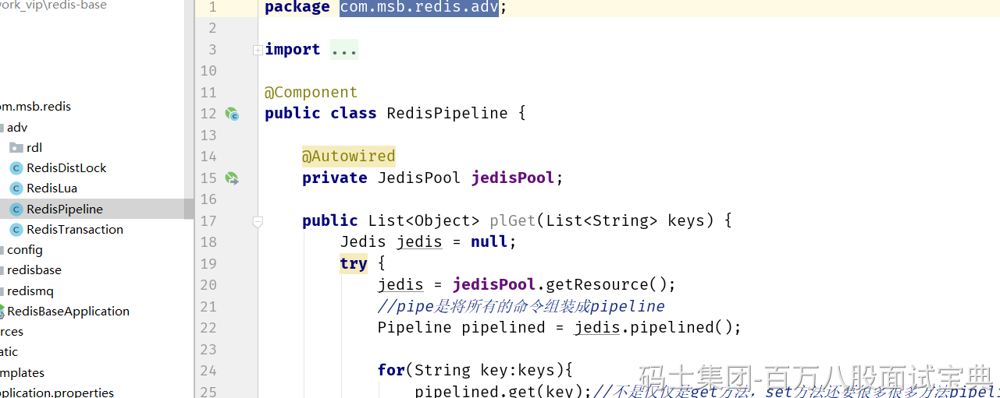

总的来说，在不同网络环境下非Pipeline和Pipeline执行10000次set操作的效果，在执行时间上的比对如下：


差距有100多倍，可以得到如下两个结论:

1、Pipeline执行速度一般比逐条执行要快。

2、客户端和服务端的网络延时越大，Pipeline的效果越明显。

## 5、Redis 持久化方式有哪些？以及有什么区别？

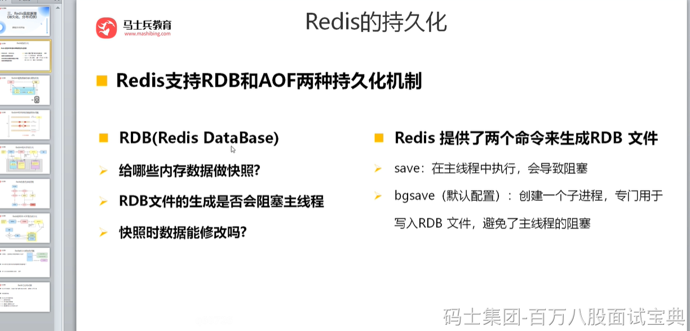

Redis 提供两种持久化机制 RDB 和 AOF 机制:

### RDB

RDB持久化是把当前进程数据生成快照保存到硬盘的过程。所谓内存快照，就是指内存中的数据在某一个时刻的状态记录。这就类似于照片，当你给朋友拍照时，一张照片就能把朋友一瞬间的形象完全记下来。RDB 就是Redis DataBase 的缩写。

**优点：**  
只有一个文件 dump.rdb ，方便持久化。  
容灾性好，一个文件可以保存到安全的磁盘。  
性能最大化，fork 子进程来完成写操作，让主进程继续处理命令，所以是 IO 最大化。

相对于数据集大时，比AOF的启动效率更高。

**缺点：**

数据安全性低。 RDB是间隔一段时间进行持久化，如果持久化之间Redis发生故障，会发生数据丢失。所以这种方式更适合数据要求不严谨的时候。

### AOF

AOF(append only file)持久化:以独立日志的方式记录每次写命令，重启时再重新执行AOF文件中的命令达到恢复数据的目的。AOF的主要作用是解决了数据持久化的实时性,目前已经是Redis持久化的主流方式。

**缺点：**  
（1） AOF 文件比 RDB 文件大，且恢复速度慢。  
（2）数据集大的时候，比 RDB 启动效率低

## 6、什么是Redis事务？原理是什么？

Redis 中的事务是一组命令的集合，是 Redis 的最小执行单位。它可以保证一次执行多个命令，每  
个事务是一个单独的隔离操作，事务中的所有命令都会序列化、按顺序地执行。服务端在执行事务  
的过程中，不会被其他客户端发送来的命令请求打断。  
它的原理是先将属于一个事务的命令发送给 Redis，然后依次执行这些命令。

Redis 事务的注意点有哪些？  
需要注意的点有：

Redis 事务是不支持回滚的，不像 MySQL 的事务一样，要么都执行要么都不执行；

Redis 服务端在执行事务的过程中，不会被其他客户端发送来的命令请求打断。直到事务命令  
全部执行完毕才会执行其他客户端的命令。

Redis 事务为什么不支持回滚？

Redis 的事务不支持回滚，但是执行的命令有语法错误，Redis 会执行失败，这些问题可以从程序层  
面捕获并解决。但是如果出现其他问题，则依然会继续执行余下的命令。这样做的原因是因为回滚  
需要增加很多工作，而不支持回滚则可以保持简单、快速的特性。

### 事务

大家应该对事务比较了解，简单地说，事务表示一组动作，要么全部执行，要么全部不执行。

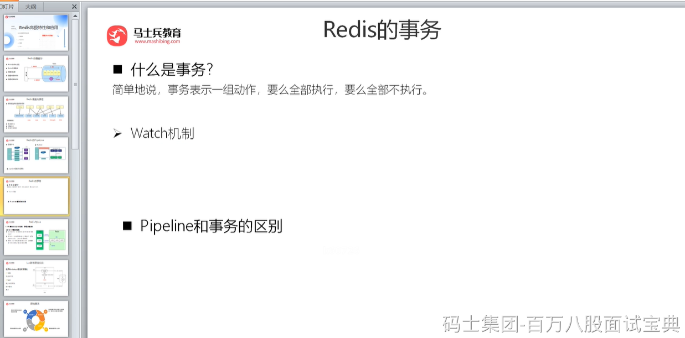

例如在社交网站上用户A关注了用户B，那么需要在用户A的关注表中加入用户B，并且在用户B的粉丝表中添加用户A，这两个行为要么全部执行，要么全部不执行,否则会出现数据不一致的情况。

Redis提供了简单的事务功能，将一组需要一起执行的命令放到multi和exec两个命令之间。multi 命令代表事务开始，exec命令代表事务结束。另外discard命令是回滚。

一个客户端

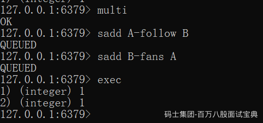

另外一个客户端

在事务没有提交的时查询（查不到数据）


在事务提交后查询（可以查到数据）

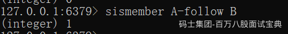

可以看到sadd命令此时的返回结果是QUEUED，代表命令并没有真正执行，而是暂时保存在Redis中的一个缓存队列（所以discard也只是丢弃这个缓存队列中的未执行命令，并不会回滚已经操作过的数据，这一点要和关系型数据库的Rollback操作区分开）。

只有当exec执行后，用户A关注用户B的行为才算完成，如下所示exec返回的两个结果对应sadd命令。

**但是要注意Redis的事务功能很弱。在事务回滚机制上，Redis只能对基本的语法错误进行判断。**

如果事务中的命令出现错误,Redis 的处理机制也不尽相同。

1、语法命令错误

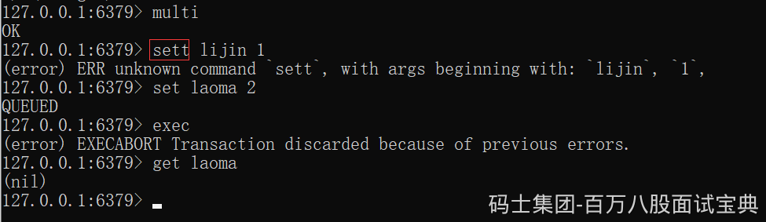

例如下面操作错将set写成了sett，属于语法错误，会造成整个事务无法执行，事务内的操作都没有执行:

2、运行时错误

例如：事务内第一个命令简单的设置一个string类型，第二个对这个key进行sadd命令，这种就是运行时命令错误，因为语法是正确的:


可以看到Redis并不支持回滚功能，第一个set命令已经执行成功,开发人员需要自己修复这类问题。

### **Redis的事务原理**

事务是Redis实现在服务器端的行为，用户执行MULTI命令时，服务器会将对应这个用户的客户端对象设置为一个特殊的状态，在这个状态下后续用户执行的查询命令不会被真的执行，而是被服务器缓存起来，直到用户执行EXEC命令为止，服务器会将这个用户对应的客户端对象中缓存的命令按照提交的顺序依次执行。

## 7、如何在100个亿URL中快速判断某URL是否存在？

##### 传统数据结构的不足

当然有人会想，我直接将网页URL存入数据库进行查找不就好了，或者建立一个哈希表进行查找不就OK了。

当数据量小的时候，这么思考是对的，

确实可以将值映射到 HashMap 的 Key，然后可以在 O(1) 的时间复杂度内返回结果，效率奇高。但是 HashMap 的实现也有缺点，例如存储容量占比高，考虑到负载因子的存在，通常空间是不能被用满的，举个例子如果一个1000万HashMap，Key=String（长度不超过16字符，且重复性极小），Value=Integer，会占据多少空间呢？1.2个G。实际上，1000万个int型，只需要40M左右空间，占比3%，1000万个Integer，需要161M左右空间，占比13.3%。可见一旦你的值很多例如上亿的时候，那HashMap 占据的内存大小就变得很可观了。

但如果整个网页黑名单系统包含100亿个网页URL，在数据库查找是很费时的，并且如果每个URL空间为64B，那么需要内存为640GB，一般的服务器很难达到这个需求。

#### 布隆过滤器

##### 布隆过滤器简介


**1970 年布隆提出了一种布隆过滤器的算法，用来判断一个元素是否在一个集合中。****这种算法由一个二进制数组和一个 Hash 算法组成。**

本质上布隆过滤器是一种数据结构，比较巧妙的概率型数据结构（probabilistic data structure），特点是高效地插入和查询，可以用来告诉你 “某样东西一定不存在或者可能存在”。

相比于传统的 List、Set、Map 等数据结构，它更高效、占用空间更少，但是缺点是其返回的结果是概率性的，而不是确切的。

实际上，布隆过滤器广泛应用于网页黑名单系统、垃圾邮件过滤系统、爬虫网址判重系统等，Google 著名的分布式数据库 Bigtable 使用了布隆过滤器来查找不存在的行或列，以减少磁盘查找的IO次数，Google Chrome浏览器使用了布隆过滤器加速安全浏览服务。

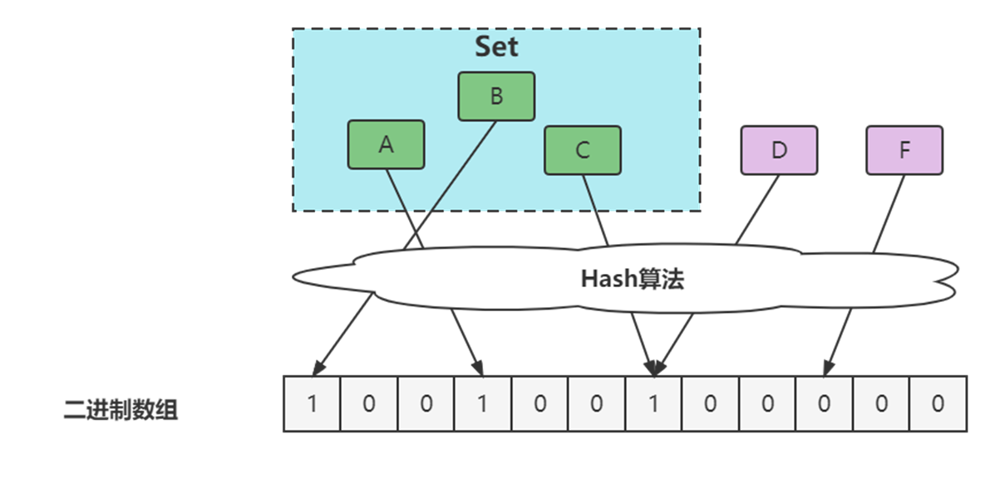

##### 布隆过滤器的误判问题

Ø通过hash计算在数组上不一定在集合

Ø本质是hash冲突

Ø通过hash计算不在数组的一定不在集合（误判）

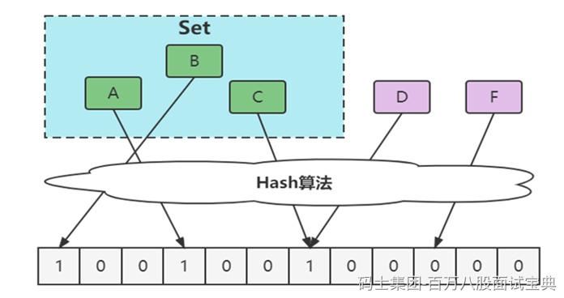

**优化方案**

增大数组(预估适合值)

增加hash函数


## 8、统计高并发网站每个网页每天的 UV 数据，结合Redis你会如何实现？

### 方案：HyperLogLog


如果统计 PV 那非常好办，给每个网页一个独立的 Redis 计数器就可以了，这个计数器的 key 后缀加上当天的日期。这样来一个请求，incrby 一次，最终就可以统计出所有的 PV 数据。

但是 UV 不一样，它要去重，同一个用户一天之内的多次访问请求只能计数一次。这就要求每一个网页请求都需要带上用户的 ID，无论是登陆用户还是未登陆用户都需要一个唯一 ID 来标识。

一个简单的方案，那就是为每一个页面一个独立的 set 集合来存储所有当天访问过此页面的用户 ID。当一个请求过来时，我们使用 sadd 将用户 ID 塞进去就可以了。通过 scard 可以取出这个集合的大小，这个数字就是这个页面的 UV 数据。

但是，如果你的页面访问量非常大，比如一个爆款页面几千万的 UV，你需要一个很大的 set集合来统计，这就非常浪费空间。如果这样的页面很多，那所需要的存储空间是惊人的。为这样一个去重功能就耗费这样多的存储空间，值得么？其实需要的数据又不需要太精确，105w 和 106w 这两个数字对于老板们来说并没有多大区别，So，有没有更好的解决方案呢？

这就是HyperLogLog的用武之地，Redis 提供了 HyperLogLog 数据结构就是用来解决这种统计问题的。HyperLogLog 提供不精确的去重计数方案，虽然不精确但是也不是非常不精确，Redis官方给出标准误差是0.81%，这样的精确度已经可以满足上面的UV 统计需求了。

## 9、说一说Redis的Key和Value的数据结构组织?

### 全局哈希表

为了实现从键到值的快速访问，Redis 使用了一个哈希表来保存所有键值对。一个哈希表，其实就是一个数组，数组的每个元素称为一个哈希桶。所以，我们常说，一个哈希表是由多个哈希桶组成的，每个哈希桶中保存了键值对数据。

哈希桶中的 entry 元素中保存了*key和*value指针，分别指向了实际的键和值，这样一来，即使值是一个集合，也可以通过\*value指针被查找到。因为这个哈希表保存了所有的键值对，所以，我也把它称为全局哈希表。

哈希表的最大好处很明显，就是让我们可以用 O(1) 的时间复杂度来快速查找到键值对：我们只需要计算键的哈希值，就可以知道它所对应的哈希桶位置，然后就可以访问相应的 entry 元素。

但当你往 Redis 中写入大量数据后，就可能发现操作有时候会突然变慢了。这其实是因为你忽略了一个潜在  
的风险点，那就是哈希表的冲突问题和 rehash 可能带来的操作阻塞。

当你往哈希表中写入更多数据时，哈希冲突是不可避免的问题。这里的哈希冲突，两个 key 的哈希值和哈希桶计算对应关系时，正好落在了同一个哈希桶中。

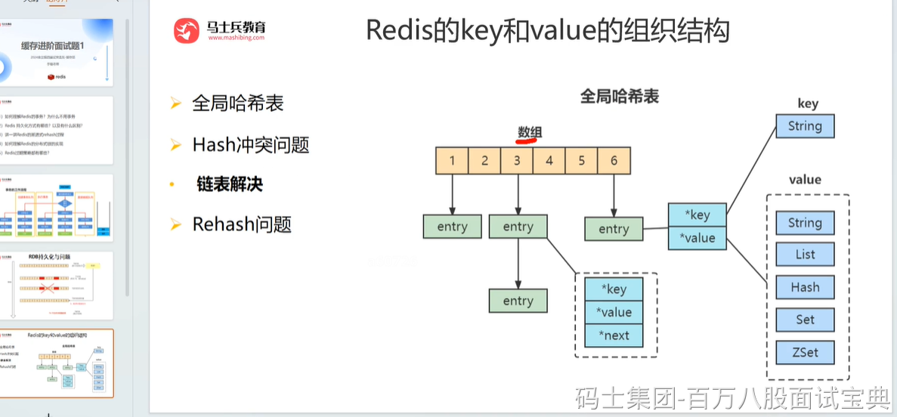

Redis 解决哈希冲突的方式，就是链式哈希。链式哈希也很容易理解，就是指同一个哈希桶中的多个元素用一个链表来保存，它们之间依次用指针连接。

## 10、渐进式rehash听过没？讲一讲！

Redis是当然如果这个数组一直不变，那么hash冲突会变很多，这个时候检索效率会大打折扣，所以Redis就需要把数组进行扩容（一般是扩大到原来的两倍），但是问题来了，扩容后每个hash桶的数据会分散到不同的位置，这里设计到元素的移动，必定会阻塞IO，所以这个ReHash过程会导致很多请求阻塞。

### 渐进式rehash

为了避免这个问题，Redis 采用了渐进式 rehash。

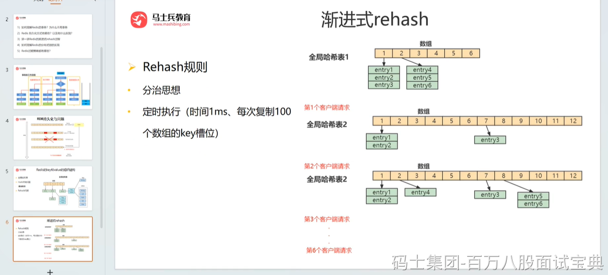

首先、Redis 默认使用了两个全局哈希表：哈希表 1 和哈希表 2。一开始，当你刚插入数据时，默认使用哈希表 1，此时的哈希表 2 并没有被分配空间。随着数据逐步增多，Redis 开始执行 rehash。

1、给哈希表 2 分配更大的空间，例如是当前哈希表 1 大小的两倍

2、把哈希表 1 中的数据重新映射并拷贝到哈希表 2 中

3、释放哈希表 1 的空间

在上面的第二步涉及大量的数据拷贝，如果一次性把哈希表 1 中的数据都迁移完，会造成 Redis 线程阻塞，无法服务其他请求。此时，Redis 就无法快速访问数据了。

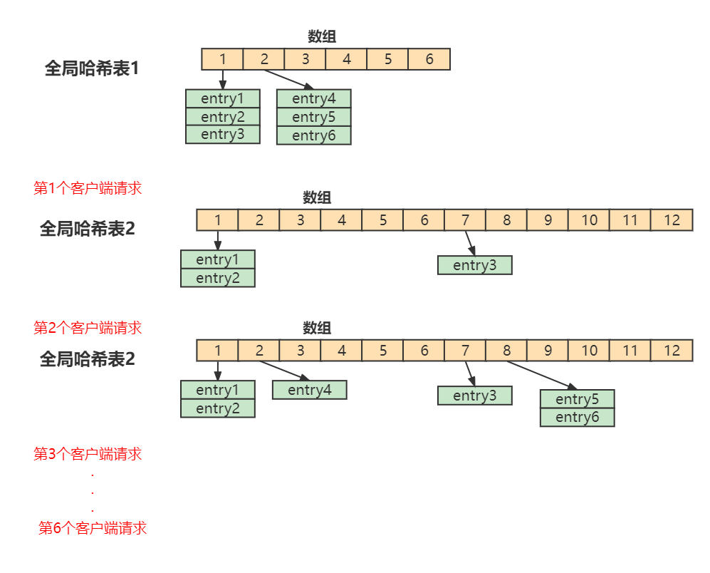

在Redis 开始执行 rehash，Redis仍然正常处理客户端请求，但是要加入一个额外的处理：

处理第1个请求时，把哈希表 1中的第1个索引位置上的所有 entries 拷贝到哈希表 2 中

处理第2个请求时，把哈希表 1中的第2个索引位置上的所有 entries 拷贝到哈希表 2 中

如此循环，直到把所有的索引位置的数据都拷贝到哈希表 2 中。

这样就巧妙地把一次性大量拷贝的开销，分摊到了多次处理请求的过程中，避免了耗时操作，保证了数据的快速访问。

所以这里基本上也可以确保根据key找value的操作在O（1）左右。

## 11、讲一讲Redis分布式锁的实现

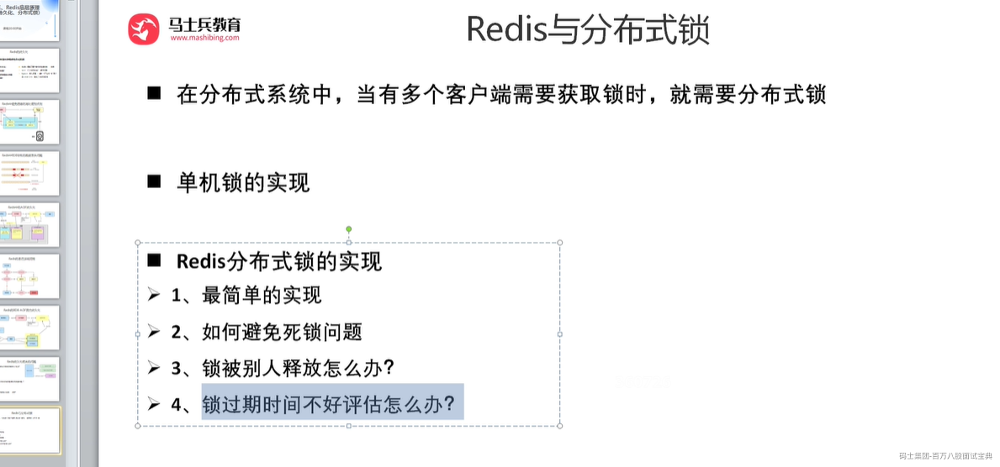

### Redis分布式锁最简单的实现

想要实现分布式锁，必须要求 Redis 有「互斥」的能力，我们可以使用 SETNX 命令，这个命令表示SET if Not Exists，即如果 key 不存在，才会设置它的值，否则什么也不做。

两个客户端进程可以执行这个命令，达到互斥，就可以实现一个分布式锁。

客户端 1 申请加锁，加锁成功：

客户端 2 申请加锁，因为它后到达，加锁失败：

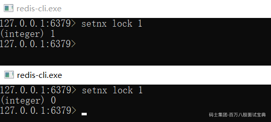

此时，加锁成功的客户端，就可以去操作「共享资源」，例如，修改 MySQL 的某一行数据，或者调用一个 API 请求。

操作完成后，还要及时释放锁，给后来者让出操作共享资源的机会。如何释放锁呢？

也很简单，直接使用 DEL 命令删除这个 key 即可，这个逻辑非常简单。

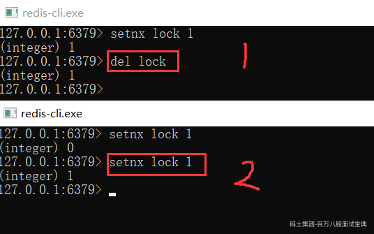

但是，它存在一个很大的问题，当客户端 1 拿到锁后，如果发生下面的场景，就会造成「死锁」：

1、程序处理业务逻辑异常，没及时释放锁

2、进程挂了，没机会释放锁

这时，这个客户端就会一直占用这个锁，而其它客户端就「永远」拿不到这把锁了。怎么解决这个问题呢？

### 如何避免死锁？

我们很容易想到的方案是，在申请锁时，给这把锁设置一个「租期」。

在 Redis 中实现时，就是给这个 key 设置一个「过期时间」。这里我们假设，操作共享资源的时间不会超过 10s，那么在加锁时，给这个 key 设置 10s 过期即可：

```plain
SETNX lock 1    // 加锁
EXPIRE lock 10  // 10s后自动过期
```

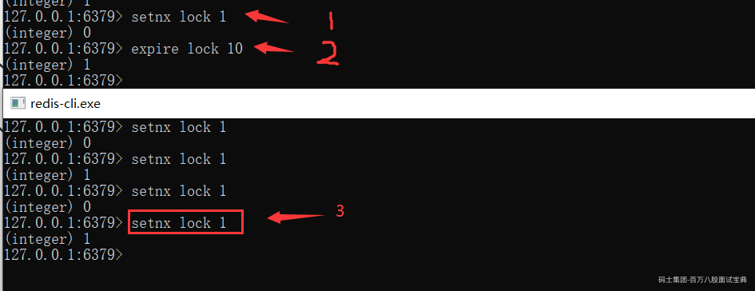

这样一来，无论客户端是否异常，这个锁都可以在 10s 后被「自动释放」，其它客户端依旧可以拿到锁。

但现在还是有问题：

现在的操作，加锁、设置过期是 2 条命令，有没有可能只执行了第一条，第二条却「来不及」执行的情况发生呢？例如：

- SETNX 执行成功，执行EXPIRE 时由于网络问题，执行失败

- SETNX 执行成功，Redis 异常宕机，EXPIRE 没有机会执行

- SETNX 执行成功，客户端异常崩溃，EXPIRE也没有机会执行

总之，这两条命令不能保证是原子操作（一起成功），就有潜在的风险导致过期时间设置失败，依旧发生「死锁」问题。

在 Redis 2.6.12 之后，Redis 扩展了 SET 命令的参数，用这一条命令就可以了：

```plain
SET lock 1 EX 10 NX
```

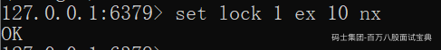

### 锁被别人释放怎么办？

上面的命令执行时，每个客户端在释放锁时，都是「无脑」操作，并没有检查这把锁是否还「归自己持有」，所以就会发生释放别人锁的风险，这样的解锁流程，很不「严谨」！如何解决这个问题呢？

解决办法是：客户端在加锁时，设置一个只有自己知道的「唯一标识」进去。

例如，可以是自己的线程 ID，也可以是一个 UUID（随机且唯一），这里我们以UUID 举例：

```plain
SET lock $uuid EX 20 NX
```

之后，在释放锁时，要先判断这把锁是否还归自己持有，伪代码可以这么写：

```plain
if redis.get("lock") == $uuid:
    redis.del("lock")
```

这里释放锁使用的是 GET + DEL 两条命令，这时，又会遇到我们前面讲的原子性问题了。这里可以使用lua脚本来解决。

安全释放锁的 Lua 脚本如下：

```plain
if redis.call("GET",KEYS[1]) == ARGV[1]
then
    return redis.call("DEL",KEYS[1])
else
    return 0
end
```

好了，这样一路优化，整个的加锁、解锁的流程就更「严谨」了。

这里我们先小结一下，基于 Redis 实现的分布式锁，一个严谨的的流程如下：

1、加锁

```plain
SET lock_key $unique_id EX $expire_time NX
```

2、操作共享资源

3、释放锁：Lua 脚本，先 GET 判断锁是否归属自己，再DEL 释放锁

### Java代码实现分布式锁

```plain
package com.msb.redis.lock;

import org.springframework.beans.factory.annotation.Autowired;
import org.springframework.stereotype.Component;
import redis.clients.jedis.Jedis;
import redis.clients.jedis.JedisPool;
import redis.clients.jedis.params.SetParams;

import java.util.Arrays;
import java.util.UUID;
import java.util.concurrent.TimeUnit;
import java.util.concurrent.locks.Condition;
import java.util.concurrent.locks.Lock;

/**
 * 分布式锁的实现
 */
@Component
public class RedisDistLock implements Lock {

    private final static int LOCK_TIME = 5*1000;
    private final static String RS_DISTLOCK_NS = "tdln:";
    /*
     if redis.call('get',KEYS[1])==ARGV[1] then
        return redis.call('del', KEYS[1])
    else return 0 end
     */
    private final static String RELEASE_LOCK_LUA =
            "if redis.call('get',KEYS[1])==ARGV[1] then\n" +
                    "        return redis.call('del', KEYS[1])\n" +
                    "    else return 0 end";
    /*保存每个线程的独有的ID值*/
    private ThreadLocal<String> lockerId = new ThreadLocal<>();

    /*解决锁的重入*/
    private Thread ownerThread;
    private String lockName = "lock";

    @Autowired
    private JedisPool jedisPool;

    public String getLockName() {
        return lockName;
    }

    public void setLockName(String lockName) {
        this.lockName = lockName;
    }

    public Thread getOwnerThread() {
        return ownerThread;
    }

    public void setOwnerThread(Thread ownerThread) {
        this.ownerThread = ownerThread;
    }

    @Override
    public void lock() {
        while(!tryLock()){
            try {
                Thread.sleep(100);
            } catch (InterruptedException e) {
                e.printStackTrace();
            }
        }
    }

    @Override
    public void lockInterruptibly() throws InterruptedException {
        throw new UnsupportedOperationException("不支持可中断获取锁！");
    }

    @Override
    public boolean tryLock() {
        Thread t = Thread.currentThread();
        if(ownerThread==t){/*说明本线程持有锁*/
            return true;
        }else if(ownerThread!=null){/*本进程里有其他线程持有分布式锁*/
            return false;
        }
        Jedis jedis = null;
        try {
            String id = UUID.randomUUID().toString();
            SetParams params = new SetParams();
            params.px(LOCK_TIME);
            params.nx();
            synchronized (this){/*线程们，本地抢锁*/
                if((ownerThread==null)&&
                "OK".equals(jedis.set(RS_DISTLOCK_NS+lockName,id,params))){
                    lockerId.set(id);
                    setOwnerThread(t);
                    return true;
                }else{
                    return false;
                }
            }
        } catch (Exception e) {
            throw new RuntimeException("分布式锁尝试加锁失败！");
        } finally {
            jedis.close();
        }
    }

    @Override
    public boolean tryLock(long time, TimeUnit unit) throws InterruptedException {
        throw new UnsupportedOperationException("不支持等待尝试获取锁！");
    }

    @Override
    public void unlock() {
        if(ownerThread!=Thread.currentThread()) {
            throw new RuntimeException("试图释放无所有权的锁！");
        }
        Jedis jedis = null;
        try {
            jedis = jedisPool.getResource();
            Long result = (Long)jedis.eval(RELEASE_LOCK_LUA,
                    Arrays.asList(RS_DISTLOCK_NS+lockName),
                    Arrays.asList(lockerId.get()));
            if(result.longValue()!=0L){
                System.out.println("Redis上的锁已释放！");
            }else{
                System.out.println("Redis上的锁释放失败！");
            }
        } catch (Exception e) {
            throw new RuntimeException("释放锁失败！",e);
        } finally {
            if(jedis!=null) jedis.close();
            lockerId.remove();
            setOwnerThread(null);
            System.out.println("本地锁所有权已释放！");
        }
    }

    @Override
    public Condition newCondition() {
        throw new UnsupportedOperationException("不支持等待通知操作！");
    }

}

```

### 锁过期时间不好评估怎么办？

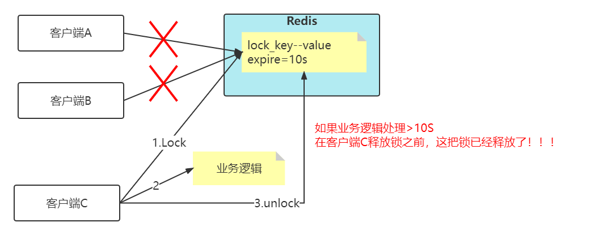

看上面这张图，加入key的失效时间是10s，但是客户端C在拿到分布式锁之后，然后业务逻辑执行超过10s，那么问题来了，在客户端C释放锁之前，其实这把锁已经失效了，那么客户端A和客户端B都可以去拿锁，这样就已经失去了分布式锁的功能了！！！

比较简单的妥协方案是，尽量「冗余」过期时间，降低锁提前过期的概率，但是这个并不能完美解决问题，那怎么办呢？

#### 分布式锁加入看门狗

加锁时，先设置一个过期时间，然后我们开启一个「守护线程」，定时去检测这个锁的失效时间，如果锁快要过期了，操作共享资源还未完成，那么就自动对锁进行「续期」，重新设置过期时间。

这个守护线程我们一般也把它叫做「看门狗」线程。

为什么要使用守护线程：

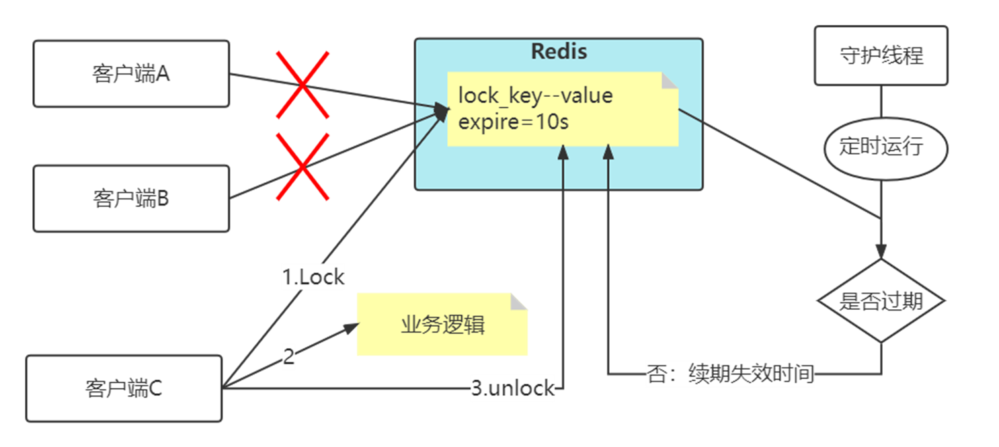

#### 分布式锁加入看门狗代码实现

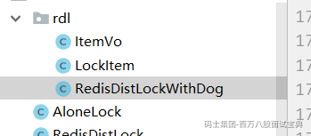

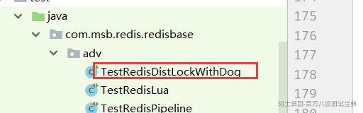

运行效果：

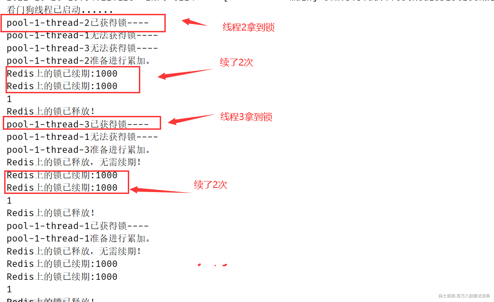

### Redisson中的分布式锁

Redisson把这些工作都封装好了

```plain
     <dependency>
            <groupId>org.redisson</groupId>

            <artifactId>redisson</artifactId>

            <version>3.12.3</version>

        </dependency>

```

```plain
package com.msb.redis.config;

import org.redisson.Redisson;
import org.redisson.api.RedissonClient;
import org.redisson.config.Config;
import org.springframework.context.annotation.Bean;
import org.springframework.context.annotation.Configuration;

@Configuration
public class MyRedissonConfig {
    /**
     * 所有对Redisson的使用都是通过RedissonClient
     */
    @Bean(destroyMethod="shutdown")
    public RedissonClient redisson(){
        //1、创建配置
        Config config = new Config();
        config.useSingleServer().setAddress("redis://127.0.0.1:6379");

        //2、根据Config创建出RedissonClient实例
        RedissonClient redisson = Redisson.create(config);
        return redisson;
    }
}

```

```plain
package com.msb.redis.redisbase.adv;

import com.msb.redis.lock.rdl.RedisDistLockWithDog;
import org.junit.jupiter.api.Test;
import org.redisson.Redisson;
import org.redisson.api.RLock;
import org.redisson.api.RedissonClient;
import org.redisson.config.Config;
import org.springframework.beans.factory.annotation.Autowired;
import org.springframework.boot.test.context.SpringBootTest;

import java.util.concurrent.CountDownLatch;
import java.util.concurrent.ExecutorService;
import java.util.concurrent.Executors;
import java.util.concurrent.TimeUnit;

@SpringBootTest
public class TestRedissionLock {

    private int count = 0;
    @Autowired
    private RedissonClient redisson;

    @Test
    public void testLockWithDog() throws InterruptedException {
        int clientCount =3;
        RLock lock = redisson.getLock("RD-lock");
        CountDownLatch countDownLatch = new CountDownLatch(clientCount);
        ExecutorService executorService = Executors.newFixedThreadPool(clientCount);
        for (int i = 0;i<clientCount;i++){
            executorService.execute(() -> {
                try {
                    lock.lock(10, TimeUnit.SECONDS);
                    System.out.println(Thread.currentThread().getName()+"准备进行累加。");
                    Thread.sleep(2000);
                    count++;
                } catch (InterruptedException e) {
                    e.printStackTrace();
                } finally {
                    lock.unlock();
                }
                countDownLatch.countDown();
            });
        }
        countDownLatch.await();
        System.out.println(count);
    }
}

```

<https://github.com/redisson/redisson/>

<https://redisson.org/>

锁过期时间不好评估怎么办？

## 12、Redlock听过没？讲一讲！


Redis 作者提出的 Redlock方案，是如何解决主从切换后，锁失效问题的。

**Redlock 的方案基于一个前提：**

不再需要部署从库和哨兵实例，只部署主库；但主库要部署多个，官方推荐至少 5 个实例。

**注意：不是部署 Redis Cluster，就是部署 5 个简单的 Redis 实例。它们之间没有任何关系，都是一个个孤立的实例。**

做完之后，我们看官网代码怎么去用的：

[8. 分布式锁和同步器 · redisson/redisson Wiki · GitHub](https://github.com/redisson/redisson/wiki/8.-%E5%88%86%E5%B8%83%E5%BC%8F%E9%94%81%E5%92%8C%E5%90%8C%E6%AD%A5%E5%99%A8#84-%E7%BA%A2%E9%94%81redlock)

**8.4. 红锁（RedLock）**

基于Redis的Redisson红锁 `RedissonRedLock`对象实现了[Redlock](http://redis.cn/topics/distlock.html)介绍的加锁算法。该对象也可以用来将多个 `RLock`对象关联为一个红锁，每个 `RLock`对象实例可以来自于不同的Redisson实例。

```java
RLock lock1 = redissonInstance1.getLock("lock1");
RLock lock2 = redissonInstance2.getLock("lock2");
RLock lock3 = redissonInstance3.getLock("lock3");

RedissonRedLock lock = new RedissonRedLock(lock1, lock2, lock3);
// 同时加锁：lock1 lock2 lock3
// 红锁在大部分节点上加锁成功就算成功。
lock.lock();
...
lock.unlock();
```

大家都知道，如果负责储存某些分布式锁的某些Redis节点宕机以后，而且这些锁正好处于锁住的状态时，这些锁会出现锁死的状态。为了避免这种情况的发生，Redisson内部提供了一个监控锁的看门狗，它的作用是在Redisson实例被关闭前，不断的延长锁的有效期。默认情况下，看门狗的检查锁的超时时间是30秒钟，也可以通过修改[Config.lockWatchdogTimeout](https://github.com/redisson/redisson/wiki/2.-%E9%85%8D%E7%BD%AE%E6%96%B9%E6%B3%95#lockwatchdogtimeout%E7%9B%91%E6%8E%A7%E9%94%81%E7%9A%84%E7%9C%8B%E9%97%A8%E7%8B%97%E8%B6%85%E6%97%B6%E5%8D%95%E4%BD%8D%E6%AF%AB%E7%A7%92)来另行指定。

另外Redisson还通过加锁的方法提供了 `leaseTime`的参数来指定加锁的时间。超过这个时间后锁便自动解开了。

```java
RedissonRedLock lock = new RedissonRedLock(lock1, lock2, lock3);
// 给lock1，lock2，lock3加锁，如果没有手动解开的话，10秒钟后将会自动解开
lock.lock(10, TimeUnit.SECONDS);

// 为加锁等待100秒时间，并在加锁成功10秒钟后自动解开
boolean res = lock.tryLock(100, 10, TimeUnit.SECONDS);
...
lock.unlock();
```

### Redlock实现整体流程

1、客户端先获取「当前时间戳T1」

2、客户端依次向这 5 个 Redis 实例发起加锁请求

3、如果客户端从 >=3 个（大多数）以上Redis 实例加锁成功，则再次获取「当前时间戳T2」，如果 T2 - T1 &#x3c; 锁的过期时间，此时，认为客户端加锁成功，否则认为加锁失败。

4、加锁成功，去操作共享资源

5、加锁失败/释放锁，向「全部节点」发起释放锁请求。

所以总的来说：客户端在多个 Redis 实例上申请加锁；必须保证大多数节点加锁成功；大多数节点加锁的总耗时，要小于锁设置的过期时间；释放锁，要向全部节点发起释放锁请求。

**我们来看 Redlock 为什么要这么做？**

1. **为什么要在多个实例上加锁？**

本质上是为了「容错」，部分实例异常宕机，剩余的实例加锁成功，整个锁服务依旧可用。

2. **为什么大多数加锁成功，才算成功？**

多个 Redis 实例一起来用，其实就组成了一个「分布式系统」。在分布式系统中，总会出现「异常节点」，所以，在谈论分布式系统问题时，需要考虑异常节点达到多少个，也依旧不会影响整个系统的「正确性」。

这是一个分布式系统「容错」问题，这个问题的结论是：如果只存在「故障」节点，只要大多数节点正常，那么整个系统依旧是可以提供正确服务的。

3. **为什么步骤 3 加锁成功后，还要计算加锁的累计耗时？**

因为操作的是多个节点，所以耗时肯定会比操作单个实例耗时更久，而且，因为是网络请求，网络情况是复杂的，有可能存在延迟、丢包、超时等情况发生，网络请求越多，异常发生的概率就越大。

所以，即使大多数节点加锁成功，但如果加锁的累计耗时已经「超过」了锁的过期时间，那此时有些实例上的锁可能已经失效了，这个锁就没有意义了。

4. **为什么释放锁，要操作所有节点？**

在某一个 Redis 节点加锁时，可能因为「网络原因」导致加锁失败。

例如，客户端在一个 Redis 实例上加锁成功，但在读取响应结果时，网络问题导致读取失败，那这把锁其实已经在 Redis 上加锁成功了。

所以，释放锁时，不管之前有没有加锁成功，需要释放「所有节点」的锁，以保证清理节点上「残留」的锁。

好了，明白了 Redlock 的流程和相关问题，看似Redlock 确实解决了 Redis 节点异常宕机锁失效的问题，保证了锁的「安全性」。

但事实真的如此吗？

### RedLock的是是非非

一个分布式系统，更像一个复杂的「野兽」，存在着你想不到的各种异常情况。

这些异常场景主要包括三大块，这也是分布式系统会遇到的三座大山：NPC。

N：Network Delay，网络延迟

P：Process Pause，进程暂停（GC）

C：Clock Drift，时钟漂移

比如一个进程暂停（GC）的例子

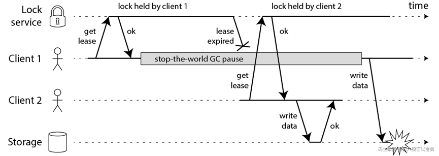

1）客户端 1 请求锁定节点 A、B、C、D、E

2）客户端 1 的拿到锁后，进入 GC（时间比较久）

3）所有 Redis 节点上的锁都过期了

4）客户端 2 获取到了 A、B、C、D、E 上的锁

5）客户端 1 GC 结束，认为成功获取锁

6）客户端 2 也认为获取到了锁，发生「冲突」

GC 和网络延迟问题：这两点可以在红锁实现流程的第3步来解决这个问题。

但是最核心的还是时钟漂移，因为时钟漂移，就有可能导致第3步的判断本身就是一个BUG，所以当多个 Redis 节点「时钟」发生问题时，也会导致 Redlock 锁失效。

### RedLock总结

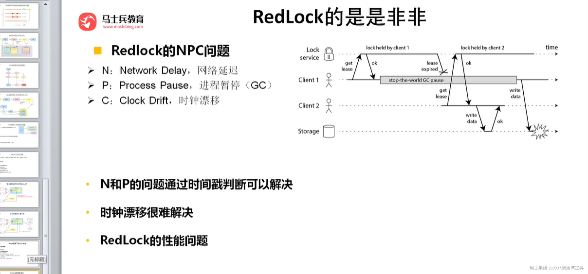

Redlock 只有建立在「时钟正确」的前提下，才能正常工作，如果你可以保证这个前提，那么可以拿来使用。

但是时钟偏移在现实中是存在的：

第一，从硬件角度来说，时钟发生偏移是时有发生，无法避免。例如，CPU 温度、机器负载、芯片材料都是有可能导致时钟发生偏移的。

第二，人为错误也是很难完全避免的。

所以，Redlock尽量不用它，而且它的性能不如单机版 Redis，部署成本也高，优先考虑使用主从+ 哨兵的模式  
实现分布式锁（只会有很小的记录发生主从切换时的锁丢失问题）。

## 13、什么是缓存击穿？该如何解决


缓存击穿是指一个Key非常热点，在不停的扛着大并发，大并发集中对这一个点进行访问，当这个Key在失效的瞬间，持续的大并发就穿破缓存，直接请求数据库，就像在一个完好无损的桶上凿开了一个洞。

缓存击穿的话，设置热点数据永远不过期。或者加上互斥锁就能搞定了。

**使用互斥锁**

业界比较常用的做法，是使用mutex。简单地来说，就是在缓存失效的时候（判断拿出来的值为空），不是立即去load db，而是先使用缓存工具的某些带成功操作返回值的操作（比如Redis的SETNX）去set一个mutex key，当操作返回成功时，再进行load db的操作并回设缓存；否则，就重试整个get缓存的方法。

伪代码如下图：

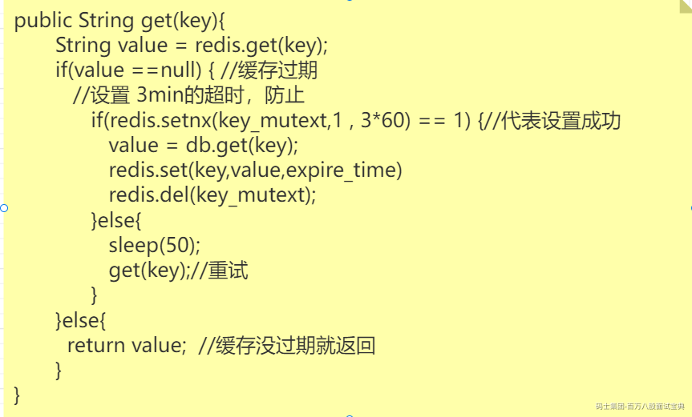

**永远不过期**

这里的“永远不过期”包含两层意思：

(1) 从redis上看，确实没有设置过期时间，这就保证了，不会出现热点key过期问题，也就是“物理”不过期。

(2) 从功能上看，如果不过期，那不就成静态的了吗？所以我们把过期时间存在key对应的value里，如果发现要过期了，通过一个后台的异步线程进行缓存的构建，也就是“逻辑”过期

从实战看，这种方法对于性能非常友好，唯一不足的就是构建缓存时候，其余线程(非构建缓存的线程)可能访问的是老数据，但是对于一般的互联网功能来说这个还是可以忍受。

## 14、什么是缓存穿透？该如何解决

**缓存穿透**

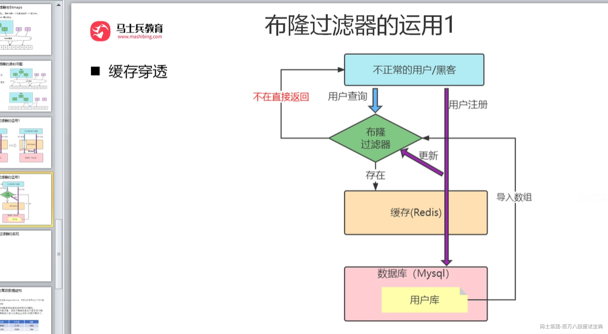

是指查询一个根本不存在的数据，缓存层和存储层都不会命中，于是这个请求就可以随意访问数据库，这个就是缓存穿透，缓存穿透将导致不存在的数据每次请求都要到存储层去查询，失去了缓存保护后端存储的意义。

**造成缓存穿透的基本原因有两个。**

第一，自身业务代码或者数据出现问题，比如，我们数据库的 id 都是1开始自增上去的，如发起为id值为 -1 的数据或 id 为特别大不存在的数据。如果不对参数做校验，数据库id都是大于0的，我一直用小于0的参数去请求你，每次都能绕开Redis直接打到数据库，数据库也查不到，每次都这样，并发高点就容易崩掉了。

第二,一些恶意攻击、爬虫等造成大量空命中。。

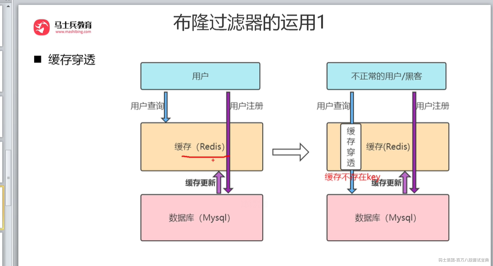

**如何解决**

1.缓存空对象

当存储层不命中，到数据库查发现也没有命中，那么仍然将空对象保留到缓存层中，之后再访问这个数据将会从缓存中获取,这样就保护了后端数据源。不过空值做了缓存，意味着缓存层中存了更多的键，需要更多的内存空间(如果是攻击，问题更严重),比较有效的方法是针对这类数据设置一个较短的过期时间，让其自动剔除。

2.布隆过滤器拦截

在访问缓存层和存储层之前,将存在的key用布隆过滤器提前保存起来,做第一层拦截。例如:一个推荐系统有4亿个用户id，每个小时算法工程师会根据每个用户之前历史行为计算出推荐数据放到存储层中,但是最新的用户由于没有历史行为,就会发生缓存穿透的行为,为此可以将所有推荐数据的用户做成布隆过滤器。如果布隆过滤器认为该用户id不存在,那么就不会访问存储层,在一定程度保护了存储层。

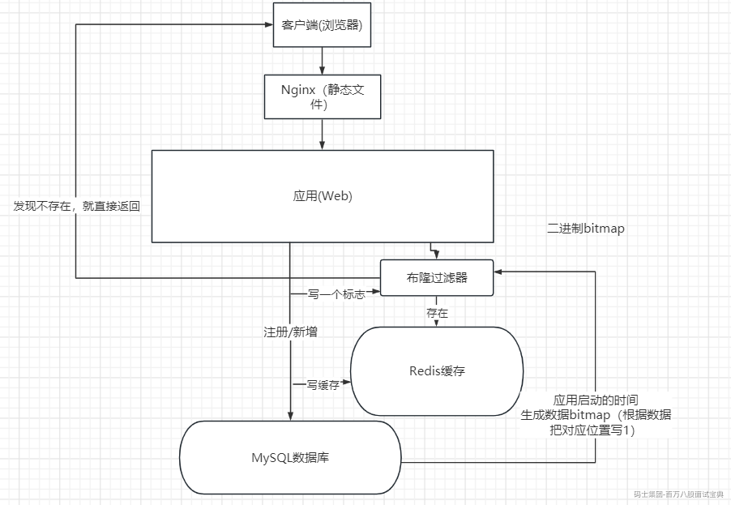

这种方法适用于数据命中不高、数据相对固定、实时性低(通常是数据集较大)的应用场景,代码维护较为复杂,但是缓存空间占用少。

## 15、什么是缓存雪崩？该如何解决

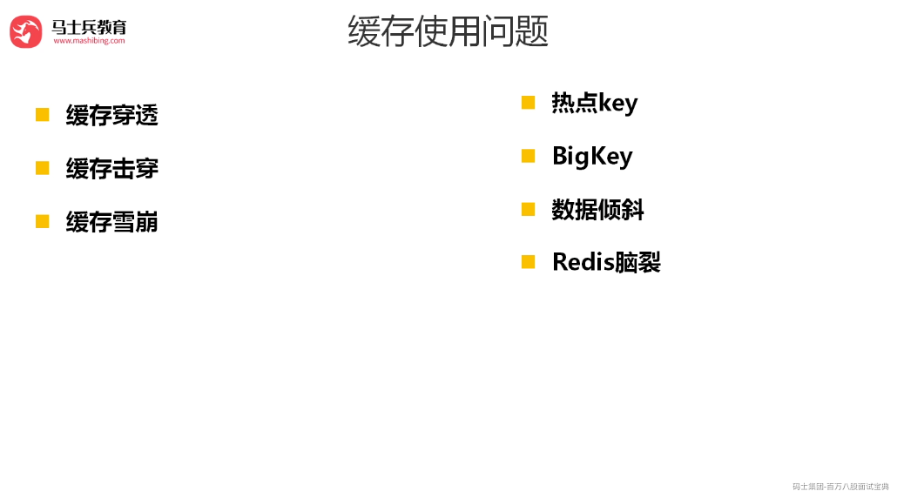

缓存雪崩:由于缓存层承载着大量请求,有效地保护了存储层,但是如果缓存层由于某些原因不能提供服务，比如同一时间缓存数据大面积失效，那一瞬间Redis跟没有一样，于是所有的请求都会达到存储层，存储层的调用量会暴增，造成存储层也会级联宕机的情况。

缓存雪崩的英文原意是stampeding herd(奔逃的野牛)，指的是缓存层宕掉后，流量会像奔逃的野牛一样,打向后端存储。

预防和解决缓存雪崩问题,可以从以下三个方面进行着手。

1）保证缓存层服务高可用性。和飞机都有多个引擎一样，如果缓存层设计成高可用的,即使个别节点、个别机器、甚至是机房宕掉，依然可以提供服务，例如前面介绍过的Redis

Sentinel和 Redis Cluster都实现了高可用。

2）依赖隔离组件为后端限流并降级。无论是缓存层还是存储层都会有出错的概率，可以将它们视同为资源。作为并发量较大的系统，假如有一个资源不可用，可能会造成线程全部阻塞(hang)在这个资源上，造成整个系统不可用。

3）提前演练。在项目上线前，演练缓存层宕掉后，应用以及后端的负载情况以及可能出现的问题,在此基础上做一些预案设定。

4）将缓存失效时间分散开，比如我们可以在原有的失效时间基础上增加一个随机值，比如1-5分钟随机，这样每一个缓存的过期时间的重复率就会降低，就很难引发集体失效的事件。

## 16、什么是BigKey？该如何解决

### 什么是bigkey

bigkey是指key对应的value所占的内存空间比较大，例如一个字符串类型的value可以最大存到512MB，一个列表类型的value最多可以存储23-1个元素。

如果按照数据结构来细分的话，一般分为字符串类型bigkey和非字符串类型bigkey。

字符串类型：体现在单个value值很大，一般认为超过10KB就是bigkey，但这个值和具体的OPS相关。

非字符串类型：哈希、列表、集合、有序集合,体现在元素个数过多。

bigkey无论是空间复杂度和时间复杂度都不太友好，下面我们将介绍它的危害。

### bigkey的危害

bigkey的危害体现在三个方面:

1、内存空间不均匀.(平衡):例如在Redis Cluster中，bigkey 会造成节点的内存空间使用不均匀。

2、超时阻塞:由于Redis单线程的特性，操作bigkey比较耗时，也就意味着阻塞Redis可能性增大。

3、网络拥塞:每次获取bigkey产生的网络流量较大

假设一个bigkey为1MB，每秒访问量为1000，那么每秒产生1000MB 的流量,对于普通的千兆网卡(按照字节算是128MB/s)的服务器来说简直是灭顶之灾，而且一般服务器会采用单机多实例的方式来部署,也就是说一个bigkey可能会对其他实例造成影响,其后果不堪设想。

bigkey的存在并不是完全致命的：

如果这个bigkey存在但是几乎不被访问,那么只有内存空间不均匀的问题存在,相对于另外两个问题没有那么重要紧急,但是如果bigkey是一个热点key(频繁访问)，那么其带来的危害不可想象,所以在实际开发和运维时一定要密切关注bigkey的存在。

#### 发现bigkey

redis-cli --bigkeys可以命令统计bigkey的分布。

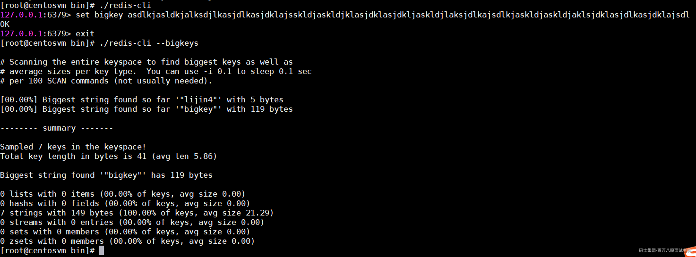

但是在生产环境中，开发和运维人员更希望自己可以定义bigkey的大小，而且更希望找到真正的bigkey都有哪些,这样才可以去定位、解决、优化问题。

判断一个key是否为bigkey，只需要执行debug object key查看serializedlength属性即可，它表示 key对应的value序列化之后的字节数。

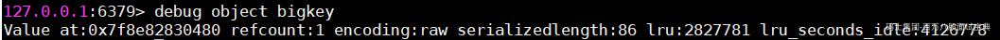

如果是要遍历多个，则尽量不要使用keys的命令，可以使用scan的命令来减少压力。

##### scan

Redis 从2.8版本后，提供了一个新的命令scan，它能有效的解决keys命令存在的问题。和keys命令执行时会遍历所有键不同,scan采用渐进式遍历的方式来解决 keys命令可能带来的阻塞问题，但是要真正实现keys的功能,需要执行多次scan。可以想象成只扫描一个字典中的一部分键，直到将字典中的所有键遍历完毕。scan的使用方法如下:

```plain
scan cursor [match pattern] [count number]
```

cursor ：是必需参数，实际上cursor是一个游标，第一次遍历从0开始，每次scan遍历完都会返回当前游标的值,直到游标值为0,表示遍历结束。

Match pattern ：是可选参数,它的作用的是做模式的匹配,这点和keys的模式匹配很像。

Count number ：是可选参数,它的作用是表明每次要遍历的键个数,默认值是10,此参数可以适当增大。

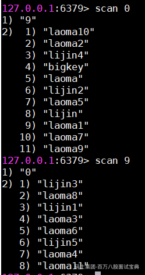

可以看到，第一次执行scan 0，返回结果分为两个部分:

第一个部分9就是下次scan需要的cursor

第二个部分是10个键。接下来继续

直到得到结果cursor变为0，说明所有的键已经被遍历过了。

除了scan 以外，Redis提供了面向哈希类型、集合类型、有序集合的扫描遍历命令，解决诸如hgetall、smembers、zrange可能产生的阻塞问题，对应的命令分别是hscan、sscan、zscan，它们的用法和scan基本类似，请自行参考Redis官网。

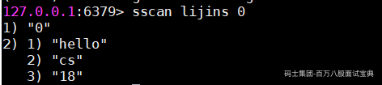

渐进式遍历可以有效的解决keys命令可能产生的阻塞问题，但是scan并非完美无瑕，如果在scan 的过程中如果有键的变化(增加、删除、修改)，那么遍历效果可能会碰到如下问题:新增的键可能没有遍历到，遍历出了重复的键等情况，也就是说scan并不能保证完整的遍历出来所有的键，这些是我们在开发时需要考虑的。

如果键值个数比较多，scan + debug object会比较慢，可以利用Pipeline机制完成。对于元素个数较多的数据结构，debug object执行速度比较慢，存在阻塞Redis的可能，所以如果有从节点,可以考虑在从节点上执行。

#### 解决bigkey

主要思路为拆分，对 big key 存储的数据 （big value）进行拆分，变成value1，value2… valueN等等。

例如big value 是个大json 通过 mset 的方式，将这个 key 的内容打散到各个实例中，或者一个hash，每个field代表一个具体属性，通过hget、hmget获取部分value，hset、hmset来更新部分属性。

例如big value 是个大list，可以拆成将list拆成。= list\_1， list\_2, list3, ...listN

其他数据类型同理。

## 17、什么是热点Key？该如何解决

在Redis中，访问频率高的key称为热点key。

### 产生原因和危害

#### 原因

热点问题产生的原因大致有以下两种：

用户消费的数据远大于生产的数据（热卖商品、热点新闻、热点评论、明星直播）。

在日常工作生活中一些突发的事件，例如：双十一期间某些热门商品的降价促销，当这其中的某一件商品被数万次点击浏览或者购买时，会形成一个较大的需求量，这种情况下就会造成热点问题。同理，被大量刊发、浏览的热点新闻、热点评论、明星直播等，这些典型的读多写少的场景也会产生热点问题。

请求分片集中，超过单Server的性能极限。在服务端读数据进行访问时，往往会对数据进行分片切分，此过程中会在某一主机Server上对相应的Key进行访问，当访问超过Server极限时，就会导致热点Key问题的产生。

#### 危害

1、流量集中，达到物理网卡上限。

2、请求过多，缓存分片服务被打垮。

3、DB击穿，引起业务雪崩。

### 发现热点key

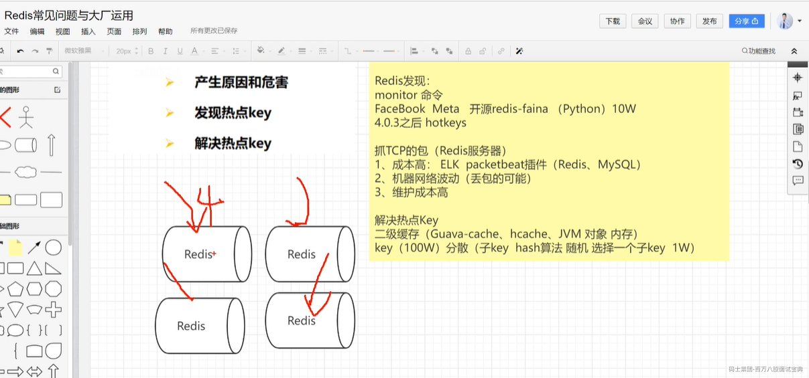

#### 预估发现

针对业务提前预估出访问频繁的热点key，例如秒杀商品业务中，秒杀的商品都是热点key。

当然并非所有的业务都容易预估出热点key，可能出现漏掉或者预估错误的情况。

#### 客户端发现

客户端其实是距离key"最近"的地方，因为Redis命令就是从客户端发出的，以Jedis为例，可以在核心命令入口，使用这个Google Guava中的AtomicLongMap进行记录，如下所示。

使用客户端进行热点key的统计非常容易实现，但是同时问题也非常多：

(1) 无法预知key的个数，存在内存泄露的危险。

(2) 对于客户端代码有侵入，各个语言的客户端都需要维护此逻辑，维护成本较高。

(3) 规模化汇总实现比较复杂。

#### Redis发现

##### monitor命令

monitor命令可以监控到Redis执行的所有命令，利用monitor的结果就可以统计出一段时间内的热点key排行榜，命令排行榜，客户端分布等数据。

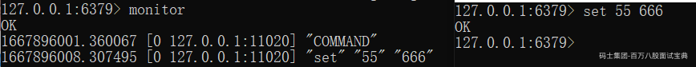

Facebook开源的redis-faina正是利用上述原理使用Python语言实现的，例如下面获取最近10万条命令的热点key、热点命令、耗时分布等数据。为了减少网络开销以及加快输出缓冲区的消费速度，monitor尽可能在本机执行。

**此种方法会有两个问题：**

1、monitor命令在高并发条件下，内存暴增同时会影响Redis的性能，所以此种方法适合在短时间内使用。

2、只能统计一个Redis节点的热点key，对于Redis集群需要进行汇总统计。

**可以参考的框架：Facebook开源的redis-faina正是利用上述原理使用Python语言实现的**

##### hotkeys

Redis在4.0.3中为redis-cli提供了--hotkeys，用于找到热点key。

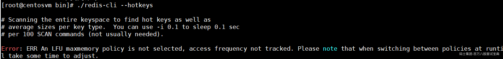

如果有错误，需要先把内存逐出策略设置为allkeys-lfu或者volatile-lfu，否则会返回错误。

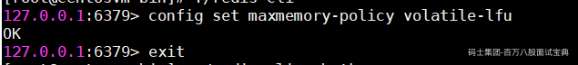

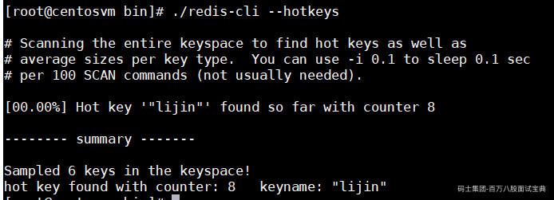

但是如果键值较多，执行较慢，和热点的概念的有点背道而驰，同时热度定义的不够准确。

#### 抓取TCP包发现

Redis客户端使用TCP协议与服务端进行交互，通信协议采用的是RESP。如果站在机器的角度，可以通过对机器上所有Redis端口的TCP数据包进行抓取完成热点key的统计

此种方法对于Redis客户端和服务端来说毫无侵入，是比较完美的方案，但是依然存在3个问题：

(1) 需要一定的开发成本

(2) 对于高流量的机器抓包，对机器网络可能会有干扰，同时抓包时候会有丢包的可能性。

(3) 维护成本过高。

对于成本问题，有一些开源方案实现了该功能，例如ELK(ElasticSearch Logstash Kibana)体系下的packetbeat[2] 插件，可以实现对Redis、MySQL等众多主流服务的数据包抓取、分析、报表展示

### 解决热点key

发现热点key之后，需要对热点key进行处理。

#### 使用二级缓存

可以使用 guava-cache或hcache，发现热点key之后，将这些热点key加载到JVM中作为本地缓存。访问这些key时直接从本地缓存获取即可，不会直接访问到redis层了，有效的保护了缓存服务器。

#### key分散

将热点key分散为多个子key，然后存储到缓存集群的不同机器上，这些子key对应的value都和热点key是一样的。当通过热点key去查询数据时，通过某种hash算法随机选择一个子key，然后再去访问缓存机器，将热点分散到了多个子key上。

## 18、redis过期策略都有哪些？LRU 算法知道吗？

### 缓存淘汰算法（过期策略）

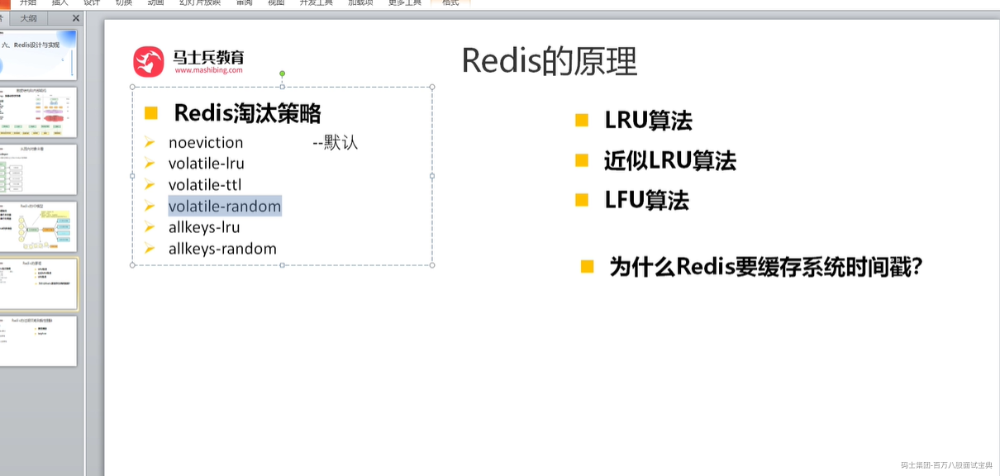

当 Redis 内存超出物理内存限制时，内存的数据会开始和磁盘产生频繁的交换 (swap)。交换会让 Redis 的性能急剧下降，对于访问量比较频繁的 Redis 来说，这样龟速的存取效率基本上等于不可用。

#### maxmemory

在生产环境中我们是不允许 Redis 出现交换行为的，为了限制最大使用内存，Redis 提供了配置参数 maxmemory 来限制内存超出期望大小。

当实际内存超出 maxmemory 时，Redis 提供了几种可选策略(maxmemory-policy) 来让用户自己决定该如何腾出新的空间以继续提供读写服务。

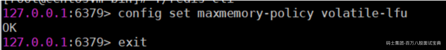

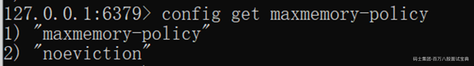

#### Noeviction

 noeviction 不会继续服务写请求  
(DEL 请求可以继续服务)，读请求可以继续进行。这样可以保证不会丢失数据，但是会让线上的业务不能持续进行。这是默认的淘汰策略。

#### volatile-lru

 volatile-lru 尝试淘汰设置了过期时间的  
key，最少使用的 key 优先被淘汰。没有设置过期时间的 key 不会被淘汰，这样可以保证需要持久化的数据不会突然丢失。

#### volatile-ttl

volatile-ttl 跟上面一样，除了淘汰的策略不是 LRU，而是 key 的剩余寿命 ttl 的值，ttl 越小越优先被淘汰。

#### volatile-random

volatile-random 跟上面一样，不过淘汰的 key 是过期 key 集合中随机的 key。

#### allkeys-lru

allkeys-lru 区别于volatile-lru，这个策略要淘汰的 key 对象是全体的 key 集合，而不只是过期的 key 集合。这意味着没有设置过期时间的 key 也会被淘汰。

#### allkeys-random

allkeys-random跟上面一样，不过淘汰的策略是随机的 key。

volatile-xxx 策略只会针对带过期时间的key 进行淘汰，allkeys-xxx 策略会对所有的 key 进行淘汰。如果你只是拿 Redis 做缓存，那应该使用 allkeys-xxx，客户端写缓存时不必携带过期时间。如果你还想同时使用 Redis 的持久化功能，那就使用 volatile-xxx 策略，这样可以保留没有设置过期时间的 key，它们是永久的 key 不会被 LRU 算法淘汰。

### LRU 算法

实现 LRU 算法除了需要key/value 字典外，还需要附加一个链表，链表中的元素按照一定的顺序进行排列。当空间满的时候，会踢掉链表尾部的元素。当字典的某个元素被访问时，它在链表中的位置会被移动到表头。所以链表的元素排列顺序就是元素最近被访问的时间顺序。

位于链表尾部的元素就是不被重用的元素，所以会被踢掉。位于表头的元素就是最近刚刚被人用过的元素，所以暂时不会被踢。

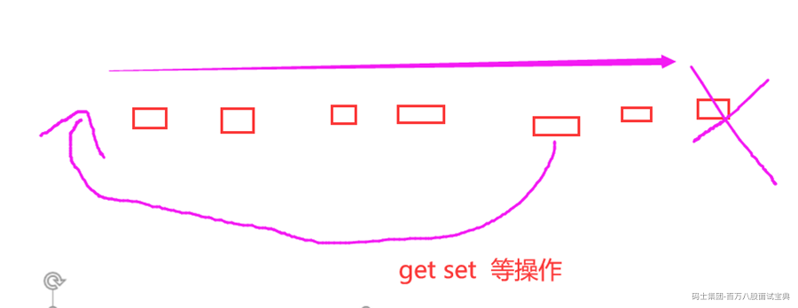

### 近似 LRU 算法

Redis 使用的是一种近似 LRU 算法，它跟 LRU 算法还不太一样。之所以不使用 LRU 算法，是因为需要消耗大量的额外的内存，需要对现有的数据结构进行较大的改造。近似

LRU 算法则很简单，在现有数据结构的基础上使用随机采样法来淘汰元素，能达到和 LRU 算法非常近似的效果。Redis 为实现近似 LRU 算法，它给每个 key 增加了一个额外的小字段，这个字段的长度是 24 个 bit，也就是最后一次被访问的时间戳。

当 Redis 执行写操作时，发现内存超出maxmemory，就会执行一次 LRU 淘汰算法。这个算法也很简单，就是随机采样出 5(可以配置maxmemory-samples) 个 key，然后淘汰掉最旧的 key，如果淘汰后内存还是超出 maxmemory，那就继续随机采样淘汰，直到内存低于 maxmemory 为止。

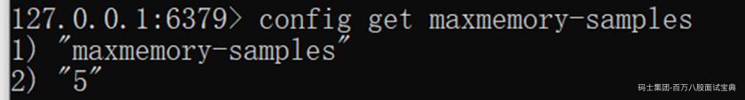

如何采样就是看maxmemory-policy 的配置，如果是 allkeys 就是从所有的 key 字典中随机，如果是 volatile 就从带过期时间的 key 字典中随机。每次采样多少个 key 看的是 maxmemory\_samples 的配置，默认为 5。

采样数量越大，近似 LRU 算法的效果越接近严格LRU 算法。

同时 Redis3.0 在算法中增加了淘汰池，新算法会维护一个候选池（大小为16），池中的数据根据访问时间进行排序，第一次随机选取的key都会放入池中，随后每次随机选取的key只有在访问时间小于池中最小的时间才会放入池中，直到候选池被放满。当放满后，如果有新的key需要放入，则将池中最后访问时间最大（最近被访问）的移除。进一步提升了近似 LRU 算法的效果。

## 19、讲一讲Redis缓存的数据一致性问题和处理方案

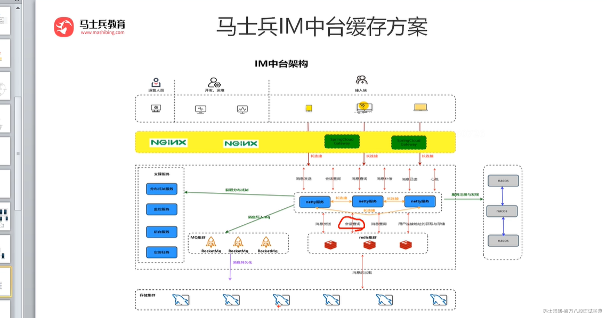

### 数据一致性

只要使用到缓存，无论是本地内存做缓存还是使用 redis 做缓存，那么就会存在数据同步的问题。

我以 Tomcat 向 MySQL 中写入和删改数据为例，来给你解释一下，数据的增删改操作具体是如何进行的。

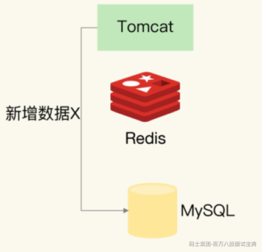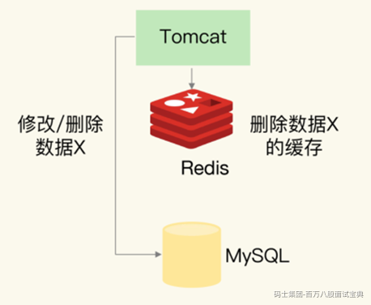

我们分析一下几种解决方案，

1、先更新缓存，再更新数据库

2、先更新数据库，再更新缓存

3、先删除缓存，后更新数据库

4、先更新数据库，后删除缓存

#### 新增数据类

如果是新增数据，数据会直接写到数据库中，不用对缓存做任何操作，此时，缓存中本身就没有新增数据，而数据库中是最新值，此时，缓存和数据库的数据是一致的。

#### 更新缓存类

##### 1、先更新缓存，再更新DB

这个方案我们一般不考虑。原因是更新缓存成功，更新数据库出现异常了，导致缓存数据与数据库数据完全不一致，而且很难察觉，因为缓存中的数据一直都存在。

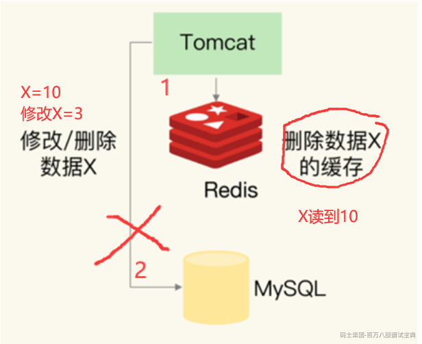

##### 2、先更新DB，再更新缓存

这个方案也我们一般不考虑，原因跟第一个一样，数据库更新成功了，缓存更新失败，同样会出现数据不一致问题。同时还有以下问题

*1* *）并发问题：*

*同时有请求A****和请求B****进行更新操作，那么会出现*

*（1* *）线程A*更新了数据库

*（2* *）线程B*更新了数据库

*（3* *）线程B*更新了缓存

*（4* *）线程A*更新了缓存

*这就出现请求A****更新缓存应该比请求B****更新缓存早才对，但是因为网络等原因，B****却比A****更早更新了缓存。这就导致了脏数据，因此不考虑。*

*2* *）业务场景问题*

*如果你是一个写数据库场景比较多，而读数据场景比较少的业务需求，采用这种方案就会导致，数据压根还没读到，缓存就被频繁的更新，浪费性能。*

**除了更新缓存之外，我们还有一种就是删除缓存。**

到底是选择更新缓存还是淘汰缓存呢？

主要取决于“更新缓存的复杂度”，更新缓存的代价很小，此时我们应该更倾向于更新缓存，以保证更高的缓存命中率，更新缓存的代价很大，此时我们应该更倾向于淘汰缓存。

#### 删除缓存类

##### 3、先删除缓存，后更新DB

该方案也会出问题，具体出现的原因如下。

1、此时来了两个请求，请求 A（更新操作） 和请求 B（查询操作）

2、请求 A 会先删除 Redis 中的数据，然后去数据库进行更新操作；

3、此时请求 B 看到 Redis 中的数据时空的，会去数据库中查询该值，补录到 Redis 中；

4、但是此时请求 A 并没有更新成功，或者事务还未提交，请求B去数据库查询得到旧值；

5、那么这时候就会产生数据库和 Redis 数据不一致的问题。

如何解决呢？其实最简单的解决办法就是延时双删的策略。就是

（1）先淘汰缓存

（2）再写数据库

（3）休眠1秒，再次淘汰缓存

**这段伪代码就是“延迟双删”**

```java
redis.delKey(X)
db.update(X)
Thread.sleep(N)
redis.delKey(X)
```

这么做，可以将1秒内所造成的缓存脏数据，再次删除。

那么，这个1秒怎么确定的，具体该休眠多久呢？

针对上面的情形，读该自行评估自己的项目的读数据业务逻辑的耗时。然后写数据的休眠时间则在读数据业务逻辑的耗时基础上，加几百ms即可。这么做的目的，就是确保读请求结束，写请求可以删除读请求造成的缓存脏数据。

但是上述的保证事务提交完以后再进行删除缓存还有一个问题，就是如果你使用的是\*\* Mysql \*\***的读写分离的架构**的话，那么其实主从同步之间也会有时间差。

此时来了两个请求，请求 A（更新操作） 和请求 B（查询操作）

请求 A 更新操作，删除了  
Redis，

请求主库进行更新操作，主库与从库进行同步数据的操作，

请 B 查询操作，发现 Redis  
中没有数据，

去从库中拿去数据，此时同步数据还未完成，拿到的数据是旧数据。

此时的解决办法有两个：

1、还是使用双删延时策略。只是，睡眠时间修改为在主从同步的延时时间基础上，加几百ms。

2、就是如果是对 Redis  
进行填充数据的查询数据库操作，那么就强制将其指向主库进行查询。

继续深入，**采用这种同步淘汰策略，吞吐量降低怎么办？**

那就将第二次删除作为异步的。自己起一个线程，异步删除。这样，写的请求就不用沉睡一段时间后了，再返回。这么做，加大吞吐量。

继续深入，**第二次删除,如果删除失败怎么办？**

所以，我们引出了，下面的第四种策略，先更新数据库，再删缓存。

##### 4、先更新DB，后删除缓存

这种方式，被称为Cache Aside Pattern，读的时候，先读缓存，缓存没有的话，就读数据库，然后取出数据后放入缓存，同时返回响应。更新的时候，先更新数据库，然后再删除缓存。

### 如何选择问题

一般在线上，更多的偏向与使用删除缓存类操作，因为这种方式的话，会更容易避免一些问题。

因为删除缓存更新缓存的速度比在DB中要快一些，所以一般情况下我们可能会先用先更新DB，后删除缓存的操作。因为这种情况下缓存不一致性的情况只有可能是查询比删除慢的情况，而这种情况相对来说会少很多。同时结合延时双删的处理，可以有效的避免缓存不一致的情况。

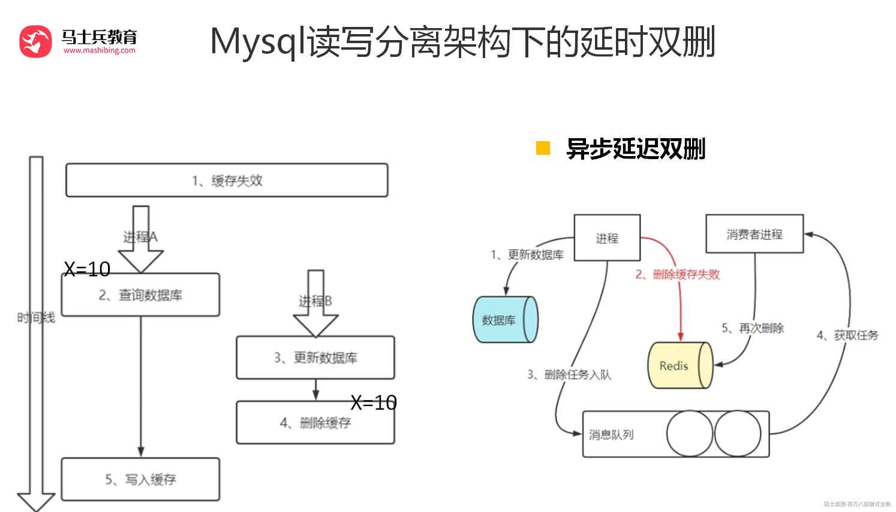

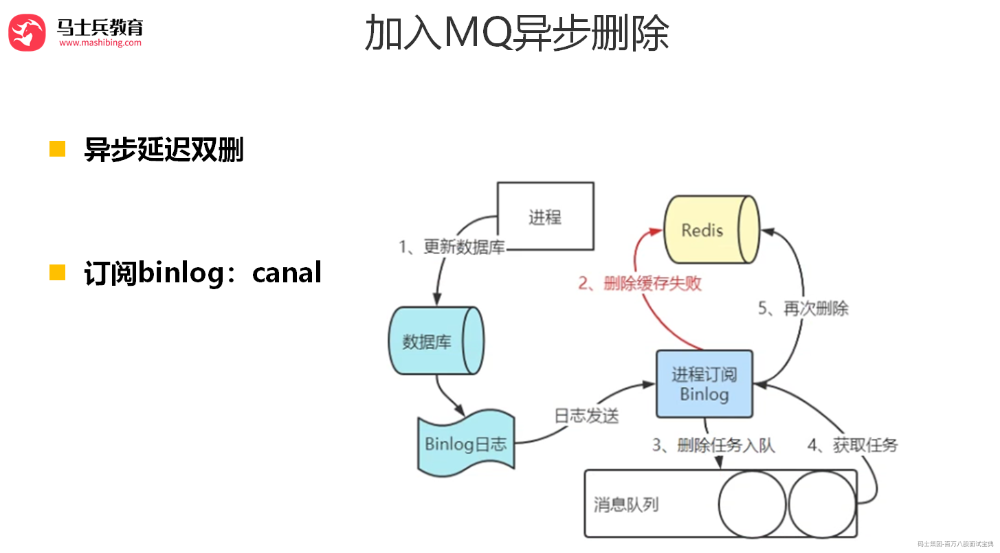

## 20、设计一个社交媒体应用，如何使用Redis来实时统计用户的点赞、评论和分享数量

一般推荐使用Redis的Hash数据类型来做：

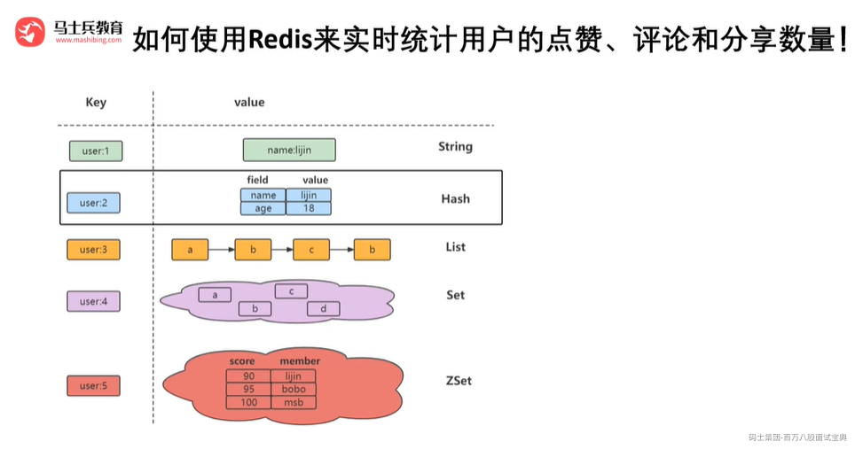

增加点赞数：

Redis命令

```plain
HINCRBY question:123 likes 1
```

Springboot的Redis的API

```plain
 HashOperations<String, String, Integer> hashOperations;
 hashOperations = redisTemplate.opsForHash();
 hashOperations.increment("question:123", "likes", 1);

```

具体的代码：


## 21、应用中的排行榜功能，如何利用Redis来实现


- **Redis 按日期存储数据** ：每天的数据存储在一个独立的 Key 中，方便按天统计和清理。

- **定时任务汇总数据** ：每天凌晨将前 7 天的数据汇总到 `ranking:7days_summary` 中。

- **清理旧数据** ：定时任务会清理超过 7 天的旧数据，避免 Redis 内存占用过多。

- **查询排行榜** ：直接从汇总 Key 中获取前 7 天的排行榜数据。

这种方式既能保证排行榜的实时性，又能高效地统计和查询前 7 天的数据，适合需要长期保存排行榜数据的场景

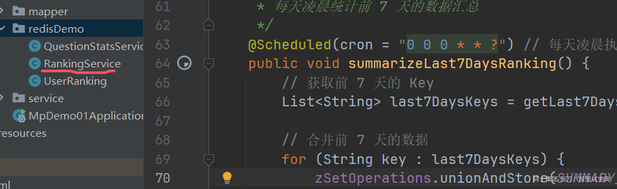
