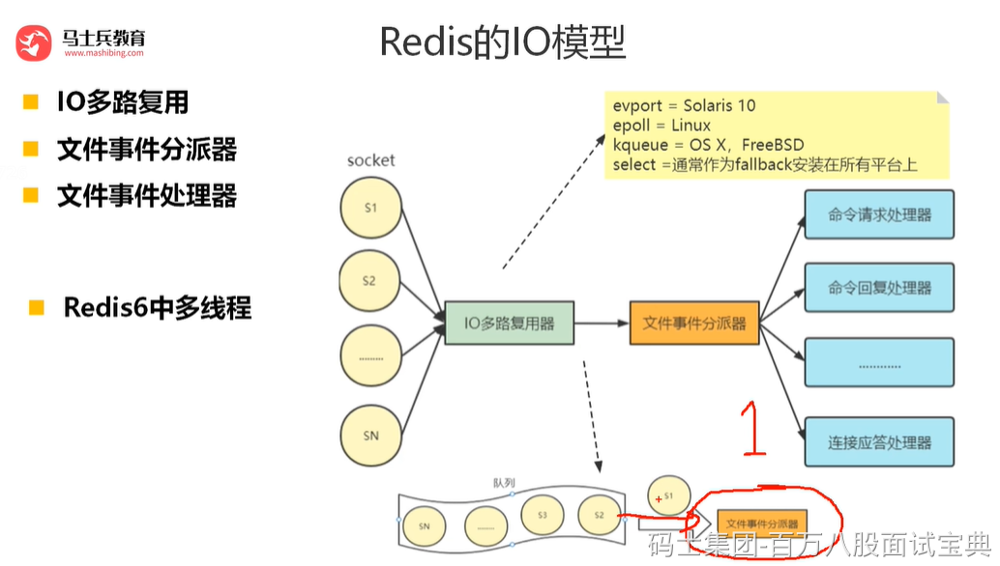

**Redis多线程比单线程性能提升一倍：**

Redis 作者 antirez 在 RedisConf 2019分享时曾提到：Redis 6 引入的多线程 IO 特性对性能提升至少是一倍以上。国内也有大牛曾使用unstable版本在阿里云esc进行过测试，GET/SET 命令在4线程 IO时性能相比单线程是几乎是翻倍了

**巨头公司的需求**

Redis将所有数据放在内存中，内存的响应时长大约为100纳秒，对于小数据包，Redis服务器可以处理80,000到100,000 QPS，这也是Redis处理的极限了，对于80%的公司来说，单线程的Redis已经足够使用了。

但随着越来越复杂的业务场景，有些公司动不动就上亿的交易量，因此需要更大的QPS。

**集群方案的问题**

常见的解决方案是在分布式架构中对数据进行分区并采用多个服务器，但该方案有非常大的缺点，例如要管理的Redis服务器太多，维护代价大；

某些适用于单个Redis服务器的命令不适用于数据分区；

数据分区无法解决热点读/写问题；数据偏斜，重新分配和放大/缩小变得更加复杂等等。

1.纯内存KV操作

Redis的操作都是基于内存的，CPU不是 Redis性能瓶颈,，Redis的瓶颈是机器内存和网络带宽。

在计算机的世界中，CPU的速度是远大于内存的速度的，同时内存的速度也是远大于硬盘的速度。redis的操作都是基于内存的，绝大部分请求是纯粹的内存操作，非常迅速。

2.单线程操作

使用单线程可以省去多线程时CPU上下文会切换的时间，也不用去考虑各种锁的问题，不存在加锁释放锁操作，没有死锁问题导致的性能消耗。对于内存系统来说，多次读写都是在一个CPU上，没有上下文切换效率就是最高的！既然单线程容易实现，而且 CPU 不会成为瓶颈，那就顺理成章的采用单线程的方案了

Redis 单线程指的是网络请求模块使用了一个线程，即一个线程处理所有网络请求，其他模块该使用多线程，仍会使用了多个线程。

3.I/O 多路复用

为什么 Redis 中要使用 I/O 多路复用这种技术呢？

首先，Redis 是跑在单线程中的，所有的操作都是按照顺序线性执行的，但是由于读写操作等待用户输入或输出都是阻塞的，所以 I/O 操作在一般情况下往往不能直接返回，这会导致某一文件的 I/O 阻塞导致整个进程无法对其它客户提供服务，而 I/O 多路复用就是为了解决这个问题而出现的

4.Reactor 设计模式

Redis基于Reactor模式开发了自己的网络事件处理器，称之为文件事件处理器(File Event Hanlder)。

