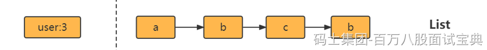
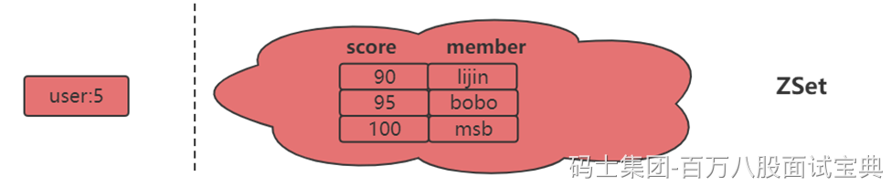

### 字符串（String）

**适合场景**

**缓存功能**

Redis 作为缓存层，MySQL作为存储层，绝大部分请求的数据都是从Redis中获取。由于Redis具有支撑高并发的特性,所以缓存通常能起到加速读写和降低后端压力的作用。

**计数**

使用Redis 作为计数的基础工具，它可以实现快速计数、查询缓存的功能,同时数据可以异步落地到其他数据源。

**共享Session**

一个分布式Web服务将用户的Session信息（例如用户登录信息)保存在各自服务器中，这样会造成一个问题，出于负载均衡的考虑，分布式服务会将用户的访问均衡到不同服务器上，用户刷新一次访问可能会发现需要重新登录，这个问题是用户无法容忍的。

为了解决这个问题,可以使用Redis将用户的Session进行集中管理,，在这种模式下只要保证Redis是高可用和扩展性的,每次用户更新或者查询登录信息都直接从Redis中集中获取。

**限速**

比如，很多应用出于安全的考虑,会在每次进行登录时,让用户输入手机验证码,从而确定是否是用户本人。但是为了短信接口不被频繁访问,会限制用户每分钟获取验证码的频率，例如一分钟不能超过5次。一些网站限制一个IP地址不能在一秒钟之内方问超过n次也可以采用类似的思路。

### 哈希(Hash)

Java里提供了HashMap，Redis中也有类似的数据结构，就是哈希类型。但是要注意，哈希类型中的映射关系叫作field-value，注意这里的value是指field对应的值，不是键对应的值。

**适合场景**

哈希类型比较适宜存放对象类型的数据，我们可以比较下，如果数据库中表记录user为：

|  |  |  |
| --- | --- | --- |
| **id** | **name** | **age** |
| 1 | lijin | 18 |
| 2 | msb | 20 |

**1、使用String类型**

需要一条条去插入获取。

set user:1:name lijin;

set user:1:age 18;

set user:2:name msb;

set user:2:age 20;

**优点：简单直观，每个键对应一个值**

**缺点：键数过多，占用内存多，用户信息过于分散，不用于生产环境**

**2、使用hash类型**

hmset user:1 name lijin age 18

hmset user:2 name msb age 20

优点：简单直观，使用合理可减少内存空间消耗

### 列表（list）

列表( list)类型是用来存储多个有序的字符串，a、b、c、c、b四个元素从左到右组成了一个有序的列表,列表中的每个字符串称为元素(element)，一个列表最多可以存储(2^32-1)个元素(*4294967295*)。

**适合场景**

每个用户有属于自己的文章列表，现需要分页展示文章列表。此时可以考虑使用列表,因为列表不但是有序的,同时支持按照索引范围获取元素。

消息队列，Redis 的 lpush+brpop命令组合即可实现阻塞队列，生产者客户端使用lrpush从列表左侧插入元素，多个消费者客户端使用brpop命令阻塞式的“抢”列表尾部的元素,多个客户端保证了消费的负载均衡和高可用性。

### 集合（set）

集合( set）类型也是用来保存多个的字符串元素,但和列表类型不一样的是，集合中不允许有重复元素,并且集合中的元素是无序的,不能通过索引下标获取元素。

**适合场景**

集合类型比较典型的使用场景是标签(tag)。例如一个用户可能对娱乐、体育比较感兴趣，另一个用户可能对历史、新闻比较感兴趣，这些兴趣点就是标签。有了这些数据就可以得到喜欢同一个标签的人，以及用户的共同喜好的标签，这些数据对于用户体验以及增强用户黏度比较重要。

例如一个电子商务的网站会对不同标签的用户做不同类型的推荐，比如对数码产品比较感兴趣的人，在各个页面或者通过邮件的形式给他们推荐最新的数码产品，通常会为网站带来更多的利益。

除此之外，集合还可以通过生成随机数进行比如抽奖活动，以及社交图谱等等。

### 有序集合（ZSET）

有序集合相对于哈希、列表、集合来说会有一点点陌生,但既然叫有序集合,那么它和集合必然有着联系,它保留了集合不能有重复成员的特性,但不同的是,有序集合中的元素可以排序。但是它和列表使用索引下标作为排序依据不同的是,它给每个元素设置一个分数( score)作为排序的依据。

有序集合中的元素不能重复，但是score可以重复，就和一个班里的同学学号不能重复,但是考试成绩可以相同。

有序集合提供了获取指定分数和元素范围查询、计算成员排名等功能，合理的利用有序集合，能帮助我们在实际开发中解决很多问题。

有序集合比较典型的使用场景就是排行榜系统。例如视频网站需要对用户上传的视频做排行榜，榜单的维度可能是多个方面的:按照时间、按照播放数量、按照获得的赞数。
