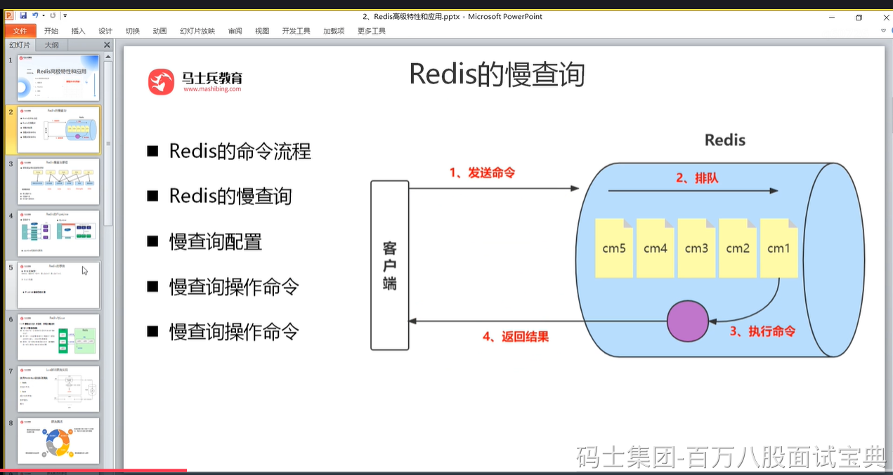
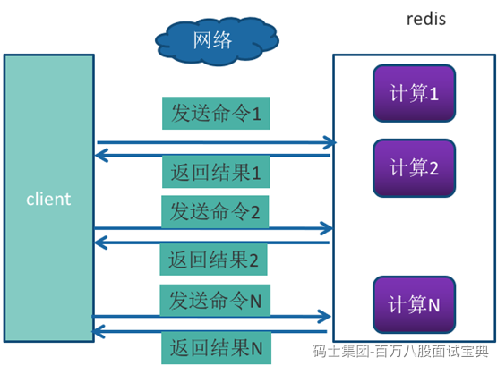
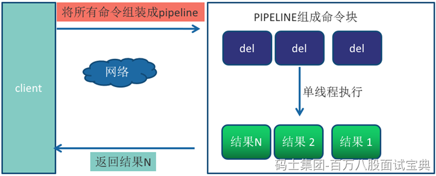
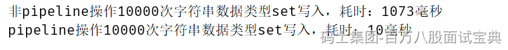

Redis客户端执行一条命令分为如下4个部分:1）发送命令2）命令排队3）命令执行4）返回结果。

其中1和4花费的时间称为Round Trip Time (RTT,往返时间)，也就是数据在网络上传输的时间。

Redis提供了批量操作命令(例如mget、mset等)，有效地节约RTT。

但大部分命令是不支持批量操作的，例如要执行n次 hgetall命令，并没有mhgetall命令存在，需要消耗n次RTT。

举例：Redis的客户端和服务端可能部署在不同的机器上。例如客户端在本地，Redis服务器在阿里云的广州，两地直线距离约为800公里，那么1次RTT时间=800 x2/ ( 300000×2/3 ) =8毫秒，(光在真空中传输速度为每秒30万公里,这里假设光纤为光速的2/3 )。而Redis命令真正执行的时间通常在微秒(1000微妙=1毫秒)级别，所以才会有Redis 性能瓶颈是网络这样的说法。

Pipeline（流水线)机制能改善上面这类问题,它能将一组 Redis命令进行组装,通过一次RTT传输给Redis,再将这组Redis命令的执行结果按顺序返回给客户端,没有使用Pipeline执行了n条命令,整个过程需要n次RTT。

使用Pipeline 执行了n次命令，整个过程需要1次RTT。

Pipeline并不是什么新的技术或机制，很多技术上都使用过。而且RTT在不同网络环境下会有不同，例如同机房和同机器会比较快，跨机房跨地区会比较慢。

redis-cli的--pipe选项实际上就是使用Pipeline机制，但绝对部分情况下，我们使用Java语言的Redis客户端中的Pipeline会更多一点。

代码参见：

com.msb.redis.adv.RedisPipeline

总的来说，在不同网络环境下非Pipeline和Pipeline执行10000次set操作的效果，在执行时间上的比对如下：

差距有100多倍，可以得到如下两个结论:

1、Pipeline执行速度一般比逐条执行要快。

2、客户端和服务端的网络延时越大，Pipeline的效果越明显。
