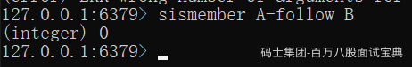
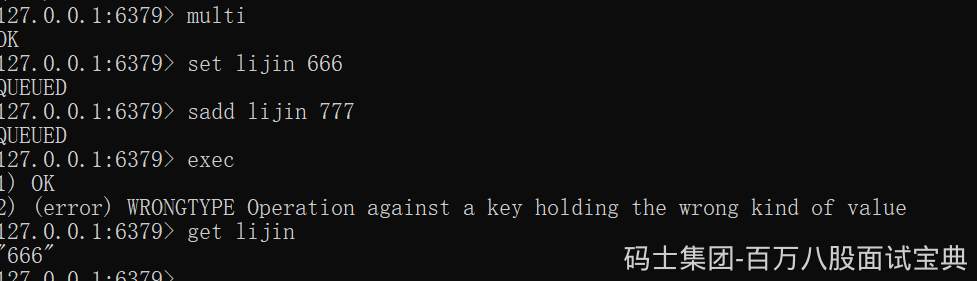

Redis 中的事务是一组命令的集合，是 Redis 的最小执行单位。它可以保证一次执行多个命令，每个事务是一个单独的隔离操作，事务中的所有命令都会序列化、按顺序地执行。服务端在执行事务的过程中，不会被其他客户端发送来的命令请求打断。它的原理是先将属于一个事务的命令发送给 Redis，然后依次执行这些命令。

Redis 事务的注意点有哪些？需要注意的点有：

Redis 事务是不支持回滚的，不像 MySQL 的事务一样，要么都执行要么都不执行；

Redis 服务端在执行事务的过程中，不会被其他客户端发送来的命令请求打断。直到事务命令全部执行完毕才会执行其他客户端的命令。

Redis 事务为什么不支持回滚？

Redis 的事务不支持回滚，但是执行的命令有语法错误，Redis 会执行失败，这些问题可以从程序层面捕获并解决。但是如果出现其他问题，则依然会继续执行余下的命令。这样做的原因是因为回滚需要增加很多工作，而不支持回滚则可以保持简单、快速的特性。

### 事务

大家应该对事务比较了解，简单地说，事务表示一组动作，要么全部执行，要么全部不执行。

例如在社交网站上用户A关注了用户B，那么需要在用户A的关注表中加入用户B，并且在用户B的粉丝表中添加用户A，这两个行为要么全部执行，要么全部不执行,否则会出现数据不一致的情况。

Redis提供了简单的事务功能，将一组需要一起执行的命令放到multi和exec两个命令之间。multi 命令代表事务开始，exec命令代表事务结束。另外discard命令是回滚。

一个客户端

另外一个客户端

在事务没有提交的时查询（查不到数据）

在事务提交后查询（可以查到数据）

可以看到sadd命令此时的返回结果是QUEUED，代表命令并没有真正执行，而是暂时保存在Redis中的一个缓存队列（所以discard也只是丢弃这个缓存队列中的未执行命令，并不会回滚已经操作过的数据，这一点要和关系型数据库的Rollback操作区分开）。

只有当exec执行后，用户A关注用户B的行为才算完成，如下所示exec返回的两个结果对应sadd命令。

**但是要注意Redis的事务功能很弱。在事务回滚机制上，Redis只能对基本的语法错误进行判断。**

如果事务中的命令出现错误,Redis 的处理机制也不尽相同。

1、语法命令错误

例如下面操作错将set写成了sett，属于语法错误，会造成整个事务无法执行，事务内的操作都没有执行:

2、运行时错误

例如：事务内第一个命令简单的设置一个string类型，第二个对这个key进行sadd命令，这种就是运行时命令错误，因为语法是正确的:

可以看到Redis并不支持回滚功能，第一个set命令已经执行成功,开发人员需要自己修复这类问题。

### **Redis的事务原理**

事务是Redis实现在服务器端的行为，用户执行MULTI命令时，服务器会将对应这个用户的客户端对象设置为一个特殊的状态，在这个状态下后续用户执行的查询命令不会被真的执行，而是被服务器缓存起来，直到用户执行EXEC命令为止，服务器会将这个用户对应的客户端对象中缓存的命令按照提交的顺序依次执行。
