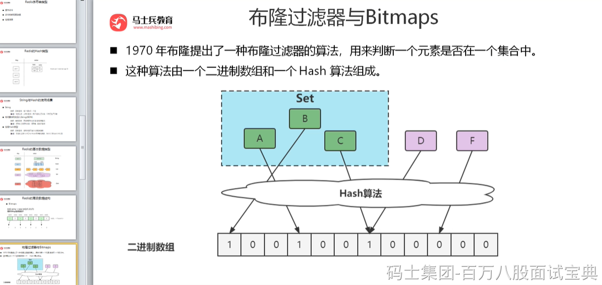
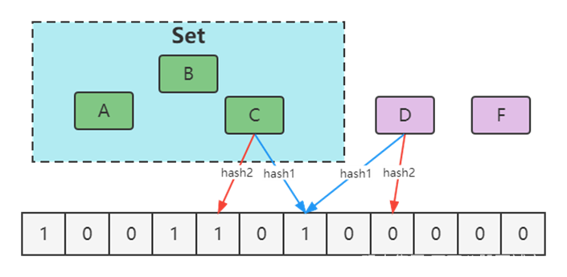

##### 传统数据结构的不足

当然有人会想，我直接将网页URL存入数据库进行查找不就好了，或者建立一个哈希表进行查找不就OK了。

当数据量小的时候，这么思考是对的，

确实可以将值映射到 HashMap 的 Key，然后可以在 O(1) 的时间复杂度内返回结果，效率奇高。但是 HashMap 的实现也有缺点，例如存储容量占比高，考虑到负载因子的存在，通常空间是不能被用满的，举个例子如果一个1000万HashMap，Key=String（长度不超过16字符，且重复性极小），Value=Integer，会占据多少空间呢？1.2个G。实际上，1000万个int型，只需要40M左右空间，占比3%，1000万个Integer，需要161M左右空间，占比13.3%。可见一旦你的值很多例如上亿的时候，那HashMap 占据的内存大小就变得很可观了。

但如果整个网页黑名单系统包含100亿个网页URL，在数据库查找是很费时的，并且如果每个URL空间为64B，那么需要内存为640GB，一般的服务器很难达到这个需求。

#### 布隆过滤器

##### 布隆过滤器简介

**1970 年布隆提出了一种布隆过滤器的算法，用来判断一个元素是否在一个集合中。****这种算法由一个二进制数组和一个 Hash 算法组成。**

本质上布隆过滤器是一种数据结构，比较巧妙的概率型数据结构（probabilistic data structure），特点是高效地插入和查询，可以用来告诉你 “某样东西一定不存在或者可能存在”。

相比于传统的 List、Set、Map 等数据结构，它更高效、占用空间更少，但是缺点是其返回的结果是概率性的，而不是确切的。

实际上，布隆过滤器广泛应用于网页黑名单系统、垃圾邮件过滤系统、爬虫网址判重系统等，Google 著名的分布式数据库 Bigtable 使用了布隆过滤器来查找不存在的行或列，以减少磁盘查找的IO次数，Google Chrome浏览器使用了布隆过滤器加速安全浏览服务。

##### 布隆过滤器的误判问题

Ø通过hash计算在数组上不一定在集合

Ø本质是hash冲突

Ø通过hash计算不在数组的一定不在集合（误判）

**优化方案**

增大数组(预估适合值)

增加hash函数

