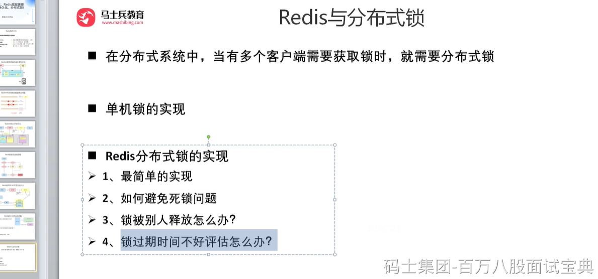
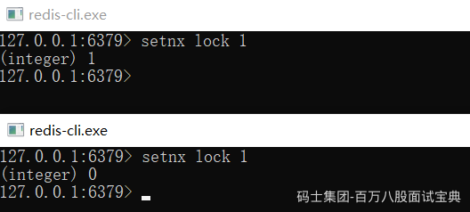
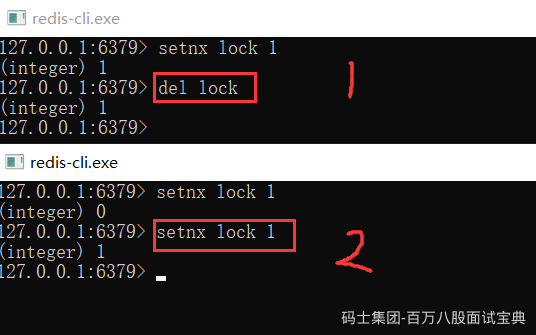
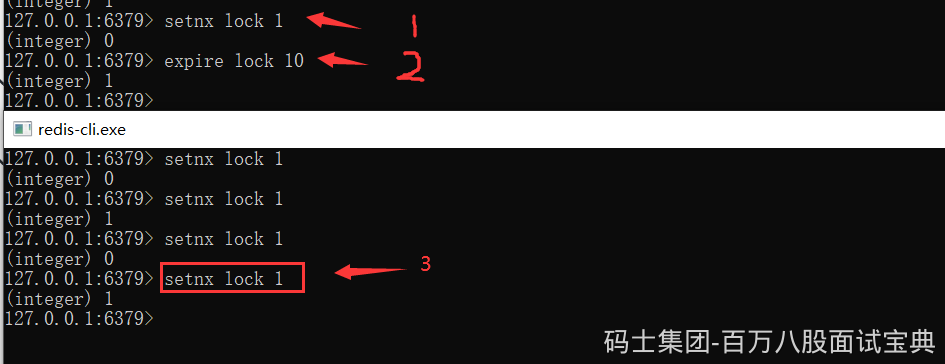
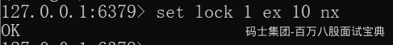
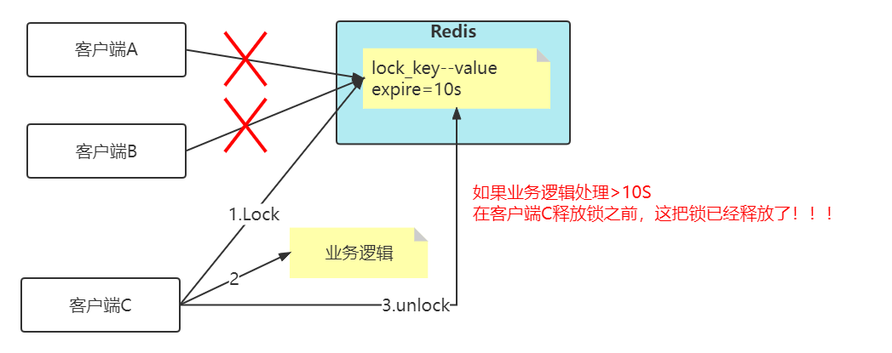
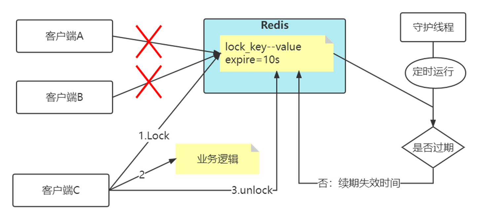
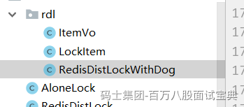
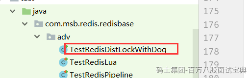
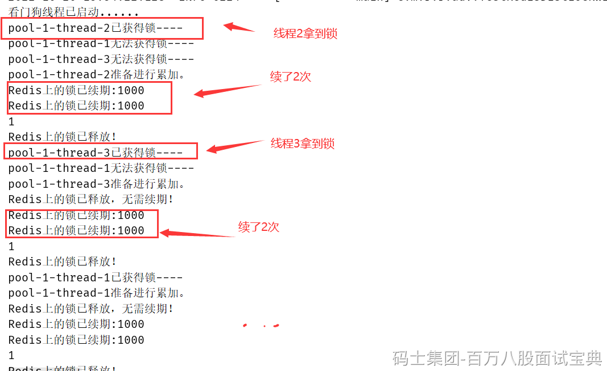

### Redis分布式锁最简单的实现

想要实现分布式锁，必须要求 Redis 有「互斥」的能力，我们可以使用 SETNX 命令，这个命令表示SET if Not Exists，即如果 key 不存在，才会设置它的值，否则什么也不做。

两个客户端进程可以执行这个命令，达到互斥，就可以实现一个分布式锁。

客户端 1 申请加锁，加锁成功：

客户端 2 申请加锁，因为它后到达，加锁失败：



此时，加锁成功的客户端，就可以去操作「共享资源」，例如，修改 MySQL 的某一行数据，或者调用一个 API 请求。

操作完成后，还要及时释放锁，给后来者让出操作共享资源的机会。如何释放锁呢？

也很简单，直接使用 DEL 命令删除这个 key 即可，这个逻辑非常简单。



但是，它存在一个很大的问题，当客户端 1 拿到锁后，如果发生下面的场景，就会造成「死锁」：

1、程序处理业务逻辑异常，没及时释放锁

2、进程挂了，没机会释放锁

这时，这个客户端就会一直占用这个锁，而其它客户端就「永远」拿不到这把锁了。怎么解决这个问题呢？

### 如何避免死锁？

我们很容易想到的方案是，在申请锁时，给这把锁设置一个「租期」。

在 Redis 中实现时，就是给这个 key 设置一个「过期时间」。这里我们假设，操作共享资源的时间不会超过 10s，那么在加锁时，给这个 key 设置 10s 过期即可：

```plain
SETNX lock 1    // 加锁
EXPIRE lock 10  // 10s后自动过期
```



这样一来，无论客户端是否异常，这个锁都可以在 10s 后被「自动释放」，其它客户端依旧可以拿到锁。

但现在还是有问题：

现在的操作，加锁、设置过期是 2 条命令，有没有可能只执行了第一条，第二条却「来不及」执行的情况发生呢？例如：

- SETNX 执行成功，执行EXPIRE 时由于网络问题，执行失败
- SETNX 执行成功，Redis 异常宕机，EXPIRE 没有机会执行
- SETNX 执行成功，客户端异常崩溃，EXPIRE也没有机会执行

总之，这两条命令不能保证是原子操作（一起成功），就有潜在的风险导致过期时间设置失败，依旧发生「死锁」问题。

在 Redis 2.6.12 之后，Redis 扩展了 SET 命令的参数，用这一条命令就可以了：

SET lock 1 EX 10 NX



### 锁被别人释放怎么办？

上面的命令执行时，每个客户端在释放锁时，都是「无脑」操作，并没有检查这把锁是否还「归自己持有」，所以就会发生释放别人锁的风险，这样的解锁流程，很不「严谨」！如何解决这个问题呢？

解决办法是：客户端在加锁时，设置一个只有自己知道的「唯一标识」进去。

例如，可以是自己的线程 ID，也可以是一个 UUID（随机且唯一），这里我们以UUID 举例：

SET lock $uuid EX 20 NX

之后，在释放锁时，要先判断这把锁是否还归自己持有，伪代码可以这么写：

```plain
if redis.get("lock") == $uuid:
    redis.del("lock")
```

这里释放锁使用的是 GET + DEL 两条命令，这时，又会遇到我们前面讲的原子性问题了。这里可以使用lua脚本来解决。

安全释放锁的 Lua 脚本如下：

```plain
if redis.call("GET",KEYS[1]) == ARGV[1]
then
    return redis.call("DEL",KEYS[1])
else
    return 0
end
```

好了，这样一路优化，整个的加锁、解锁的流程就更「严谨」了。

这里我们先小结一下，基于 Redis 实现的分布式锁，一个严谨的的流程如下：

1、加锁

SET lock\_key $unique\_id EX $expire\_time NX

2、操作共享资源

3、释放锁：Lua 脚本，先 GET 判断锁是否归属自己，再DEL 释放锁

### Java代码实现分布式锁

```plain
package com.msb.redis.lock;

import org.springframework.beans.factory.annotation.Autowired;
import org.springframework.stereotype.Component;
import redis.clients.jedis.Jedis;
import redis.clients.jedis.JedisPool;
import redis.clients.jedis.params.SetParams;

import java.util.Arrays;
import java.util.UUID;
import java.util.concurrent.TimeUnit;
import java.util.concurrent.locks.Condition;
import java.util.concurrent.locks.Lock;

/**
 * 分布式锁的实现
 */
@Component
public class RedisDistLock implements Lock {

    private final static int LOCK_TIME = 5*1000;
    private final static String RS_DISTLOCK_NS = "tdln:";
    /*
     if redis.call('get',KEYS[1])==ARGV[1] then
        return redis.call('del', KEYS[1])
    else return 0 end
     */
    private final static String RELEASE_LOCK_LUA =
            "if redis.call('get',KEYS[1])==ARGV[1] then\n" +
                    "        return redis.call('del', KEYS[1])\n" +
                    "    else return 0 end";
    /*保存每个线程的独有的ID值*/
    private ThreadLocal<String> lockerId = new ThreadLocal<>();

    /*解决锁的重入*/
    private Thread ownerThread;
    private String lockName = "lock";

    @Autowired
    private JedisPool jedisPool;

    public String getLockName() {
        return lockName;
    }

    public void setLockName(String lockName) {
        this.lockName = lockName;
    }

    public Thread getOwnerThread() {
        return ownerThread;
    }

    public void setOwnerThread(Thread ownerThread) {
        this.ownerThread = ownerThread;
    }

    @Override
    public void lock() {
        while(!tryLock()){
            try {
                Thread.sleep(100);
            } catch (InterruptedException e) {
                e.printStackTrace();
            }
        }
    }

    @Override
    public void lockInterruptibly() throws InterruptedException {
        throw new UnsupportedOperationException("不支持可中断获取锁！");
    }

    @Override
    public boolean tryLock() {
        Thread t = Thread.currentThread();
        if(ownerThread==t){/*说明本线程持有锁*/
            return true;
        }else if(ownerThread!=null){/*本进程里有其他线程持有分布式锁*/
            return false;
        }
        Jedis jedis = null;
        try {
            String id = UUID.randomUUID().toString();
            SetParams params = new SetParams();
            params.px(LOCK_TIME);
            params.nx();
            synchronized (this){/*线程们，本地抢锁*/
                if((ownerThread==null)&&
                "OK".equals(jedis.set(RS_DISTLOCK_NS+lockName,id,params))){
                    lockerId.set(id);
                    setOwnerThread(t);
                    return true;
                }else{
                    return false;
                }
            }
        } catch (Exception e) {
            throw new RuntimeException("分布式锁尝试加锁失败！");
        } finally {
            jedis.close();
        }
    }

    @Override
    public boolean tryLock(long time, TimeUnit unit) throws InterruptedException {
        throw new UnsupportedOperationException("不支持等待尝试获取锁！");
    }

    @Override
    public void unlock() {
        if(ownerThread!=Thread.currentThread()) {
            throw new RuntimeException("试图释放无所有权的锁！");
        }
        Jedis jedis = null;
        try {
            jedis = jedisPool.getResource();
            Long result = (Long)jedis.eval(RELEASE_LOCK_LUA,
                    Arrays.asList(RS_DISTLOCK_NS+lockName),
                    Arrays.asList(lockerId.get()));
            if(result.longValue()!=0L){
                System.out.println("Redis上的锁已释放！");
            }else{
                System.out.println("Redis上的锁释放失败！");
            }
        } catch (Exception e) {
            throw new RuntimeException("释放锁失败！",e);
        } finally {
            if(jedis!=null) jedis.close();
            lockerId.remove();
            setOwnerThread(null);
            System.out.println("本地锁所有权已释放！");
        }
    }

    @Override
    public Condition newCondition() {
        throw new UnsupportedOperationException("不支持等待通知操作！");
    }

}
```

### 锁过期时间不好评估怎么办？



看上面这张图，加入key的失效时间是10s，但是客户端C在拿到分布式锁之后，然后业务逻辑执行超过10s，那么问题来了，在客户端C释放锁之前，其实这把锁已经失效了，那么客户端A和客户端B都可以去拿锁，这样就已经失去了分布式锁的功能了！！！

比较简单的妥协方案是，尽量「冗余」过期时间，降低锁提前过期的概率，但是这个并不能完美解决问题，那怎么办呢？

#### 分布式锁加入看门狗

加锁时，先设置一个过期时间，然后我们开启一个「守护线程」，定时去检测这个锁的失效时间，如果锁快要过期了，操作共享资源还未完成，那么就自动对锁进行「续期」，重新设置过期时间。

这个守护线程我们一般也把它叫做「看门狗」线程。

为什么要使用守护线程：



#### 分布式锁加入看门狗代码实现





运行效果：



### Redisson中的分布式锁

Redisson把这些工作都封装好了

```plain
<dependency>
            <groupId>org.redisson</groupId>
            <artifactId>redisson</artifactId>
            <version>3.12.3</version>
        </dependency>
```

```plain
package com.msb.redis.config;

import org.redisson.Redisson;
import org.redisson.api.RedissonClient;
import org.redisson.config.Config;
import org.springframework.context.annotation.Bean;
import org.springframework.context.annotation.Configuration;

@Configuration
public class MyRedissonConfig {
    /**
     * 所有对Redisson的使用都是通过RedissonClient
     */
    @Bean(destroyMethod="shutdown")
    public RedissonClient redisson(){
        //1、创建配置
        Config config = new Config();
        config.useSingleServer().setAddress("redis://127.0.0.1:6379");

        //2、根据Config创建出RedissonClient实例
        RedissonClient redisson = Redisson.create(config);
        return redisson;
    }
}
```

```plain
package com.msb.redis.redisbase.adv;

import com.msb.redis.lock.rdl.RedisDistLockWithDog;
import org.junit.jupiter.api.Test;
import org.redisson.Redisson;
import org.redisson.api.RLock;
import org.redisson.api.RedissonClient;
import org.redisson.config.Config;
import org.springframework.beans.factory.annotation.Autowired;
import org.springframework.boot.test.context.SpringBootTest;

import java.util.concurrent.CountDownLatch;
import java.util.concurrent.ExecutorService;
import java.util.concurrent.Executors;
import java.util.concurrent.TimeUnit;

@SpringBootTest
public class TestRedissionLock {

    private int count = 0;
    @Autowired
    private RedissonClient redisson;

    @Test
    public void testLockWithDog() throws InterruptedException {
        int clientCount =3;
        RLock lock = redisson.getLock("RD-lock");
        CountDownLatch countDownLatch = new CountDownLatch(clientCount);
        ExecutorService executorService = Executors.newFixedThreadPool(clientCount);
        for (int i = 0;i<clientCount;i++){
            executorService.execute(() -> {
                try {
                    lock.lock(10, TimeUnit.SECONDS);
                    System.out.println(Thread.currentThread().getName()+"准备进行累加。");
                    Thread.sleep(2000);
                    count++;
                } catch (InterruptedException e) {
                    e.printStackTrace();
                } finally {
                    lock.unlock();
                }
                countDownLatch.countDown();
            });
        }
        countDownLatch.await();
        System.out.println(count);
    }
}
```

<https://github.com/redisson/redisson/>

<https://redisson.org/>

锁过期时间不好评估怎么办？
