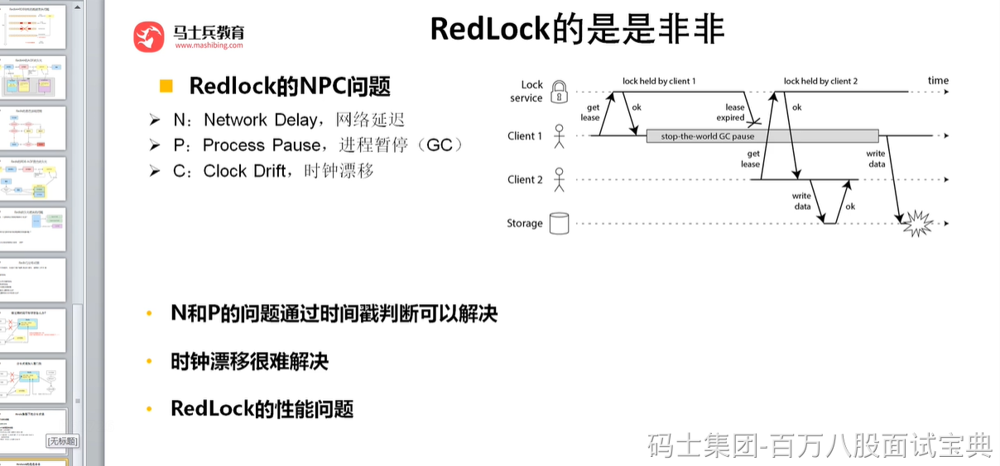
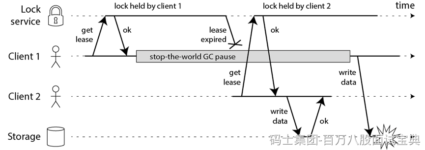

Redis 作者提出的 Redlock方案，是如何解决主从切换后，锁失效问题的。

**Redlock 的方案基于一个前提：**

不再需要部署从库和哨兵实例，只部署主库；但主库要部署多个，官方推荐至少 5 个实例。

**注意：不是部署 Redis Cluster，就是部署 5 个简单的 Redis 实例。它们之间没有任何关系，都是一个个孤立的实例。**

做完之后，我们看官网代码怎么去用的：

[8. 分布式锁和同步器 · redisson/redisson Wiki · GitHub](https://github.com/redisson/redisson/wiki/8.-%E5%88%86%E5%B8%83%E5%BC%8F%E9%94%81%E5%92%8C%E5%90%8C%E6%AD%A5%E5%99%A8#84-%E7%BA%A2%E9%94%81redlock)

**8.4. 红锁（RedLock）**

基于Redis的Redisson红锁 `RedissonRedLock`对象实现了[Redlock](http://redis.cn/topics/distlock.html)介绍的加锁算法。该对象也可以用来将多个 `RLock`对象关联为一个红锁，每个 `RLock`对象实例可以来自于不同的Redisson实例。

```plain
RLock lock1 = redissonInstance1.getLock("lock1");
RLock lock2 = redissonInstance2.getLock("lock2");
RLock lock3 = redissonInstance3.getLock("lock3");

RedissonRedLock lock = new RedissonRedLock(lock1, lock2, lock3);
// 同时加锁：lock1 lock2 lock3
// 红锁在大部分节点上加锁成功就算成功。
lock.lock();
...
lock.unlock();
```

大家都知道，如果负责储存某些分布式锁的某些Redis节点宕机以后，而且这些锁正好处于锁住的状态时，这些锁会出现锁死的状态。为了避免这种情况的发生，Redisson内部提供了一个监控锁的看门狗，它的作用是在Redisson实例被关闭前，不断的延长锁的有效期。默认情况下，看门狗的检查锁的超时时间是30秒钟，也可以通过修改[Config.lockWatchdogTimeout](https://github.com/redisson/redisson/wiki/2.-%E9%85%8D%E7%BD%AE%E6%96%B9%E6%B3%95#lockwatchdogtimeout%E7%9B%91%E6%8E%A7%E9%94%81%E7%9A%84%E7%9C%8B%E9%97%A8%E7%8B%97%E8%B6%85%E6%97%B6%E5%8D%95%E4%BD%8D%E6%AF%AB%E7%A7%92)来另行指定。

另外Redisson还通过加锁的方法提供了 `leaseTime`的参数来指定加锁的时间。超过这个时间后锁便自动解开了。

```plain
RedissonRedLock lock = new RedissonRedLock(lock1, lock2, lock3);
// 给lock1，lock2，lock3加锁，如果没有手动解开的话，10秒钟后将会自动解开
lock.lock(10, TimeUnit.SECONDS);

// 为加锁等待100秒时间，并在加锁成功10秒钟后自动解开
boolean res = lock.tryLock(100, 10, TimeUnit.SECONDS);
...
lock.unlock();
```

### Redlock实现整体流程

1、客户端先获取「当前时间戳T1」

2、客户端依次向这 5 个 Redis 实例发起加锁请求

3、如果客户端从 >=3 个（大多数）以上Redis 实例加锁成功，则再次获取「当前时间戳T2」，如果 T2 - T1  锁的过期时间，此时，认为客户端加锁成功，否则认为加锁失败。

4、加锁成功，去操作共享资源

5、加锁失败/释放锁，向「全部节点」发起释放锁请求。

所以总的来说：客户端在多个 Redis 实例上申请加锁；必须保证大多数节点加锁成功；大多数节点加锁的总耗时，要小于锁设置的过期时间；释放锁，要向全部节点发起释放锁请求。

**我们来看 Redlock 为什么要这么做？**

1) **为什么要在多个实例上加锁？**

本质上是为了「容错」，部分实例异常宕机，剩余的实例加锁成功，整个锁服务依旧可用。

2) **为什么大多数加锁成功，才算成功？**

多个 Redis 实例一起来用，其实就组成了一个「分布式系统」。在分布式系统中，总会出现「异常节点」，所以，在谈论分布式系统问题时，需要考虑异常节点达到多少个，也依旧不会影响整个系统的「正确性」。

这是一个分布式系统「容错」问题，这个问题的结论是：如果只存在「故障」节点，只要大多数节点正常，那么整个系统依旧是可以提供正确服务的。

3) **为什么步骤 3 加锁成功后，还要计算加锁的累计耗时？**

因为操作的是多个节点，所以耗时肯定会比操作单个实例耗时更久，而且，因为是网络请求，网络情况是复杂的，有可能存在延迟、丢包、超时等情况发生，网络请求越多，异常发生的概率就越大。

所以，即使大多数节点加锁成功，但如果加锁的累计耗时已经「超过」了锁的过期时间，那此时有些实例上的锁可能已经失效了，这个锁就没有意义了。

4) **为什么释放锁，要操作所有节点？**

在某一个 Redis 节点加锁时，可能因为「网络原因」导致加锁失败。

例如，客户端在一个 Redis 实例上加锁成功，但在读取响应结果时，网络问题导致读取失败，那这把锁其实已经在 Redis 上加锁成功了。

所以，释放锁时，不管之前有没有加锁成功，需要释放「所有节点」的锁，以保证清理节点上「残留」的锁。

好了，明白了 Redlock 的流程和相关问题，看似Redlock 确实解决了 Redis 节点异常宕机锁失效的问题，保证了锁的「安全性」。

但事实真的如此吗？

### RedLock的是是非非

一个分布式系统，更像一个复杂的「野兽」，存在着你想不到的各种异常情况。

这些异常场景主要包括三大块，这也是分布式系统会遇到的三座大山：NPC。

N：Network Delay，网络延迟

P：Process Pause，进程暂停（GC）

C：Clock Drift，时钟漂移

比如一个进程暂停（GC）的例子



1）客户端 1 请求锁定节点 A、B、C、D、E

2）客户端 1 的拿到锁后，进入 GC（时间比较久）

3）所有 Redis 节点上的锁都过期了

4）客户端 2 获取到了 A、B、C、D、E 上的锁

5）客户端 1 GC 结束，认为成功获取锁

6）客户端 2 也认为获取到了锁，发生「冲突」

GC 和网络延迟问题：这两点可以在红锁实现流程的第3步来解决这个问题。

但是最核心的还是时钟漂移，因为时钟漂移，就有可能导致第3步的判断本身就是一个BUG，所以当多个 Redis 节点「时钟」发生问题时，也会导致 Redlock 锁失效。

### RedLock总结


Redlock 只有建立在「时钟正确」的前提下，才能正常工作，如果你可以保证这个前提，那么可以拿来使用。

但是时钟偏移在现实中是存在的：

第一，从硬件角度来说，时钟发生偏移是时有发生，无法避免。例如，CPU 温度、机器负载、芯片材料都是有可能导致时钟发生偏移的。

第二，人为错误也是很难完全避免的。

所以，Redlock尽量不用它，而且它的性能不如单机版 Redis，部署成本也高，优先考虑使用主从+ 哨兵的模式实现分布式锁（只会有很小的记录发生主从切换时的锁丢失问题）。
