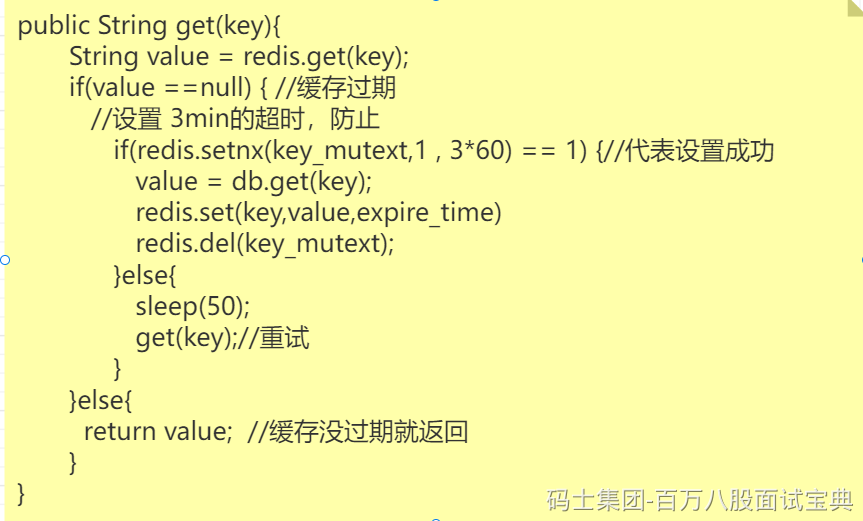

缓存击穿是指一个Key非常热点，在不停的扛着大并发，大并发集中对这一个点进行访问，当这个Key在失效的瞬间，持续的大并发就穿破缓存，直接请求数据库，就像在一个完好无损的桶上凿开了一个洞。

缓存击穿的话，设置热点数据永远不过期。或者加上互斥锁就能搞定了。

**使用互斥锁**

业界比较常用的做法，是使用mutex。简单地来说，就是在缓存失效的时候（判断拿出来的值为空），不是立即去load db，而是先使用缓存工具的某些带成功操作返回值的操作（比如Redis的SETNX）去set一个mutex key，当操作返回成功时，再进行load db的操作并回设缓存；否则，就重试整个get缓存的方法。

伪代码如下图：

**永远不过期**

这里的“永远不过期”包含两层意思：

(1) 从redis上看，确实没有设置过期时间，这就保证了，不会出现热点key过期问题，也就是“物理”不过期。

(2) 从功能上看，如果不过期，那不就成静态的了吗？所以我们把过期时间存在key对应的value里，如果发现要过期了，通过一个后台的异步线程进行缓存的构建，也就是“逻辑”过期

从实战看，这种方法对于性能非常友好，唯一不足的就是构建缓存时候，其余线程(非构建缓存的线程)可能访问的是老数据，但是对于一般的互联网功能来说这个还是可以忍受。
