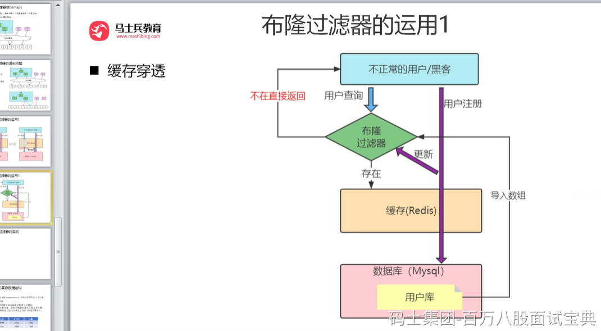
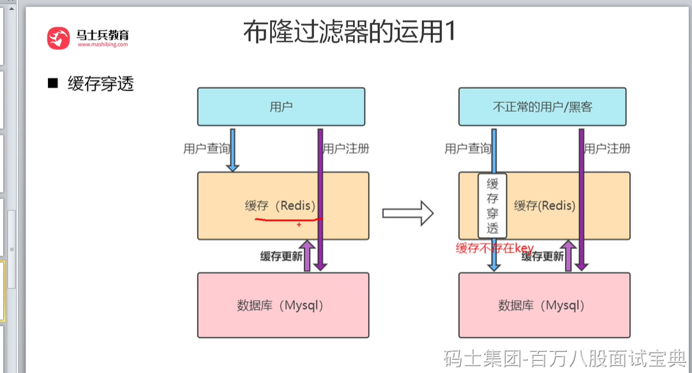
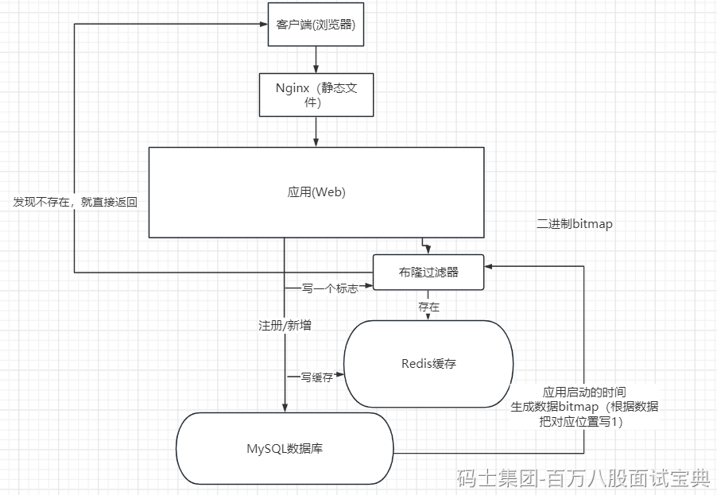

**缓存穿透**

是指查询一个根本不存在的数据，缓存层和存储层都不会命中，于是这个请求就可以随意访问数据库，这个就是缓存穿透，缓存穿透将导致不存在的数据每次请求都要到存储层去查询，失去了缓存保护后端存储的意义。

**造成缓存穿透的基本原因有两个。**

第一，自身业务代码或者数据出现问题，比如，我们数据库的 id 都是1开始自增上去的，如发起为id值为 -1 的数据或 id 为特别大不存在的数据。如果不对参数做校验，数据库id都是大于0的，我一直用小于0的参数去请求你，每次都能绕开Redis直接打到数据库，数据库也查不到，每次都这样，并发高点就容易崩掉了。

第二,一些恶意攻击、爬虫等造成大量空命中。。

**如何解决**

1.缓存空对象

当存储层不命中，到数据库查发现也没有命中，那么仍然将空对象保留到缓存层中，之后再访问这个数据将会从缓存中获取,这样就保护了后端数据源。不过空值做了缓存，意味着缓存层中存了更多的键，需要更多的内存空间(如果是攻击，问题更严重),比较有效的方法是针对这类数据设置一个较短的过期时间，让其自动剔除。

2.布隆过滤器拦截

在访问缓存层和存储层之前,将存在的key用布隆过滤器提前保存起来,做第一层拦截。例如:一个推荐系统有4亿个用户id，每个小时算法工程师会根据每个用户之前历史行为计算出推荐数据放到存储层中,但是最新的用户由于没有历史行为,就会发生缓存穿透的行为,为此可以将所有推荐数据的用户做成布隆过滤器。如果布隆过滤器认为该用户id不存在,那么就不会访问存储层,在一定程度保护了存储层。

这种方法适用于数据命中不高、数据相对固定、实时性低(通常是数据集较大)的应用场景,代码维护较为复杂,但是缓存空间占用少。
