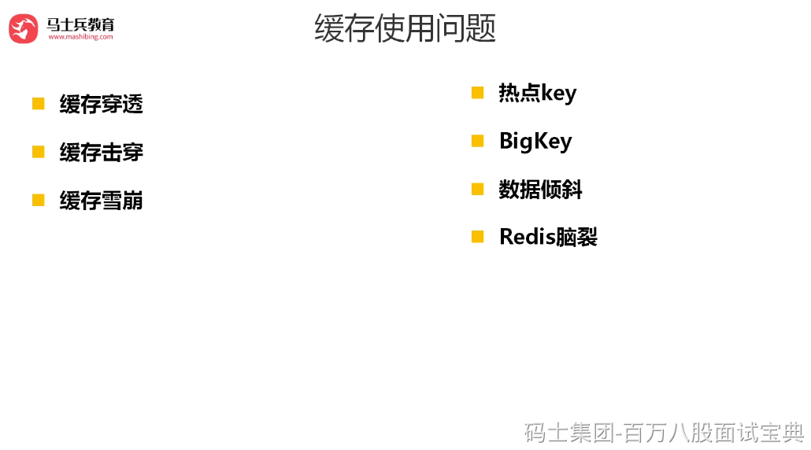

缓存雪崩:由于缓存层承载着大量请求,有效地保护了存储层,但是如果缓存层由于某些原因不能提供服务，比如同一时间缓存数据大面积失效，那一瞬间Redis跟没有一样，于是所有的请求都会达到存储层，存储层的调用量会暴增，造成存储层也会级联宕机的情况。

缓存雪崩的英文原意是stampeding herd(奔逃的野牛)，指的是缓存层宕掉后，流量会像奔逃的野牛一样,打向后端存储。

预防和解决缓存雪崩问题,可以从以下三个方面进行着手。

1）保证缓存层服务高可用性。和飞机都有多个引擎一样，如果缓存层设计成高可用的,即使个别节点、个别机器、甚至是机房宕掉，依然可以提供服务，例如前面介绍过的Redis

Sentinel和 Redis Cluster都实现了高可用。

2）依赖隔离组件为后端限流并降级。无论是缓存层还是存储层都会有出错的概率，可以将它们视同为资源。作为并发量较大的系统，假如有一个资源不可用，可能会造成线程全部阻塞(hang)在这个资源上，造成整个系统不可用。

3）提前演练。在项目上线前，演练缓存层宕掉后，应用以及后端的负载情况以及可能出现的问题,在此基础上做一些预案设定。

4）将缓存失效时间分散开，比如我们可以在原有的失效时间基础上增加一个随机值，比如1-5分钟随机，这样每一个缓存的过期时间的重复率就会降低，就很难引发集体失效的事件。
