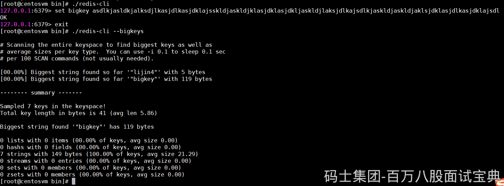
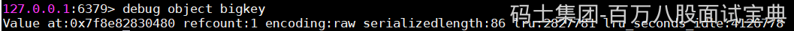
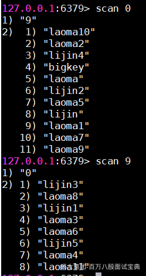
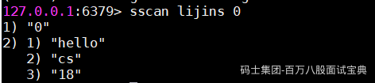

### 什么是bigkey

bigkey是指key对应的value所占的内存空间比较大，例如一个字符串类型的value可以最大存到512MB，一个列表类型的value最多可以存储23-1个元素。

如果按照数据结构来细分的话，一般分为字符串类型bigkey和非字符串类型bigkey。

字符串类型：体现在单个value值很大，一般认为超过10KB就是bigkey，但这个值和具体的OPS相关。

非字符串类型：哈希、列表、集合、有序集合,体现在元素个数过多。

bigkey无论是空间复杂度和时间复杂度都不太友好，下面我们将介绍它的危害。

### bigkey的危害

bigkey的危害体现在三个方面:

1、内存空间不均匀.(平衡):例如在Redis Cluster中，bigkey 会造成节点的内存空间使用不均匀。

2、超时阻塞:由于Redis单线程的特性，操作bigkey比较耗时，也就意味着阻塞Redis可能性增大。

3、网络拥塞:每次获取bigkey产生的网络流量较大

假设一个bigkey为1MB，每秒访问量为1000，那么每秒产生1000MB 的流量,对于普通的千兆网卡(按照字节算是128MB/s)的服务器来说简直是灭顶之灾，而且一般服务器会采用单机多实例的方式来部署,也就是说一个bigkey可能会对其他实例造成影响,其后果不堪设想。

bigkey的存在并不是完全致命的：

如果这个bigkey存在但是几乎不被访问,那么只有内存空间不均匀的问题存在,相对于另外两个问题没有那么重要紧急,但是如果bigkey是一个热点key(频繁访问)，那么其带来的危害不可想象,所以在实际开发和运维时一定要密切关注bigkey的存在。

#### 发现bigkey

redis-cli --bigkeys可以命令统计bigkey的分布。

但是在生产环境中，开发和运维人员更希望自己可以定义bigkey的大小，而且更希望找到真正的bigkey都有哪些,这样才可以去定位、解决、优化问题。

判断一个key是否为bigkey，只需要执行debug object key查看serializedlength属性即可，它表示 key对应的value序列化之后的字节数。

如果是要遍历多个，则尽量不要使用keys的命令，可以使用scan的命令来减少压力。

##### scan

Redis 从2.8版本后，提供了一个新的命令scan，它能有效的解决keys命令存在的问题。和keys命令执行时会遍历所有键不同,scan采用渐进式遍历的方式来解决 keys命令可能带来的阻塞问题，但是要真正实现keys的功能,需要执行多次scan。可以想象成只扫描一个字典中的一部分键，直到将字典中的所有键遍历完毕。scan的使用方法如下:

scan cursor [match pattern] [count number]

cursor ：是必需参数，实际上cursor是一个游标，第一次遍历从0开始，每次scan遍历完都会返回当前游标的值,直到游标值为0,表示遍历结束。

Match pattern ：是可选参数,它的作用的是做模式的匹配,这点和keys的模式匹配很像。

Count number ：是可选参数,它的作用是表明每次要遍历的键个数,默认值是10,此参数可以适当增大。

可以看到，第一次执行scan 0，返回结果分为两个部分:

第一个部分9就是下次scan需要的cursor

第二个部分是10个键。接下来继续

直到得到结果cursor变为0，说明所有的键已经被遍历过了。

除了scan 以外，Redis提供了面向哈希类型、集合类型、有序集合的扫描遍历命令，解决诸如hgetall、smembers、zrange可能产生的阻塞问题，对应的命令分别是hscan、sscan、zscan，它们的用法和scan基本类似，请自行参考Redis官网。

渐进式遍历可以有效的解决keys命令可能产生的阻塞问题，但是scan并非完美无瑕，如果在scan 的过程中如果有键的变化(增加、删除、修改)，那么遍历效果可能会碰到如下问题:新增的键可能没有遍历到，遍历出了重复的键等情况，也就是说scan并不能保证完整的遍历出来所有的键，这些是我们在开发时需要考虑的。

如果键值个数比较多，scan + debug object会比较慢，可以利用Pipeline机制完成。对于元素个数较多的数据结构，debug object执行速度比较慢，存在阻塞Redis的可能，所以如果有从节点,可以考虑在从节点上执行。

#### 解决bigkey

主要思路为拆分，对 big key 存储的数据 （big value）进行拆分，变成value1，value2… valueN等等。

例如big value 是个大json 通过 mset 的方式，将这个 key 的内容打散到各个实例中，或者一个hash，每个field代表一个具体属性，通过hget、hmget获取部分value，hset、hmset来更新部分属性。

例如big value 是个大list，可以拆成将list拆成。= list\_1， list\_2, list3, ...listN

其他数据类型同理。
