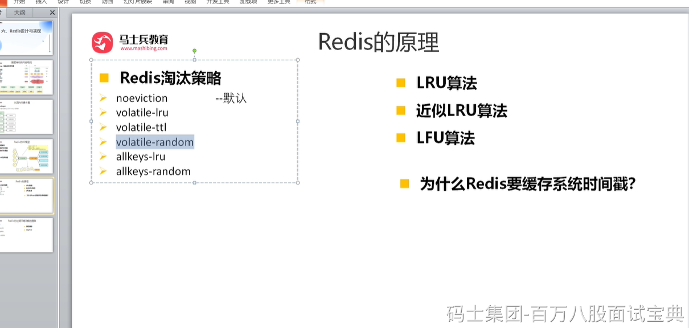
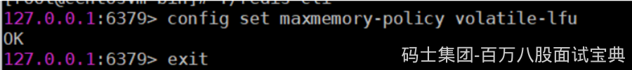
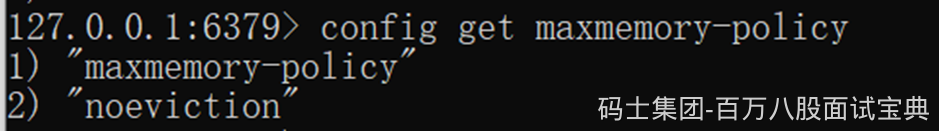
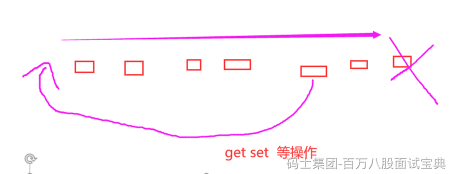

### 缓存淘汰算法（过期策略）

当 Redis 内存超出物理内存限制时，内存的数据会开始和磁盘产生频繁的交换 (swap)。交换会让 Redis 的性能急剧下降，对于访问量比较频繁的 Redis 来说，这样龟速的存取效率基本上等于不可用。

#### maxmemory

在生产环境中我们是不允许 Redis 出现交换行为的，为了限制最大使用内存，Redis 提供了配置参数 maxmemory 来限制内存超出期望大小。

当实际内存超出 maxmemory 时，Redis 提供了几种可选策略(maxmemory-policy) 来让用户自己决定该如何腾出新的空间以继续提供读写服务。

#### Noeviction

 noeviction 不会继续服务写请求(DEL 请求可以继续服务)，读请求可以继续进行。这样可以保证不会丢失数据，但是会让线上的业务不能持续进行。这是默认的淘汰策略。

#### volatile-lru

 volatile-lru 尝试淘汰设置了过期时间的key，最少使用的 key 优先被淘汰。没有设置过期时间的 key 不会被淘汰，这样可以保证需要持久化的数据不会突然丢失。

#### volatile-ttl

volatile-ttl 跟上面一样，除了淘汰的策略不是 LRU，而是 key 的剩余寿命 ttl 的值，ttl 越小越优先被淘汰。

#### volatile-random

volatile-random 跟上面一样，不过淘汰的 key 是过期 key 集合中随机的 key。

#### allkeys-lru

allkeys-lru 区别于volatile-lru，这个策略要淘汰的 key 对象是全体的 key 集合，而不只是过期的 key 集合。这意味着没有设置过期时间的 key 也会被淘汰。

#### allkeys-random

allkeys-random跟上面一样，不过淘汰的策略是随机的 key。

volatile-xxx 策略只会针对带过期时间的key 进行淘汰，allkeys-xxx 策略会对所有的 key 进行淘汰。如果你只是拿 Redis 做缓存，那应该使用 allkeys-xxx，客户端写缓存时不必携带过期时间。如果你还想同时使用 Redis 的持久化功能，那就使用 volatile-xxx 策略，这样可以保留没有设置过期时间的 key，它们是永久的 key 不会被 LRU 算法淘汰。

### LRU 算法

实现 LRU 算法除了需要key/value 字典外，还需要附加一个链表，链表中的元素按照一定的顺序进行排列。当空间满的时候，会踢掉链表尾部的元素。当字典的某个元素被访问时，它在链表中的位置会被移动到表头。所以链表的元素排列顺序就是元素最近被访问的时间顺序。

位于链表尾部的元素就是不被重用的元素，所以会被踢掉。位于表头的元素就是最近刚刚被人用过的元素，所以暂时不会被踢。

### 近似 LRU 算法

Redis 使用的是一种近似 LRU 算法，它跟 LRU 算法还不太一样。之所以不使用 LRU 算法，是因为需要消耗大量的额外的内存，需要对现有的数据结构进行较大的改造。近似

LRU 算法则很简单，在现有数据结构的基础上使用随机采样法来淘汰元素，能达到和 LRU 算法非常近似的效果。Redis 为实现近似 LRU 算法，它给每个 key 增加了一个额外的小字段，这个字段的长度是 24 个 bit，也就是最后一次被访问的时间戳。

当 Redis 执行写操作时，发现内存超出maxmemory，就会执行一次 LRU 淘汰算法。这个算法也很简单，就是随机采样出 5(可以配置maxmemory-samples) 个 key，然后淘汰掉最旧的 key，如果淘汰后内存还是超出 maxmemory，那就继续随机采样淘汰，直到内存低于 maxmemory 为止。

如何采样就是看maxmemory-policy 的配置，如果是 allkeys 就是从所有的 key 字典中随机，如果是 volatile 就从带过期时间的 key 字典中随机。每次采样多少个 key 看的是 maxmemory\_samples 的配置，默认为 5。

采样数量越大，近似 LRU 算法的效果越接近严格LRU 算法。

同时 Redis3.0 在算法中增加了淘汰池，新算法会维护一个候选池（大小为16），池中的数据根据访问时间进行排序，第一次随机选取的key都会放入池中，随后每次随机选取的key只有在访问时间小于池中最小的时间才会放入池中，直到候选池被放满。当放满后，如果有新的key需要放入，则将池中最后访问时间最大（最近被访问）的移除。进一步提升了近似 LRU 算法的效果。
