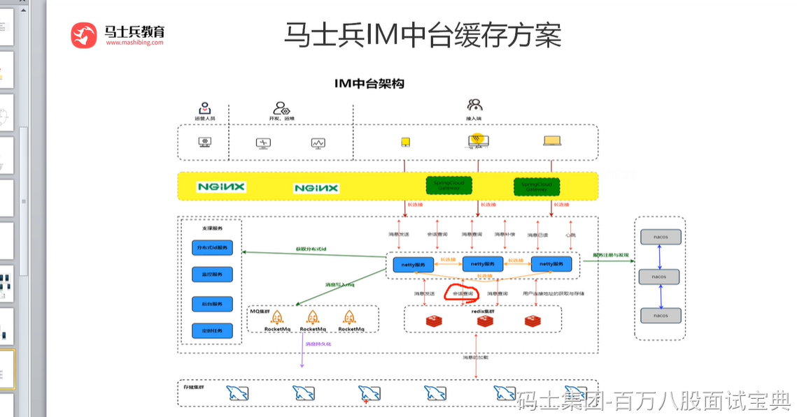
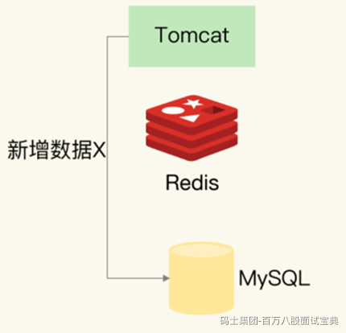
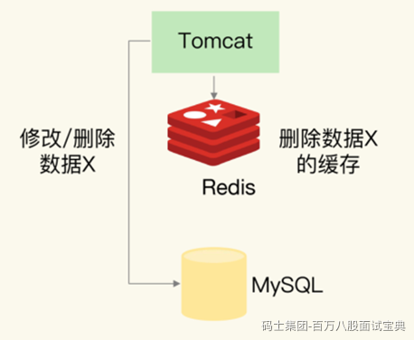
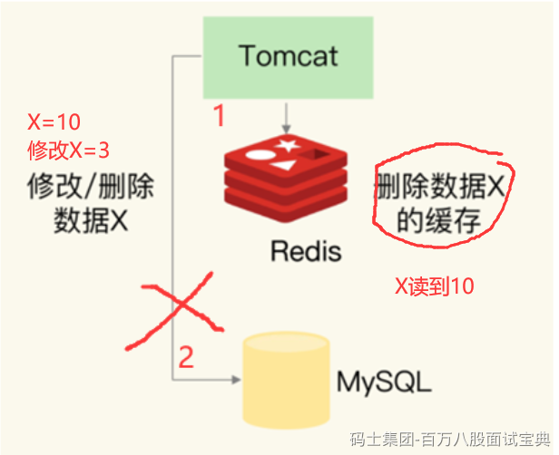
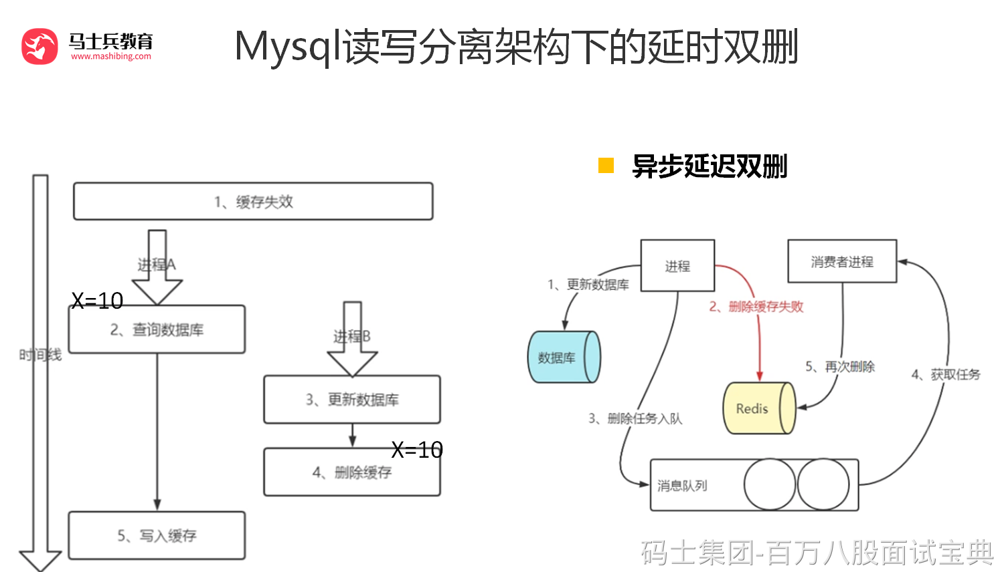
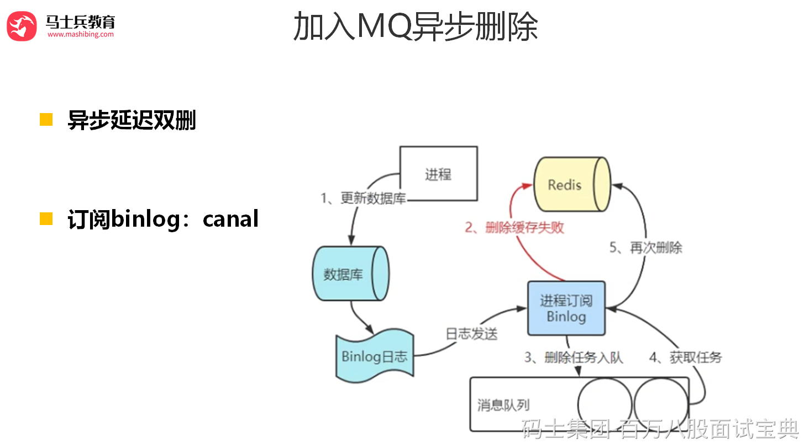

### 数据一致性

只要使用到缓存，无论是本地内存做缓存还是使用 redis 做缓存，那么就会存在数据同步的问题。

我以 Tomcat 向 MySQL 中写入和删改数据为例，来给你解释一下，数据的增删改操作具体是如何进行的。



我们分析一下几种解决方案，

1、先更新缓存，再更新数据库

2、先更新数据库，再更新缓存

3、先删除缓存，后更新数据库

4、先更新数据库，后删除缓存

#### 新增数据类

如果是新增数据，数据会直接写到数据库中，不用对缓存做任何操作，此时，缓存中本身就没有新增数据，而数据库中是最新值，此时，缓存和数据库的数据是一致的。

#### 更新缓存类

##### 1、先更新缓存，再更新DB

这个方案我们一般不考虑。原因是更新缓存成功，更新数据库出现异常了，导致缓存数据与数据库数据完全不一致，而且很难察觉，因为缓存中的数据一直都存在。



##### 2、先更新DB，再更新缓存

这个方案也我们一般不考虑，原因跟第一个一样，数据库更新成功了，缓存更新失败，同样会出现数据不一致问题。同时还有以下问题

*1**）并发问题：*

*同时有请求A****和请求B****进行更新操作，那么会出现*

*（1**）线程A*更新了数据库

*（2**）线程B*更新了数据库

*（3**）线程B*更新了缓存

*（4**）线程A*更新了缓存

*这就出现请求A****更新缓存应该比请求B****更新缓存早才对，但是因为网络等原因，B****却比A****更早更新了缓存。这就导致了脏数据，因此不考虑。*

*2**）业务场景问题*

*如果你是一个写数据库场景比较多，而读数据场景比较少的业务需求，采用这种方案就会导致，数据压根还没读到，缓存就被频繁的更新，浪费性能。*

**除了更新缓存之外，我们还有一种就是删除缓存。**

到底是选择更新缓存还是淘汰缓存呢？

主要取决于“更新缓存的复杂度”，更新缓存的代价很小，此时我们应该更倾向于更新缓存，以保证更高的缓存命中率，更新缓存的代价很大，此时我们应该更倾向于淘汰缓存。

#### 删除缓存类

##### 3、先删除缓存，后更新DB

该方案也会出问题，具体出现的原因如下。

1、此时来了两个请求，请求 A（更新操作） 和请求 B（查询操作）

2、请求 A 会先删除 Redis 中的数据，然后去数据库进行更新操作；

3、此时请求 B 看到 Redis 中的数据时空的，会去数据库中查询该值，补录到 Redis 中；

4、但是此时请求 A 并没有更新成功，或者事务还未提交，请求B去数据库查询得到旧值；

5、那么这时候就会产生数据库和 Redis 数据不一致的问题。

如何解决呢？其实最简单的解决办法就是延时双删的策略。就是

（1）先淘汰缓存

（2）再写数据库

（3）休眠1秒，再次淘汰缓存

**这段伪代码就是“延迟双删”**

```plain
redis.delKey(X)
db.update(X)
Thread.sleep(N)
redis.delKey(X)
```

这么做，可以将1秒内所造成的缓存脏数据，再次删除。

那么，这个1秒怎么确定的，具体该休眠多久呢？

针对上面的情形，读该自行评估自己的项目的读数据业务逻辑的耗时。然后写数据的休眠时间则在读数据业务逻辑的耗时基础上，加几百ms即可。这么做的目的，就是确保读请求结束，写请求可以删除读请求造成的缓存脏数据。

但是上述的保证事务提交完以后再进行删除缓存还有一个问题，就是如果你使用的是\*\* Mysql 的读写分离的架构\*\*的话，那么其实主从同步之间也会有时间差。

此时来了两个请求，请求 A（更新操作） 和请求 B（查询操作）

请求 A 更新操作，删除了Redis，

请求主库进行更新操作，主库与从库进行同步数据的操作，

请 B 查询操作，发现 Redis中没有数据，

去从库中拿去数据，此时同步数据还未完成，拿到的数据是旧数据。

此时的解决办法有两个：

1、还是使用双删延时策略。只是，睡眠时间修改为在主从同步的延时时间基础上，加几百ms。

2、就是如果是对 Redis进行填充数据的查询数据库操作，那么就强制将其指向主库进行查询。

继续深入，**采用这种同步淘汰策略，吞吐量降低怎么办？**

那就将第二次删除作为异步的。自己起一个线程，异步删除。这样，写的请求就不用沉睡一段时间后了，再返回。这么做，加大吞吐量。

继续深入，**第二次删除,如果删除失败怎么办？**

所以，我们引出了，下面的第四种策略，先更新数据库，再删缓存。

##### 4、先更新DB，后删除缓存

这种方式，被称为Cache Aside Pattern，读的时候，先读缓存，缓存没有的话，就读数据库，然后取出数据后放入缓存，同时返回响应。更新的时候，先更新数据库，然后再删除缓存。

### 如何选择问题

一般在线上，更多的偏向与使用删除缓存类操作，因为这种方式的话，会更容易避免一些问题。

因为删除缓存更新缓存的速度比在DB中要快一些，所以一般情况下我们可能会先用先更新DB，后删除缓存的操作。因为这种情况下缓存不一致性的情况只有可能是查询比删除慢的情况，而这种情况相对来说会少很多。同时结合延时双删的处理，可以有效的避免缓存不一致的情况。




