# 1.数据库架构演变与分库分表介绍

## 1.1 海量数据存储问题及解决方案

如今随着互联网的发展，数据的量级也是成指数的增长，从GB到TB到PB。对数据的各种操作也是愈加的困难，传统的关系性数据库已经无法满足快速查询与插入数据的需求。

阿里数据中心内景( 阿里、百度、腾讯这样的互联网巨头，数据量据说已经接近EB级)

使用NoSQL数据库, 通过降低数据的安全性，减少对事务的支持，减少对复杂查询的支持，来获取性能上的提升。

NoSQL并不是万能的，就比如有些使用场景是绝对要有事务与安全指标的, 所以还是要用关系型数据库, 这时候就需要搭建MySQL数据库集群,为了提高查询性能, 将一个数据库的数据分散到不同的数据库中存储, 通过这种数据库拆分的方法来解决数据库的性能问题。

**遇到的问题**

- 用户请求量太大
- 单服务器TPS、内存、IO都是有上限的，需要将请求打散分布到多个服务器
- 单库数据量太大
- 单个数据库处理能力有限；单库所在服务器的磁盘空间有限；单库上的操作IO有瓶颈
- 单表数据量太大
- 查询、插入、更新操作都会变慢，在加字段、加索引、机器迁移都会产生高负载，影响服务

**解决方案**

- 刚开始我们的系统只用了**单机数据库**
- 随着用户的不断增多，考虑到系统的高可用和越来越多的用户请求，我们开始使用数据库**主从架构**
- 当用户量级和业务进一步提升后，写请求越来越多，这时我们开始使用了**分库分表**

## 1.2 数据库架构的演进

### 1.2.1 理财平台 - V1.0

此时项目是一个单体应用架构 (一个归档包（可以是JAR、WAR、EAR或其它归档格式）包含所有功能的应用程序，通常称为单体应用)

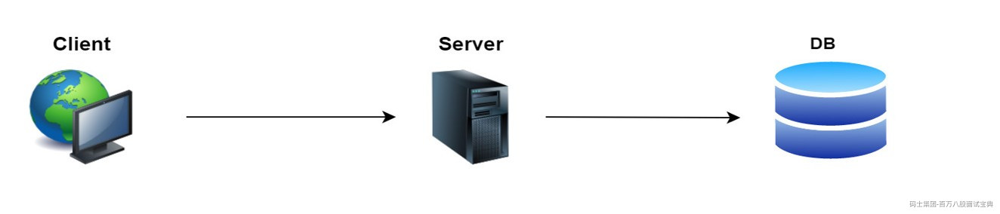

这个阶段是公司发展的早期阶段，系统架构如上图所示。我们经常会在单台服务器上运行我们所有的程序和软件。

在项目运行初期，User表、Order表、等等各种表都在同一个数据库中，每个表都包含了大量的字段。在用户量比较少，访问量也比较少的时候，单库单表不存在问题。

把所有软件和应用都部署在一台机器上，这样就完成一个简单系统的搭建，这个阶段一般是属于业务规模不是很大的公司使用，因为机器都是单台的话，随着我们业务规模的增长，慢慢的我们的网站就会出现一些瓶颈和隐患问题

公司可能发展的比较好，用户量开始大量增加，业务也越来越繁杂。一张表的字段可能有几十个甚至上百个，而且一张表存储的数据还很多，高达几千万数据，更难受的是这样的表还挺多。于是一个数据库的压力就太大了，一张表的压力也比较大。试想一下，我们在一张几千万数据的表中查询数据，压力本来就大，如果这张表还需要关联查询，那时间等等各个方面的压力就更大了。

### 1.2.2 理财平台 - V1.x

随着访问量的继续不断增加，单台应用服务器已经无法满足我们的需求。所以我们通过增 加应用服务器的方式来将服务器集群化。

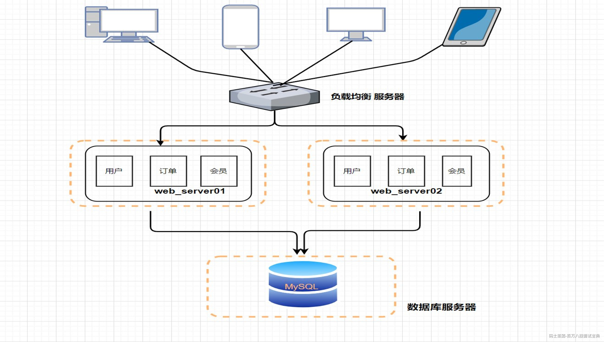

**存在的问题**

采用了应用服务器高可用集群的架构之后,应用层的性能被我们拉上来了,但是数据库的负载也在增加,随着访问量的提高,所有的压力都将集中在数据库这一层.

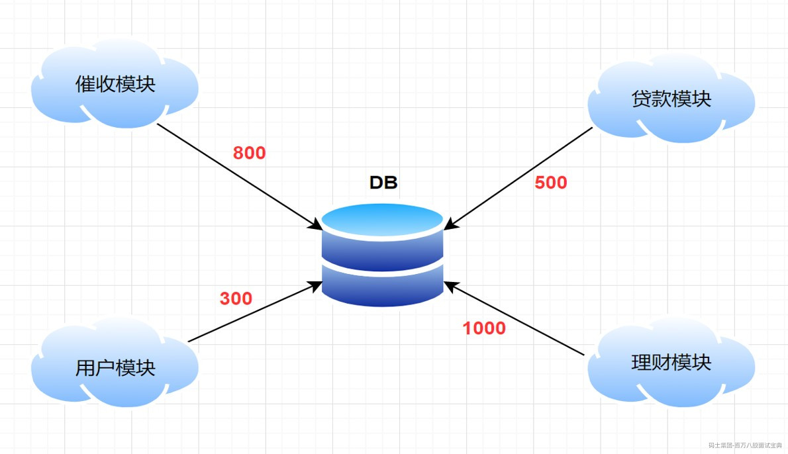

### 1.2.3 理财平台-V2.0 版本

应用层的性能被我们拉上来了，但数据库的负载也在逐渐增大，那如何去提高数据库层面的性能呢？

在实际的生产环境中, 数据的读写操作如果都在同一个**数据库服务器**中进行, 当遇到大量的并发读或者写操作的时候,是没有办法满足实际需求的,数据库的吞吐量将面临巨大的瓶颈压力.

- **数据库主从复制、读写分离**

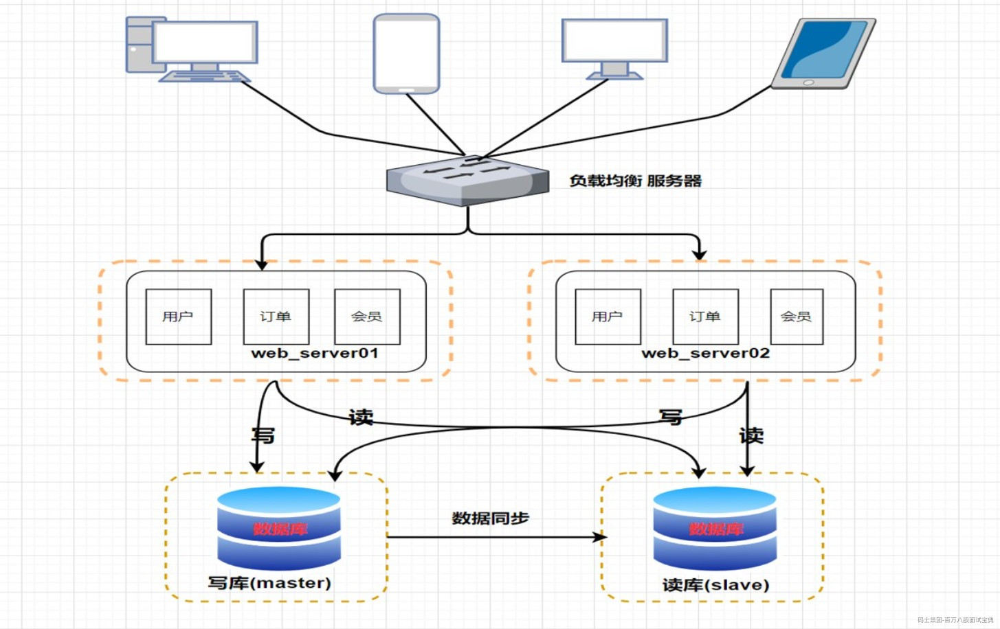

- 主从复制
- 通过搭建主从架构, 将数据库拆分为主库和从库，主库负责处理事务性的增删改操作，从库负责处理查询操作，能够有效的避免由数据更新导致的行锁，使得整个系统的查询性能得到极大的改善。
- 读写分离
- 读写分离就是让主库处理事务性操作，从库处理select查询。数据库复制被用来把事务性查询导致的数据变更同步到从库，同时主库也可以select查询.

**读写分离的数据节点中的数据内容是一致。**

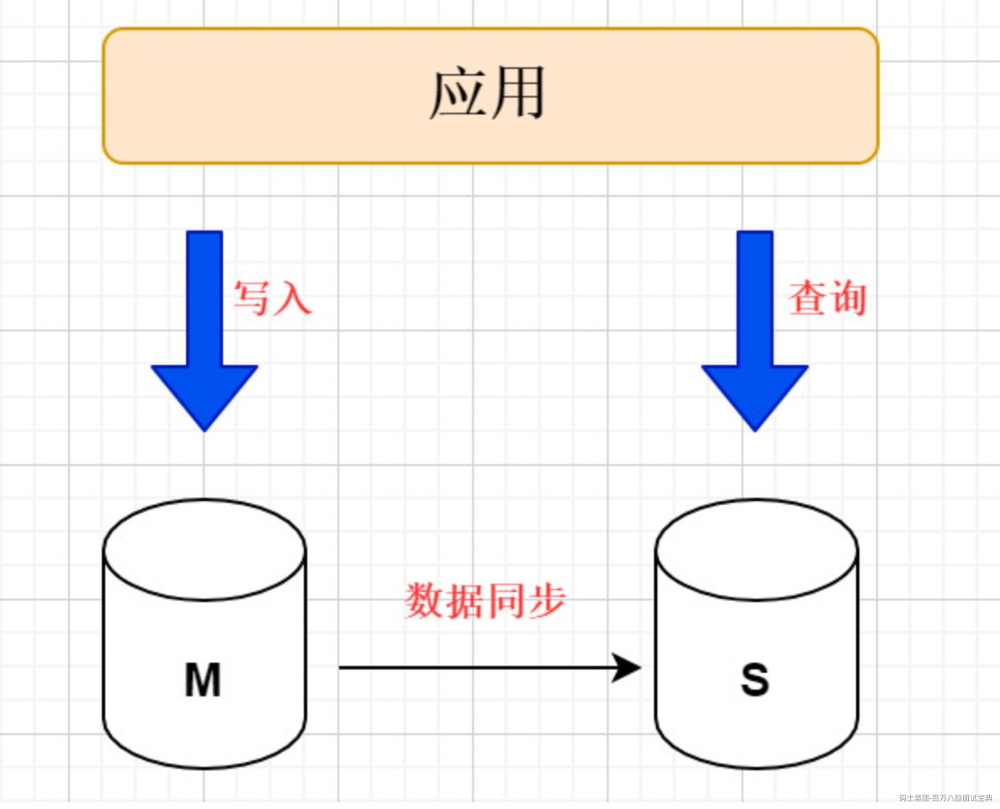

使用主从复制+读写分离一定程度上可以解决问题，但是用户超级多的时候，比如几个亿用户，此时写操作会越来越多，一个主库（Master）不能满足要求了，那就把主库拆分，这时候为了保证数据的一致性就要开始进行同步，此时会带来一系列问题：

（1）写操作拓展起来比较困难，因为要保证多个主库的数据一致性。

（2）复制延时：意思是同步带来的时间消耗。

（3）锁表率上升：读写分离，命中率少，锁表的概率提升。

（4）表变大，缓存率下降：此时缓存率一旦下降，带来的就是时间上的消耗。

主从复制架构随着用户量的增加、访问量的增加、数据量的增加依然会带来大量的问题.

### 1.2.4 理财平台-V2.x 版本

然后又随着访问量的持续不断增加，慢慢的我们的系统项目会出现许多用户访问同一内容的情况，比如秒杀活动，抢购活动等。

那么对于这些热点数据的访问，没必要每次都从数据库重读取，这时我们可以使用到缓存技术，比如 redis、memcache 来作为我们应用层的缓存。

- **数据库主从复制、读写分离 +缓存技术**

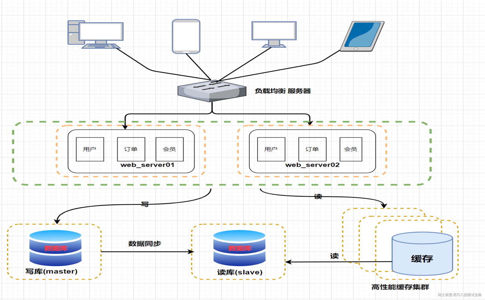

**存在的问题**

1. 缓存只能缓解读取压力，数据库的写入压力还是很大
2. 且随着数据量的继续增大，性能还是很缓慢

我们的系统架构从单机演变到这个阶,所有的数据都还在同一个数据库中，尽管采取了增加缓存，主从、读写分离的方式，但是随着数据库的压力持续增加，数据库的瓶颈仍然是个最大的问题。因此我们可以考虑对数据的垂直拆分和水平拆分。就是今天所讲的主题，分库分表。

## 1.5 分库分表

### 1.5.1 什么是分库分表

简单来说，就是指通过某种特定的条件，将我们存放在同一个数据库中的数据分散存放到多个数据库（主机）上面，以达到分散单台设备负载的效果。

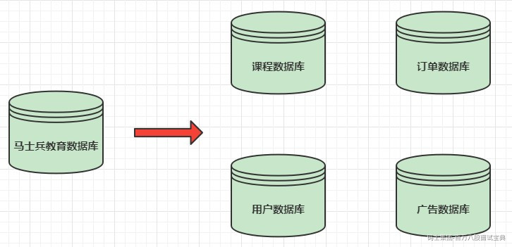

- 分库分表解决的问题
- **分库分表的目的是为了解决由于数据量过大而导致数据库性能降低的问题，将原来单体服务的数据库进行拆分.将数据大表拆分成若干数据表组成，使得单一数据库、单一数据表的数据量变小，从而达到提升数据库性能的目的。**
- 什么情况下需要分库分表

- **单机存储容量遇到瓶颈.**
- **连接数,处理能力达到上限.**

注意:

分库分表之前,要根据项目的实际情况 确定我们的数据量是不是够大,并发量是不是够大,来决定是否分库分表.

数据量不够就不要分表,单表数据量超过1000万或100G的时候, 速度就会变慢(官方测试),

### 1.5.2 分库分表的方式

分库分表包括： 垂直分库、垂直分表、水平分库、水平分表 四种方式。

#### 1.5.2.1 垂直分库

- 数据库中不同的表对应着不同的业务，垂直切分是指按照业务的不同将表进行分类,分布到不同的数据库上面

- 将数据库部署在不同服务器上，从而达到多个服务器共同分摊压力的效果

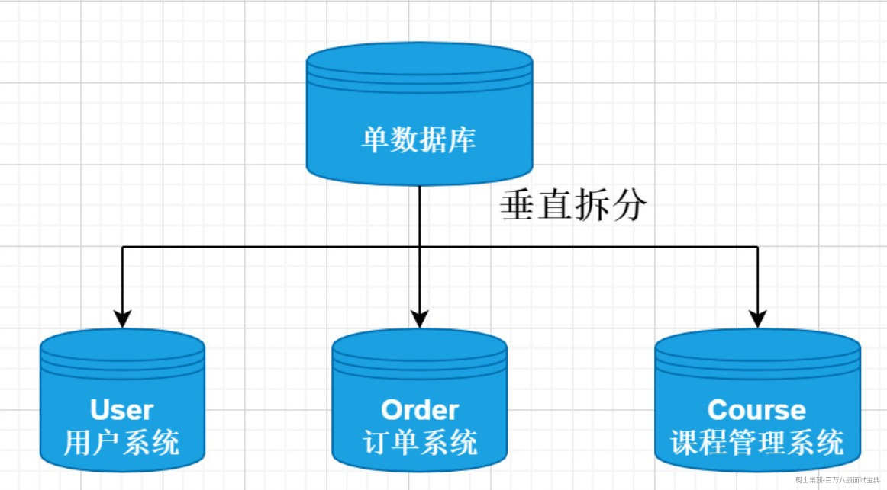

#### 1.5.2.2 垂直分表

表中字段太多且包含大字段的时候，在查询时对数据库的IO、内存会受到影响，同时更新数据时，产生的binlog文件会很大，MySQL在主从同步时也会有延迟的风险

- 将一个表按照字段分成多表，每个表存储其中一部分字段。
- 对职位表进行垂直拆分, 将职位基本信息放在一张表, 将职位描述信息存放在另一张表

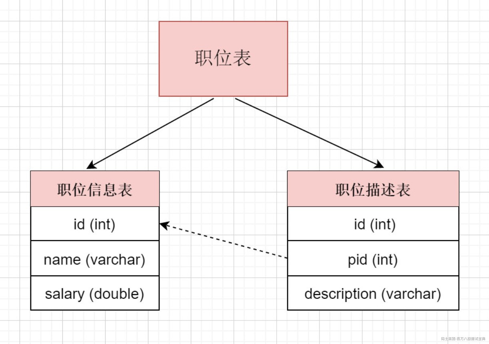

- 垂直拆分带来的一些提升

- 解决业务层面的耦合，业务清晰
- 能对不同业务的数据进行分级管理、维护、监控、扩展等
- 高并发场景下，垂直分库一定程度的提高访问性能

- 垂直拆分没有彻底解决单表数据量过大的问题

#### 1.5.2.3 水平分库

- 将单张表的数据切分到多个服务器上去，每个服务器具有相应的库与表，只是表中数据集合不同。 水平分库分表能够有效的缓解单机和单库的性能瓶颈和压力，突破IO、连接数、硬件资源等的瓶颈.
- 简单讲就是根据表中的数据的逻辑关系，将同一个表中的数据按照某种条件拆分到多台数据库（主机）上面, 例如将订单表 按照id是奇数还是偶数, 分别存储在不同的库中。
- 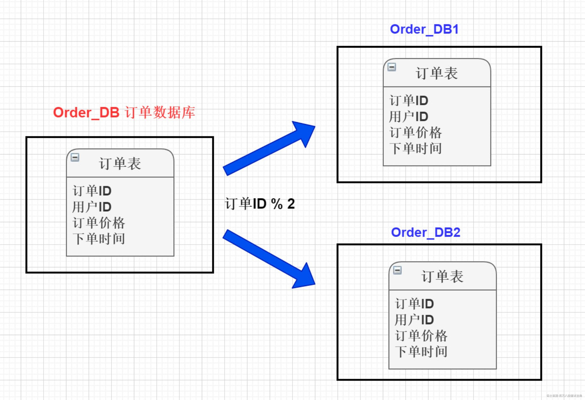

#### 1.5.2.4 水平分表

- 针对数据量巨大的单张表（比如订单表），按照规则把一张表的数据切分到多张表里面去。 但是这些表还是在同一个库中，所以库级别的数据库操作还是有IO瓶颈。

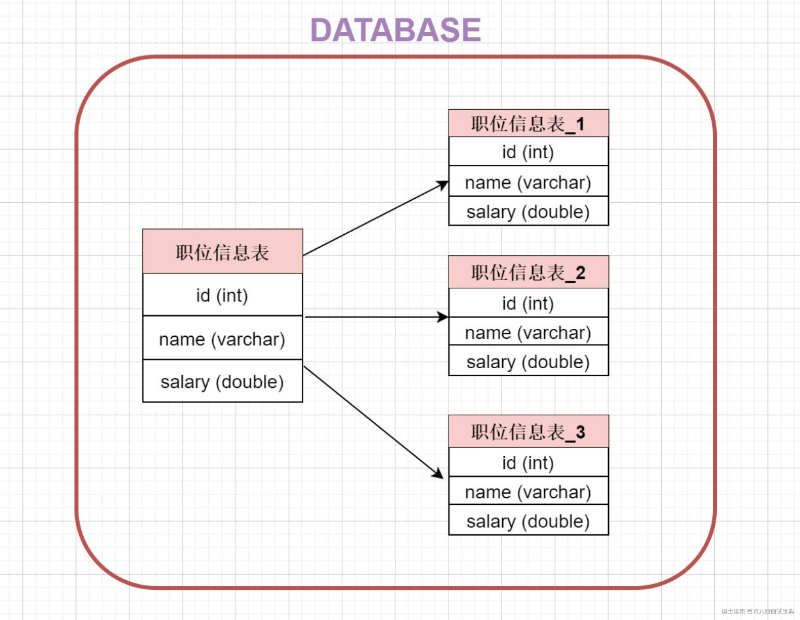

- 总结

- **垂直分表**: 将一个表按照字段分成多表，每个表存储其中一部分字段。
- **垂直分库**: 根据表的业务不同,分别存放在不同的库中,这些库分别部署在不同的服务器.
- **水平分库**: 把一张表的数据按照一定规则,分配到**不同的数据库**,每一个库只有这张表的部分数据.
- **水平分表**: 把一张表的数据按照一定规则,分配到**同一个数据库的多张表中**,每个表只有这个表的部分数据.

### 1.5.3 分库分表的规则

**1) 水平分库规则**

- 不跨库、不跨表，保证同一类的数据都在同一个服务器上面。
- 数据在切分之前，需要考虑如何高效的进行数据获取，如果每次查询都要跨越多个节点，就需要谨慎使用。

**2) 水平分表规则**

- RANGE

- 时间：按照年、月、日去切分。例如order*2020、order*202005、order\_20200501
- 地域：按照省或市去切分。例如order*beijing、order*shanghai、order\_chengdu
- 大小：从0到1000000一个表。例如1000001-2000000放一个表，每100万放一个表

- HASH

- 用户ID取模

**3) 不同的业务使用的切分规则是不一样，就上面提到的切分规则，举例如下：**

- 用户表

- 范围法：以用户ID为划分依据，将数据水平切分到两个数据库实例，如：1到1000W在一张表，1000W到2000W在一张表，这种情况会出现单表的负载较高
- 按照用户ID HASH尽量保证用户数据均衡分到数据库中
- 如果在登录场景下，用户输入手机号和验证码进行登录，这种情况下，登录时是不是需要扫描所有分库的信息？
- 最终方案：用户信息采用ID做切分处理，同时存储用户ID和手机号的映射的关系表（新增一个关系表），关系表采用手机号进行切分。可以通过关系表根据手机号查询到对应的ID，再定位用户信息。

- 流水表

- 时间维度：可以根据每天新增的流水来判断，选择按照年份分库，还是按照月份分库，甚至也可以按照日期分库

### 1.5.4 分库分表带来的问题及解决方案

关系型数据库在单机单库的情况下,比较容易出现性能瓶颈问题,分库分表可以有效的解决这方面的问题,但是同时也会产生一些 比较棘手的问题.

**1) 事务一致性问题**

- 当我们需要更新的内容同时分布在不同的库时, 不可避免的会产生跨库的事务问题. 原来在一个数据库操作, 本地事务就可以进行控制, 分库之后 一个请求可能要访问多个数据库,如何保证事务的一致性,目前还没有简单的解决方案.

**2) 跨节点关联的问题**

- 在分库之后, 原来在一个库中的一些表,被分散到多个库,并且这些数据库可能还不在一台服务器,无法关联查询.解决这种关联查询,需要我们在代码层面进行控制,将关联查询拆开执行,然后再将获取到的结果进行拼装.

**3) 分页排序查询的问题**

- 分库并行查询时,如果用到了分页 每个库返回的结果集本身是无序的, 只有将多个库中的数据先查出来,然后再根据排序字段在内存中进行排序,如果查询结果过大也是十分消耗资源的.

**4) 主键避重问题**

- 在分库分表的环境中,表中的数据存储在不同的数据库, 主键自增无法保证ID不重复, 需要单独设计全局主键.

**5) 公共表的问题**

- 不同的数据库,都需要从公共表中获取数据. 某一个数据库更新看公共表其他数据库的公共表数据需要进行同步.

**上面我们说了分库分表后可能会遇到的一些问题, 接下来带着这些问题,我们就来一起来学习一下Apache ShardingSphere !**

# 2.ShardingSphere实战

## 2.1 什么是ShardingSphere

Apache ShardingSphere 是一款分布式的数据库生态系统， 可以将任意数据库转换为分布式数据库，并通过数据分片、弹性伸缩、加密等能力对原有数据库进行增强。

官网: <https://shardingsphere.apache.org/document/current/cn/overview/>

Apache ShardingSphere 设计哲学为 Database Plus，旨在构建异构数据库上层的标准和生态。 它关注如何充分合理地利用数据库的计算和存储能力，而并非实现一个全新的数据库。 它站在数据库的上层视角，关注它们之间的协作多于数据库自身。

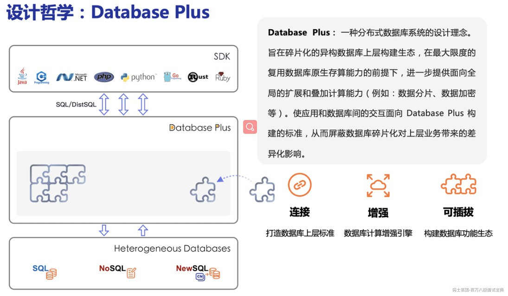

Apache ShardingSphere它由Sharding-JDBC、Sharding-Proxy和Sharding-Sidecar（规划中）这3款相互独立的产品组成。 他们均提供标准化的数据分片、分布式事务和数据库治理功能，可适用于如Java同构、异构语言、容器、云原生等各种多样化的应用场景。

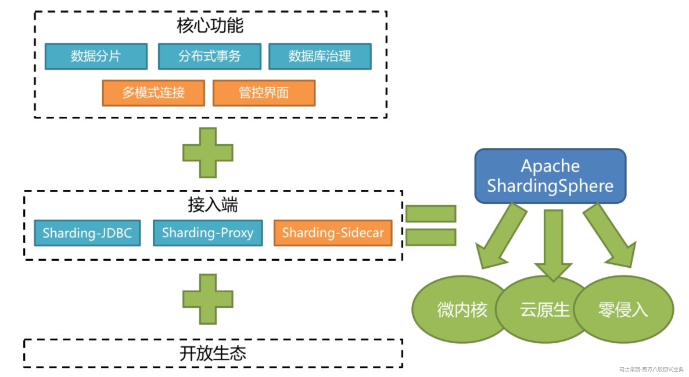

- Sharding-JDBC：被定位为轻量级Java框架，在Java的JDBC层提供的额外服务，以jar包形式使用。
- Sharding-Proxy：被定位为透明化的数据库代理端，向应用程序完全透明，可直接当做 MySQL 使用；
- Sharding-Sidecar：被定位为Kubernetes(K8S)的云原生数据库代理，以守护进程的形式代理所有对数据库的访问(只是计划在未来做)。

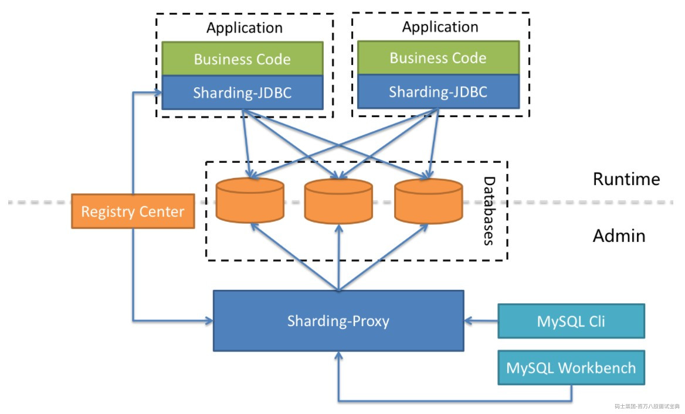

Sharding-JDBC、Sharding-Proxy之间的区别如下：

异构是继面向对象编程思想又一种较新的编程思想，面向服务编程，不用顾虑语言的差别，提供规范的服务接口，我们无论使用什么语言，就都可以访问使用了，大大提高了程序的复用率。

Sharding-Proxy的优势在于对异构语言的支持，以及为DBA提供可操作入口。它可以屏蔽底层分库分表的复杂度，运维及开发人员仅面向proxy操作，像操作单个数据库一样操作复杂的底层MySQL实例

很显然ShardingJDBC只是客户端的一个工具包,可以理解为一个特殊的JDBC驱动包,所有分库分表逻辑均有业务方自己控制,所以他的功能相对灵活,支持的 数据库也非常多,但是对业务侵入大,需要业务方自己定义所有的分库分表逻辑.

而ShardingProxy是一个独立部署的服务,对业务方无侵入,业务方可以像用一个普通的MySQL服务一样进行数据交互,基本上感觉不到后端分库分表逻辑的存在,但是这也意味着功能会比较固定,能够支持的数据库也比较少,两者各有优劣.

ShardingSphere项目状态如下：

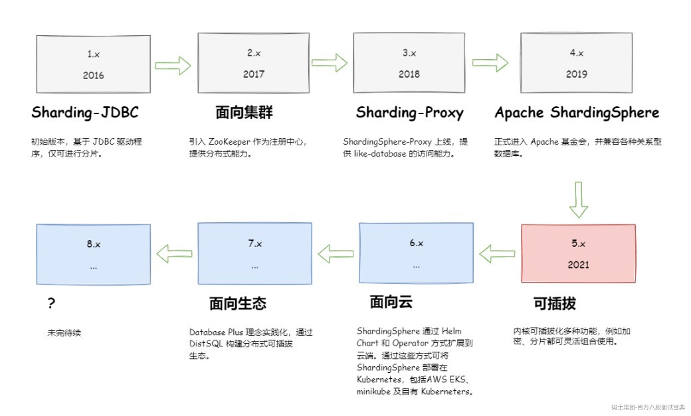

ShardingSphere定位为关系型数据库中间件，旨在充分合理地在分布式的场景下利用关系型数据库的计算和存储能力，而并非实现一个全新的关系型数据库。

## 2.2 Sharding-JDBC介绍

Sharding-JDBC定位为轻量级Java框架，在Java的JDBC层提供的额外服务。 它使用客户端直连数据库，以jar包形式提供服务，无需额外部署和依赖，可理解为增强版的JDBC驱动，完全兼容JDBC和各种ORM框架的使用。

- 适用于任何基于Java的ORM框架，如：JPA, Hibernate, Mybatis, Spring JDBC Template或直接使用JDBC。
- 基于任何第三方的数据库连接池，如：DBCP, C3P0, Druid, HikariCP等。
- 支持任意实现JDBC规范的数据库。目前支持MySQL，Oracle，SQLServer和PostgreSQL。

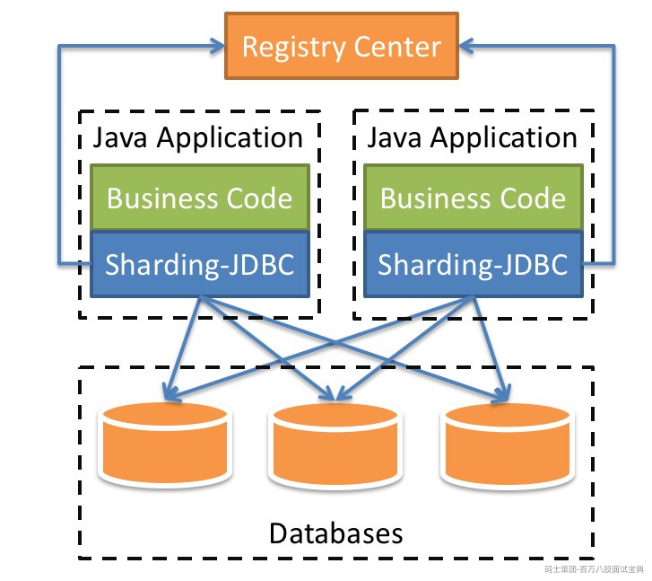

**Sharding-JDBC主要功能**：

- 数据分片

- 分库、分表
- 读写分离
- 分片策略
- 分布式主键

- 分布式事务

- 标准化的事务接口
- XA强一致性事务
- 柔性事务

- 数据库治理

- 配置动态化
- 编排和治理
- 数据脱敏
- 可视化链路追踪

**Sharding-JDBC 内部结构**：

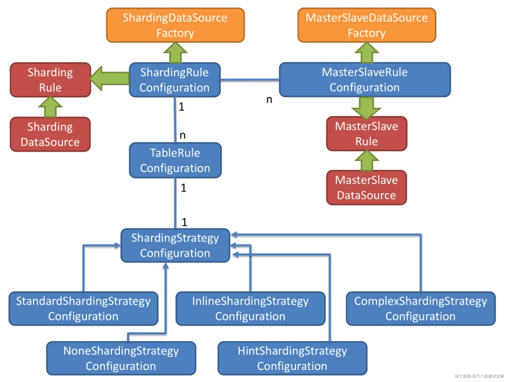

- 图中黄色部分表示的是Sharding-JDBC的入口API，采用工厂方法的形式提供。 目前有ShardingDataSourceFactory和MasterSlaveDataSourceFactory两个工厂类。

- ShardingDataSourceFactory支持分库分表、读写分离操作
- MasterSlaveDataSourceFactory支持读写分离操作

- 图中蓝色部分表示的是Sharding-JDBC的配置对象，提供灵活多变的配置方式。 ShardingRuleConfiguration是分库分表配置的核心和入口，它可以包含多个TableRuleConfiguration和MasterSlaveRuleConfiguration。

- TableRuleConfiguration封装的是表的分片配置信息，有5种配置形式对应不同的Configuration类型。
- MasterSlaveRuleConfiguration封装的是读写分离配置信息。

- 图中红色部分表示的是内部对象，由Sharding-JDBC内部使用，应用开发者无需关注。Sharding-JDBC通过ShardingRuleConfiguration和MasterSlaveRuleConfiguration生成真正供ShardingDataSource和MasterSlaveDataSource使用的规则对象。ShardingDataSource和MasterSlaveDataSource实现了DataSource接口，是JDBC的完整实现方案。

## 2.3 数据分片详解与实战

### 2.3.1 核心概念

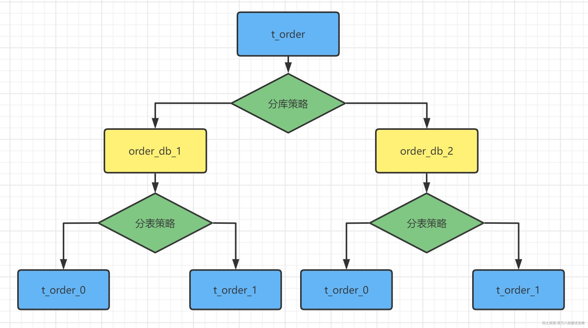

对于数据库的垂直拆分一般都是在数据库设计初期就会完成,因为垂直拆分与业务直接相关,而我们提到的分库分表一般是指的水平拆分,数据分片就是将原本一张数据量较大的表t*order拆分生成数个表结构完全一致的小数据量表t*order*0、t*order\_1......,每张表只保存原表的部分数据.

#### 2.3.1.1 表概念

- 逻辑表
- 水平拆分的数据库（表）的相同逻辑和数据结构表的总称。比如我们将订单表t*order 拆分成 t*order*0 ··· t*order*9 等 10张表。此时我们会发现分库分表以后数据库中已不在有 t*order 这张表，取而代之的是 t*order*n，但我们在代码中写 SQL依然按 t*order 来写。此时 t*order 就是这些拆分表的逻辑表。
- 真实表
- 数据库中真实存在的物理表。例如: t*order0、t*order1
- 数据节点
- 在分片之后，由数据源和数据表组成。例如:t*order*db1.t*order*0
- 绑定表
- 指的是分片规则一致的关系表（主表、子表），例如t*order和t*order*item，均按照order*id分片，则此两个表互为绑定表关系。绑定表之间的多表关联查询不会出现笛卡尔积关联，可以提升关联查询效率。
- # t\_order：t\_order0、t\_order1  
  # t\_order\_item：t\_order\_item0、t\_order\_item1  
    
  select \* from t\_order o join t\_order\_item i on(o.order\_id=i.order\_id) where o.order\_id in (10,11);
- 由于分库分表以后这些表被拆分成N多个子表。如果不配置绑定表关系，会出现笛卡尔积关联查询，将产生如下四条SQL。
- select \* from t\_order0 o join t\_order\_item0 i on o.order\_id=i.order\_id  
  where o.order\_id in (10,11);  
    
  select \* from t\_order0 o join t\_order\_item1 i on o.order\_id=i.order\_id  
  where o.order\_id in (10,11);  
    
  select \* from t\_order1 o join t\_order\_item0 i on o.order\_id=i.order\_id  
  where o.order\_id in (10,11);  
    
  select \* from t\_order1 o join t\_order\_item1 i on o.order\_id=i.order\_id  
  where o.order\_id in (10,11);
- 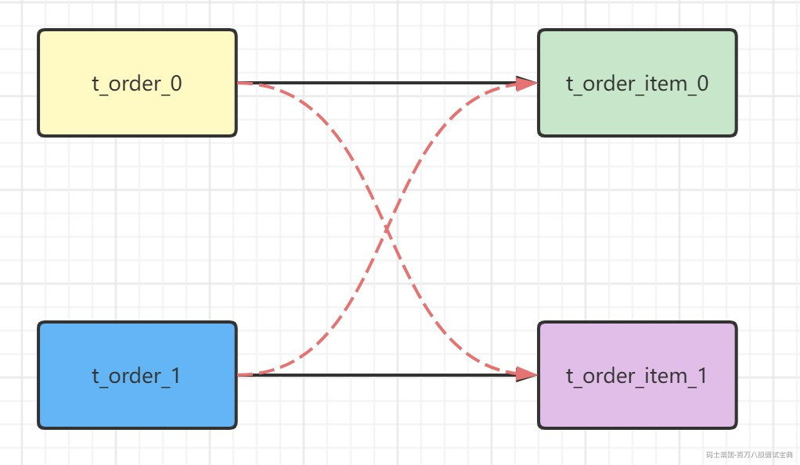
- 如果配置绑定表关系后再进行关联查询时，只要对应表分片规则一致产生的数据就会落到同一个库中，那么只需 t*order*0和 t*order*item\_0 表关联即可。
- select \* from b\_order0 o join b\_order\_item0 i on(o.order\_id=i.order\_id)  
  where o.order\_id in (10,11);  
    
  select \* from b\_order1 o join b\_order\_item1 i on(o.order\_id=i.order\_id)  
  where o.order\_id in (10,11);
- 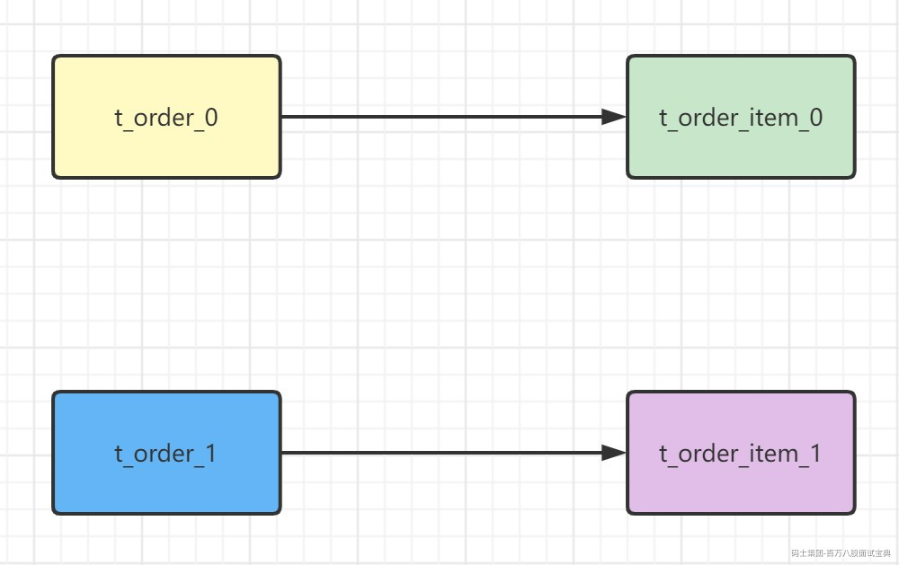
- 注意：在关联查询时 t*order 它作为整个联合查询的主表。所有相关的路由计算都只使用主表的策略，t*order*item 表的分片相关的计算也会使用 t*order 的条件，所以要保证绑定表之间的分片键要完全相同,当保证这些一样之后，根据sql去查询时会统一的路由到0表或者1表，自然就没有笛卡尔积问题了。
- 广播表
- 在使用中，有些表没必要做分片，例如字典表、省份信息等，因为他们数据量不大，而且这种表可能需要与海量数据的表进行关联查询。广播表会在不同的数据节点上进行存储，存储的表结构和数据完全相同。
- 单表
- 指所有的分片数据源中只存在唯一一张的表。适用于数据量不大且不需要做任何分片操作的场景。

#### 2.3.1.2 分片键

用于分片的数据库字段，是将数据库（表）水平拆分的关键字段。

例：将订单表中的订单主键的尾数取模分片，则订单主键为分片字段。 SQL 中如果无分片字段，将执行全路由(去查询所有的真实表)，性能较差。 除了对单分片字段的支持，Apache ShardingSphere 也支持根据多个字段进行分片。

#### 2.3.1.3 分片算法

由于分片算法(ShardingAlgorithm) 和业务实现紧密相关，因此并未提供内置分片算法，而是通过分片策略将各种场景提炼出来，提供更高层级的抽象，并提供接口让应用开发者自行实现分片算法。目前提供4种分片算法。

- 精确分片算法
- 用于处理使用单一键作为分片键的=与IN进行分片的场景。
- 范围分片算法
- 用于处理使用单一键作为分片键的BETWEEN AND、>、<、>=、<=进行分片的场景。
- 复合分片算法
- 用于处理使用多键作为分片键进行分片的场景，多个分片键的逻辑较复杂，需要应用开发者自行处理其中的复杂度。
- Hint分片算法
- 用于处理使用Hint行分片的场景。对于分片字段非SQL决定，而由其他外置条件决定的场景，可使用SQL Hint灵活的注入分片字段。例：内部系统，按照员工登录主键分库，而数据库中并无此字段。SQL Hint支持通过Java API和SQL注释两种方式使用。

#### 2.3.1.4 分片策略

**分片策略(ShardingStrategy) 包含分片键和分片算法，真正可用于分片操作的是分片键 + 分片算法，也就是分片策略**。目前提供5种分片策略。

- 标准分片策略 StandardShardingStrategy
- 只支持单分片键，提供对SQL语句中的=, >, <, >=, <=, IN和BETWEEN AND的分片操作支持。提供PreciseShardingAlgorithm和RangeShardingAlgorithm两个分片算法。
- PreciseShardingAlgorithm是必选的，RangeShardingAlgorithm是可选的。但是SQL中使用了范围操作，如果不配置RangeShardingAlgorithm会采用全库路由扫描，效率低。
- 复合分片策略 ComplexShardingStrategy
- 支持多分片键。提供对SQL语句中的=, >, <, >=, <=, IN和BETWEEN AND的分片操作支持。由于多分片键之间的关系复杂，因此并未进行过多的封装，而是直接将分片键值组合以及分片操作符透传至分片算法，完全由应用开发者实现，提供最大的灵活度。
- 行表达式分片策略 InlineShardingStrategy
- 只支持单分片键。使用Groovy的表达式，提供对SQL语句中的=和IN的分片操作支持，对于简单的分片算法，可以通过简单的配置使用，从而避免繁琐的Java代码开发。如: t*user*$->{u*id % 8} 表示t*user表根据u*id模8，而分成8张表，表名称为t*user*0到t*user\_7。
- Hint分片策略HintShardingStrategy
- 通过Hint指定分片值而非从SQL中提取分片值的方式进行分片的策略。
- 不分片策略NoneShardingStrategy
- 不分片的策略。

分片策略配置

对于分片策略存有数据源分片策略和表分片策略两种维度，两种策略的API完全相同。

- 数据源分片策略
- 用于配置数据被分配的目标数据源。
- 表分片策略
- 用于配置数据被分配的目标表，由于表存在与数据源内，所以表分片策略是依赖数据源分片策略结果的。

#### 2.3.1.5 分布式主键

数据分片后，不同数据节点生成全局唯一主键是非常棘手的问题，同一个逻辑表（t*order）内的不同真实表（t*order\_n）之间的自增键由于无法互相感知而产生重复主键。

尽管可通过设置自增主键初始值和步长的方式避免ID碰撞，但这样会使维护成本加大，缺乏完整性和可扩展性。如果后去需要增加分片表的数量，要逐一修改分片表的步长，运维成本非常高，所以不建议这种方式。

ShardingSphere不仅提供了内置的分布式主键生成器，例如UUID、SNOWFLAKE，还抽离出分布式主键生成器的接口，方便用户自行实现自定义的自增主键生成器。

**内置主键生成器：**

- UUID
- 采用UUID.randomUUID()的方式产生分布式主键。
- SNOWFLAKE
- 在分片规则配置模块可配置每个表的主键生成策略，默认使用雪花算法，生成64bit的长整型数据。

**自定义主键生成器：**

- 自定义主键类，实现ShardingKeyGenerator接口
- 按SPI规范配置自定义主键类 在Apache ShardingSphere中，很多功能实现类的加载方式是通过SPI注入的方式完成的。 注意：在resources目录下新建META-INF文件夹，再新建services文件夹，然后新建文件的名字为org.apache.shardingsphere.spi.keygen.ShardingKeyGenerator，打开文件，复制自定义主键类全路径到文件中保存。
- 自定义主键类应用配置
- #对应主键字段名  
  spring.shardingsphere.sharding.tables.t\_book.key-generator.column=id  
  #对应主键类getType返回内容  
  spring.shardingsphere.sharding.tables.t\_book.key-generator.type=LAGOUKEY

### 2.3.2 搭建基础环境

#### 2.3.2.1 安装环境

1. **jdk**: 要求jdk必须是1.8版本及以上
2. **MySQL**: 推荐mysql5.7版本
3. 搭建两台MySQL服务器

- mysql-server1 192.168.52.10  
  mysql-server2 192.168.52.11

#### 2.3.2.2 创建数据库和表

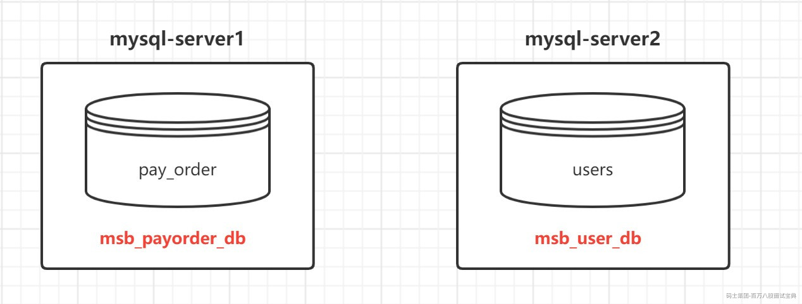

1. 在mysql01服务器上, 创建数据库 msb*payorder*db,并创建表pay\_order

CREATE DATABASE msb\_payorder\_db CHARACTER SET 'utf8';

CREATE TABLE `pay\_order` (

`order\_id` bigint(20) NOT NULL AUTO\_INCREMENT,

`user\_id` int(11) DEFAULT NULL,

`product\_name` varchar(128) DEFAULT NULL,

`COUNT` int(11) DEFAULT NULL,

PRIMARY KEY (`order\_id`)

) ENGINE=InnoDB AUTO\_INCREMENT=12345679 DEFAULT CHARSET=utf8

1. 在mysql02服务器上, 创建数据库 msb*user*db,并创建表users

CREATE DATABASE msb\_user\_db CHARACTER SET 'utf8';

CREATE TABLE `users` (

`id` int(11) NOT NULL,

`username` varchar(255) NOT NULL COMMENT '用户昵称',

`phone` varchar(255) NOT NULL COMMENT '注册手机',

`PASSWORD` varchar(255) DEFAULT NULL COMMENT '用户密码',

PRIMARY KEY (`id`)

) ENGINE=InnoDB DEFAULT CHARSET=utf8 COMMENT='用户表'

#### 2.3.2.3 创建SpringBoot程序

环境说明：SpringBoot2.3.7+ MyBatisPlus + ShardingSphere-JDBC 5.1 + Hikari+ MySQL 5.7

##### 1) 创建项目

项目名称: shardingjdbc-table

Spring脚手架: <http://start.aliyun.com>

##### 2) 引入依赖

<dependencies>

<dependency>

<groupId>org.springframework.boot</groupId>

<artifactId>spring-boot-starter-web</artifactId>

</dependency>

<dependency>

<groupId>org.apache.shardingsphere</groupId>

<artifactId>shardingsphere-jdbc-core-spring-boot-starter</artifactId>

<version>5.1.1</version>

</dependency>

<dependency>

<groupId>com.baomidou</groupId>

<artifactId>mybatis-plus-boot-starter</artifactId>

<version>3.3.1</version>

</dependency>

<dependency>

<groupId>mysql</groupId>

<artifactId>mysql-connector-java</artifactId>

<scope>runtime</scope>

</dependency>

<dependency>

<groupId>org.projectlombok</groupId>

<artifactId>lombok</artifactId>

</dependency>

<dependency>

<groupId>org.springframework.boot</groupId>

<artifactId>spring-boot-starter-test</artifactId>

<scope>test</scope>

<exclusions>

<exclusion>

<groupId>org.junit.vintage</groupId>

<artifactId>junit-vintage-engine</artifactId>

</exclusion>

</exclusions>

</dependency>

</dependencies>

##### 3) 创建实体类

@TableName("pay\_order") //逻辑表名

@Data

@ToString

public class PayOrder {

@TableId

private long order\_id;

private long user\_id;

private String product\_name;

private int count;

}

@TableName("users")

@Data

@ToString

public class User {

@TableId

private long id;

private String username;

private String phone;

private String password;

}

##### 4) 创建Mapper

@Mapper

public interface PayOrderMapper extends BaseMapper<PayOrder> {

}

@Mapper

public interface UserMapper extends BaseMapper<User> {

}

### 2.3.3 实现垂直分库

#### 2.3.3.1 配置文件

使用sharding-jdbc 对数据库中水平拆分的表进行操作,通过sharding-jdbc对分库分表的规则进行配置,配置内容包括：数据源、主键生成策略、分片策略等。

**application.properties**

- 基础配置
- # 应用名称  
  spring.application.name=sharding-jdbc
- 数据源
- # 定义多个数据源  
  spring.shardingsphere.datasource.names = db1,db2  
    
  #数据源1  
  spring.shardingsphere.datasource.db1.type = com.zaxxer.hikari.HikariDataSource  
  spring.shardingsphere.datasource.db1.driver-class-name = com.mysql.jdbc.Driver  
  spring.shardingsphere.datasource.db1.url = jdbc:mysql://192.168.52.10:3306/msb\_payorder\_db?characterEncoding=UTF-8&useSSL=false  
  spring.shardingsphere.datasource.db1.username = root  
  spring.shardingsphere.datasource.db1.password = QiDian@666  
    
  #数据源2  
  spring.shardingsphere.datasource.db2.type = com.zaxxer.hikari.HikariDataSource  
  spring.shardingsphere.datasource.db2.driver-class-name = com.mysql.jdbc.Driver  
  spring.shardingsphere.datasource.db2.url = jdbc:mysql://192.168.52.11:3306/msb\_user\_db?characterEncoding=UTF-8&useSSL=false  
  spring.shardingsphere.datasource.db2.username = root  
  spring.shardingsphere.datasource.db2.password = QiDian@666
- 配置数据节点
- # 标准分片表配置  
  # 由数据源名 + 表名组成，以小数点分隔。多个表以逗号分隔，支持 inline 表达式。  
  spring.shardingsphere.rules.sharding.tables.pay\_order.actual-data-nodes=db1.pay\_order  
  spring.shardingsphere.rules.sharding.tables.users.actual-data-nodes=db2.users

- 打开sql输出日志

mybatis-plus.configuration.log-impl=org.apache.ibatis.logging.stdout.StdOutImpl

#### 2.3.3.2 垂直分库测试

@SpringBootTest

class ShardingJdbcApplicationTests {

@Autowired

private UserMapper userMapper;

@Autowired

private PayOrderMapper payOrderMapper;

@Test

public void testInsert(){

User user = new User();

user.setId(1002);

user.setUsername("大远哥");

user.setPhone("15612344321");

user.setPassword("123456");

userMapper.insert(user);

PayOrder payOrder = new PayOrder();

payOrder.setOrder\_id(12345679);

payOrder.setProduct\_name("猕猴桃");

payOrder.setUser\_id(user.getId());

payOrder.setCount(2);

payOrderMapper.insert(payOrder);

}

@Test

public void testSelect(){

User user = userMapper.selectById(1001);

System.out.println(user);

PayOrder payOrder = payOrderMapper.selectById(12345678);

System.out.println(payOrder);

}

}

### 2.3.4 实现水平分表

#### 2.3.4.1 数据准备

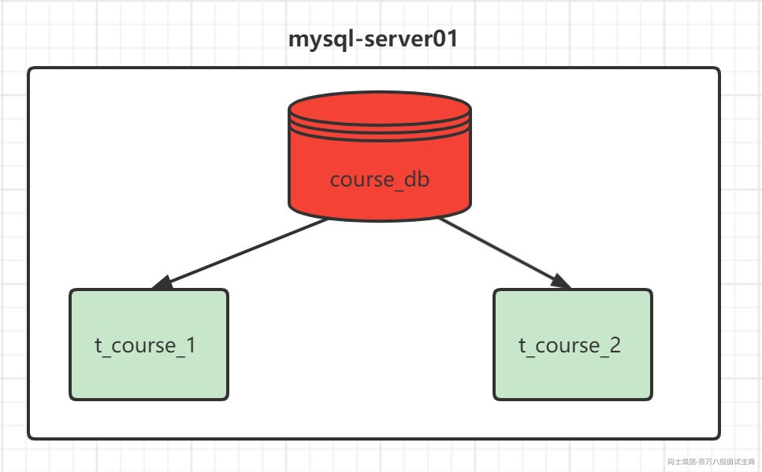

需求说明:

1. 在mysql-server01服务器上, 创建数据库 msb*course*db
2. 创建表 t*course*1 、 t*course*2
3. 约定规则：如果添加的课程 id 为偶数添加到 t*course*1 中，奇数添加到 t*course*2 中。

水平分片的id需要在业务层实现，不能依赖数据库的主键自增

CREATE TABLE t\_course\_1 (

`cid` BIGINT(20) NOT NULL,

`user\_id` BIGINT(20) DEFAULT NULL,

`cname` VARCHAR(50) DEFAULT NULL,

`brief` VARCHAR(50) DEFAULT NULL,

`price` DOUBLE DEFAULT NULL,

`status` INT(11) DEFAULT NULL,

PRIMARY KEY (`cid`)

) ENGINE=INNODB DEFAULT CHARSET=utf8

CREATE TABLE t\_course\_2 (

`cid` BIGINT(20) NOT NULL,

`user\_id` BIGINT(20) DEFAULT NULL,

`cname` VARCHAR(50) DEFAULT NULL,

`brief` VARCHAR(50) DEFAULT NULL,

`price` DOUBLE DEFAULT NULL,

`status` INT(11) DEFAULT NULL,

PRIMARY KEY (`cid`)

) ENGINE=INNODB DEFAULT CHARSET=utf8

#### 2.3.4.2 配置文件

**1) 基础配置**

# 应用名称

spring.application.name=sharding-jdbc

# 打印SQl

spring.shardingsphere.props.sql-show=true

**2) 数据源配置**

#===============数据源配置

#配置真实的数据源

spring.shardingsphere.datasource.names=db1

#数据源1

spring.shardingsphere.datasource.db1.type=com.zaxxer.hikari.HikariDataSource

spring.shardingsphere.datasource.db1.driver-class-name=com.mysql.jdbc.Driver

spring.shardingsphere.datasource.db1.jdbc-url=jdbc:mysql://192.168.52.10:3306/msb\_course\_db?useUnicode=true&characterEncoding=utf-8&useSSL=false

spring.shardingsphere.datasource.db1.username=root

spring.shardingsphere.datasource.db1.password=QiDian@666

**3) 数据节点配置**

#1.配置数据节点

#指定course表的分布情况(配置表在哪个数据库,表名是什么)

spring.shardingsphere.rules.sharding.tables.t\_course.actual-data-nodes=db1.t\_course\_$->{1..2}

#### 2.3.4.3 测试

- **course类**

@TableName("t\_course")

@Data

@ToString

public class Course implements Serializable {

@TableId

private Long cid;

private Long userId;

private String cname;

private String brief;

private double price;

private int status;

}

- **CourseMapper**

@Mapper

public interface CourseMapper extends BaseMapper<Course> {

}

- 测试：保留上面配置中的一个分片表节点分别进行测试，检查每个分片节点是否可用

# 测试t\_course\_1表插入

spring.shardingsphere.rules.sharding.tables.t\_course.actual-data-nodes=db1.t\_course\_1

# 测试t\_course\_2表插入

spring.shardingsphere.rules.sharding.tables.t\_course.actual-data-nodes=db1.t\_course\_2

//水平分表测试

@Autowired

private CourseMapper courseMapper;

@Test

public void testInsertCourse(){

for (int i = 0; i < 3; i++) {

Course course = new Course();

course.setCid(10086+i);

course.setUserId(1L+i);

course.setCname("Java经典面试题讲解");

course.setBrief("课程涵盖目前最容易被问到的10000道Java面试题");

course.setPrice(100.0);

course.setStatus(1);

courseMapper.insert(course);

}

}

#### 2.3.4.4 行表达式

对上面的配置操作进行修改, 使用inline表达式,灵活配置数据节点

行表达式的使用: <https://shardingsphere.apache.org/document/5.1.1/cn/features/sharding/concept/inline-expression/)>

spring.shardingsphere.rules.sharding.tables.t\_course.actual-data-nodes=db1.t\_course\_$->{1..2}

表达式 db1.t\_course\_$->{1..2}

$ 会被 大括号中的 `{1..2}` 所替换, `${begin..end}` 表示范围区间

会有两种选择: **db1.t*course*1** 和 **db1.t*course*2**

#### 2.3.4.5 配置分片算法

分片规则,约定cid值为偶数时,添加到t*course*1表，如果cid是奇数则添加到t*course*2表

- 配置分片算法

#1.配置数据节点

#指定course表的分布情况(配置表在哪个数据库,表名是什么)

spring.shardingsphere.rules.sharding.tables.t\_course.actual-data-nodes=db1.t\_course\_$->{1..2}

##2.配置分片策略(分片策略包括分片键和分片算法)

#2.1 分片键名称: cid

spring.shardingsphere.rules.sharding.tables.t\_course.table-strategy.standard.sharding-column=cid

#2.2 分片算法名称

spring.shardingsphere.rules.sharding.tables.t\_course.table-strategy.standard.sharding-algorithm-name=table-inline

#2.3 分片算法类型: 行表达式分片算法

spring.shardingsphere.rules.sharding.sharding-algorithms.table-inline.type=INLINE

#2.4 分片算法属性配置

spring.shardingsphere.rules.sharding.sharding-algorithms.table-inline.props.algorithm-expression=t\_course\_$->{cid % 2 + 1}

#### 2.3.4.6 分布式序列算法

**雪花算法：**

<https://shardingsphere.apache.org/document/5.1.1/cn/features/sharding/concept/key-generator/>

水平分片需要关注全局序列，因为不能简单的使用基于数据库的主键自增。

这里有两种方案：一种是基于MyBatisPlus的id策略；一种是ShardingSphere-JDBC的全局序列配置。

- 基于MyBatisPlus的id策略：将Course类的id设置成如下形式

@TableName("t\_course")

@Data

@ToString

public class Course implements Serializable {

@TableId(value = "cid",type = IdType.ASSIGN\_ID)

private Long cid;

private Long userId;

private String cname;

private String brief;

private double price;

private int status;

}

- 基于ShardingSphere-JDBC的全局序列配置：和前面的MyBatisPlus的策略二选一

#3.分布式序列配置

#3.1 分布式序列-列名称

spring.shardingsphere.rules.sharding.tables.t\_course.key-generate-strategy.column=cid

#3.2 分布式序列-算法名称

spring.shardingsphere.rules.sharding.tables.t\_course.key-generate-strategy.key-generator-name=alg\_snowflake

#3.3 分布式序列-算法类型

spring.shardingsphere.rules.sharding.key-generators.alg\_snowflake.type=SNOWFLAKE

# 分布式序列算法属性配置,可以先不配置

#spring.shardingsphere.rules.sharding.key-generators.alg\_snowflake.props.xxx=

此时，需要将实体类中的id策略修改成以下形式：

//当配置了shardingsphere-jdbc的分布式序列时，自动使用shardingsphere-jdbc的分布式序列

//当没有配置shardingsphere-jdbc的分布式序列时，自动依赖数据库的主键自增策略

@TableId(type = IdType.AUTO)

### 2.3.5 实现水平分库

水平分库是把同一个表的数据按一定规则拆到不同的数据库中，每个库可以放在不同的服务器上。接下来看一下如何使用Sharding-JDBC实现水平分库

#### 2.3.5.1 数据准备

1. 创建数据库

在mysql-server01服务器上, 创建数据库 msb*course*db0, 在mysql-server02服务器上, 创建数据库 msb*course*db1

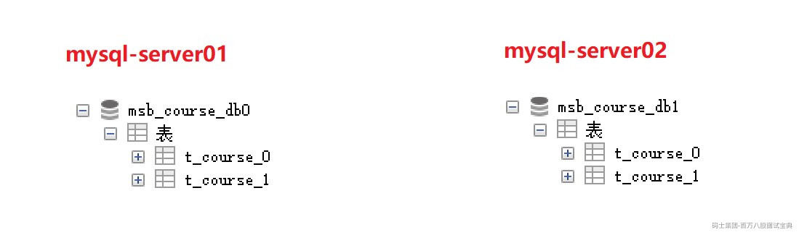

1. 创建表

CREATE TABLE `t\_course\_0` (

`cid` bigint(20) NOT NULL,

`user\_id` bigint(20) DEFAULT NULL,

`corder\_no` bigint(20) DEFAULT NULL,

`cname` varchar(50) DEFAULT NULL,

`brief` varchar(50) DEFAULT NULL,

`price` double DEFAULT NULL,

`status` int(11) DEFAULT NULL,

PRIMARY KEY (`cid`)

) ENGINE=InnoDB DEFAULT CHARSET=utf8

CREATE TABLE `t\_course\_1` (

`cid` bigint(20) NOT NULL,

`user\_id` bigint(20) DEFAULT NULL,

`corder\_no` bigint(20) DEFAULT NULL,

`cname` varchar(50) DEFAULT NULL,

`brief` varchar(50) DEFAULT NULL,

`price` double DEFAULT NULL,

`status` int(11) DEFAULT NULL,

PRIMARY KEY (`cid`)

) ENGINE=InnoDB DEFAULT CHARSET=utf8

1. 实体类

- 原有的Course类添加一个 corder\_no 即可.

@TableName("t\_course")

@Data

@ToString

public class Course implements Serializable {

// @TableId(value = "cid",type = IdType.ASSIGN\_ID)

//是否配置sharding-jdbc的分布式序列 ? 是:使用ShardingJDBC的分布式序列,否:自动依赖数据库的主键自增策略

@TableId(value = "cid",type = IdType.AUTO)

private Long cid;

private Long userId;

private Long corder\_no;

private String cname;

private String brief;

private double price;

private int status;

}

#### 2.3.5.2 配置文件

**1) 数据源配置**

#===============数据源配置

#配置真实的数据源

spring.shardingsphere.datasource.names=db0,db1

#数据源1

spring.shardingsphere.datasource.db0.type=com.zaxxer.hikari.HikariDataSource

spring.shardingsphere.datasource.db0.driver-class-name=com.mysql.jdbc.Driver

spring.shardingsphere.datasource.db0.jdbc-url=jdbc:mysql://192.168.52.10:3306/msb\_course\_db0?useUnicode=true&characterEncoding=utf-8&useSSL=false

spring.shardingsphere.datasource.db0.username=root

spring.shardingsphere.datasource.db0.password=QiDian@666

#数据源1

spring.shardingsphere.datasource.db1.type=com.zaxxer.hikari.HikariDataSource

spring.shardingsphere.datasource.db1.driver-class-name=com.mysql.jdbc.Driver

spring.shardingsphere.datasource.db1.jdbc-url=jdbc:mysql://192.168.52.11:3306/msb\_course\_db1?useUnicode=true&characterEncoding=utf-8&useSSL=false

spring.shardingsphere.datasource.db1.username=root

spring.shardingsphere.datasource.db1.password=QiDian@666

**2) 数据节点配置**

先测试水平分库, 数据节点中数据源是动态的, 数据表固定为t*course*0, 方便测试

#配置数据节点

spring.shardingsphere.rules.sharding.tables.t\_course.actual-data-nodes=db$->{0..1}.t\_course\_0

#spring.shardingsphere.rules.sharding.tables.t\_course.actual-data-nodes=db$->{0..1}.t\_course\_$->{1..2}

**3) 水平分库之分库策略配置**

分库策略: 以user\_id为分片键，分片策略为user\_id % 2，user\_id为偶数操作db0数据源，否则操作db1数据源。

#===============水平分库-分库策略==============

#----分片列名称----

spring.shardingsphere.rules.sharding.tables.t\_course.database-strategy.standard.sharding-column=user\_id

#----分片算法配置----

#分片算法名称 -> 行表达式分片算法

spring.shardingsphere.rules.sharding.tables.t\_course.database-strategy.standard.sharding-algorithm-name=table-inline

#分片算法类型

spring.shardingsphere.rules.sharding.sharding-algorithms.table-inline.type=INLINE

#分片算法属性配置

spring.shardingsphere.rules.sharding.sharding-algorithms.table-inline.props.algorithm-expression=db$->{user\_id % 2}

**4) 分布式主键自增**

#4.分布式序列配

#4.1 分布式序列-列名称

spring.shardingsphere.rules.sharding.tables.t\_course.key-generate-strategy.column=cid

#4.2 分布式序列-算法名称

spring.shardingsphere.rules.sharding.tables.t\_course.key-generate-strategy.key-generator-name=alg-snowflake

#4.3 分布式序列-算法类型

spring.shardingsphere.rules.sharding.key-generators.alg-snowflake.type=SNOWFLAKE

**3) 测试**

/\*\*

\* 水平分库 --> 分库插入数据

\*/

@Test

public void testInsertCourseDB(){

for (int i = 0; i < 10; i++) {

Course course = new Course();

course.setUserId(1001L+i);

course.setCname("Java经典面试题讲解");

course.setBrief("课程涵盖目前最容易被问到的10000道Java面试题");

course.setPrice(100.0);

course.setStatus(1);

courseMapper.insert(course);

}

}

**4) 水平分库之分表策略配置**

分表规则：t\_course 表中 cid 的哈希值为偶数时，数据插入对应服务器的t\_course\_0表，cid 的哈希值为奇数时，数据插入对应服务器的t\_course\_1。

1. 修改数据节点配置,数据落地到dn0或db1数据源的 t*course*0表 或者 t*course*1表.

spring.shardingsphere.rules.sharding.tables.t\_course.actual-data-nodes=db$->{0..1}.t\_course\_$->{0..1}

1. 分表策略配置 (对id进行哈希取模)

#===============水平分库-分表策略==============

#----分片列名称----

spring.shardingsphere.rules.sharding.tables.t\_course.table-strategy.standard.sharding-column=cid

##----分片算法配置----

##分片算法名称

spring.shardingsphere.rules.sharding.tables.t\_course.table-strategy.standard.sharding-algorithm-name=inline-hash-mod

#分片算法类型

spring.shardingsphere.rules.sharding.sharding-algorithms.inline-hash-mod.type=INLINE

#分片算法属性配置

spring.shardingsphere.rules.sharding.sharding-algorithms.inline-hash-mod.props.algorithm-expression=t\_course\_$->{Math.abs(cid.hashCode()) % 2}

官方提供分片算法配置

<https://shardingsphere.apache.org/document/current/cn/dev-manual/sharding/>

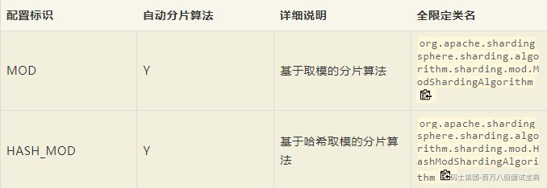

#----分片列名称----

spring.shardingsphere.rules.sharding.tables.t\_course.table-strategy.standard.sharding-column=cid

#----分片算法配置----

#分片算法名称 -> 取模分片算法

spring.shardingsphere.rules.sharding.tables.t\_course.table-strategy.standard.sharding-algorithm-name=table-hash-mod

#分片算法类型

spring.shardingsphere.rules.sharding.sharding-algorithms.table-hash-mod.type=HASH\_MOD

#分片算法属性配置-分片数量,有两个表值设置为2

spring.shardingsphere.rules.sharding.sharding-algorithms.table-hash-mod.props.sharding-count=2

#### 2.3.5.3 水平分库测试

1. 测试插入数据

/\*\*

\* 水平分库 --> 分表插入数据

\*/

@Test

public void testInsertCourseTable(){

for (int i = 101; i < 130; i++) {

Course course = new Course();

//userId为偶数数时插入到 msb\_course\_0数据库,为奇数时插入到msb\_course\_1数据库

course.setUserId(1L+i);

course.setCname("Java经典面试题讲解");

course.setBrief("课程涵盖目前最容易被问到的10000道Java面试题");

course.setPrice(100.0);

course.setStatus(1);

courseMapper.insert(course);

}

}

//验证Hash取模分片是否正确

@Test

public void testHashMod(){

//cid的hash值为偶数时,插入对应数据库的t\_course\_0表,为奇数插入对应数据库的t\_course\_1

Long cid = 797197529904054273L; //获取到cid

int hash = cid.hashCode();

System.out.println(hash);

System.out.println("===========" + Math.abs(hash % 2) ); //获取针对cid进行hash取模后的值

}

1. 测试查询数据

//查询所有记录

@Test

public void testShardingSelectAll(){

List<Course> courseList = courseMapper.selectList(null);

courseList.forEach(System.out::println);

}

- **查看日志: 查询了两个数据源，每个数据源中使用UNION ALL连接两个表**

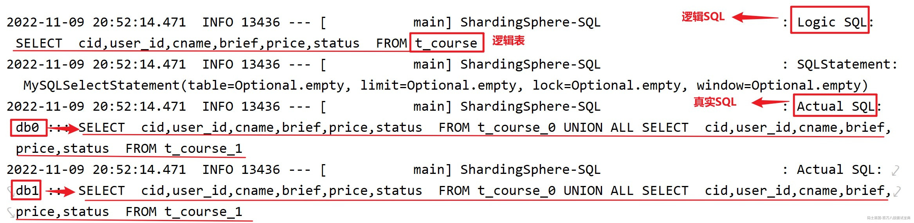

//根据user\_id进行查询

@Test

public void testSelectByUserId(){

QueryWrapper<Course> courseQueryWrapper = new QueryWrapper<>();

courseQueryWrapper.eq("user\_id",2L);

List<Course> courses = courseMapper.selectList(courseQueryWrapper);

courses.forEach(System.out::println);

}

- **查看日志: 查询了一个数据源，使用UNION ALL连接数据源中的两个表**

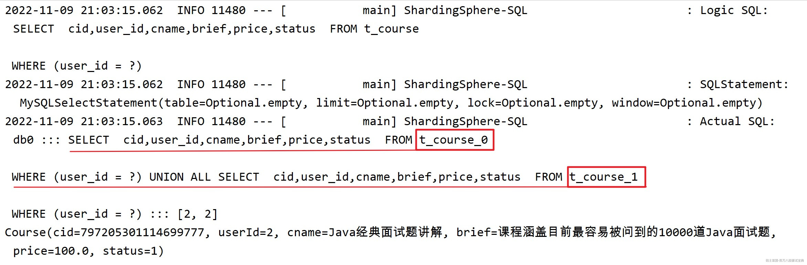

#### 2.3.5.4 水平分库总结

水平分库包含了分库策略和分表策略.

- 分库策略 ,目的是将一个逻辑表 , 映射到多个数据源

#===============水平分库-分库策略==============

#----分片列名称----

spring.shardingsphere.rules.sharding.tables.t\_course.database-strategy.standard.sharding-column=user\_id

#----分片算法配置----

#分片算法名称 -> 行表达式分片算法

spring.shardingsphere.rules.sharding.tables.t\_course.database-strategy.standard.sharding-algorithm-name=table-inline

#分片算法类型

spring.shardingsphere.rules.sharding.sharding-algorithms.table-inline.type=INLINE

#分片算法属性配置

spring.shardingsphere.rules.sharding.sharding-algorithms.table-inline.props.algorithm-expression=db$->{user\_id % 2}

- 分表策略, 如何将一个逻辑表 , 映射为多个 实际表

#===============水平分库-分表策略==============

#----分片列名称----

spring.shardingsphere.rules.sharding.tables.t\_course.table-strategy.standard.sharding-column=cid

##----分片算法配置----

#分片算法名称

spring.shardingsphere.rules.sharding.tables.t\_course.table-strategy.standard.sharding-algorithm-name=inline-hash-mod

#分片算法类型

spring.shardingsphere.rules.sharding.sharding-algorithms.inline-hash-mod.type=INLINE

#分片算法属性配置

spring.shardingsphere.rules.sharding.sharding-algorithms.inline-hash-mod.props.algorithm-expression=t\_course\_$->{Math.abs(cid.hashCode()) % 2}

### 2.3.6 实现绑定表

先来回顾一下绑定表的概念: 指的是分片规则一致的关系表（主表、子表），例如t*order和t*order*item，均按照order*id分片，则此两个表互为绑定表关系。绑定表之间的多表关联查询不会出现笛卡尔积关联，可以提升关联查询效率。

注: 绑定表是建立在多表关联的基础上的.所以我们先来完成多表关联的配置

#### 2.3.6.1 数据准备

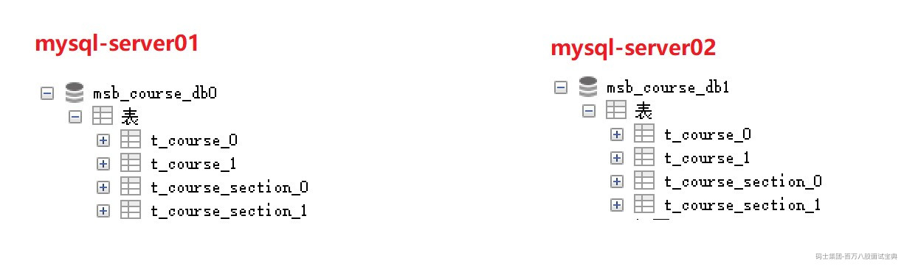

1. 创建表

- 在mysql-server01服务器上的 msb\_course\_db0 数据库 和 mysql-server02服务器上的 msb\_course\_db1 数据库分别创建 t\_course\_section\_0 和 t\_course\_section\_1表 ,表结构如下:
- CREATE TABLE `t\_course\_section\_0` (  
   `id` bigint(11) NOT NULL,  
   `cid` bigint(11) DEFAULT NULL,  
   `corder\_no` bigint(20) DEFAULT NULL,  
   `user\_id` bigint(20) DEFAULT NULL,  
   `section\_name` varchar(50) DEFAULT NULL,  
   `status` int(11) DEFAULT NULL,  
   PRIMARY KEY (`id`)  
  ) ENGINE=InnoDB DEFAULT CHARSET=utf8  
    
  CREATE TABLE `t\_course\_section\_1` (  
   `id` bigint(11) NOT NULL,  
   `cid` bigint(11) DEFAULT NULL,  
   `corder\_no` bigint(20) DEFAULT NULL,  
   `user\_id` bigint(20) DEFAULT NULL,  
   `section\_name` varchar(50) DEFAULT NULL,  
   `status` int(11) DEFAULT NULL,  
   PRIMARY KEY (`id`)  
  ) ENGINE=InnoDB DEFAULT CHARSET=utf8

#### 2.3.6.2 创建实体类

@TableName("t\_course\_section")

@Data

@ToString

public class CourseSection {

@TableId(type = IdType.AUTO)

private Long id;

private Long cid; //课程id

private Long userId;

private String sectionName;

private int status;

}

#### 2.3.6.3 创建mapper

@Mapper

public interface CourseSectionMapper extends BaseMapper<CourseSection> {

}

#### 2.3.6.4 配置多表关联

t*course*section的分片表、分片策略、分布式序列策略和t\_course保持一致

- 数据源

#===============数据源配置

#配置真实的数据源

spring.shardingsphere.datasource.names=db0,db1

#数据源1

spring.shardingsphere.datasource.db0.type=com.zaxxer.hikari.HikariDataSource

spring.shardingsphere.datasource.db0.driver-class-name=com.mysql.jdbc.Driver

spring.shardingsphere.datasource.db0.jdbc-url=jdbc:mysql://192.168.52.10:3306/msb\_course\_db0?useUnicode=true&characterEncoding=utf-8&useSSL=false

spring.shardingsphere.datasource.db0.username=root

spring.shardingsphere.datasource.db0.password=QiDian@666

#数据源1

spring.shardingsphere.datasource.db1.type=com.zaxxer.hikari.HikariDataSource

spring.shardingsphere.datasource.db1.driver-class-name=com.mysql.jdbc.Driver

spring.shardingsphere.datasource.db1.jdbc-url=jdbc:mysql://192.168.52.11:3306/msb\_course\_db1?useUnicode=true&characterEncoding=utf-8&useSSL=false

spring.shardingsphere.datasource.db1.username=root

spring.shardingsphere.datasource.db1.password=QiDian@666

- 数据节点

#配置数据节点

spring.shardingsphere.rules.sharding.tables.t\_course.actual-data-nodes=db$->{0..1}.t\_course\_$->{0..1}

spring.shardingsphere.rules.sharding.tables.t\_course\_section.actual-data-nodes=db$->{0..1}.t\_course\_section\_$->{0..1}

- 分库策略

#===============分库策略==============

# 用于单分片键的标准分片场景

#t\_course与t\_course\_section表 都使用user\_id作为分库的分片键,这样就能够保证user\_id相同的数据落入到同一个库中

# 分片列名称

spring.shardingsphere.rules.sharding.tables.t\_course.database-strategy.standard.sharding-column=user\_id

# 分片算法名称

spring.shardingsphere.rules.sharding.tables.t\_course.database-strategy.standard.sharding-algorithm-name=table-mod

# 分片列名称

spring.shardingsphere.rules.sharding.tables.t\_course\_section.database-strategy.standard.sharding-column=user\_id

# 分片算法名称

spring.shardingsphere.rules.sharding.tables.t\_course\_section.database-strategy.standard.sharding-algorithm-name=table-mod

- 分表策略

#====================分表策略===================

#t\_course与t\_course\_section表都使用corder\_no作为分表的分片键,这样就能够保证corder\_no相同的数据落入到同一个表中

# 用于单分片键的标准分片场景

# 分片列名称

spring.shardingsphere.rules.sharding.tables.t\_course.table-strategy.standard.sharding-column=corder\_no

# 分片算法名称

spring.shardingsphere.rules.sharding.tables.t\_course.table-strategy.standard.sharding-algorithm-name=table-hash-mod

# 分片列名称

spring.shardingsphere.rules.sharding.tables.t\_course\_section.table-strategy.standard.sharding-column=corder\_no

# 分片算法名称

spring.shardingsphere.rules.sharding.tables.t\_course\_section.table-strategy.standard.sharding-algorithm-name=table-hash-mod

- 分片算法

#=======================分片算法配置==============

# 取模分片算法

# 分片算法类型

spring.shardingsphere.rules.sharding.sharding-algorithms.table-mod.type=MOD

# 分片算法属性配置

spring.shardingsphere.rules.sharding.sharding-algorithms.table-mod.props.sharding-count=2

# 哈希取模分片算法

# 分片算法类型

spring.shardingsphere.rules.sharding.sharding-algorithms.table-hash-mod.type=HASH\_MOD

# 分片算法属性配置

spring.shardingsphere.rules.sharding.sharding-algorithms.table-hash-mod.props.sharding-count=2

- 分布式主键

#========================布式序列策略配置====================

# t\_course表主键生成策略

# 分布式序列列名称

spring.shardingsphere.rules.sharding.tables.t\_course.key-generate-strategy.column=cid

# 分布式序列算法名称

spring.shardingsphere.rules.sharding.tables.t\_course.key-generate-strategy.key-generator-name=snowflake

# t\_course\_section 表主键生成策略

# 分布式序列列名称

spring.shardingsphere.rules.sharding.tables.t\_course\_section.key-generate-strategy.column=id

# 分布式序列算法名称

spring.shardingsphere.rules.sharding.tables.t\_course\_section.key-generate-strategy.key-generator-name=snowflake

#------------------------分布式序列算法配置

# 分布式序列算法类型

spring.shardingsphere.rules.sharding.key-generators.snowflake.type=SNOWFLAKE

#### 2.3.6.5 测试插入数据

//测试关联表插入

@Test

public void testInsertCourseAndCourseSection(){

//userID为奇数 --> msb\_course\_db1数据库

for (int i = 0; i < 3; i++) {

Course course = new Course();

course.setUserId(1L);

//CorderNo为偶数 --> t\_course\_0, 为奇数t\_course\_1

course.setCorderNo(1000L + i);

course.setPrice(100.0);

course.setCname("ShardingSphere实战");

course.setBrief("ShardingSphere实战-直播课");

course.setStatus(1);

courseMapper.insert(course);

Long cid = course.getCid();

for (int j = 0; j < 3; j++) { //每个课程 设置三个章节

CourseSection section = new CourseSection();

section.setUserId(1L);

//CorderNo为偶数 --> t\_course\_0, 为奇数t\_course\_1

section.setCorderNo(1000L + i);

section.setCid(cid);

section.setSectionName("ShardingSphere实战\_" + i);

section.setStatus(1);

courseSectionMapper.insert(section);

}

}

//userID为偶数 --> msb\_course\_db0

for (int i = 3; i < 5; i++) {

Course course = new Course();

course.setUserId(2L);

//CorderNo为偶数 --> t\_course\_0, 为奇数t\_course\_1

course.setCorderNo(1000L + i);

course.setPrice(100.0);

course.setCname("ShardingSphere实战");

course.setBrief("ShardingSphere实战-直播课");

course.setStatus(1);

courseMapper.insert(course);

Long cid = course.getCid();

for (int j = 0; j < 3; j++) {

CourseSection section = new CourseSection();

//CorderNo为偶数 --> t\_course\_section\_0, 为奇数t\_course\_section\_1

section.setCorderNo(1000L + i);

section.setCid(cid);

section.setUserId(2L);

section.setSectionName("ShardingSphere实战\_" + i);

section.setStatus(1);

courseSectionMapper.insert(section);

}

}

}

#### 2.3.6.6 配置绑定表

需求说明: **查询每个订单的订单号和课程名称以及每个课程的章节的数量.**

1. 根据需求编写SQL

SELECT

c.corder\_no,

c.cname,

COUNT(cs.id) num

FROM t\_course c INNER JOIN t\_course\_section cs ON c.corder\_no = cs.corder\_no

GROUP BY c.corder\_no,c.cname;

1. 创建VO类

@Data

public class CourseVo {

private long corderNo;

private String cname;

private int num;

}

1. 添加Mapper方法

@Mapper

public interface CourseMapper extends BaseMapper<Course> {

@Select({"SELECT \n" +

" c.corder\_no,\n" +

" c.cname,\n" +

" COUNT(cs.id) num\n" +

"FROM t\_course c INNER JOIN t\_course\_section cs ON c.corder\_no = cs.corder\_no\n" +

"GROUP BY c.corder\_no,c.cname"})

List<CourseVo> getCourseNameAndSectionName();

}

1. 进行关联查询

//测试关联表查询

@Test

public void testSelectCourseNameAndSectionName(){

List<CourseVo> list = courseMapper.getCourseNameAndSectionName();

list.forEach(System.out::println);

}

- **如果不配置绑定表：测试的结果为8个SQL。**多表关联查询会出现笛卡尔积关联。

1. 配置绑定表

<https://shardingsphere.apache.org/document/current/cn/user-manual/shardingsphere-jdbc/spring-boot-starter/rules/sharding/>

#======================绑定表

spring.shardingsphere.rules.sharding.binding-tables[0]=t\_course,t\_course\_section

- **如果配置绑定表：测试的结果为4个SQL。** 多表关联查询不会出现笛卡尔积关联，关联查询效率将大大提升。

### 2.3.7 实现广播表(公共表)

#### 2.3.7.1 公共表介绍

公共表属于系统中数据量较小，变动少，而且属于高频联合查询的依赖表。参数表、数据字典表等属于此类型。

可以将这类表在每个数据库都保存一份，所有更新操作都同时发送到所有分库执行。接下来看一下如何使用Sharding-JDBC实现公共表的数据维护。

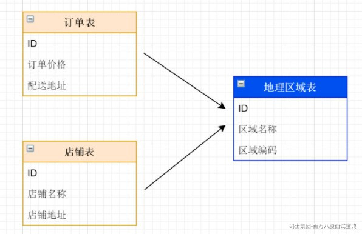

#### 2.3.7.2 代码编写

**1) 创建表**

分别在 **msb*course*db0**, **msb*course*db1**,**msb*user*db** 都创建 **t\_district**表

-- 区域表

CREATE TABLE t\_district (

id BIGINT(20) PRIMARY KEY COMMENT '区域ID',

district\_name VARCHAR(100) COMMENT '区域名称',

LEVEL INT COMMENT '等级'

);

**2) 创建实体类**

@TableName("t\_district")

@Data

public class District {

@TableId(type = IdType.ASSIGN\_ID)

private Long id;

private String districtName;

private int level;

}

**3) 创建mapper**

@Mapper

public interface DistrictMapper extends BaseMapper<District> {

}

#### 2.3.7.3 广播表配置

- 数据源

#===============数据源配置

#配置真实的数据源

spring.shardingsphere.datasource.names=db0,db1,user\_db

#数据源1

spring.shardingsphere.datasource.db0.type=com.zaxxer.hikari.HikariDataSource

spring.shardingsphere.datasource.db0.driver-class-name=com.mysql.jdbc.Driver

spring.shardingsphere.datasource.db0.jdbc-url=jdbc:mysql://192.168.52.10:3306/msb\_course\_db0?useUnicode=true&characterEncoding=utf-8&useSSL=false

spring.shardingsphere.datasource.db0.username=root

spring.shardingsphere.datasource.db0.password=QiDian@666

#数据源2

spring.shardingsphere.datasource.db1.type=com.zaxxer.hikari.HikariDataSource

spring.shardingsphere.datasource.db1.driver-class-name=com.mysql.jdbc.Driver

spring.shardingsphere.datasource.db1.jdbc-url=jdbc:mysql://192.168.52.11:3306/msb\_course\_db1?useUnicode=true&characterEncoding=utf-8&useSSL=false

spring.shardingsphere.datasource.db1.username=root

spring.shardingsphere.datasource.db1.password=QiDian@666

#数据源3

spring.shardingsphere.datasource.user\_db.type = com.zaxxer.hikari.HikariDataSource

spring.shardingsphere.datasource.user\_db.driver-class-name = com.mysql.jdbc.Driver

spring.shardingsphere.datasource.user\_db.url = jdbc:mysql://192.168.52.11:3306/msb\_user\_db?characterEncoding=UTF-8&useSSL=false

spring.shardingsphere.datasource.user\_db.username = root

spring.shardingsphere.datasource.user\_db.password = QiDian@666

- 广播表配置

#数据节点可不配置，默认情况下，向所有数据源广播

spring.shardingsphere.rules.sharding.tables.t\_district.actual-data-nodes=db$->{0..1}.t\_district,user\_db.t\_district

#------------------------广播表配置

# 广播表规则列表

spring.shardingsphere.rules.sharding.broadcast-tables[0]=t\_district

#### 2.3.7.4 测试广播表

//广播表: 插入数据

@Test

public void testBroadcast(){

District district = new District();

district.setDistrictName("昌平区");

district.setLevel(1);

districtMapper.insert(district);

}

//查询操作，只从一个节点获取数据, 随机负载均衡规则

@Test

public void testSelectBroadcast(){

List<District> districtList = districtMapper.selectList(null);

districtList.forEach(System.out::println);

}

## 2.4 读写分离详解与实战

### 2.4.1 读写分离架构介绍

#### 2.4.1.1 读写分离原理

**读写分离原理：**读写分离就是让主库处理事务性操作，从库处理select查询。数据库复制被用来把事务性查询导致的数据变更同步到从库，同时主库也可以select查询。

**注意: 读写分离的数据节点中的数据内容是一致。**

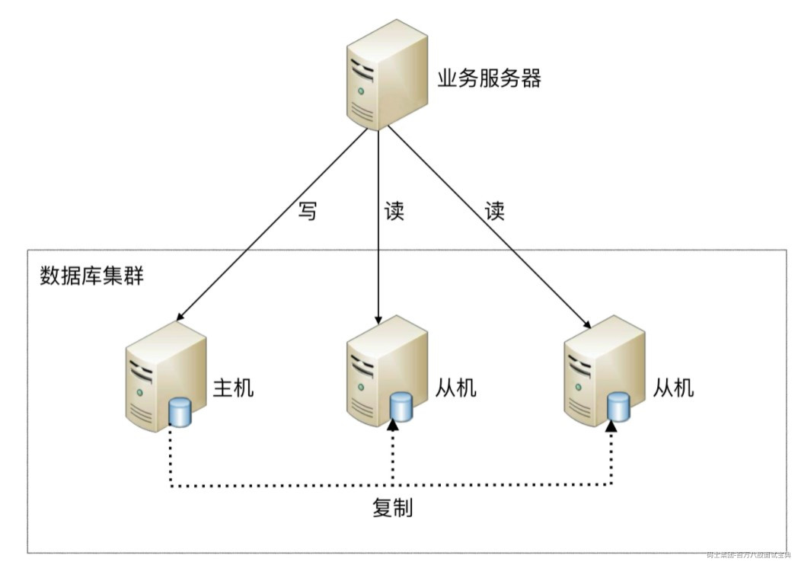

**读写分离的基本实现：**

- 主库负责处理事务性的增删改操作，从库负责处理查询操作，能够有效的避免由数据更新导致的行锁，使得整个系统的查询性能得到极大的改善。
- 读写分离是根据 SQL 语义的分析，将读操作和写操作分别路由至主库与从库。
- 通过一主多从的配置方式，可以将查询请求均匀的分散到多个数据副本，能够进一步的提升系统的处理能力。
- 使用多主多从的方式，不但能够提升系统的吞吐量，还能够提升系统的可用性，可以达到在任何一个数据库宕机，甚至磁盘物理损坏的情况下仍然不影响系统的正常运行

**将用户表的写操作和读操路由到不同的数据库**

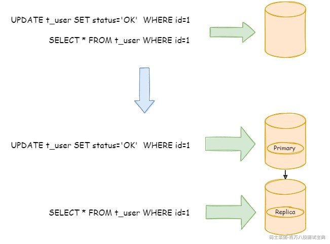

#### 2.4.1.2 读写分离应用方案

在数据量不是很多的情况下，我们可以将数据库进行读写分离，以应对高并发的需求，通过水平扩展从库，来缓解查询的压力。如下：

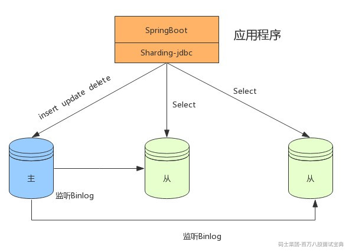

**分表+读写分离**

在数据量达到500万的时候，这时数据量预估千万级别，我们可以将数据进行分表存储。

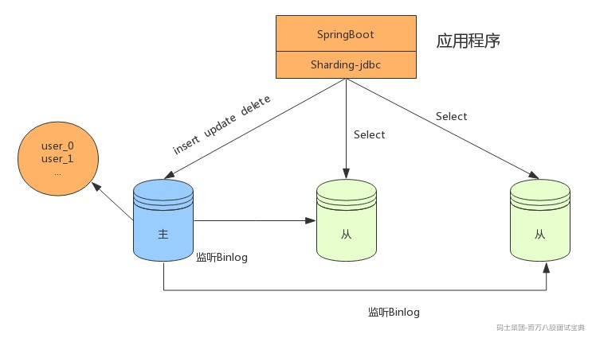

**分库分表+读写分离**

在数据量继续扩大，这时可以考虑分库分表，将数据存储在不同数据库的不同表中，如下：

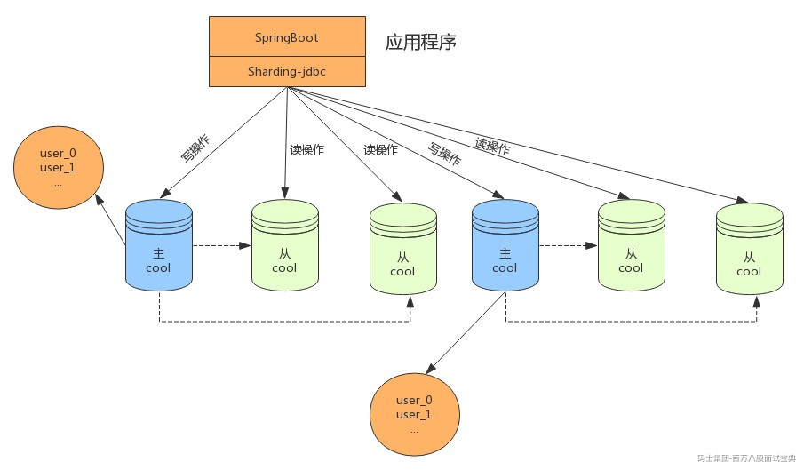

读写分离虽然可以提升系统的吞吐量和可用性，但同时也带来了数据不一致的问题，包括多个主库之间的数据一致性，以及主库与从库之间的数据一致性的问题。 并且，读写分离也带来了与数据分片同样的问题，它同样会使得应用开发和运维人员对数据库的操作和运维变得更加复杂。

**透明化读写分离所带来的影响，让使用方尽量像使用一个数据库一样使用主从数据库集群，是ShardingSphere读写分离模块的主要设计目标。**

主库、从库、主从同步、负载均衡

- 核心功能

- 提供一主多从的读写分离配置。仅支持单主库，可以支持独立使用，也可以配合分库分表使用
- 独立使用读写分离，支持SQL透传。不需要SQL改写流程
- 同一线程且同一数据库连接内，能保证数据一致性。如果有写入操作，后续的读操作均从主库读取。
- 基于Hint的强制主库路由。可以强制路由走主库查询实时数据，避免主从同步数据延迟。

- 不支持项

- 主库和从库的数据同步
- 主库和从库的数据同步延迟
- 主库双写或多写
- 跨主库和从库之间的事务的数据不一致。建议在主从架构中，事务中的读写均用主库操作。

### 2.4.2 CAP 理论

#### 2.4.2.1 CAP理论介绍

CAP 定理（CAP theorem）又被称作布鲁尔定理（Brewer's theorem），是加州大学伯克利分校的计算机科学家埃里克·布鲁尔（Eric Brewer）在 2000 年的 ACM PODC 上提出的一个猜想。对于设计分布式系统的架构师来说，CAP 是必须掌握的理论。

在一个分布式系统中，当涉及读写操作时，只能保证一致性（Consistence）、可用性（Availability）、分区容错性（Partition Tolerance）三者中的两个，另外一个必须被牺牲。

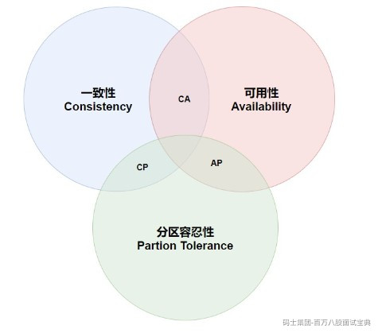

- C 一致性（Consistency）：等同于所有节点访问同一份**最新**的数据副本
- 在分布式环境中,数据在多个副本之间能够保持一致的特性,也就是所有的数据节点里面的数据要是一致的
- A 可用性（Availability）：每次请求都能够获取到非错的响应(不是错误和超时的响应) , 但是不能够保证获取的数据为最新的数据.
- 意思是只要收到用户的请求，服务器就必须给出一个成功的回应. 不要求数据是否是最新的.
- P 分区容错性（Partition Tolerance）：以实际效果而言,分区相当于对通信的时限要求. 系统如果不能在时限内达成数据一致性,就意味着发生了分区的情况 , 必须对当前操作在C和A之间作出选择.
- 更简单的理解就是: 大多数分布式系统都分布在多个子网络。每个子网络就叫做一个区（partition）。分区容错的意思是，区间通信可能失败（可能是丢包，也可能是连接中断，还可能是拥塞) ，但是系统能够继续“履行职责” 正常运行.

**一般来说，分布式系统，分区容错无法避免，因此可以认为 CAP 的 P 总是成立。根据CAP 定理，剩下的 C 和 A 无法同时做到。**

#### 2.4.2.2 CAP理论特点

**CAP如何取舍**

- CAP理论的C也就是一致性,不等于事务ACID中的C(数据的一致性), CAP理论中的C可以理解为**副本的一致性**.即所有的副本的结果都是有一致的.
- 在没有网络分区的单机系统中可以选择保证CA, 但是在分布式系统中存在网络通信环节,网络通信在多机中是不可靠的,P是必须要选择的,为了 保证P就需要在C和A之间作出选择

**假设有三个副本,写入时有下面两个方案**

方案一: W=1, 一写,向三个副本写入,只要一个副本写入成功,即认为成功

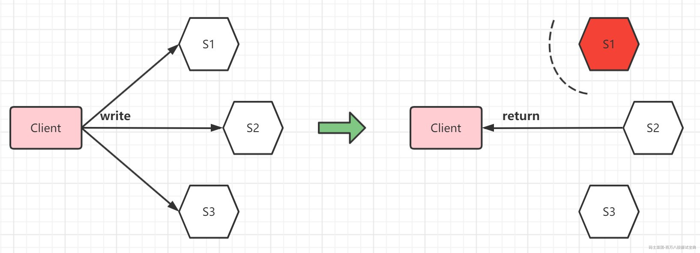

一写的情况下,只要写入一个副本成功即可返回写入成功,出现网络分区后,三台机器的数据就有可能出现不一致, 无法保证C. (比如server1与其他节点的网络中断了,那S1与S2 S3 就不一致的了), 但是因为可以正常返回写入成功,A依旧可以保证.

方案二: W=2, 三写,向三个副本写入,三个副本写入成功,才认为是成功

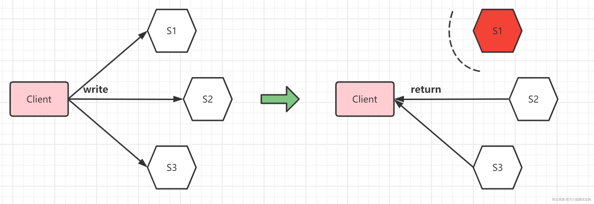

在三写的情况下,要三个副本都写入成功,才可以返回成功,出现网络分区后,无法实现这一点,最终会返回报错,所以没有保证A,但是保证了C.

#### 2.4.2.3 分布式数据库对于CAP理论的实践

**从上面的分析我们可以总结出来: 在分布式环境中,P是一定存在的,一旦出现了网络分区,那么一致性和可用性就一定要抛弃一个.**

- 对于NoSQL数据库,更加注重可用性,所以会是一个AP系统.
- 对于分布式关系型数据库,必须要保证一致性,所以会是一个CP系统.

分布式关系型数据库仍有高可用性需求,虽然达不到CAP理论中的100%可用性,单一般都具备五个9(99.999%) 以上的高可用.

- **计算公式: A表示可用性; MTBF表示平均故障间隔; MTTR表示平均恢复时间**
- 高可用有一个标准,9越多代表越容错, 可用性越高.

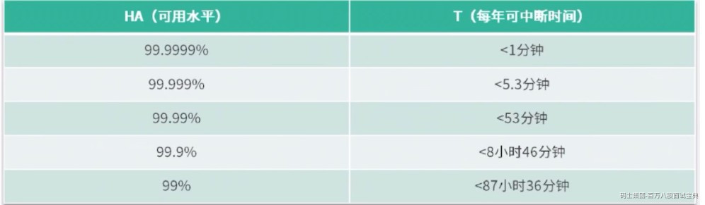

假设系统一直能够提供服务，我们说系统的可用性是100%。如果系统每运行100个时间单位，会有1个时间单位无法提供服 务，我们说系统的可用性是99%。很多公司的高可用目标是4个9，也就是99.99%

我们可以将分布式关系型数据库看做是CP+HA的系统.由此也产生了两个广泛的应用指标.

- **RPO(Recovery PointObjective):**  恢复点目标,指数据库在灾难发生后会丢失多长时间的数据.分布式关系型数据库RPO=0.
- **RTO(Recovery Time Objective):** 恢复时间目标,指数据库在灾难发生后到整个系统恢复正常所需要的时间.分布式关系型数据库RTO < 几分钟(因为有主备切换,所以一般恢复时间就是几分钟).

**总结一下: CAP理论并不是让我们选择C或者选择A就完全抛弃另外一个, 这样极端显然是不对的,实际上在设计一个分布式系统时,P是必须的，所以要在AC中取舍一个"降级"。根据不同场景来取舍A或者C.**

### 2.4.3 MySQL主从同步

#### 2.4.3.1 主从同步原理

读写分离是建立在MySQL主从复制基础之上实现的，所以必须先搭建MySQL的主从复制架构。

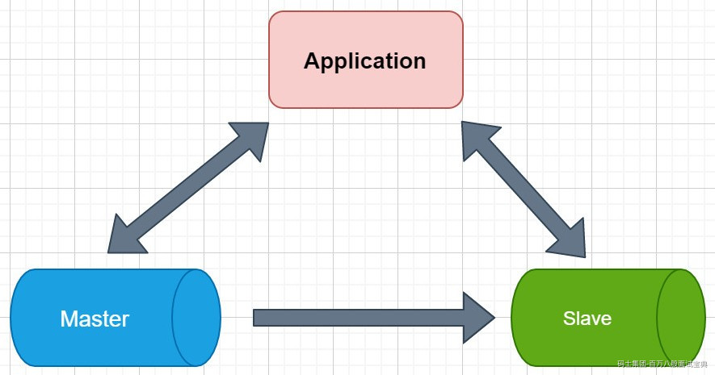

**主从复制的用途**

- 实时灾备，用于故障切换
- 读写分离，提供查询服务
- 备份，避免影响业务

**主从部署必要条件**

- 主库开启binlog日志（设置log-bin参数）
- 主从server-id不同
- 从库服务器能连通主库

**主从复制的原理**

- Mysql 中有一种日志叫做 bin 日志（二进制日志）。这个日志会记录下所有修改了数据库的SQL 语句（insert,update,delete,create/alter/drop table, grant 等等）。
- 主从复制的原理其实就是把主服务器上的 bin 日志复制到从服务器上执行一遍，这样从服务器上的数据就和主服务器上的数据相同了。

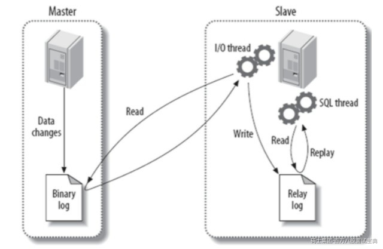

1. 主库db的更新事件(update、insert、delete)被写到binlog
2. 主库创建一个binlog dump thread，把binlog的内容发送到从库
3. 从库启动并发起连接，连接到主库
4. 从库启动之后，创建一个I/O线程，读取主库传过来的binlog内容并写入到relay log
5. 从库启动之后，创建一个SQL线程，从relay log里面读取内容，执行读取到的更新事件，将更新内容写入到slave的db

#### 2.4.3.2 主从复制架构搭建

Mysql的主从复制至少是需要两个Mysql的服务，当然Mysql的服务是可以分布在不同的服务器上，也可以在一台服务器上启动多个服务。

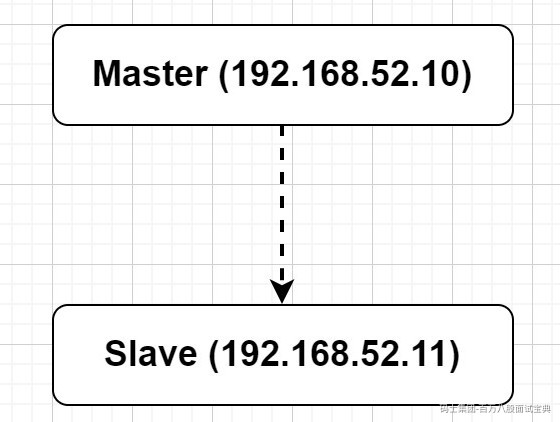

**1) 第一步 master中创建数据库和表**

-- 创建数据库

CREATE DATABASE test CHARACTER SET utf8;

-- 创建表

CREATE TABLE users (

id INT(11) PRIMARY KEY AUTO\_INCREMENT,

NAME VARCHAR(20) DEFAULT NULL,

age INT(11) DEFAULT NULL

);

-- 插入数据

INSERT INTO users VALUES(NULL,'user1',20);

INSERT INTO users VALUES(NULL,'user2',21);

INSERT INTO users VALUES(NULL,'user3',22);

**2) 第二步 修改主数据库的配置文件my.cnf**

vim /etc/my.cnf

插入下面的内容

lower\_case\_table\_names=1

log-bin=mysql-bin

server-id=1

binlog-do-db=test

binlog\_ignore\_db=mysql

- server-id=1 中的1可以任定义，只要是唯一的就行。
- log-bin=mysql-bin 表示启用binlog功能，并制定二进制日志的存储目录，
- binlog-do-db=test 是表示只备份**test** 数据库。
- binlog*ignore*db=mysql 表示忽略备份mysql。
- 不加binlog-do-db和binlog*ignore*db，那就表示备份全部数据库。

**3) 第三步 重启MySQL**

service mysqld restart

**4) 第四步 在主数据库上, 创建一个允许从数据库来访问的用户账号.**

用户: slave

密码：123456

主从复制使用 REPLICATION SLAVE 赋予权限

-- 创建账号

GRANT REPLICATION SLAVE ON \*.\* TO 'slave'@'192.168.52.11' IDENTIFIED BY 'Qwer@1234';

**5) 第五步 停止主数据库的更新操作, 并且生成主数据库的备份**

-- 执行以下命令锁定数据库以防止写入数据。

FLUSH TABLES WITH READ LOCK;

**6) 导出数据库,恢复写操作**

使用SQLYog导出,主数据库备份完毕，恢复写操作

unlock tables;

**7) 将刚才主数据库备份的test.sql导入到从数据库**

导入后, 主库和从库数据会追加相平，保持同步！此过程中，若主库存在业务，并发较高，在同步的时候要先锁表，让其不要有修改！等待主从数据追平，主从同步后在打开锁！

**8) 接着修改从数据库的 my.cnf**

- 增加server-id参数,保证唯一.

server-id=2

-- 重启

service mysqld restart

**10) 在从数据库设置相关信息**

- 执行以下SQL

STOP SLAVE;

CHANGE MASTER TO MASTER\_HOST='192.168.52.10',

MASTER\_USER='slave',

MASTER\_PASSWORD='Qwer@1234',

MASTER\_PORT=3306,

MASTER\_LOG\_FILE='mysql-bin.000015',

MASTER\_LOG\_POS=442,

MASTER\_CONNECT\_RETRY=10;

**11) 修改auto.cnf中的UUID,保证唯一**

-- 编辑auto.cnf

vim /var/lib/mysql/auto.cnf

-- 修改UUID的值

server-uuid=a402ac7f-c392-11ea-ad18-000c2980a208

-- 重启

service mysqld restart

**12) 在从服务器上,启动slave 进程**

start slave;

-- 查看状态

SHOW SLAVE STATUS;

-- 命令行下查看状态 执行

SHOW SLAVE STATUS \G;

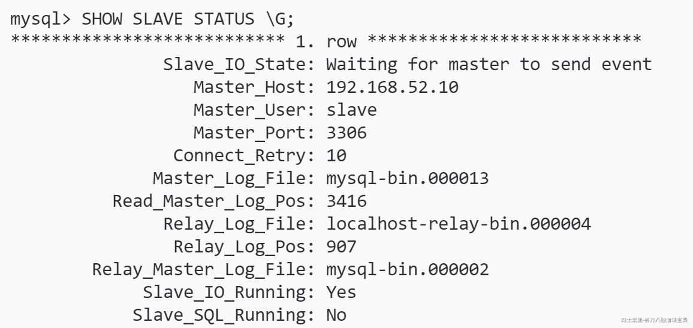

**13) 现在可以在我们的主服务器做一些更新的操作,然后在从服务器查看是否已经更新**

-- 在主库插入一条数据,观察从库是否同步

INSERT INTO users VALUES(NULL,'user4',23);

#### 2.4.3.3 常见问题解决

启动主从同步后，常见错误是Slave\_IO\_Running： No 或者 Connecting 的情况

**解决方案1：**

1. 首先停掉Slave服务

-- 在从机停止slave

stop slave;

1. 到主服务器上查看主机状态, 记录File和Position对应的值

-- 在主机查看mater状态

SHOW MASTER STATUS;

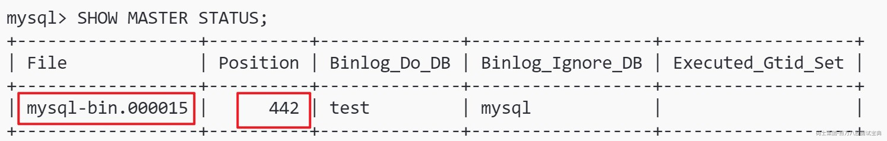

1. 然后到slave服务器上执行手动同步：

-- MASTER\_LOG\_FILE和MASTER\_LOG\_POS与主库保持一致

CHANGE MASTER TO MASTER\_HOST='192.168.52.10',

MASTER\_USER='slave',

MASTER\_PASSWORD='Qwer@1234',

MASTER\_PORT=3306,

MASTER\_LOG\_FILE='mysql-bin.000015',

MASTER\_LOG\_POS=442,

MASTER\_CONNECT\_RETRY=10;

**解决方案2**

1. 程序可能在slave上进行了写操作
2. 也可能是slave机器重起后，事务回滚造成的.
3. 一般是事务回滚造成的,解决办法

mysql> slave stop;

mysql> set GLOBAL SQL\_SLAVE\_SKIP\_COUNTER=1;

mysql> slave start;

### 2.4.4 Sharding-JDBC实现读写分离

**Sharding-JDBC读写分离则是根据SQL语义的分析，将读操作和写操作分别路由至主库与从库**。它提供透明化读写分离，让使用方尽量像使用一个数据库一样使用主从数据库集群。

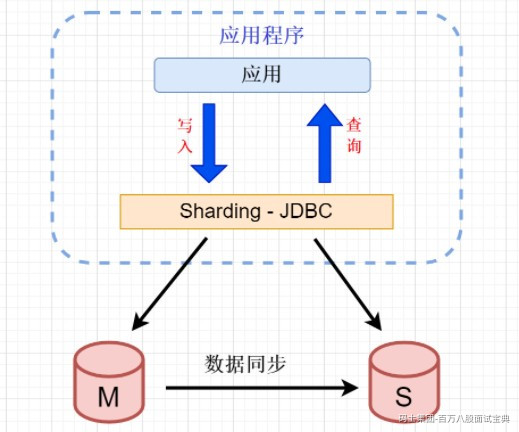

#### 2.4.4.1 数据准备

为了实现Sharding-JDBC的读写分离，首先，要进行mysql的主从同步配置。在上面的课程中我们已经配置完成了.

- 在主服务器中的 test数据库 创建商品表

CREATE TABLE `products` (

`pid` bigint(32) NOT NULL AUTO\_INCREMENT,

`pname` varchar(50) DEFAULT NULL,

`price` int(11) DEFAULT NULL,

`flag` varchar(2) DEFAULT NULL,

PRIMARY KEY (`pid`)

) ENGINE=InnoDB DEFAULT CHARSET=utf8

- 主库新建表之后,从库会根据binlog日志,同步创建.

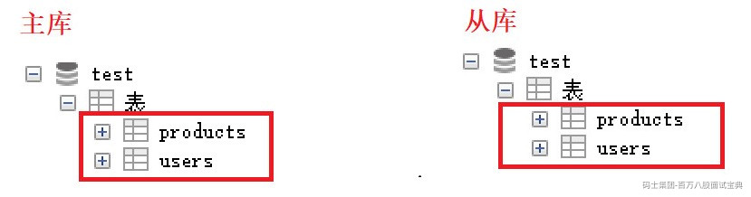

#### 2.4.4.2 创建SpringBoot程序

环境说明：SpringBoot2.3.7+ MyBatisPlus + ShardingSphere-JDBC 5.1 + Hikari+ MySQL 5.7

##### 1) 创建项目

项目名称: sharding-jdbc-write-read

Spring脚手架: <http://start.aliyun.com>

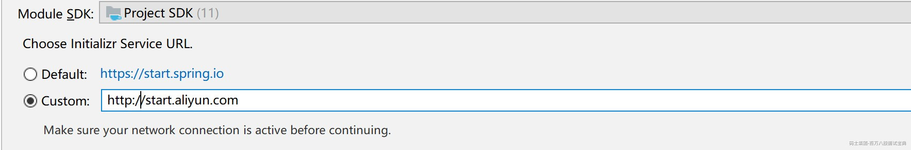

##### 2) 引入依赖

<dependencies>

<dependency>

<groupId>org.springframework.boot</groupId>

<artifactId>spring-boot-starter-web</artifactId>

</dependency>

<dependency>

<groupId>org.apache.shardingsphere</groupId>

<artifactId>shardingsphere-jdbc-core-spring-boot-starter</artifactId>

<version>5.1.1</version>

</dependency>

<dependency>

<groupId>com.baomidou</groupId>

<artifactId>mybatis-plus-boot-starter</artifactId>

<version>3.3.1</version>

</dependency>

<dependency>

<groupId>mysql</groupId>

<artifactId>mysql-connector-java</artifactId>

<scope>runtime</scope>

</dependency>

<dependency>

<groupId>org.projectlombok</groupId>

<artifactId>lombok</artifactId>

</dependency>

<dependency>

<groupId>org.springframework.boot</groupId>

<artifactId>spring-boot-starter-test</artifactId>

<scope>test</scope>

<exclusions>

<exclusion>

<groupId>org.junit.vintage</groupId>

<artifactId>junit-vintage-engine</artifactId>

</exclusion>

</exclusions>

</dependency>

</dependencies>

##### 3) 创建实体类

@TableName("products")

@Data

public class Products {

@TableId(value = "pid",type = IdType.AUTO)

private Long pid;

private String pname;

private int price;

private String flag;

}

##### 4) 创建Mapper

@Mapper

public interface ProductsMapper extends BaseMapper<Products> {

}

#### 2.4.4.3 配置读写分离

<https://shardingsphere.apache.org/document/current/cn/user-manual/shardingsphere-jdbc/spring-boot-starter/rules/readwrite-splitting/>

application.properties：

# 应用名称

spring.application.name=shardingjdbc-table-write-read

#===============数据源配置

# 配置真实数据源

spring.shardingsphere.datasource.names=master,slave

#数据源1

spring.shardingsphere.datasource.master.type=com.zaxxer.hikari.HikariDataSource

spring.shardingsphere.datasource.master.driver-class-name=com.mysql.jdbc.Driver

spring.shardingsphere.datasource.master.jdbc-url=jdbc:mysql://192.168.52.10:3306/test?useUnicode=true&characterEncoding=utf-8&useSSL=false

spring.shardingsphere.datasource.master.username=root

spring.shardingsphere.datasource.master.password=QiDian@666

#数据源2

spring.shardingsphere.datasource.slave.type=com.zaxxer.hikari.HikariDataSource

spring.shardingsphere.datasource.slave.driver-class-name=com.mysql.jdbc.Driver

spring.shardingsphere.datasource.slave.jdbc-url=jdbc:mysql://192.168.52.11:3306/test?useUnicode=true&characterEncoding=utf-8&useSSL=false

spring.shardingsphere.datasource.slave.username=root

spring.shardingsphere.datasource.slave.password=QiDian@666

# 读写分离类型，如: Static，Dynamic, ms1 包含了 m1 和 s1

spring.shardingsphere.rules.readwrite-splitting.data-sources.ms1.type=Static

# 写数据源名称

spring.shardingsphere.rules.readwrite-splitting.data-sources.ms1.props.write-data-source-name=master

# 读数据源名称，多个从数据源用逗号分隔

spring.shardingsphere.rules.readwrite-splitting.data-sources.ms1.props.read-data-source-names=slave

# 打印SQl

spring.shardingsphere.props.sql-show=true

负载均衡相关配置

<https://shardingsphere.apache.org/document/current/cn/dev-manual/readwrite-splitting/>

# 负载均衡算法名称

spring.shardingsphere.rules.readwrite-splitting.data-sources.myds.load-balancer-name=alg\_round

# 负载均衡算法配置

# 负载均衡算法类型

spring.shardingsphere.rules.readwrite-splitting.load-balancers.alg\_round.type=ROUND\_ROBIN # 轮询

spring.shardingsphere.rules.readwrite-splitting.load-balancers.alg\_random.type=RANDOM # 随机

spring.shardingsphere.rules.readwrite-splitting.load-balancers.alg\_weight.type=WEIGHT # 权重

spring.shardingsphere.rules.readwrite-splitting.load-balancers.alg\_weight.props.slave1=1

spring.shardingsphere.rules.readwrite-splitting.load-balancers.alg\_weight.props.slave2=2

#### 2.4.4.4 读写分离测试

//插入测试

@Test

public void testInsert(){

Products products = new Products();

products.setPname("电视机");

products.setPrice(100);

products.setFlag("0");

productsMapper.insert(products);

}

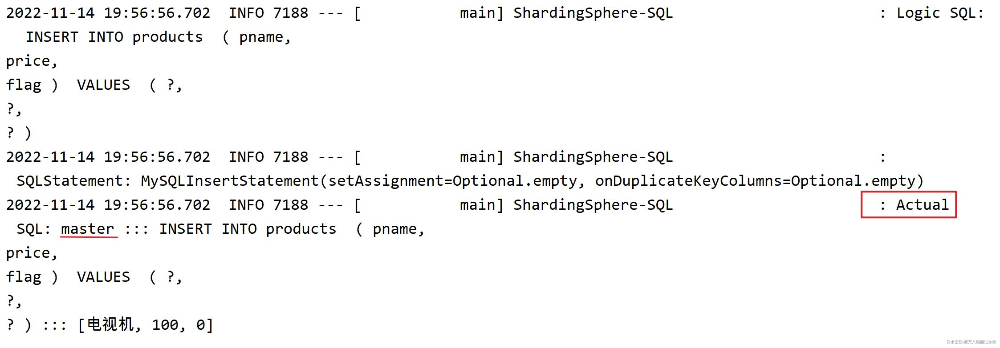

@Test

public void testSelect(){

QueryWrapper<Products> queryWrapper = new QueryWrapper<>();

queryWrapper.eq("pname","电视机");

List<Products> products = productsMapper.selectList(queryWrapper);

products.forEach(System.out::println);

}

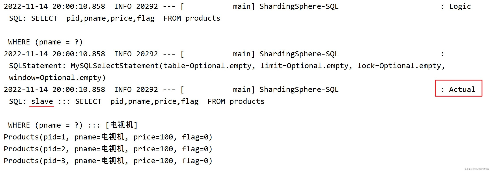

#### 2.4.4.5 事务测试

为了保证主从库间的事务一致性，避免跨服务的分布式事务，ShardingSphere-JDBC的主从模型中，事务中的数据读写均用主库。

- 不添加@Transactional：insert对主库操作，select对从库操作
- 添加@Transactional：则insert和select均对主库操作
- **注意：**在JUnit环境下的@Transactional注解，默认情况下就会对事务进行回滚（即使在没加注解@Rollback，也会对事务回滚）

//事务测试

@Transactional //开启事务

@Test

public void testTrans(){

Products products = new Products();

products.setPname("洗碗机");

products.setPrice(2000);

products.setFlag("1");

productsMapper.insert(products);

QueryWrapper<Products> queryWrapper = new QueryWrapper<>();

queryWrapper.eq("pname","洗碗机");

List<Products> list = productsMapper.selectList(queryWrapper);

list.forEach(System.out::println);

}

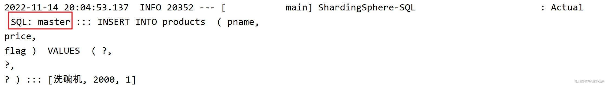

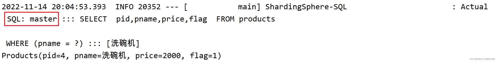

## 2.5 强制路由详解与实战

### 2.5.1 强制路由介绍

<https://shardingsphere.apache.org/document/4.1.0/cn/manual/sharding-jdbc/usage/hint/>

在一些应用场景中，分片条件并不存在于SQL，而存在于外部业务逻辑。因此需要提供一种通过在外部业务代码中指定路由配置的一种方式，在ShardingSphere中叫做Hint。如果使用Hint指定了强制分片路由，那么SQL将会无视原有的分片逻辑，直接路由至指定的数据节点操作。

**Hint使用场景：**

- 数据分片操作，如果分片键没有在SQL或数据表中，而是在业务逻辑代码中
- 读写分离操作，如果强制在主库进行某些数据操作

### 2.5.2 强制路由的使用

基于 Hint 进行强制路由的设计和开发过程需要遵循一定的约定，同时，ShardingSphere 也提供了专门的 HintManager 来简化强制路由的开发过程.

#### 2.5.2.1 环境准备

1. 在 msb\_course\_db0 和 msb\_course\_db1中创建 t\_course表.

- CREATE TABLE `t\_course` (  
   `cid` bigint(20) NOT NULL,  
   `user\_id` bigint(20) DEFAULT NULL,  
   `corder\_no` bigint(20) DEFAULT NULL,  
   `cname` varchar(50) DEFAULT NULL,  
   `brief` varchar(50) DEFAULT NULL,  
   `price` double DEFAULT NULL,  
   `status` int(11) DEFAULT NULL,  
   PRIMARY KEY (`cid`)  
  ) ENGINE=InnoDB DEFAULT CHARSET=utf8

2. 创建一个maven项目,直接下一步即可

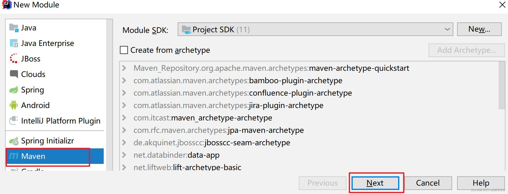

1. 创建完成后,引入依赖 (注意: 在这里我们使用ShardingSphere4.1版本演示强制路由)

<?xml version="1.0" encoding="UTF-8"?>

<project xmlns="http://maven.apache.org/POM/4.0.0"

xmlns:xsi="http://www.w3.org/2001/XMLSchema-instance"

xsi:schemaLocation="http://maven.apache.org/POM/4.0.0 [http://maven.apache.org/xsd/maven-4.0.0.xsd">](http://maven.apache.org/xsd/maven-4.0.0.xsd%22%3E)

<modelVersion>4.0.0</modelVersion>

<artifactId>shardingjdbc-hint</artifactId>

<parent>

<groupId>org.springframework.boot</groupId>

<artifactId>spring-boot-starter-parent</artifactId>

<version>2.2.5.RELEASE</version>

<relativePath/> <!-- lookup parent from repository -->

</parent>

<properties>

<java.version>1.8</java.version>

</properties>

<dependencies>

<dependency>

<groupId>org.springframework.boot</groupId>

<artifactId>spring-boot-starter-test</artifactId>

</dependency>

<dependency>

<groupId>org.springframework.boot</groupId>

<artifactId>spring-boot-starter</artifactId>

</dependency>

<dependency>

<groupId>org.springframework.boot</groupId>

<artifactId>spring-boot-starter-web</artifactId>

</dependency>

<!-- mysql -->

<dependency>

<groupId>mysql</groupId>

<artifactId>mysql-connector-java</artifactId>

<scope>runtime</scope>

</dependency>

<dependency>

<groupId>org.projectlombok</groupId>

<artifactId>lombok</artifactId>

<optional>true</optional>

</dependency>

<!-- mybatis plus 代码生成器 -->

<dependency>

<groupId>org.mybatis.spring.boot</groupId>

<artifactId>mybatis-spring-boot-starter</artifactId>

<version>2.1.3</version>

</dependency>

<dependency>

<groupId>com.baomidou</groupId>

<artifactId>mybatis-plus-boot-starter</artifactId>

<version>3.4.1</version>

</dependency>

<dependency>

<groupId>com.baomidou</groupId>

<artifactId>mybatis-plus-generator</artifactId>

<version>3.4.1</version>

</dependency>

<!-- ShardingSphere -->

<dependency>

<groupId>org.apache.shardingsphere</groupId>

<artifactId>sharding-jdbc-spring-boot-starter</artifactId>

<version>4.1.0</version>

</dependency>

<dependency>

<groupId>org.apache.shardingsphere</groupId>

<artifactId>sharding-core-common</artifactId>

<version>4.1.0</version>

</dependency>

<!-- commons-lang3 -->

<dependency>

<groupId>org.apache.commons</groupId>

<artifactId>commons-lang3</artifactId>

<version>3.10</version>

</dependency>

<dependency>

<groupId>cn.hutool</groupId>

<artifactId>hutool-all</artifactId>

<version>5.5.8</version>

</dependency>

<dependency>

<groupId>com.github.xiaoymin</groupId>

<artifactId>knife4j-spring-boot-starter</artifactId>

<version>2.0.5</version>

</dependency>

<dependency>

<groupId>com.google.guava</groupId>

<artifactId>guava</artifactId>

<version>20.0</version>

<scope>compile</scope>

</dependency>

</dependencies>

<build>

<plugins>

<plugin>

<groupId>org.springframework.boot</groupId>

<artifactId>spring-boot-maven-plugin</artifactId>

</plugin>

</plugins>

</build>

</project>

#### 2.5.2.2 代码编写

1. 启动类: ShardingSphereDemoApplication

@SpringBootApplication

@MapperScan("com.mashibing.mapper")

public class ShardingSphereDemoApplication {

public static void main(String[] args) {

SpringApplication.run(ShardingSphereDemoApplication.class, args);

}

}

1. Course

@TableName("t\_course")

@Data

@ToString

public class Course {

@TableId(type = IdType.ASSIGN\_ID)

private Long cid;

private Long userId;

private Long corderNo;

private String cname;

private String brief;

private double price;

private int status;

}

1. CourseMapper

@Repository

public interface CourseMapper extends BaseMapper<Course> {

}

1. 自定义MyHintShardingAlgorithm类

- 在该类中编写分库或分表路由策略，实现HintShardingAlgorithm接口,重写doSharding方法

// 泛型Long表示传入的参数是Long类型

public class MyHintShardingAlgorithm implements HintShardingAlgorithm<Long> {

/\*\*

\* collection: 代表分片目标,对哪些数据库、表分片.比如这里如果是对分库路由,表示db0.db1

\* hintShardingValue: 代表分片值,可以通过 HintManager 设置多个分片值,所以是个集合

\*/

@Override

public Collection<String> doSharding(Collection<String> collection,

HintShardingValue<Long> hintShardingValue) {

// 添加分库或分表路由逻辑

Collection<String> result = new ArrayList<>();

for (String actualDb : collection){

for (Long value : hintShardingValue.getValues()){

//分库路由,判断当前节点名称结尾是否与取模结果一致

if(actualDb.endsWith(String.valueOf(value % 2))){

result.add(actualDb);

}

}

}

return result;

}

}

#### 2.5.2.3 配置文件

application.properties

# 应用名称

spring.application.name=sharding-jdbc-hint

#===============数据源配置

# 命名数据源 这个是自定义的

spring.shardingsphere.datasource.names=db0,db1

# 配置数据源db0

spring.shardingsphere.datasource.db0.type=com.zaxxer.hikari.HikariDataSource

spring.shardingsphere.datasource.db0.driverClassName=com.mysql.jdbc.Driver

spring.shardingsphere.datasource.db0.jdbc-url=jdbc:mysql://192.168.52.10:3306/msb\_course\_db0?useUnicode=true&serverTimezone=Asia/Shanghai&characterEncoding=utf-8&useSSL=false

spring.shardingsphere.datasource.db0.username=root

spring.shardingsphere.datasource.db0.password=QiDian@666

## 配置数据源db1

spring.shardingsphere.datasource.db1.type=com.zaxxer.hikari.HikariDataSource

spring.shardingsphere.datasource.db1.driverClassName=com.mysql.jdbc.Driver

spring.shardingsphere.datasource.db1.jdbc-url=jdbc:mysql://192.168.52.11:3306/msb\_course\_db1?useUnicode=true&serverTimezone=Asia/Shanghai&characterEncoding=utf-8&useSSL=false

spring.shardingsphere.datasource.db1.username=root

spring.shardingsphere.datasource.db1.password=QiDian@666

# 配置默认数据源db0

spring.shardingsphere.sharding.default-data-source-name=db0

# Hint强制路由

# 使用t\_course表测试强制路由到库

spring.shardingsphere.sharding.tables.t\_course.database-strategy.hint.algorithm-class-name=com.mashibing.hint.MyHintShardingAlgorithm

# 打印SQl

spring.shardingsphere.props.sql.show=true

#### 2.5.2.4 强制路由到库测试

@RunWith(SpringRunner.class)

@SpringBootTest(classes = ShardingSphereDemoApplication.class)

public class TestHintAlgorithm {

@Autowired

private CourseMapper courseMapper;

//测试强制路由,在业务代码中执行查询前使用HintManager指定执行策略值

@Test

public void testHintInsert(){

HintManager hintManager = HintManager.getInstance();

//如果只是针对库路由,就调用setDatabaseShardingValue方法

hintManager.setDatabaseShardingValue(1L); //添加数据源分片键值,强制路由到db$->{1%2} = db1

for (int i = 1; i < 9; i++) {

Course course = new Course();

course.setUserId(1001L+i);

course.setCname("Java经典面试题讲解");

course.setBrief("课程涵盖目前最容易被问到的10000道Java面试题");

course.setPrice(100.0);

course.setStatus(1);

courseMapper.insert(course);

}

}

//测试查询

@Test

public void testHintSelect(){

HintManager hintManager = HintManager.getInstance();

hintManager.setDatabaseShardingValue(1L);

List<Course> courses = courseMapper.selectList(null);

System.out.println(courses);

}

}

#### 2.5.2.5 强制路由到库到表测试

1. 配置文件

# 应用名称

spring.application.name=sharding-jdbc-hint

#===============数据源配置

# 命名数据源 这个是自定义的

spring.shardingsphere.datasource.names=db0,db1

# 配置数据源ds-0

spring.shardingsphere.datasource.db0.type=com.zaxxer.hikari.HikariDataSource

spring.shardingsphere.datasource.db0.driverClassName=com.mysql.jdbc.Driver

spring.shardingsphere.datasource.db0.jdbc-url=jdbc:mysql://192.168.52.10:3306/msb\_course\_db0?useUnicode=true&serverTimezone=Asia/Shanghai&characterEncoding=utf-8&useSSL=false

spring.shardingsphere.datasource.db0.username=root

spring.shardingsphere.datasource.db0.password=QiDian@666

## 配置数据源ds-1

spring.shardingsphere.datasource.db1.type=com.zaxxer.hikari.HikariDataSource

spring.shardingsphere.datasource.db1.driverClassName=com.mysql.jdbc.Driver

spring.shardingsphere.datasource.db1.jdbc-url=jdbc:mysql://192.168.52.11:3306/msb\_course\_db1?useUnicode=true&serverTimezone=Asia/Shanghai&characterEncoding=utf-8&useSSL=false

spring.shardingsphere.datasource.db1.username=root

spring.shardingsphere.datasource.db1.password=QiDian@666

# 配置默认数据源ds-0

spring.shardingsphere.sharding.default-data-source-name=db0

# Hint强制路由

# 使用t\_course表测试强制路由到库

#spring.shardingsphere.sharding.tables.t\_course.database-strategy.hint.algorithm-class-name=com.mashibing.hint.MyHintShardingAlgorithm

# 使用t\_course表测试强制路由到库和表

spring.shardingsphere.sharding.tables.t\_course.database-strategy.hint.algorithm-class-name=com.mashibing.hint.MyHintShardingAlgorithm

spring.shardingsphere.sharding.tables.t\_course.table-strategy.hint.algorithm-class-name=com.mashibing.hint.MyHintShardingAlgorithm

spring.shardingsphere.sharding.tables.t\_course.actual-data-nodes=db$->{0..1}.t\_course\_$->{0..1}

# 打印SQl

spring.shardingsphere.props.sql.show=true

1. 测试

@Test

public void testHintSelectTable() {

HintManager hintManager = HintManager.getInstance();

//强制路由到db1数据库

hintManager.addDatabaseShardingValue("t\_course", 1L);

//强制路由到t\_course\_1表

hintManager.addTableShardingValue("t\_course",1L);

List<Course> courses = courseMapper.selectList(null);

courses.forEach(System.out::println);

}

#### 2.5.2.6 强制路由走主库查询测试

在读写分离结构中，为了避免主从同步数据延迟及时获取刚添加或更新的数据，可以采用强制路由走主库查询实时数据，使用hintManager.setMasterRouteOnly设置主库路由即可。

1. 配置文件

# 应用名称

spring.application.name=sharding-jdbc-hint01

# 定义多个数据源

spring.shardingsphere.datasource.names = m1,s1

#读写分离数据源

spring.shardingsphere.datasource.m1.type=com.zaxxer.hikari.HikariDataSource

spring.shardingsphere.datasource.m1.driverClassName=com.mysql.jdbc.Driver

spring.shardingsphere.datasource.m1.jdbc-url=jdbc:mysql://192.168.52.10:3306/test\_rw?useUnicode=true&serverTimezone=Asia/Shanghai&characterEncoding=utf-8&useSSL=false

spring.shardingsphere.datasource.m1.username=root

spring.shardingsphere.datasource.m1.password=QiDian@666

spring.shardingsphere.datasource.s1.type=com.zaxxer.hikari.HikariDataSource

spring.shardingsphere.datasource.s1.driverClassName=com.mysql.jdbc.Driver

spring.shardingsphere.datasource.s1.jdbc-url=jdbc:mysql://192.168.52.10:3306/test\_rw?useUnicode=true&serverTimezone=Asia/Shanghai&characterEncoding=utf-8&useSSL=false

spring.shardingsphere.datasource.s1.username=root

spring.shardingsphere.datasource.s1.password=QiDian@666

#主库与从库的信息

spring.shardingsphere.sharding.master-slave-rules.ms1.master-data-source-name=m1

spring.shardingsphere.sharding.master-slave-rules.ms1.slave-data-source-names=s1

#配置数据节点

spring.shardingsphere.sharding.tables.products.actual-data-nodes = ms1.products

# 打印SQl

spring.shardingsphere.props.sql-show=true

1. 测试

//强制路由走主库

@Test

public void testHintReadTableToMaster() {

HintManager hintManager = HintManager.getInstance();

hintManager.setMasterRouteOnly();

List<Products> products = productsMapper.selectList(null);

products.forEach(System.out::println);

}

#### 2.5.2.6 SQL执行流程剖析

ShardingSphere 3个产品的数据分片功能主要流程是完全一致的，如下图所示。

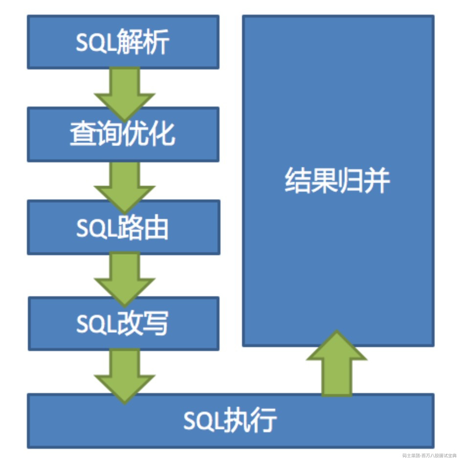

- SQL解析
- SQL解析分为词法解析和语法解析。 先通过词法解析器将SQL拆分为一个个不可再分的单词。再使用语法解析器对SQL进行理解，并最终提炼出解析上下文。
- Sharding-JDBC采用不同的解析器对SQL进行解析，解析器类型如下：

- MySQL解析器
- Oracle解析器
- SQLServer解析器
- PostgreSQL解析器
- 默认SQL解析器

- 查询优化 负责合并和优化分片条件，如OR等。
- SQL路由
- 根据解析上下文匹配用户配置的分片策略，并生成路由路径。目前支持分片路由和广播路由。
- SQL改写
- 将SQL改写为在真实数据库中可以正确执行的语句。SQL改写分为正确性改写和优化改写。
- SQL执行
- 通过多线程执行器异步执行SQL。
- 结果归并
- 将多个执行结果集归并以便于通过统一的JDBC接口输出。结果归并包括流式归并、内存归并和使用装饰者模式的追加归并这几种方式。

## 2.6 数据加密详解与实战

### 2.6.1 数据加密介绍

数据加密(数据脱敏) 是指对某些敏感信息通过脱敏规则进行数据的变形，实现敏感隐私数据的可靠保护。涉及客户安全数据或者一些商业性敏感数据，如身份证号、手机号、卡号、客户号等个人信息按照规定，都需要进行数据脱敏。

数据加密模块属于ShardingSphere分布式治理这一核心功能下的子功能模块。

- Apache ShardingSphere 通过对用户输入的 SQL 进行解析，并依据用户提供的加密规则对 SQL 进行改写，从而实现对原文数据进行加密，并将原文数据（可选）及密文数据同时存储到底层数据库。
- 在用户查询数据时，它仅从数据库中取出密文数据，并对其解密，最终将解密后的原始数据返回给用户。

**Apache ShardingSphere自动化&透明化了数据脱敏过程，让用户无需关注数据脱敏的实现细节，像使用普通数据那样使用脱敏数据。**

### 2.6.2 整体架构

ShardingSphere提供的Encrypt-JDBC和业务代码部署在一起。业务方需面向Encrypt-JDBC进行JDBC编程。

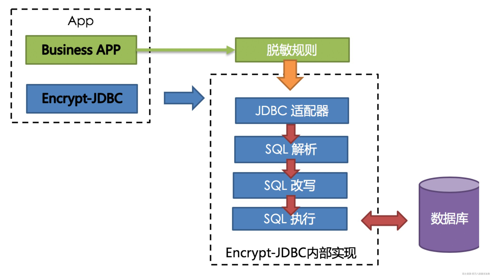

加密模块将用户发起的 SQL 进行拦截，并通过 SQL 语法解析器进行解析、理解 SQL 行为，再依据用户传入的加密规则，找出需要加密的字段和所使用的加解密算法对目标字段进行加解密处理后，再与底层数据库进行交互。

Apache ShardingSphere 会将用户请求的明文进行**加密后**存储到底层数据库；并在用户查询时，将密文从数据库中取出进行解密后返回给终端用户。

通过屏蔽对数据的加密处理，使用户无需感知解析 SQL、数据加密、数据解密的处理过程，就像在使用普通数据一样使用加密数据。

### 2.6.3 加密规则

脱敏配置主要分为四部分：数据源配置，加密器配置，脱敏表配置以及查询属性配置，其详情如下图所示：

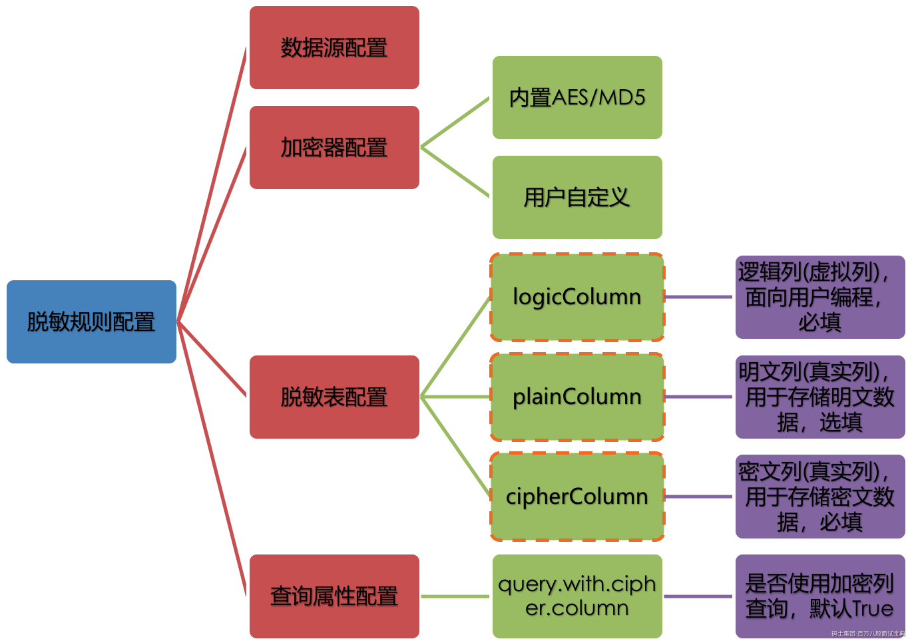

- 数据源配置：指DataSource的配置信息
- 加密器配置：指使用什么加密策略进行加解密。目前ShardingSphere内置了两种加解密策略：AES/MD5
- 脱敏表配置：指定哪个列用于存储密文数据（cipherColumn）、哪个列用于存储明文数据（plainColumn）以及用户想使用哪个列进行SQL编写（logicColumn）
- 查询属性的配置：当底层数据库表里同时存储了明文数据、密文数据后，该属性开关用于决定是直接查询数据库表里的明文数据进行返回，还是查询密文数据通过Encrypt-JDBC解密后返回。

### 2.6.4 脱敏处理流程

下图可以看出ShardingSphere将逻辑列与明文列和密文列进行了列名映射。

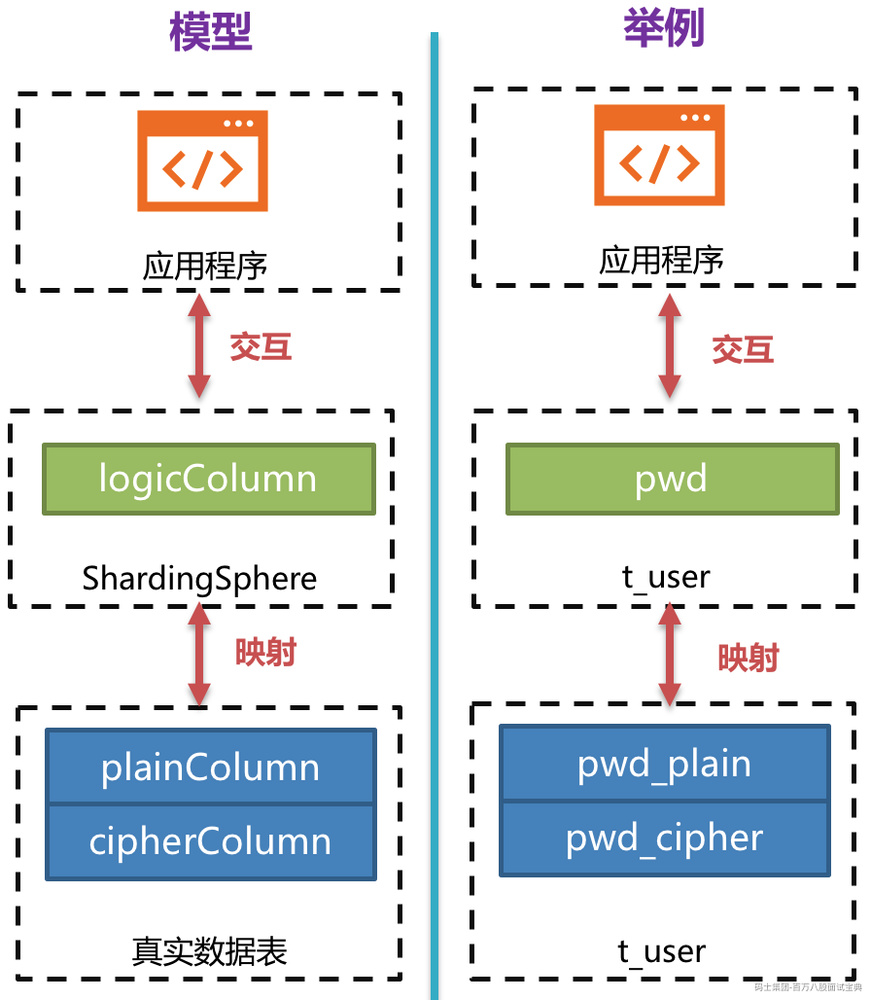

下方图片展示了使用Encrypt-JDBC进行增删改查时，其中的处理流程和转换逻辑，如下图所示。

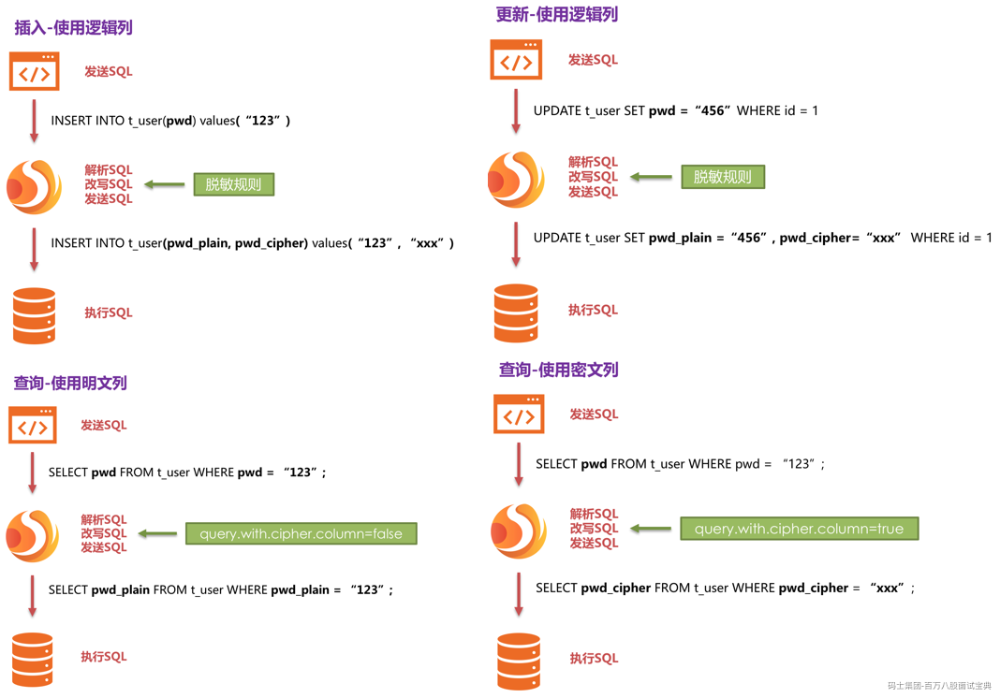

### 2.6.5 数据加密实战

#### 2.6.5.1 环境搭建

1. 创建数据库及表

CREATE TABLE `t\_user` (

`user\_id` bigint(11) NOT NULL,

`user\_name` varchar(255) DEFAULT NULL,

`password` varchar(255) DEFAULT NULL COMMENT '密码明文',

`password\_encrypt` varchar(255) DEFAULT NULL COMMENT '密码密文',

`password\_assisted` varchar(255) DEFAULT NULL COMMENT '辅助查询列',

PRIMARY KEY (`user\_id`)

) ENGINE=InnoDB DEFAULT CHARSET=utf8

1. 创建maven项目,并引入依赖

与强制路由的项目创建方式相同,引入依赖也相同.

1. 启动类

@SpringBootApplication

@MapperScan("com.mashibing.mapper")

public class ShardingSphereApplication {

public static void main(String[] args) {

SpringApplication.run(ShardingSphereApplication.class, args);

}

}

1. 创建实体类

@TableName("t\_user")

@Data

public class User {

@TableId(value = "user\_id",type = IdType.ASSIGN\_ID)

private Long userId;

private String userName;

private String password;

private String passwordEncrypt;

private String passwordAssisted;

}

1. 创建Mapper

@Repository

public interface UserMapper extends BaseMapper<User> {

@Insert("insert into t\_user(user\_id,user\_name,password) " +

"values(#{userId},#{userName},#{password})")

void insetUser(User users);

@Select("select \* from t\_user where user\_name=#{userName} and password=#{password}")

@Results({

@Result(column = "user\_id", property = "userId"),

@Result(column = "user\_name", property = "userName"),

@Result(column = "password", property = "password"),

@Result(column = "password\_assisted", property = "passwordAssisted")

})

List<User> getUserInfo(String userName, String password);

}

1. 配置文件

# 应用名称

spring.application.name=sharding-jdbc-encryption

#===============数据源配置

# 命名数据源 这个是自定义的

spring.shardingsphere.datasource.names=db0

# 配置数据源ds0

spring.shardingsphere.datasource.db0.type=com.zaxxer.hikari.HikariDataSource

spring.shardingsphere.datasource.db0.driverClassName=com.mysql.jdbc.Driver

spring.shardingsphere.datasource.db0.jdbc-url=jdbc:mysql://192.168.52.10:3306/msb\_encryption\_db?useUnicode=true&serverTimezone=Asia/Shanghai&characterEncoding=utf-8&useSSL=false

spring.shardingsphere.datasource.db0.username=root

spring.shardingsphere.datasource.db0.password=QiDian@666

# 打印SQl

spring.shardingsphere.props.sql.show=true

1. 测试插入与查询

@RunWith(SpringRunner.class)

@SpringBootTest(classes = ShardingSphereApplication.class)

public class TestShardingEncryption {

@Autowired

private UserMapper usersMapper;

@Test

public void testInsertUser(){

User users = new User();

users.setUserName("user2022");

users.setPassword("123456");

usersMapper.insetUser(users);

}

@Test

public void testSelectUser(){

List<User> userList = usersMapper.getUserInfo("user2022", "123456");

userList.forEach(System.out::println);

}

}

#### 2.6.5.2 加密策略解析

<https://shardingsphere.apache.org/document/current/cn/user-manual/shardingsphere-jdbc/spring-boot-starter/rules/encrypt/>

ShardingSphere提供了两种加密策略用于数据脱敏，该两种策略分别对应ShardingSphere的两种加解密的接口，即Encryptor和QueryAssistedEncryptor。

- Encryptor: 该解决方案通过提供encrypt(), decrypt()两种方法对需要脱敏的数据进行加解密。

- 在用户进行INSERT, DELETE, UPDATE时，ShardingSphere会按照用户配置，对SQL进行解析、改写、路由，并会调用encrypt()将数据加密后存储到数据库, 而在SELECT时，则调用decrypt()方法将从数据库中取出的脱敏数据进行逆向解密，最终将原始数据返回给用户。
- 当前，ShardingSphere针对这种类型的脱敏解决方案提供了两种具体实现类，分别是MD5(不可逆)，AES(可逆)，用户只需配置即可使用这两种内置的方案。

- QueryAssistedEncryptor: 相比较于第一种脱敏方案，该方案更为安全和复杂。

- 它的理念是：即使是相同的数据，如两个用户的密码相同，它们在数据库里存储的脱敏数据也应当是不一样的。这种理念更有利于保护用户信息，防止撞库成功。
- 当前，ShardingSphere针对这种类型的脱敏解决方案并没有提供具体实现类，却将该理念抽象成接口，提供给用户自行实现。ShardingSphere将调用用户提供的该方案的具体实现类进行数据脱敏。

#### 2.6.5.3 默认AES加密算法实现

数据加密默认算法支持 AES 和 MD5 两种

- AES 对称加密: 同一个密钥可以同时用作信息的加密和解密，这种加密方法称为对称加密
- 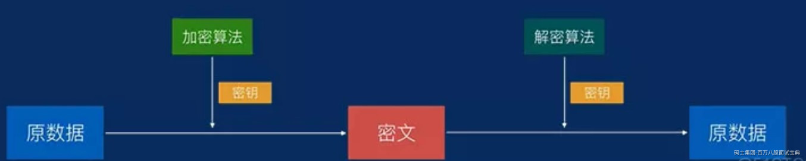
- 加密：明文 + 密钥 -> 密文  
  解密：密文 + 密钥 -> 明文
- MD5算是一个生成签名的算法,引起结果不可逆.
- MD5的优点：计算速度快，加密速度快，不需要密钥；
- MD5的缺点: 将用户的密码直接MD5后存储在数据库中是不安全的。很多人使用的密码是常见的组合，威胁者将这些密码的常见组合进行单向哈希，得到一个摘要组合，然后与数据库中的摘要进行比对即可获得对应的密码。
- <https://www.tool.cab/decrypt/md5.html>

**配置文件**

# 应用名称

spring.application.name=sharding-jdbc-encryption

#===============数据源配置

# 命名数据源 这个是自定义的

spring.shardingsphere.datasource.names=db0

# 配置数据源ds0

spring.shardingsphere.datasource.db0.type=com.zaxxer.hikari.HikariDataSource

spring.shardingsphere.datasource.db0.driverClassName=com.mysql.jdbc.Driver

spring.shardingsphere.datasource.db0.jdbc-url=jdbc:mysql://192.168.52.10:3306/msb\_encryption\_db?useUnicode=true&serverTimezone=Asia/Shanghai&characterEncoding=utf-8&useSSL=false

spring.shardingsphere.datasource.db0.username=root

spring.shardingsphere.datasource.db0.password=QiDian@666

# 采用AES对称加密策略

spring.shardingsphere.encrypt.encryptors.encryptor\_aes.type=aes

spring.shardingsphere.encrypt.encryptors.encryptor\_aes.props.aes.key.value=123456abc

# password为逻辑列，password.plainColumn为数据表明文列，password.cipherColumn为数据表密文列

spring.shardingsphere.encrypt.tables.t\_user.columns.password.plainColumn=password

spring.shardingsphere.encrypt.tables.t\_user.columns.password.cipherColumn=password\_encrypt

spring.shardingsphere.encrypt.tables.t\_user.columns.password.encryptor=encryptor\_aes

# 查询是否使用密文列

spring.shardingsphere.props.query.with.cipher.column=true

# 打印SQl

spring.shardingsphere.props.sql.show=true

**测试插入数据**

1. 设置了明文列和密文列，运行成功，新增时逻辑列会改写成明文列和密文列

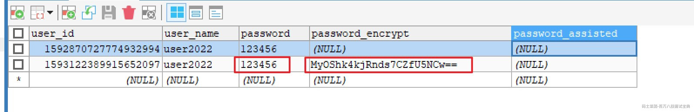

1. 仅设置明文列，运行直接报错，所以必须设置加密列

- 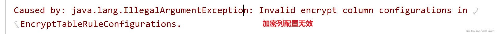

2. 仅设置密文列，运行成功，明文会进行加密，数据库实际插入到密文列

- 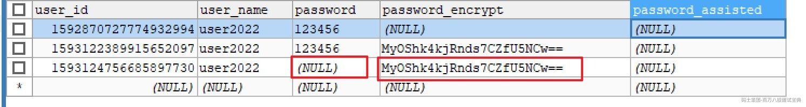

1. 设置了明文列和密文列， spring.shardingsphere.props.query.with.cipher.column 为**true**时，查询通过密文列查询，返回数据为明文.

- 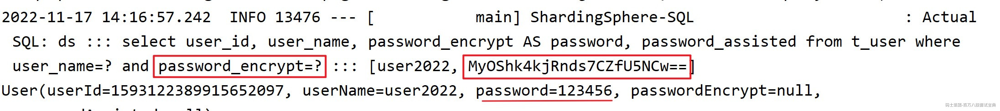

2. 设置了明文列和密文列， spring.shardingsphere.props.query.with.cipher.column 为false时，查询通过明文列执行，返回数据为明文列.

- 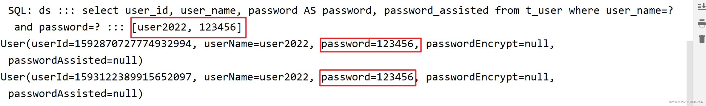

#### 2.6.5.4 MD5加密算法实现

**配置文件**

# 采用MD5加密策略

spring.shardingsphere.encrypt.encryptors.encryptor\_md5.type=MD5

# password为逻辑列，password.plainColumn为数据表明文列，password.cipherColumn为数据表密文列

spring.shardingsphere.encrypt.tables.t\_user.columns.password.plainColumn=password

spring.shardingsphere.encrypt.tables.t\_user.columns.password.cipherColumn=password\_encrypt

spring.shardingsphere.encrypt.tables.t\_user.columns.password.encryptor=encryptor\_md5

# 查询是否使用密文列

spring.shardingsphere.props.query.with.cipher.column=true

**测试插入数据**

1. 新增时，可以看到加密后的数据和AES的有所区别

- 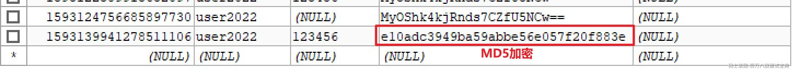

2. 查询时，spring.shardingsphere.props.query.with.cipher.column为**true**时，通过密文列查询，由于MD5加密是非对称的，所以返回的是密文数据

- 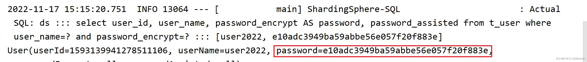

3. 查询时，spring.shardingsphere.props.query.with.cipher.column为**false**时，通过明文列查询，返回明文数据

- 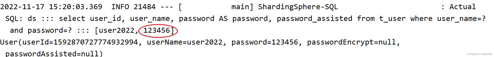

## 2.7 分布式事务详解与实战

### 2.7.1 什么是分布式事务

#### 2.7.1.1 本地事务介绍

本地事务，是指传统的单机数据库事务，**必须具备ACID原则**：

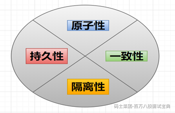

- **原子性（A）**
- 所谓的原子性就是说，在整个事务中的所有操作，要么全部完成，要么全部不做，没有中间状态。对于事务在执行中发生错误，所有的操作都会被回滚，整个事务就像从没被执行过一样。
- **一致性（C）**
- 事务的执行必须保证系统的一致性，在事务开始之前和事务结束以后，数据库的完整性没有被破坏，就拿转账为例，A有500元，B有500元，如果在一个事务里A成功转给B50元，那么不管发生什么，那么最后A账户和B账户的数据之和必须是1000元。
- **隔离性（I）**
- 所谓的隔离性就是说，事务与事务之间不会互相影响，一个事务的中间状态不会被其他事务感知。数据库保证隔离性包括四种不同的隔离级别：

- Read Uncommitted（读取未提交内容）
- Read Committed（读取提交内容）
- Repeatable Read（可重读）
- Serializable（可串行化）

- **持久性（D）**
- 所谓的持久性，就是说一旦事务提交了，那么事务对数据所做的变更就完全保存在了数据库中，即使发生停电，系统宕机也是如此。

**因为在传统项目中，项目部署基本是单点式：即单个服务器和单个数据库。这种情况下，数据库本身的事务机制就能保证ACID的原则，这样的事务就是本地事务。**

#### 2.7.1.2 事务日志undo和redo

单个服务与单个数据库的架构中，产生的事务都是本地事务。其中原子性和持久性其实是依靠undo和redo 日志来实现。

InnoDB的事务日志主要分为:

- undo log(回滚日志，提供回滚操作)
- redo log(重做日志，提供前滚操作)

**1) undo log日志介绍**

Undo Log的原理很简单，为了满足事务的原子性，在操作任何数据之前，首先将数据备份到Undo Log。然后进行数据的修改。如果出现了错误或者用户执行了ROLLBACK语句，系统可以利用Undo Log中的备份将数据恢复到事务开始之前的状态。

Undo Log 记录了此次事务**「开始前」** 的数据状态，记录的是更新之 **「前」**的值

undo log 作用:

1. 实现事务原子性,可以用于回滚
2. 实现多版本并发控制（MVCC）, 也即非锁定读

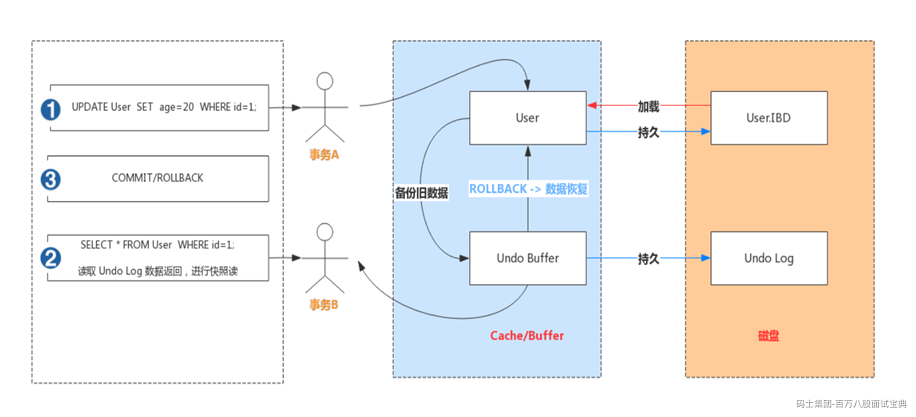

Undo log 产生和销毁

1. Undo Log在事务开始前产生
2. 当事务提交之后，undo log 并不能立马被删除，而是放入待清理的链表
3. 会通过后台线程 purge thread 进行回收处理

**Undo Log属于逻辑日志，记录一个变化过程。例如执行一个delete，undolog会记录一个insert；执行一个update，undolog会记录一个相反的update。**

**2) redo log日志介绍**

和Undo Log相反，Redo Log记录的是**新数据**的备份。在事务提交前，只要将Redo Log持久化即可，不需要将数据持久化，减少了IO的次数。

Redo Log: 记录了此次事务**「完成后」** 的数据状态，记录的是更新之 **「后」**的值

Redo log的作用:

- 比如MySQL实例挂了或宕机了，重启时，InnoDB存储引擎会使用redo log恢复数据，保证数据的持久性与完整性。

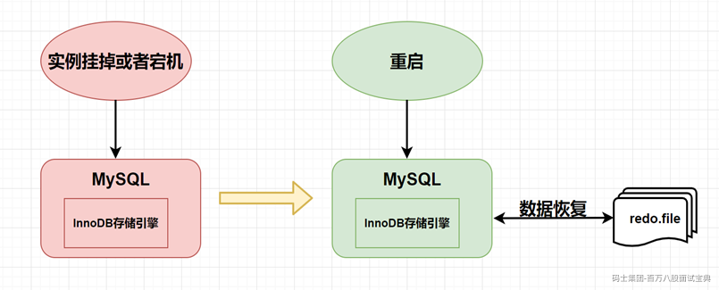

Redo Log 的工作原理

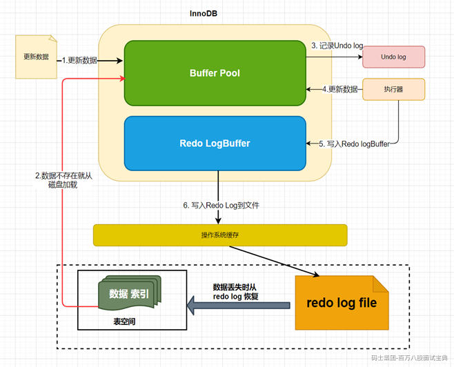

**Undo + Redo事务的简化过程**

假设有A、B两个数据，值分别为1,2

A. 事务开始.

B. 记录A=1到undo log buffer.

C. 修改A=3.

D. 记录A=3到redo log buffer.

E. 记录B=2到undo log buffer.

F. 修改B=4.

G. 记录B=4到redo log buffer.

H. 将undo log写入磁盘

I. 将redo log写入磁盘

J. 事务提交

**安全和性能问题**

- 如何保证原子性？
- 如果在事务提交前故障，通过undo log日志恢复数据。如果undo log都还没写入，那么数据就尚未持久化，无需回滚
- 如何保证持久化？
- 大家会发现，这里并没有出现数据的持久化。因为数据已经写入redo log，而redo log持久化到了硬盘，因此只要到了步骤I以后，事务是可以提交的。
- 内存中的数据库数据何时持久化到磁盘？
- 因为redo log已经持久化，因此数据库数据写入磁盘与否影响不大，不过为了避免出现脏数据（内存中与磁盘不一致），事务提交后也会将内存数据刷入磁盘（也可以按照固设定的频率刷新内存数据到磁盘中）。
- redo log何时写入磁盘
- redo log会在事务提交之前，或者redo log buffer满了的时候写入磁盘

**总结一下：**

- undo log 记录更新前数据，用于保证事务原子性
- redo log 记录更新后数据，用于保证事务的持久性
- redo log有自己的内存buffer，先写入到buffer，事务提交时写入磁盘
- redo log持久化之后，意味着事务是**可提交**的

#### 2.7.1.3 分布式事务介绍

分布式事务，就是指不是在单个服务或单个数据库架构下，产生的事务：

- 跨数据源的分布式事务
- 跨服务的分布式事务
- 综合情况

**1）跨数据源**

随着业务数据规模的快速发展，数据量越来越大，单库单表逐渐成为瓶颈。所以我们对数据库进行了水平拆分，将原单库单表拆分成数据库分片，于是就产生了跨数据库事务问题。

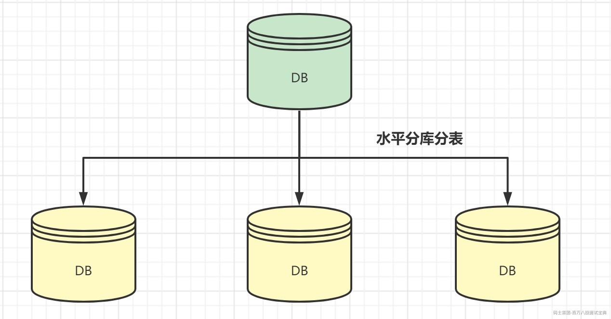

**2）跨服务**

在业务发展初期，“一块大饼”的单业务系统架构，能满足基本的业务需求。但是随着业务的快速发展，系统的访问量和业务复杂程度都在快速增长，单系统架构逐渐成为业务发展瓶颈，解决业务系统的高耦合、可伸缩问题的需求越来越强烈。

如下图所示，按照面向服务（SOA）的架构的设计原则，将单业务系统拆分成多个业务系统，降低了各系统之间的耦合度，使不同的业务系统专注于自身业务，更有利于业务的发展和系统容量的伸缩。

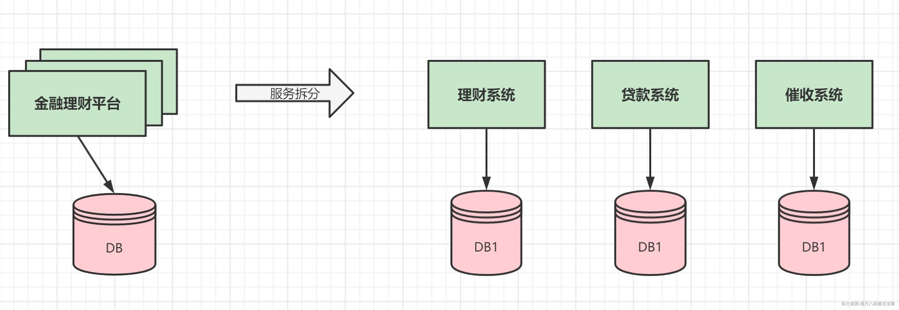

**3）分布式系统的数据一致性问题**

在数据库水平拆分、服务垂直拆分之后，一个业务操作通常要跨多个数据库、服务才能完成。在分布式网络环境下，我们无法保障所有服务、数据库都百分百可用，一定会出现部分服务、数据库执行成功，另一部分执行失败的问题。

当出现部分业务操作成功、部分业务操作失败时，业务数据就会出现不一致。

例如电商行业中比较常见的下单付款案例，包括下面几个行为：

- 创建新订单
- 扣减商品库存
- 从用户账户余额扣除金额

完成上面的操作需要访问三个不同的微服务和三个不同的数据库。

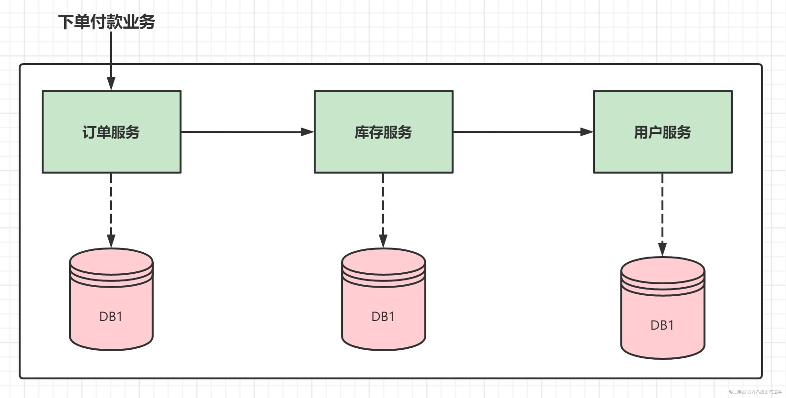

在分布式环境下，肯定会出现部分操作成功、部分操作失败的问题，比如：订单生成了，库存也扣减了，但是 用户账户的余额不足，这就造成数据不一致。

订单的创建、库存的扣减、账户扣款在每一个服务和数据库内是一个本地事务，可以保证ACID原则。

但是当我们把三件事情看做一个事情事，要满足保证“业务”的原子性，要么所有操作全部成功，要么全部失败，不允许出现部分成功部分失败的现象，这就是分布式系统下的事务了。

此时ACID难以满足，这是分布式事务要解决的问题.

### 2.7.2 分布式事务理论

#### 2.7.2.1 CAP (强一致性)

- CAP 定理，又被叫作布鲁尔定理。对于共享数据系统，最多只能同时拥有CAP其中的两个，任意两个都有其适应的场景。

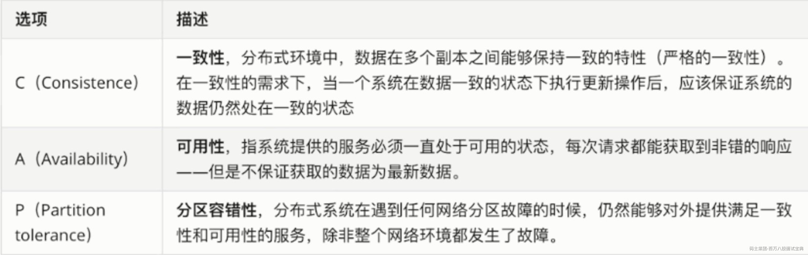

- 怎样才能同时满足CA？
- 除非是单点架构
- 何时要满足CP？
- 对一致性要求高的场景。例如我们的Zookeeper就是这样的，在服务节点间数据同步时，服务对外不可用。
- 何时满足AP？
- 对可用性要求较高的场景。例如Eureka，必须保证注册中心随时可用，不然拉取不到服务就可能出问题。

#### 2.7.2.2 BASE（最终一致性）

BASE 是指基本可用（Basically Available）、软状态（ Soft State）、最终一致性（ Eventual Consistency）。它的核心思想是即使无法做到强一致性（CAP 就是强一致性），但应用可以采用适合的方式达到最终一致性。

- BA指的是基本业务可用性，支持分区失败；
- S表示柔性状态，也就是允许短时间内不同步；
- E表示最终一致性，数据最终是一致的，但是实时是不一致的。

原子性和持久性必须从根本上保障，为了可用性、性能和服务降级的需要，只有降低一致性和隔离性的要求。BASE 解决了 CAP 理论中没有考虑到的网络延迟问题，在BASE中用软状态和最终一致，保证了延迟后的一致性。

还以上面的下单减库存和扣款为例：

订单服务、库存服务、用户服务及他们对应的数据库就是分布式应用中的三个部分。

- CP方式：现在如果要满足事务的强一致性，就必须在订单服务数据库锁定的同时，对库存服务、用户服务数据资源同时锁定。等待三个服务业务全部处理完成，才可以释放资源。此时如果有其他请求想要操作被锁定的资源就会被阻塞，这样就是满足了CP。
- 这就是强一致，弱可用
- AP方式：三个服务的对应数据库各自独立执行自己的业务，执行本地事务，不要求互相锁定资源。但是这个中间状态下，我们去访问数据库，可能遇到数据不一致的情况，不过我们需要做一些后补措施，保证在经过一段时间后，数据最终满足一致性。
- 这就是高可用，但弱一致（最终一致）。

由上面的两种思想，延伸出了很多的分布式事务解决方案：

- XA
- TCC
- 可靠消息最终一致
- AT

### 2.7.3 分布式事务模式

了解了分布式事务中的强一致性和最终一致性理论，下面介绍几种常见的分布式事务的解决方案。

#### 2.7.3.1 DTP模型与XA协议

**1) DTP介绍**

X/Open DTP(Distributed Transaction Process)是一个分布式事务模型。这个模型主要使用了两段提交(2PC - Two-Phase-Commit)来保证分布式事务的完整性。

1994 年，X/Open 组织（即现在的 Open Group ）定义了分布式事务处理的DTP 模型。该模型包括这样几个角色：

- 应用程序（ AP ）：我们的微服务
- 事务管理器（ TM ）：全局事务管理者
- 资源管理器（ RM ）：一般是数据库
- 通信资源管理器（ CRM ）：是TM和RM间的通信中间件

在该模型中，一个分布式事务（全局事务）可以被拆分成许多个本地事务，运行在不同的AP和RM上。每个本地事务的ACID很好实现，但是全局事务必须保证其中包含的每一个本地事务都能同时成功，若有一个本地事务失败，则所有其它事务都必须回滚。但问题是，本地事务处理过程中，并不知道其它事务的运行状态。因此，就需要通过CRM来通知各个本地事务，同步事务执行的状态。

因此，各个本地事务的通信必须有统一的标准，否则不同数据库间就无法通信。**XA**就是 X/Open DTP中通信中间件与TM间联系的**接口规范**，定义了用于通知事务开始、提交、终止、回滚等接口，各个数据库厂商都必须实现这些接口。

**2) XA介绍**

XA是由X/Open组织提出的分布式事务的规范，是基于两阶段提交协议。 XA规范主要定义了全局事务管理器（TM）和局部资源管理器（RM）之间的接口。目前主流的关系型数据库产品都是实现了XA接口。

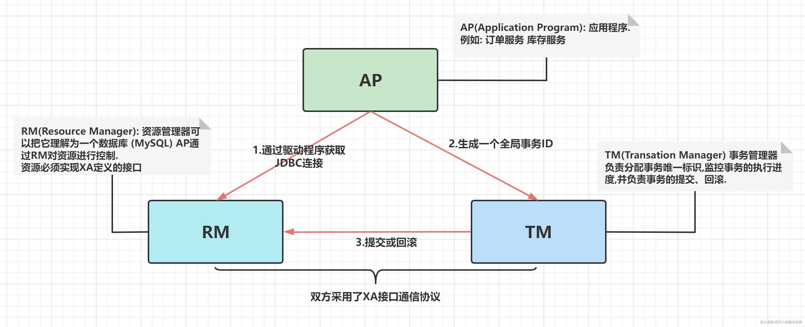

XA之所以需要引入事务管理器，是因为在分布式系统中，从理论上讲两台机器理论上无法达到一致的状态，需要引入一个单点进行协调。由全局事务管理器管理和协调的事务，可以跨越多个资源（数据库）和进程。

事务管理器用来保证所有的事务参与者都完成了准备工作(第一阶段)。如果事务管理器收到所有参与者都准备好的消息，就会通知所有的事务都可以提交了（第二阶段）。MySQL 在这个XA事务中扮演的是参与者的角色，而不是事务管理器。

#### 2.7.3.2 2PC模式 (强一致性)

**二阶提交协议**就是根据这一思想衍生出来的，将全局事务拆分为两个阶段来执行：

- 阶段一：准备阶段，各个本地事务完成本地事务的准备工作。
- 阶段二：执行阶段，各个本地事务根据上一阶段执行结果，进行提交或回滚。

这个过程中需要一个协调者（coordinator），还有事务的参与者（voter）。

**1）正常情况**

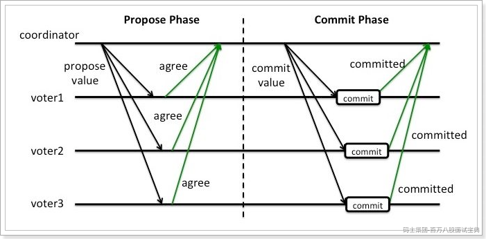

**投票阶段**：协调组询问各个事务参与者，是否可以执行事务。每个事务参与者执行事务，写入redo和undo日志，然后反馈事务执行成功的信息（agree）

**提交阶段**：协调组发现每个参与者都可以执行事务（agree），于是向各个事务参与者发出commit指令，各个事务参与者提交事务。

**2）异常情况**

当然，也有异常的时候：

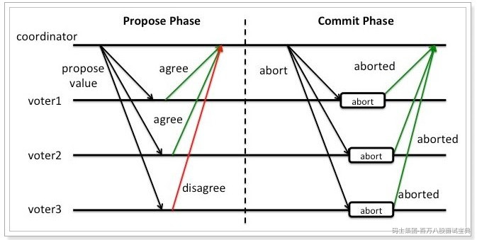

**投票阶段**：协调组询问各个事务参与者，是否可以执行事务。每个事务参与者执行事务，写入redo和undo日志，然后反馈事务执行结果，但只要有一个参与者返回的是Disagree，则说明执行失败。

**提交阶段**：协调组发现有一个或多个参与者返回的是Disagree，认为执行失败。于是向各个事务参与者发出abort指令，各个事务参与者回滚事务。

**3）二阶段提交的缺陷**

**缺陷1: 单点故障问题**

- 2PC的缺点在于不能处理fail-stop形式的节点failure. 比如下图这种情况.

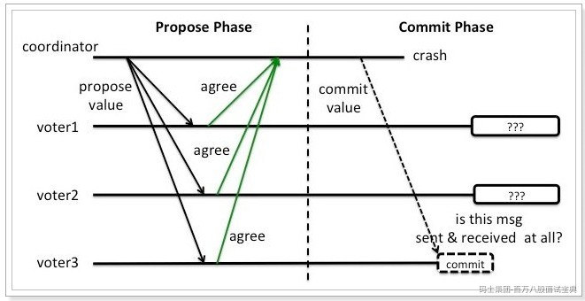

- 假设coordinator和voter3都在Commit这个阶段crash了, 而voter1和voter2没有收到commit消息. 这时候voter1和voter2就陷入了一个困境. 因为他们并不能判断现在是两个场景中的哪一种:
- (1)上轮全票通过然后voter3第一个收到了commit的消息并在commit操作之后crash了
- (2)上轮voter3反对所以干脆没有通过.

**缺陷2: 阻塞问题**

- 在准备阶段、提交阶段，每个事物参与者都会锁定本地资源，并等待其它事务的执行结果，阻塞时间较长，资源锁定时间太久，因此执行的效率就比较低了。

**3）二阶段提交的使用场景**

- 对事务有强一致性要求，对事务执行效率不敏感，并且不希望有太多代码侵入。

面对二阶段提交的上述缺点，后来又演变出了三阶段提交，但是依然没有完全解决阻塞和资源锁定的问题，而且引入了一些新的问题，因此实际使用的场景较少。

#### 2.7.3.3 TCC模式 (最终一致性)

TCC（Try-Confirm-Cancel）的概念，最早是由 Pat Helland 于 2007 年发表的一篇名为《Life beyond Distributed Transactions:an Apostate’s Opinion》的论文提出。

TCC 是服务化的两阶段编程模型，其 Try、Confirm、Cancel 3 个方法均由业务编码实现：

**1) TCC的基本原理**

它本质是一种补偿的思路。事务运行过程包括三个方法，

- Try：资源的检测和预留；
- Confirm：执行的业务操作提交；要求 Try 成功 Confirm 一定要能成功；
- Cancel：预留资源释放。

执行分两个阶段：

- 准备阶段（try）：资源的检测和预留；
- 执行阶段（confirm/cancel）：根据上一步结果，判断下面的执行方法。如果上一步中所有事务参与者都成功，则这里执行confirm。反之，执行cancel

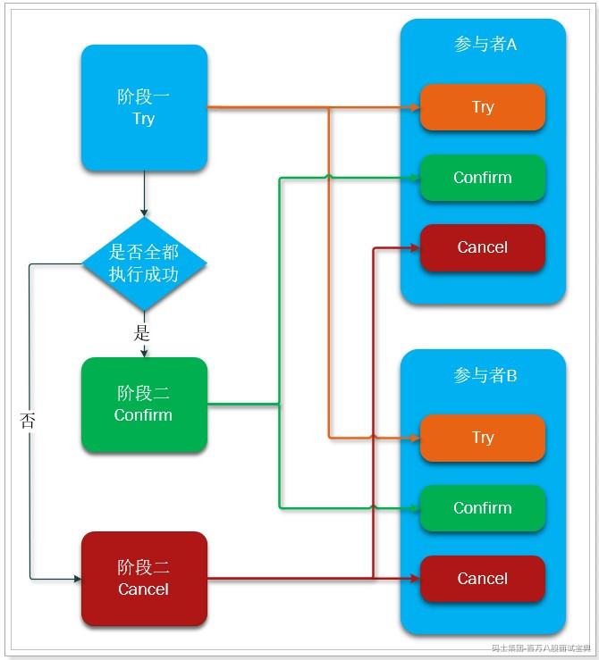

粗看似乎与两阶段提交没什么区别，但其实差别很大：

- try、confirm、cancel都是独立的事务，不受其它参与者的影响，不会阻塞等待它人
- try、confirm、cancel由程序员在业务层编写，锁粒度有代码控制

**2) TCC的具体实例**

我们以之前的下单业务中的扣减余额为例来看下三个不同的方法要怎么编写，假设账户A原来余额是100，需要余额扣减30元。如图：

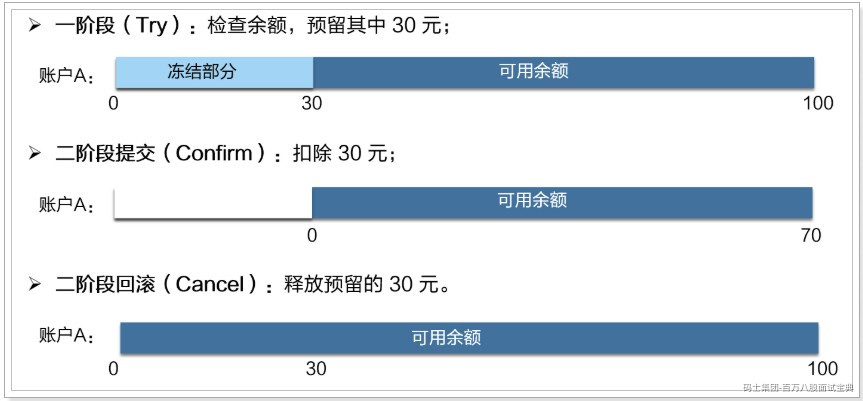

- 一阶段（Try）：余额检查，并冻结用户部分金额，此阶段执行完毕，事务已经提交

- 检查用户余额是否充足，如果充足，冻结部分余额
- 在账户表中添加冻结金额字段，值为30，余额不变

- 二阶段

- 提交（Confirm）：真正的扣款，把冻结金额从余额中扣除，冻结金额清空

- 修改冻结金额为0，修改余额为100-30 = 70元

- 补偿（Cancel）：释放之前冻结的金额，并非回滚

- 余额不变，修改账户冻结金额为0

**3) TCC模式的优势和缺点**

- 优势
- TCC执行的每一个阶段都会提交本地事务并释放锁，并不需要等待其它事务的执行结果。而如果其它事务执行失败，最后不是回滚，而是执行补偿操作。这样就避免了资源的长期锁定和阻塞等待，执行效率比较高，属于性能比较好的分布式事务方式。
- 缺点

- 代码侵入：需要人为编写代码实现try、confirm、cancel，代码侵入较多
- 开发成本高：一个业务需要拆分成3个步骤，分别编写业务实现，业务编写比较复杂
- 安全性考虑：cancel动作如果执行失败，资源就无法释放，需要引入重试机制，而重试可能导致重复执行，还要考虑重试时的幂等问题

**4) TCC使用场景**

- 对事务有一定的一致性要求（最终一致）
- 对性能要求较高
- 开发人员具备较高的编码能力和幂等处理经验

#### 2.7.3.4 消息队列模式（最终一致性）

消息队列的方案最初是由 eBay 提出，基于TCC模式，消息中间件可以基于 Kafka、RocketMQ 等消息队列。

此方案的核心是将分布式事务拆分成本地事务进行处理，将需要分布式处理的任务通过消息日志的方式来异步执行。消息日志可以存储到本地文本、数据库或MQ中间件，再通过业务规则人工发起重试。

**1) 事务的处理流程：**

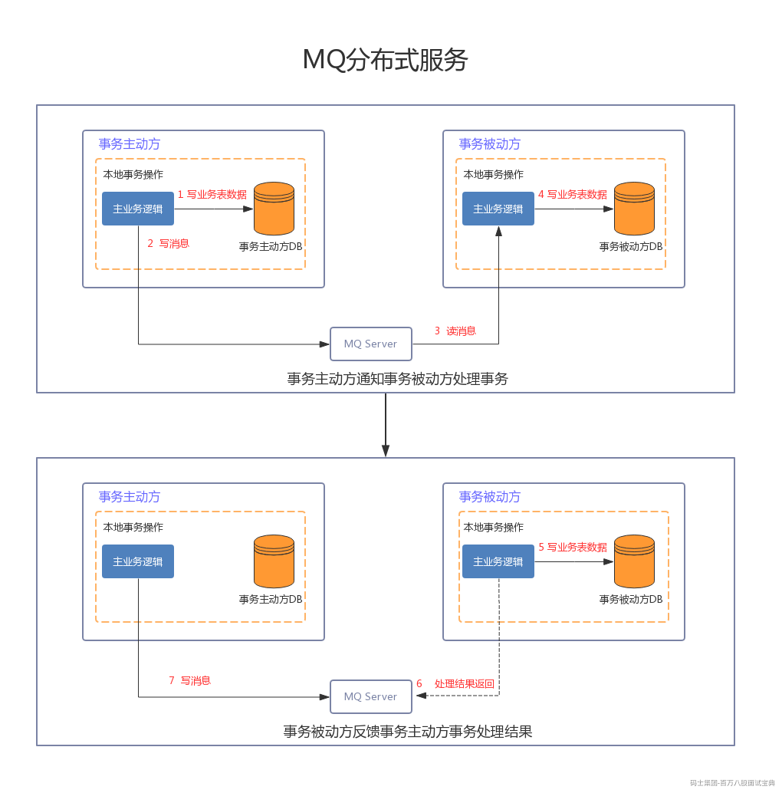

- 步骤1：事务主动方处理本地事务。
- 事务主动方在本地事务中处理业务更新操作和MQ写消息操作。例如: A用户给B用户转账,主动方先执行扣款操作
- 步骤 2：事务发起者A通过MQ将需要执行的事务信息发送给事务参与者B。例如: 告知被动方生增加银行卡金额
- 事务主动方主动写消息到MQ，事务消费方接收并处理MQ中的消息。
- 步骤 3：事务被动方通过MQ中间件，通知事务主动方事务已处理的消息，事务主动方根据反馈结果提交或回滚事务。例如: 订单生成成功,通知主动方法,主动放即可以提交.

为了数据的一致性，当流程中遇到错误需要重试，容错处理规则如下：

- 当步骤 1 处理出错，事务回滚，相当于什么都没发生。
- 当步骤 2 处理出错，由于未处理的事务消息还是保存在事务发送方，可以重试或撤销本地业务操作。
- 如果事务被动方消费消息异常，需要不断重试，业务处理逻辑需要保证幂等。
- 如果是事务被动方业务上的处理失败，可以通过MQ通知事务主动方进行补偿或者事务回滚。

那么问题来了，我们如何保证消息发送一定成功？如何保证消费者一定能收到消息？

**2) 本地消息表**

为了避免消息发送失败或丢失，我们可以把消息持久化到数据库中。实现时有简化版本和解耦合版本两种方式。

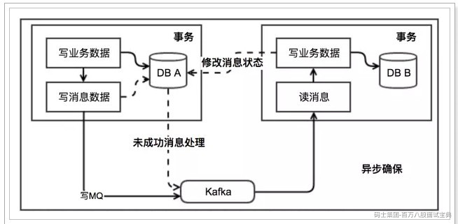

- 事务发起者：

- 开启本地事务
- 执行事务相关业务
- 发送消息到MQ
- 把消息持久化到数据库，标记为已发送
- 提交本地事务

- 事务接收者：

- 接收消息
- 开启本地事务
- 处理事务相关业务
- 修改数据库消息状态为已消费
- 提交本地事务

- 额外的定时任务

- 定时扫描表中超时未消费消息，重新发送

**3) 消息事务的优缺点**

总结上面的几种模型，消息事务的优缺点如下：

- 优点：

- 业务相对简单，不需要编写三个阶段业务
- 是多个本地事务的结合，因此资源锁定周期短，性能好

- 缺点：

- 代码侵入
- 依赖于MQ的可靠性
- 消息发起者可以回滚，但是消息参与者无法引起事务回滚
- 事务时效性差，取决于MQ消息发送是否及时，还有消息参与者的执行情况

针对事务无法回滚的问题，有人提出说可以再事务参与者执行失败后，再次利用MQ通知消息服务，然后由消息服务通知其他参与者回滚。那么，恭喜你，你利用MQ和自定义的消息服务再次实现了2PC 模型，又造了一个大轮子

#### 2.7.3.5 AT模式 (最终一致性)

2019年 1 月份，Seata 开源了 AT 模式。AT 模式是一种无侵入的分布式事务解决方案。可以看做是对TCC或者二阶段提交模型的一种优化，解决了TCC模式中的代码侵入、编码复杂等问题。

在 AT 模式下，用户只需关注自己的“业务 SQL”，用户的 “业务 SQL” 作为一阶段，Seata 框架会自动生成事务的二阶段提交和回滚操作。

可以参考Seata的[官方文档](https://seata.io/zh-cn/docs/dev/mode/at-mode.html)。

**1) AT模式基本原理**

先来看一张流程图：

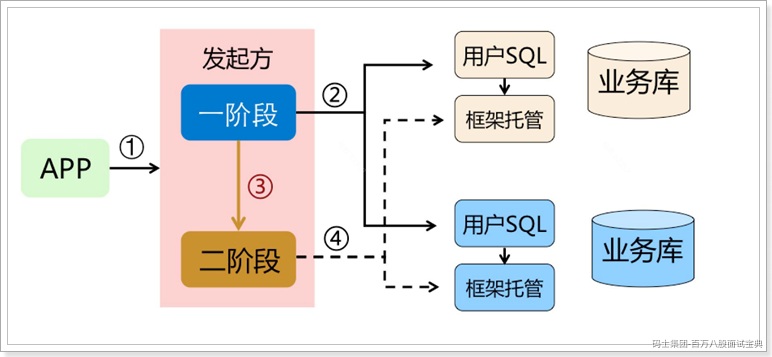

有没有感觉跟TCC的执行很像，都是分两个阶段：

- 一阶段：执行本地事务，并返回执行结果
- 二阶段：根据一阶段的结果，判断二阶段做法：提交或回滚

但AT模式底层做的事情可完全不同，而且第二阶段根本不需要我们编写，全部有Seata自己实现了。也就是说：我们写的**代码与本地事务时代码一样**，无需手动处理分布式事务。

那么，AT模式如何实现无代码侵入，如何帮我们自动实现二阶段代码的呢？

**一阶段**

- 在一阶段，Seata 会拦截“业务 SQL”，首先解析 SQL 语义，找到“业务 SQL”要更新的业务数据，在业务数据被更新前，将其保存成“before image”，然后执行“业务 SQL”更新业务数据，在业务数据更新之后，再将其保存成“after image”，最后获取全局行锁，**提交事务**。以上操作全部在一个数据库事务内完成，这样保证了一阶段操作的原子性。
- 这里的before image和after image类似于数据库的undo和redo日志，但其实是用数据库模拟的。

update t\_stock set stock = stock - 2 where id = 1

select \* from t\_stock where id = 1 ,保存元快照 before image ,类似undo日志.

放行执行真实SQL,执行完成,再次查询,获取到最新的库存数据,再将数据保存到镜像after image 类似redo.

提交业务如果成功,就清楚快照信息,失败,则根据redo 中的数据与数据库的数据进行对比,如果一直就回滚,如果不一致 出现脏数据,就需要人工介入.

AT模式最重要的一点就是 程序员只需要关注业务处理的本身即可,不需要考虑回滚补偿等问题.代码写的跟以前一模一杨.

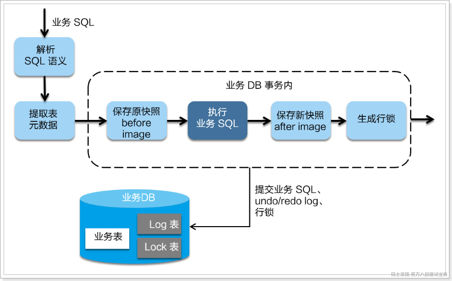

**二阶段提交**

- 二阶段如果是提交的话，因为“业务 SQL”在一阶段已经提交至数据库， 所以 Seata 框架只需将一阶段保存的快照数据和行锁删掉，完成数据清理即可。

**二阶段回滚**

- 二阶段如果是回滚的话，Seata 就需要回滚一阶段已经执行的“业务 SQL”，还原业务数据。回滚方式便是用“before image”还原业务数据；但在还原前要首先要校验脏写，对比“数据库当前业务数据”和 “after image”，如果两份数据完全一致就说明没有脏写，可以还原业务数据，如果不一致就说明有脏写，出现脏写就需要转人工处理。

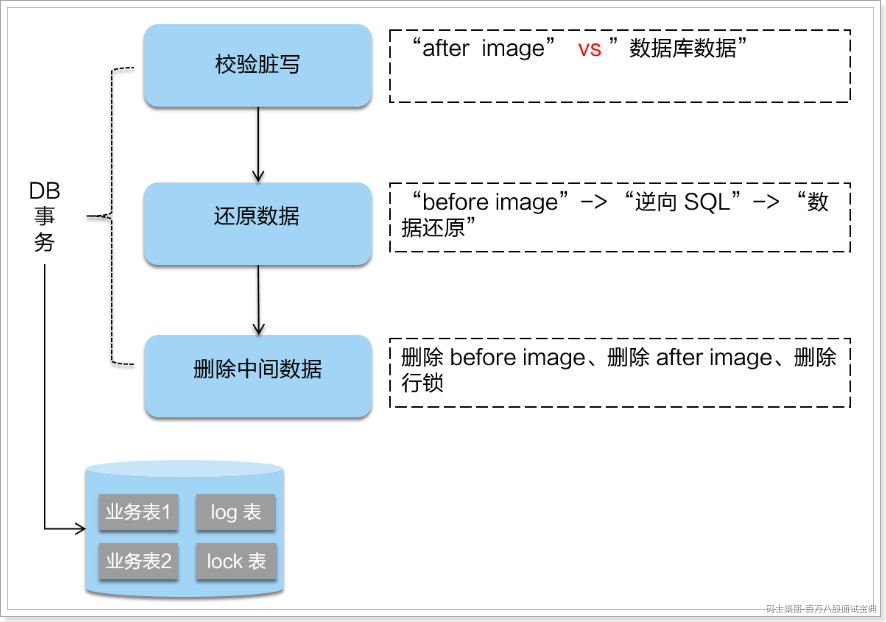

不过因为有全局锁机制，所以可以降低出现脏写的概率。

AT 模式的一阶段、二阶段提交和回滚均由 Seata 框架自动生成，用户只需编写“业务 SQL”，便能轻松接入分布式事务，AT 模式是一种对业务无任何侵入的分布式事务解决方案。

**AT模式优缺点**

优点：

- 与2PC相比：每个分支事务都是独立提交，不互相等待，减少了资源锁定和阻塞时间
- 与TCC相比：二阶段的执行操作全部自动化生成，无代码侵入，开发成本低

缺点：

- 与TCC相比，需要动态生成二阶段的反向补偿操作，执行性能略低于TCC

#### 2.7.3.6 Saga模式（最终一致性）

Saga 模式是 Seata 即将开源的长事务解决方案，将由蚂蚁金服主要贡献。

其理论基础是Hector & Kenneth 在1987年发表的论文[Sagas](https://microservices.io/patterns/data/saga.html)。

Seata官网对于Saga的指南：<https://seata.io/zh-cn/docs/user/saga.html>

**1) 基本模型**

在分布式事务场景下，我们把一个Saga分布式事务看做是一个由多个本地事务组成的事务，每个本地事务都有一个与之对应的补偿事务。在Saga事务的执行过程中，如果某一步执行出现异常，Saga事务会被终止，同时会调用对应的补偿事务完成相关的恢复操作，这样保证Saga相关的本地事务要么都是执行成功，要么通过补偿恢复成为事务执行之前的状态。（自动反向补偿机制）。

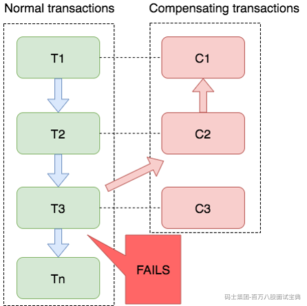

每个 Ti 都有对应的幂等补偿动作 Ci，补偿动作用于撤销 Ti 造成的结果。

Saga是一种补偿模式，它定义了两种补偿策略：

- 向前恢复（forward recovery）：对应于上面第一种执行顺序，发生失败进行重试，适用于必须要成功的场景(一定会成功)。
- 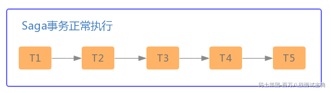
- 向后恢复（backward recovery）：对应于上面提到的第二种执行顺序，发生错误后撤销掉之前所有成功的子事务，使得整个 Saga 的执行结果撤销。
- 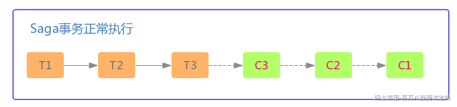

**2) 适用场景**

- 业务流程长、业务流程多
- 参与者包含其它公司或遗留系统服务，无法提供 TCC 模式要求的三个接口

**3) 优势**

- 一阶段提交本地事务，无锁，高性能
- 事件驱动架构，参与者可异步执行，高吞吐
- 补偿服务易于实现

**3) 缺点**

- 不保证隔离性（应对方案见[用户文档](https://seata.io/zh-cn/docs/user/saga.html)）

### 2.7.4 Sharding-JDBC分布式事务实战

#### 2.7.4.1 Sharding-JDBC分布式事务介绍

**1) 分布式内容回顾**

- **本地事务**

- 本地事务提供了 ACID 事务特性。基于本地事务，为了保证数据的一致性，我们先开启一个事务后，才可以执行数据操作，最后提交或回滚就可以了。
- 在分布式环境下，事情就会变得比较复杂。假设系统中存在多个独立的数据库，为了确保数据在这些独立的数据库中保持一致，我们需要把这些数据库纳入同一个事务中。这时本地事务就无能为力了，我们需要使用分布式事务。

- **分布式事务**

- 业界关于如何实现分布式事务也有一些通用的实现机制，例如支持两阶段提交的 XA 协议以及以 Saga 为代表的柔性事务。针对不同的实现机制，也存在一些供应商和开发工具。
- 因为这些开发工具在使用方式上和实现原理上都有较大的差异性，所以开发人员的一大诉求在于，希望能有一套统一的解决方案能够屏蔽这些差异。同时，我们也希望这种解决方案能够提供友好的系统集成性。

**2) ShardingJDBC事务**

ShardingJDBC支持的分布式事务方式有三种 LOCAL, XA , BASE，这三种事务实现方式都是采用的对代码无侵入的方式实现的

//事务类型枚举类

public enum TransactionType {

//除本地事务之外，还提供针对分布式事务的两种实现方案，分别是 XA 事务和柔性事务

LOCAL, XA, BASE

}

- **LOCAL本地事务**

- 这种方式实际上是将事务交由数据库自行管理，可以用Spring的@Transaction注解来配置。这种方式不具备分布式事务的特性。

- **XA 事务**

- XA 事务提供基于两阶段提交协议的实现机制。所谓两阶段提交，顾名思义分成两个阶段，一个是准备阶段，一个是执行阶段。在准备阶段中，协调者发起一个提议，分别询问各参与者是否接受。在执行阶段，协调者根据参与者的反馈，提交或终止事务。如果参与者全部同意则提交，只要有一个参与者不同意就终止。
- 目前，业界在实现 XA 事务时也存在一些主流工具库，包括 Atomikos、Narayana 和 Bitronix。ShardingSphere 对这三种工具库都进行了集成，并默认使用 Atomikos 来完成两阶段提交。

- **BASE 事务**

- XA 事务是典型的强一致性事务，也就是完全遵循事务的 ACID 设计原则。与 XA 事务这种“刚性”不同，柔性事务则遵循 BASE 设计理论，追求的是最终一致性。这里的 BASE 来自基本可用（Basically Available）、软状态（Soft State）和最终一致性（Eventual Consistency）这三个概念。
- 关于如何实现基于 BASE 原则的柔性事务，业界也存在一些优秀的框架，例如阿里巴巴提供的 Seata。ShardingSphere 内部也集成了对 Seata 的支持。当然，我们也可以根据需要，集成其他分布式事务类开源框架.

**2) 分布式事务模式整合流程**

ShardingSphere 作为一款分布式数据库中间件，势必要考虑分布式事务的实现方案。在设计上，ShardingSphere整合了XA、Saga和Seata模式后，为分布式事务控制提供了极大的便利，我们可以在应用程序编程时，采用以下统一模式进行使用。

1. 引入maven依赖

<!--XA模式-->

<dependency>

<groupId>org.apache.shardingsphere</groupId>

<artifactId>sharding-transaction-xa-core</artifactId>

<version>4.0.0-RC2</version>

</dependency>

1. JAVA编码方式设置事务类型

@ShardingSphereTransactionType(TransactionType.XA) // Sharding-jdbc柔性事务

@ShardingSphereTransactionType(TransactionType.BASE) // Sharding-jdbc柔性事务

1. 参数配置

- ShardingSphere默认的XA事务管理器为Atomikos，通过在项目的classpath中添加jta.properties来定制化Atomikos配置项。
- XA模式具体的配置规则如下：
- #指定是否启动磁盘日志，默认为true。在生产环境下一定要保证为true，否则数据的完整性无法保证  
  com.atomikos.icatch.enable\_logging=true  
  #JTA/XA资源是否应该自动注册  
  com.atomikos.icatch.automatic\_resource\_registration=true  
  #JTA事务的默认超时时间，默认为10000ms  
  com.atomikos.icatch.default\_jta\_timeout=10000  
  #事务的最大超时时间，默认为300000ms。这表示事务超时时间由 UserTransaction.setTransactionTimeout()较大者决定。4.x版本之后，指定为0的话则表示不设置超时时间  
  com.atomikos.icatch.max\_timeout=300000  
  #指定在两阶段提交时，是否使用不同的线程(意味着并行)。3.7版本之后默认为false，更早的版本默认为true。如果为false，则提交将按照事务中访问资源的顺序进行。  
  com.atomikos.icatch.threaded\_2pc=false  
  #指定最多可以同时运行的事务数量，默认值为50，负数表示没有数量限制。在调用 UserTransaction.begin()方法时，可能会抛出一个”Max number of active transactions reached”异常信息，表示超出最大事务数限制  
  com.atomikos.icatch.max\_actives=50  
  #是否支持subtransaction，默认为true  
  com.atomikos.icatch.allow\_subtransactions=true  
  #指定在可能的情况下，否应该join 子事务(subtransactions)，默认值为true。如果设置为false，对于有关联的不同subtransactions，不会调用XAResource.start(TM\_JOIN)  
  com.atomikos.icatch.serial\_jta\_transactions=true  
  #指定JVM关闭时是否强制(force)关闭事务管理器，默认为false  
  com.atomikos.icatch.force\_shutdown\_on\_vm\_exit=false  
  #在正常关闭(no-force)的情况下，应该等待事务执行完成的时间，默认为Long.MAX\_VALUE  
  com.atomikos.icatch.default\_max\_wait\_time\_on\_shutdown=9223372036854775807  
    
  ========= 日志记录配置=======  
  #事务日志目录，默认为./。  
  com.atomikos.icatch.log\_base\_dir=./  
  #事务日志文件前缀，默认为tmlog。事务日志存储在文件中，文件名包含一个数字后缀，日志文件以.log为扩展名，如tmlog1.log。遇到checkpoint时，新的事务日志文件会被创建，数字增加。  
  com.atomikos.icatch.log\_base\_name=tmlog  
  #指定两次checkpoint的时间间隔，默认为500  
  com.atomikos.icatch.checkpoint\_interval=500  
    
  =========日志恢复配置=============  
  #指定在多长时间后可以清空无法恢复的事务日志(orphaned)，默认86400000ms  
  com.atomikos.icatch.forget\_orphaned\_log\_entries\_delay=86400000  
  #指定两次恢复扫描之间的延迟时间。默认值为与com.atomikos.icatch.default\_jta\_timeout相同  
  com.atomikos.icatch.recovery\_delay=${com.atomikos.icatch.default\_jta\_timeout}  
  #提交失败时，再抛出一个异常之前，最多可以重试几次，默认值为5  
  com.atomikos.icatch.oltp\_max\_retries=5  
  #提交失败时，每次重试的时间间隔，默认10000ms  
  com.atomikos.icatch.oltp\_retry\_interval=10000

#### 2.7.4.2 环境与配置文件准备

在今天的案例中，我们将演示如何在分库环境下实现分布式事务.首先先创建出数据库与表,如下图:

**1) 创建数据库及表**

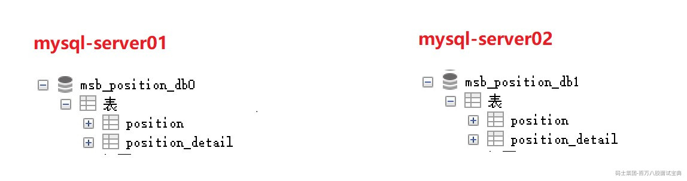

在msb\_position\_db0 和 msb\_position\_db1 中分别创建职位表和职位描述表.

-- 职位表

CREATE TABLE `position` (

`Id` bigint(11) NOT NULL AUTO\_INCREMENT,

`name` varchar(256) DEFAULT NULL,

`salary` varchar(50) DEFAULT NULL,

`city` varchar(256) DEFAULT NULL,

PRIMARY KEY (`Id`)

) ENGINE=InnoDB DEFAULT CHARSET=utf8mb4;

-- 职位描述表

CREATE TABLE `position\_detail` (

`Id` bigint(11) NOT NULL AUTO\_INCREMENT,

`pid` bigint(11) NOT NULL DEFAULT '0',

`description` text,

PRIMARY KEY (`Id`)

) ENGINE=InnoDB DEFAULT CHARSET=utf8mb4;

**2) 创建一个maven项目**

引入依赖

<parent>

<groupId>org.springframework.boot</groupId>

<artifactId>spring-boot-starter-parent</artifactId>

<version>2.2.5.RELEASE</version>

<relativePath/> <!-- lookup parent from repository -->

</parent>

<properties>

<java.version>1.8</java.version>

</properties>

<dependencies>

<dependency>

<groupId>org.springframework.boot</groupId>

<artifactId>spring-boot-starter-test</artifactId>

</dependency>

<dependency>

<groupId>org.springframework.boot</groupId>

<artifactId>spring-boot-starter</artifactId>

</dependency>

<dependency>

<groupId>org.springframework.boot</groupId>

<artifactId>spring-boot-starter-web</artifactId>

</dependency>

<!-- mysql -->

<dependency>

<groupId>mysql</groupId>

<artifactId>mysql-connector-java</artifactId>

<scope>runtime</scope>

</dependency>

<dependency>

<groupId>org.projectlombok</groupId>

<artifactId>lombok</artifactId>

<optional>true</optional>

</dependency>

<!-- mybatis plus 代码生成器 -->

<dependency>

<groupId>org.mybatis.spring.boot</groupId>

<artifactId>mybatis-spring-boot-starter</artifactId>

<version>2.1.3</version>

</dependency>

<dependency>

<groupId>com.baomidou</groupId>

<artifactId>mybatis-plus-boot-starter</artifactId>

<version>3.4.1</version>

</dependency>

<dependency>

<groupId>com.baomidou</groupId>

<artifactId>mybatis-plus-generator</artifactId>

<version>3.4.1</version>

</dependency>

<!-- ShardingSphere -->

<dependency>

<groupId>org.apache.shardingsphere</groupId>

<artifactId>sharding-jdbc-spring-boot-starter</artifactId>

<version>4.1.0</version>

</dependency>

<dependency>

<groupId>org.apache.shardingsphere</groupId>

<artifactId>sharding-core-common</artifactId>

<version>4.1.0</version>

</dependency>

<!-- commons-lang3 -->

<dependency>

<groupId>org.apache.commons</groupId>

<artifactId>commons-lang3</artifactId>

<version>3.10</version>

</dependency>

<dependency>

<groupId>cn.hutool</groupId>

<artifactId>hutool-all</artifactId>

<version>5.5.8</version>

</dependency>

<dependency>

<groupId>com.github.xiaoymin</groupId>

<artifactId>knife4j-spring-boot-starter</artifactId>

<version>2.0.5</version>

</dependency>

<dependency>

<groupId>com.google.guava</groupId>

<artifactId>guava</artifactId>

<version>20.0</version>

<scope>compile</scope>

</dependency>

<!-- XA模式-->

<dependency>

<groupId>org.apache.shardingsphere</groupId>

<artifactId>sharding-transaction-xa-core</artifactId>

<version>4.1.0</version>

</dependency>

</dependencies>

<build>

<plugins>

<plugin>

<groupId>org.springframework.boot</groupId>

<artifactId>spring-boot-maven-plugin</artifactId>

</plugin>

</plugins>

</build>

**3) 配置文件**

分库环境下实现分布式事务,配置文件

# 应用名称

spring.application.name=sharding-jdbc-trans

# 打印SQl

spring.shardingsphere.props.sql-show=true

# 端口

server.port=8081

#===============数据源配置

#配置真实的数据源

spring.shardingsphere.datasource.names=db0,db1

#数据源1

spring.shardingsphere.datasource.db0.type=com.zaxxer.hikari.HikariDataSource

spring.shardingsphere.datasource.db0.driver-class-name=com.mysql.jdbc.Driver

spring.shardingsphere.datasource.db0.jdbc-url=jdbc:mysql://192.168.52.10:3306/msb\_position\_db0?useUnicode=true&characterEncoding=utf-8&useSSL=false

spring.shardingsphere.datasource.db0.username=root

spring.shardingsphere.datasource.db0.password=QiDian@666

#数据源2

spring.shardingsphere.datasource.db1.type=com.zaxxer.hikari.HikariDataSource

spring.shardingsphere.datasource.db1.driver-class-name=com.mysql.jdbc.Driver

spring.shardingsphere.datasource.db1.jdbc-url=jdbc:mysql://192.168.52.11:3306/msb\_position\_db1?useUnicode=true&characterEncoding=utf-8&useSSL=false

spring.shardingsphere.datasource.db1.username=root

spring.shardingsphere.datasource.db1.password=QiDian@666

#分库策略

spring.shardingsphere.sharding.tables.position.database-strategy.inline.sharding-column=id

spring.shardingsphere.sharding.tables.position.database-strategy.inline.algorithm-expression=db$->{id % 2}

spring.shardingsphere.sharding.tables.position\_detail.database-strategy.inline.sharding-column=pid

spring.shardingsphere.sharding.tables.position\_detail.database-strategy.inline.algorithm-expression=db$->{pid % 2}

#分布式主键生成

spring.shardingsphere.sharding.tables.position.key-generator.column=id

spring.shardingsphere.sharding.tables.position.key-generator.type=SNOWFLAKE

spring.shardingsphere.sharding.tables.position\_detail.key-generator.column=id

spring.shardingsphere.sharding.tables.position\_detail.key-generator.type=SNOWFLAKE

#### 2.7.4.3 案例实现

**1) 启动类**

@EnableTransactionManagement //开启声明式事务

@SpringBootApplication

@MapperScan("com.mashibing.mapper")

public class ShardingTransApplication {

public static void main(String[] args) {

SpringApplication.run(ShardingTransApplication.class,args);

}

}

**2) entity**

@TableName("position")

@Data

public class Position {

@TableId(type = IdType.AUTO)

private long id;

private String name;

private String salary;

private String city;

}

@TableName("position\_detail")

@Data

public class PositionDetail {

@TableId(type = IdType.AUTO)

private long id;

private long pid;

private String description;

}

**3) mapper**

@Repository

public interface PositionMapper extends BaseMapper<Position> {

}

@Repository

public interface PositionDetailMapper extends BaseMapper<PositionDetail> {

}

**4) controller**

@RestController

@RequestMapping("/position")

public class PositionController {

@Autowired

private PositionMapper positionMapper;

@Autowired

private PositionDetailMapper positionDetailMapper;

@RequestMapping("/show")

public String show(){

return "SUCCESS";

}

@RequestMapping("/add")

public String savePosition(){

for (int i=1; i<=3; i++){

Position position = new Position();

position.setName("root"+i);

position.setSalary("1000000");

position.setCity("beijing");

positionMapper.insert(position);

if (i==3){

throw new RuntimeException("人为制造异常");

}

PositionDetail positionDetail = new PositionDetail();

positionDetail.setPid(position.getId());

positionDetail.setDescription("root" + i);

positionDetailMapper.insert(positionDetail);

}

return "SUCCESS";

}

}

#### 2.7.4.4 案例测试

**测试1: 访问在PositionController的add方法 , 注意: 方法不添加任何事务控制**

@RequestMapping("/add")

public String savePosition()

http://localhost:8081/position/add

提示出现: 人为制造异常

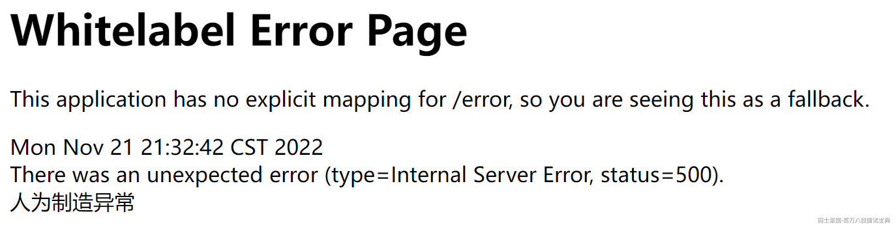

检查数据库, 会发现数据库的数据插入了,但是不是完整的

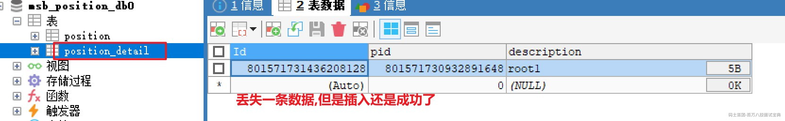

**测试2: 在add 方法上添加@Transactional本地事务控制,继续测试**

@Transactional

@RequestMapping("/add")

public String savePosition()

查看数据库发现,使用@Transactional注解 ,竟然实现了跨库插入数据, 出现异常也能回滚.

@Transactional注解可以解决分布式事务问题, 这其实是个假象

接下来我们说一下为什么@Transactional不能解决分布式事务

问题1: 为什么会出现回滚操作 ?

- Sharding-JDBC中的本地事务在以下两种情况是完全支持的：

- 支持非跨库事务，比如仅分表、在单库中操作
- **支持因逻辑异常导致的跨库事务(这点非常重要)**，比如上述的操作，跨两个库插入数据，插入完成后抛出异常

- 本地事务不支持的情况：

- 不支持因网络、硬件异常导致的跨库事务；例如：同一事务中，跨两个库更新，更新完毕后、未提交之前，第一个库宕机，则只有第二个库数据提交.
- 对于因网络、硬件异常导致的跨库事务无法支持很好理解，在分布式事务中无论是两阶段还是三阶段提交都是直接或者间接满足以下两个条件：
- 1.有一个事务协调者 2.事务日志记录 本地事务并未满足上述条件，自然是无法支持

为什么逻辑异常导致的跨库事务能够支持？

- 首先Sharding-JDBC中的一条SQL会经过**改写**，拆分成**不同数据源**的SQL，比如一条select语句，会按照其中**分片键**拆分成对应数据源的SQL，然后在不同数据源中的执行，最终会提交或者回滚.
- 下面是Sharding-JDBC自定义实现的事务控制类ShardingConnection 的类关系图
- 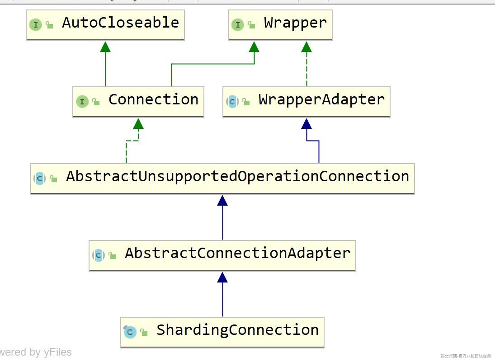

可以看到ShardingConnection继承了java.sql.Connection,Connection是数据库连接对象,也可以对数据库的本地事务进行管理.

找到ShardingConnection的rollback方法

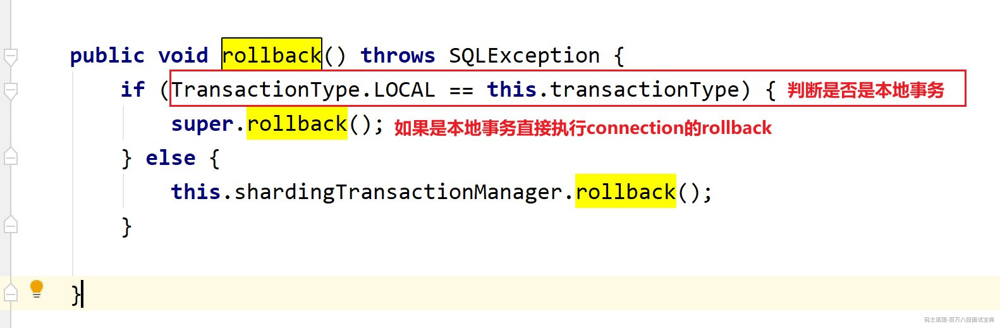

rollback的方法中区分了**本地事务**和**分布式事务**，如果是本地事务将调用父类的rollback方法，如下：

ShardingConnection父类：AbstractConnectionAdapter#rollback

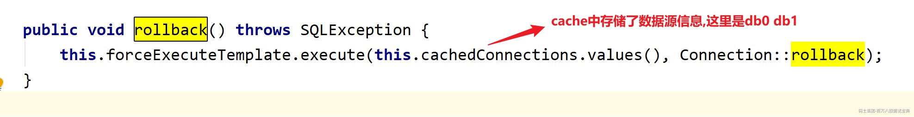

ForceExecuteTemplate#execute()方法内部就是遍历**数据源**去执行对应的rollback方法

public void execute(Collection<T> targets, ForceExecuteCallback<T> callback) throws SQLException {

Collection<SQLException> exceptions = new LinkedList();

Iterator var4 = targets.iterator();

while(var4.hasNext()) {

Object each = var4.next();

try {

callback.execute(each);

} catch (SQLException var7) {

exceptions.add(var7);

}

}

this.throwSQLExceptionIfNecessary(exceptions);

}

总结: 依靠Spring的本地事务@Transactional是无法保证跨库的分布式事务

rollback 在各个数据源中回滚且未记录任何事务日志，因此在非硬件、网络的情况下都是可以正常回滚的，一旦因为网络、硬件故障，可能导致某个数据源rollback失败，这样即使程序恢复了正常，也无undo日志继续进行rollback，因此这里就造成了数据不一致了。

**3)测试3: 实现XA事务**

首先要在项目中导入对应的依赖包

<!--XA模式-->

<dependency>

<groupId>org.apache.shardingsphere</groupId>

<artifactId>sharding-transaction-xa-core</artifactId>

<version>4.1.0</version>

</dependency>

我们知道，ShardingSphere 提供的事务类型有三种，分别是 LOCAL、XA 和 BASE，默认使用的是 LOCAL。所以如果需要用到分布式事务，需要在业务方法上显式的添加这个注解 @ShardingTransactionType(TransactionType.XA)

@ShardingTransactionType(TransactionType.XA)

@RequestMapping("/add")

public String savePosition(

**执行测试代码,结果是数据库的插入全部被回滚了.**

## 2.8 ShardingProxy实战

Sharding-Proxy是ShardingSphere的第二个产品，定位为透明化的数据库代理端，提供封装了数据库二进制协议的服务端版本，用于完成对异构语言的支持。 目前先提供MySQL版本，它可以使用任何兼容MySQL协议的访问客户端(如：MySQL Command Client, MySQL Workbench等操作数据，对DBA更加友好。

- 向应用程序完全透明，可直接当做MySQL使用
- 适用于任何兼容MySQL协议的客户端

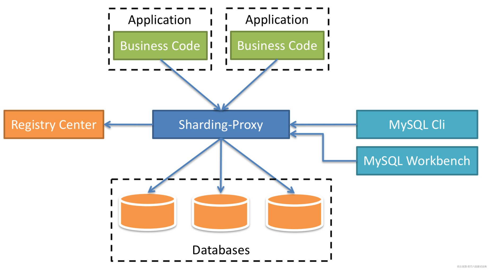

### 2.8.1 使用二进制发布包安装ShardingSphere-Proxy

目前 ShardingSphere-Proxy 提供了 3 种获取方式：

- 二进制发布包
- Docker
- Helm

这里我们使用二进制包的形式安装ShardingProxy, 这种安装方式既可以Linux系统运行，又可以在windows系统运行,步骤如下:

**1) 解压二进制包**

- 官方文档:

<https://shardingsphere.apache.org/document/5.1.1/cn/user-manual/shardingsphere-proxy/startup/bin/>

- 安装包下载

<https://archive.apache.org/dist/shardingsphere/5.1.1/>

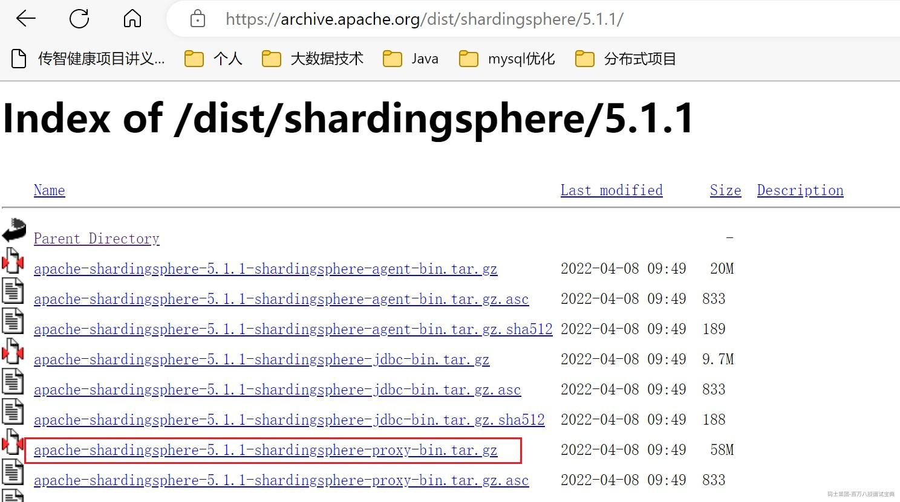

- 解压
- windows：使用解压软件解压文件
- Linux：将文件上传至/opt目录，并解压
- tar -zxvf apache-shardingsphere-5.1.1-shardingsphere-proxy-bin.tar.gz

**2) 上传MySQL驱动**

mysql-connector-java-8.0.22.jar ,将MySQl驱动放至ext-lib目录 ,该ext-lib目录需要自行创建,创建位置如下图:

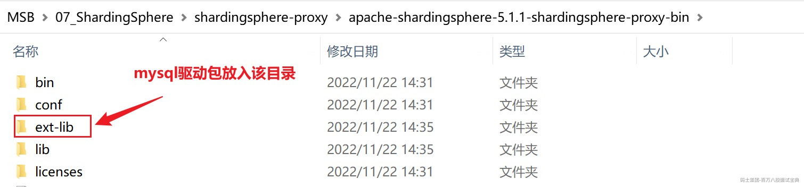

**3) 修改配置conf/server.yaml**

# 配置用户信息 用户名密码,赋予管理员权限

rules:

- !AUTHORITY

users:

- root@%:root

provider:

type: ALL\_PRIVILEGES\_PERMITTED

#开启SQL打印

props:

sql-show: true

**4) 启动ShardingSphere-Proxy**

- Linux 操作系统请运行 bin/start.sh
- Windows 操作系统请运行 bin/start.bat
- 指定端口号和配置文件目录：bin/start.bat ${proxy\_port} ${proxy\_conf\_directory}

**5) 远程连接ShardingSphere-Proxy**

- 远程访问,默认端口3307

mysql -h192.168.52.12 -P3307 -uroot -p

**6) 访问测试**

show databases;

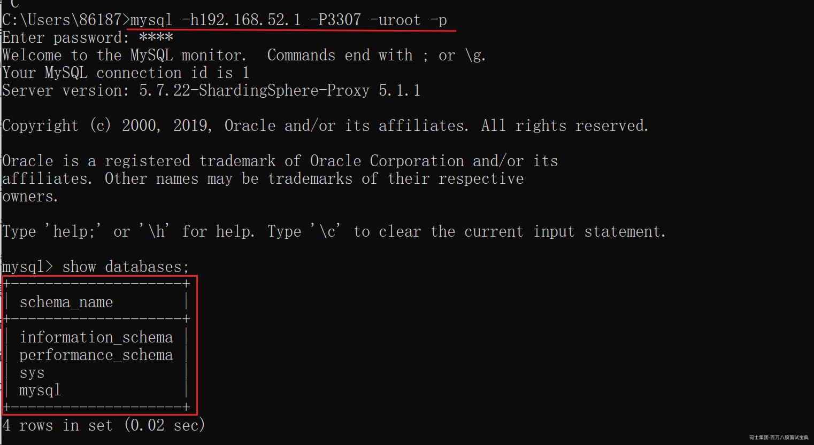

### 2.8.2 proxy实现读写分离

**1) 修改配置config-readwrite-splitting.yaml**

#schemaName用来指定->逻辑表名

schemaName: readwrite\_splitting\_db

dataSources:

write\_ds:

url: jdbc:mysql://192.168.52.10:3306/test\_rw?serverTimezone=UTC&useSSL=false&characterEncoding=utf-8

username: root

password: QiDian@666

connectionTimeoutMilliseconds: 30000

idleTimeoutMilliseconds: 60000

maxLifetimeMilliseconds: 1800000

maxPoolSize: 50

minPoolSize: 1

read\_ds\_0:

url: jdbc:mysql://192.168.52.11:3306/test\_rw?serverTimezone=UTC&useSSL=false&characterEncoding=utf-8

username: root

password: QiDian@666

connectionTimeoutMilliseconds: 30000

idleTimeoutMilliseconds: 60000

maxLifetimeMilliseconds: 1800000

maxPoolSize: 50

minPoolSize: 1

rules:

- !READWRITE\_SPLITTING

dataSources:

readwrite\_ds:

type: Static

props:

write-data-source-name: write\_ds

read-data-source-names: read\_ds\_0

**2) 命令行测试**

C:\Users\86187>mysql -h192.168.52.12 -P3307 -uroot -p

mysql> show databases;

+------------------------+

| schema\_name |

+------------------------+

| readwrite\_splitting\_db |

| mysql |

| information\_schema |

| performance\_schema |

| sys |

+------------------------+

5 rows in set (0.01 sec)

mysql> use readwrite\_splitting\_db;

Database changed

mysql> show tables;

+----------------------------------+------------+

| Tables\_in\_readwrite\_splitting\_db | Table\_type |

+----------------------------------+------------+

| users | BASE TABLE |

| products | BASE TABLE |

+----------------------------------+------------+

2 rows in set (0.01 sec)

mysql> select \* from users;

+----+-------+------+

| id | NAME | age |

+----+-------+------+

| 2 | user2 | 21 |

| 3 | user3 | 22 |

+----+-------+------+

2 rows in set (0.02 sec)

**3) 动态查看日志**

tail -f /opt/apache-shardingsphere-5.1.1-shardingsphere-proxy-bin/logs/stdout.log

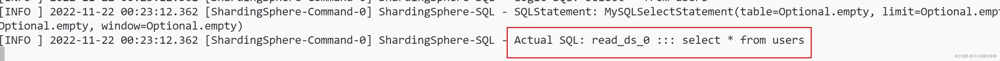

### 2.8.3 使用应用程序连接proxy

**1) 创建项目**

项目名称: sharding-proxy-test

Spring脚手架: <http://start.aliyun.com>

**2) 添加依赖**

<dependencies>

<dependency>

<groupId>org.springframework.boot</groupId>

<artifactId>spring-boot-starter-web</artifactId>

</dependency>

<dependency>

<groupId>mysql</groupId>

<artifactId>mysql-connector-java</artifactId>

<scope>runtime</scope>

</dependency>

<dependency>

<groupId>com.baomidou</groupId>

<artifactId>mybatis-plus-boot-starter</artifactId>

<version>3.3.1</version>

</dependency>

<dependency>

<groupId>org.projectlombok</groupId>

<artifactId>lombok</artifactId>

<optional>true</optional>

</dependency>

<dependency>

<groupId>org.springframework.boot</groupId>

<artifactId>spring-boot-starter-test</artifactId>

<scope>test</scope>

<exclusions>

<exclusion>

<groupId>org.junit.vintage</groupId>

<artifactId>junit-vintage-engine</artifactId>

</exclusion>

</exclusions>

</dependency>

</dependencies>

**3) 创建实体类**

@TableName("products")

@Data

public class Products {

@TableId(value = "pid",type = IdType.AUTO)

private Long pid;

private String pname;

private int price;

private String flag;

}

**4) 创建Mapper**

@Mapper

public interface ProductsMapper extends BaseMapper<Products> {

}

**5) 配置数据源**

# 应用名称

spring.application.name=sharding-proxy-demo

#mysql数据库 (实际连接的是proxy)

spring.datasource.driver-class-name=com.mysql.jdbc.Driver

spring.datasource.url=jdbc:mysql://192.168.52.12:3307/readwrite\_splitting\_db?serverTimezone=GMT%2B8&useSSL=false&characterEncoding=utf-8

spring.datasource.username=root

spring.datasource.password=root

#mybatis日志

mybatis-plus.configuration.log-impl=org.apache.ibatis.logging.stdout.StdOutImpl

**6) 测试**

@SpringBootTest

class ShardingproxyDemoApplicationTests {

@Autowired

private ProductsMapper productsMapper;

/\*\*

\* 读数据测试

\*/

@Test

public void testSelect(){

productsMapper.selectList(null).forEach(System.out::println);

}

@Test

public void testInsert(){

Products products = new Products();

products.setPname("洗碗机");

products.setPrice(1000);

products.setFlag("1");

productsMapper.insert(products);

}

}

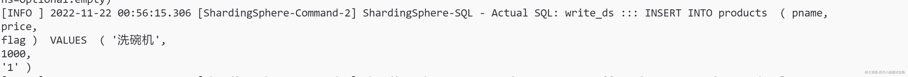

### 2.8.4 Proxy实现垂直分片

**1) 修改配置config-sharding.yaml**

schemaName: sharding\_db

#

dataSources:

ds\_0:

url: jdbc:mysql://192.168.52.10:3306/msb\_payorder\_db?characterEncoding=UTF-8&useSSL=false

username: root

password: QiDian@666

connectionTimeoutMilliseconds: 30000

idleTimeoutMilliseconds: 60000

maxLifetimeMilliseconds: 1800000

maxPoolSize: 50

minPoolSize: 1

ds\_1:

url: jdbc:mysql://192.168.52.11:3306/msb\_user\_db?characterEncoding=UTF-8&useSSL=false

username: root

password: QiDian@666

connectionTimeoutMilliseconds: 30000

idleTimeoutMilliseconds: 60000

maxLifetimeMilliseconds: 1800000

maxPoolSize: 50

minPoolSize: 1

rules:

- !SHARDING

tables:

pay\_order:

actualDataNodes: ds\_0.pay\_order

users:

actualDataNodes: ds\_1.users

**2) 动态查看日志**

tail -f /opt/apache-shardingsphere-5.1.1-shardingsphere-proxy-bin/logs/stdout.log

**3) 远程访问**

C:\Users\86187>mysql -h192.168.52.12 -P3307 -uroot -p

mysql> show databases;

+------------------------+

| schema\_name |

+------------------------+

| readwrite\_splitting\_db |

| sharding\_db |

| mysql |

| information\_schema |

| performance\_schema |

| sys |

+------------------------+

6 rows in set (0.02 sec)

mysql> use sharding\_db;

Database changed

mysql> show tables;

+-----------------------+------------+

| Tables\_in\_sharding\_db | Table\_type |

+-----------------------+------------+

| t\_district | BASE TABLE |

| pay\_order | BASE TABLE |

| users | BASE TABLE |

+-----------------------+------------+

3 rows in set (0.10 sec)

mysql> select \* from pay\_order;

+----------+---------+--------------+-------+

| order\_id | user\_id | product\_name | COUNT |

+----------+---------+--------------+-------+

| 2001 | 1003 | 电视 | 0 |

+----------+---------+--------------+-------+

1 row in set (0.17 sec)

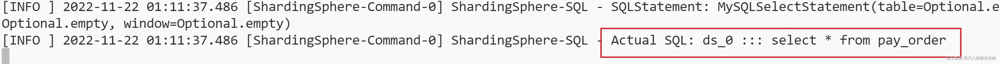

### 2.8.5 Proxy实现水平分片

**1) 修改配置config-sharding.yaml**

schemaName: sharding\_db

dataSources:

msb\_course\_db0:

url: jdbc:mysql://192.168.52.10:3306/msb\_course\_db0?useUnicode=true&characterEncoding=utf-8&useSSL=false

username: root

password: QiDian@666

connectionTimeoutMilliseconds: 30000

idleTimeoutMilliseconds: 60000

maxLifetimeMilliseconds: 1800000

maxPoolSize: 50

minPoolSize: 1

msb\_course\_db1:

url: jdbc:mysql://192.168.52.11:3306/msb\_course\_db1?useUnicode=true&characterEncoding=utf-8&useSSL=false

username: root

password: QiDian@666

connectionTimeoutMilliseconds: 30000

idleTimeoutMilliseconds: 60000

maxLifetimeMilliseconds: 1800000

maxPoolSize: 50

minPoolSize: 1

rules:

- !SHARDING

tables:

t\_course:

actualDataNodes: msb\_course\_db${0..1}.t\_course\_${0..1}

databaseStrategy:

standard:

shardingColumn: user\_id

shardingAlgorithmName: alg\_mod

tableStrategy:

standard:

shardingColumn: corder\_no

shardingAlgorithmName: alg\_hash\_mod

keyGenerateStrategy:

column: cid

keyGeneratorName: snowflake

t\_course\_section:

actualDataNodes: msb\_course\_db${0..1}.t\_course\_section\_${0..1}

databaseStrategy:

standard:

shardingColumn: user\_id

shardingAlgorithmName: alg\_mod

tableStrategy:

standard:

shardingColumn: corder\_no

shardingAlgorithmName: alg\_hash\_mod

keyGenerateStrategy:

column: id

keyGeneratorName: snowflake

bindingTables:

- t\_course,t\_course\_section

broadcastTables:

- t\_district

shardingAlgorithms:

alg\_mod:

type: MOD

props:

sharding-count: 2

alg\_hash\_mod:

type: HASH\_MOD

props:

sharding-count: 2

keyGenerators:

snowflake:

type: SNOWFLAKE

**2) 远程访问**

mysql> use sharding\_db;

Database changed

mysql> show tables;

+-----------------------+------------+

| Tables\_in\_sharding\_db | Table\_type |

+-----------------------+------------+

| t\_district | BASE TABLE |

| t\_course\_section\_0 | BASE TABLE |

| t\_course | BASE TABLE |

| t\_course\_section\_1 | BASE TABLE |

+-----------------------+------------+

4 rows in set (0.04 sec)

mysql> select \* from t\_course;

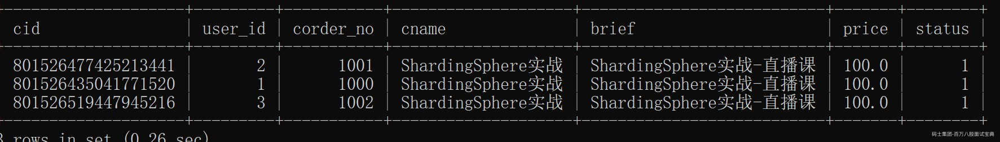

**3) 动态查看日志**

tail -f /opt/apache-shardingsphere-5.1.1-shardingsphere-proxy-bin/logs/stdout.log

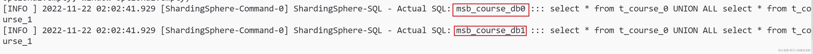

**4) 测试广播表**

mysql> select \* from t\_district;

+---------------------+---------------+-------+

| id | district\_name | LEVEL |

+---------------------+---------------+-------+

| 1592493879469277185 | 昌平区 | 1 |

+---------------------+---------------+-------+

1 row in set (0.06 sec)

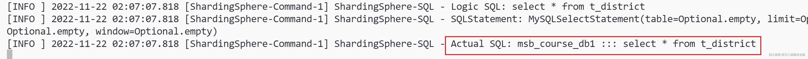

### 2.8.6 Proxy实现绑定表与广播表

**1) 修改配置config-sharding.yaml**

schemaName: sharding\_db

dataSources:

msb\_course\_db0:

url: jdbc:mysql://192.168.52.10:3306/msb\_course\_db0?useUnicode=true&characterEncoding=utf-8&useSSL=false

username: root

password: QiDian@666

connectionTimeoutMilliseconds: 30000

idleTimeoutMilliseconds: 60000

maxLifetimeMilliseconds: 1800000

maxPoolSize: 50

minPoolSize: 1

msb\_course\_db1:

url: jdbc:mysql://192.168.52.11:3306/msb\_course\_db1?useUnicode=true&characterEncoding=utf-8&useSSL=false

username: root

password: QiDian@666

connectionTimeoutMilliseconds: 30000

idleTimeoutMilliseconds: 60000

maxLifetimeMilliseconds: 1800000

maxPoolSize: 50

minPoolSize: 1

rules:

- !SHARDING

tables:

t\_course:

actualDataNodes: msb\_course\_db${0..1}.t\_course\_${0..1}

databaseStrategy:

standard:

shardingColumn: user\_id

shardingAlgorithmName: alg\_mod

tableStrategy:

standard:

shardingColumn: cid

shardingAlgorithmName: alg\_hash\_mod

keyGenerateStrategy:

column: cid

keyGeneratorName: snowflake

broadcastTables:

- t\_district

shardingAlgorithms:

alg\_mod:

type: MOD

props:

sharding-count: 2

alg\_hash\_mod:

type: HASH\_MOD

props:

sharding-count: 2

keyGenerators:

snowflake:

type: SNOWFLAKE

**2) 远程访问-测试绑定表**

mysql> use sharding\_db;

Database changed

mysql> show tables;

+-----------------------+------------+

| Tables\_in\_sharding\_db | Table\_type |

+-----------------------+------------+

| t\_course\_section | BASE TABLE |

| t\_district | BASE TABLE |

| t\_course | BASE TABLE |

+-----------------------+------------+

3 rows in set (0.03 sec)

mysql> select \* from t\_course\_section;

mysql> select \* from t\_course c inner join t\_course\_section cs on c.cid = cs.cid;

**3) 动态查看日志**

tail -f /opt/apache-shardingsphere-5.1.1-shardingsphere-proxy-bin/logs/stdout.log

**4) 测试广播表**

mysql> select \* from t\_district;

+---------------------+---------------+-------+

| id | district\_name | LEVEL |

+---------------------+---------------+-------+

| 1592493879469277185 | 昌平区 | 1 |

+---------------------+---------------+-------+

1 row in set (0.06 sec)

### 2.8.7 总结

- Sharding-Proxy的优势在于对异构语言的支持(无论使用什么语言，就都可以访问)，以及为DBA提供可操作入口。
- Sharding-Proxy 默认不支持hint，如需支持，请在conf/server.yaml中，将props的属性proxy.hint.enabled设置为true。在Sharding-Proxy中，HintShardingAlgorithm的泛型只能是String类型。
- Sharding-Proxy默认使用3307端口，可以通过启动脚本追加参数作为启动端口号。如: bin/start.sh 3308
- Sharding-Proxy使用conf/server.yaml配置注册中心、认证信息以及公用属性。
- Sharding-Proxy支持多逻辑数据源，每个以"config-"做前缀命名yaml配置文件，即为一个逻辑数据源。

## 2.9 SPI扩展机制详解与实战

### 2.9.1 SPI扩展机制介绍

SPI全称Service Provider Interface，是Java的一套用来让第三方提供接口实现或者扩展接口的机制。

SPI（Service Provider Interface），是JDK内置的一种 服务提供发现机制，可以用来启用框架扩展和替换组件，主要是被框架的开发人员使用，比如java.sql.Driver接口，其他不同厂商可以针对同一接口做出不同的实现，MySQL和PostgreSQL都有不同的实现提供给用户，而Java的SPI机制可以为某个接口寻找服务实现。Java中SPI机制主要思想是将装配的控制权移到程序之外，在模块化设计中这个机制尤其重要，其核心思想就是 **解耦**。

SPI整体机制图如下：

SPI 机制本质是将接口实现类的全限定名配置在文件中，并由服务加载器读取配置文件，加载文件中的实现类，这样运行时可以动态的为接口替换实现类

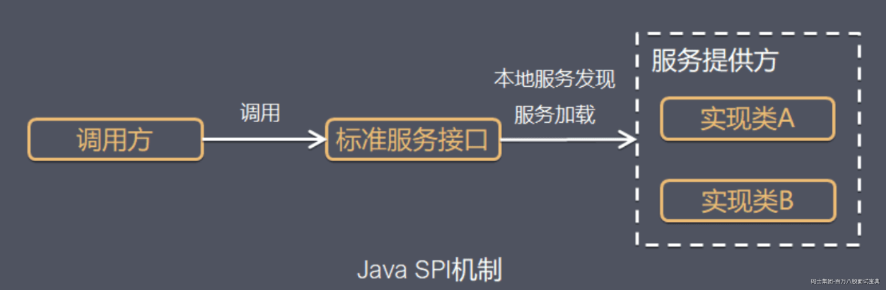

当服务的提供者提供了一种接口的实现之后，需要在classpath下的META-INF/services/目录里创建一个以服务接口命名的文件，这个文件里的内容就是这个接口的具体的实现类。当其他的程序需要这个服务的时候，就可以通过查找这个jar包（一般都是以jar包做依赖）的META-INF/services/中的配置文件，配置文件中有接口的具体实现类名，可以根据这个类名进行加载实例化，就可以使用该服务了。

JDK中查找服务的实现的工具类是：java.util.ServiceLoader。

在Apache ShardingSphere中，很多功能实现类的加载方式是通过SPI注入的方式完成的。 通过SPI方式载入的功能模块,比如: SQL解析、自定义分布式主键等等

引入了 SPI 机制后，服务接口与服务实现就会达成分离的状态，可以实现解耦以及程序可扩展机制

### 2.9.2 SPI项目准备

#### 2.9.2.1 环境搭建与项目导入

- 创建数据库及表,如下图
- 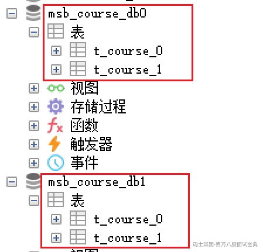
- CREATE TABLE `t\_course\_0` (  
   `cid` BIGINT(20) NOT NULL,  
   `user\_id` BIGINT(20) DEFAULT NULL,  
   `corder\_no` BIGINT(20) DEFAULT NULL,  
   `cname` VARCHAR(50) DEFAULT NULL,  
   `brief` VARCHAR(50) DEFAULT NULL,  
   `price` DOUBLE DEFAULT NULL,  
   `status` INT(11) DEFAULT NULL,  
   PRIMARY KEY (`cid`)  
  ) ENGINE=INNODB DEFAULT CHARSET=utf8  
    
  CREATE TABLE `t\_course\_1` (  
   `cid` BIGINT(20) NOT NULL,  
   `user\_id` BIGINT(20) DEFAULT NULL,  
   `corder\_no` BIGINT(20) DEFAULT NULL,  
   `cname` VARCHAR(50) DEFAULT NULL,  
   `brief` VARCHAR(50) DEFAULT NULL,  
   `price` DOUBLE DEFAULT NULL,  
   `status` INT(11) DEFAULT NULL,  
   PRIMARY KEY (`cid`)  
  ) ENGINE=INNODB DEFAULT CHARSET=utf8
- 直接引入资料中提供的分库分表示例项目即可.

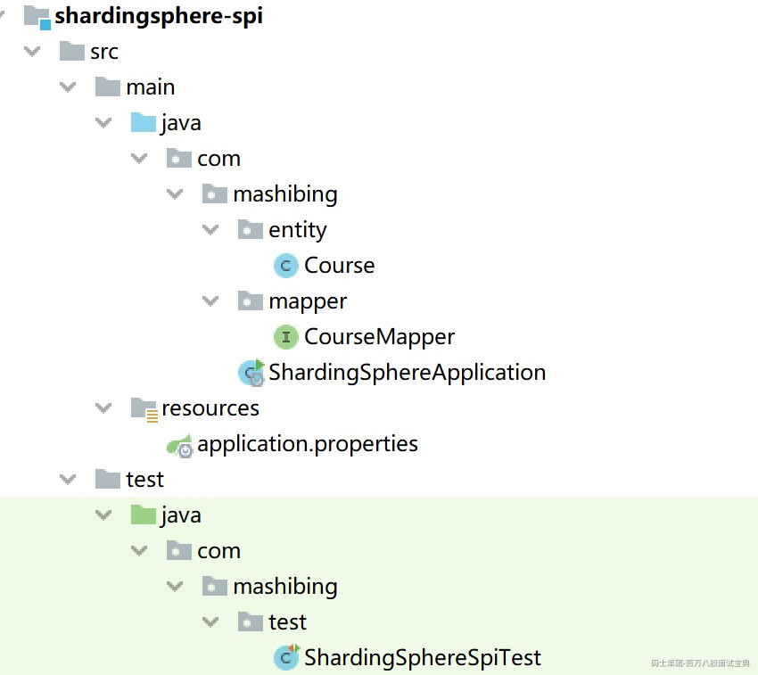

#### 2.9.2.2 条件查询测试

1. 指定分库字段作为条件查询

//指定分库字段作为条件查询

@Test

public void getCourseByUserId(){

QueryWrapper<Course> qw = new QueryWrapper<>();

qw.eq("user\_id",100L);

courseMapper.selectList(qw).forEach(System.out::println);

}

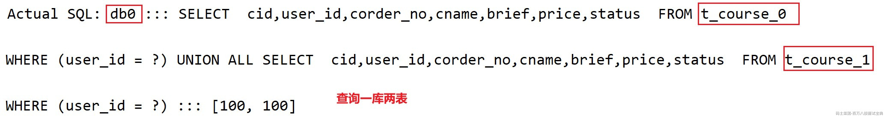

查询一库两表的原因,是因为我们使用分库字段user\_id进行查询,所以可以精确到所查询的库,但无法精确到表.

1. 指定分表字段作为条件查询

QueryWrapper<Course> qw = new QueryWrapper<>();

qw.eq("cid",802938751109038080L);

courseMapper.selectList(qw).forEach(System.out::println);

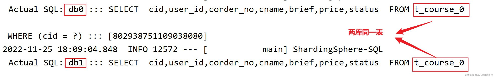

查询两库同一表的原因,是因为我们使用分表字段cid进行查询,所以可以精确到表,但是无法确定库

1. 实现精准查询

如果想要达到精确的某个库某张表的话, 可以将分库与分表的逻辑字段改为使用同一个

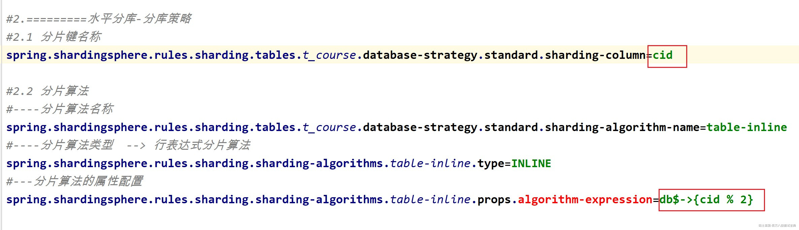

QueryWrapper<Course> qw = new QueryWrapper<>();

qw.eq("cid",802938751109038080L);

courseMapper.selectList(qw).forEach(System.out::println);

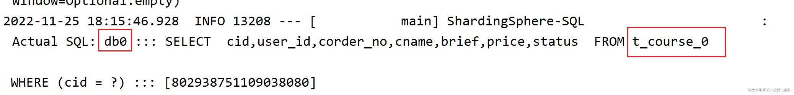

1. 范围查询

@Test

public void getCourseBetween(){

QueryWrapper<Course> qw = new QueryWrapper<>();

qw.between("cid",802938751058706433L,802938751209701377L);

courseMapper.selectList(qw).forEach(System.out::println);

}

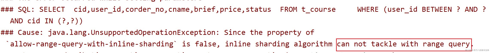

inline算法支持范围查询

### 2.9.4 通过SPI实现range查询策略

#### 2.9.4.1 自定义分片算法

**1) 修改 application.properties 修改 db 与 table 的策略为我们自定义的策略**

# 分库策略

spring.shardingsphere.rules.sharding.tables.t\_course.database-strategy.standard.sharding-column=cid

spring.shardingsphere.rules.sharding.tables.t\_course.database-strategy.standard.sharding-algorithm-name=standard-range-db

spring.shardingsphere.rules.sharding.sharding-algorithms.standard-range-db.type=STANDARD\_TEST\_DB

# 分表策略

spring.shardingsphere.rules.sharding.tables.t\_course.table-strategy.standard.sharding-column=cid

spring.shardingsphere.rules.sharding.tables.t\_course.table-strategy.standard.sharding-algorithm-name=standard-range-table

spring.shardingsphere.rules.sharding.sharding-algorithms.standard-range-table.type=STANDARD\_TEST\_TB

**2) 创建一个新的包(algorithm), 来存放自定义实现的分片算法代码, 创建下面两个类,都需要实现一个 StandardShardingAlgorithm 接口,重写接口方法**

- TableStandardAlgorithm类, 表的分片算法策略

public class TableStandardAlgorithm implements StandardShardingAlgorithm<Long> {

/\*\*

\* 实现自定义分表逻辑

\* @param tableNames 所有真是表名称

\* @param preciseShardingValue 条件值(cid的值)

\* @return: java.lang.String

\*/

@Override

public String doSharding(Collection<String> tableNames,

PreciseShardingValue<Long> preciseShardingValue) {

String logicTableName = preciseShardingValue.getLogicTableName(); //t\_course

BigInteger suffix = BigInteger.valueOf(preciseShardingValue.getValue()).mod(new BigInteger("2")); //获取后缀

String actualTableName = logicTableName+"\_"+suffix; //组合成最终落地的真实节点

if(tableNames.contains(actualTableName)){

return actualTableName;

}

throw new RuntimeException("配置错误,表不存在");

}

/\*\*

\* 确定范围查询时要查询的表 有哪些

\* @param collection

\* @param rangeShardingValue 分片值范围

\* @return: 集合中保存参与范围查询的表

\*/

@Override

public Collection<String> doSharding(Collection<String> collection,

RangeShardingValue<Long> rangeShardingValue) {

String logicTableName = rangeShardingValue.getLogicTableName();

return Arrays.asList(logicTableName+ "\_0" , logicTableName + "\_1");

}

@Override

public void init() {

}

/\*\*

\* 该方法就返回一个之前在 properties当中所配置的 type

\* standard-range-table.type=STANDARD\_TEST\_TB

\*/

@Override

public String getType() {

return "STANDARD\_TEST\_TB";

}

}

- DbStandardAlgorithm类 , 库的分片算法策略

public class DbStandardAlgorithm implements StandardShardingAlgorithm<Long> {

@Override

public String doSharding(Collection<String> collection,

PreciseShardingValue<Long> preciseShardingValue) {

for (String actualDb : collection) {

if (actualDb.endsWith(String.valueOf(preciseShardingValue.getValue() % 2))) {

return actualDb;

}

}

throw new RuntimeException("配置错误，库不存在");

}

@Override

public Collection<String> doSharding(Collection<String> collection,

RangeShardingValue<Long> rangeShardingValue) {

return Arrays.asList("db0", "db1");

}

@Override

public void init() {

}

@Override

public String getType() {

return "STANDARD\_TEST\_DB";

}

}

**3) 进行测试**

QueryWrapper<Course> qw = new QueryWrapper<>();

qw.eq("cid",802938751109038080L);

courseMapper.selectList(qw).forEach(System.out::println);

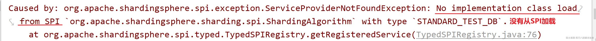

无法从SPI加载实现类

#### 2.9.4.2 添加SPI扩展

1. 在resources资源目录下创建 META-INF 目录, 再在 META-INF 下面创建 services 目录

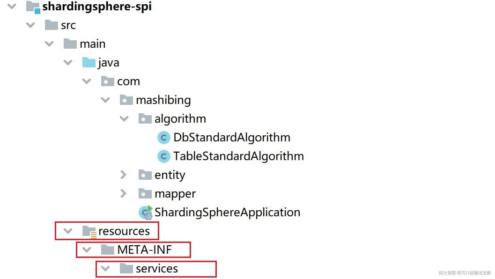

1. 在该目录当中创建文件 org.apache.shardingsphere.sharding.spi.ShardingAlgorithm, 然后在创建的文件当中添加如下内容：

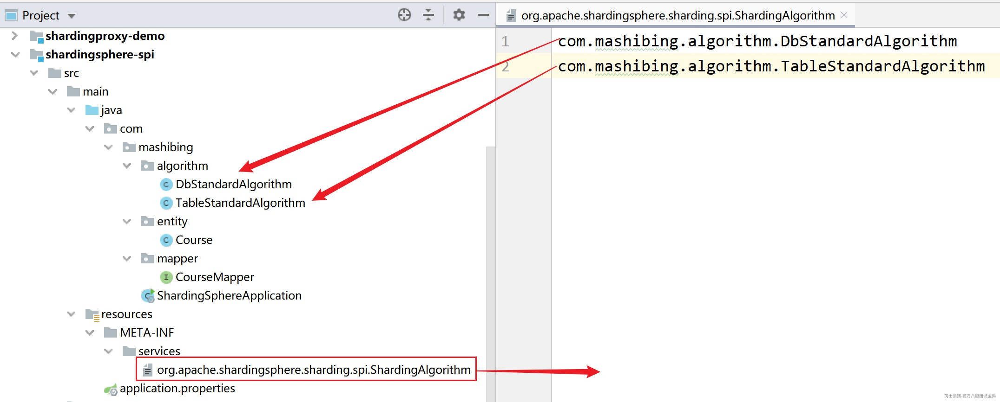

com.mashibing.algorithm.DbStandardAlgorithm

com.mashibing.algorithm.TableStandardAlgorithm

1. 查询测试

//单条件查询

QueryWrapper<Course> qw = new QueryWrapper<>();

qw.eq("cid",802938751109038080L);

courseMapper.selectList(qw).forEach(System.out::println);

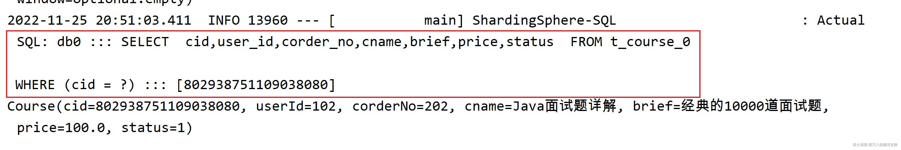

//范围查询

QueryWrapper<Course> qw = new QueryWrapper<>();

qw.between("cid",802938751058706433L,802938751209701377L);

courseMapper.selectList(qw).forEach(System.out::println);

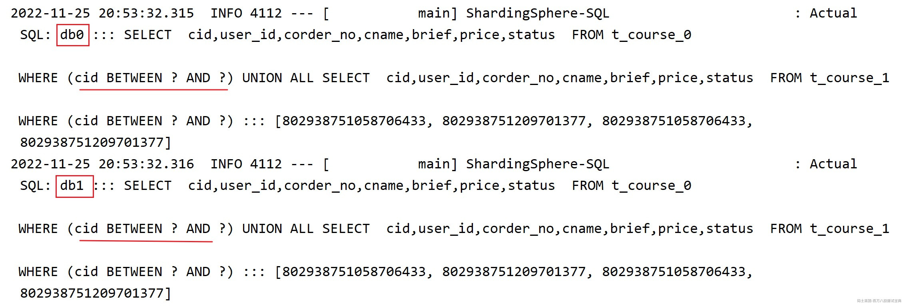

**Apache ShardingSphere所有通过SPI方式载入的功能模块如下:**

- SQL解析
- SQL解析的接口用于规定用于解析SQL的ANTLR语法文件。
- 主要接口是SQLParserEntry，其内置实现类有MySQLParserEntry, PostgreSQLParserEntry, SQLServerParserEntry和OracleParserEntry。
- 数据库协议
- 数据库协议的接口用于Sharding-Proxy解析与适配访问数据库的协议。
- 主要接口是DatabaseProtocolFrontendEngine，其内置实现类有MySQLProtocolFrontendEngine和PostgreSQLProtocolFrontendEngine。
- 数据脱敏
- 数据脱敏的接口用于规定加解密器的加密、解密、类型获取、属性设置等方式。
- 主要接口有两个：Encryptor和QueryAssistedEncryptor，其中Encryptor的内置实现类有AESEncryptor和MD5Encryptor。
- 分布式主键
- 分布式主键的接口主要用于规定如何生成全局性的自增、类型获取、属性设置等。
- 主要接口为ShardingKeyGenerator，其内置实现类有UUIDShardingKeyGenerator和SnowflakeShardingKeyGenerator。
- 分布式事务
- 分布式事务的接口主要用于规定如何将分布式事务适配为本地事务接口。
- 主要接口为ShardingTransactionManager，其内置实现类有XAShardingTransactionManager和SeataATShardingTransactionManager。
- XA事务管理器
- XA事务管理器的接口主要用于规定如何将XA事务的实现者适配为统一的XA事务接口。
- 主要接口为XATransactionManager，其内置实现类有AtomikosTransactionManager, NarayanaXATransactionManager和BitronixXATransactionManager。
- 注册中心
- 注册中心的接口主要用于规定注册中心初始化、存取数据、更新数据、监控等行为。
- 主要接口为RegistryCenter，其内置实现类有Zookeeper。

# 3.ShardingSphere核心源码剖析

## 3.1 源码下载及导入

### 3.1.1 源码下载

- 从SharingSphere官网（[Index of /dist/shardingsphere/4.1.0 (apache.org)](https://archive.apache.org/dist/shardingsphere/4.1.0/)）上下载4.1.0Release版源码
- apache-shardingsphere-4.1.0-src.zip
- 解压
- 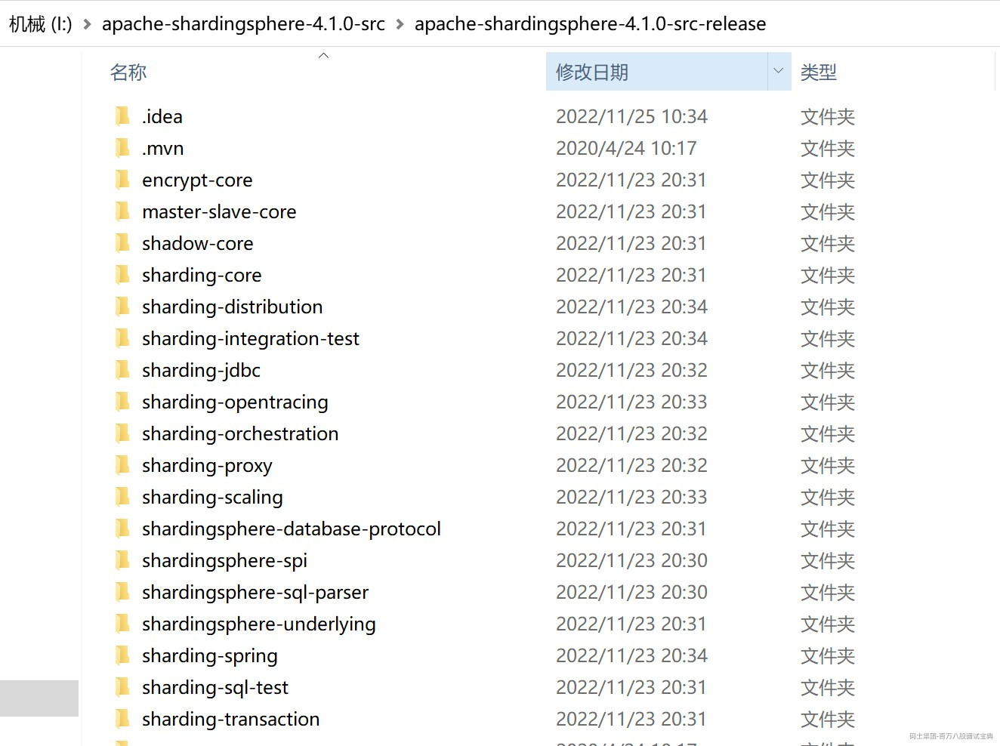

### 3.1.2导入Idea中

1. 选择引入

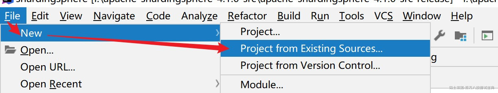

1. 找到解压好的源码项目

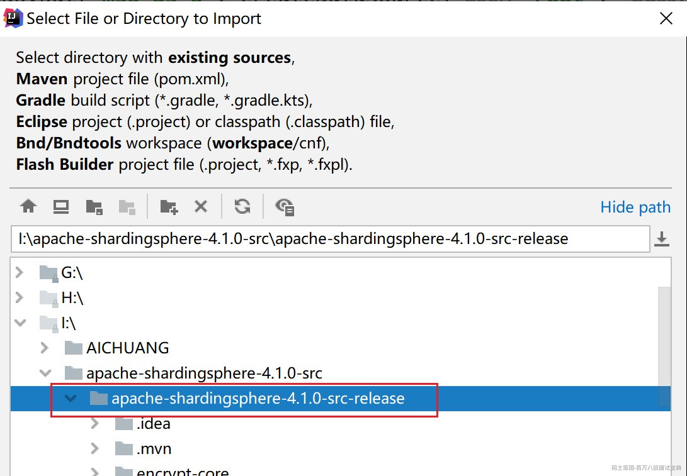

1. 点击OK 下一步下一步即可导入.如下图

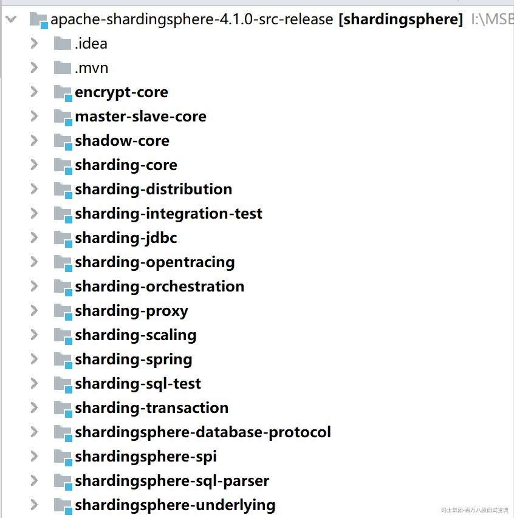

1. 将JDK的编译版本设置为1.8

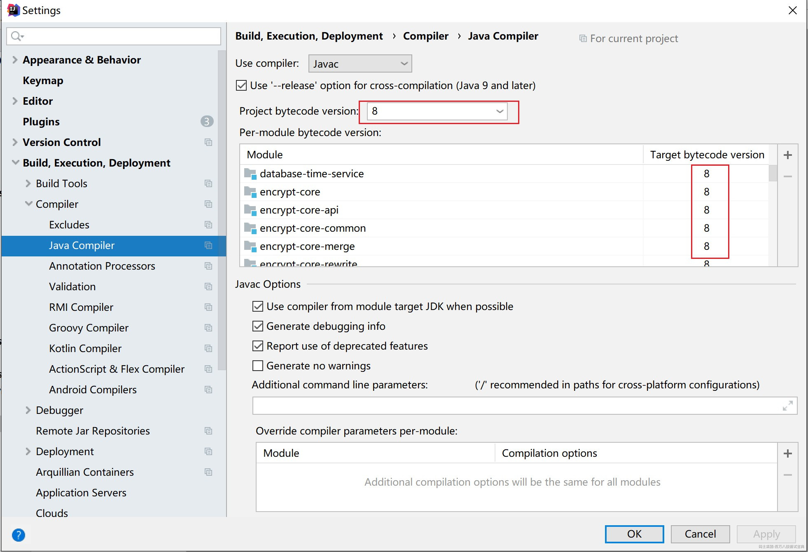

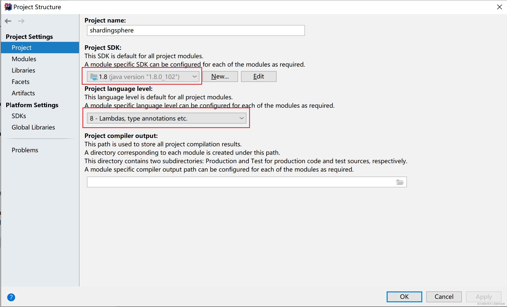

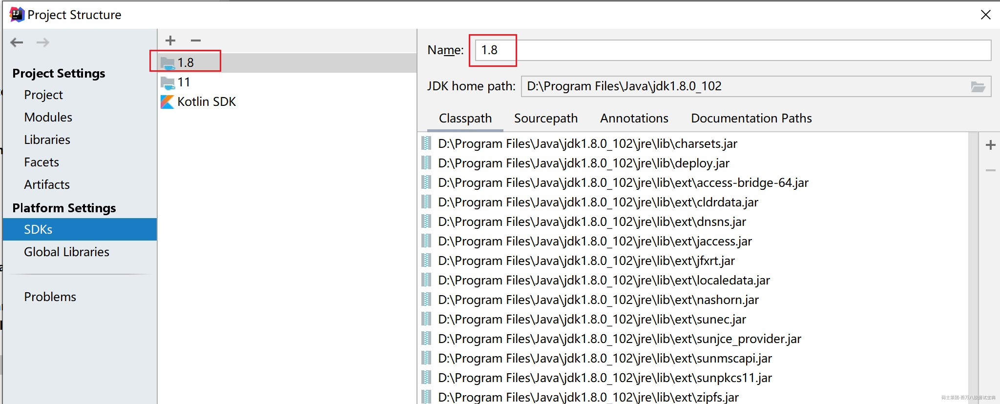

1. 运行 maven install 进行安装

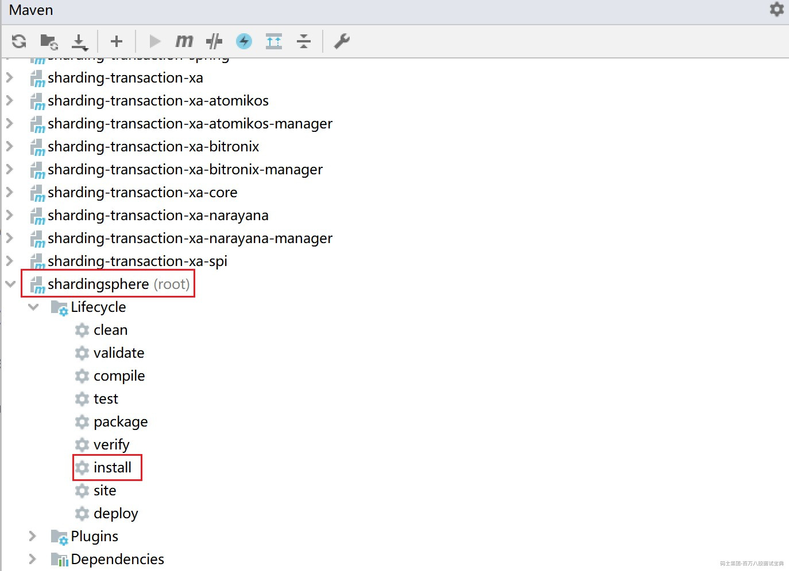

## 3.2 整体概述

### 3.2.1 主要模块概述

### 3.2.2 整体流程分析

- SQL 解析
- 分为词法解析和语法解析。 先通过词法解析器将 SQL 拆分为一个个不可再分的单词。再使用语法解析器对 SQL 进行理解，并最终提炼出解析上下文。 解析上下文包括表、选择项、排序项、分组项、聚合函数、分页信息、查询条件以及可能需要修改的占位符的标记。
- 执行器优化
- 合并和优化分片条件，如 OR 等。
- SQL 路由
- 根据解析上下文匹配用户配置的分片策略，并生成路由路径。目前支持分片路由和广播路由。
- SQL 改写
- 将 SQL 改写为在真实数据库中可以正确执行的语句。SQL 改写分为正确性改写和优化改写。
- SQL 执行
- 支持串行执行和并行执行，并行执行通过ShardingSphere自定义的多线程执行器异步执行。
- 结果归并
- 将多个执行结果集归并以便于通过统一的 JDBC 接口输出。结果归并包括流式归并、内存归并和使用装饰者模式的追加归并这几种方式。

## 3.3 项目搭建

### 3.3.1 环境准备

创建以下数据库表

-- 创建数据库 msb\_ds\_0

CREATE DATABASE msb\_ds\_0 CHARACTER SET utf8;

-- 创建表

CREATE TABLE t\_order\_0 (oid BIGINT PRIMARY KEY ,uid INT ,NAME VARCHAR(255));

CREATE TABLE t\_order\_1 (oid BIGINT PRIMARY KEY ,uid INT ,NAME VARCHAR(255));

-- 创建数据库 msb\_ds\_1

CREATE DATABASE msb\_ds\_1 CHARACTER SET utf8;

-- 创建表

CREATE TABLE t\_order\_0 (oid BIGINT PRIMARY KEY ,uid INT ,NAME VARCHAR(255));

CREATE TABLE t\_order\_1 (oid BIGINT PRIMARY KEY ,uid INT ,NAME VARCHAR(255));

**2) 新建Maven项目**

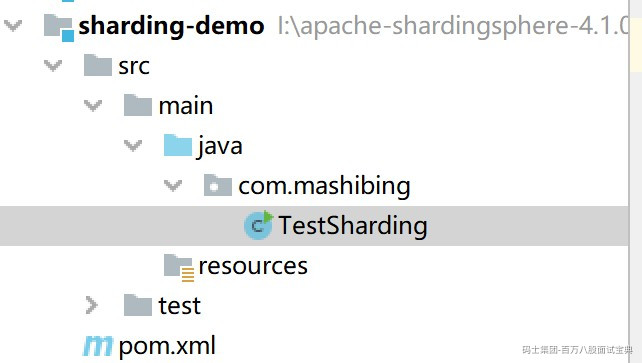

**3) 修改pom.xml**

<dependencies>

<!-- <https://mvnrepository.com/artifact/org.apache.shardingsphere/sharding-jdbc-core> -->

<dependency>

<groupId>org.apache.shardingsphere</groupId>

<artifactId>sharding-jdbc-core</artifactId>

<version>4.1.0</version>

</dependency>

<dependency>

<groupId>mysql</groupId>

<artifactId>mysql-connector-java</artifactId>

<version>5.1.47</version>

</dependency>

<dependency>

<groupId>com.alibaba</groupId>

<artifactId>druid-spring-boot-starter</artifactId>

<version>1.1.16</version>

</dependency>

<dependency>

<groupId>org.slf4j</groupId>

<artifactId>slf4j-api</artifactId>

<version>1.7.6</version>

</dependency>

<dependency>

<groupId>org.slf4j</groupId>

<artifactId>slf4j-log4j12</artifactId>

<version>1.7.6</version>

</dependency>

</dependencies>

### 3.3.2 代码编写

public class TestSharding {

//获取连接池

public static DataSource createDataSource(String user, String password, String url) {

DruidDataSource ds = new DruidDataSource();

ds.setUsername(user);

ds.setPassword(password);

ds.setUrl(url);

ds.setDriverClassName("com.mysql.jdbc.Driver");

return ds;

}

//用于执行插入SQL

public static void execute(DataSource ds, String sql, int uid, String name) throws Exception {

Connection conn = ds.getConnection();

PreparedStatement ps = conn.prepareStatement(sql);

ps.setInt(1, uid);

ps.setString(2, name);

ps.execute();

}

//用于执行查询SQL

public static void executeQuery(DataSource ds, String sql) throws Exception {

Connection conn = ds.getConnection();

Statement stat = conn.createStatement();

ResultSet result = stat.executeQuery(sql);

while (result.next()) {

System.out.println(result.getLong(1)+"\t|\t"+result.getInt(2)

+"\t|\t"+result.getString(3));

System.out.println("----------------------------------");

}

result.close();

stat.close();

}

public static void main(String[] args) {

//配置数据源

Map<String, DataSource> map = new HashMap();

map.put("msb\_ds\_0", createDataSource("root", "123456", "jdbc:mysql://127.0.0.1:3306/msb\_ds\_0"));

map.put("msb\_ds\_1", createDataSource("root", "123456", "jdbc:mysql://127.0.0.1:3306/msb\_ds\_1"));

//ShardingRuleConfiguration是分库分表配置的核心和入口，它可以包含多个TableRuleConfiguration

ShardingRuleConfiguration config = new ShardingRuleConfiguration();

//配置数据节点

TableRuleConfiguration orderTableRuleConfig = new TableRuleConfiguration("t\_order", "msb\_ds\_${0..1}.t\_order\_${0..1}");

//配置主键生成策略

KeyGeneratorConfiguration key = new KeyGeneratorConfiguration("SNOWFLAKE", "oid");

orderTableRuleConfig.setKeyGeneratorConfig(key);

//配置分库策略

orderTableRuleConfig.setDatabaseShardingStrategyConfig(new InlineShardingStrategyConfiguration("uid", "msb\_ds\_${uid % 2}"));

//配置分表策略

orderTableRuleConfig.setTableShardingStrategyConfig(new InlineShardingStrategyConfiguration("oid", "t\_order\_${oid % 2}"));

config.getTableRuleConfigs().add(orderTableRuleConfig);

try {

//获取数据源

DataSource ds = ShardingDataSourceFactory.createDataSource(map, config, new Properties());

//插入

for (int i = 1; i <= 10; ++i) {

String sql = "insert into t\_order(uid,name) values(?,?)";

execute(ds, sql, i, i + "aaa");

}

System.out.println("数据插入完成。。。");

//查询

String sql2="select \* from t\_order order by oid";

System.out.println("查询结果为：");

executeQuery(ds,sql2);

} catch (Exception ex) {

ex.printStackTrace();

}

}

}

## 3.4 ShardingJDBC源码整体理解

我们看源代码，需要一个入口，ShardingSphere中最成熟、使用率最高的莫过于sharding-jdbc，因此我们就从sharding-jdbc作为代码分析的切入点。

从名字就可以看出sharding-jdbc支持JDBC，熟悉JDBC规范的开发者都知道其核心就是DataSource、Connection、Statement、PrepareStatement等接口，在sharding-jdbc中，这些接口的实现类分别对应:

- **DataSource -> ShardingDataSource 类**
- **ShardingConnection -> Connection 类**
- **ShardingStatment -> Statement 类**
- **ShardingPreparedStatement -> PrepareStatement 类**

接下来就从一条查询SQL出发，顺着方法的调用脉络看下这些类的代码.我们先来看示例中的这段代码:

ShardingRuleConfiguration config = new ShardingRuleConfiguration();

### 3.4.1 ShardingJDBC中与配置相关的类

分片规则配置 ShardingRuleConfiguration是最常用的配置类，支持分片配置、加密配置、基于主从的读写分离配置，实现RuleConfiguration标记接口。它可以包含多个TableRuleConfiguration和MasterSlaveRuleConfiguration。

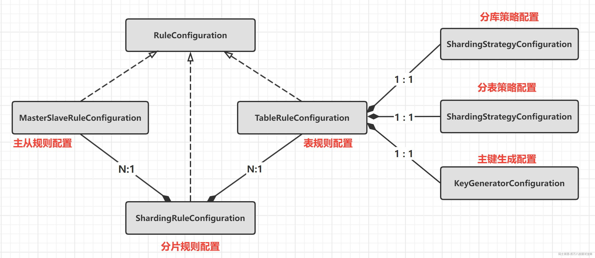

- MasterSlaveRuleConfiguration封装的是读写分离配置信息。
- TableRuleConfiguration封装的是表的分片配置信息，有5种配置形式对应不同的Configuration类型。
- 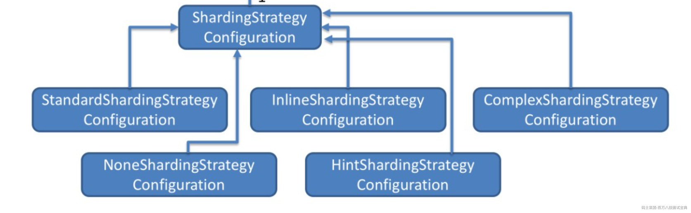

#### 3.4.1.1 ShardingRuleConfiguration

public final class ShardingRuleConfiguration implements RuleConfiguration {

//tableRuleConfigs：表规则配置，可以针对不同的表设置不同的分片规则，也可以使用全局默认分片规则。

private Collection<TableRuleConfiguration> tableRuleConfigs = new LinkedList<>();

//bindingTableGroups：绑定表，用于关联查询防止笛卡尔积。

private Collection<String> bindingTableGroups = new LinkedList<>();

//广播表，每个节点都存在的表，往往是一些码表、配置表

private Collection<String> broadcastTables = new LinkedList<>();

//默认数据源名称。

private String defaultDataSourceName;

//默认分库策略配置。

private ShardingStrategyConfiguration defaultDatabaseShardingStrategyConfig;

//默认分表策略配置。

private ShardingStrategyConfiguration defaultTableShardingStrategyConfig;

//默认主键生成配置。

private KeyGeneratorConfiguration defaultKeyGeneratorConfig;

//主从规则配置。

private Collection<MasterSlaveRuleConfiguration> masterSlaveRuleConfigs = new LinkedList<>();

//加密规则配置。

private EncryptRuleConfiguration encryptRuleConfig;

}

#### 3.4.1.2 TableRuleConfiguration

public final class TableRuleConfiguration {

//逻辑表名

private final String logicTable;

//实际数据节点。

private final String actualDataNodes;

//分库策略配置

private ShardingStrategyConfiguration databaseShardingStrategyConfig;

//分表策略配置

private ShardingStrategyConfiguration tableShardingStrategyConfig;

//主键生成策略配置

private KeyGeneratorConfiguration keyGeneratorConfig;

public TableRuleConfiguration(final String logicTable) {

this(logicTable, null);

}

public TableRuleConfiguration(final String logicTable, final String actualDataNodes) {

Preconditions.checkArgument(!Strings.isNullOrEmpty(logicTable), "LogicTable is required.");

this.logicTable = logicTable;

this.actualDataNodes = actualDataNodes;

}

}

#### 3.4.1.3 ShardingStrategyConfiguration分片策略配置

ShardingStrategyConfiguration是个标记接口，里面啥也没有。**这个策略配置可以针对分库，也可以针对分表**。

public interface ShardingStrategyConfiguration {

}

- sharding-jdbc中有很多标记接口，方便透传，然后通过instanceof走不同的逻辑。例如ShardingStrategyFactory根据ShardingStrategyConfiguration的实际类型，创建ShardingStrategy。

//简单工厂模式 --> 根据传入参数的类型,创建对应的实例

@NoArgsConstructor(access = AccessLevel.PRIVATE)

public final class ShardingStrategyFactory {

/\*\*

\* Create sharding algorithm.

\*

\* @param shardingStrategyConfig sharding strategy configuration

\* @return sharding strategy instance

\*/

//ShardingStrategyConfiguration代表分片策略配置，而运行时是将配置转换为ShardingStrategy实际的分片策略。

public static ShardingStrategy newInstance(final ShardingStrategyConfiguration shardingStrategyConfig) {

//标准分片策略

if (shardingStrategyConfig instanceof StandardShardingStrategyConfiguration) {

return new StandardShardingStrategy((StandardShardingStrategyConfiguration) shardingStrategyConfig);

}

//行表达式分片策略

if (shardingStrategyConfig instanceof InlineShardingStrategyConfiguration) {

return new InlineShardingStrategy((InlineShardingStrategyConfiguration) shardingStrategyConfig);

}

//复合分片策略

if (shardingStrategyConfig instanceof ComplexShardingStrategyConfiguration) {

return new ComplexShardingStrategy((ComplexShardingStrategyConfiguration) shardingStrategyConfig);

}

//Hint分片策略

if (shardingStrategyConfig instanceof HintShardingStrategyConfiguration) {

return new HintShardingStrategy((HintShardingStrategyConfiguration) shardingStrategyConfig);

}

//不分片策略

return new NoneShardingStrategy();

}

总结:

- ShardingRuleConfiguration和TableRuleConfiguration是ShardingJDBC中最重要的两个配置类，对应运行时的ShardingRule和TableRule。
- ShardingRuleConfiguration可以配置默认分库分表策略，TableRuleConfiguration可以对表做定制分库分表策略。

### 3.4.2 ShardingDataSource的创建

问题:

- 多个数据源和ShardingRuleConfiguration的配置，如何转换为运行时的DataSource？
- 分片数据源与普通数据源的区别是什么？

#### 3.4.2.1 ShardingDataSourceFactory

org.apache.shardingsphere.shardingjdbc.api.ShardingDataSourceFactory用于创建ShardingDataSource。sharding-jdbc中所有包名是api的，都是最终暴露给用户使用的。

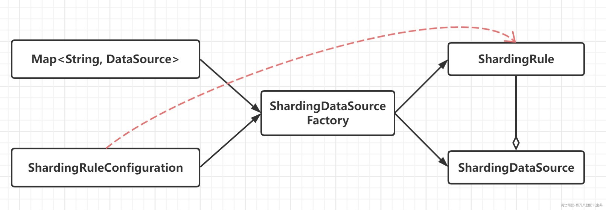

从 createDataSource 进入源码

- dataSourceMap：数据源名称与数据源的映射关系。
- shardingRuleConfig：分片规则配置。
- props：配置，如sql.show=true。

DataSource ds = ShardingDataSourceFactory.createDataSource(map, config, new Properties());

- createDataSource

public static DataSource createDataSource(

final Map<String, DataSource> dataSourceMap, final ShardingRuleConfiguration shardingRuleConfig, final Properties props) throws SQLException {

//创建ShardingDataSource数据源对象,以及ShardingRule核心分片规则对象

return new ShardingDataSource(dataSourceMap, new ShardingRule(shardingRuleConfig, dataSourceMap.keySet()), props);

}

#### 3.4.2.2 ShardingRule

首先，调用ShardingRule的构造方法，将ShardingRuleConfiguration配置转换为ShardingRule

- ShardingRule

public ShardingRule(final ShardingRuleConfiguration shardingRuleConfig, final Collection<String> dataSourceNames) {

Preconditions.checkArgument(null != shardingRuleConfig, "ShardingRuleConfig cannot be null.");

Preconditions.checkArgument(null != dataSourceNames && !dataSourceNames.isEmpty(), "Data sources cannot be empty.");

this.ruleConfiguration = shardingRuleConfig;

//获取所有的实际数据库

shardingDataSourceNames = new ShardingDataSourceNames(shardingRuleConfig, dataSourceNames);

//表路由规则

tableRules = createTableRules(shardingRuleConfig);

//获取广播表

broadcastTables = shardingRuleConfig.getBroadcastTables();

//绑定表

bindingTableRules = createBindingTableRules(shardingRuleConfig.getBindingTableGroups());

//创建默认的分库策略

defaultDatabaseShardingStrategy = createDefaultShardingStrategy(shardingRuleConfig.getDefaultDatabaseShardingStrategyConfig());

//创建默认的分表策略

defaultTableShardingStrategy = createDefaultShardingStrategy(shardingRuleConfig.getDefaultTableShardingStrategyConfig());

//分片键

defaultShardingKeyGenerator = createDefaultKeyGenerator(shardingRuleConfig.getDefaultKeyGeneratorConfig());

//主从规则

masterSlaveRules = createMasterSlaveRules(shardingRuleConfig.getMasterSlaveRuleConfigs());

//加密规则

encryptRule = createEncryptRule(shardingRuleConfig.getEncryptRuleConfig());

}

- createTableRules 收集表的路由规则

private Collection<TableRule> createTableRules(final ShardingRuleConfiguration shardingRuleConfig) {

//拿到路由配置信息,创建TableRule也就是表路由规则,再将其收集到一个List集合中

return shardingRuleConfig.getTableRuleConfigs().stream().map(each ->

new TableRule(each, shardingDataSourceNames, getDefaultGenerateKeyColumn(shardingRuleConfig))).collect(Collectors.toList());

}

- TableRule

//构建分表策略

public TableRule(final TableRuleConfiguration tableRuleConfig, final ShardingDataSourceNames shardingDataSourceNames, final String defaultGenerateKeyColumn) {

//获取逻辑表

logicTable = tableRuleConfig.getLogicTable().toLowerCase();

//创建inline表达式解析器对象

List<String> dataNodes = new InlineExpressionParser(tableRuleConfig.getActualDataNodes()).splitAndEvaluate();

dataNodeIndexMap = new HashMap<>(dataNodes.size(), 1);

//获取实际的数据库列表,收集到actualTables

actualDataNodes = isEmptyDataNodes(dataNodes)

? generateDataNodes(tableRuleConfig.getLogicTable(), shardingDataSourceNames.getDataSourceNames()) : generateDataNodes(dataNodes, shardingDataSourceNames.getDataSourceNames());

actualTables = getActualTables();

//分库策略

databaseShardingStrategy = null == tableRuleConfig.getDatabaseShardingStrategyConfig() ? null : ShardingStrategyFactory.newInstance(tableRuleConfig.getDatabaseShardingStrategyConfig());

//分表策略

tableShardingStrategy = null == tableRuleConfig.getTableShardingStrategyConfig() ? null : ShardingStrategyFactory.newInstance(tableRuleConfig.getTableShardingStrategyConfig());

final KeyGeneratorConfiguration keyGeneratorConfiguration = tableRuleConfig.getKeyGeneratorConfig();

//自动生成主键列

generateKeyColumn = null != keyGeneratorConfiguration && !Strings.isNullOrEmpty(keyGeneratorConfiguration.getColumn()) ? keyGeneratorConfiguration.getColumn() : defaultGenerateKeyColumn;

//分片键 -> UUID策略与SNOWFLAKE策略

//SPI: 获取分布式主键

shardingKeyGenerator = containsKeyGeneratorConfiguration(tableRuleConfig)

//getType获取对应策略类型,getProperties获取对应策略的属性值

? new ShardingKeyGeneratorServiceLoader().newService(tableRuleConfig.getKeyGeneratorConfig().getType(), tableRuleConfig.getKeyGeneratorConfig().getProperties()) : null;

checkRule(dataNodes);

}

- 在这里我们一起来看一下: 分布式主键生成策略是以SPI方式引入的, 主要接口为ShardingKeyGenerator，其内置实现类有UUIDShardingKeyGenerator和SnowflakeShardingKeyGenerator。

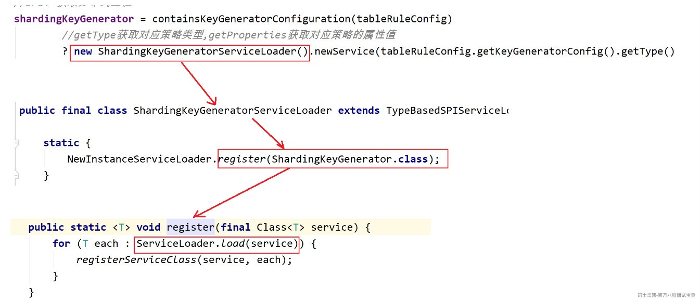

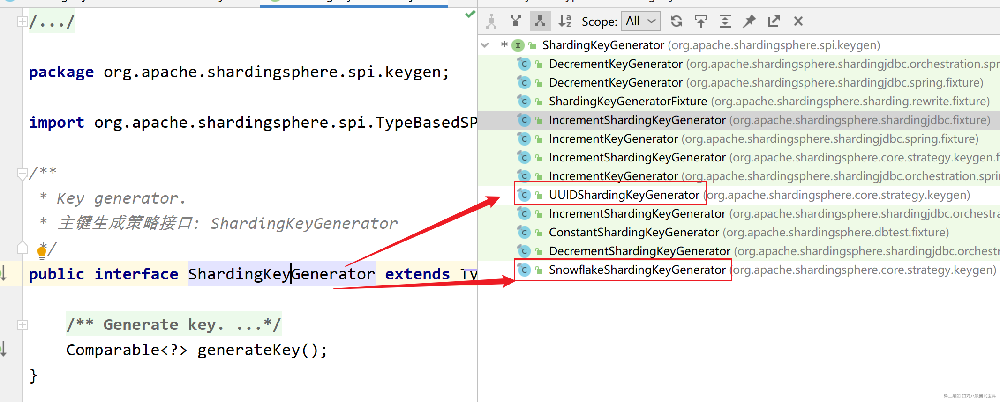

- 找到配置文件,可以看到对应的配置信息

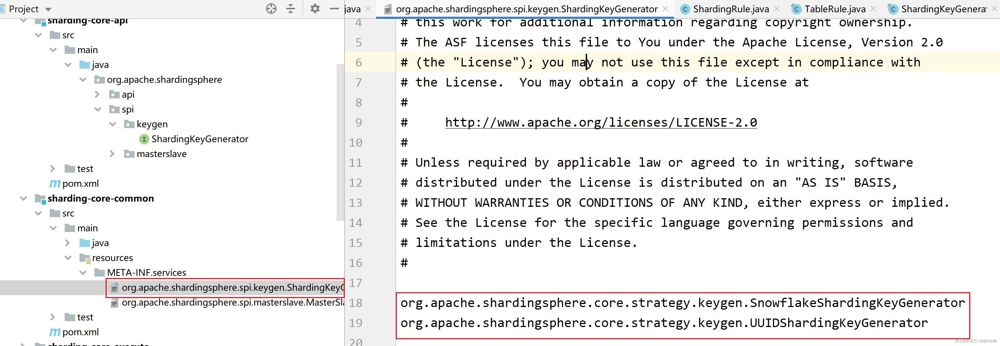

其他的 诸如广播表等等,也都是根据配置文件信息构建对应对象.

#### 3.4.2.3 ShardingDataSource

ShardingDataSource类图

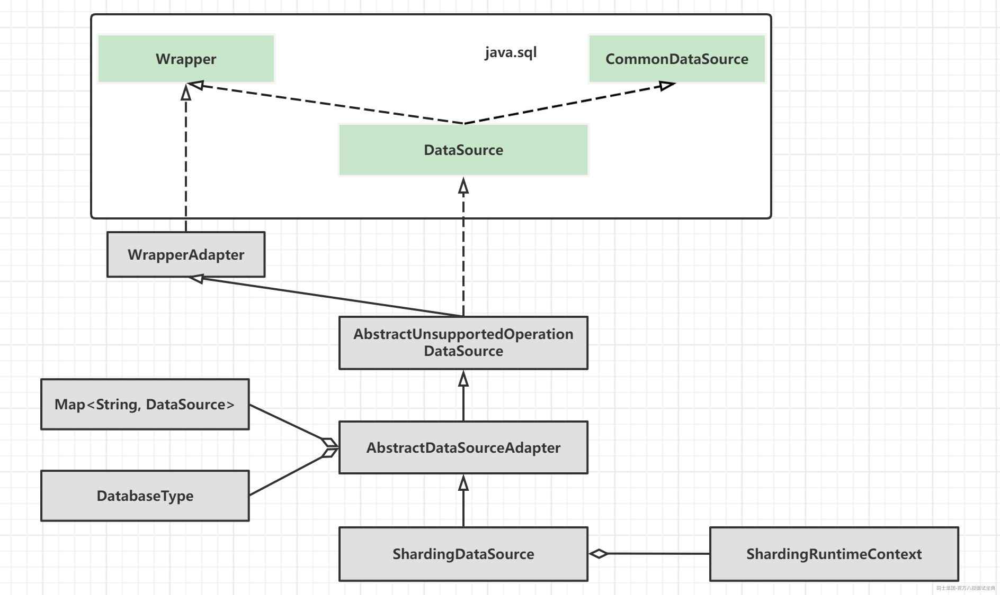

**1) Wrapper接口**

Wrapper接口可以把一个非JDBC标准的接口(第三方驱动提供的)包装成标准接口。许多 JDBC 驱动程序实现使用包装器(适配器)模式提供超越传统 JDBC API 的扩展，传统 JDBC API 是特定于数据源的。开发人员可能希望访问那些被包装（代理）为代表实际资源代理类实例的资源。此接口描述访问那些由代理代表的包装资源的标准机制，以允许对资源代理的直接访问。

适配器模式的重点就是,适配器类继承适配者类(需要被适配的类),并且实现目标类接口,这样就可以在适配器类的实现方法中, 挂羊头卖狗肉的去调用适配者的方法.

**2) WrapperAdapter**

在sharding-jdbc中，基本所有数据库驱动相关的类都继承了这个WrapperAdapter。

首先WrapperAdapter实现了java.sql.Wrapper接口，提供了isWrapperFor和unwrap方法的实现。

public abstract class WrapperAdapter implements Wrapper {

private final Collection<JdbcMethodInvocation> jdbcMethodInvocations = new ArrayList<>();

@SuppressWarnings("unchecked")

@Override

public final <T> T unwrap(final Class<T> iface) throws SQLException {

// 判断当前调用此方法的对象,是不是iface的实例

if (isWrapperFor(iface)) {

//如果是,强转 以允许访问非标准方法或代理未公开的标准方法

return (T) this;

}

throw new SQLException(String.format("[%s] cannot be unwrapped as [%s]", getClass().getName(), iface.getName()));

}

// 判断当前对象是否是iface的实例

@Override

public final boolean isWrapperFor(final Class<?> iface) {

return iface.isInstance(this);

}

}

**3) AbstractUnsupportedOperationDataSource**

public abstract class AbstractUnsupportedOperationDataSource extends WrapperAdapter implements DataSource {

@Override

public final int getLoginTimeout() throws SQLException {

throw new SQLFeatureNotSupportedException("unsupported getLoginTimeout()");

}

@Override

public final void setLoginTimeout(final int seconds) throws SQLException {

throw new SQLFeatureNotSupportedException("unsupported setLoginTimeout(int seconds)");

}

}

在org.apache.shardingsphere.shardingjdbc.jdbc.unsupported包下的所有类，都和AbstractUnsupportedOperationDataSource类似，由于sharding-jdbc对于java.sql接口的有些方法没有实现，就会提供一个抽象UnsupportedOperationXXX类。

目的是不要让每个实现类都实现一遍这些不支持的方法，仅仅是抛出一个SQLFeatureNotSupportedException异常。

**3) AbstractDataSourceAdapter**

AbstractDataSourceAdapter是DataSource的适配层。

- 提供了getLogWriter/setLogWriter的实现
- 提供了dataSourceMap（多数据源）和databaseType的get方法
- 对于getConnection(username,password)方法提供默认实现（直接调用无参getConnection）

public abstract class AbstractDataSourceAdapter extends AbstractUnsupportedOperationDataSource implements AutoCloseable {

//使用Map保存多数据源

private final Map<String, DataSource> dataSourceMap;

private final DatabaseType databaseType;

@Setter

private PrintWriter logWriter = new PrintWriter(System.out);

public AbstractDataSourceAdapter(final Map<String, DataSource> dataSourceMap) throws SQLException {

this.dataSourceMap = dataSourceMap;

databaseType = createDatabaseType();

}

@Override

public final Connection getConnection(final String username, final String password) throws SQLException {

return getConnection();

}

//子类需要实现getRuntimeContext方法，获取RuntimeContext。

protected abstract RuntimeContext getRuntimeContext();

}

**4) ShardingDataSource**

public class ShardingDataSource extends AbstractDataSourceAdapter {

private final ShardingRuntimeContext runtimeContext;

/\*\*

\* 利用SPI机制,将RouteDecorator(路由),SQLRewriteContextDecorator(SQL重写),ResultProcessEngine(结果处理)

\* 三个接口的实现类注册到NewInstanceServiceLoader#SERVICE\_MAP中

\*/

static {

NewInstanceServiceLoader.register(RouteDecorator.class);

NewInstanceServiceLoader.register(SQLRewriteContextDecorator.class);

NewInstanceServiceLoader.register(ResultProcessEngine.class);

}

public ShardingDataSource(final Map<String, DataSource> dataSourceMap, final ShardingRule shardingRule, final Properties props) throws SQLException {

//获取数据库类型

super(dataSourceMap);

//检查数据库类型

checkDataSourceType(dataSourceMap);

runtimeContext = new ShardingRuntimeContext(dataSourceMap, shardingRule, props, getDatabaseType());

}

private void checkDataSourceType(final Map<String, DataSource> dataSourceMap) {

for (DataSource each : dataSourceMap.values()) {

Preconditions.checkArgument(!(each instanceof MasterSlaveDataSource), "Initialized data sources can not be master-slave data sources.");

}

}

@Override

public final ShardingConnection getConnection() {

return new ShardingConnection(getDataSourceMap(), runtimeContext, TransactionTypeHolder.get());

}

}

**5) NewInstanceServiceLoader**

ShardingDataSource的static代码块中，利用JDK的SPI，将RouteDecorator（路由）、SQLRewriteContextDecorator（SQL重写）、ResultProcessEngine（结果处理）三个接口的实现Class，注册到NewInstanceServiceLoader#SERVICE\_MAP中。

/\*\*

\* SPI service loader for new instance for every call.

\* 为每个调用创建新实例

\*/

@NoArgsConstructor(access = AccessLevel.PRIVATE)

public final class NewInstanceServiceLoader {

private static final Map<Class, Collection<Class<?>>> SERVICE\_MAP = new HashMap<>();

/\*\*

\* Register SPI service into map for new instance.

\*

\* @param service service type

\* @param <T> type of service

\*/

public static <T> void register(final Class<T> service) {

//Java中提供的SPI加载,利用ServiceLoader来加载并实例化类

for (T each : ServiceLoader.load(service)) {

registerServiceClass(service, each);

}

}

@SuppressWarnings("unchecked")

private static <T> void registerServiceClass(final Class<T> service, final T instance) {

Collection<Class<?>> serviceClasses = SERVICE\_MAP.get(service);

if (null == serviceClasses) {

serviceClasses = new LinkedHashSet<>();

}

serviceClasses.add(instance.getClass());

SERVICE\_MAP.put(service, serviceClasses);

}

}

注意到SERVICE\_MAP并不是保存实现类的全局单例对象集合，而是保存实现类的Class对象集合。

sharding-jdbc中这些通过SPI机制引入的实现类，都是非单例的，每次调用NewInstanceServiceLoader的newServiceInstances方法就会创建所有实现类的实例。

public static <T> Collection<T> newServiceInstances(final Class<T> service) {

Collection<T> result = new LinkedList<>();

if (null == SERVICE\_MAP.get(service)) {

return result;

}

for (Class<?> each : SERVICE\_MAP.get(service)) {

result.add((T) each.newInstance());

}

return result;

}

**6) 构造方法**

- 构造方法将dataSourceMap传给父类构造。
- checkDataSourceType校验传入的DataSource不包含MasterSlaveDataSource。
- 构造ShardingRuntimeContext，提供getRuntimeContext方法的实现。

public ShardingDataSource(final Map<String, DataSource> dataSourceMap, final ShardingRule shardingRule, final Properties props) throws SQLException {

//获取数据库类型

super(dataSourceMap);

//检查数据库类型

checkDataSourceType(dataSourceMap);

//创建ShardingRuntimeContext

runtimeContext = new ShardingRuntimeContext(dataSourceMap, shardingRule, props, getDatabaseType());

}

**7) 核心方法getConnection实现**

getConnection方法就是new一个ShardingConnection返回给用户。

@Override

public final ShardingConnection getConnection() {

return new ShardingConnection(getDataSourceMap(), runtimeContext, TransactionTypeHolder.get());

}

#### 3.4.2.4 ShardingRuntimeContext

ShardingRuntimeContext是sharding-jdbc运行时的上下文对象，包含了所有运行时需要的信息。

public interface RuntimeContext<T extends BaseRule> extends AutoCloseable {

T getRule();

ConfigurationProperties getProperties();

DatabaseType getDatabaseType();

ExecutorEngine getExecutorEngine();

SQLParserEngine getSqlParserEngine();

}

- getRule：获取BaseRule，最常用的就是ShardingRule，整个RuntimeContext就是针对某个BaseRule的。
- getProperties：获取配置，比如获取sql.show=true等配置。
- getDatabaseType：获取DatabaseType，DataSourceType包含数据源类型（MySQL、Oracle），host、port、catalog、schema等信息。
- getExecutorEngine：获取执行引擎，执行引擎的实现只有一个ExecutorEngine。
- getSqlParserEngine：获取sql解析引擎，解析引擎的实现只有一个SQLParserEngine。

#### 3.4.2.5 总结

- ShardingRuleConfiguration运行时转换为**ShardingRule**包含了所有分片配置信息。
- 多数据源作为ShardingDataSource的成员变量而存在，具体是由AbstractDataSourceAdapter管理并提供getter方法。
- ShardingRuntimeContext是运行上下文，持有**ShardingRule**分片规则、各种引擎（sql解析引擎、sql执行引擎、事务引擎）、元数据信息（数据源、表）。

## 3.5 核心引擎分析

ShardingJDBC处理SQL的流程大致是这样的,首先用户操作的都是逻辑表，最终是要被替换成物理表的，所以需要对SQL进行解析，其实就是理解SQL；然后就是根据分片路由算法，应该路由到哪个表哪个库；接下来需要生成真实的SQL，这样SQL才能被执行；生成的SQL可能有多条，每条都要执行；最后把多条执行的结果进行归并，返回结果集

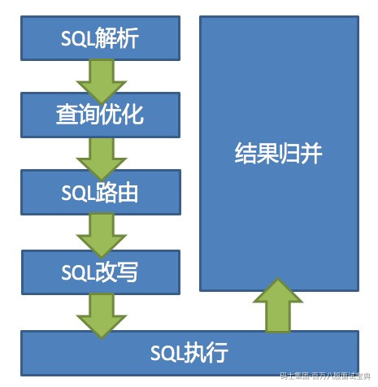

SQL 解析 => 执行器优化 => SQL 路由 => SQL 改写 => SQL 执行 => 结果归并 这个流程中,每个子流程都有专门的引擎：

- SQL解析：分为词法解析和语法解析。 先通过词法解析器将 SQL 拆分为一个个不可再分的单词。再使用语法解析器对 SQL 进行理解，并最终提炼出解析上下文。 解析上下文包括表、选择项、排序项、分组项、聚合函数、分页信息、查询条件以及可能需要修改的占位符的标记；
- 执行器优化：合并和优化分片条件，如 OR 等；
- SQL路由：根据解析上下文匹配用户配置的分片策略，并生成路由路径；目前支持分片路由和广播路由；
- SQL改写：将 SQL 改写为在真实数据库中可以正确执行的语句。SQL 改写分为正确性改写和优化改写；
- SQL执行：通过多线程执行器异步执行；
- 结果归并：将多个执行结果集归并以便于通过统一的 JDBC 接口输出。结果归并包括流式归并、内存归并和使用装饰者模式的追加归并这几种方式。

### 3.5.1 SQL解析引擎分析

SQL作为一种DSL（domain-specific language），可以理解为数据库的一种“编程语言”，与C、Java一样，真正执行这些文本字符串，需要先进行词法、语法分析，然后进行语义分析，编译器或者解释器才能将这些字符串转化为一系列确定的操作指令。

#### 3.5.1.1 解释器模式

解释器模式使用频率不算高，通常用来描述如何构建一个简单“语言”的语法解释器。它只在一些非常特定的领域被用到，比如编译器、规则引擎、正则表达式、SQL 解析等。不过，了解它的实现原理同样很重要，能帮助你思考如何通过更简洁的规则来表示复杂的逻辑。

**解释器模式(Interpreter pattern)的原始定义是：用于定义语言的语法规则表示，并提供解释器来处理句子中的语法。**

要想了解“语言”表达的信息，我们就必须定义相应的语法规则。这样，书写者就可以根据语法规则来书写“句子”（专业点的叫法应该是“表达式”），阅读者根据语法规则来阅读“句子”，这样才能做到信息的正确传递。解释器模式就是用来实现根据语法规则解读“句子”的解释器。

我们来定义了一个进行加减乘除计算的“语言”,说一下解释器模式的使用方式:

**1) 定义语法规则, 规则如下：**

- 运算符只包含加、减、乘、除，并且没有优先级的概念；
- 表达式中，先书写数字，后书写运算符，空格隔开；

**2)通过解释器,解释上面的语法规则,:**

- 这里我们就不编写解释程序, 简单分析一下 : 比如 “ 9 5 7 3 - + \* ” 这样一个表达式，我们按照上面的语法规则来处理，取出数字 “9、5” 和 “-” 运算符，计算得到 4，于是表达式就变成了“ 4 7 3 + \* ”。然后，我们再取出“4 7”和“ + ”运算符，计算得到 11，表达式就变成了“ 11 3 \* ”。最后，我们取出“ 11 3”和“ \* ”运算符，最终得到的结果就是 33。

#### 3.5.1.2 抽象语法树AST

SQL解析引擎的作用就是词法、语法分析，将SQL解析成一颗抽象语法树AST，从而方便后续直接通过高级编程语言进行读取。当然与C、Java等编程语言相比，SQL相对来说简单很多，没有作用域、类、复杂的分支判断等。

**1) 抽象语法树**

抽象语法树 (Abstract Syntax Tree)，简称 AST，它是源代码语法结构的一种抽象表示。它以树状的形式表现编程语言的语法结构，树上的每个节点都表示源代码中的一种结构。

select id,name from t\_user where status = 'ACTIVE' and age > 18 对应的抽象语法树

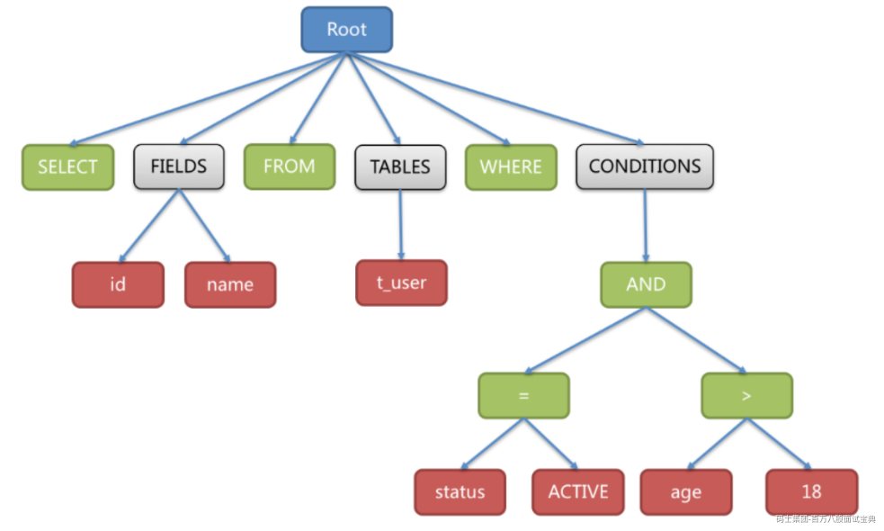

#### 3.5.1.3 ShardingSphere中Antlr4文件

**1) Antlr(安特尔)**

ANother Tool for Language Recognition，是一个强大的跨语言语法解析器，可以用来读取、处理、执行或翻译结构化文本或二进制文件。它被广泛用来构建语言，工具和框架。Antlr可以从语法上来生成一个可以构建和遍历解析树的解析器。

ANTLR官方地址：[https://www.antlr.org](https://link.segmentfault.com/?enc=Er9Y1XDKeBnpehasl427sw%3D%3D.L86AWQ5wSK4hbSWxn91uhLKhUqETEE19oywHmuyz5aI%3D)

ANTLR由两部分组成：

- 将用户自定义语法翻译成Java中的解析器/词法分析器的工具，对应antlr-complete.jar；
- 解析器运行时需要的环境库文件，对应antlr-runtime.jar；

**2) ShardingSphere中Antlr4的使用**

Antlr4通过.g4文件定义解析词法和语法规则，ShardingSphere中将词法和语法文件进行了分离定义, 例如mysql对应的g4文件:

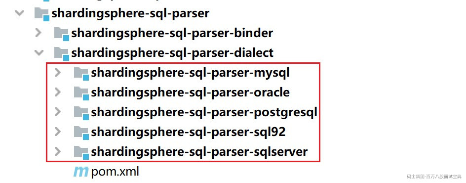

每个文件分别定义了一类关键字或者SQL类型规则。

- 词法规则文件包括: Alphabet.g4、Comments.g4、Keyword.g4、Literals.g4、MySQLKeyword.g4、Symbol.g4
- 语法规则文件包括: BaseRule.g4、DALStatement.g4、DCLStatement.g4、DDLStatement.g4、DMLStatement.g4、RLStatement.g4、TCLStatement.g4
- 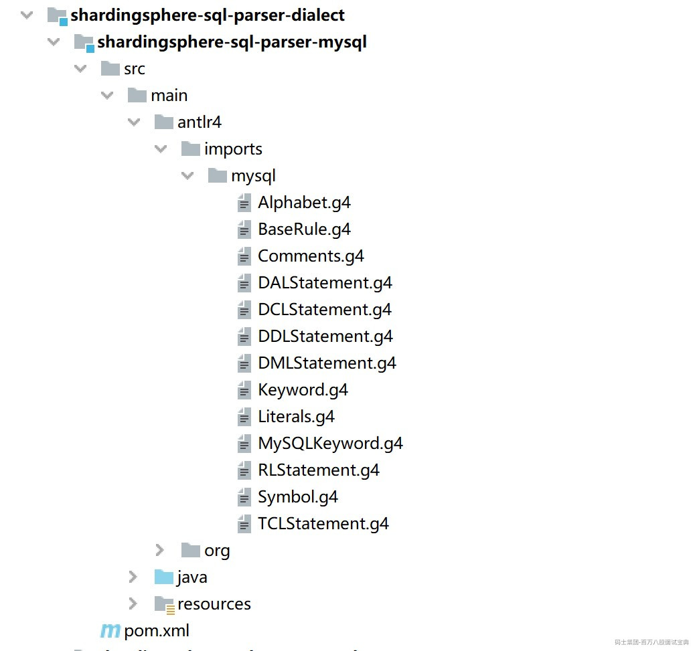
- Keyword.g4: 它是一个纯词法规则文件，定义了SQL中通用的关键字

lexer grammar Keyword; 语法名称，必须和文件名一致；可以包含前缀 lexer名称以大写字母开头和parser名称以小写字母开头

import Alphabet; 将一个语法分割成多个逻辑上的、可复用的块

WS

: [ \t\r\n] + ->skip 跳过spaces, tabs, newlines

;

SELECT

: S E L E C T

;

INSERT

: I N S E R T

;

UPDATE

: U P D A T E

;

DELETE

: D E L E T E

;

CREATE

: C R E A T E

;

ALTER

: A L T E R

;

DROP

: D R O P

;

... 后面太多了 大家可以自己去源码里看看

- Symbol.g4定义了SQL中对应的计算、谓词运算符以及括号分号等标识符。

lexer grammar Symbol;

AND\_: '&&';

OR\_: '||';

NOT\_: '!';

TILDE\_: '~';

VERTICAL\_BAR\_: '|';

AMPERSAND\_: '&';

SIGNED\_LEFT\_SHIFT\_: '<<';

SIGNED\_RIGHT\_SHIFT\_: '>>';

CARET\_: '^';

MOD\_: '%';

COLON\_: ':';

PLUS\_: '+';

MINUS\_: '-';

ASTERISK\_: '\*';

... 后面太多了 大家可以自己去源码里看看

- MySQLKeyword.g4定义了MySQL中特有的关键字

lexer grammar MySQLKeyword;

import Alphabet;

USE

: U S E

;

DESCRIBE

: D E S C R I B E

;

SHOW

: S H O W

;

DATABASES

: D A T A B A S E S

;

- DDLStatement.g4 定义了DDL语句语法规则

grammar DMLStatement;

import Symbol, Keyword, MySQLKeyword, Literals, BaseRule;

insert

: INSERT insertSpecification\_ INTO? tableName partitionNames\_? (insertValuesClause | setAssignmentsClause | insertSelectClause) onDuplicateKeyClause?

;

insertSpecification\_ 插入规则

: (LOW\_PRIORITY | DELAYED | HIGH\_PRIORITY)? IGNORE? 规则优先级

;

insertValuesClause

: columnNames? (VALUES | VALUE) assignmentValues (COMMA\_ assignmentValues)\*

;

......

通过这些g4规则文件可以快速的得知目前ShardingSphere支持的SQL种类，对于不支持的，也可以通过修改或增加g4文件中规则进行扩展，这种方式要比druid在代码中写死的方式要灵活很多。

不过这种自动生成的解析器相比手写解析器性能要低，官方文档给出的数据比第二代自研的 SQL 解析引擎慢 3-10 倍左右。为了弥补这一差距，ShardingSphere 将使用 PreparedStatement 的 SQL 解析的语法树放入缓存。 因此建议采用PreparedStatement 这种 SQL 预编译的方式提升性能。

#### 3.5.1.4 ShardingSphere解析引擎介绍

ShardingSphere的解析引擎经过了三个版本的演化：

第一代SQL解析器：

sharding-jdbc在1.4.x 之前的版本使用的alibaba的druid(https://github.com/alibaba/druid)，，druid) druid包含了一个手写的SQL解析器，优点是速度快，缺点是扩展不是很方便，只能通过修改源码。

第二代 SQL 解析器

从 1.5.x 版本开始，ShardingSphere 重新实现了一个简化版 SQL 解析引擎。因为ShardingSphere 并不需要像druid那样将 SQL 转为完整的AST，所以采用对 SQL 半理解的方式，仅提炼数据分片需要关注的上下文，在满足需要的前提下，SQL 解析的性能和兼容性得到了进一步的提高。

第三代 SQL 解析器

则从 3.0.x 版本开始，ShardingSphere统一将SQL解析器换成了基于antlr4实现，目的是为了更方便、更完整的支持SQL，例如对于复杂的表达式、递归、子查询等语句，因为后期ShardingSphere的定位已不仅仅是数据分片功能。为了弥补这一差距，ShardingSphere 将使用 PreparedStatement 的 SQL 解析的语法树放入缓存。 因此建议采用 PreparedStatement 这种 SQL 预编译的方式提升性能。

第三代 SQL 解析引擎的整体结构划分如下图所示。

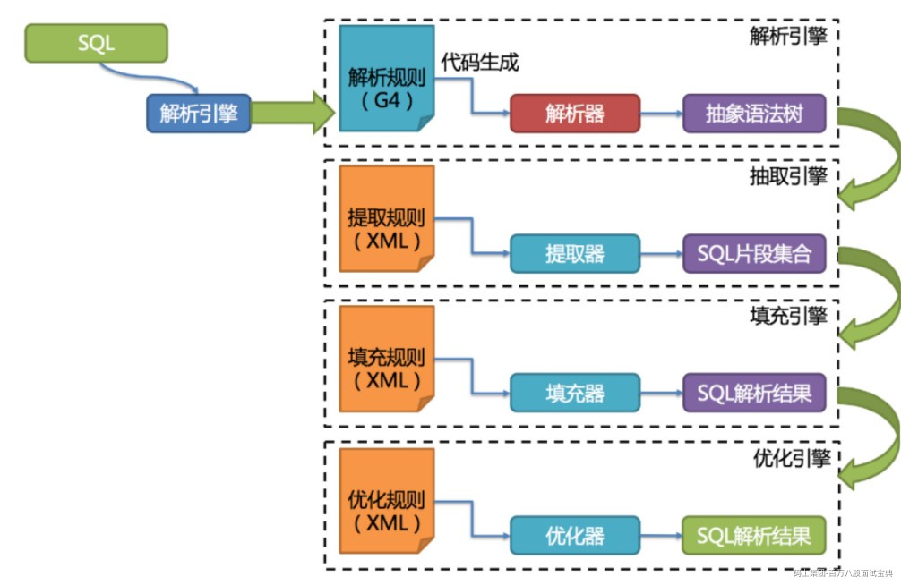

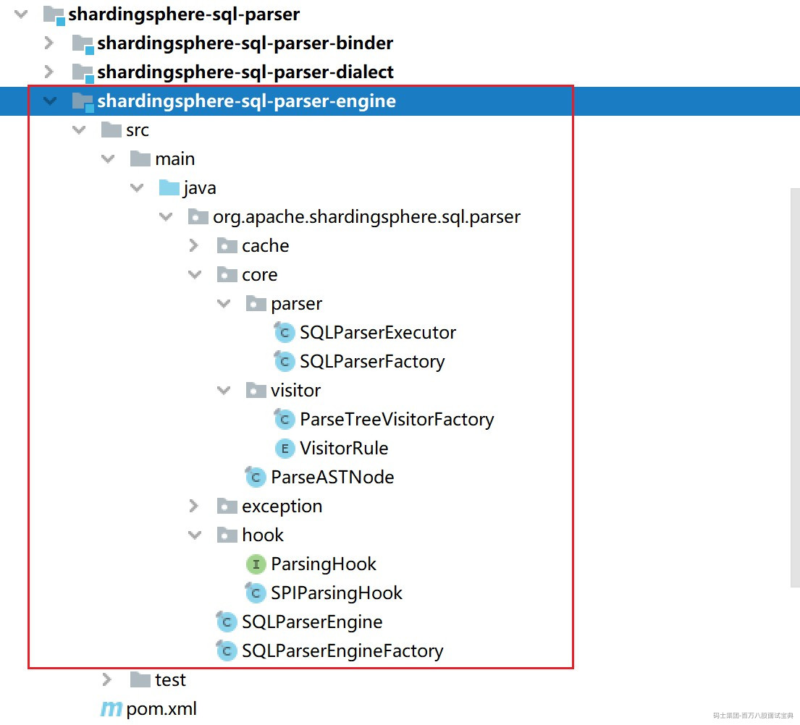

#### 3.5.1.5 源代码分析

TestSharding中添加查询的方法

public class TestSharding {

public static void executeQuery(DataSource ds, String sql) throws Exception {

Connection conn = ds.getConnection();

Statement stat = conn.prepareStatement(sql);

ResultSet result = stat.executeQuery(sql);

while (result.next()) {

System.out.println(result.getLong(1)+"\t|\t"+result.getInt(2)

+"\t|\t"+result.getString(3));

System.out.println("----------------------------------");

}

result.close();

stat.close();

}

public static void main(String[] args) {

try {

DataSource dataSource = ShardingDataSourceFactory.createDataSource(map, config, new Properties());

String sql2="select \* from t\_order order by oid";

System.out.println("查询结果为：");

executeQuery(dataSource,sql2);

} catch (Exception ex) {

ex.printStackTrace();

}

}

}

##### 1.ShardingConnection

ShardingDataSource通过构造方法创建ShardingConnection。

@Getter

public class ShardingDataSource extends AbstractDataSourceAdapter {

private final ShardingRuntimeContext runtimeContext;

public ShardingDataSource(final Map<String, DataSource> dataSourceMap, final ShardingRule shardingRule, final Properties props) throws SQLException {

//获取数据库类型

super(dataSourceMap);

//检查数据库类型

checkDataSourceType(dataSourceMap);

runtimeContext = new ShardingRuntimeContext(dataSourceMap, shardingRule, props, getDatabaseType());

}

@Override

public final ShardingConnection getConnection() {

// TransactionTypeHolder持有ThreadLocal，用于设置事务类型，默认LOCAL

return new ShardingConnection(getDataSourceMap(), runtimeContext, TransactionTypeHolder.get());

}

}

ShardingConnection构造方法。

@Getter

public final class ShardingConnection extends AbstractConnectionAdapter {

//数据源map

private final Map<String, DataSource> dataSourceMap;

//sharding-jdbc 运行上下文对象

private final ShardingRuntimeContext runtimeContext;

// 事务类型 默认LOCAL

private final TransactionType transactionType;

//事务管理器 默认为null

private final ShardingTransactionManager shardingTransactionManager;

public ShardingConnection(final Map<String, DataSource> dataSourceMap, final ShardingRuntimeContext runtimeContext, final TransactionType transactionType) {

this.dataSourceMap = dataSourceMap;

this.runtimeContext = runtimeContext;

this.transactionType = transactionType;

shardingTransactionManager = runtimeContext.getShardingTransactionManagerEngine().getTransactionManager(transactionType);

}

}

ShardingConnection的继承关系与ShardingDataSource类似。AbstractUnsupportedOperationConnection实现了不支持的Connection接口方法（抛出异常），AbstractConnectionAdapter是sharding-jdbcConnection实现类的抽象父类，提供一些方法的默认实现。

##### 2. ShardingPreparedStatement

ShardingConnection创建ShardingPreparedStatement，把自己和sql传入ShardingPreparedStatement构造方法。

@Getter

public final class ShardingConnection extends AbstractConnectionAdapter {

@Override

public PreparedStatement prepareStatement(final String sql) throws SQLException {

return new ShardingPreparedStatement(this, sql);

}

}

**ShardingPreparedStatement构造方法**

public final class ShardingPreparedStatement extends AbstractShardingPreparedStatementAdapter {

@Getter

private final ShardingConnection connection;

private final String sql;

//ParameterMetaData占位符参数的元数据

@Getter

private final ParameterMetaData parameterMetaData;

//BasePrepareEngine非常重要，在它的唯一public方法中实现了解析、路由、重写三个重要步骤

private final BasePrepareEngine prepareEngine;

//PreparedStatementExecutor继承AbstractStatementExecutor抽象类负责执行sql

private final PreparedStatementExecutor preparedStatementExecutor;

//批量执行SQL

private final BatchPreparedStatementExecutor batchPreparedStatementExecutor;

private final Collection<Comparable<?>> generatedValues = new LinkedList<>();

private ExecutionContext executionContext;

private ResultSet currentResultSet;

//connection调用的构造方法

public ShardingPreparedStatement(final ShardingConnection connection, final String sql) throws SQLException {

//调用了下面的构造方法

this(connection, sql, ResultSet.TYPE\_FORWARD\_ONLY, ResultSet.CONCUR\_READ\_ONLY, ResultSet.HOLD\_CURSORS\_OVER\_COMMIT, false);

}

//真正执行的构造

private ShardingPreparedStatement(final ShardingConnection connection, final String sql,

final int resultSetType, final int resultSetConcurrency, final int resultSetHoldability, final boolean returnGeneratedKeys) throws SQLException {

if (Strings.isNullOrEmpty(sql)) {

throw new SQLException(SQLExceptionConstant.SQL\_STRING\_NULL\_OR\_EMPTY);

}

this.connection = connection;

this.sql = sql;

ShardingRuntimeContext runtimeContext = connection.getRuntimeContext();

// ParameterMetaData

parameterMetaData = new ShardingParameterMetaData(runtimeContext.getSqlParserEngine(), sql);

// PreparedQueryPrepareEngine

prepareEngine = new PreparedQueryPrepareEngine(runtimeContext.getRule().toRules(), runtimeContext.getProperties(), runtimeContext.getMetaData(), runtimeContext.getSqlParserEngine());

// PreparedStatementExecutor

preparedStatementExecutor = new PreparedStatementExecutor(resultSetType, resultSetConcurrency, resultSetHoldability, returnGeneratedKeys, connection);

// BatchPreparedStatementExecutor

batchPreparedStatementExecutor = new BatchPreparedStatementExecutor(resultSetType, resultSetConcurrency, resultSetHoldability, returnGeneratedKeys, connection);

}

}

**ShardingPreparedStatement构造方法说明**

**1) ShardingParameterMetaData**

- ParameterMetaData占位符参数的元数据。 构造时传入了ShardingRuntimeContext持有的SQLParserEngine。
- 对于ShardingParameterMetaData来说只支持一个方法getParameterCount，getParameterCount获取sql中占位符个数。

public final class ShardingParameterMetaData extends AbstractUnsupportedOperationParameterMetaData {

private final SQLParserEngine sqlParserEngine;

private final String sql;

@Override

public int getParameterCount() {

return sqlParserEngine.parse(sql, true).getParameterCount();

}

}

**2) BasePrepareEngine**

BasePrepareEngine非常重要，在它的唯一public方法中实现了解析、路由、重写三个重要步骤。

@RequiredArgsConstructor

public abstract class BasePrepareEngine {

private final Collection<BaseRule> rules;

private final ConfigurationProperties properties;

private final ShardingSphereMetaData metaData;

private final DataNodeRouter router;

private final SQLRewriteEntry rewriter;

public BasePrepareEngine(final Collection<BaseRule> rules, final ConfigurationProperties properties, final ShardingSphereMetaData metaData, final SQLParserEngine parser) {

this.rules = rules;

this.properties = properties;

this.metaData = metaData;

router = new DataNodeRouter(metaData, properties, parser);

rewriter = new SQLRewriteEntry(metaData.getSchema(), properties);

}

}

BasePrepareEngine构造方法，创建DataNodeRouter，负责路由；创建SQLRewriteEntry，负责创建SQLRewriteContext重写上下文。

BasePrepareEngine的实现类有两个：

- PreparedQueryPrepareEngine：处理PrepareStatement。
- SimpleQueryPrepareEngine：处理Statement。

**3) PreparedStatementExecutor**

PreparedStatementExecutor继承AbstractStatementExecutor抽象类负责执行sql，下面是该类的构造方法。

public final class PreparedStatementExecutor extends AbstractStatementExecutor {

@Getter

private final boolean returnGeneratedKeys;

public PreparedStatementExecutor(

final int resultSetType, final int resultSetConcurrency, final int resultSetHoldability, final boolean returnGeneratedKeys, final ShardingConnection shardingConnection) {

super(resultSetType, resultSetConcurrency, resultSetHoldability, shardingConnection);

this.returnGeneratedKeys = returnGeneratedKeys;

}

}

**4) 占位符填充**

ShardingPreparedStatement的抽象父类AbstractShardingPreparedStatementAdapter实现了填充占位符的功能。

public abstract class AbstractShardingPreparedStatementAdapter extends AbstractUnsupportedOperationPreparedStatement {

private final List<SetParameterMethodInvocation> setParameterMethodInvocations = new LinkedList<>();

@Getter

private final List<Object> parameters = new ArrayList<>();

@Override

public final void setLong(final int parameterIndex, final long x) {

setParameter(parameterIndex, x);

}

}

AbstractShardingPreparedStatementAdapter的setXXX方法都是将参数保存到parameters这个列表中。

private void setParameter(final int parameterIndex, final Object value) {

if (parameters.size() == parameterIndex - 1) {

parameters.add(value);

return;

}

for (int i = parameters.size(); i <= parameterIndex - 1; i++) {

parameters.add(null);

}

parameters.set(parameterIndex - 1, value);

}

##### 3.SQL解析入口

执行SQL（preparedStatement.execute）是针对于用户而言的，实际上ShardingPrepareStatement在这个阶段做了四个重要操作：**解析、路由、重写、执行**。

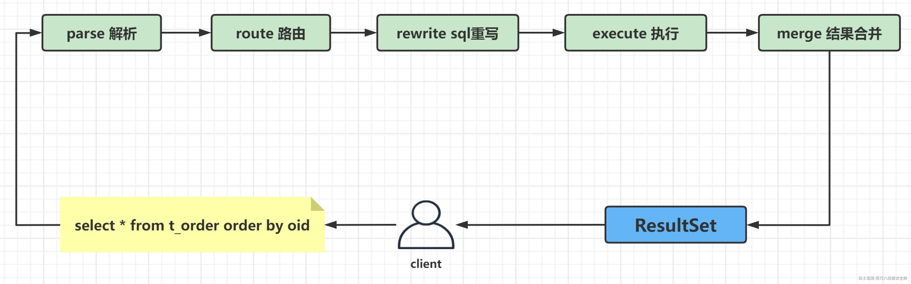

public final class ShardingPreparedStatement extends AbstractShardingPreparedStatementAdapter {

private final PreparedStatementExecutor preparedStatementExecutor;

@Override

public boolean execute() throws SQLException {

try {

// 资源清理

clearPrevious();

//解析 路由 重写

prepare();

//初始化 PreparedStatementExecutor

initPreparedStatementExecutor();

//执行SQL

return preparedStatementExecutor.execute();

} finally {

//资源清理

clearBatch();

}

}

}

###### **1) 资源清理**

PreparedStatementExecutor的抽象父类AbstractStatementExecutor实现了clear方法，主要是清空各种集合。

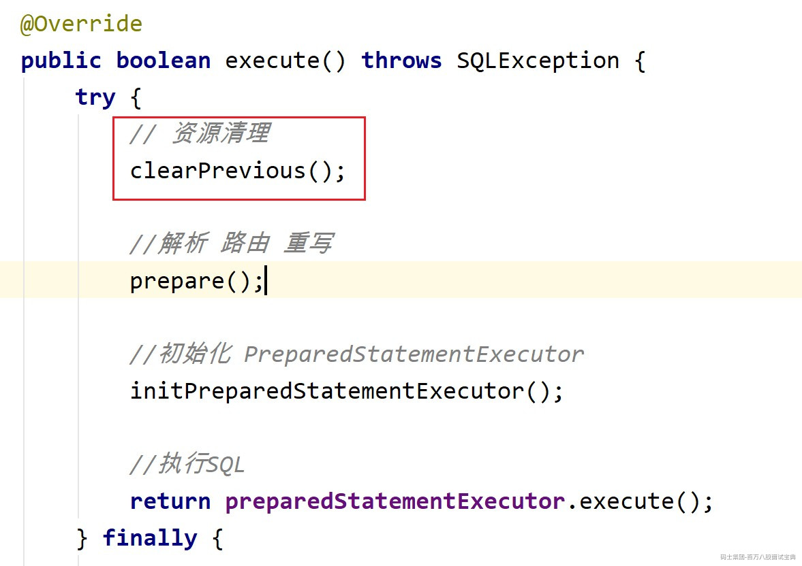

ShardingPreparedStatement#clearPrevious

private void clearPrevious() throws SQLException {

preparedStatementExecutor.clear();

}

@Getter

public abstract class AbstractStatementExecutor {

//数据库连接集合

private final Collection<Connection> connections = new LinkedList<>();

//参数列表集合,最外层的List下标与statements的下标对应

private final List<List<Object>> parameterSets = new LinkedList<>();

//Statement 集合

private final List<Statement> statements = new LinkedList<>();

//ResultSet集合

private final List<ResultSet> resultSets = new CopyOnWriteArrayList<>();

// StatementExecuteUnit集合

private final Collection<InputGroup<StatementExecuteUnit>> inputGroups = new LinkedList<>();

public void clear() throws SQLException {

clearStatements(); //关闭所有Statement

statements.clear();

parameterSets.clear();

connections.clear();

resultSets.clear();

inputGroups.clear();

}

private void clearStatements() throws SQLException {

for (Statement each : getStatements()) {

each.close();

}

}

}

###### **2) BasePrepareEngine#prepare**

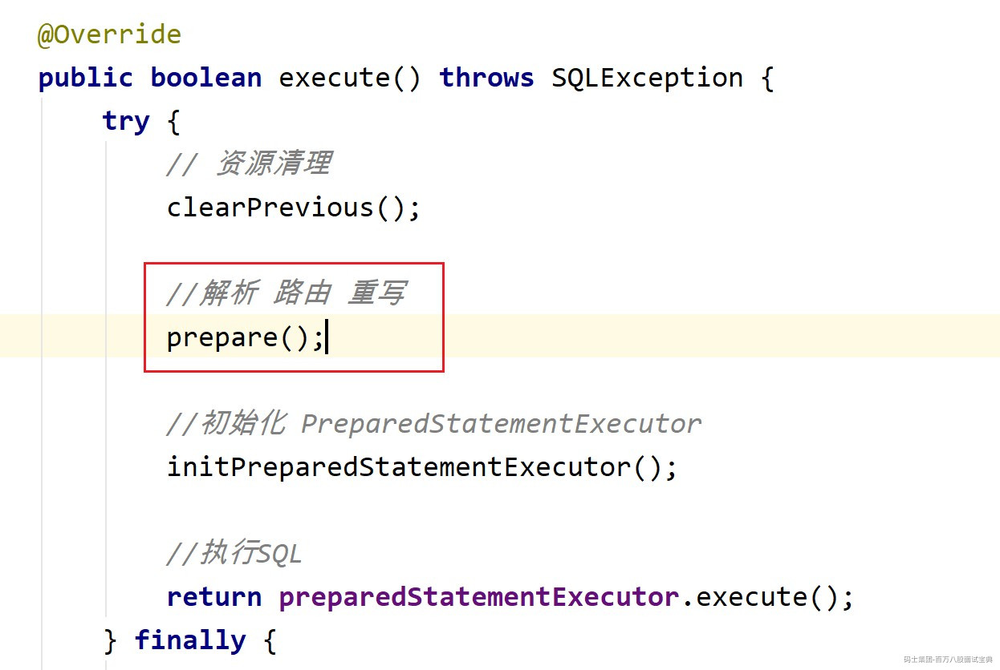

public final class ShardingPreparedStatement extends AbstractShardingPreparedStatementAdapter {

private final String sql;

private final BasePrepareEngine prepareEngine;

private ExecutionContext executionContext;

private void prepare() {

// 解析 路由 重写

executionContext = prepareEngine.prepare(sql, getParameters());

// 从executionContext取出生成的主键ID放入generatedValues

findGeneratedKey().ifPresent(generatedKey -> generatedValues.add(generatedKey.getGeneratedValues().getLast()));

}

}

BasePrepareEngine的prepare方法包含解析、路由、重写三个核心逻辑。

public abstract class BasePrepareEngine {

public ExecutionContext prepare(final String sql, final List<Object> parameters) {

// 拷贝一份参数列表

List<Object> clonedParameters = cloneParameters(parameters);

// 解析 & 路由

RouteContext routeContext = executeRoute(sql, clonedParameters);

ExecutionContext result = new ExecutionContext(routeContext.getSqlStatementContext());

// 重写

result.getExecutionUnits().addAll(executeRewrite(sql, clonedParameters, routeContext));

// 打印SQL

if (properties.<Boolean>getValue(ConfigurationPropertyKey.SQL\_SHOW)) {

SQLLogger.logSQL(sql, properties.<Boolean>getValue(ConfigurationPropertyKey.SQL\_SIMPLE), result.getSqlStatementContext(), result.getExecutionUnits());

}

return result;

}

}

**ExecutionContext**

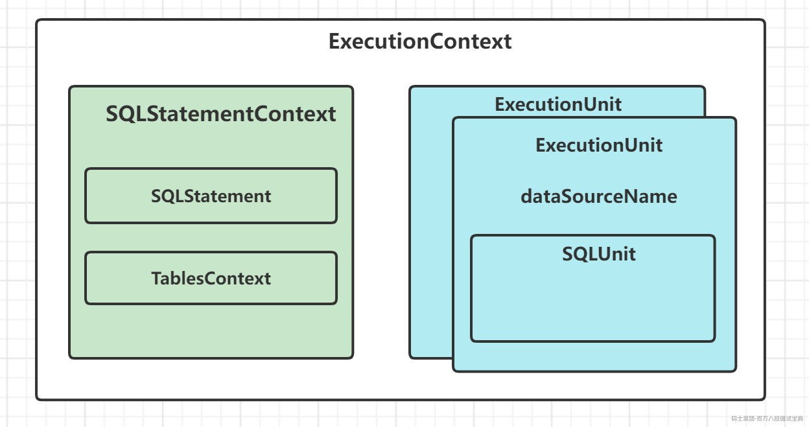

解析、路由、重写的相关信息最终会被封装到ExecutionContext，代表sql执行的上下文。

@RequiredArgsConstructor

@Getter

public class ExecutionContext {

private final SQLStatementContext sqlStatementContext;

private final Collection<ExecutionUnit> executionUnits = new LinkedHashSet<>();

}

**SQLStatementContext**

SQLStatementContext能获取SQLStatement和TablesContext。

public interface SQLStatementContext<T extends SQLStatement> {

/\*\*

\* Get SQL statement.

\*

\* @return SQL statement

\*/

T getSqlStatement();

/\*\*

\* Get tables context.

\*

\* @return tables context

\*/

TablesContext getTablesContext();

}

SQLStatementContext的实现类是很多具体类型SQL对应的上下文对象, 例如SelectStatementContext包括查询字段（ProjectionsContext）、分组（GroupByContext）、排序（OrderByContext）、分页（PaginationContext）、表（TablesContext）等等。

@Getter

public final class SelectStatementContext extends CommonSQLStatementContext<SelectStatement> implements TableAvailable, WhereAvailable {

private final TablesContext tablesContext;

private final ProjectionsContext projectionsContext;

private final GroupByContext groupByContext;

private final OrderByContext orderByContext;

private final PaginationContext paginationContext;

private final boolean containsSubquery;

}

**ExecutionUnit**

ExecutionContext执行上下文中包含多个ExecutionUnit执行单元。

每个ExecutionUnit执行单元对应某个dataSource（如db\_1）的一个SQLUnitSQL单元。

public final class ExecutionUnit {

private final String dataSourceName;

private final SQLUnit sqlUnit;

}

每个SQLUnitSQL单元对应一个重写完成的sql（包含？占位符）和一个parameters参数列表。

public final class SQLUnit {

private final String sql;

private final List<Object> parameters;

}

###### 3) BasePrepareEngine#executeRoute

BasePrepareEngine的executeRoute方法先将RouteDecorator注册到DataNodeRouter实例中，然后调用子类实现的route方法。

public abstract class BasePrepareEngine {

private final Collection<BaseRule> rules;

private final DataNodeRouter router;

private RouteContext executeRoute(final String sql, final List<Object> clonedParameters) {

// 向DataNodeRouter实例中注册BaseRule对应的RouteDecorator

registerRouteDecorator();

// 解析 & 路由 子类实现

return route(router, sql, clonedParameters);

}

private void registerRouteDecorator() {

// 循环所有通过SPI机制注册的RouteDecorator的实现类Class

for (Class<? extends RouteDecorator> each : OrderedRegistry.getRegisteredClasses(RouteDecorator.class)) {

// 反射实例化这个RouteDecorator 省略

RouteDecorator routeDecorator = createRouteDecorator(each);

// 获取这个RouteDecorator支持的BaseRule的Class

Class<?> ruleClass = (Class<?>) routeDecorator.getType();

// 过滤出Collection<BaseRule> rules中这个RouteDecorator支持的BaseRule实例

// 把这个BaseRule和routeDecorator的对应关系注册到DataNodeRouter

rules.stream().filter(rule -> rule.getClass() == ruleClass || rule.getClass().getSuperclass() == ruleClass).collect(Collectors.toList())

.forEach(rule -> router.registerDecorator(rule, routeDecorator));

}

}

protected abstract RouteContext route(DataNodeRouter dataNodeRouter, String sql, List<Object> parameters);

}

PreparedQueryPrepareEngine对route方法的实现，就是直接调用DataNodeRouter的route方法，第三个参数传true表示启用sql解析缓存。

public final class PreparedQueryPrepareEngine extends BasePrepareEngine {

@Override

protected RouteContext route(final DataNodeRouter dataNodeRouter, final String sql, final List<Object> parameters) {

return dataNodeRouter.route(sql, parameters, true);

}

}

DataNodeRouter通过SQLParserEngine解析SQLStatement，通过RouteDecorator路由。

public final class DataNodeRouter {

// 包含数据源和表结构信息

private final ShardingSphereMetaData metaData;

// 配置信息

private final ConfigurationProperties properties;

// SQL解析引擎

private final SQLParserEngine parserEngine;

// BaseRule-RouteDecorator映射关系，BasePrepareEngine注入

private final Map<BaseRule, RouteDecorator> decorators = new LinkedHashMap<>();

// SPI钩子 暴露给用户的扩展点

private SPIRoutingHook routingHook = new SPIRoutingHook();

public RouteContext route(final String sql, final List<Object> parameters, final boolean useCache) {

// 执行所有RoutingHook的start方法

routingHook.start(sql);

try {

// 解析 & 路由

RouteContext result = executeRoute(sql, parameters, useCache);

// 执行所有RoutingHook的finishSuccess方法

routingHook.finishSuccess(result, metaData.getSchema());

return result;

} catch (final Exception ex) {

// 执行所有RoutingHook的finishFailure方法

routingHook.finishFailure(ex);

throw ex;

}

}

private RouteContext executeRoute(final String sql, final List<Object> parameters, final boolean useCache) {

// 解析

RouteContext result = createRouteContext(sql, parameters, useCache);

// 路由

for (Entry<BaseRule, RouteDecorator> entry : decorators.entrySet()) {

result = entry.getValue().decorate(result, metaData, entry.getKey(), properties);

}

return result;

}

}

##### 4.SQL解析流程

org.apache.shardingsphere.underlying.route.DataNodeRouter#createRouteContext

private RouteContext createRouteContext(final String sql, final List<Object> parameters, final boolean useCache) {

//将sql解析为SQLStatement，生成SQL对应AST

SQLStatement sqlStatement = parserEngine.parse(sql, useCache);

try {

// 生成SQL Statement上下文

SQLStatementContext sqlStatementContext = SQLStatementContextFactory.newInstance(metaData.getSchema(), sql, parameters, sqlStatement);

// 返回初始化的路由上下文

return new RouteContext(sqlStatementContext, parameters, new RouteResult());

// TODO should pass parameters for master-slave

} catch (final IndexOutOfBoundsException ex) {

return new RouteContext(new CommonSQLStatementContext(sqlStatement), parameters, new RouteResult());

}

}

进入SQLParserEngine类中 org.apache.shardingsphere.sql.parser.SQLParserEngine

SQLParserEngine真正执行解析SQL，这个SQLParserEngine正是之前在创建ShardingRuntimeContext时构造的SQLParserEngine。

@RequiredArgsConstructor

public final class SQLParserEngine {

//数据库类型名称 例如Mysql

private final String databaseTypeName;

//缓存SQL --> SQLStatement

private final SQLParseResultCache cache = new SQLParseResultCache();

public SQLStatement parse(final String sql, final boolean useCache) {

//ParsingHook接口可以在sql解析前后进行扩展即可

ParsingHook parsingHook = new SPIParsingHook();

parsingHook.start(sql); //获取解析前的逻辑SQL

try {

// 解析SQL 调用parse0

SQLStatement result = parse0(sql, useCache);

parsingHook.finishSuccess(result); //获取逻辑SQL解析的结果

return result;

// CHECKSTYLE:OFF

} catch (final Exception ex) {

// CHECKSTYLE:ON

parsingHook.finishFailure(ex); //执行失败 获取异常信息

throw ex;

}

}

private SQLStatement parse0(final String sql, final boolean useCache) {

// 尝试从缓存中获取解析的SQLStatement

if (useCache) {

Optional<SQLStatement> cachedSQLStatement = cache.getSQLStatement(sql);

if (cachedSQLStatement.isPresent()) {

return cachedSQLStatement.get();

}

}

// 构建ParseTree

ParseTree parseTree = new SQLParserExecutor(databaseTypeName, sql).execute().getRootNode();

// 构建SQLStatement

SQLStatement result = (SQLStatement) ParseTreeVisitorFactory.newInstance(databaseTypeName, VisitorRule.valueOf(parseTree.getClass())).visit(parseTree);

// 放入缓存

if (useCache) {

cache.put(sql, result);

}

return result;

}

}

可以看到SQLParserEngine# parse方法操作有两个：

1.创建SQLParserExecutor对象将SQL解析成antlr的ParseTree；

1. 通过解析树访问器工厂类ParseTreeVisitorFactory创建ParseTreeVisitor实例将antlr的ParseTree对象转化为ShardingSphere自定义的SQLStatement对象。

这里具体解析流程我们就不去看了,大致步骤如下

// 1. 创建SQLParserExecutor

SQLParserExecutor sqlParserExecutor = new SQLParserExecutor(databaseTypeName, sql);

// 2. 根据不同的数据库类型（例如MySQLStatementParser#execute）创建解析树

ParseASTNode astNode = sqlParserExecutor.execute();

ParseTree parseTree = astNode.getRootNode();

// 3. 通过不同的数据库类型创建org.antlr.v4.runtime.tree.ParseTreeVisitor

ParseTreeVisitor parseTreeVisitor = ParseTreeVisitorFactory.newInstance(databaseTypeName, VisitorRule.valueOf(parseTree.getClass()));

// 4. 执行visit方法，最终将解析树转换为SQLStatement

SQLStatement result = (SQLStatement) parseTreeVisitor.visit(parseTree);

以SelectStatement举例

public final class SelectStatement extends DMLStatement {

//字段

private ProjectionsSegment projections;

//表

private final Collection<TableReferenceSegment> tableReferences = new LinkedList<>();

//where

private WhereSegment where;

//分组

private GroupBySegment groupBy;

//排序

private OrderBySegment orderBy;

//分页

private LimitSegment limit;

//父statement

private SelectStatement parentStatement;

//锁

private LockSegment lock;

}

最后到回到org.apache.shardingsphere.underlying.route.DataNodeRouter#createRouteContext方法，在调用完 parserEngine.parse方法（前面已分析完）之后通过 SQLStatementContextFactory. newInstance方法将SQLStatement转换为SQLStatementContext对象。

private RouteContext createRouteContext(final String sql, final List<Object> parameters, final boolean useCache) {

SQLStatement sqlStatement = parserEngine.parse(sql, useCache);//解析SQL，生成SQL对应AST

try {

SQLStatementContext sqlStatementContext = SQLStatementContextFactory.newInstance(metaData.getSchema(), sql, parameters, sqlStatement);// 生成SQL Statement上下文，相当于一部分语义分析

return new RouteContext(sqlStatementContext, parameters, new RouteResult());

// TODO should pass parameters for master-slave

} catch (final IndexOutOfBoundsException ex) {

return new RouteContext(new CommonSQLStatementContext(sqlStatement), parameters, new RouteResult());

}

}

SQLStatementContext类相当于SQLStatement的二次处理类，它也是后续路由、改写等环节间传递的上下文对象，每种Context往往对应一个ContextEngine，与SQLStatement不同的是，这些Context对象已经包含了部分语义分析处理的逻辑，例如会根据需要生成衍生projection列，avg聚合函数会添加count、sum列，分页上下文时会添加生成修改后的offset和rowcount等。

/\*\*

\* SQL statement context factory.

\*/

@NoArgsConstructor(access = AccessLevel.PRIVATE)

public final class SQLStatementContextFactory {

/\*\*

\* Create SQL statement context.

\*

\* @param schemaMetaData table meta data

\* @param sql SQL

\* @param parameters SQL parameters

\* @param sqlStatement SQL statement

\* @return SQL statement context

\*/

@SuppressWarnings("unchecked")

public static SQLStatementContext newInstance(final SchemaMetaData schemaMetaData, final String sql, final List<Object> parameters, final SQLStatement sqlStatement) {

if (sqlStatement instanceof DMLStatement) {

return getDMLStatementContext(schemaMetaData, sql, parameters, (DMLStatement) sqlStatement);

}

if (sqlStatement instanceof DDLStatement) {

return getDDLStatementContext((DDLStatement) sqlStatement);

}

if (sqlStatement instanceof DCLStatement) {

return getDCLStatementContext((DCLStatement) sqlStatement);

}

if (sqlStatement instanceof DALStatement) {

return getDALStatementContext((DALStatement) sqlStatement);

}

return new CommonSQLStatementContext(sqlStatement);

}

private static SQLStatementContext getDMLStatementContext(final SchemaMetaData schemaMetaData, final String sql, final List<Object> parameters, final DMLStatement sqlStatement) {

if (sqlStatement instanceof SelectStatement) {

return new SelectStatementContext(schemaMetaData, sql, parameters, (SelectStatement) sqlStatement);

}

if (sqlStatement instanceof UpdateStatement) {

return new UpdateStatementContext((UpdateStatement) sqlStatement);

}

if (sqlStatement instanceof DeleteStatement) {

return new DeleteStatementContext((DeleteStatement) sqlStatement);

}

if (sqlStatement instanceof InsertStatement) {

return new InsertStatementContext(schemaMetaData, parameters, (InsertStatement) sqlStatement);

}

throw new UnsupportedOperationException(String.format("Unsupported SQL statement `%s`", sqlStatement.getClass().getSimpleName()));

}

…

}

可以看到newInstance方法中会根据不同的SQL类型，创建对应的StatementContext实例。看下最常用的SelectStatementContext类.

/\*\*

\* Select SQL statement context.

\*/

@Getter

@ToString(callSuper = true)

public final class SelectStatementContext extends CommonSQLStatementContext<SelectStatement> implements TableAvailable, WhereAvailable {

private final TablesContext tablesContext;

private final ProjectionsContext projectionsContext;

private final GroupByContext groupByContext;

private final OrderByContext orderByContext;

private final PaginationContext paginationContext;

private final boolean containsSubquery;

…

public SelectStatementContext(final SchemaMetaData schemaMetaData, final String sql, final List<Object> parameters, final SelectStatement sqlStatement) {

super(sqlStatement);

tablesContext = new TablesContext(sqlStatement.getSimpleTableSegments());// 创建表名上下文

groupByContext = new GroupByContextEngine().createGroupByContext(sqlStatement);// 创建group by上下文

orderByContext = new OrderByContextEngine().createOrderBy(sqlStatement, groupByContext);// 创建order by上下文

projectionsContext = new ProjectionsContextEngine(schemaMetaData).createProjectionsContext(sql, sqlStatement, groupByContext, orderByContext);// 创建projection上下文

paginationContext = new PaginationContextEngine().createPaginationContext(sqlStatement, projectionsContext, parameters);// 创建分页上下文

containsSubquery = containsSubquery();

}…

}

可以看到在SelectStatementContext的构造函数中，创建了Select语句对应的所有上下文相关信息，包括projectionContext、tableContext、OrderByContext等。

#### 总结

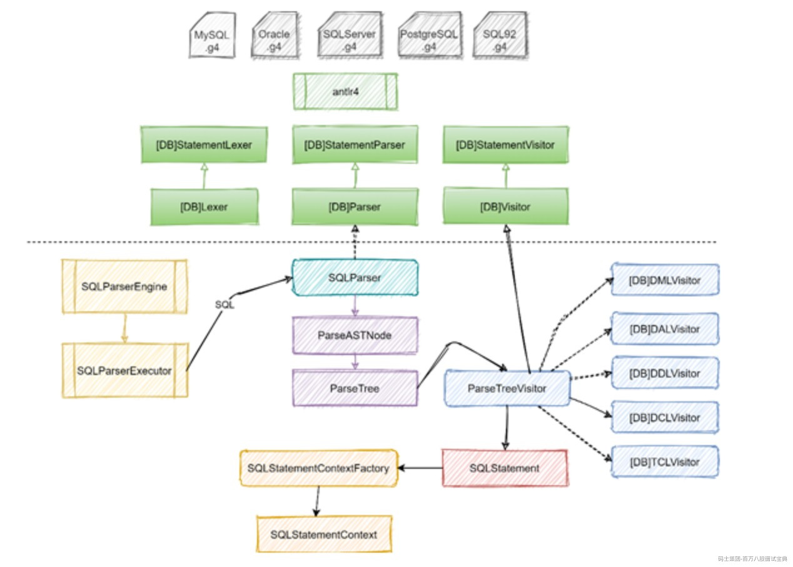

- 对于dataSource.getConnection，ShardingDataSource创建的Connection实现类是ShardingConnection，它持有数据源Map和分片运行时上下文。
- 对于connection.prepareStatement，ShardingConnection创建的PrepareStatement实现类是ShardingPrepareStatement，execute方法执行了四个关键操作，即**解析、路由、重写、执行**。
- **SQLParserEngine**的parse0方法是sql解析的核心逻辑，利用antlr（Another Tool for Language Recognition）做词法解析和语法解析，把sql转换为SQLStatement。

### 3.5.2 路由引擎router分析

#### 3.5.2.1 路由引擎介绍

无论是分库分表、还是读写分离，一个SQL在DB上执行前都需要经过特定规则运算获得运行的目标库表信息。

路由引擎的职责定位就是计算SQL应该在哪个数据库、哪个表上执行。

- 前者结果会传给后续执行引擎，然后根据其数据库标识获取对应的数据库连接。
- 后者结果则会传给改写引擎在SQL执行前进行表名的改写，即替换为正确的物理表名。

计算哪个数据库依据的算法是要用户配置的库路由规则，计算哪个表依据的算法是用户配置的表路由规则。

目前在ShardingSphere中需要进行路由的功能模块有两个：分库分表sharding与读写分离master-slave。

#### 3.5.2.2 源代码执行分析

##### 1.DataNodeRouter

回到DataNodeRouter的executeRoute方法，此时已经完成SQL解析工作，createRouteContext方法构造的RouteContext中包含SQLStatementContext、params（参数列表）、new RouteResult()（一个空的路由结果）。

@RequiredArgsConstructor

public final class DataNodeRouter {

//SQL解析引擎

private final SQLParserEngine parserEngine;

// BaseRule-RouteDecorator映射关系，BasePrepareEngine注入

private final Map<BaseRule, RouteDecorator> decorators = new LinkedHashMap<>();

@SuppressWarnings("unchecked")

private RouteContext executeRoute(final String sql, final List<Object> parameters, final boolean useCache) {

//解析

RouteContext result = createRouteContext(sql, parameters, useCache);

//路由

for (Entry<BaseRule, RouteDecorator> entry : decorators.entrySet()) {

result = entry.getValue().decorate(result, metaData, entry.getKey(), properties);

}

return result;

}

private RouteContext createRouteContext(final String sql, final List<Object> parameters, final boolean useCache) {

//解析SQL，生成SQL对应AST

SQLStatement sqlStatement = parserEngine.parse(sql, useCache);

try {

// 生成SQL Statement上下文，相当于一部分语义分析

SQLStatementContext sqlStatementContext = SQLStatementContextFactory.newInstance(metaData.getSchema(), sql, parameters, sqlStatement);

return new RouteContext(sqlStatementContext, parameters, new RouteResult());

// TODO should pass parameters for master-slave

} catch (final IndexOutOfBoundsException ex) {

return new RouteContext(new CommonSQLStatementContext(sqlStatement), parameters, new RouteResult());

}

}

}

BasePrepareEngine类中，在进行路由操作前先进行了路由装饰器的注册

decorators是在BasePrepareEngine#registerRouteDecorator方法执行时，注册的BaseRule和RouteDecorator的映射关系。

//注册路由装饰器

private void registerRouteDecorator() {

//SPI机制注册 RouteDecorator 的实现类class

for (Class<? extends RouteDecorator> each : OrderedRegistry.getRegisteredClasses(RouteDecorator.class)) {

//通过反射创建

RouteDecorator routeDecorator = createRouteDecorator(each);

//获取这个路由对象支持的 分片规则 BaseRule

Class<?> ruleClass = (Class<?>) routeDecorator.getType();

//过滤rules中的routeDecorator支持的具体BaseRule实例

//把BaseRule和routeDecorator对应关系 注册到DataNodeRouter

rules.stream().filter(rule -> rule.getClass() == ruleClass || rule.getClass().getSuperclass() == ruleClass).collect(Collectors.toList())

.forEach(rule -> router.registerDecorator(rule, routeDecorator));

}

}

到此并未看到分库分表或者主从时真正的路由逻辑，其实这些操作都放到了这些RouteDecorator，看下RouterDecorator接口的实现类。

RouteDecorator的实现类目前只有两个分别对应数据分片ShardingRouteDecorator和主从MasterSlaveRouteDecorator。

这里我们只去看下分库分表功能对应的路由修饰器类ShardingRouteDecorator类。

##### 2. ShardingRouteDecorator

ShardingRouteDecorator是路由的核心处理类，其中最关键的步骤是：

- getShardingConditions：通过sql上下文，解析where条件，得到RouteValue放入ShardingCondition。
- 获取路由引擎
- 执行路由引擎

public final class ShardingRouteDecorator implements RouteDecorator<ShardingRule> {

@SuppressWarnings("unchecked")

@Override

public RouteContext decorate(final RouteContext routeContext, final ShardingSphereMetaData metaData, final ShardingRule shardingRule, final ConfigurationProperties properties) {

// SQL上下文 SQLParserEngine解析SQL DataNodeRouter创建

SQLStatementContext sqlStatementContext = routeContext.getSqlStatementContext();

// 参数列表

List<Object> parameters = routeContext.getParameters();

//对SQL进行验证，主要用于判断一些不支持的SQL

ShardingStatementValidatorFactory.newInstance(

sqlStatementContext.getSqlStatement()).ifPresent(validator -> validator.validate(shardingRule, sqlStatementContext.getSqlStatement(), parameters));

//获取SQL的条件信息，创建ShardingConditions 包含很多RouteValue 用于route

ShardingConditions shardingConditions = getShardingConditions(parameters, sqlStatementContext, metaData.getSchema(), shardingRule);

// 合并shardingConditions

boolean needMergeShardingValues = isNeedMergeShardingValues(sqlStatementContext, shardingRule);

if (sqlStatementContext.getSqlStatement() instanceof DMLStatement && needMergeShardingValues) {

checkSubqueryShardingValues(sqlStatementContext, shardingRule, shardingConditions);

mergeShardingConditions(shardingConditions);

}

//获取路由引擎---->创建分片路由引擎

ShardingRouteEngine shardingRouteEngine = ShardingRouteEngineFactory.newInstance(shardingRule, metaData, sqlStatementContext, shardingConditions, properties);

//执行路由引擎---->进行路由生成路由结果

RouteResult routeResult = shardingRouteEngine.route(shardingRule);

if (needMergeShardingValues) {

Preconditions.checkState(1 == routeResult.getRouteUnits().size(), "Must have one sharding with subquery.");

}

return new RouteContext(sqlStatementContext, parameters, routeResult);

}

##### 3.ShardingConditions

ShardingRouteDecorator中的getShardingConditions方法创建ShardingConditions。

private ShardingConditions getShardingConditions(final List<Object> parameters,

final SQLStatementContext sqlStatementContext, final SchemaMetaData schemaMetaData, final ShardingRule shardingRule) {

//当前是否是DML

if (sqlStatementContext.getSqlStatement() instanceof DMLStatement) {

//是否是插入

if (sqlStatementContext instanceof InsertStatementContext) {

return new ShardingConditions(new InsertClauseShardingConditionEngine(shardingRule).createShardingConditions((InsertStatementContext) sqlStatementContext, parameters));

}

//不是插入，对于Select语句走这里，根据where子句过滤出需要执行分片策略的表和对应的字段

return new ShardingConditions(new WhereClauseShardingConditionEngine(shardingRule, schemaMetaData).createShardingConditions(sqlStatementContext, parameters));

}

return new ShardingConditions(Collections.emptyList());

}

ShardingConditions很重要，它包含了RouteValue，各种ShardingStrategy分片策略的doSharding方法都需要用到。而RouteValue也是ShardingValue的雏形，各种ShardingAlgorithm分片算法需要用到。 ShardingConditions这个对象主要是用于确定本次执行的sql涉及的需要执行分片策略的表、字段、字段值。

public final class ShardingConditions {

private final List<ShardingCondition> conditions;

}

public class ShardingCondition {

private final List<RouteValue> routeValues = new LinkedList<>();

}

public interface RouteValue {

String getColumnName();

String getTableName();

}

// RouteValue的实现类ListRouteValue 处理 = in

public final class ListRouteValue<T extends Comparable<?>> implements RouteValue {

private final String columnName;

private final String tableName;

// 比如in语句 这里values就有多个值 比如=语句 这里就只有一个值

private final Collection<T> values;

}

// RouteValue的实现类RangeRouteValue 处理between and 和 < >

public final class RangeRouteValue<T extends Comparable<?>> implements RouteValue {

private final String columnName;

private final String tableName;

// 区间 比如[0,1]、[2, 3)、(1, 正无穷)等等

private final Range<T> valueRange;

}

##### 4. RouteResult

- RouteResult路由结果，在sql重写之前获取哪些有用信息。RouteResult代表路由结果，是RoutingEngine的产物。

public final class RouteResult {

//DataNode

private final Collection<Collection<DataNode>> originalDataNodes = new LinkedList<>();

//RouteUnits

private final Collection<RouteUnit> routeUnits = new LinkedHashSet<>();

}

一个RouteResult包含多个RouteUnit，一个RouteUnit对应一个数据源的路由结果。

public final class RouteUnit {

//dataSource

private final RouteMapper dataSourceMapper;

//table

private final Collection<RouteMapper> tableMappers;

}

RouteMapper代表逻辑名称与实际名称的映射关系，有了这个映射关系，sql重写才能够实现。

public final class RouteMapper {

private final String logicName;

private final String actualName;

}

此外RouteResult里还包含了多个DataNode，DataNode表示实际的数据节点，每个DataNode对应一个实际数据源名称和一个实际表名。

public final class DataNode {

//实际数据源名

private final String dataSourceName;

//实际表名

private final String tableName;

}

##### 5. ShardingRouteEngineFactory

ShardingRouteEngineFactory是ShardingRouteEngine的工厂类，会根据SQL类型创建不同ShardingRouteEngine，因为不同的类型的SQL对应着的不同的路由策略，例如全库路由、全库表路由、单库路由、标准路由等。 org.apache.shardingsphere.sharding.route.engine.type.ShardingRouteEngineFactory

/\*\*

\* Sharding routing engine factory.

\*/

@NoArgsConstructor(access = AccessLevel.PRIVATE)

public final class ShardingRouteEngineFactory {

/\*\*

\* Create new instance of routing engine.

\*

\* @param shardingRule sharding rule

\* @param metaData meta data of ShardingSphere

\* @param sqlStatementContext SQL statement context

\* @param shardingConditions shardingConditions

\* @param properties sharding sphere properties

\* @return new instance of routing engine

\*/

public static ShardingRouteEngine newInstance(final ShardingRule shardingRule,

final ShardingSphereMetaData metaData, final SQLStatementContext sqlStatementContext,

final ShardingConditions shardingConditions, final ConfigurationProperties properties) {

SQLStatement sqlStatement = sqlStatementContext.getSqlStatement();

Collection<String> tableNames = sqlStatementContext.getTablesContext().getTableNames();

//事务sql，如set autocommit = 0、commit、roolback等，走ShardingDatabaseBroadcastRoutingEngine数据源广播。

if (sqlStatement instanceof TCLStatement) {

return new ShardingDatabaseBroadcastRoutingEngine();

}

//DDL，如alter table t\_order modify column status varchar(255) DEFAULT NULL，会执行ShardingTableBroadcastRoutingEngine表广播

if (sqlStatement instanceof DDLStatement) {

return new ShardingTableBroadcastRoutingEngine(metaData.getSchema(), sqlStatementContext);

}

//show databases，走ShardingDatabaseBroadcastRoutingEngine数据源广播

if (sqlStatement instanceof DALStatement) {

return getDALRoutingEngine(shardingRule, sqlStatement, tableNames);

}

//DCLStatement，用户权限相关的sql，如grant授权。

if (sqlStatement instanceof DCLStatement) {

return getDCLRoutingEngine(sqlStatementContext, metaData);

}

//当所有表没有配置TableRule，也非广播表时，会取ShardingDefaultDatabaseRoutingEngine默认数据源路由引擎。

if (shardingRule.isAllInDefaultDataSource(tableNames)) {

return new ShardingDefaultDatabaseRoutingEngine(tableNames);

}

//当所有逻辑表都是广播表时，分两种情况。

//select语句，执行ShardingUnicastRoutingEngine单播。

//非select语句，执行ShardingDatabaseBroadcastRoutingEngine数据源广播。

if (shardingRule.isAllBroadcastTables(tableNames)) {

return sqlStatement instanceof SelectStatement ? new ShardingUnicastRoutingEngine(tableNames) : new ShardingDatabaseBroadcastRoutingEngine();

}

if (sqlStatementContext.getSqlStatement() instanceof DMLStatement && tableNames.isEmpty() && shardingRule.hasDefaultDataSourceName()) {

return new ShardingDefaultDatabaseRoutingEngine(tableNames);

}

if (sqlStatementContext.getSqlStatement() instanceof DMLStatement && shardingConditions.isAlwaysFalse() || tableNames.isEmpty() || !shardingRule.tableRuleExists(tableNames)) {

return new ShardingUnicastRoutingEngine(tableNames);

}

//最后一个判断

return getShardingRoutingEngine(shardingRule, sqlStatementContext, shardingConditions, tableNames, properties);

}

ShardingRouteEngineFactory中的getShardingRoutingEngine方法是DML最后一个判断逻辑，一般业务sql都是走这个方法。

private static ShardingRouteEngine getShardingRoutingEngine(final ShardingRule shardingRule, final SQLStatementContext sqlStatementContext,

final ShardingConditions shardingConditions, final Collection<String> tableNames, final ConfigurationProperties properties) {

//根据sql中的tableName 过滤出配置了TableRule的tableName

Collection<String> shardingTableNames = shardingRule.getShardingLogicTableNames(tableNames);

//如果过滤的表只有一个 或 这些表全在一个绑定规则里 走ShardingStandardRoutingEngine

if (1 == shardingTableNames.size() || shardingRule.isAllBindingTables(shardingTableNames)) {

return new ShardingStandardRoutingEngine(shardingTableNames.iterator().next(), sqlStatementContext, shardingConditions, properties);

}

// TODO config for cartesian set

//否则走ShardingComplexRoutingEngine

return new ShardingComplexRoutingEngine(tableNames, sqlStatementContext, shardingConditions, properties);

}

从上面的代码看出，如果涉及关联查询，要考虑配置绑定表关系，否则会进入ShardingComplexRoutingEngine。

##### 6. ShardingRouteEngine

ShardingRouteEngine只有一个route方法，就是通过一系列参数，获取RouteResult路由结果

public interface ShardingRouteEngine {

RouteResult route(ShardingRule shardingRule);

}

ShardingDatabaseBroadcastRoutingEngine，数据源广播，返回RouteResult包含所有数据源。

public final class ShardingDatabaseBroadcastRoutingEngine implements ShardingRouteEngine {

@Override

public RouteResult route(final ShardingRule shardingRule) {

RouteResult result = new RouteResult();

for (String each : shardingRule.getShardingDataSourceNames().getDataSourceNames()) {

result.getRouteUnits().add(new RouteUnit(new RouteMapper(each, each), Collections.emptyList()));

}

return result;

}

}

ShardingTableBroadcastRoutingEngine，表广播。

public final class ShardingTableBroadcastRoutingEngine implements ShardingRouteEngine {

private final SchemaMetaData schemaMetaData;

private final SQLStatementContext sqlStatementContext;

@Override

public RouteResult route(final ShardingRule shardingRule) {

RouteResult result = new RouteResult();

//getLogicTableNames() 通过sqlStatementContext找到所有逻辑表名

for (String each : getLogicTableNames()) { //// 循环每个逻辑表（表广播路由的含义）

// 根据ShardingRule和逻辑表名 找到所有对应的数据源 组装为RouteUnit集合

result.getRouteUnits().addAll(getAllRouteUnits(shardingRule, each));

}

return result;

}

}

首先通过SQLStatementContext获取所有逻辑表名。这里有个分支逻辑，如果是删除索引sql，通过sql和SchemaMetaData获取逻辑表名；如果非删除索引sql，直接从sql上下文的table上下文中获取所有逻辑表名。

private Collection<String> getLogicTableNames() {

return sqlStatementContext.getSqlStatement() instanceof DropIndexStatement && !((DropIndexStatement) sqlStatementContext.getSqlStatement()).getIndexes().isEmpty()

?

// 删除索引SQL

getTableNamesFromMetaData((DropIndexStatement) sqlStatementContext.getSqlStatement()) :

// 其他SQL

sqlStatementContext.getTablesContext().getTableNames();

}

接着循环逻辑表名，组装RouteUnit。这里我们需要知道，根据logicTableName可以从ShardingRule中获取对应的TableRule，得到TableRule就可以得到所有实际的DataNode。后续很多ShardingRouteEngine都是通过这种方式确定RouteUnit的。

private Collection<RouteUnit> getAllRouteUnits(final ShardingRule shardingRule, final String logicTableName) {

Collection<RouteUnit> result = new LinkedList<>();

//通过逻辑表明从ShardingRule中获取TableRule

TableRule tableRule = shardingRule.getTableRule(logicTableName);

for (DataNode each : tableRule.getActualDataNodes()) {

RouteUnit routeUnit = new RouteUnit(

//数据源Mapper

new RouteMapper(each.getDataSourceName(), each.getDataSourceName()),

//表mapper

Collections.singletonList(new RouteMapper(logicTableName, each.getTableName())));

result.add(routeUnit);

}

return result;

}

看一下ShardingRule如何通过逻辑表名获取到TableRule

public class ShardingRule implements BaseRule {

// 持有所有数据源名称

private final ShardingDataSourceNames shardingDataSourceNames;

// 配置了分片规则的TableRule

private final Collection<TableRule> tableRules;

// 广播表

private final Collection<String> broadcastTables;

public TableRule getTableRule(final String logicTableName) {

// 优先取配置了分片规则的TableRule

Optional<TableRule> tableRule = findTableRule(logicTableName);

if (tableRule.isPresent()) {

return tableRule.get();

}

// 如果是广播表 new一个TableRule

// 数据源名使用shardingDataSourceNames.getDataSourceNames得到的所有数据源名

if (isBroadcastTable(logicTableName)) {

return new TableRule(shardingDataSourceNames.getDataSourceNames(), logicTableName);

}

// 如果有默认数据源名 new一个TableRule

// 数据源名使用默认数据源名

if (!Strings.isNullOrEmpty(shardingDataSourceNames.getDefaultDataSourceName())) {

return new TableRule(shardingDataSourceNames.getDefaultDataSourceName(), logicTableName);

}

// 如果上述条件都不满足，抛出异常

throw new ShardingSphereConfigurationException("Cannot find table rule and default data source with logic table: '%s'", logicTableName);

}

// 根据逻辑表名 匹配 配置了分片规则的TableRule

public Optional<TableRule> findTableRule(final String logicTableName) {

return tableRules.stream().filter(each -> each.getLogicTable().equalsIgnoreCase(logicTableName)).findFirst();

}

// 判断逻辑表名 是否是 广播表

public boolean isBroadcastTable(final String logicTableName) {

return broadcastTables.stream().anyMatch(each -> each.equalsIgnoreCase(logicTableName));

}

}

总结下路由引擎的整个流程：

1. DataNodeRouter会先调用解析引擎解析SQL，得到对应的SQLStatement（此处与解析模块进行了耦合，应该剥离出去，让外围编排去调用，或者统一放在prepare流程中，5.x版本中已优化）；
2. 通过SQLStatementContext工厂类根据SQLStatement创建SQLStatementContext实例；
3. 初始化一个RouteContext，与ShardingRule一起传给RouteDecorator的实现类
4. 经过RouteDecorator的路由计算后，创建真正的RouteContext返回。

### 3.5.3 改写引擎rewrite分析

#### 3.5.3.1 改写引擎介绍

改写引擎的职责定位是进行SQL的修改，因为ShardingSphere的核心目标就是屏蔽分库分表对用户的影响（当然后来还增加影子表、加解密等功能），使开发者可以按照像原来传统单库单表一样编写SQL。

表拆分后，表名往往会带有编号或者日期等标识，但应用中的SQL中表名并不会带有这些标识，一般称之为逻辑表（和未拆分前表名完全相同），因此改写引擎需要用路由引擎计算得到的真正物理表名替换SQL中的逻辑表名，这样SQL才能正确执行。

除了sharding功能中表名替换，目前在ShardingSphere中需要很多种情况会进行SQL改写，具体有：

1. 数据分片功能中表名改写；
2. 数据分片功能中聚合函数distinct；
3. 数据分片功能中avg聚合函数需添加count、sum；
4. 数据分片功能中索引重命名；
5. 数据分片功能中分页时offset、rowcount改写；
6. 配置分布式自增键时自增列、值添加；
7. 加解密功能下对列、值得添加修改；
8. 影子表功能下对列与值的修改。

#### 3.5.3.2 源代码执行分析

##### 1.SQL重写入口

回到BasePrepareEngine#prepare，经过路由处理后最终得到RouteContext，进入executeRewrite重写流程。

public ExecutionContext prepare(final String sql, final List<Object> parameters) {

// 拷贝一份参数列表

List<Object> clonedParameters = cloneParameters(parameters);

// 解析 & 路由

RouteContext routeContext = executeRoute(sql, clonedParameters);

ExecutionContext result = new ExecutionContext(routeContext.getSqlStatementContext());

// 重写

result.getExecutionUnits().addAll(executeRewrite(sql, clonedParameters, routeContext));

//打印SQL

if (properties.<Boolean>getValue(ConfigurationPropertyKey.SQL\_SHOW)) {

SQLLogger.logSQL(sql, properties.<Boolean>getValue(ConfigurationPropertyKey.SQL\_SIMPLE), result.getSqlStatementContext(), result.getExecutionUnits());

}

return result;

}

BasePrepareEngine#executeRewrite重写流程分为三步：

**1. 注册SQLRewriteContextDecorator到SQLRewriteEntry。**

**2. SQLRewriteEntry创建SQLRewriteContext，重写参数列表，创建SQLToken。**

**3. 执行重写引擎SQLRouteRewriteEngine，重写sql，拼装参数列表。**

private Collection<ExecutionUnit> executeRewrite(final String sql, final List<Object> parameters, final RouteContext routeContext) {

//注册ShardingRule和对应的SQL重写处理类 SQLRewriteContextDecorator 到SQLRewriteEntry（rewriter）

registerRewriteDecorator();

//创建SQLRewriteContext，重写参数列表，创建SQLToken

SQLRewriteContext sqlRewriteContext = rewriter.createSQLRewriteContext

(sql, parameters, routeContext.getSqlStatementContext(), routeContext);

return routeContext.getRouteResult().getRouteUnits().isEmpty() ?

// 路由结果是空

rewrite(sqlRewriteContext) :

// SQLRouteRewriteEngine 重写引擎执行

rewrite(routeContext, sqlRewriteContext);

}

##### 2. 注册SQLRewriteContextDecorator

BasePrepareEngine#executeRewrite的第一步，就是将SQLRewriteContextDecorator注册到SQLRewriteEntry。这里一步类似于路由流程中BasePrepareEngine#registerRouteDecorator注册RouteDecorator到DataNodeRouter。

private void registerRewriteDecorator() {

for (Class<? extends SQLRewriteContextDecorator> each : OrderedRegistry.getRegisteredClasses(SQLRewriteContextDecorator.class)) {

SQLRewriteContextDecorator rewriteContextDecorator = createRewriteDecorator(each);

Class<?> ruleClass = (Class<?>) rewriteContextDecorator.getType();

// FIXME rule.getClass().getSuperclass() == ruleClass for orchestration, should decouple extend between orchestration rule and sharding rule

rules.stream().filter(rule -> rule.getClass() == ruleClass || rule.getClass().getSuperclass() == ruleClass).collect(Collectors.toList())

//放入SQLRewriteEntry的Map<BaseRule, SQLRewriteContextDecorator>

.forEach(rule -> rewriter.registerDecorator(rule, rewriteContextDecorator));

}

}

##### 3. SQLRewriteEntry

**SQLRewriteEntry负责创建SQLRewriteContext sql重写上下文，重写参数列表，创建SQLToken。**

public final class SQLRewriteEntry {

//表的元数据信息

private final SchemaMetaData schemaMetaData;

//配置

private final ConfigurationProperties properties;

// BaseRule - SQLRewriteContextDecorator的映射关系

private final Map<BaseRule, SQLRewriteContextDecorator> decorators = new LinkedHashMap<>();

}

暴露两个公共方法：

**1）registerDecorator方法**：注册SQLRewriteContextDecorator，这个在BasePrepareEngine#executeRewrite的第一步执行了。

public void registerDecorator(final BaseRule rule, final SQLRewriteContextDecorator decorator) {

decorators.put(rule, decorator);

}

**2）createSQLRewriteContext方法**：创建SQLRewriteContext并执行所有SQLRewriteContextDecorator，创建SQLToken，这是BasePrepareEngine#executeRewrite的第二步。

public SQLRewriteContext createSQLRewriteContext(final String sql, final List<Object> parameters, final SQLStatementContext sqlStatementContext, final RouteContext routeContext) {

// 创建一个初始SQL改写上下文

SQLRewriteContext result = new SQLRewriteContext(schemaMetaData, sqlStatementContext, sql, parameters);

//执行所有SQLRewriteContextDecorator，其中重写参数列表

decorate(decorators, result, routeContext);

//运行各Token生成器,创建SQLToken

result.generateSQLTokens();

return result;

}

@SuppressWarnings("unchecked")

private void decorate(final Map<BaseRule, SQLRewriteContextDecorator> decorators, final SQLRewriteContext sqlRewriteContext, final RouteContext routeContext) {

for (Entry<BaseRule, SQLRewriteContextDecorator> entry : decorators.entrySet()) {

BaseRule rule = entry.getKey();

SQLRewriteContextDecorator decorator = entry.getValue();

if (decorator instanceof RouteContextAware) {

((RouteContextAware) decorator).setRouteContext(routeContext);

}

decorator.decorate(rule, properties, sqlRewriteContext);

}

}

##### 4. SQLRewriteContextDecorator

**SQLRewriteContextDecorator**，一般情况下要做两个事情：

- 参数重写，执行**ParameterRewriter**集合，将重写相关信息保存到SQLRewriteContext#parameterBuilder中
- 创建**SQLTokenGenerator**集合，保存到SQLRewriteContext#sqlTokenGenerators中

**SQLRewriteContextDecorator**有三个实现：

- **EncryptSQLRewriteContextDecorator**负责数据脱敏。
- **ShadowSQLRewriteContextDecorator**负责影子数据库。
- **ShardingSQLRewriteContextDecorator**负责标准的SQLRewriteContext装饰。

这里重点看ShardingSQLRewriteContextDecorator的decorate方法。

public final class ShardingSQLRewriteContextDecorator implements SQLRewriteContextDecorator<ShardingRule>, RouteContextAware {

private RouteContext routeContext;

@SuppressWarnings("unchecked")

@Override

public void decorate(final ShardingRule shardingRule, final ConfigurationProperties properties, final SQLRewriteContext sqlRewriteContext) {

// 1. 通过ShardingParameterRewriterBuilder构造ParameterRewriter集合 - 参数重写集合

// 获取参数改写器（参数化SQL才需要），然后依次对SQL改写上下文中的参数构造器parameterBuilder进行改写操作，分片功能下主要是自增键以及分页参数

for (ParameterRewriter each :

new ShardingParameterRewriterBuilder(shardingRule, routeContext).getParameterRewriters(sqlRewriteContext.getSchemaMetaData())) {

if (!sqlRewriteContext.getParameters().isEmpty() && each.isNeedRewrite(sqlRewriteContext.getSqlStatementContext())) {

each.rewrite(sqlRewriteContext.getParameterBuilder(), sqlRewriteContext.getSqlStatementContext(), sqlRewriteContext.getParameters());

}

}

//添加分片功能下对应的Token生成器

sqlRewriteContext.addSQLTokenGenerators(new ShardingTokenGenerateBuilder(shardingRule, routeContext).getSQLTokenGenerators());

}

...

}

可以看到首先会通过ShardingParameterRewriterBuilder创建了数据分片功能对应的参数改写器，包括了insert自增分布式主键参数和分页参数两个重写器。

image-20221222181148189

public final class ShardingParameterRewriterBuilder implements ParameterRewriterBuilder {

private final ShardingRule shardingRule;

private final RouteContext routeContext;

@Override

public Collection<ParameterRewriter> getParameterRewriters(final SchemaMetaData schemaMetaData) {

// 获取所有ParameterRewriter

Collection<ParameterRewriter> result = getParameterRewriters();

for (ParameterRewriter each : result) {

// 执行Aware的setter方法，依赖注入

setUpParameterRewriters(each, schemaMetaData);

}

return result;

}

private static Collection<ParameterRewriter> getParameterRewriters() {

Collection<ParameterRewriter> result = new LinkedList<>();

//主键参数重写

result.add(new ShardingGeneratedKeyInsertValueParameterRewriter());

//分页参数重写

result.add(new ShardingPaginationParameterRewriter());

return result;

}

private void setUpParameterRewriters(final ParameterRewriter parameterRewriter, final SchemaMetaData schemaMetaData) {

if (parameterRewriter instanceof SchemaMetaDataAware) {

((SchemaMetaDataAware) parameterRewriter).setSchemaMetaData(schemaMetaData);

}

if (parameterRewriter instanceof ShardingRuleAware) {

((ShardingRuleAware) parameterRewriter).setShardingRule(shardingRule);

}

if (parameterRewriter instanceof RouteContextAware) {

((RouteContextAware) parameterRewriter).setRouteContext(routeContext);

}

}

}

##### 5. 创建SQLTokenGenerator集合

回到ShardingSQLRewriteContextDecorator的decorate方法，最后一个逻辑是创建SQLTokenGenerator集合加入SQLRewriteContext。

public void decorate(final ShardingRule shardingRule, final ConfigurationProperties properties, final SQLRewriteContext sqlRewriteContext) {

.....

//添加分片功能下对应的Token生成器

sqlRewriteContext.addSQLTokenGenerators(new ShardingTokenGenerateBuilder(shardingRule, routeContext).getSQLTokenGenerators());

}

看一下ShardingTokenGenerateBuilder的getSQLTokenGenerators方法。

image-20221222181257239

/\*\*

\* SQL token generator builder for sharding.

\*/

@RequiredArgsConstructor

public final class ShardingTokenGenerateBuilder implements SQLTokenGeneratorBuilder {

private final ShardingRule shardingRule;

private final RouteContext routeContext;

@Override

public Collection<SQLTokenGenerator> getSQLTokenGenerators() {

Collection<SQLTokenGenerator> result = buildSQLTokenGenerators(); //查看该方法

for (SQLTokenGenerator each : result) {

if (each instanceof ShardingRuleAware) {

((ShardingRuleAware) each).setShardingRule(shardingRule);

}

if (each instanceof RouteContextAware) {

((RouteContextAware) each).setRouteContext(routeContext);

}

}

return result;

}

private Collection<SQLTokenGenerator> buildSQLTokenGenerators() {

Collection<SQLTokenGenerator> result = new LinkedList<>();

addSQLTokenGenerator(result, new TableTokenGenerator());// 表名token处理，用于真实表名替换

addSQLTokenGenerator(result, new DistinctProjectionPrefixTokenGenerator());// select distinct关键字处理

addSQLTokenGenerator(result, new ProjectionsTokenGenerator());// select列名处理，主要是衍生列avg处理

addSQLTokenGenerator(result, new OrderByTokenGenerator());// Order by Token处理

addSQLTokenGenerator(result, new AggregationDistinctTokenGenerator());// 聚合函数的distinct关键字处理

addSQLTokenGenerator(result, new IndexTokenGenerator());// 索引重命名

addSQLTokenGenerator(result, new OffsetTokenGenerator());// offset 改写

addSQLTokenGenerator(result, new RowCountTokenGenerator());// rowCount改写

addSQLTokenGenerator(result, new GeneratedKeyInsertColumnTokenGenerator());// 分布式主键列添加，在insert sql列最后添加

addSQLTokenGenerator(result, new GeneratedKeyForUseDefaultInsertColumnsTokenGenerator());// insert SQL使用默认列名时需要完成补齐真实列名，包括自增列

addSQLTokenGenerator(result, new GeneratedKeyAssignmentTokenGenerator());// SET自增键生成

addSQLTokenGenerator(result, new ShardingInsertValuesTokenGenerator());// insert SQL 的values Token解析，为后续添加自增值做准备

addSQLTokenGenerator(result, new GeneratedKeyInsertValuesTokenGenerator());//为insert values添加自增列值

return result;

}

private void addSQLTokenGenerator(final Collection<SQLTokenGenerator> sqlTokenGenerators, final SQLTokenGenerator toBeAddedSQLTokenGenerator) {

if (toBeAddedSQLTokenGenerator instanceof IgnoreForSingleRoute && routeContext.getRouteResult().isSingleRouting()) {

return;

}

sqlTokenGenerators.add(toBeAddedSQLTokenGenerator);

}

}

可以看到ShardingTokenGenerateBuilder类针对数据分片需要改写SQL的各种情况分别添加了对应的Token生成器

##### 6. 生成SQLToken

回到SQLRewriteEntry#createSQLRewriteContext方法，最后一步是执行**SQLRewriteContext#generateSQLTokens**方法，生成SQLToken。

private final SQLTokenGenerators sqlTokenGenerators = new SQLTokenGenerators();

public void generateSQLTokens() {

List<SQLToken> sqlTokens = sqlTokenGenerators.generateSQLTokens(sqlStatementContext, parameters, schemaMetaData);

this.sqlTokens.addAll(sqlTokens);

}

SQLTokenGenerators执行的正是SQLRewriteContextDecorator放入sql重写上下文中的每一个SQLTokenGenerator。

public List<SQLToken> generateSQLTokens(final SQLStatementContext sqlStatementContext, final List<Object> parameters, final SchemaMetaData schemaMetaData) {

List<SQLToken> result = new LinkedList<>();

for (SQLTokenGenerator each : sqlTokenGenerators) {

setUpSQLTokenGenerator(each, parameters, schemaMetaData, result);

// 生成器判断是否需要针对这个sql生成SQLToken

if (!each.isGenerateSQLToken(sqlStatementContext)) {

continue;

}

// 可选Token生成器，只要结果集中有了这个SQLToken就不需要加入结果集

if (each instanceof OptionalSQLTokenGenerator) {

SQLToken sqlToken = ((OptionalSQLTokenGenerator) each).generateSQLToken(sqlStatementContext);

if (!result.contains(sqlToken)) {

result.add(sqlToken);

}

} else if (each instanceof CollectionSQLTokenGenerator) {

// 集合Token生成器，生成批量的SQLToken

result.addAll(((CollectionSQLTokenGenerator) each).generateSQLTokens(sqlStatementContext));

}

}

return result;

}

**SQLToken是什么？**

public abstract class SQLToken implements Comparable<SQLToken> {

private final int startIndex;

@Override

public final int compareTo(final SQLToken sqlToken) {

return startIndex - sqlToken.getStartIndex();

}

}

**SQLToken**只封装了一个startIndex属性，并用startIndex实现了Comparable接口。这个startIndex代表一个SQL单词的起始下标。SQLToken就是sql字符串中的**需要重写的单词抽象**。

如要将逻辑表重写为实际表，一定要知道逻辑表在sql中的位置，比如开始下标，结束下标，这样才好替换。

分组聚合场景，从不同数据源不同表中执行avg平均值计算，需要对结果集做归并操作，那么必须要得到每个sql的sum和count，最终avg = 总sum / 总count，这就必须要添加两个查询字段（sum、count）对应的就是一个SQLToken（ProjectionsToken）

##### 7. SQLRouteRewriteEngine

**BasePrepareEngine#rewrite**是重写流程第三步，执行重写引擎，重写sql，拼装参数列表。rewrite方法主要是执行**SQLRouteRewriteEngine#rewrite**方法，后续就是组装**ExecutionUnit**。

private Collection<ExecutionUnit> rewrite1(final RouteContext routeContext, final SQLRewriteContext sqlRewriteContext) {

Collection<ExecutionUnit> result = new LinkedHashSet<>();

SQLRouteRewriteEngine rewriteEngine = new SQLRouteRewriteEngine();

// SQLRouteRewriteEngine重写sql

Map<RouteUnit, SQLRewriteResult> rewrite = rewriteEngine.rewrite(sqlRewriteContext, routeContext.getRouteResult());

for (Entry<RouteUnit, SQLRewriteResult> entry : rewrite.entrySet()) {

// SQLRewriteResult -> SQLUnit

SQLUnit sqlUnit = new SQLUnit(entry.getValue().getSql(), entry.getValue().getParameters());

// DataSourceName + sqlUnit -> ExecutionUnit

ExecutionUnit executionUnit = new ExecutionUnit(entry.getKey().getDataSourceMapper().getActualName(), sqlUnit);

result.add(executionUnit);

}

return result;

}

SQLRewriteResult

public final class SQLRewriteResult {

private final String sql;

private final List<Object> parameters;

}

**SQLRewriteResult是sql重写产物**，sql属性就是重写之后带占位符的sql语句，parameters属性就是参数列表。有了SQLRewriteResult，就可以真正执行sql了，只不过sharding-jdbc代码结构分层很清晰，要组装到**ExecutionUnit**中进入sql执行引擎。SQLRewriteResult两个属性正好与SQLUnit相同，BasePrepareEngine#rewrite后来组装ExecutionUnit也就很简单。

SQLRouteRewriteEngine的rewrite方法可以看出，**sql重写是针对每个RouteUnit进行的**。一个RouteUnit对应一个dataSource和n个table，对应的就是一个sql。

public Map<RouteUnit, SQLRewriteResult> rewrite(final SQLRewriteContext sqlRewriteContext, final RouteResult routeResult) {

Map<RouteUnit, SQLRewriteResult> result = new LinkedHashMap<>(routeResult.getRouteUnits().size(), 1);

for (RouteUnit each : routeResult.getRouteUnits()) {

result.put(each,

new SQLRewriteResult(

// 重写sql

new RouteSQLBuilder(sqlRewriteContext, each).toSQL(),

// 组装新的params列表

getParameters(sqlRewriteContext.getParameterBuilder(), routeResult, each)));

}

return result;

}

##### 8.重写SQL

首先通过**RouteSQLBuilder**父类**AbstractSQLBuilder**的toSQL方法，重写sql，对于普通的sql来说就是替换了逻辑表名为实际表名。对于select \* from t*order where user*id = 1，拼接的顺序如下方代码所示。

public abstract class AbstractSQLBuilder implements SQLBuilder {

private final SQLRewriteContext context;

@Override

public final String toSQL() {

// 如果上下文中，没有需要重写的token，直接返回原始sql

if (context.getSqlTokens().isEmpty()) {

return context.getSql();

}

Collections.sort(context.getSqlTokens());

StringBuilder result = new StringBuilder();

// 1. select \* from

result.append(context.getSql().substring(0, context.getSqlTokens().get(0).getStartIndex()));

for (SQLToken each : context.getSqlTokens()) {

// 2. select \* from t\_order\_0

result.append(getSQLTokenText(each));

// 3. select \* from t\_order\_0 where user\_id = 1

// 拼接原来sql不会被替换的连接词

result.append(getConjunctionText(each));

}

return result.toString();

}

}

##### 引擎的执行流程总结

1. **BasePrepareEngine#executeRewrite**是SQL重写的主流程入口。
2. **SQLRewriteEntry#createSQLRewriteContext**创建SQL重写上下文，执行所有SQLRewriteContextDecorator重写参数列表放入ParameterBuilder，创建SQLTokenGenerator集合并执行生成SQLToken。
3. **SQLRouteRewriteEngine#rewrite**执行AbstractSQLBuilder#toSQL方法利用SQLToken拼接SQL，执行ParameterBuilder#getParameters方法拼接参数列表

image-20221222190250002
