# Skywalking

> *skywalking*是一个apm系统，包含监控，追踪，并拥有故障诊断能力的 `分布式`系统

# 一、Skywalking介绍

## 1.什么是SkyWalking

  Skywalking是由国内开源爱好者吴晟开源并提交到Apache孵化器的产品，它同时吸收了Zipkin /Pinpoint /CAT 的设计思路。特点是：支持多种插件，UI功能较强，支持非侵入式埋点。目前使用厂商最多，版本更新较快。

  数据存储支持：Elasticsearch、MySQL、H2、TiDB。默认是H2，而且是存到内存。实际我们一般将其存到ES。

主页：<http://skywalking.apache.org/>  
下载：<https://skywalking.apache.org/downloads/>  
github：<https://github.com/apache/skywalking>  
文档：<https://github.com/apache/skywalking/tree/master/docs>  
配置：<https://github.com/apache/skywalking/tree/master/docs/en/setup/backend>

## 2.APM

  APM全称Application Performance Management应用性能管理，目的是通过各种探针采集数据，收集关键指标，同时搭配数据呈现以实现对应用程序性能管理和故障管理的系统化解决方案.

  Zabbix、Premetheus、open-falcon等监控系统主要关注服务器硬件指标与系统服务运行状态等，而APM系统则更重视**程序内部执行过程**指标和**服务之间链路调用**情况的监控，APM更有利于深入代码找到请求响应“慢”的根本问题，与Zabbix之类的监控是互补关系 目前市面上开源的APM系统主要有CAT、Zipkin、Pinpoint、SkyWalking，大都是参考Google的 `Dapper`实现的.

## 3.链路追踪工具对比

链路追踪工具一般要有如下功能：

- 心跳检测（确定应用是否还在运行）

- 记录请求的执行流程、执行时间

- 资源监控（CPU、内存、带宽、磁盘）

- 告警功能（监控执行时间、成功率等通过邮件、钉钉、短信、微信等进行通知）

- 可视化页面

常用的工具有：

> **Zipkin**  
>   Twitter开源的调用链分析工具，目前基于springcloud sleuth得到了广泛的使用，特点是轻量，使用部署简单。  
> **Pinpoint**  
>   韩国人开源的基于字节码注入的调用链分析，以及应用监控分析工具。特点是支持多种插件，UI功能强大，接入端无代码侵入。  
> **SkyWalking**  
>   本土开源的基于字节码注入的调用链分析，以及应用监控分析工具。特点是支持多种插件，UI功能较强，接入端无代码侵入。目前已加入Apache孵化器。  
> **CAT**  
>   大众点评开源的基于编码和配置的调用链分析，应用监控分析，日志采集，监控报警等一系列的监控平台工具。

各维度对比

|  |  |  |  |  |
| --- | --- | --- | --- | --- |
| 对比项 | Zipkin | Pinpoint | SkyWalking | Cat |
| 实现方式 | 拦截请求，发送(Http,MQ)数据到Zipkin服务 | Java探针，字节码增强 | Java探针，字节码增强 | 代码埋点(拦截器，注解，过滤器等) |
| 接入方式 | 基于linkerd或者sleuth方式 | javaagent字节码 | javaagent字节码 | 代码侵入 |
| agent到collector协议 | http,MQ | thrift | gRPC | http/tcp |
| OpenTracing | 支持 | 不支持 | 支持 | 不支持 |
| 颗粒度 | 接口级 | 方法级 | 方法级 | 代码级 |
| 全局调用统计 | 不支持 | 支持 | 支持 | 支持 |
| traceid查询 | 支持 | 不支持 | 支持 | 不支持 |
| 报警 | 不支持 | 支持 | 支持 | 支持 |
| JVM监控 | 不支持 | 不支持 | 支持 | 支持 |
| UI功能 | 支持 | 支持 | 支持 | 支持 |
| 数据存储 | ES、MySQL等 | HBase | ES/H2/MySQL | MySQL/HDFS |

性能对比图

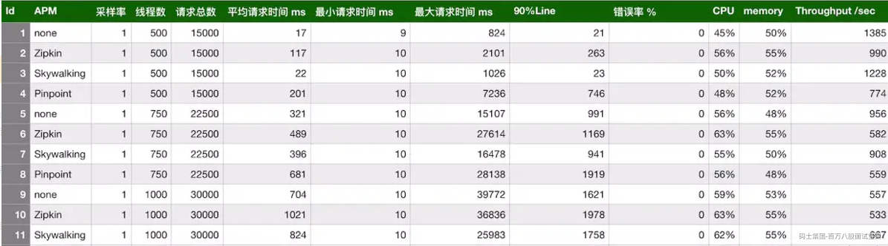

## 4.SkyWalking的功能特性

1. 多种监控手段，通过语言探针和Service mesh 获得监控的数据

2. 支持多种语言自动探针，包括 Java， .NET Core 和 Node.js

3. 轻量高效，无需大数据平台和大量的服务器资源

4. 模块化，UI，存储，集群管理都有多种机制可选

5. 支持报警，告警

6. 优秀的可视化解决方案

# 二、SkyWalking环境搭建

## 1.Skywalking结构

  先来看看Skywalking的结构图

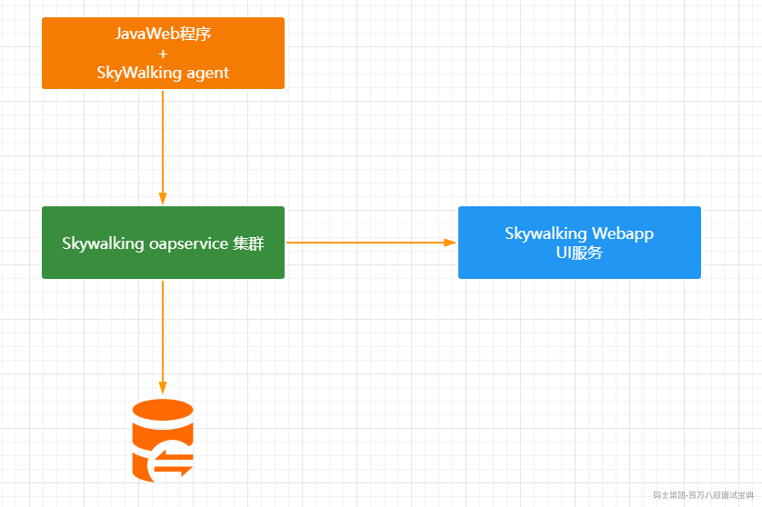

说明：

- Skywalking agent 和业务系统绑定在一起，负责收集各种监控数据

- Skywalking oapservice负责处理监控数据，比如接受Skywalking agent的监控数据，并且存储在数据库中，接受Skywalking webapp前端的请求，从数据库查询数据，并返回给前端，Skywalking oapservice通常会以集群的方式搭建

- Skywalking webapp ，UI服务，用于可视化展示数据

- 用户持久化监控数据的数据库，可以选用ElasticSearch、MySQL等

## 2.Skywalking部署

  从官网提供的下载地址下载安装文件，我们先通过windows操作来演示下：<https://skywalking.apache.org/downloads/>

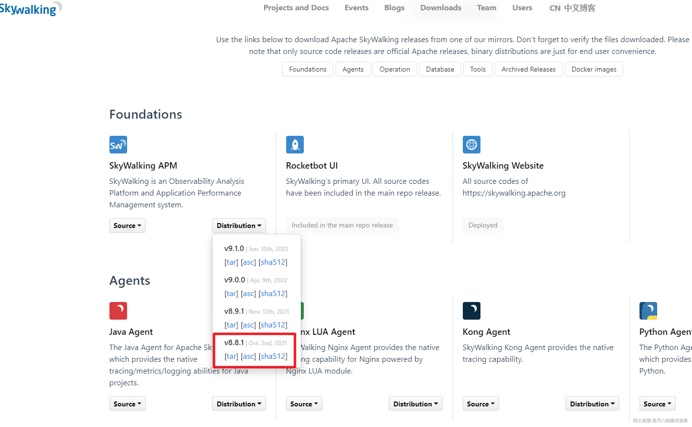

点击对应的下载链接下载即可

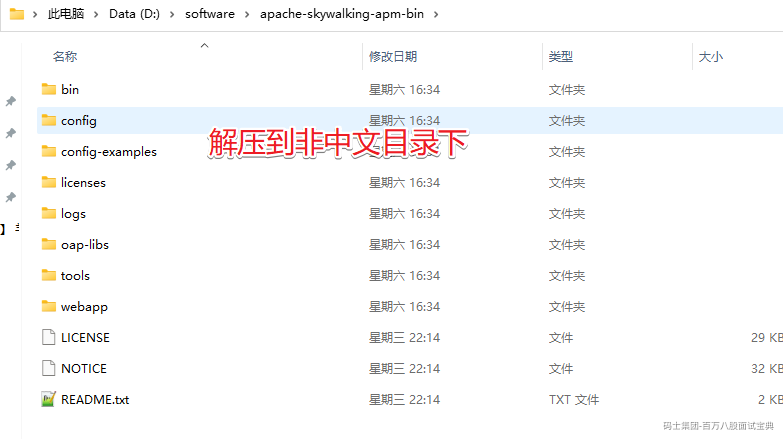

启动服务：

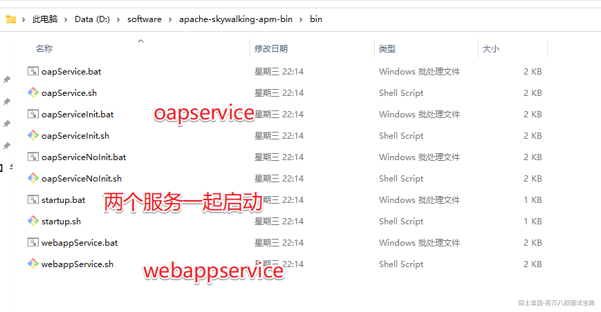

启动成功后会启动两个服务，一个是Skywalking-oap-server,一个是Skywalking-web-ui:8080

Skywalking-oap-server服务启动后会暴露11800和12800两个端口，分别为收集监控数据的端口11800和接收前端请求的端口12800，修改端口可以修改config/application.yml

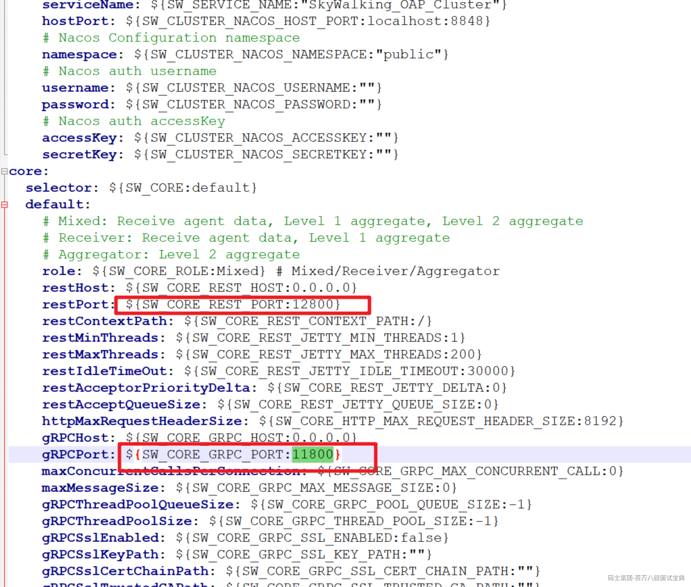

默认端口8080，访问效果如下：

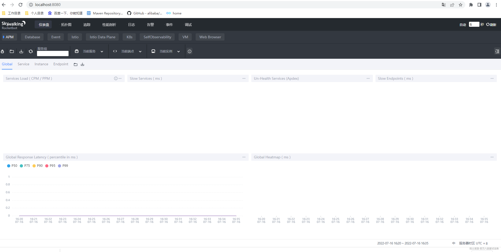

## 3.Java Agent

  在新版本中Agent是需要单独下载的。

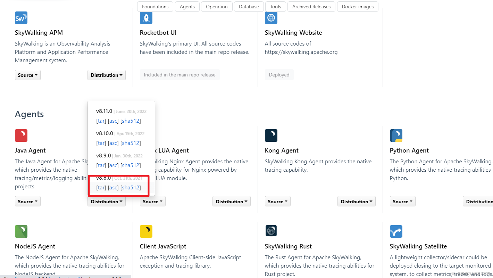

下载后解压出来放在了前面Skywalking的解压目录中

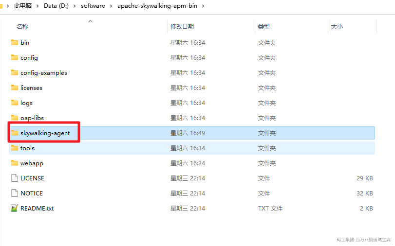

# 三、服务接入

  然后我们就可以把我们的微服务接入到Skywalking中来监控链路的执行。

## 1.开发环境的配置

  首先来看看在开发环境中的配置，因为Skywalking是无侵入式的。我们只需要在启动的时候通过相关的参数配置即可

```plain
# skywalking-agent.jar 的路径位置
-javaagent:d:\xxx\skywalking-agent.jar
# 在Skywalking中显示的服务名称
-DSW_AGENT_NAME=xxx-skywalking-service
# Skywalking的collector服务的IP及端口
-DSW_AGENT_COLLECTOR_BACKEND_SERVICES=localhost:11800
```

注意：`-DSW_AGENT_COLLECTOR_BACKEND_SERVICES` 可以指定远程服务，但是 `-javaagent`必须是本地的jar包.

## 2.gateway服务

  然后我们接入gateway的服务。在启动时设置对应的参数

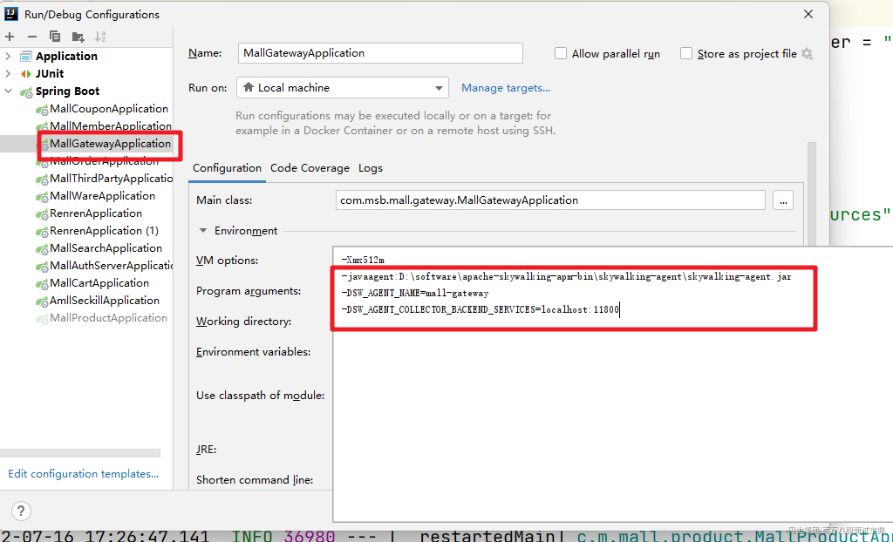

启动服务后，我们进入Skywalking的UI服务中查看

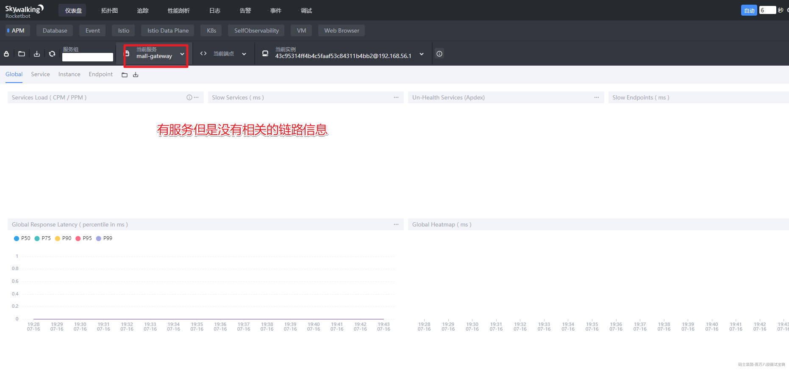

可以看到有对应的服务信息，但是没有相关的链路信息，主要是因为默认Skywalking中是不支持Gateway的，我们需要显示的添加对应的gateway插件支持

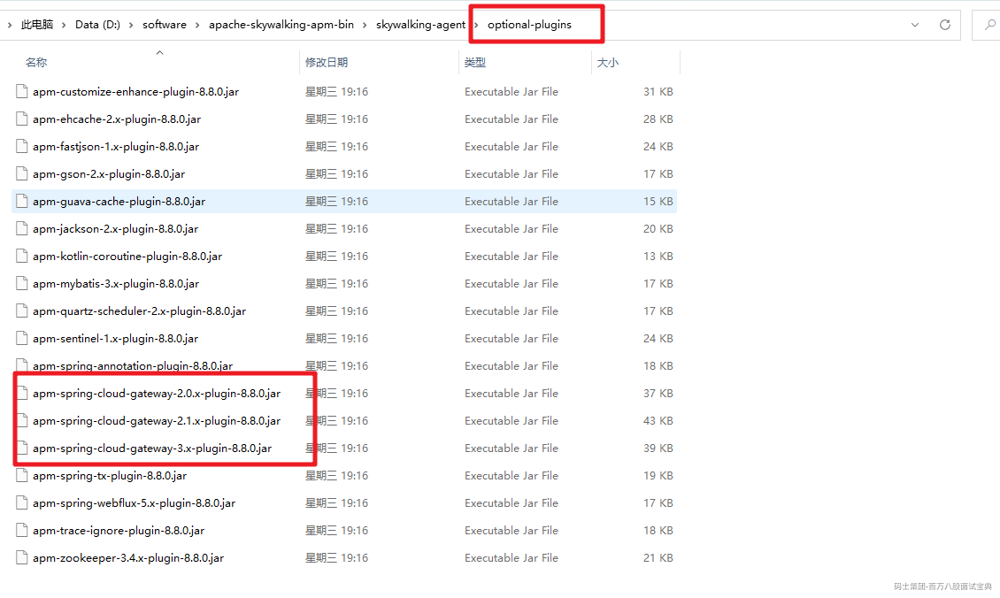

从我们下载的agent包中的 optional-plugins中把gateway的jar拷贝的对应的plugins中即可

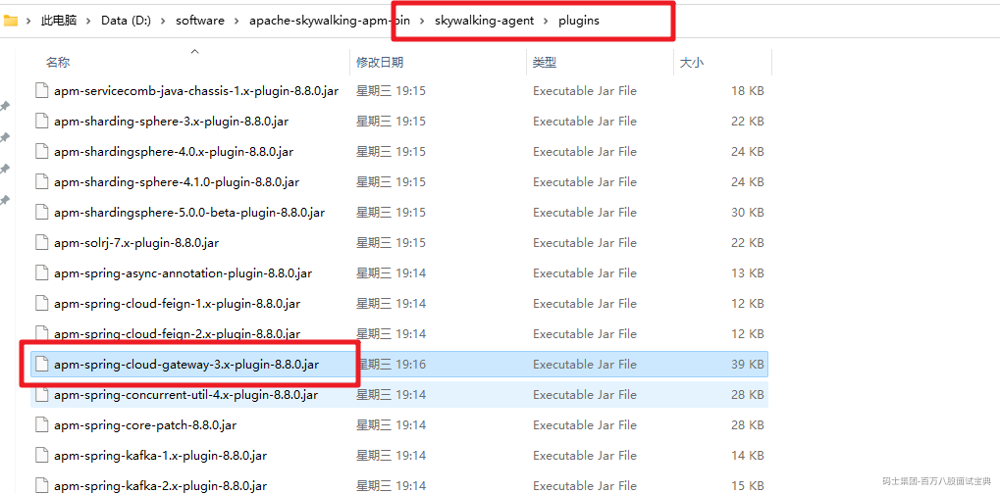

重启服务测试即可

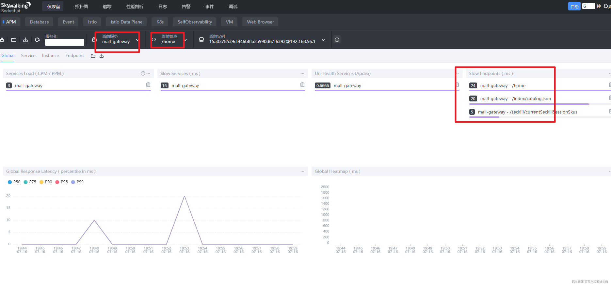

## 3.对接多个服务

  接下来我们就可以把商城系统中的各个服务都对接到Skywalking中，给每个服务添加对应的配置

```plain
-Xmx512m
-javaagent:D:\software\apache-skywalking-apm-bin\skywalking-agent\skywalking-agent.jar
-DSW_AGENT_NAME=mall-product
-DSW_AGENT_COLLECTOR_BACKEND_SERVICES=localhost:11800
```

分别启动

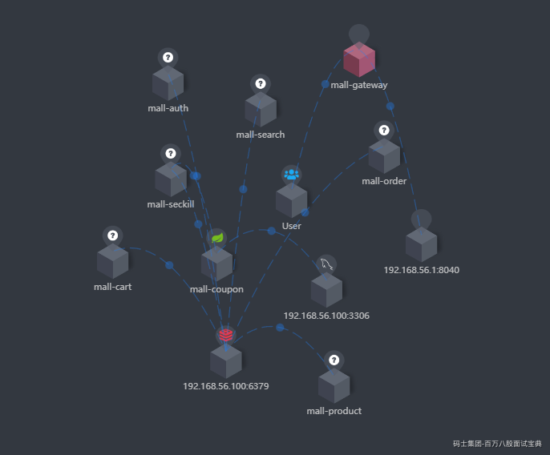

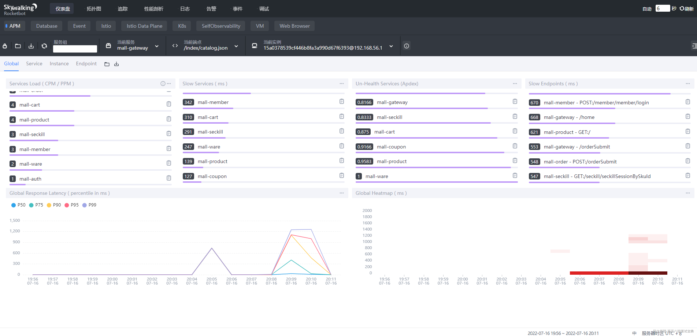

# 四、Skywalking持久化

  持久化数据到MySQL中。修改下配置，把原来默认的H2修改为MySQL就可以了。

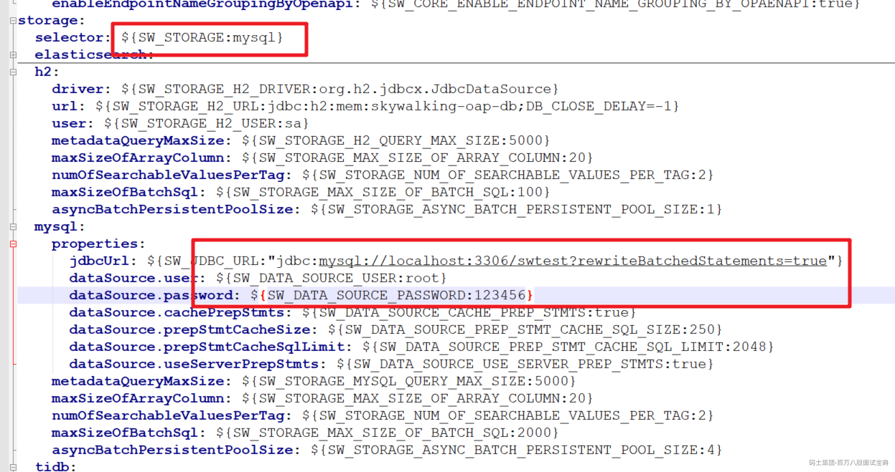

```sql
mysql://localhost:3306/swtest?rewriteBatchedStatements=true&serverTimezone=UTC&useUnicode=true&characterEncoding=utf-8
```

然后还需要把MySQL的驱动包拷贝到对应的目录中

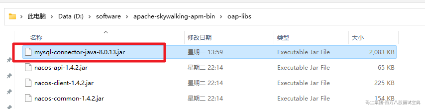

然后重启服务即可

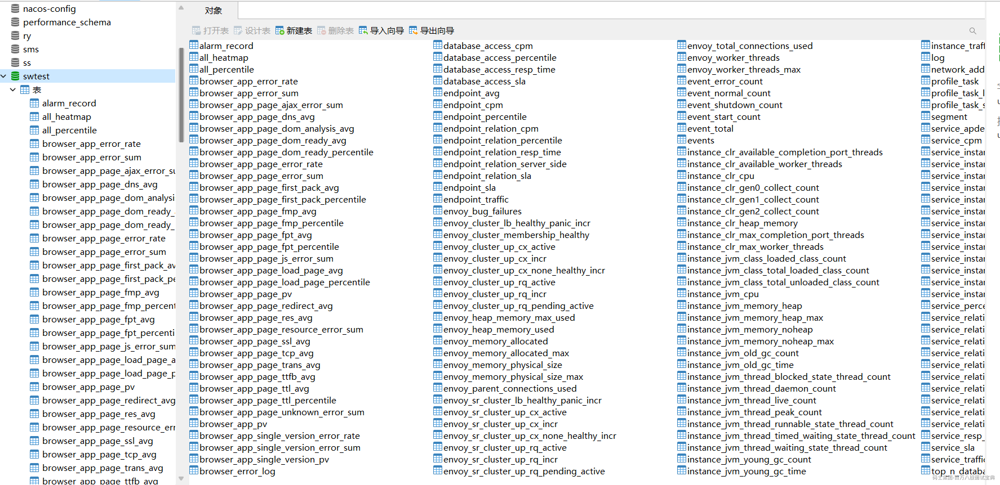

生成的表结构还很多

# 五、自定义SkyWalking链路

  在默认情况下Skywalking是没有记录我们的业务方法的，如果需要添加业务方法的链路监控我们就需要添加如下的依赖

```xml
<dependency>
    <groupId>org.apache.skywalking</groupId>

    <artifactId>apm-toolkit-trace</artifactId>

    <version>8.8.0</version>

</dependency>

```

然后在业务方法上添加@Trace注解。那么该方法就会被监控

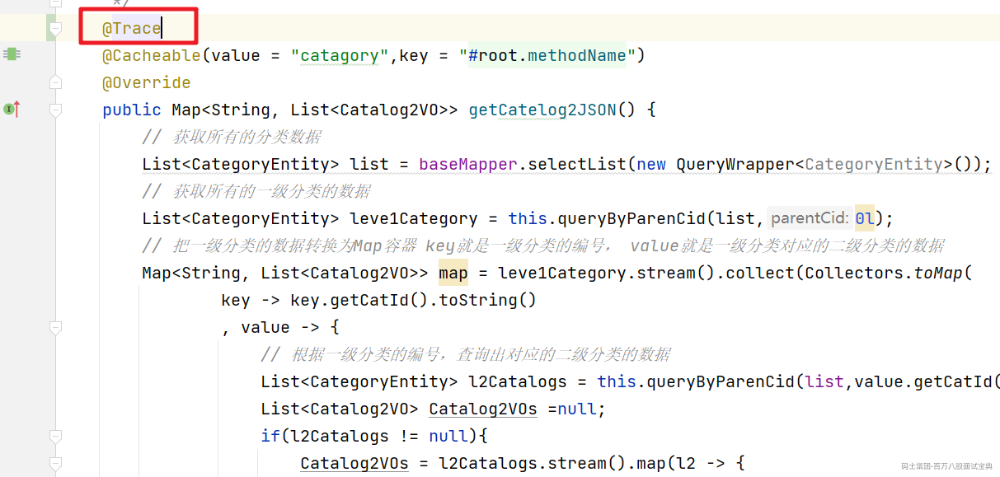

重启服务并访问：

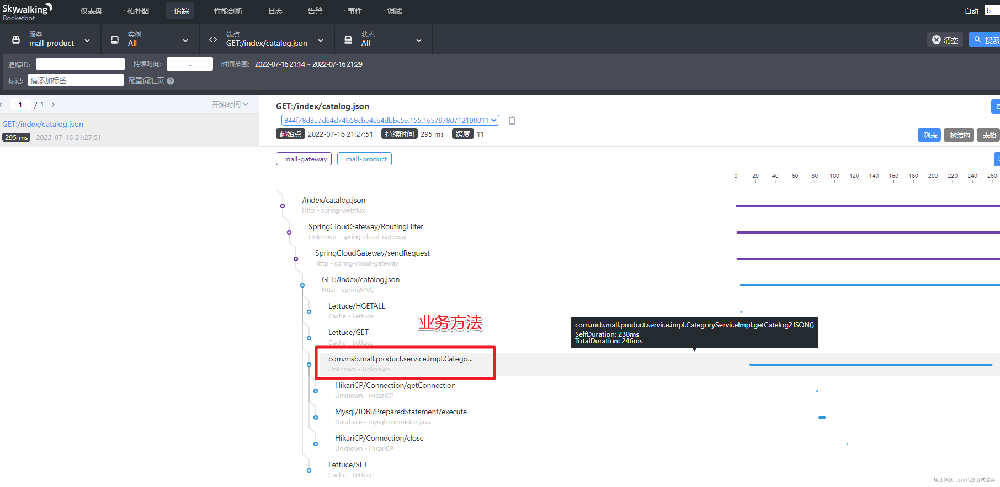

但是查看这个方法的详情中没有返回信息和参数

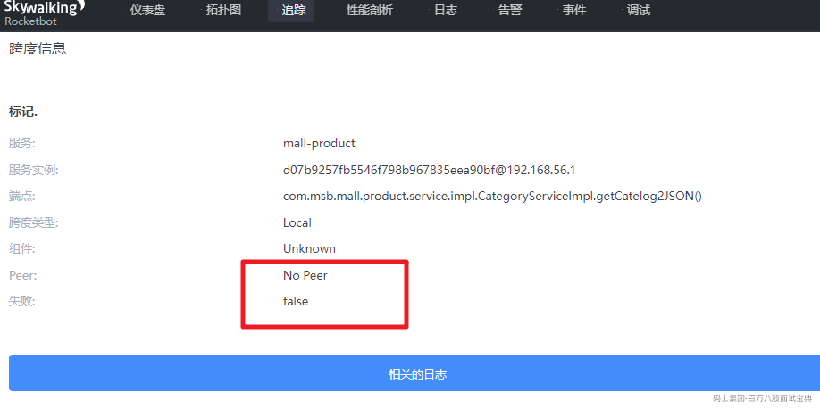

这时我们可以通过@Tags和@Tag来解决这个问题

```java
@Trace
    @Tags({
            @Tag(key = "getCatelog2JSON",value = "returnedObj"),
            @Tag(key = "param",value = "arg[0]")
    })
```

key:方法名 value = returnedObj:是指定返回值

arg[0]:参数

重启测试

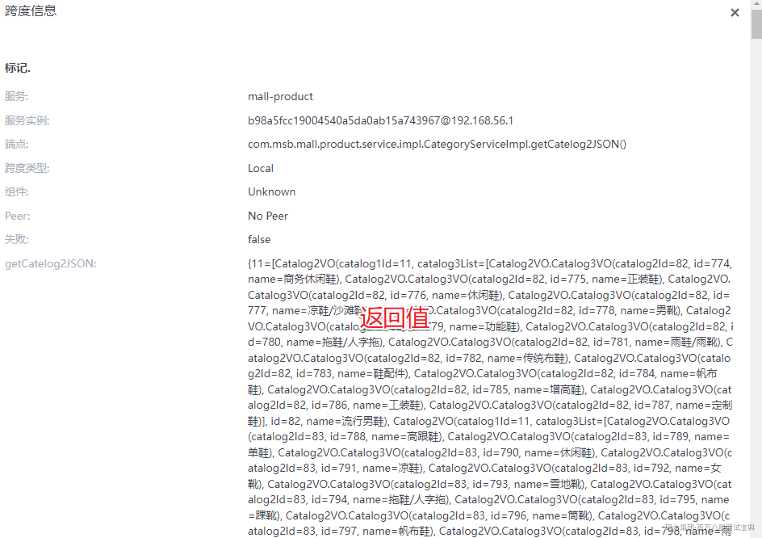

# 六、集成日志框架

  将微服务的日志框架去集成SkyWalking，我们希望在我们微服务中日志中，能够记录当前调用链路的id，然后我们再根据这个id去SkyWalking的前端界面中进行搜索找到对应的调用链路记录。

  因为springboot默认实现的日志框架是logback，这里也就拿logback举例

在微服务中导入maven坐标

```xml
<!-- skywalking 日志记录  -->
<dependency>
    <groupId>org.apache.skywalking</groupId>

    <artifactId>apm-toolkit-logback-1.x</artifactId>

    <version>8.5.0</version>

</dependency>

```

在项目中 `resources`目录下创建 `logback-spring.xml`文件

```xml
<?xml version="1.0" encoding="UTF-8"?>
<configuration>

    <appender name="console" class="ch.qos.logback.core.ConsoleAppender">
        <encoder class="ch.qos.logback.core.encoder.LayoutWrappingEncoder">
            <layout class="org.apache.skywalking.apm.toolkit.log.logback.v1.x.TraceIdPatternLogbackLayout">
                <pattern>%d{HH:mm:ss.SSS} [%thread] %-5level logger_name:%logger{36} - [%tid] - message:%msg%n</pattern>

            </layout>

        </encoder>

    </appender>

    <root level="INFO">
        <appender-ref ref="console" />
    </root>

</configuration>

```

在Skywalking UI的日志菜单中显示日志信息

```xml
<?xml version="1.0" encoding="UTF-8"?>
<configuration>

    <!--  控制台日志输出的格式中添加tid  -->
    <appender name="console" class="ch.qos.logback.core.ConsoleAppender">
        <encoder class="ch.qos.logback.core.encoder.LayoutWrappingEncoder">
            <layout class="org.apache.skywalking.apm.toolkit.log.logback.v1.x.TraceIdPatternLogbackLayout">
                <pattern>%d{HH:mm:ss.SSS} [%thread] %-5level logger_name:%logger{36} - [%tid] - message:%msg%n</pattern>

            </layout>

        </encoder>

    </appender>

    <!-- skywalking grpc 日志收集 8.4.0版本开始支持 -->
    <appender name="grpc-log" class="org.apache.skywalking.apm.toolkit.log.logback.v1.x.log.GRPCLogClientAppender">
        <encoder class="ch.qos.logback.core.encoder.LayoutWrappingEncoder">
            <layout class="org.apache.skywalking.apm.toolkit.log.logback.v1.x.mdc.TraceIdMDCPatternLogbackLayout">
                <Pattern>%d{yyyy-MM-dd HH:mm:ss.SSS} [%tid] [%thread] %-5level %logger{36} -%msg%n</Pattern>

            </layout>

        </encoder>

    </appender>

    <root level="INFO">
        <appender-ref ref="console" />
        <appender-ref ref="grpc-log" />
    </root>

</configuration>

```

```plain
plugin.toolkit.log.grpc.reporter.server_host=${SW_GRPC_LOG_SERVER_HOST:127.0.0.1}
plugin.toolkit.log.grpc.reporter.server_port=${SW_GRPC_LOG_SERVER_PORT:11800}
plugin.toolkit.log.grpc.reporter.max_message_size=${SW_GRPC_LOG_MAX_MESSAGE_SIZE:10485760}
plugin.toolkit.log.grpc.reporter.upstream_timeout=${SW_GRPC_LOG_GRPC_UPSTREAM_TIMEOUT:30}

```

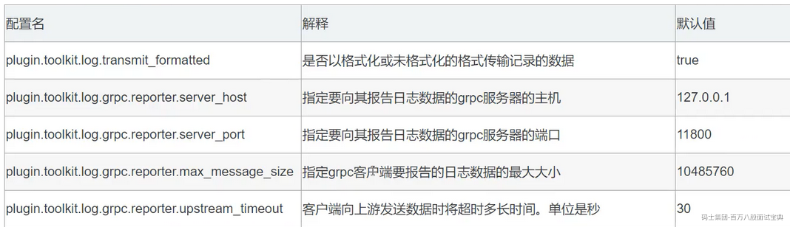
