> # **一、微服务架构介绍**

> 大家已经掌握了SSM，SpringBoot，Linux，Maven，Git……

## 1.1 架构演变

> **单体架构：** All in One，所有的功能模块都在一个工程里。
>
> 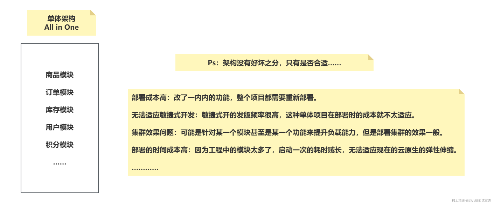
>
> **SOA架构：** 这个架构当不当正不正，对于现在来说，有点老，甚至需要ESB，WebService之类的，基本不会使用了。
>
> **微服务架构：** 微服务架构思想是马丁福勒提出的
>
> <https://martinfowler.com/articles/microservices.html>
>
> 他的核心思想是这一段话：
>
> 将上述内容稍微整理：
>
> - 微服务架构是一个软件架构风格，他不是标准。
>
> - 将一个单体架构的产品拆分成多个服务，多个服务组成了完成的产品功能。
>
> - 每个服务是可以完全独立部署的，互不影响。
>
> - 可以采用HTTP这种轻量级的方式实现服务之间的交互。
>
> - 在拆分服务时，一般是按照产品的业务领域去划分不同的服务，也可以针对单个功能做成一个服务。
>
> - 采用DevOps的方式去做自动化部署。 （后面会学）
>
> - 支持采用不用的语言去构建一个完整的产品。
>
> 
>
> 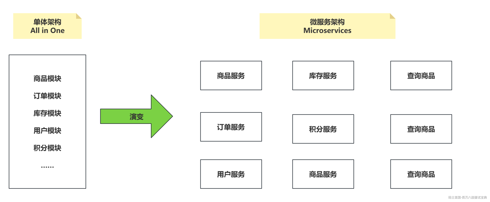
>
> 微服务架构：是架构思想。
>
> 微服务：拆分出来的微小的服务，比如上图中的商品服务就是一个微服务。
>
> 微服务框架：对微服务的架构思想落地的一些技术。

```plain
In short, the microservice architectural style 1 is an approach to developing a single application as a suite of small services, each running in its own process and communicating with lightweight mechanisms, often an HTTP resource API. These services are built around business capabilities and independently deployable by fully automated deployment machinery. There is a bare minimum of centralized management of these services, which may be written in different programming languages and use different data storage technologies.

简而言之，微服务架构风格1是一种将单个应用程序开发为一套小型服务的方法，每个服务都在自己的进程中运行，并与轻量级机制（通常是HTTP资源API）通信。这些服务围绕业务能力构建，并可通过全自动部署机制独立部署。这些服务的集中管理最低限度，这些服务可能用不同的编程语言编写，并使用不同的数据存储技术。
```

## 1.2 SpringCloud生态

> 官方地址： <https://spring.io/projects/spring-cloud>
>
> 咱们要学习SpringCloud生态里的几个技术：
>
> - SpringCloud Alibaba： Nacos
>
> - SpringCloud：OpenFeign
>
> - SpringCloud Alibaba：Sentinel
>
> - SpringCloud：Gateway
>
> - **链路追踪：Sleuth + Zipkin - SkyWalking（不玩）**
>
> 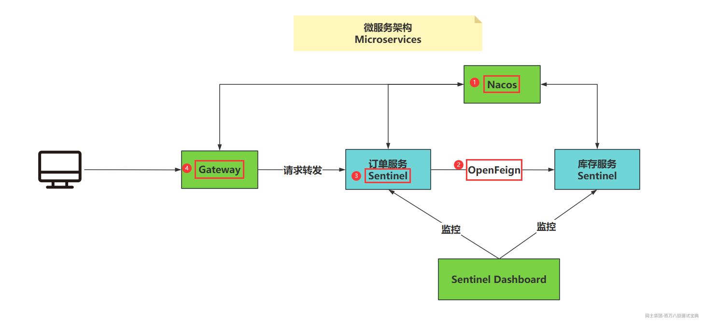
>
> **Ps：这里只关注应用，底层源码之类的内容，这里不涉及。**

# 二、Nacos注册中心

## 2.1 注册中心

> 当订单服务需要访问库存服务时，不知道库存服务的地址信息。利用注册中心，在服务启动时，将服务的基本信息都注册到Nacos中，当需要访问某一个服务之前，可以去Nacos中获取到对应的服务信息，就可以直接去访问啦~~~
>
> 如果让订单服务单独存储库存服务的基本信息，会导致耦合问题，如果库存服务的地址改变了，订单服务也需要变化，如果库存服务追加了集群的节点或者减少了集群的节点，订单服务都需要做维护，耦合性太高。
>
> 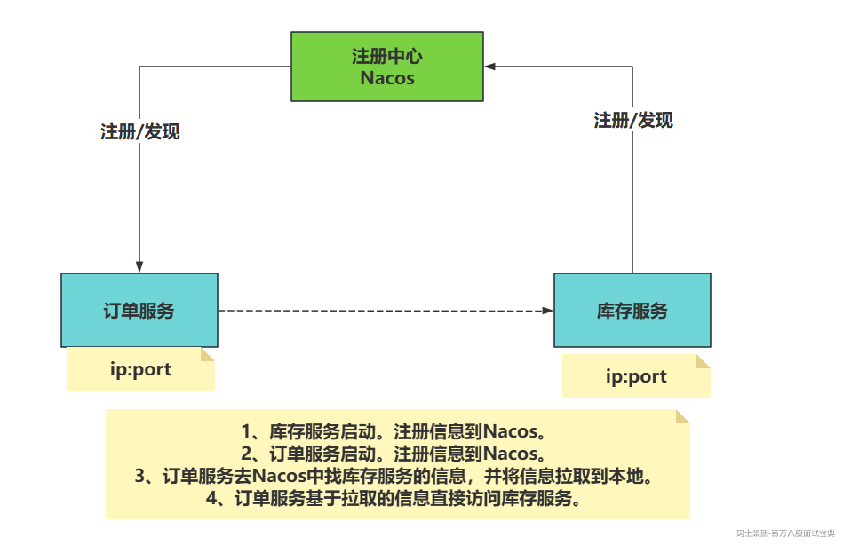

## 2.2 Nacos安装

> Nacos可以Windows下简单的玩，也可以在Linux里安装。
>
> 直接去官方下载即可。
>
> 本地环境要求，java -version要么是JDK8，要么是JDK11
>
> 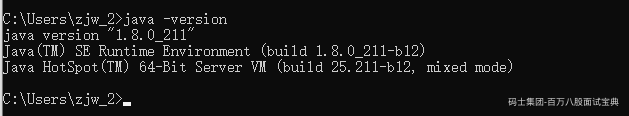1
>
> <https://download.nacos.io/nacos-server/nacos-server-2.5.1.zip?spm=5238cd80.2ef5001f.0.0.3f613b7cKzonbx&file=nacos-server-2.5.1.zip>
>
> **点击即可直接下载（最好去官网）。**
>
> 
>
> 打开cmd准备启动Nacos服务
>
> 然后到bin目录下准备启动
>
> 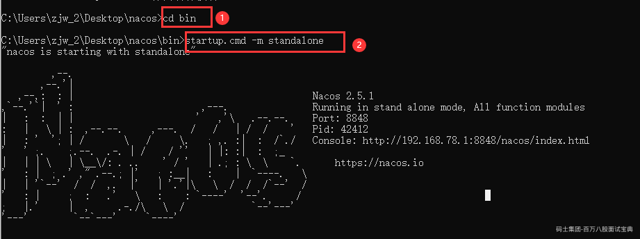启动成功要看到这个日志
>
> 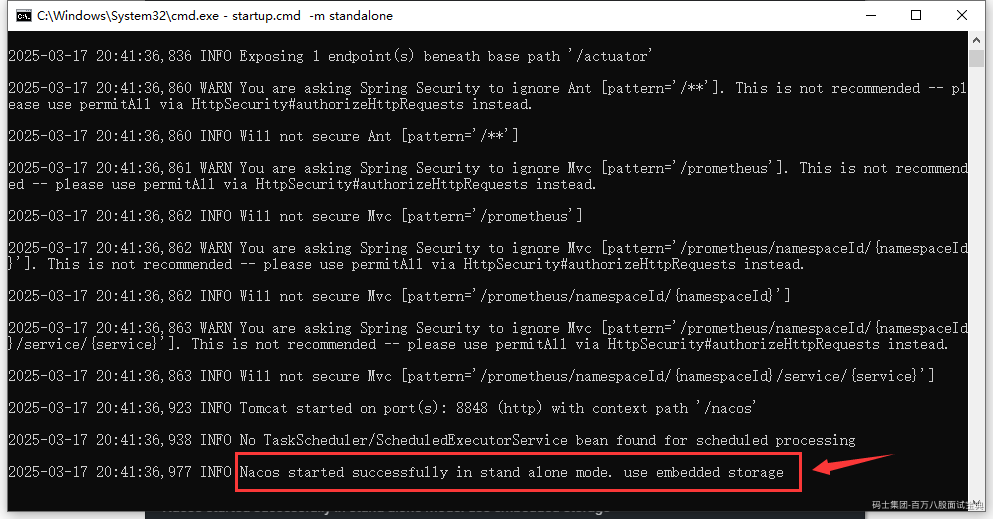
>
> 启动成功后，直接访问Nacos提供的图形化界面
>
> <http://localhost:8848/nacos>
>
> 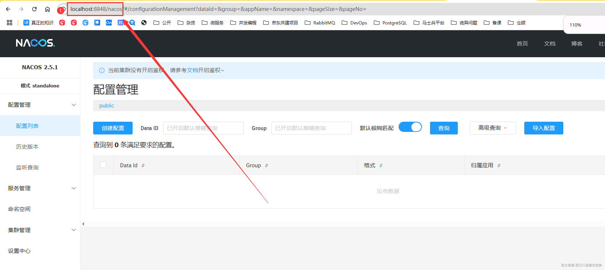

## 2.3 Nacos初体验（注册中心）

### 2.3.1 构建父工程并管理版本

> 在玩Nacos的客户端操作前，优先了解一下常识性内容。
>
> SpringCloud是建立在SpringBoot基础上的。
>
> 其次，SpringBoot版本，SpringCloud版本，SpringCloudAlibaba的版本都是有对应的。
>
> 版本对应可以查看这个地址：
>
> <https://github.com/alibaba/spring-cloud-alibaba/wiki/%E7%89%88%E6%9C%AC%E8%AF%B4%E6%98%8E>
>
> 版本不同，在使用的一些细节上可能会出现一些不一样的地方，所以最好跟我的版本保持统一！
>
> SpringBoot咱们先不玩3.x，依然是以2.x为核心。
>
> 构建一个普通的Maven工程，在pom.xml中做四个事情。
>
> - 将当前工程的packaging设置为pom类型。
>
> - 声明好SpringBoot的parent，并制定好版本
>
> - 声明SpringCloud的版本
>
> - 声明SpringCloudAlibaba的版本

```xml
<?xml version="1.0" encoding="UTF-8"?>
<project xmlns="http://maven.apache.org/POM/4.0.0"
         xmlns:xsi="http://www.w3.org/2001/XMLSchema-instance"
         xsi:schemaLocation="http://maven.apache.org/POM/4.0.0 http://maven.apache.org/xsd/maven-4.0.0.xsd">
    <modelVersion>4.0.0</modelVersion>
```

```plain
<parent>
    <groupId>org.springframework.boot</groupId>
```

```plain
    <artifactId>spring-boot-starter-parent</artifactId>
```

```plain
    <version>2.6.11</version>
```

```plain
    <relativePath />
</parent>
```

```plain
<groupId>com.mashibing</groupId>
```

```plain
<artifactId>springcloud</artifactId>
```

```plain
<version>1.0-SNAPSHOT</version>
```

```plain
<packaging>pom</packaging>
```

```plain
<properties>
    <spring-cloud.version>2021.0.4</spring-cloud.version>
```

```plain
    <spring-cloud-alibaba.version>2021.0.4.0</spring-cloud-alibaba.version>
```

```plain
</properties>
```

```plain
<dependencyManagement>
    <dependencies>
        <dependency>
            <groupId>org.springframework.cloud</groupId>
```

```plain
            <artifactId>spring-cloud-dependencies</artifactId>
```

```plain
            <version>${spring-cloud.version}</version>
```

```plain
            <type>pom</type>
```

```plain
            <scope>import</scope>
```

```plain
        </dependency>
```

```plain
        <dependency>
            <groupId>com.alibaba.cloud</groupId>
```

```plain
            <artifactId>spring-cloud-alibaba-dependencies</artifactId>
```

```plain
            <version>${spring-cloud-alibaba.version}</version>
```

```plain
            <type>pom</type>
```

```plain
            <scope>import</scope>
```

```plain
        </dependency>
```

```plain
    </dependencies>
```

```plain
</dependencyManagement>
```

```plain

```

### 2.3.2 准备库存服务

> 这里需要完成几个操作。
>
> 1、构建好子工程……
>
> 2、导入依赖……

```xml
<dependencies>
    <dependency>
        <groupId>org.springframework.boot</groupId>
```

```plain
    <artifactId>spring-boot-starter-web</artifactId>
```

```plain
</dependency>
```

```plain
<dependency>
    <groupId>com.alibaba.cloud</groupId>
```

```plain
    <artifactId>spring-cloud-starter-alibaba-nacos-discovery</artifactId>
```

```plain
</dependency>
```

> 4、准备yml文件，配置Nacos信息……
>
> 5、启动测试……
>
> 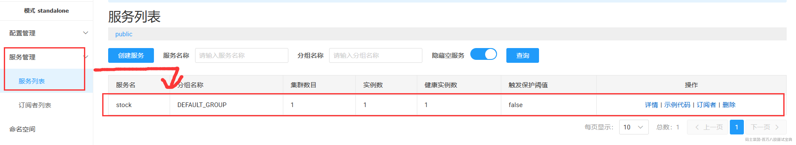

```plain

3、准备启动类，并添加注解……

```java
package com.mashibing;

import org.springframework.boot.SpringApplication;
import org.springframework.boot.autoconfigure.SpringBootApplication;
import org.springframework.cloud.client.discovery.EnableDiscoveryClient;

@SpringBootApplication
@EnableDiscoveryClient
public class StockStarterApp {

    public static void main(String[] args) {
        SpringApplication.run(StockStarterApp.class, args);
    }
}
```

```yaml
spring:
  application:
    name: stock
  cloud:
    nacos:
      discovery:
        server-addr: 127.0.0.1:8848
```

### 2.3.3 准备订单服务

> 操作方式跟库存服务的套路没区别。
>
> yml文件略微调整
>
> 启动并测试
>
> 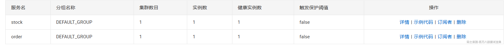

```yaml
spring:
  application:
    name: order
  cloud:
    nacos:
      discovery:
        server-addr: 127.0.0.1:8848
server:
  port: 80
```

### 2.3.4 库存服务提供接口

> 在stock服务中提供一个可以对外访问的接口
>
> 写完记得测试一下，可以访问。
>
> 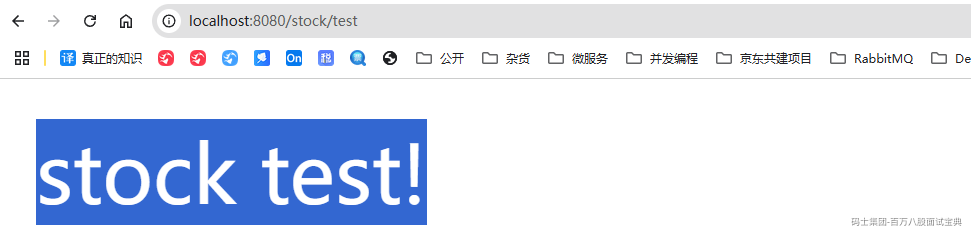

```java
package com.mashibing.controller;

import org.springframework.web.bind.annotation.GetMapping;
import org.springframework.web.bind.annotation.RestController;

@RestController
public class StockController {

    @GetMapping("/stock/test")
    public String test() {
        return "stock test!";
    }

}
```

### 2.3.5 订单服务准备接口访问库存服务

> 正常准备OrderController，并且在启动类中构建好RestTemplate对象，在OrderController中访问库存服务提供的接口。 **现在是直接写死的状态，没利用Nacos。**
>
> 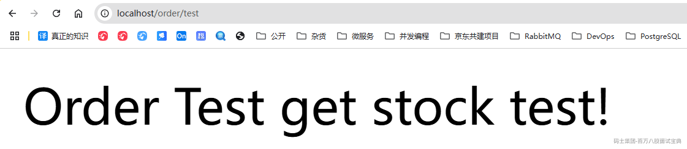
>
> 在确保写死的状态下，可以正常的获取到库存服务提供的接口后，咱们开始利用Nacos去获取服务的地址信息。
>
> 只需要在配置RestTemplate中，额外追加一个依赖
>
> 再将基于restTemplate对象访问的地址路径中的ip:port换成服务名。
>
> 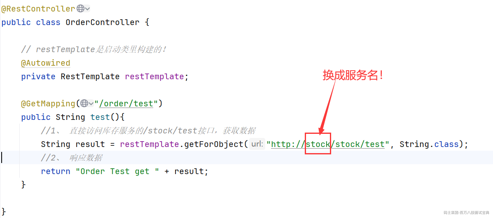
>
> 希望的效果是，在restTemplate访问时，将stock服务名从Nacos中解析为具体的ip和端口。But事与愿违，报错了。
>
> 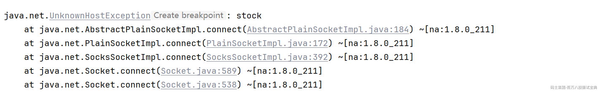
>
> 原因是因为现在玩的版本比较高，默认已经不用Ribbon，需要导入loadbalancer的依赖，就可以解决。
>
> 在order服务中，追加一个依赖。

```java
package com.mashibing.controller;

import org.springframework.beans.factory.annotation.Autowired;
import org.springframework.web.bind.annotation.GetMapping;
import org.springframework.web.bind.annotation.RestController;
import org.springframework.web.client.RestTemplate;

@RestController
public class OrderController {

    // restTemplate是启动类里构建的！
    @Autowired
    private RestTemplate restTemplate;

    @GetMapping("/order/test")
    public String test(){
        //1、 直接访问库存服务的/stock/test接口，获取数据
        String result = restTemplate.getForObject("http://localhost:8080/stock/test", String.class);

        //2、 响应数据
        return "Order Test get " + result;
    }

}
```

---

```java
@Bean
@LoadBalanced
public RestTemplate restTemplate(){
    return new RestTemplate();
}
```

```xml
<dependency>
    <groupId>org.springframework.cloud</groupId>
```

```plain
<artifactId>spring-cloud-loadbalancer</artifactId>
```

```plain

再次访问，得到具体的结果


```

## 2.4 命名空间和分组（了解）

> 咱们在默认操作时，连接是的Nacos中的public命名空间以及DEFAULT\_GROUP分组下的服务信息。
>
> 咱们可以在yml文件中指定要，当前服务需要连接哪个命名空间以及分组。

---

> 优先构建一个命名空间，然后指定order服务连接的命名空间
>
> 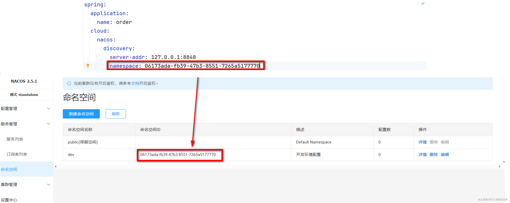
>
> 修改完毕后，因为之前的stock服务依然注册在public命名空间下，所以order服务去dev命名空间去找stock服务必然找不到，So，报了这个错误
>
> 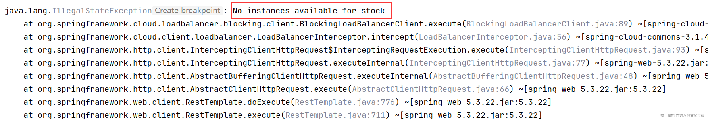

---

> 将order服务中的注册与发现的分组设置的PDD\_GROUP，再次去找Nacos实现注册与发现时，就会只找PDD\_GROUP下的内容
>
> 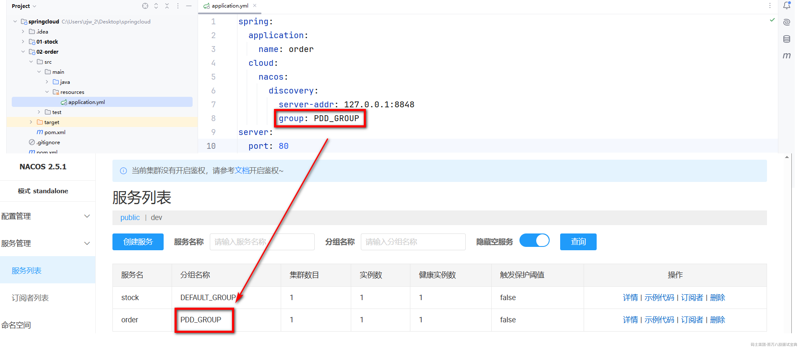
>
> 再次去找stock服务时，发现找不到，那就对了，因为咱们配置了分组的信息，所以他会去PDD\_GROUP去找对应的stock服务。
>
> 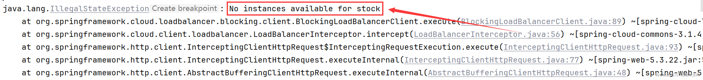

## 2.5 负载均衡（了解）

> 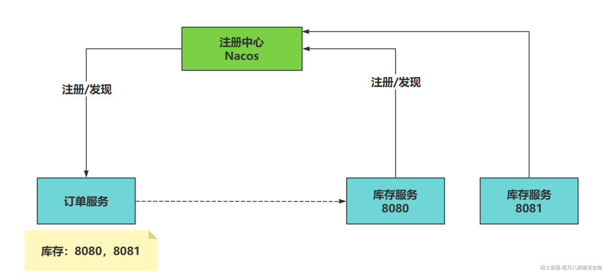  
> 负载均衡的操作不是Nacos去做的。而是Nacos依赖 **Ribbon或者Loadbalancer** 。
>
> **（低版本默认引入Ribbon，当前版本需要手动引入Loadbalancer）**
>
> 默认情况就是轮询的机制，你一个，我一个，你一个，我一个，你一个，我一个……
>
> 不需要做任何额外的配置，默认机制即可，虽然也有权重之类的操作，基本不用。
>
> 稍微修改了一下代码，方便查看具体的效果，将stock服务的test接口返回的结果追加上对应的端口号。
>
> 第一次启动发现错误，找不到引入的 **@Value("${server.port}")** ，原因是配置文件没写。
>
> 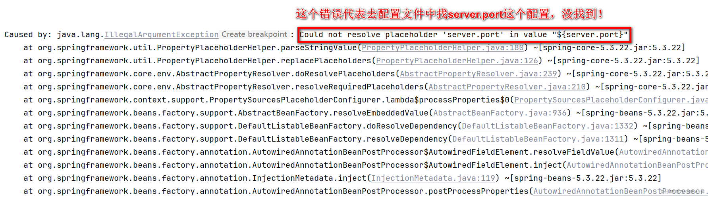
>
> 追加上对应的配置，就完事了。
>
> 
>
> 优先启动了8080的Stock。
>
> 紧接着为了查看集群的效果，基于IDEA的配置，再次启动一个Stock服务，但是因为IDEA版本原因，需要设置一下多环境信息才ok。
>
> 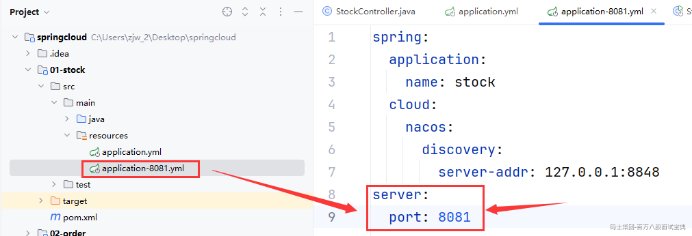
>
> 然后在IDEA中追加启动项，启动配置好的这个8081的Stock服务
>
> 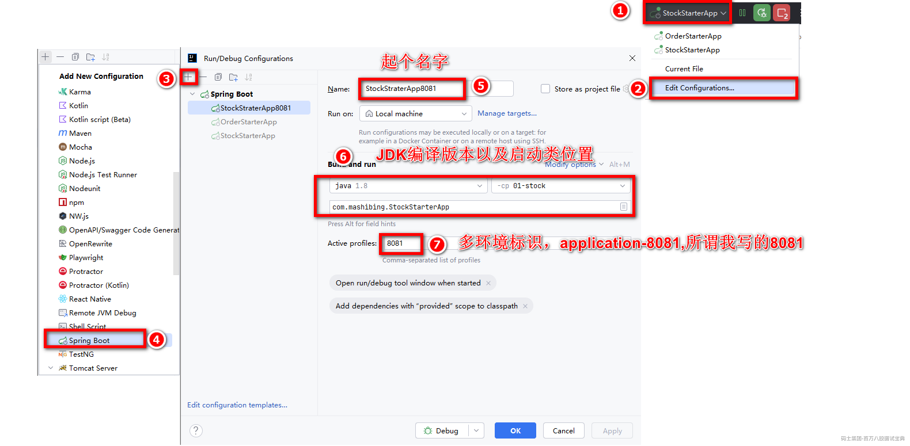
>
> 启动成功后，可以在Nacos中看到具体的集群信息
>
> Ps：记住，集群的服务名必须保持一致，你写成不一样的，那就是俩服务了。
>
> 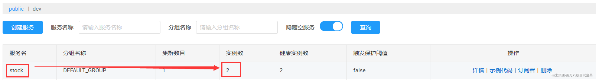
>
> 再去访问的时候，他就是默认轮询的效果了！
>
> 
>
> 

```java
package com.mashibing.controller;

import org.springframework.beans.factory.annotation.Value;
import org.springframework.web.bind.annotation.GetMapping;
import org.springframework.web.bind.annotation.RestController;

@RestController
public class StockController {

    @Value("${server.port}")
    private String serverPort;

    @GetMapping("/stock/test")
    public String test() {
        return "stock test!" + serverPort;
    }

}
```

# 三、Nacos配置中心

## 3.1 配置中心

> 之前咱们的配置信息都是放在项目工程里的application.yml文件中。
>
> 但是后期服务可能会涉及到集群部署，并且部署在不同的服务器中。如果没有一个统一管理这些配置的方案，需要去多个地方维护这些配置信息。
>
> 项目在开发到发布交付的过程中，涉及很多环境开发环境，测试环境，预生产环境，生产环境，环境很多，需要提供多种环境下的配置文件。
>
> 项目中如果配置文件发生修改，一般是需要重启项目才能生效的，但是配置中心是可以实现动态刷新配置的功能，修改玩配置文件，可以立即生效，不需要重启。
>
> 其次就是配置文件现在的形式就是本地的一个文本文件，谁都能看，谁都能改，权限不好控制。配置中心就会提供这种权限的控制。
>
> 针对历史版本的记录，希望可以看到配置文件每次更改的变化，以及历史版本记录，也可以方便做一个回滚的操作。
>
> 总结下来就几点：
>
> - 集中式管理配置文件的地方
>
> - 环境隔离
>
> - 配置动态刷新
>
> - 权限的控制
>
> - 历史版本记录

## 3.2 Nacos初体验（配置中心）

> 现在的目的是将order服务中的server.port=80的配置扔到Nacos服务中管理。希望Order服务启动后，可以去找对应地址的Nacos中的某个DataId的配置文件，达到启动后，依然占用80端口。
>
> **分成这几步完成上述操作：**
>
> **1、导入依赖**

```xml
<dependency>
    <groupId>com.alibaba.cloud</groupId>
```

```plain
<artifactId>spring-cloud-starter-alibaba-nacos-config</artifactId>
```

> **4、将application.yml修改为bootstrap.yml**
>
> 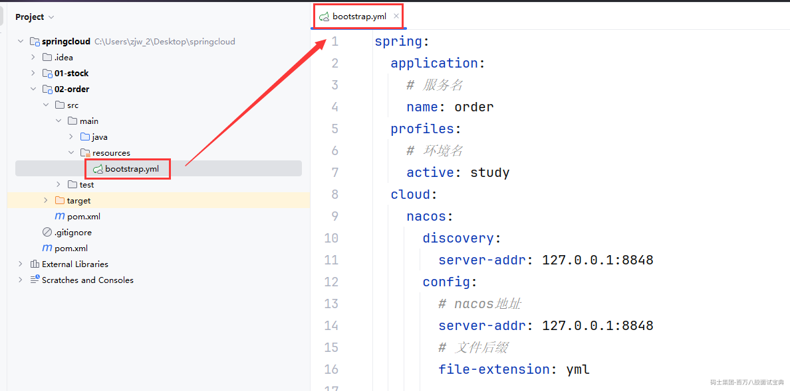
>
> **5、因为版本关系，需要追加上一个依赖。**

```plain

**2、在Nacos服务上编写配置文件**


**3、Order的配置文件中指定好Nacos地址以及加载哪个配置文件**

```yml
spring:
  application:
    # 服务名
    name: order
  profiles:
    # 环境名
    active: study
  cloud:
    nacos:
      discovery:
        server-addr: 127.0.0.1:8848
      config:
        # nacos地址
        server-addr: 127.0.0.1:8848
        # 文件后缀
        file-extension: yml
#  order-study.yml
#  ${spring.application.name} - ${spring.profiles.active} . ${spring.cloud.nacos.config.file-extension}
```

```xml
<dependency>
    <groupId>org.springframework.cloud</groupId>
```

```plain
<artifactId>spring-cloud-starter-bootstrap</artifactId>
```

```plain

**6、测试，启动后查看日志信息**


```

## 3.3 命名空间和分组（了解）

> 这里跟注册中心的思路是完全一样的，没啥变化
>
> 优先准备一个dev命名空间下的DEV\_GROUP分组的配置文件。
>
> 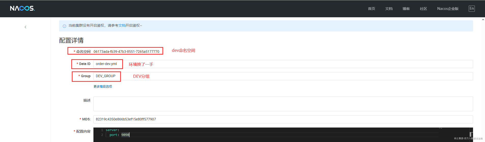
>
> 配置文件的编写方式

```yaml
spring:
  application:
    # 服务名
    name: order
  profiles:
    # 环境名
    active: dev
  cloud:
    nacos:
      discovery:
        server-addr: 127.0.0.1:8848
      config:
        # nacos地址
        server-addr: 127.0.0.1:8848
        # 文件后缀
        file-extension: yml
        namespace: 06173ada-fb39-47b3-8551-7265a5177770
        group: DEV_GROUP
```

## 3.4 配置动态刷新

> 配置的动态刷新的目的是为了实现当程序读取Nacos中的配置文件的内容时，如果Nacos中修改了某个key对应的value，项目不需要重启就可以立即生效。
>
> 准备一个环境，提供一个Controller接口，获取Nacos配置中的某个key的value，并且测试效果。
>
> 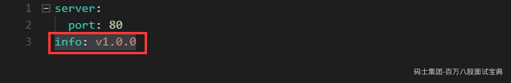
>
> 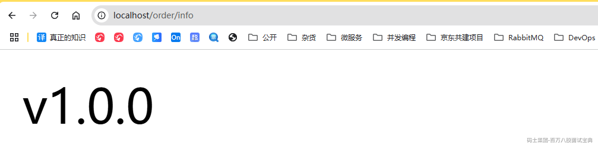

```java
// 获取Nacos配置文件中的info
@Value("${info:empty}")
private String info;

@GetMapping("/order/info")
public String info() {
    return info;
}
```

---

> 现在为了实现动态刷新的效果，咱们只需要做一个事情。
>
> 在引入Nacos配置文件的类上，追加一个注解即可
>
> 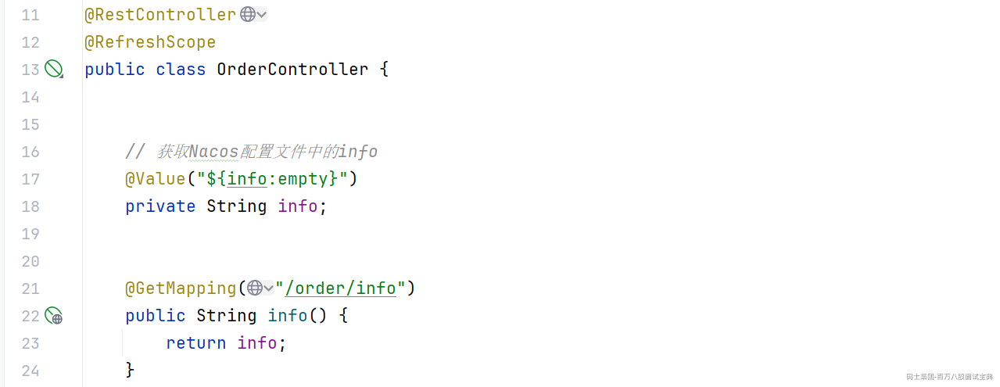

```java
@RefreshScope
```

# 四、OpenFeign

## 4.1 OpenFeign介绍

> OpenFeign是RPC框架的一种，OpenFeign不是Alibaba的组件，属于SpringCloud。
>
> Alibaba内部提供的是Dubbo的RPC框架，作用都是一样的。
>
> - Dubbo走的是自己的Dubbo协议。
>
> - OpenFeign采用的是HTTP协议。
>
> OpenFeign的主要目的就是为了 **简化Java项目中编译HTTP请求的过程** ，并且让代码 **具备更好的可维护性** 。
>
> OpenFeign他也 **整合Sentinel，Nacos，Hystrix，LoadBalancer等** ，这些OpenFeign都是可以0成本整合的。
>
> OpenFeign是 **基于接口（interface）封装** ，实现代理对象去访问的，跟之前的单体项目的编写思路是一样的。

## 4.2 OpenFeign的初体验

> 按照官方文档的方式一步一步走。
>
> **1、导入依赖**

```xml
<dependency>
    <groupId>org.springframework.cloud</groupId>
```

```plain
<artifactId>spring-cloud-starter-openfeign</artifactId>
```

> **3、编写OpenFeign的Client接口。（映射到对应服务的接口上）**
>
> **4、测试，在order服务中编写测试接口**
>
> 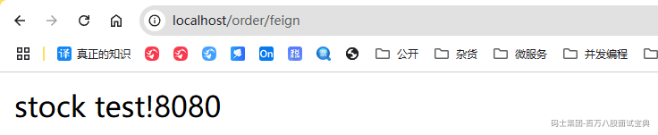
>
> 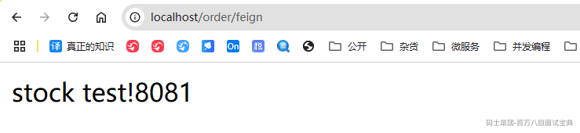

```plain

**2、启动类追加注解**

```java
@EnableFeignClients
```

```java
package com.mashibing.client;

import org.springframework.cloud.openfeign.FeignClient;
import org.springframework.web.bind.annotation.GetMapping;

@FeignClient("stock")
public interface StockClient {

    // 这里的内容，如果可以，最好去对应的Controller位置复制
    @GetMapping("/stock/test")
    String test();

}

```

```java
@RestController
@RefreshScope
public class OrderController {

    @Autowired
    private StockClient stockClient;

    // 基于OpenFeign，尝试访问Stock服务
    @GetMapping("/order/feign")
    public String feign() {
        String result = stockClient.test();
        return result;
    }
}
```

## 4.3 OpenFeign配置

### 4.3.1 OpenFeign的超时配置

> 通过官方文档可以得知，OpenFeign的超时配置就2个东西
>
> - `connectTimeout` prevents blocking the caller due to the long server processing time.
>
> - `readTimeout` is applied from the time of connection establishment and is triggered when returning the response takes too long.
>
> connectTimeout：关注的不多，更多的是客户端和服务端建立TCP连接的超时时间。
>
> readTimeout：这个配置的会比较多，他是从请求发出到响应的超时时间
>
> 将Stock服务中的接口休眠一段时间，来测试达到超时时间后的效果
>
> Order服务的配置：
>
> 当超时后，抛出的错误。
>
> 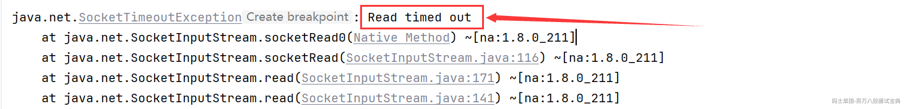
>
> **Ps：这里区分版本，之前的版本，OpenFeign的超时时间是1s，现在默认情况下，5s都没超时！**
>
> **也可能存在一个情况，第一次请求的时候，会初始化，速度可能会比较慢。**
>
> 其次，OpenFeign也提供了全局（默认、缺省）的配置方式

```yaml
feign:
  client:
    config:
      stock:  # 服务名
        readTimeout: 1000    # 响应时间1s，没响应直接报错
```

```yaml
feign:
  client:
    config:
      default:  # 默认的配置，优先级低
        read-timeout: 2000
      stock:  # 细粒度针对服务的配置，优先级高
        readTimeout: 6000
```

### 4.3.2 OpenFeign的底层技术

> 默认情况下，咱们当前版本的OpenFeign底层使用的HttpClient4。
>
> 咱们可以通过配置去选择使用okHttp或者是HC5（HttpClient5）
>
> 咱们是三选一：okHttp，HttpClient4，HC5。
>
> 区别的话，浅聊一下：
>
> - 协议的支持：okHttp，HC5对协议支持的更好。
>
> - 性能：相对来说，其实大差不差，但是还是okHttp，HC5的性能更好。
>
> - 代码简洁度：其实咱们用了OpenFeign就无所谓了。
>
> - 异步的支持：都支持！
>
> - okHttp是Square维护的，而HttpClient，HC5是Apache的。
>
> 默认采用的是HttpClient4：
>
> 将配置更改为使用HC5
>
> 将配置修改为okHttp

```yaml
feign:
  httpclient:
    enabled: true   # 默认使用的HttpClient
```

```yaml
feign:
  httpclient:
    hc5:
      enabled: true   # 就会采用HC5的方式访问目标服务
```

```yaml
feign:
  okhttp:
    enabled: true
```

# 五、Sentinel

## 5.1 Sentinel介绍

> Sentinel帮助咱们解决的问题核心方向有两个：
>
> - **流量控制：** 可以实现限流的功能，同时也丰富了限流的机制，还提供了达到限制的阈值后，如何处理后续的请求。
>
> - **断路器、熔断：** 本质是帮助咱们去解决一些服务雪崩的问题，同时咱们可以主动的指定好降级方法，返回对应的托底数据。
>
> 可以去官网看一下。
>
> <https://sentinelguard.io/zh-cn/index.html>
>
> 官方文档的介绍，可以看这个
>
> <https://sentinelguard.io/zh-cn/docs/introduction.html>

## 5.2 Sentinel安装

> Sentinel依然是用Java语言编写的，咱们安装Sentinel，其实本质就是下载一个jar包，然后用java -jar运行起来就可以登录到图形化界面。
>
> 依然去官方看文档安装。查看后，是在github上去下载对应的release版本
>
> <https://github.com/alibaba/Sentinel/tags>
>
> **下载完毕之后，在确定好你的JDK环境没问题的情况下，并且JDK版本最好是1.8**
>
> **暂时别弄17和21之类的版本，最高为师能接受JDK11。**
>
> **同时也要确认好，当前系统的都8080端口没被占用，Sentinel默认占用8080。**
>
> 然后就可以在cmd窗口中，基于
>
> 启动Sentinel项目。
>
> **Ps：因为Windows启动程序可能会存在一些小问题，比如我刚才，在启动后，需要按一下Ctrl + C让程序继续加载，才可以正常的访问到Sentinel的官方。**
>
> 直接访问： <http://localhost:8080/>
>
> 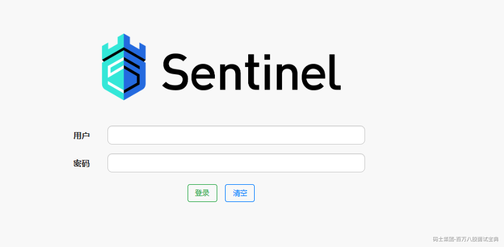
>
> **默认的用户名和密码都是 sentinel （都是小写）**
>
> 进入后，看到这个就是安装成功
>
> 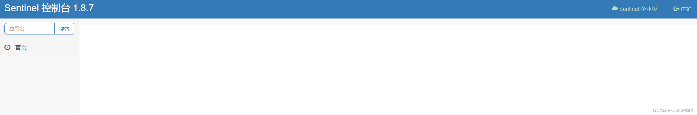

```powershell
java -jar sentinel-dashboard-1.8.7
```

## 5.3 Sentinel初体验

> 1、导入依赖

```xml
<dependency>
    <groupId>com.alibaba.cloud</groupId>
```

```plain
<artifactId>spring-cloud-starter-alibaba-sentinel</artifactId>
```

> 3、启动项目后访问任何接口，不访问，dashboard上看不到
>
> 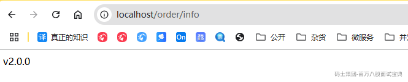
>
> 4、Sentinel的dashboard上查看服务
>
> 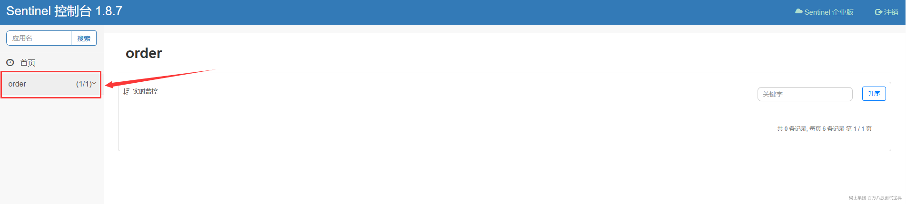

```plain

2、编写配置连接Sentinel的dashboard

```yml
spring:
  cloud:
    sentinel:
      transport:
        port: 8719
        dashboard: localhost:8080
```

## 5.4 流控规则

> 这里主要的操作就是点来点去。
>
> 在设置流控规则时，发现需要设置一个资源名，咱们有两个方式可以选择
>
> - 默认的资源名就是这个资源地址。
>
> - 可以在Controller接口（方法）追加@SentinelResource的注解，指定资源名

```plain
@GetMapping("/order/info")
@SentinelResource(value = "info")
public String info() {
    return info;
}
```

---

### 5.4.1 QPS限制

#### 5.4.1.1 直接-快速失败

> **阈值类型：QPS 单体阈值：1**
>
> **流控模式：直接**
>
> **流控效果：快速失败**
>
> 只要每秒超过2个请求，第二个请求就会触发快速失败，直接报错~

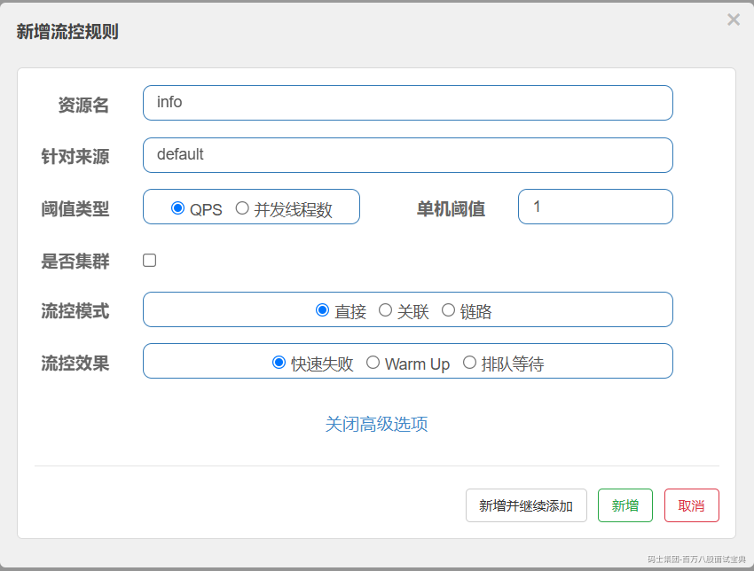

#### 5.4.1.2 直接-WarmUp

> **阈值类型：QPS 单体阈值：10**
>
> **流控模式：直接**
>
> **流控效果：WarmUp**
>
> 接口并不会一开始就支撑10的QPS，慢慢的，经过一段时间，才会将QPS限制开放到10。

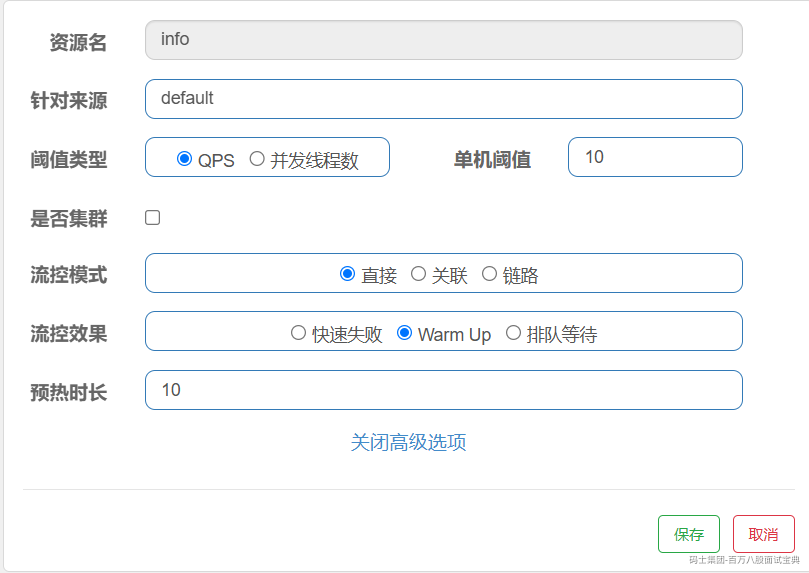


#### 5.4.1.3 直接-排队等待

> **阈值类型：QPS 单体阈值：2**
>
> **流控模式：直接**
>
> **流控效果：排队等待**
>
> QPS限制为2的时候，他会匀速的每个500ms，放一个请求进去。

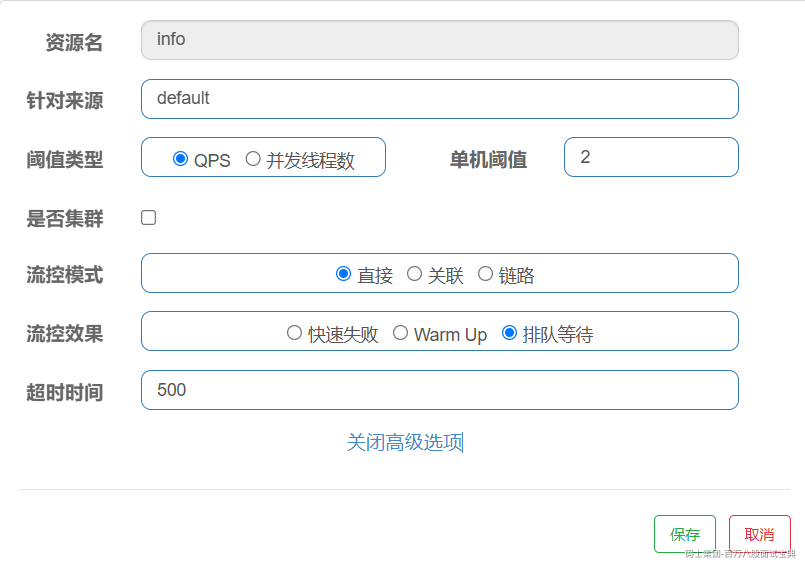

#### 5.4.1.4 关联-快速失败

> **阈值类型：QPS 单体阈值：2**
>
> **流控模式：关联**
>
> **流控效果：快速失败**
>
> 首先需要准备两个资源查看效果
>
> 给info资源设置QPS限制为1，关联的是add资源。 当频繁的访问add资源后，info就会被限制。

```java
@GetMapping("/order/info")
@SentinelResource(value = "info")
public String info() {
    return info;
}

@GetMapping("/order/add")
@SentinelResource(value = "add")
public String add() {
    return "add";
}
```

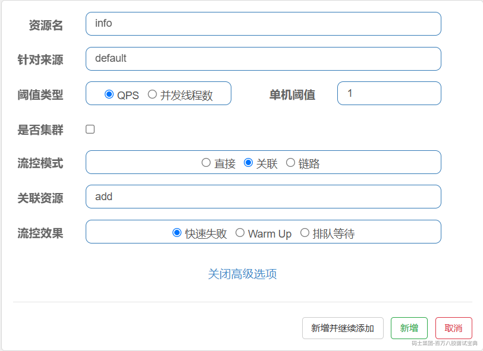

#### 5.4.1.5 链路-快速失败

> **阈值类型：QPS 单体阈值：1**
>
> **流控模式：链路**
>
> **流控效果：快速失败**
>
> 需要准备三个资源，其中两个资源作为入口，另外一个资源作为公共资源被访问
>
> **Ps：Controller中的方法默认就是资源，其次其他基于Spring管理的方法也可以作为资源，只是必须要追加上Sentinel的注解才可以。**
>
> 发现设置好之后，资源的入口是统一的，就是 **sentinel\_spring\_web\_context，导致咱们现在没有办法针对某个入口单独做链路的限制**
>
> 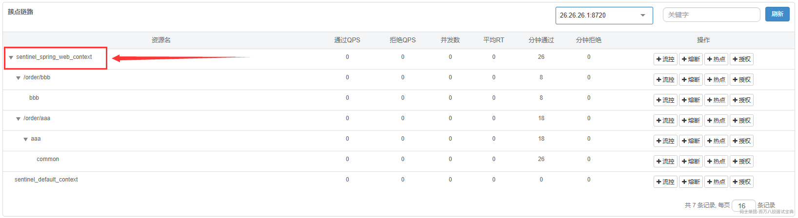
>
> 可以通过配置，将统一入口管理的模式关闭掉。就可以将每个Controller资源作为一个入口。
>
> 追加完毕后，重新启动项目，查看簇点链路。
>
> 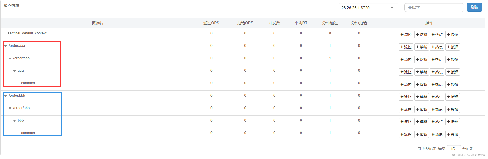controller中已经有入口资源顶头了，可以开始配置链路的效果了。
>
> 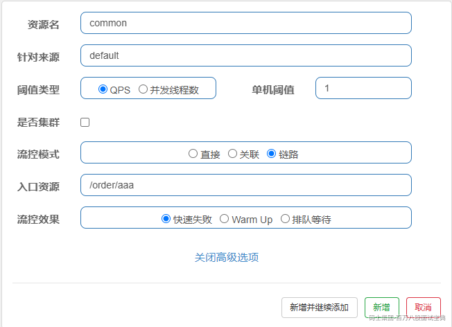
>
> 具体解决问题的issue地址：
>
> <https://github.com/alibaba/Sentinel/issues/1213>

```java
@Autowired
private OrderService orderService;

@GetMapping("/order/aaa")
@SentinelResource(value = "aaa")
public String aaa() {
    orderService.common();
    return "aaa";
}
@GetMapping("/order/bbb")
@SentinelResource(value = "bbb")
public String bbb() {
    orderService.common();
    return "bbb";
}
// ====================公共资源=======================
package com.mashibing.service.impl;

import com.alibaba.csp.sentinel.annotation.SentinelResource;
import com.mashibing.service.OrderService;
import org.springframework.stereotype.Service;

@Service
public class OrderServiceImpl implements OrderService {

    @Override
    @SentinelResource("common")
    public void common() {

    }
}
```

```yaml
spring:
  cloud:
    sentinel:
      web-context-unify: false
```

### 5.4.2 并发线程数

> 因为流控里的QPS限制聊的模式基本都点到了。
>
> 这里的并发线程数看个效果即可。
>
> **阈值类型：并发线程数 单体阈值：1**
>
> **流控模式：直接**
>
> 这个资源内部只能有一个线程在处理，如果另外一个线程来了，需要排队等待。
>
> 为了查看效果，将代码的处理时间延长

```java
@GetMapping("/order/info")
@SentinelResource(value = "info")
public String info() {
    // ============并发线程数==============
    try {
        Thread.sleep(3000);
    } catch (InterruptedException e) {
        throw new RuntimeException(e);
    }
    return info;
}
```

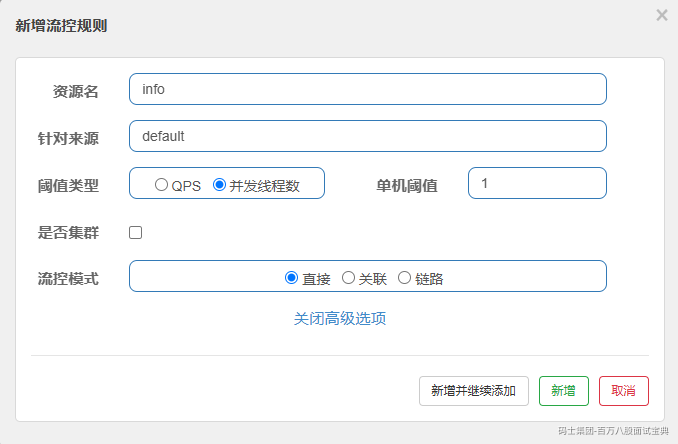


## 5.5 熔断降级

### 5.5.1 熔断降级介绍

> 服务雪崩：因为某一个服务出现问题，导致其他服务，甚至整个系统崩溃的情况，就可以称为服务雪崩
>
> 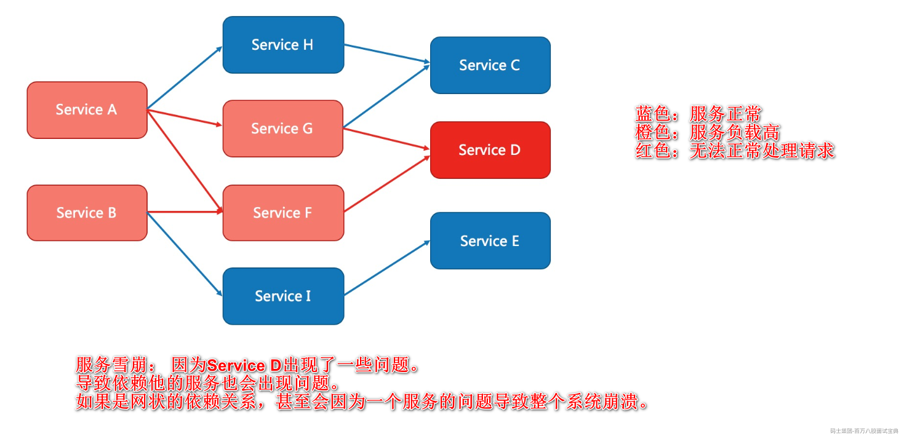
>
> 为了解决这个服务雪崩的问题，可以上熔断、降级来解决这种服务雪崩问题
>
> **降级：针对一些资源，提供一个降级的方法，当这个资源出现了一些问题时，可以快速失败，去执行降级方法，返回托底数据。**
>
> 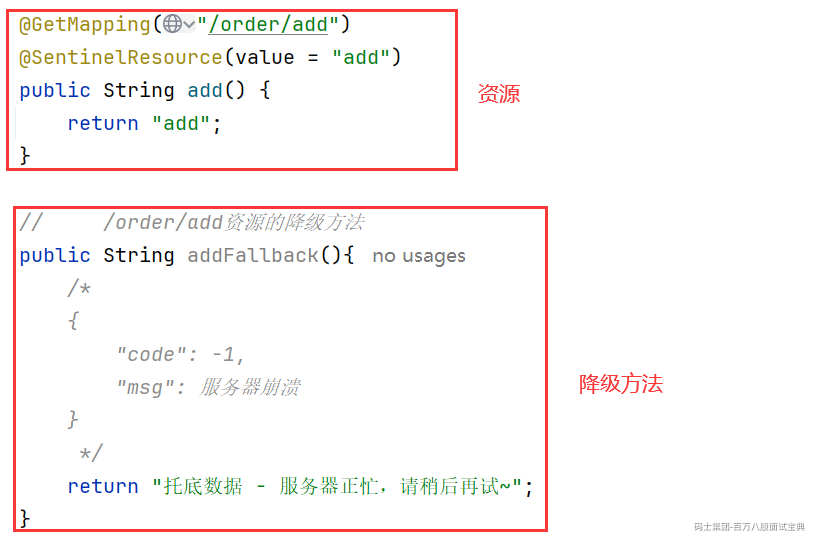
>
> **熔断：就是针对某个资源提供断路器，有Closed，Open，Half Open状态。**
>
> 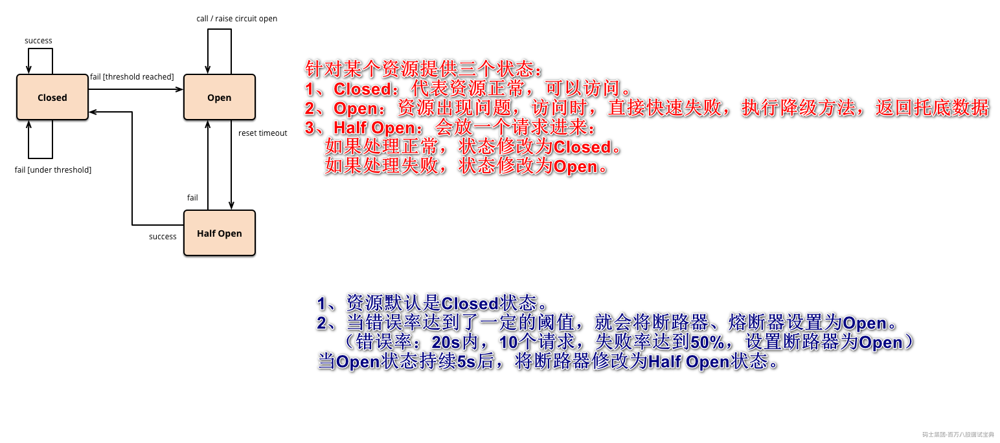
>
> **Ps：熔断和降级不是一个东西，熔断是触发降级的手段之一。**

### 5.5.2 熔断规则

> Sentinel提供的熔断规则有三种
>
> - 慢调用比例：
>
> - 请求的响应时间，大于500ms，就被统计为慢调用。
>
> - 在10s内，请求数量达到4个，开始统计熔断的阈值。
>
> - 如果慢调用统计达到了请求量的50%，就会将断路器设置为Open状态，持续10s。
>
> - 10s后，将断路器设置为Half Open状态，并放一个请求进来。
>
> - 这个请求是慢调用，那就回到Open状态。
>
> - 如果小于慢调用，设置为Closed状态。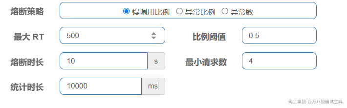
>
> - 异常比例：
>
> - 资源访问出现异常，就认定是异常。
>
> - 在10s内，请求数量达到4个，开始统计熔断的阈值。
>
> - 如果异常统计达到了请求量的50%，就会将断路器设置为Open状态，持续10s。
>
> - 10s后，将断路器设置为Half Open状态，并放一个请求进来。
>
> - 这个请求出现异常，那就回到Open状态。
>
> - 如果没异常，设置为Closed状态。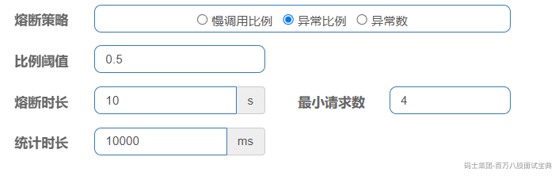
>
> - 异常数：
>
> - 资源访问出现异常，就认定是异常。
>
> - 在10s内，请求数量达到4个，开始统计熔断的阈值。
>
> - 如果异常统计达到了2个，就会将断路器设置为Open状态，持续10s。
>
> - 10s后，将断路器设置为Half Open状态，并放一个请求进来。
>
> - 这个请求出现异常，那就回到Open状态。
>
> - 如果没异常，设置为Closed状态。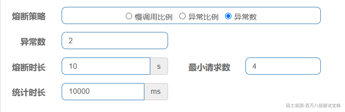

---

> 1、提供一套测试熔断效果资源，提供一个Controller
>
> 2、启动项目开始测试！
>
> **看视频查看测试效果！！！！！**

```java
// =================================熔断降级===========================
@GetMapping("/order/circuitbreaker")
@SentinelResource(value = "circuitbreaker")
public String circuitbreaker(String value) throws InterruptedException {
    switch (value){
        case "1":
            Thread.sleep(1000);
            break;
        case "2":
            int i = 1 / 0;
    }

    return "circuitbreaker - success!";
}
```

### 5.5.3 降级方法

#### 5.5.3.1 blockHandler

> Sentinel中提供的降级处理是基于@SentinelResource注解来实现的。
>
> @SentinelResource是基于AOP去实现的，So，需要让方法的访问修饰符是public。
>
> @SentinelResource注解的属性内容比较多，咱一个一个看
>
> - **blockHandler：**
>
> - blockHandler是专门处理BlockException的降级方法，指定降级方法名。
>
> - 降级方法需要public修饰
>
> - 返回类型，方法参数要匹配，方法参数最后可以追加BlockException
>
> - 降级方法跟原方法在一个类里
>
> - **BlockHandlerClass：**
>
> - 这个属性和BlockHandler配合使用，可以将降级方法声明在其他类里
>
> **BlockException：对应着Sentinel中的几种限制的方式：**
>
> - **FlowException：流控**
>
> - **DegradeException：熔断**
>
> - **ParamFlowException：热点**
>
> - **SystemBlockException：系统**
>
> - **AuthorityException：权限**

```plain
@GetMapping("/order/sentinel")
@SentinelResource(value = "sentinel",blockHandler = "sentinelBlock")
public String sentinel(@RequestParam String value) throws InterruptedException {
    // 业务代码………………
    return "sentinel - success!";
}

// 是sentinel方法的降级方法，可以在方法逻辑中返回托底数据
public String sentinelBlock(String value, BlockException exception){
    String message = null;
    if (exception instanceof FlowException){
        message = "流量控制！";
    }else if (exception instanceof DegradeException){
        message = "熔断控制";
    }

    return "failed  msg = " + message.toString();
}
```

```plain
@GetMapping("/order/sentinel")
@SentinelResource(value = "sentinel",blockHandlerClass = OrderControllerBlock.class,blockHandler = "sentinelBlock")
public String sentinel(@RequestParam String value) throws InterruptedException {
    // 业务代码………………
    return "sentinel - success!";
}
// ========================================================
public class OrderControllerBlock {

    public static String sentinelBlock(String value, BlockException exception){
        String message = null;
        if (exception instanceof FlowException){
            message = "流量控制！";
        }else if (exception instanceof DegradeException){
            message = "熔断控制";
        }

        return "failed  msg = " + message.toString();
    }

}
```

---

#### 5.5.3.2 fallback

> fallback的使用跟blockHandler就是一模一样，但是blockHandler只处理BlockException。而fallback直接处理Throwable。
>
> - fallback：指定降级方法名称
>
> - fallbackClass：指定降级方法所在的Class
>
> **Ps：若 blockHandler 和 fallback 都进行了配置，则被限流降级而抛出** `BlockException` **时只会进入** `blockHandler` **处理逻辑。**

```java
@GetMapping("/order/sentinel")
@SentinelResource(value = "sentinel",fallback = "sentinelFallback",blockHandler = "sentinelBlock")
public String sentinel(@RequestParam String value) throws InterruptedException {
    switch (value){
        case "1":
            Thread.sleep(1000);
            break;
        case "2":
            int i = 1 / 0;
    }

    return "sentinel - success!";
}

public String sentinelFallback(String value,Throwable ex){
    return "failed";
}

// 是sentinel方法的降级方法，可以在方法逻辑中返回托底数据
public String sentinelBlock(String value, BlockException exception){
    String message = null;
    if (exception instanceof FlowException){
        message = "流量控制！";
    }else if (exception instanceof DegradeException){
        message = "熔断控制";
    }

    return "failed  msg = " + message.toString();
}
```

---

#### 5.5.3.3 defaultFallback&exceptionsToIgnore

> fallback只能针对单个资源去玩，defaultFallback可以针对全局。
>
> - defaultFallback：指定默认的降级方法名称
>
> - 返回结果依然要统一
>
> - 参数列表要为空，可以额外追加一个Throwable
>
> - fallbackClass：指定降级方法所在的Class
>
> exceptionsToIgnore是针对fallback的，可以忽略掉一些异常不走降级方法

```java
@GetMapping("/order/sentinel")
@SentinelResource(value = "sentinel",defaultFallback = "defaultFallback",exceptionsToIgnore = {ArithmeticException.class})
public String sentinel(@RequestParam String value) throws InterruptedException {
    switch (value){
        case "1":
            Thread.sleep(1000);
            break;
        case "2":
            int i = 1 / 0;
    }

    return "sentinel - success!";
}
//==================默认的fallback=======================
public String defaultFallback(Throwable ex){
    return "failed msg = " + ex.getMessage();
}
```

## 5.6 热点规则（了解）

> 热点规则也属于流控的范畴。
>
> 因为流控规则是针对整个资源直接做一些限制。
>
> 而热点规则可以针对某一个字段中的参数做一些更细粒度化的流控。
>
> Sentinel可以根据资源内传入的指定参数，来做热点参数的限流，Sentinel会帮你统计单位时间内这个参数值请求的次数 **（利用LRU + 滑动时间窗口）** ，再利用 **令牌桶** 来实现具体的限流操作。
>
> 为了查看效果，需要提供一个资源，接收俩个参数~

```java
//==================热点规则=======================
@GetMapping("/order/hot")
@SentinelResource(value = "hot")
public String hot(String userId,Integer type){
    return "userId:" + userId + ",type:" + type;
}
```

---

> 根据上述编写的资源，根据userId作为限流的参数。
>
> 当userId值传递的一样时，Sentinel会统计好次数，基于QPS的方式做限制。
>
> 在 **统计窗口时长** 时 ，当然 **热点参数值** 最多可以请求 **单击阈值** 次，超过了就异常！

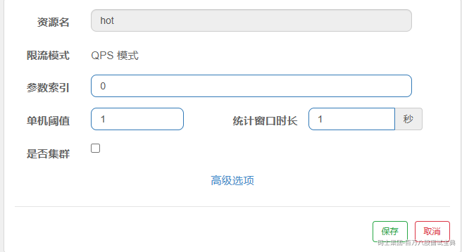

---

> 可以针对参数的具体值，再做更细粒度化的限制！
>
> 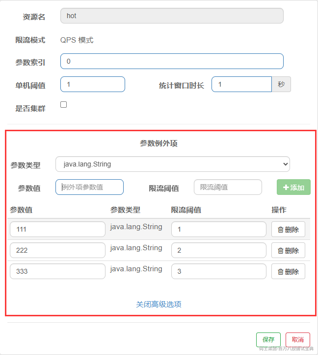

---

> 测试了一波Sentinel热点规则对于接受参数的形式
>
> - 默认资源内基于单个类型的参数接收是没问题的，包括@RequestParam，@PathVariable
>
> - 默认如果采用对象的形式接收参数，热点规则没法生效……

## 5.7 授权规则（了解）

> 所谓的授权规则，其实就是针对某一个资源的调用方的身份做验证。
>
> 可以指定黑、白名单（指定一个），只要满足要求才会放行请求，否则会被拦截。
>
> 优先准备一个资源来测试。
>
> 设置好黑白名单后，发现无法生效。
>
> 当然服务资源在做黑白明显的限制规则时，Sentinel会基于拦截器内部调用RequestOriginParser的实现类去获取请求来源的具体身份信息。因为没有默认实现的，在这种情况下，他返回的都是空串。
>
> 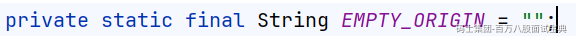
>
> 那咱们需要主动实现一个RequestOriginParser实现类，直接基于请求头获取origin中的信息作为调用方的身份。
>
> 编写后之后，在postman中发送请求，在请求头中追加了origin信息，携带上了身份，然后实现了授权的规则校验。
>
> 获取调用方身份是基于SentinelOriginParser拿到的，而校验的方式就是基于indexOf查看Sentinel中设置的授权的黑白名单身份是否包含了SentinelOriginParser获取的信息。

```java
//==================授权规则=======================
@GetMapping("/order/author")
@SentinelResource(value = "author")
public String author(){
    return "author!";
}
```

```java
package com.mashibing.author;

import com.alibaba.csp.sentinel.adapter.spring.webmvc.callback.RequestOriginParser;
import org.springframework.stereotype.Component;

import javax.servlet.http.HttpServletRequest;

@Component
public class SentinelOriginParser implements RequestOriginParser {

    @Override
    public String parseOrigin(HttpServletRequest request) {
        String origin = request.getHeader("origin");
        return origin;
    }
}
```

## 5.8 系统规则（了解）

> 系统规则不是针对某一个资源去做限制，而是针对整个服务的所有资源统一的做一些限制。
>
> 系统规则的目的是让整个系统保持可用，并且不会因为某一些资源的激增流量导致整个系统被压垮。
>
> 系统规则支持以下的模式：
>
> - **Load 自适应** （仅对 Linux/Unix-like 机器生效）：系统的 load1 作为启发指标，进行自适应系统保护。当系统 load1 超过设定的启发值，且系统当前的并发线程数超过估算的系统容量时才会触发系统保护（BBR 阶段）。系统容量由系统的 `maxQps * minRt` 估算得出。设定参考值一般是 `CPU cores * 2.5`。
>
> - **CPU usage** （1.5.0+ 版本）：当系统 CPU 使用率超过阈值即触发系统保护（取值范围 0.0-1.0），比较灵敏。
>
> - **平均 RT** ：当单台机器上所有入口流量的平均 RT 达到阈值即触发系统保护，单位是毫秒。
>
> - **并发线程数** ：当单台机器上所有入口流量的并发线程数达到阈值即触发系统保护。
>
> - **入口 QPS** ：当单台机器上所有入口流量的 QPS 达到阈值即触发系统保护。5.9 Sentinel持久化

## 5.9 动态规则、持久化

> 在Sentinel的图形化界面中配置的各种规则，都是存储在内存里的，之前配置的各种规则就全么得了。
>
> 不可能每次项目重启后，都去重新指定这些规则，成本太高了。
>
> Sentinel也支持将一些规则持久化到某个DataSource。DataSource的种类很多。大概分为了两种
>
> - 拉模式：客户端主动去查看是否变化，缺点是无法及时获取变更。
>
> - 推模式：DataSource主动去通知客户端变化的内容，有更好的实时性和一致性保证。
>
> 其中Nacos就是推模式的一种实现，直接基于Nacos来持久化Sentinel中的规则。

---

> 实现步骤：
>
> 1、导入依赖

```xml
<dependency>
    <groupId>com.alibaba.csp</groupId>
```

```plain
<artifactId>sentinel-datasource-nacos</artifactId>
```

> 3、Nacos中构建配置，编写规则，想编写这个内容
>
> 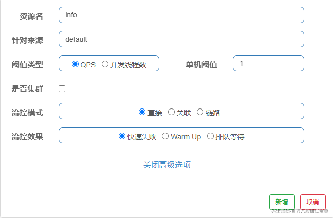
>
> Nacos的配置
>
> 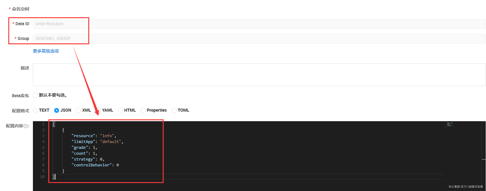

```plain

2、编写配置

```yml
spring:
  cloud:
    sentinel:
      datasource:
        flow:
          nacos:
            server-addr: ${spring.cloud.nacos.config.server-addr}
            group-id: SENTINEL_GROUP
            data-id: ${spring.application.name}-flow.json
            data-type: json
            rule-type: flow
```

```json
[
    {
        "resource": "info",
        "limitApp": "default",
        "grade": 1,
        "count": 1,
        "strategy": 0,
        "controlBehavior": 0
    }
]
```

---

> 配置熔断规则的套路
>
> 1、依赖导入
>
> …………
>
> 2、yml配置
>
> 3、Nacos的配置
>
> 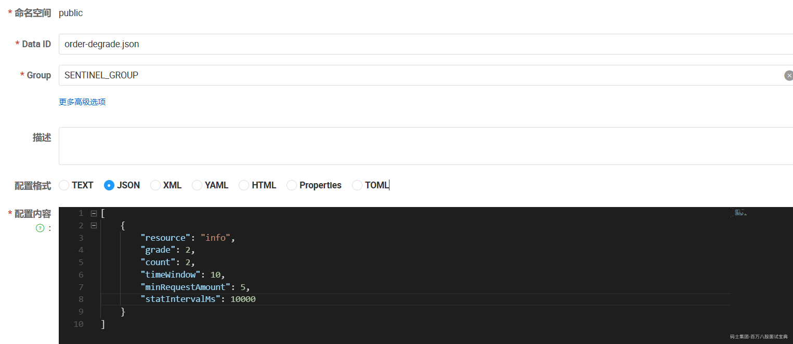
>
> 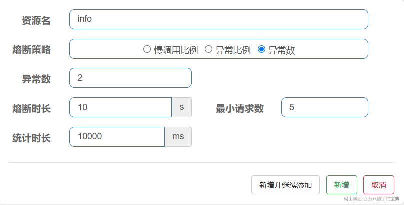

```yaml
spring:
  cloud:
    sentinel:
      datasource:
        degrade:
          nacos:
            server-addr: ${spring.cloud.nacos.config.server-addr}
            group-id: SENTINEL_GROUP
            data-id: ${spring.application.name}-degrade.json
            data-type: json
            rule-type: degrade
```

```json
[
    {
        "resource": "info",
        "grade": 2,
        "count": 2,
        "timeWindow": 10,
        "minRequestAmount": 5,
        "statIntervalMs": 10000
    }
]
```

## 5.10 OpenFeign整合Sentinel

> OpenFeign整合Sentinel的目的其实就是针对基于OpenFeign去访问其他服务时，如果出来了任何的问题，不要抛出异常，而是走降级方法，返回托底数据。
>
> 1、需要编写配置文件，开启OpenFeign跟Sentinel的整合
>
> 2、构建Feign接口的实现类，重写Feign接口的方法（重写的方法就是降级方法）
>
> 3、在Feign接口中指定@FeignClient的fallback属性
>
> 
>
> 有同学会有疑问，这样OpenFeign不就有俩实现类在Spring容器中了么？ Spring怎么知道到底注入哪一个。其实OpenFeign是基于@FeignClient中的primary属性，指定了Feign接口的代理对象作为咱们注入的主要对象。
>
> 至于FallbackFactory就不实现了，大概知道可以利用fallback或者fallbackFactory两种形式，不过都是基于构建Feign接口实现类去玩的。

```yaml
feign:
  circuitbreaker:
    enabled: true
```

```java
package com.mashibing.client.fallback;

import com.mashibing.client.StockClient;
import org.springframework.stereotype.Component;

@Component
public class StockClientFallback implements StockClient {
  
    @Override
    public String test() {
        return "test的降级方法，服务器正忙，请稍后再试！！";
    }
}
```

```java
@FeignClient(value = "stock",fallback = StockClientFallback.class)
public interface StockClient {
```

# 六、Gateway

## 6.1 网关介绍

> 首先要清楚网关的定位，他是后端服务的入口，有请求想要访问你的订单，或者库存，或者是其他服务时，必须要经过网关将请求转发过去。
>
> 至于入口安全的策略做到位，后面的基本都安全。
>
> So，可以在网关位置做好统一的鉴权，限流，安全机制的操作。
>
> 一般网关的实现方式很多，一般我认为网关有两类：
>
> 1、面向用户的
>
> - 面向用户的网关中间件，就是Nginx。
>
> - Nginx的并发能力非常强，用户请求可以先达到Nginx，再由Nginx转发到其他的服务中。
>
> - Nginx也不是SpringCloud生态，跟注册中心整合成本很高，其次Nginx也没有办法去基于Java编写具体的逻辑业务。
>
> 2、后端入口的
>
> - 后端入口，一般就是咱们现在要学的Gateway，当然还有Netflix开源的Zuul
>
> - Gateway相对Nginx并发能力是比较差的。
>
> - Gateway本身就是SpringCloud生态中的一个组件，他可以直接跟注册中心整合，基于服务名直接获取到服务的元数据。
>
> - Gateway还提供了各种Filter，可以在请求进来，以及响应之前做各种操作。
>
> 这里需要说一下之前SpringCloud集成的Zuul。
>
> Zuul采用的是Tomcat容器，使用的是非常传统的Servlet IO的处理模型。
>
> Servlet本身是一个非常简单的网络IO模型，当请求进入到Web服务时，Web服务会给他分配一个线程（Web容器线程池里拿的），在并发不高的时候，没任何问题。
>
> 如果并发比较高的话会导致线程变多。
>
> - 线程占用内存资源，如果并发特别大，线程池又没控制，会导致内存资源占用较多。
>
> - 线程太多，CPU的资源都浪费在了大量的线程之间切换中。
>
> 所以在并发比较高的情况下，不希望网关采用传统的Servlet IO模型，不要给每一个请求都分配一个线程。
>
> 问题得知了，Gateway自然没有采用这个方案。
>
> So，Gateway他底层使用的是Spring Framework里提供的一个WebFlux组件。WebFlux模型替换了旧的Servlet IO模型。用少量的线程处理request和response，而这种线程可以称为Loop线程。
>
> 而具体的业务逻辑代码，Gateway内部是基于WebFlux里面使用的Reactive Streams这种异步编程的方式去处理。
>
> 而处理请求的那个Loop线程，就可以对应上Reactor模型中的Reactor线程。而基于这种模型实现的高性能的通讯框架，最常见的，就是Netty。而Reactor线程对应Netty就可以理解为是EventLoop线程。
>
> 这里先不要去纠结他的底层，就可以理解为，WebFlux处理请求，就可以上Netty。
>
> 基于上述性能基本上是最强的Netty来通讯，再结合Reactive Streams这种异步编程。
>
> Gateway的性能远高于之前的Zuul，并发能力更强。
>
> **Ps：虽然Zuul的新版本也使用的Netty作为底层的Reactor模型实现，但是，SpringCloud不跟他玩了。。。自己搞了一个Gateway。**
>
> **咱们不要深入IO，网络，异步编程。等后期，微服务落地搞定了，再去深入，可以看周老师的IO精讲，李瑾老师的Netty，还有我的Reactive Streams异步线程。**

---

---

---

---

## 6.2 Gateway介绍

> Gateway作为网关，依然是做请求的转发和过滤
>
> 其次，咱们还需要了解一些Gateway的相关术语。
>
> 下图是Gateway的底层请求流转过程。
>
> 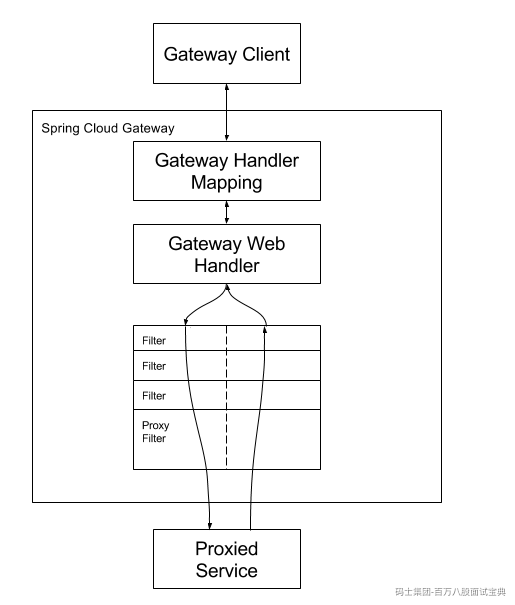
>
> 1、三个角色
>
> - 客户端
>
> - Gateway
>
> - 目标服务
>
> 2、整个流程
>
> - 客户端请求发送到Gateway
>
> - Gateway基于HandlerMapping确认请求能否匹配谓词。如果不匹配，404……
>
> - 如果匹配请求交给Web Handler处理，经过一个过滤器链的前置处理。
>
> - 将请求转发到具体的目标服务，目标服务处理好逻辑，再响应给Gateway。
>
> - 再经过Gateway的过滤器链的后置处理，依次响应，最终响应给客户端。

```plain
Spring Cloud Gateway的特点：
  基于Spring Framework 5、Project Reactor和Spring Boot 2.0构建
  能够匹配任何请求属性上的路由。
在请求转发时，可以根据请求所携带的任何报文作为请求转发的要求…………
  谓词和过滤器是特定于路由的。
谓词就是配置转发的需要编写的内容， 过滤器就是可以自己编写的一些逻辑。
  Hystrix断路器集成。
可以集成Sentinel
  Spring Cloud DiscoveryClient集成
可以集成Nacos
  易于编写的谓词和过滤器
写着方便，可以在配置文件里写，也可以写在Java代码里。
  请求速率限制
限流功能，Gateway提供了这种Filter，除了这种还有很多其他…………
  路径重写
可以在转发请求前，以及响应数据前，对各种报文做修改
```

```plain
专业术语：
Route（路由）:
网关内部的一个核心机制，他由ID、目标URI、谓词集合和过滤器集合。
当谓词匹配上后，会经过Filter，转发请求到目标URI。

Predicate（断言、谓词）: 
他可以匹配HTTP请求中锁携带的所有报文信息。基于某几个作为匹配的规则，比如请求头，请求参数，甚至cookie等……

Filter（过滤器）:
可以在发送下游请求之前或之后，修改请求或响应。
```

## 6.3 Gateway初体验

> 1、启动好目标服务，确保目标服务的接口可以单独访问。
>
> 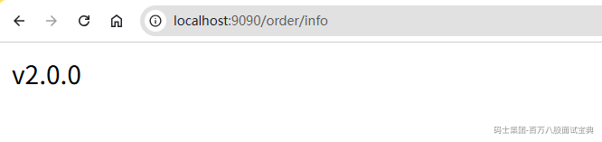
>
> 2、创建gateway项目。
>
> 3、导入依赖。

```xml
<dependencies>
    <dependency>
        <groupId>org.springframework.cloud</groupId>
```

```plain
    <artifactId>spring-cloud-starter-gateway</artifactId>
```

```plain
</dependency>
```

```plain
<dependency>
    <groupId>com.alibaba.cloud</groupId>
```

```plain
    <artifactId>spring-cloud-starter-alibaba-nacos-discovery</artifactId>
```

```plain
</dependency>
```

```plain
<dependency>
    <groupId>org.springframework.cloud</groupId>
```

```plain
    <artifactId>spring-cloud-starter-loadbalancer</artifactId>
```

```plain
</dependency>
```

> 5、编写配置文件
>
> 6、测试效果
>
> 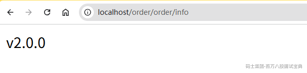
>
> <http://localhost/order/order/info>
>
> <http://localhost> **/order /order/info**
>
> - <http://localhost：> 代表访问gateway服务
>
> - **/order：** 代表路由的服务是订单服务
>
> - **/order/info：** 代表访问/order/info接口

```plain

4、创建启动类

```java
@SpringBootApplication
@EnableDiscoveryClient
public class GatewayStarterApp {

    public static void main(String[] args) {
        SpringApplication.run(GatewayStarterApp.class, args);
    }
}
```

```yaml
spring:
  application:
    name: gateway
  cloud:
    gateway:
      discovery:
        locator:
          # 开启默认的路由规则，会根据注册中心中的服务名作为路径实现理由规则
          enabled: true
server:
  port: 80
```

## 6.4 自定义路由配置

> 其实就是基于断言去实现请求进来后的路由规则。

### 6.4.1 yml方式

> 查看好路由的规则

```yaml
spring:
  application:
    name: gateway
  cloud:
    gateway:
      discovery:
        locator:
          # 开启默认的路由规则，会根据注册中心中的服务名作为路径实现理由规则
          enabled: false
      routes:
        - id: path_route
          uri: http://localhost:9090/
          predicates:
            - Path=/order/**
          # http://localhost/order/order/info  路由到    http://localhost:9090/order/order/info
          # http://localhost/order/info   路由到    http://localhost:9090/order/info
```

### 6.4.2 配置类方式

```java
import org.springframework.cloud.gateway.route.RouteLocator;
import org.springframework.cloud.gateway.route.builder.RouteLocatorBuilder;
import org.springframework.context.annotation.Bean;
import org.springframework.context.annotation.Configuration;

@Configuration
public class GatewayRoutesConfig {

    @Bean
    public RouteLocator pathRoute(RouteLocatorBuilder routeLocatorBuilder) {
        //1、基于routeLocatorBuilder获取构建route的Builder
        RouteLocatorBuilder.Builder routes = routeLocatorBuilder.routes();
        //2、设置route
        return routes.route("path_route",route -> route.path("/order/**").uri("http://localhost:9090/")).build();
        /*
        #        - id: path_route
        #          uri: http://localhost:9090/
        #          predicates:
        #            - Path=/order/**
        */
    }

```

### 6.4.3 负载均衡

> 之前的Gateway自带的基于服务名的路由和负载方式都是默认提供的。
>
> 自定义配置，想去找注册中心，并且实现负载均衡，只需要修改uri即可。
>
> 配置类的修改：
>
> yml方式

```java
import org.springframework.cloud.gateway.route.RouteLocator;
import org.springframework.cloud.gateway.route.builder.RouteLocatorBuilder;
import org.springframework.context.annotation.Bean;
import org.springframework.context.annotation.Configuration;

@Configuration
public class GatewayRoutesConfig {

    @Bean
    public RouteLocator pathRoute(RouteLocatorBuilder routeLocatorBuilder) {
        //1、基于routeLocatorBuilder获取构建route的Builder
        RouteLocatorBuilder.Builder routes = routeLocatorBuilder.routes();
        //2、设置route                                                         将uri修改为lb://服务名即可
        return routes.route("path_route",route -> route.path("/order/**").uri("lb://order")).build();
    }

}

```

```yaml
spring:
  cloud:
    gateway:
      routes:
        - id: path_route
          #  这个位置  ，lb代表负载均衡
          uri: lb://order
          predicates:
            - Path=/order/**
```

## 6.5 断言

### 6.5.1 断言介绍

> Gateway中内置了很多中断言，并且每个route可以配置多个断言，如果配置了多个，那就必须满足所有断言才会将请求路由到对应的服务。
>
> 断言种类很多，一个一个先聊一下作用，然后随后挑几个玩一下。
>
> 1. **After：匹配具体时间后的请求，才可以做路由。**
>
> 2. **Before：匹配具体时间前的请求……**
>
> 3. **Between：配置时间范围内的请求……**
>
> 4. **Cookie：请求携带cookie，只要匹配cookie配置中指定的正则即可理由……**
>
> 5. **Header：请求携带请求头，只要匹配header设置的正则即可……**
>
> 6. **Host：匹配当前请求是否来自于设置的主机（域名）**
>
> 7. **Method：匹配请求方式……**
>
> 8. **Path：匹配请求路径……**
>
> 9. **Query：匹配请求参数……**
>
> 10. **RemoteAddr：匹配请求来源的IP地址……**
>
> 11. **Weight：指定路由时的权重，两个参数，分组group，权重weight**
>
> 12. **XForWardedRemoteAddr：匹配请求头的x-for-warded或者remoteAddr，查看请求来源……**

---

### 6.5.2 断言测试

> After：在xxx时间之后才可以正常的路由

```yaml
spring:
  cloud:
    gateway:
      routes:
        - id: path_route
          uri: lb://order
          predicates:
            - Path=/order/**
#            - After=2025-05-16T19:30:25.789+08:00[Asia/Shanghai]
#            - After=2026-05-16T19:30:25.789+08:00[Asia/Shanghai]
```

---

> Header：请求头里必须携带xxx=yyy

```yaml
spring:
  cloud:
    gateway:
      routes:
        - id: path_route
          uri: lb://order
          predicates:
            - Path=/order/**
            - Header=X-Request-Id, \d+
```

---

> Method：请求方式的匹配

```yaml
spring:
  cloud:
    gateway:
      routes:
        - id: path_route
          uri: lb://order
          predicates:
            - Path=/order/**
            - Method=GET
```

…………

## 6.6 Filter

> Filter是在请求到Gateway服务后，基于断言确认请求可以转发，之后在转发请求的前后，会经过Filter链。
>
> 分成两块去玩：
>
> - 玩Gateway提供的一些Filter
>
> - 自定义Filter

### 6.6.1 Gateway自带的Filter

> Gateway自带的Filter有点多，一个一个玩的意义不大，就玩4个最常用的就得了，别的不碰了。

#### 6.6.1.1 `AddRequestHeader`

> 在请求转发到目标服务之前，追加一个请求头信息

```yaml
spring:
  cloud:
    gateway:
      routes:
        - id: path_route
          uri: lb://order
          predicates:
            - Path=/order/**
          filters:
            - AddRequestHeader=X-Request-red, blue
```

#### 6.6.1.2 `AddRequestParameter`

> 在请求转发到目标服务之前，追加一个请求参数

```yaml
spring:
  cloud:
    gateway:
      routes:
        - id: path_route
          uri: lb://order
          predicates:
            - Path=/order/**
          filters:
            - AddRequestHeader=X-Request-red, blue
            - AddRequestParameter=red, blue
```

#### 6.6.1.3 `AddResponseHeader`

> 在响应数据给客户端之前，追加一个响应头的信息

```yaml
spring:
  cloud:
    gateway:
      routes:
        - id: path_route
          uri: lb://order
          predicates:
            - Path=/order/**
          filters:
            - AddRequestHeader=X-Request-red, blue
            - AddRequestParameter=red, blue
            - AddResponseHeader=X-Response-Red, Blue
```

#### 6.6.1.4 `StripPrefix`

> 在请求路径打到Gateway后，如果断言匹配后。
>
> 可以忽略掉客户端请求地址后的几个路径。

```yaml
spring:
  cloud:
    gateway:
      routes:
        - id: path_route
          uri: lb://order
          predicates:
            - Path=/order/**
          filters:
            - AddRequestHeader=X-Request-red, blue
            - AddRequestParameter=red, blue
            - AddResponseHeader=X-Response-Red, Blue
            - StripPrefix=1
          # http://localhost/order/order/info  路由到    http://localhost:9090/order/info
          # http://localhost/order/info   路由到    http://localhost:9090/info
```

#### 6.6.1.5 `DefaultFilter`

> 前面玩Filter都是基于某一个route单独配置，如果有一些Filter，需要全局都指定的话，可以基于DefaultFilter配置，所有的route都会走这个defaultFilter的规则。

```yaml
spring:
  cloud:
    gateway:
      default-filters:
        - AddRequestHeader=X-Request-red, blue
        - AddRequestParameter=red, blue
        - AddResponseHeader=X-Response-Red, Blue
        - StripPrefix=1
```

### 6.6.2 自定义过滤器

> 前面玩的都是Gateway自带的过滤器，如果想实现自定义的过滤器，非常简单，只需要创建好类，实现对应的接口，重新方法，在方法里追加逻辑即可。
>
> 需要实现两个接口
>
> - GlobalFilter：重写filter方法，在内部基于exchange可以拿到请求报文和响应报文的信息，在filter方法内部可以做限流啊，鉴权啊等等操作。
>
> - 方法返回exchange.getResponse().setComplete(); 拦截请求。
>
> - 方法返回chain.filter(exchange); 放行操作。
>
> - Ordered：指定多个过滤器之间的执行顺序，返回的数值越小，优先级越高。

```java
package com.mashibing.filters;

import com.alibaba.nacos.common.utils.StringUtils;
import org.springframework.cloud.gateway.filter.GatewayFilterChain;
import org.springframework.cloud.gateway.filter.GlobalFilter;
import org.springframework.core.Ordered;
import org.springframework.http.HttpStatus;
import org.springframework.stereotype.Component;
import org.springframework.web.server.ServerWebExchange;
import reactor.core.publisher.Mono;

/**
 * 实现Gateway的自定义过滤器，并且实现参数校验。
 */
@Component
public class ParameterInvalidateFilter implements GlobalFilter, Ordered {

    // 要求必须传递一个参数，   key=value, 要求value不允许为空，也不允许为空串，否则400的错误
    @Override
    public Mono<Void> filter(ServerWebExchange exchange, GatewayFilterChain chain) {
        // 具体的逻辑在这些。
        String value = exchange.getRequest().getQueryParams().getFirst("key");
        // 判断
        if(StringUtils.isEmpty(value)){
            System.out.println("参数异常！！！");
            exchange.getResponse().setStatusCode(HttpStatus.BAD_REQUEST);
            // 拦截住，直接不往下走Filter了。
            return exchange.getResponse().setComplete();
        }
        return chain.filter(exchange);
    }

    @Override
    // 返回的数值越小，优先级越高。
    public int getOrder() {
        return 0;
    }
}

```
