# 【第一篇】SpringSecurity的初次邂逅


## 1.Spring Security概念

  Spring Security是Spring采用 `AOP`思想，基于 `servlet过滤器`实现的安全框架。它提供了完善的认证机制和方法级的授权功能。是一款非常优秀的权限管理框架。

  Spring Security是一个功能强大且高度可定制的身份验证和访问控制框架。它是用于保护基于Spring的应用程序的事实上的标准。

   Spring Security是一个框架，致力于为Java应用程序提供身份验证和授权。像所有Spring项目一样，Spring Security的真正强大之处在于它可以轻松扩展以满足定制需求的能力。

**特征**

- **对身份验证和授权的全面且可扩展的支持**

- **保护免受会话固定，点击劫持，跨站点请求伪造等攻击**

- **Servlet API集成**

- **与Spring Web MVC的可选集成**

### 1.2 快速入门案例

#### 1.2.1 环境准备

  我们准备一个SpringMVC+Spring+jsp的Web环境，然后在这个基础上整合SpringSecurity。

**首先创建Web项目**

**添加相关的依赖**

```plain
  <dependencies>
    <dependency>
      <groupId>junit</groupId>

      <artifactId>junit</artifactId>

      <version>4.11</version>

      <scope>test</scope>

    </dependency>

    <dependency>
      <groupId>org.springframework</groupId>

      <artifactId>spring-webmvc</artifactId>

      <version>5.2.1.RELEASE</version>

    </dependency>

    <dependency>
      <groupId>javax.servlet</groupId>

      <artifactId>servlet-api</artifactId>

      <version>2.5</version>

      <scope>provided</scope>

    </dependency>

    <dependency>
      <groupId>org.slf4j</groupId>

      <artifactId>slf4j-log4j12</artifactId>

      <version>1.7.25</version>

    </dependency>

  </dependencies>

```

**添加相关的配置文件**

**Spring配置文件**

```plain
<?xml version="1.0" encoding="UTF-8"?>
<beans xmlns="http://www.springframework.org/schema/beans"
       xmlns:xsi="http://www.w3.org/2001/XMLSchema-instance"
       xmlns:context="http://www.springframework.org/schema/context"
       xsi:schemaLocation="http://www.springframework.org/schema/beans
       http://www.springframework.org/schema/beans/spring-beans.xsd
        http://www.springframework.org/schema/context
       http://www.springframework.org/schema/context/spring-context.xsd">

    <context:component-scan base-package="com.bobo.service" ></context:component-scan>

</beans>

```

**SpringMVC配置文件**

```plain
<?xml version="1.0" encoding="UTF-8"?>
<beans xmlns="http://www.springframework.org/schema/beans"
       xmlns:xsi="http://www.w3.org/2001/XMLSchema-instance"
       xmlns:context="http://www.springframework.org/schema/context"
       xmlns:mvc="http://www.springframework.org/schema/mvc"
       xsi:schemaLocation="http://www.springframework.org/schema/beans
       http://www.springframework.org/schema/beans/spring-beans.xsd
        http://www.springframework.org/schema/context
       http://www.springframework.org/schema/context/spring-context.xsd
        http://www.springframework.org/schema/mvc
       http://www.springframework.org/schema/mvc/spring-mvc.xsd">

    <context:component-scan base-package="com.bobo.controller"></context:component-scan>

    <mvc:annotation-driven ></mvc:annotation-driven>

</beans>

```

**log4j.properties文件**

```plain
log4j.rootCategory=INFO, stdout

log4j.appender.stdout=org.apache.log4j.ConsoleAppender
log4j.appender.stdout.layout=org.apache.log4j.PatternLayout
log4j.appender.stdout.layout.ConversionPattern=[QC] %p [%t] %C.%M(%L) | %m%n

```

**web.xml**

```plain
<!DOCTYPE web-app PUBLIC
        "-//Sun Microsystems, Inc.//DTD Web Application 2.3//EN"
        "http://java.sun.com/dtd/web-app_2_3.dtd" >

<web-app version="2.5" id="WebApp_ID" xmlns="http://java.sun.com/xml/ns/javaee"
         xmlns:xsi="http://www.w3.org/2001/XMLSchema-instance"
         xsi:schemaLocation="http://java.sun.com/xml/ns/javaee
 http://java.sun.com/xml/ns/javaee/web-app_2_5.xsd">
  <display-name>Archetype Created Web Application</display-name>

  <!-- 初始化spring容器 -->
  <context-param>
    <param-name>contextConfigLocation</param-name>

    <param-value>classpath:applicationContext.xml</param-value>

  </context-param>

  <listener>
    <listener-class>org.springframework.web.context.ContextLoaderListener</listener-class>

  </listener>

  <!-- post乱码过滤器 -->
  <filter>
    <filter-name>CharacterEncodingFilter</filter-name>

    <filter-class>org.springframework.web.filter.CharacterEncodingFilter</filter-class>

    <init-param>
      <param-name>encoding</param-name>

      <param-value>utf-8</param-value>

    </init-param>

  </filter>

  <filter-mapping>
    <filter-name>CharacterEncodingFilter</filter-name>

    <url-pattern>/*</url-pattern>

  </filter-mapping>

  <!-- 前端控制器 -->
  <servlet>
    <servlet-name>dispatcherServletb</servlet-name>

    <servlet-class>org.springframework.web.servlet.DispatcherServlet</servlet-class>

    <!-- contextConfigLocation不是必须的， 如果不配置contextConfigLocation， springmvc的配置文件默认在：WEB-INF/servlet的name+"-servlet.xml" -->
    <init-param>
      <param-name>contextConfigLocation</param-name>

      <param-value>classpath:spring-mvc.xml</param-value>

    </init-param>

    <load-on-startup>1</load-on-startup>

  </servlet>

  <servlet-mapping>
    <servlet-name>dispatcherServletb</servlet-name>

    <!-- 拦截所有请求jsp除外 -->
    <url-pattern>/</url-pattern>

  </servlet-mapping>

</web-app>

```

**添加Tomcat的插件 启动测试**

```plain
    <plugins>
      <plugin>
        <groupId>org.apache.tomcat.maven</groupId>

        <artifactId>tomcat7-maven-plugin</artifactId>

        <version>2.2</version>

        <configuration>
          <port>8082</port>

          <path>/</path>

        </configuration>

      </plugin>

    </plugins>

```

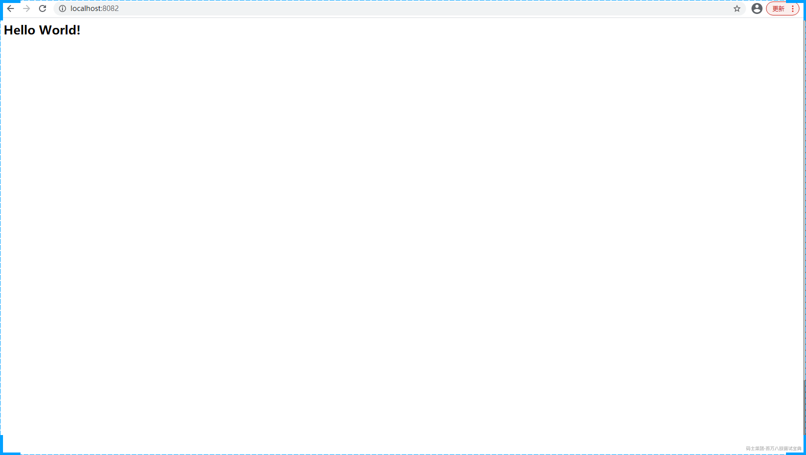

#### 1.2.2 整合SpringSecurity

**添加相关的依赖**

**spring-security-core.jar 核心包，任何SpringSecurity的功能都需要此包**

**spring-security-web.jar:web工程必备，包含过滤器和相关的web安全的基础结构代码**

**spring-security-config.jar：用于xml文件解析处理**

**spring-security-tablibs.jar:动态标签库**

```plain
<!-- 添加SpringSecurity的相关依赖 -->
<dependency>
    <groupId>org.springframework.security</groupId>

    <artifactId>spring-security-config</artifactId>

    <version>5.1.5.RELEASE</version>

</dependency>

<dependency>
    <groupId>org.springframework.security</groupId>

    <artifactId>spring-security-taglibs</artifactId>

    <version>5.1.5.RELEASE</version>

</dependency>

```

**web.xml文件中配置SpringSecurity**

```plain
  <!-- 配置过滤器链 springSecurityFilterChain 名称固定 -->
  <filter>
    <filter-name>springSecurityFilterChain</filter-name>

    <filter-class>org.springframework.web.filter.DelegatingFilterProxy</filter-class>

  </filter>

  <filter-mapping>
    <filter-name>springSecurityFilterChain</filter-name>

    <url-pattern>/*</url-pattern>

  </filter-mapping>

```

**添加SpringSecurity的配置文件**

```plain
<?xml version="1.0" encoding="UTF-8"?>
<beans xmlns="http://www.springframework.org/schema/beans"
       xmlns:xsi="http://www.w3.org/2001/XMLSchema-instance"
       xmlns:security="http://www.springframework.org/schema/security"
       xsi:schemaLocation="http://www.springframework.org/schema/beans
       http://www.springframework.org/schema/beans/spring-beans.xsd
       http://www.springframework.org/schema/security
       http://www.springframework.org/schema/security/spring-security.xsd">
    <!-- SpringSecurity配置文件 -->
    <!--
        auto-config:表示自动加载SpringSecurity的配置文件
        use-expressions：表示使用Spring的EL表达式
     -->
    <security:http auto-config="true" use-expressions="true">
        <!--
            拦截资源
            pattern="/**" 拦截所有的资源
            access="hasAnyRole('ROLE_USER')" 表示只有ROLE_USER 这个角色可以访问资源
         -->
        <security:intercept-url pattern="/**" access="hasAnyRole('ROLE_USER')" ></security:intercept-url>

    </security:http>

    <!-- 认证用户信息 -->
    <security:authentication-manager>
        <security:authentication-provider>
            <security:user-service >
                <!-- 设置一个账号 zhangsan 密码123 {noop} 表示不加密 具有的角色是  ROLE_USER-->
                <security:user name="zhangsan" authorities="ROLE_USER" password="{noop}123" ></security:user>

                <security:user name="lisi" authorities="ROLE_USER" password="{noop}123456" ></security:user>

            </security:user-service>

        </security:authentication-provider>

    </security:authentication-manager>

</beans>

```

**将SpringSecurity的配置文件引入到Spring中**

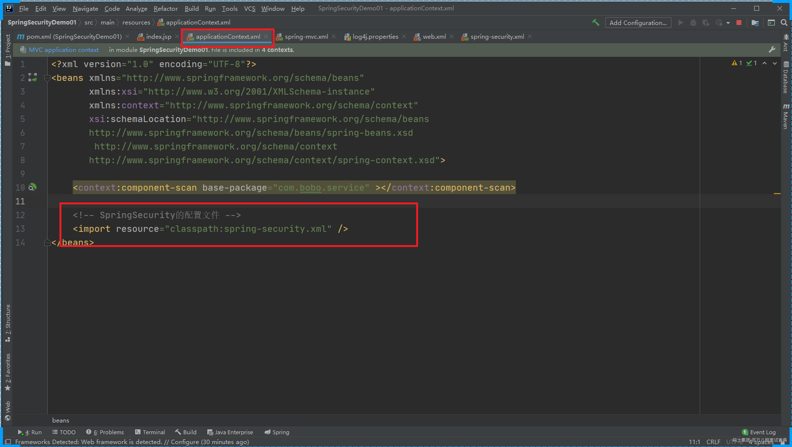

**启动测试访问**

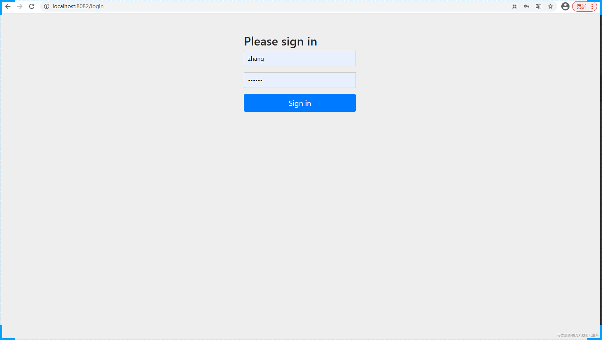

## 2. 认证操作

### 2.1 自定义登录页面

如何使用我们自己写的登录页面呢？

```plain
<%--
  Created by IntelliJ IDEA.
  User: dpb
  Date: 2021/3/16
  Time: 16:57
  To change this template use File | Settings | File Templates.
--%>
<%@ page contentType="text/html;charset=UTF-8" language="java" %>
<html>
<head>
    <title>Title</title>

</head>

<body>
    <h1>登录页面</h1>

    <form action="/login" method="post">
        账号:<input type="text" name="username"><br>
        密码:<input type="password" name="password"><br>
        <input type="submit" value="登录">
    </form>

</body>

</html>

```

**修改相关的配置文件**

```plain
<?xml version="1.0" encoding="UTF-8"?>
<beans xmlns="http://www.springframework.org/schema/beans"
       xmlns:xsi="http://www.w3.org/2001/XMLSchema-instance"
       xmlns:security="http://www.springframework.org/schema/security"
       xsi:schemaLocation="http://www.springframework.org/schema/beans
       http://www.springframework.org/schema/beans/spring-beans.xsd
       http://www.springframework.org/schema/security
       http://www.springframework.org/schema/security/spring-security.xsd">
    <!-- SpringSecurity配置文件 -->
    <!--
        auto-config:表示自动加载SpringSecurity的配置文件
        use-expressions：表示使用Spring的EL表达式
     -->
    <security:http auto-config="true" use-expressions="true">
        <!-- 匿名访问登录页面-->
        <security:intercept-url pattern="/login.jsp" access="permitAll()"/>
        <!--
            拦截资源
            pattern="/**" 拦截所有的资源
            access="hasAnyRole('ROLE_USER')" 表示只有ROLE_USER 这个角色可以访问资源
         -->
        <security:intercept-url pattern="/**" access="hasAnyRole('ROLE_USER')" />

        <!--
            配置认证的信息
        -->
        <security:form-login login-page="/login.jsp"
                             login-processing-url="/login"
                             default-target-url="/home.jsp"
                             authentication-failure-url="/error.jsp"
        />
        <!-- 注销 -->
        <security:logout logout-url="/logout"
                         logout-success-url="/login.jsp" />
    </security:http>

    <!-- 认证用户信息 -->
    <security:authentication-manager>
        <security:authentication-provider>
            <security:user-service >
                <!-- 设置一个账号 zhangsan 密码123 {noop} 表示不加密 具有的角色是  ROLE_USER-->
                <security:user name="zhangsan" authorities="ROLE_USER" password="{noop}123" ></security:user>

                <security:user name="lisi" authorities="ROLE_USER" password="{noop}123456" ></security:user>

            </security:user-service>

        </security:authentication-provider>

    </security:authentication-manager>

</beans>

```

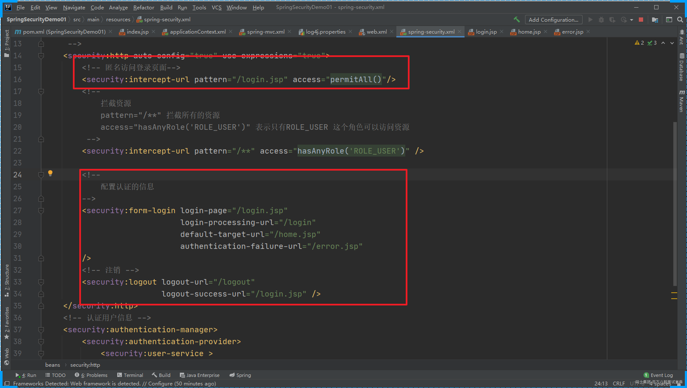

**访问home.jsp页面后会自动跳转到自定义的登录页面，说明这个需求是实现了**

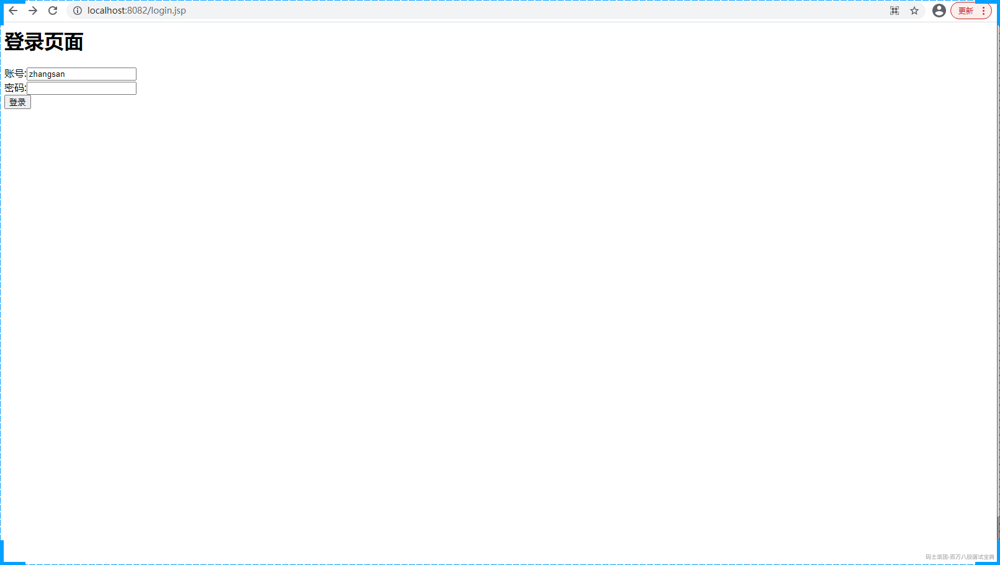

**但是当我们提交了请求后页面出现了如下的错误**

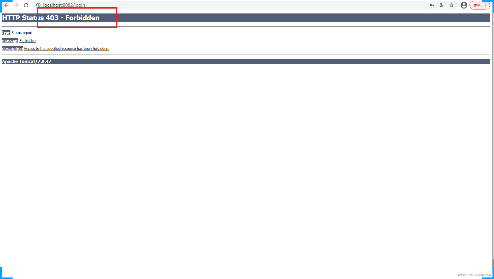

### 2.2 关闭CSRF拦截

**为什么系统默认的登录页面提交没有CRSF拦截的问题呢**

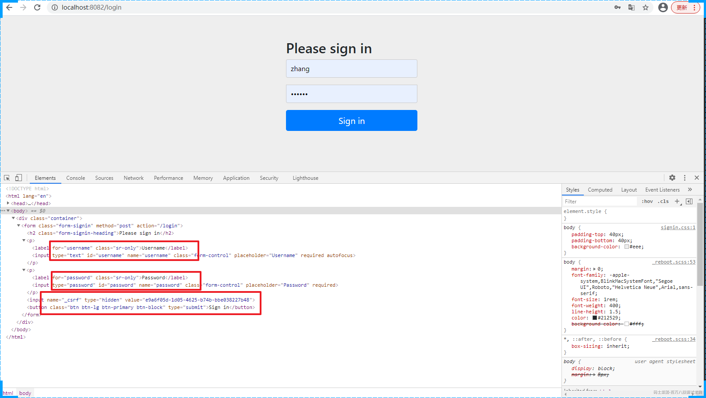

**我自定义的认证页面没有这个信息怎么办呢？两种方式：**

**关闭CSRF拦截**

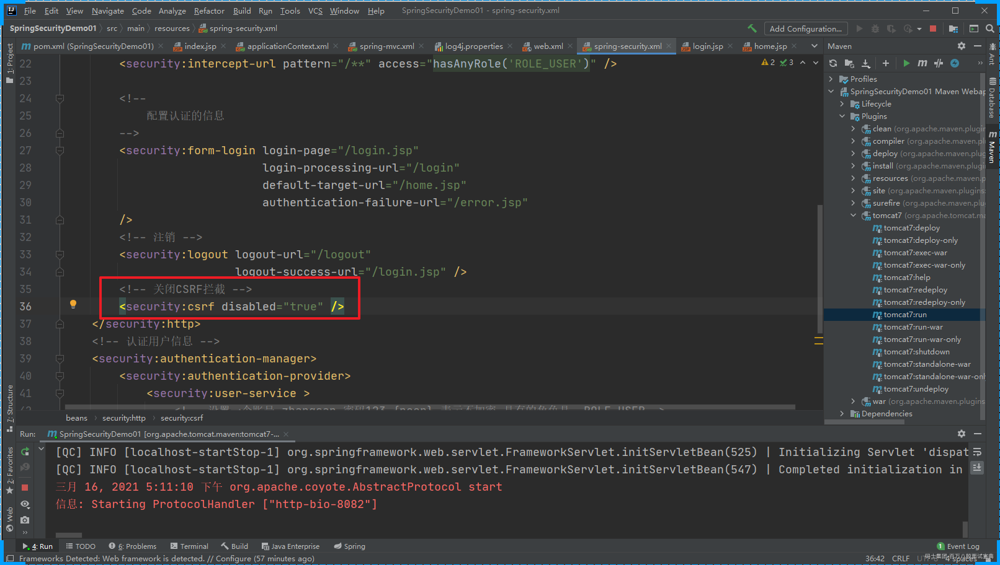

**登录成功~**

**使用CSRF防护**

**在页面中添加对应taglib**

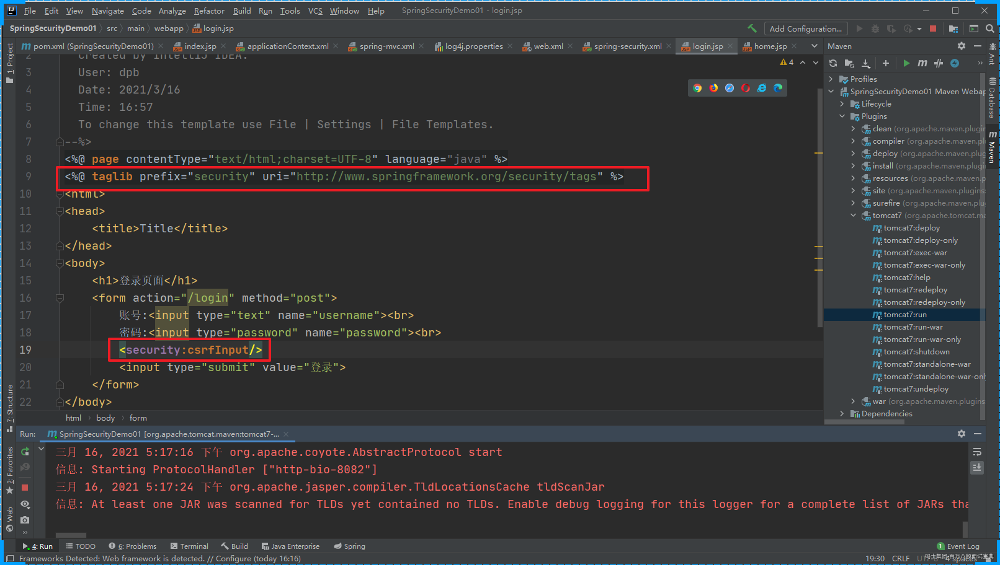

**我们访问登录页面**

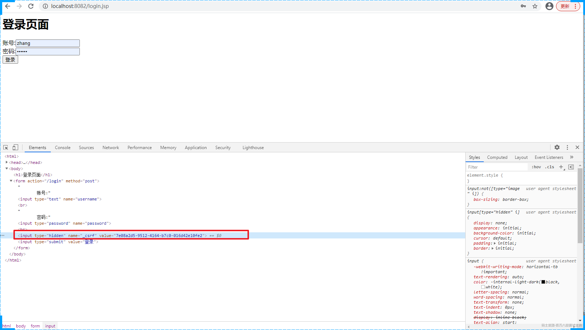

**登录成功**

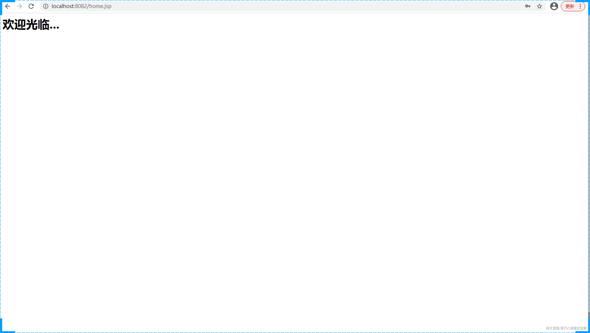

### 2.3 数据库认证

  前面的案例我们的账号信息是直接写在配置文件中的，这显然是不太好的，我们来介绍小如何实现和数据库中的信息进行认证

**添加相关的依赖**

```plain
    <dependency>
      <groupId>org.mybatis</groupId>

      <artifactId>mybatis</artifactId>

      <version>3.5.4</version>

    </dependency>

    <dependency>
      <groupId>org.mybatis</groupId>

      <artifactId>mybatis-spring</artifactId>

      <version>2.0.4</version>

    </dependency>

    <dependency>
      <groupId>mysql</groupId>

      <artifactId>mysql-connector-java</artifactId>

      <version>8.0.11</version>

    </dependency>

    <dependency>
      <groupId>com.alibaba</groupId>

      <artifactId>druid</artifactId>

      <version>1.1.8</version>

    </dependency>

```

**添加配置文件**

```plain
jdbc.driver=com.mysql.cj.jdbc.Driver
jdbc.url=jdbc:mysql://localhost:3306/logistics?characterEncoding=utf-8&serverTimezone=UTC
jdbc.username=root
jdbc.password=123456
```

```plain
<?xml version="1.0" encoding="UTF-8"?>
<beans xmlns="http://www.springframework.org/schema/beans"
       xmlns:xsi="http://www.w3.org/2001/XMLSchema-instance"
       xmlns:context="http://www.springframework.org/schema/context"
       xsi:schemaLocation="http://www.springframework.org/schema/beans
       http://www.springframework.org/schema/beans/spring-beans.xsd
        http://www.springframework.org/schema/context
       http://www.springframework.org/schema/context/spring-context.xsd">

    <context:component-scan base-package="com.bobo.service" ></context:component-scan>

    <!-- SpringSecurity的配置文件 -->
    <import resource="classpath:spring-security.xml" />

    <context:property-placeholder location="classpath:db.properties" />
    <bean class="com.alibaba.druid.pool.DruidDataSource" id="dataSource">
        <property name="url" value="${jdbc.url}" />
        <property name="driverClassName" value="${jdbc.driver}" />
        <property name="username" value="${jdbc.username}" />
        <property name="password" value="${jdbc.password}" />
     </bean>

    <bean class="org.mybatis.spring.SqlSessionFactoryBean" id="sessionFactoryBean" >
        <property name="dataSource" ref="dataSource" />
        <property name="configLocation" value="classpath:mybatis-config.xml" />
        <property name="mapperLocations" value="classpath:mapper/*.xml" />
    </bean>

    <bean class="org.mybatis.spring.mapper.MapperScannerConfigurer">
        <property name="basePackage" value="com.bobo.mapper" />
    </bean>

</beans>

```

**需要完成认证的service中继承 UserDetailsService父接口**

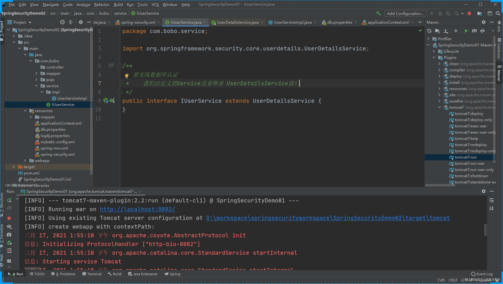

**实现类中实现验证方法**

```plain
package com.bobo.service.impl;

import com.bobo.mapper.UserMapper;
import com.bobo.pojo.User;
import com.bobo.pojo.UserExample;
import com.bobo.service.IUserService;
import org.springframework.beans.factory.annotation.Autowired;
import org.springframework.security.core.authority.SimpleGrantedAuthority;
import org.springframework.security.core.userdetails.UserDetails;
import org.springframework.security.core.userdetails.UsernameNotFoundException;
import org.springframework.stereotype.Service;

import java.util.ArrayList;
import java.util.List;

@Service
public class UserServiceImpl implements IUserService {

    @Autowired
    private UserMapper mapper;

    @Override
    public UserDetails loadUserByUsername(String s) throws UsernameNotFoundException {
        // 根据账号查询用户信息
        UserExample example = new UserExample();
        example.createCriteria().andUserNameEqualTo(s);
        List<User> users = mapper.selectByExample(example);
        if(users != null && users.size() > 0){
            User user = users.get(0);
            if(user != null){
                List<SimpleGrantedAuthority> authorities = new ArrayList<>();
                // 设置登录账号的角色
                authorities.add(new SimpleGrantedAuthority("ROLE_USER"));
                UserDetails userDetails = new org.springframework.security.core.userdetails.User(
                        user.getUserName(),"{noop}"+user.getPassword(),authorities
                );
                return userDetails;
            }
        }
        return null;
    }
}

```

**最后修改配置文件关联我们自定义的service即可**

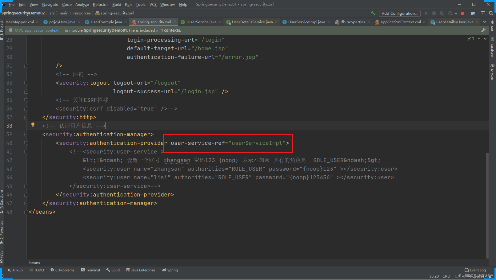

### 2.4 加密

**在SpringSecurity中推荐我们是使用的加密算法是 BCryptPasswordEncoder**

**首先生成秘闻**

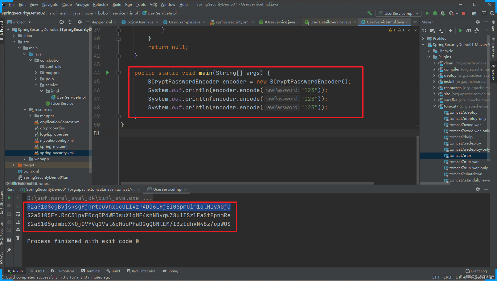

**修改配置文件**

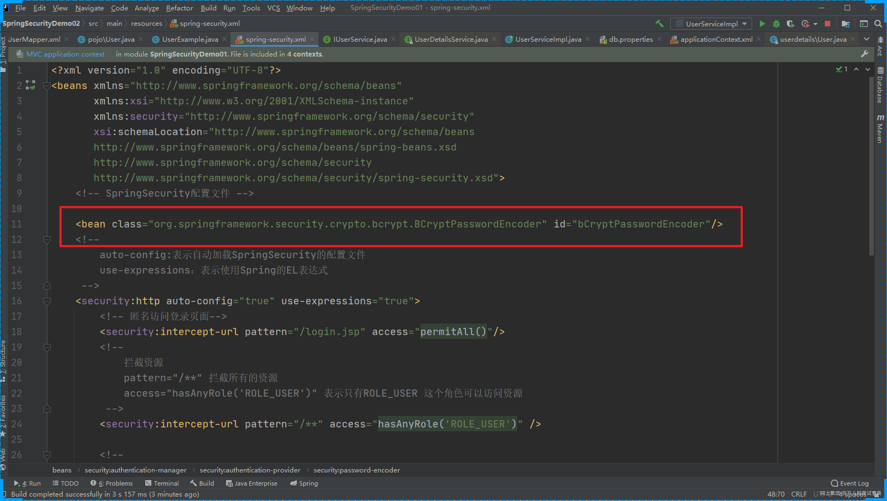

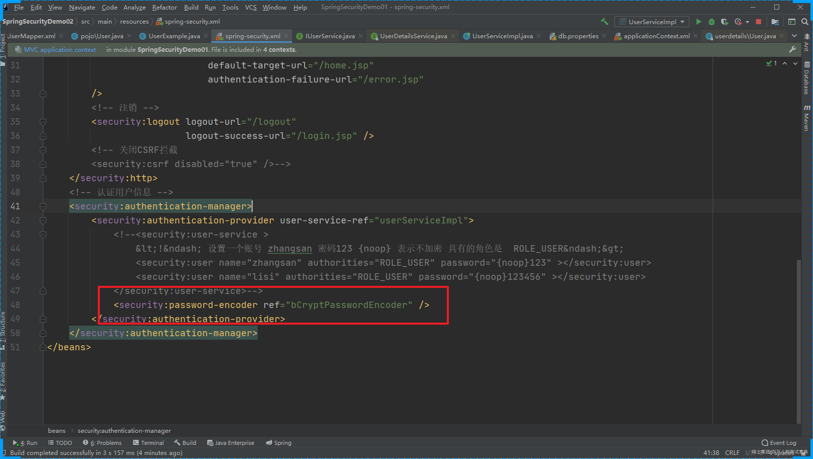

**去掉** `{noop}`

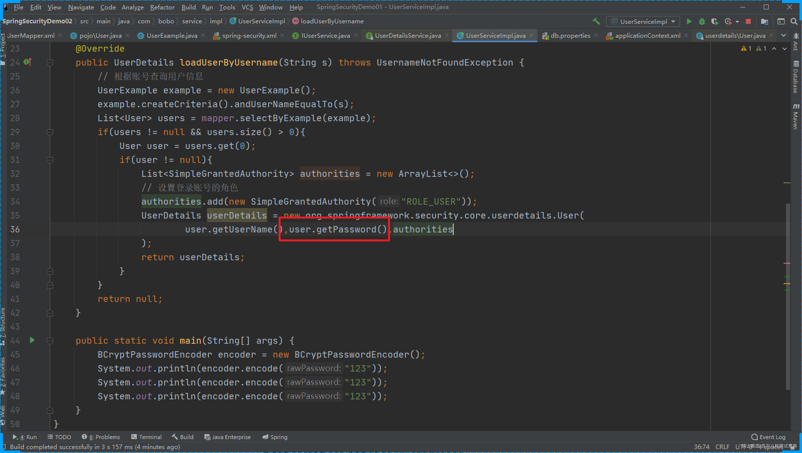

### 2.5 认证状态

  用户的状态包括 是否可用，账号过期，凭证过期，账号锁定等等。

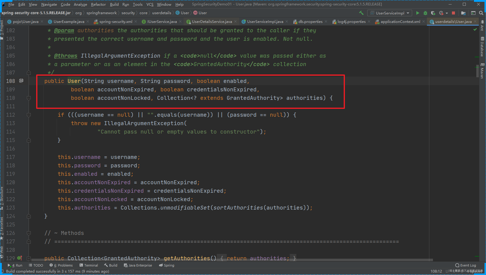

   我们可以在用户的表结构中添加相关的字段来维护这种关系

### 2.6 记住我

**在表单页面添加一个** `记住我`的按钮.

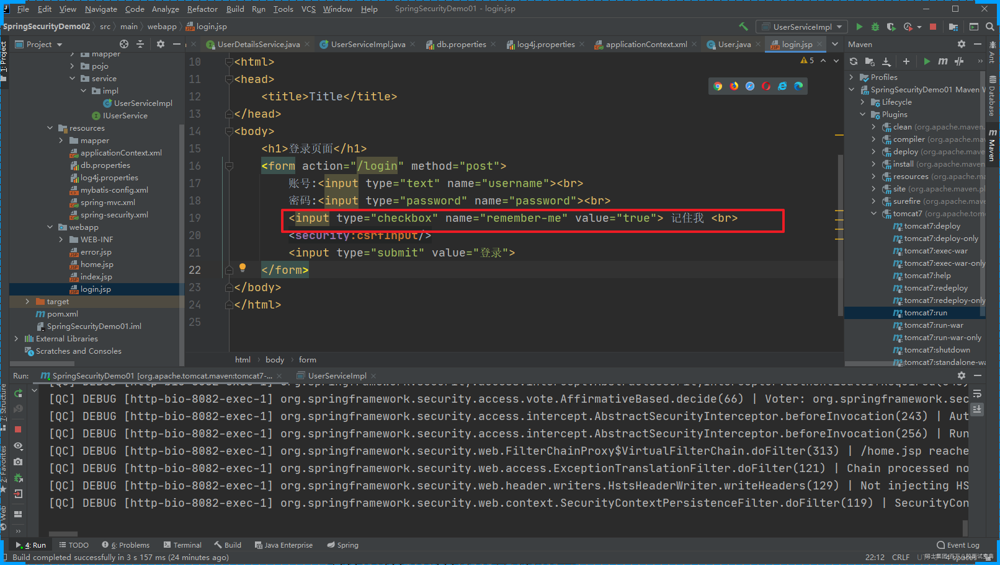

**在SpringSecurity中默认是关闭 RememberMe功能的，我们需要放开**

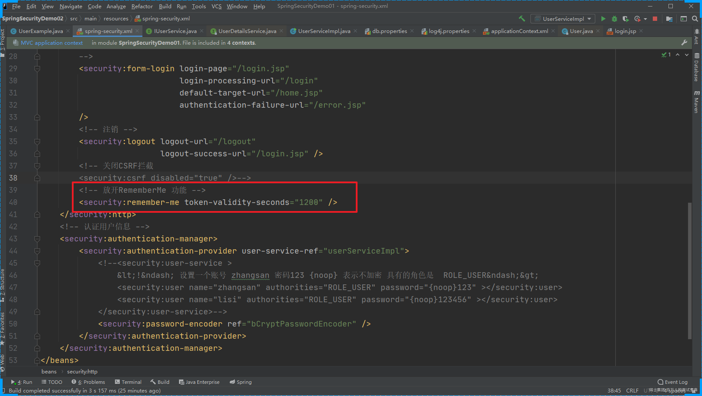

**这样就配置好了。**

**记住我的功能会方便大家的使用，但是安全性却是令人担忧的，因为Cookie信息存储在客户端很容易被盗取，这时我们可以将这些数据持久化到数据库中。**

```plain
CREATE TABLE `persistent_logins` (
`username` VARCHAR (64) NOT NULL,
`series` VARCHAR (64) NOT NULL,
`token` VARCHAR (64) NOT NULL,
`last_used` TIMESTAMP NOT NULL,
PRIMARY KEY (`series`)
) ENGINE = INNODB DEFAULT CHARSET = utf8

```

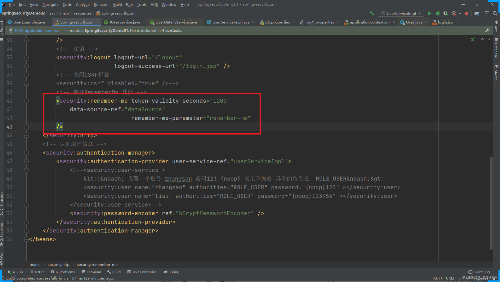

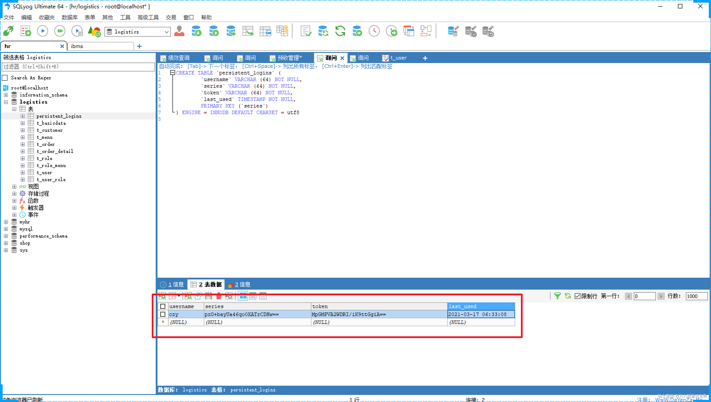

**注意设置了过期时间，到期后并不是删除表结构中的数据，而是客户端不会在携带相关信息了，同时删除掉数据库中的数据** `记住我`也会失效

## 3. 授权

### 3.1 注解使用

**开启注解的支持**

```plain
<?xml version="1.0" encoding="UTF-8"?>
<beans xmlns="http://www.springframework.org/schema/beans"
       xmlns:xsi="http://www.w3.org/2001/XMLSchema-instance"
       xmlns:context="http://www.springframework.org/schema/context"
       xmlns:mvc="http://www.springframework.org/schema/mvc"
       xmlns:security="http://www.springframework.org/schema/security"
       xsi:schemaLocation="http://www.springframework.org/schema/beans
       http://www.springframework.org/schema/beans/spring-beans.xsd
        http://www.springframework.org/schema/context
       http://www.springframework.org/schema/context/spring-context.xsd
        http://www.springframework.org/schema/mvc
       http://www.springframework.org/schema/mvc/spring-mvc.xsd
       http://www.springframework.org/schema/security
        http://www.springframework.org/schema/security/spring-security.xsd">

    <context:component-scan base-package="com.bobo.controller"></context:component-scan>

    <mvc:annotation-driven ></mvc:annotation-driven>

    <!--
        开启权限控制注解支持
        jsr250-annotations="enabled" 表示支持jsr250-api的注解支持，需要jsr250-api的jar包
        pre-post-annotations="enabled" 表示支持Spring的表达式注解
        secured-annotations="enabled" 这个才是SpringSecurity提供的注解
     -->
    <security:global-method-security
        jsr250-annotations="enabled"
        pre-post-annotations="enabled"
        secured-annotations="enabled"
    />
</beans>

```

**jsr250的使用**

**添加依赖**

```plain
<dependency>
    <groupId>javax.annotation</groupId>

    <artifactId>jsr250-api</artifactId>

    <version>1.0</version>

</dependency>

```

**控制器中通过注解设置**

```plain
package com.bobo.controller;

import org.springframework.stereotype.Controller;
import org.springframework.web.bind.annotation.RequestMapping;

import javax.annotation.security.RolesAllowed;

@Controller
@RequestMapping("/user")
public class UserController {

    @RolesAllowed(value = {"ROLE_ADMIN"})
    @RequestMapping("/query")
    public String query(){
        System.out.println("用户查询....");
        return "/home.jsp";
    }
    @RolesAllowed(value = {"ROLE_USER"})
    @RequestMapping("/save")
    public String save(){
        System.out.println("用户添加....");
        return "/home.jsp";
    }

    @RequestMapping("/update")
    public String update(){
        System.out.println("用户更新....");
        return "/home.jsp";
    }
}

```

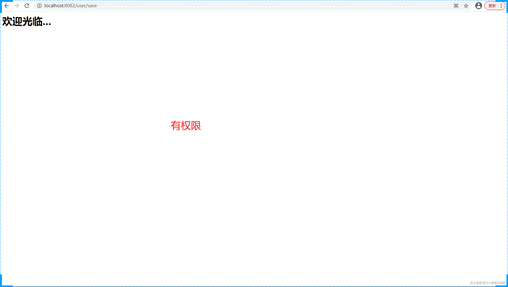

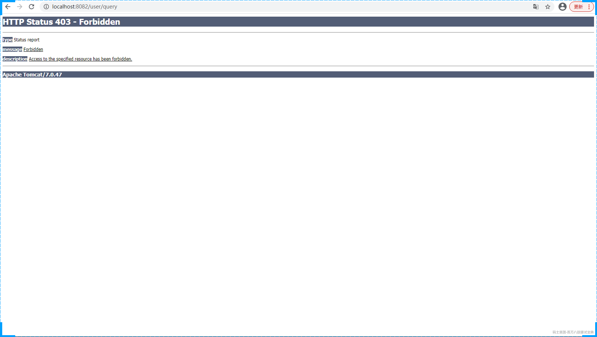

**Spring表达式的使用**

```plain
package com.bobo.controller;

import org.springframework.security.access.prepost.PreAuthorize;
import org.springframework.stereotype.Controller;
import org.springframework.web.bind.annotation.RequestMapping;

import javax.annotation.security.RolesAllowed;

@Controller
@RequestMapping("/order")
public class OrderController {

    @PreAuthorize(value = "hasAnyRole('ROLE_USER')")
    @RequestMapping("/query")
    public String query(){
        System.out.println("用户查询....");
        return "/home.jsp";
    }
    @PreAuthorize(value = "hasAnyRole('ROLE_ADMIN')")
    @RequestMapping("/save")
    public String save(){
        System.out.println("用户添加....");
        return "/home.jsp";
    }

    @RequestMapping("/update")
    public String update(){
        System.out.println("用户更新....");
        return "/home.jsp";
    }
}

```

**SpringSecurity提供的注解**

```plain
package com.bobo.controller;

import org.springframework.security.access.annotation.Secured;
import org.springframework.security.access.prepost.PreAuthorize;
import org.springframework.stereotype.Controller;
import org.springframework.web.bind.annotation.RequestMapping;

@Controller
@RequestMapping("/role")
public class RoleController {

    @Secured("ROLE_USER")
    @RequestMapping("/query")
    public String query(){
        System.out.println("用户查询....");
        return "/home.jsp";
    }

    @Secured("ROLE_ADMIN")
    @RequestMapping("/save")
    public String save(){
        System.out.println("用户添加....");
        return "/home.jsp";
    }

    @RequestMapping("/update")
    public String update(){
        System.out.println("用户更新....");
        return "/home.jsp";
    }
}

```

**异常处理**

**新增一个错误页面，然后在SpringSecurity的配置文件中配置即可**

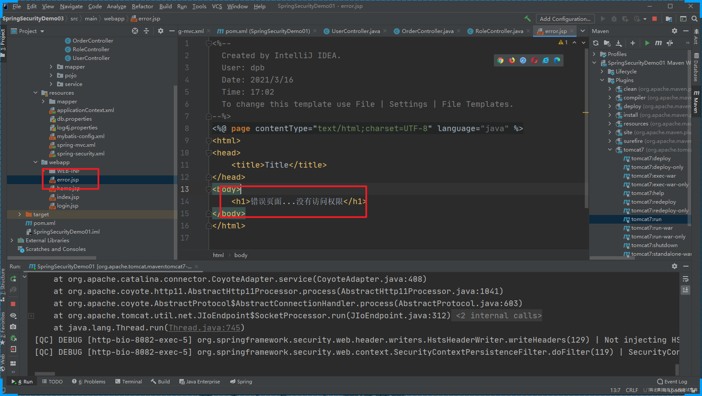

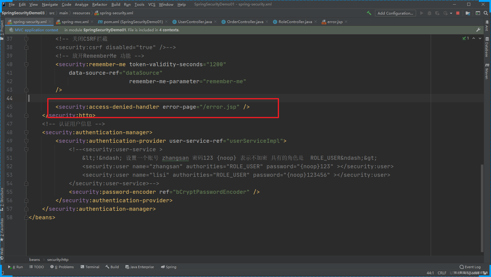

**当然你也可以使用前面介绍的SpringMVC中的各种异常处理器处理**

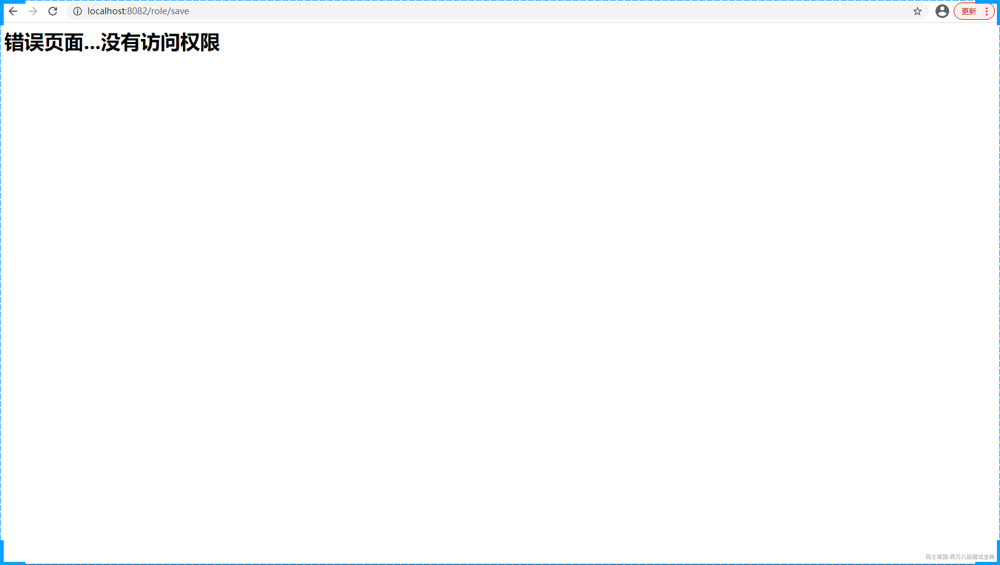

### 3.2 标签使用

  前面介绍的注解的权限管理可以控制用户是否具有这个操作的权限，但是当用户具有了这个权限后进入到具体的操作页面，这时我们还有进行更细粒度的控制，这时注解的方式就不太适用了，这时我们可以通过标签来处里

**添加SpringSecurity的标签库**

```plain
<%--
  Created by IntelliJ IDEA.
  User: dpb
  Date: 2021/3/16
  Time: 17:02
  To change this template use File | Settings | File Templates.
--%>
<%@ page contentType="text/html;charset=UTF-8" language="java" %>
<%@ taglib prefix="security" uri="http://www.springframework.org/security/tags" %>
<html>
<head>
    <title>Title</title>

</head>

<body>
    <h1>欢迎光临...</h1>

    <security:authentication property="principal.username" />
    <security:authorize access="hasAnyRole('ROLE_USER')" >
        <a href="#">用户查询</a><br>
    </security:authorize>

    <security:authorize access="hasAnyRole('ROLE_ADMIN')" >
        <a href="#">用户添加</a><br>
    </security:authorize>

    <security:authorize access="hasAnyRole('ROLE_USER')" >
        <a href="#">用户更新</a><br>
    </security:authorize>

    <security:authorize access="hasAnyRole('ROLE_ADMIN')" >
        <a href="#">用户删除</a><br>
    </security:authorize>

</body>

</html>

```

**页面效果**

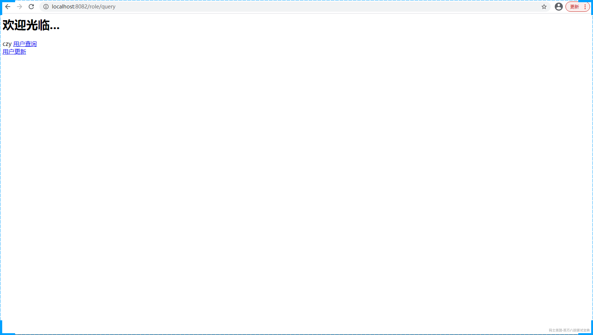
