# SpringSecurity源码的初探


# 一、SpringSecurity中的核心组件

  在SpringSecurity中的jar分为4个，作用分别为

|  |  |
| --- | --- |
| jar | 作用 |
| spring-security-core | SpringSecurity的核心jar包，认证和授权的核心代码都在这里面 |
| spring-security-config | 如果使用Spring Security XML名称空间进行配置或Spring Security的 Java configuration支持，则需要它 |
| spring-security-web | 用于Spring Security web身份验证服务和基于url的访问控制 |
| spring-security-test | 测试单元 |

## 1.SecurityContextHolder

  首先来看看在spring-security-core中的SecurityContextHolder，这个是一个非常基础的对象，存储了当前应用的上下文SecurityContext，而在SecurityContext可以获取Authentication对象。也就是当前认证的相关信息会存储在Authentication对象中。

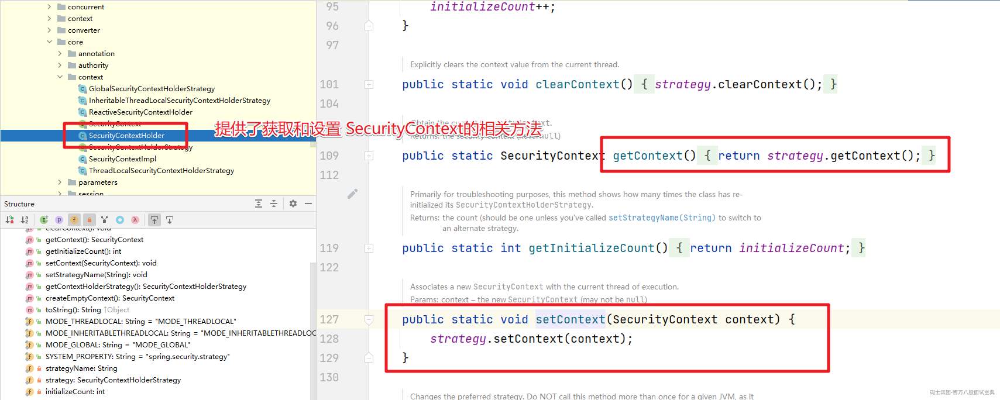

  默认情况下，SecurityContextHolder是通过 `ThreadLocal`来存储对应的信息的。也就是在一个线程中我们可以通过这种方式来获取当前登录的用户的相关信息。而在SecurityContext中就只提供了对Authentication对象操作的方法

```java
public interface SecurityContext extends Serializable {

    Authentication getAuthentication();

    void setAuthentication(Authentication authentication);

}
```

xxxStrategy的各种实现

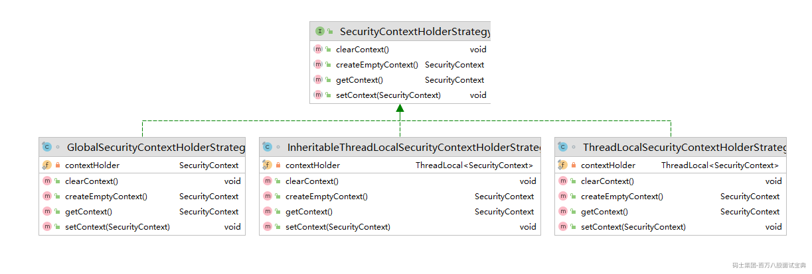

|                                               |                                                                                        |
| --------------------------------------------- | -------------------------------------------------------------------------------------- |
| 策略实现                                          | 说明                                                                                     |
| GlobalSecurityContextHolderStrategy           | 把SecurityContext存储为static变量                                                            |
| InheritableThreadLocalSecurityContextStrategy | 把SecurityContext存储在InheritableThreadLocal中 InheritableThreadLocal解决父线程生成的变量传递到子线程中进行使用 |
| ThreadLocalSecurityContextStrategy            | 把SecurityContext存储在ThreadLocal中                                                        |

## 2.Authentication

  Authentication是一个认证对象。在Authentication接口中声明了如下的相关方法。

```java
public interface Authentication extends Principal, Serializable {

    // 获取认证用户拥有的对应的权限
    Collection<? extends GrantedAuthority> getAuthorities();

    // 获取哦凭证
    Object getCredentials();

    // 存储有关身份验证请求的其他详细信息。这些可能是 IP地址、证书编号等
    Object getDetails();

     // 获取用户信息 通常是 UserDetails 对象
    Object getPrincipal();

    // 是否认证
    boolean isAuthenticated();

    // 设置认证状态
    void setAuthenticated(boolean isAuthenticated) throws IllegalArgumentException;

}
```

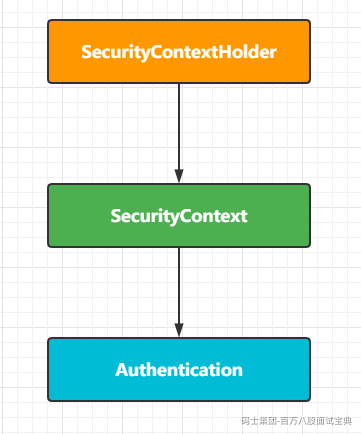

  基于上面讲解的三者的关系我们在项目中如此来获取当前登录的用户信息了。

```java
    public String hello(){
        Authentication authentication = SecurityContextHolder.getContext().getAuthentication();
        Object principal = authentication.getPrincipal();
        if(principal instanceof UserDetails){
            UserDetails userDetails = (UserDetails) principal;
            System.out.println(userDetails.getUsername());
            return "当前登录的账号是：" + userDetails.getUsername();
        }
        return "当前登录的账号-->" + principal.toString();
    }
```

  调用 `getContext()`返回的对象是 `SecurityContext`接口的一个实例，这个对象就是保存在线程中的。接下来将看到，Spring Security中的认证大都返回一个 `UserDetails`的实例作为principa。

## 3.UserDetailsService

  在上面的关系中我们看到在Authentication中存储当前登录用户的是Principal对象，而通常情况下Principal对象可以转换为UserDetails对象。`UserDetails`是Spring Security中的一个核心接口。它表示一个principal，但是是可扩展的、特定于应用的。可以认为 `UserDetails`是数据库中用户表记录和Spring Security在 `SecurityContextHolder`中所必须信息的适配器。

```java
public interface UserDetails extends Serializable {

    // 对应的权限
    Collection<? extends GrantedAuthority> getAuthorities();

    // 密码
    String getPassword();

    // 账号
    String getUsername();

    // 账号是否过期
    boolean isAccountNonExpired();

    // 是否锁定
    boolean isAccountNonLocked();

    // 凭证是否过期
    boolean isCredentialsNonExpired();

    // 账号是否可用
    boolean isEnabled();

}
```

  而这个接口的默认实现就是 `User`

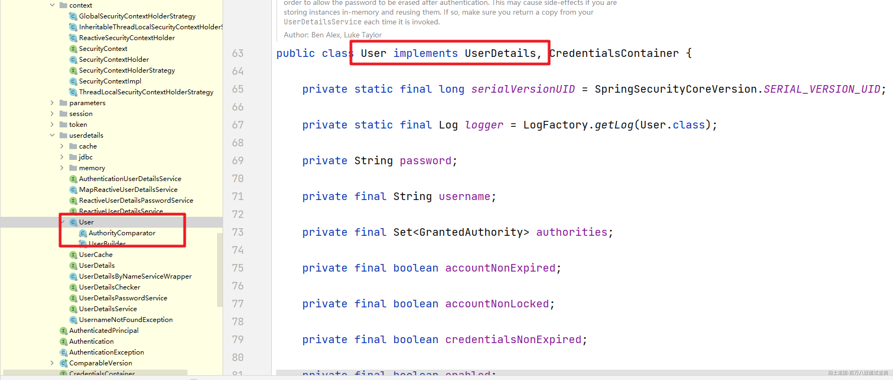

  那么这个UserDetails对象什么时候提供呢？其实在我们前面介绍的数据库认证的Service中我们就用到了，有一个特殊接口 `UserDetailsService`，在这个接口中定义了一个loadUserByUsername的方法，接收一个用户名，来实现根据账号的查询操作，返回的是一个 `UserDetails`对象。

```plain
public interface UserDetailsService {

    UserDetails loadUserByUsername(String username) throws UsernameNotFoundException;

}
```

  UserDetailsService接口的实现有如下：

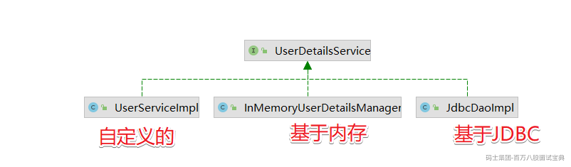

  Spring Security提供了许多 `UserDetailsSerivice`接口的实现，包括使用内存中map的实现（`InMemoryDaoImpl` 低版本 InMemoryUserDetailsManager）和使用JDBC的实现（`JdbcDaoImpl`）。但在实际开发中我们更喜欢自己来编写，比如UserServiceImpl我们的案例

```java
/**
 * 用户的Service
 */
public interface UserService extends UserDetailsService {

}

/**
 * UserService接口的实现类
 */
@Service
public class UserServiceImpl implements UserService {

    @Autowired
    UserMapper userMapper;

    /**
     * 根据账号密码验证的方法
     * @param username
     * @return
     * @throws UsernameNotFoundException
     */
    @Override
    public UserDetails loadUserByUsername(String username) throws UsernameNotFoundException {
        SysUser user = userMapper.queryByUserName(username);
        System.out.println("---------->"+user);
        if(user != null){
            // 账号对应的权限
            List<SimpleGrantedAuthority> authorities = new ArrayList<>();
            authorities.add(new SimpleGrantedAuthority("ROLE_USER"));
            // 说明账号存在 {noop} 非加密的使用
            UserDetails details = new User(user.getUserName()
                    ,user.getPassword()
                    ,true
                    ,true
                    ,true
                    ,true
                    ,authorities);
            return details;
        }
        throw new UsernameNotFoundException("账号不存在...");

    }
}
```

## 4.GrantedAuthority

  我们在Authentication中看到不光关联了Principal还提供了一个getAuthorities()方法来获取对应的GrantedAuthority对象数组。和权限相关，后面在权限模块详细讲解

```java
public interface GrantedAuthority extends Serializable {

    String getAuthority();

}
```

上面介绍到的核心对象小结：

|  |  |
| --- | --- |
| 核心对象 | 作用 |
| SecurityContextHolder | 用于获取SecurityContext |
| SecurityContext | 存放了Authentication和特定于请求的安全信息 |
| Authentication | 特定于Spring Security的principal |
| GrantedAuthority | 对某个principal的应用范围内的授权许可 |
| UserDetail | 提供从应用程序的DAO或其他安全数据源构建Authentication对象所需的信息 |
| UserDetailsService | 接受String类型的用户名，创建并返回UserDetail |

有了这块的基础我们可以来看看认证的实现流程了

# 二、认证流程

  接下来我们直接来看看SpringSecurity中是如何处理认证操作的。

- 1.账号验证

- 2.密码验证

- 3.记住我-->cookie信息

- 4.登录成功-->跳转

## 1.UsernamePasswordAuthenticationFilter

  在SpringSecurity中处理认证逻辑是在UsernamePasswordAuthenticationFilter这个过滤器中实现的。至于这个过滤器是怎么执行的，我们后面会详细的讲解，UsernamePasswordAuthenticationFilter继承于AbstractAuthenticationProcessingFilter这个父类。

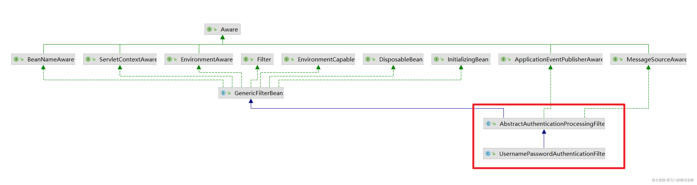

  而在UsernamePasswordAuthenticationFilter没有实现doFilter方法，所以认证的逻辑需要先看AbstractAuthenticationProcessingFilter中的doFilter方法。

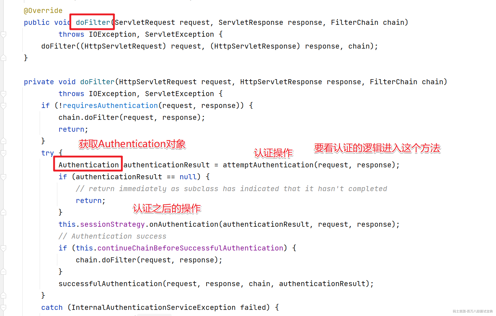

上面的核心代码是

```java
Authentication authenticationResult = attemptAuthentication(request, response);
```

attemptAuthentication方法的作用是获取Authentication对象其实就是对应的认证过程，我们进入到UsernamePasswordAuthenticationFilter中来查看具体的实现。

```java
    @Override
    public Authentication attemptAuthentication(HttpServletRequest request, HttpServletResponse response)
            throws AuthenticationException {
        if (this.postOnly && !request.getMethod().equals("POST")) {
            throw new AuthenticationServiceException("Authentication method not supported: " + request.getMethod());
        }
        String username = obtainUsername(request);
        username = (username != null) ? username : "";
        username = username.trim();
        String password = obtainPassword(request);
        password = (password != null) ? password : "";
        UsernamePasswordAuthenticationToken authRequest = new UsernamePasswordAuthenticationToken(username, password);
        // Allow subclasses to set the "details" property
        setDetails(request, authRequest);
        return this.getAuthenticationManager().authenticate(authRequest);
    }
```

上面代码的含义非常清晰

1. 该方法只支持POST方式提交的请求

2. 获取账号和密码

3. 通过账号密码获取了UsernamePasswordAuthenticationToken对象

4. 设置请求的详细信息

5. 通过AuthenticationManager来完成认证操作

在上面的逻辑中出现了一个对象AuthenticationManager

## 2.AuthenticationManager

  AuthenticationManager接口中就定义了一个方法authenticate方法，处理认证的请求。

```plain
public interface AuthenticationManager {

    Authentication authenticate(Authentication authentication) throws AuthenticationException;

}
```

  在这里AuthenticationManager的默认实现是ProviderManager.而在ProviderManager的authenticate方法中实现的操作是循环遍历成员变量List providers。该providers中如果有一个AuthenticationProvider的supports函数返回true，那么就会调用该AuthenticationProvider的authenticate函数认证，如果认证成功则整个认证过程结束。如果不成功，则继续使用下一个合适的AuthenticationProvider进行认证，只要有一个认证成功则为认证成功。

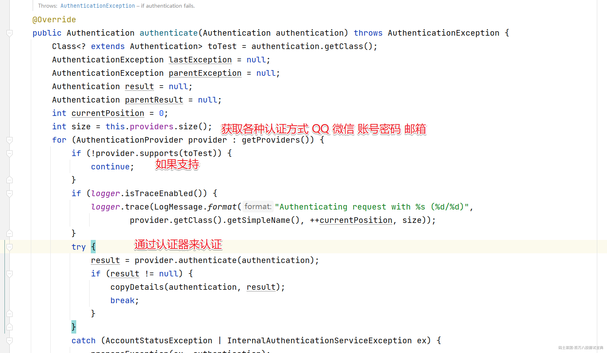

在当前环境下默认的实现提供是

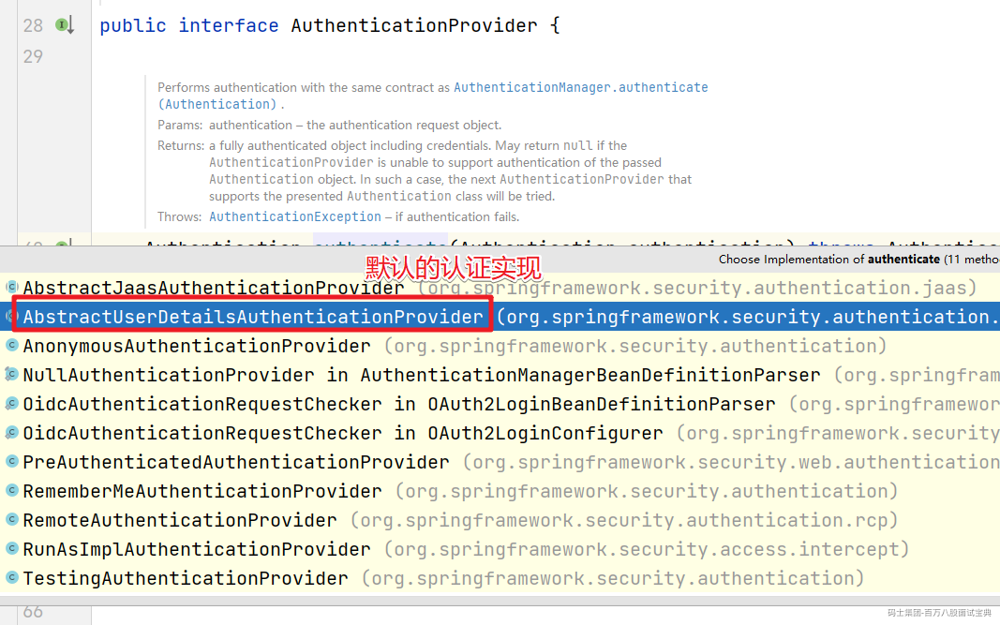

进入到AbstractUserDetailsAuthenticationProvider中的认证方法

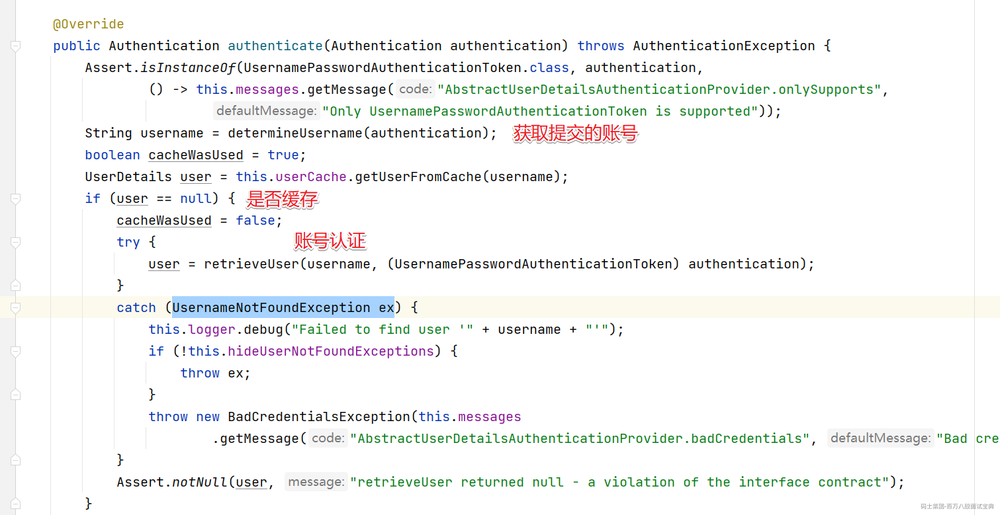

然后进入到retrieveUser方法中，具体的实现是DaoAuthenticationProvider

```java
    @Override
    protected final UserDetails retrieveUser(String username, UsernamePasswordAuthenticationToken authentication)
            throws AuthenticationException {
        prepareTimingAttackProtection();
        try {
            // getUserDetailsService会获取到我们自定义的UserServiceImpl对象，也就是会走我们自定义的认证方法了
            UserDetails loadedUser = this.getUserDetailsService().loadUserByUsername(username);
            if (loadedUser == null) {
                throw new InternalAuthenticationServiceException(
                        "UserDetailsService returned null, which is an interface contract violation");
            }
            return loadedUser;
        }
        catch (UsernameNotFoundException ex) {
            mitigateAgainstTimingAttack(authentication);
            throw ex;
        }
        catch (InternalAuthenticationServiceException ex) {
            throw ex;
        }
        catch (Exception ex) {
            throw new InternalAuthenticationServiceException(ex.getMessage(), ex);
        }
    }
```

  如果账号存在就会开始密码的验证，不过在密码验证前还是会完成一个检查

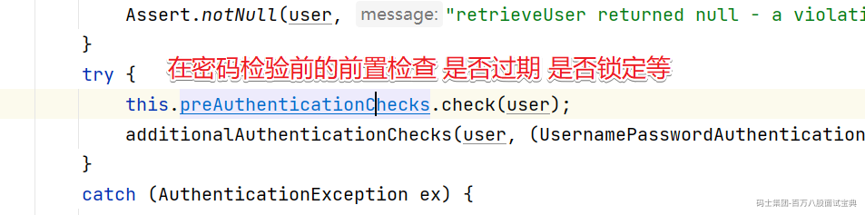

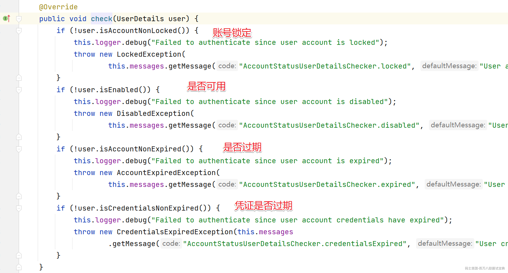

然后就是具体的密码验证

```java
additionalAuthenticationChecks(user, (UsernamePasswordAuthenticationToken) authentication);
```

具体的验证的逻辑

```java
    protected void additionalAuthenticationChecks(UserDetails userDetails,
            UsernamePasswordAuthenticationToken authentication) throws AuthenticationException {
        // 密码为空
        if (authentication.getCredentials() == null) {
            this.logger.debug("Failed to authenticate since no credentials provided");
            throw new BadCredentialsException(this.messages
                    .getMessage("AbstractUserDetailsAuthenticationProvider.badCredentials", "Bad credentials"));
        }
        // 获取表单提交的密码
        String presentedPassword = authentication.getCredentials().toString();
        // 表单提交的密码和数据库查询的密码 比较是否相对
        if (!this.passwordEncoder.matches(presentedPassword, userDetails.getPassword())) {
            this.logger.debug("Failed to authenticate since password does not match stored value");
            throw new BadCredentialsException(this.messages
                    .getMessage("AbstractUserDetailsAuthenticationProvider.badCredentials", "Bad credentials"));
        }
    }
```

上面的逻辑会通过对应的密码编码器来处理，如果是非加密的情况会通过NoOpPasswordEncoder来处理

```java
    public boolean matches(CharSequence rawPassword, String encodedPassword) {
        return rawPassword.toString().equals(encodedPassword);
    }
```

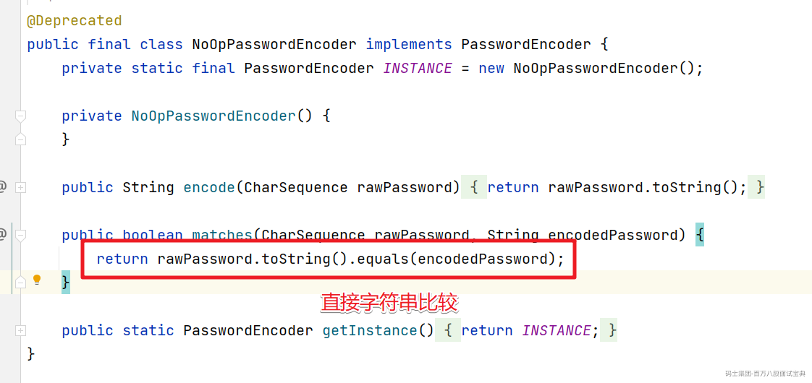

如果有加密处理，就选择对应的加密对象来处理，比如我们上面使用的BCryptPasswordEncoder来处理

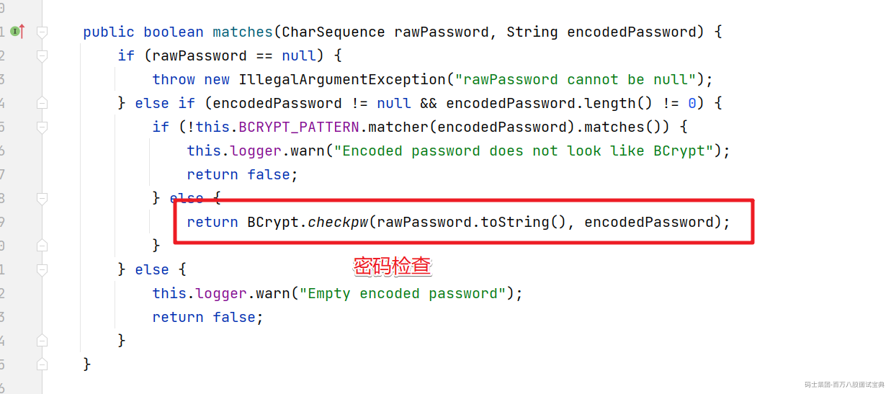
