# SpringSecurity请求流转的本质

## 1. SpringSecurity核心源码分析

*分析SpringSecurity的核心原理，那么我们从哪开始分析？以及我们要分析哪些内容？*

1. **系统启动的时候SpringSecurity做了哪些事情？**

2. **第一次请求执行的流程是什么？**

3. **SpringSecurity中的认证流程是怎么样的？**

### 1.1 系统启动

*当我们的Web服务启动的时候，SpringSecurity做了哪些事情？当系统启动的时候，肯定会加载我们配置的web.xml文件*

```plain
<!DOCTYPE web-app PUBLIC
        "-//Sun Microsystems, Inc.//DTD Web Application 2.3//EN"
        "http://java.sun.com/dtd/web-app_2_3.dtd" >

<web-app version="2.5" id="WebApp_ID" xmlns="http://java.sun.com/xml/ns/javaee"
         xmlns:xsi="http://www.w3.org/2001/XMLSchema-instance"
         xsi:schemaLocation="http://java.sun.com/xml/ns/javaee
 http://java.sun.com/xml/ns/javaee/web-app_2_5.xsd">
  <display-name>Archetype Created Web Application</display-name>

  <!-- 初始化spring容器 -->
  <context-param>
    <param-name>contextConfigLocation</param-name>

    <param-value>classpath:applicationContext.xml</param-value>

  </context-param>

  <listener>
    <listener-class>org.springframework.web.context.ContextLoaderListener</listener-class>

  </listener>

  <!-- post乱码过滤器 -->
  <filter>
    <filter-name>CharacterEncodingFilter</filter-name>

    <filter-class>org.springframework.web.filter.CharacterEncodingFilter</filter-class>

    <init-param>
      <param-name>encoding</param-name>

      <param-value>utf-8</param-value>

    </init-param>

  </filter>

  <filter-mapping>
    <filter-name>CharacterEncodingFilter</filter-name>

    <url-pattern>/*</url-pattern>

  </filter-mapping>

  <!-- 前端控制器 -->
  <servlet>
    <servlet-name>dispatcherServletb</servlet-name>

    <servlet-class>org.springframework.web.servlet.DispatcherServlet</servlet-class>

    <!-- contextConfigLocation不是必须的， 如果不配置contextConfigLocation， springmvc的配置文件默认在：WEB-INF/servlet的name+"-servlet.xml" -->
    <init-param>
      <param-name>contextConfigLocation</param-name>

      <param-value>classpath:spring-mvc.xml</param-value>

    </init-param>

    <load-on-startup>1</load-on-startup>

  </servlet>

  <servlet-mapping>
    <servlet-name>dispatcherServletb</servlet-name>

    <!-- 拦截所有请求jsp除外 -->
    <url-pattern>/</url-pattern>

  </servlet-mapping>

  <!-- 配置过滤器链 springSecurityFilterChain 名称固定 -->
  <filter>
    <filter-name>springSecurityFilterChain</filter-name>

    <filter-class>org.springframework.web.filter.DelegatingFilterProxy</filter-class>

  </filter>

  <filter-mapping>
    <filter-name>springSecurityFilterChain</filter-name>

    <url-pattern>/*</url-pattern>

  </filter-mapping>

</web-app>

```

**web.xml中配置的信息：**

1. **Spring的初始化(会加载解析SpringSecurity的配置文件)**

2. **SpringMVC的前端控制器初始化**

3. **加载DelegatingFilterProxy过滤器**

**Spring的初始化操作和SpringSecurity有关系的操作是，会加载介绍SpringSecurity的配置文件，将相关的数据添加到Spring容器中**

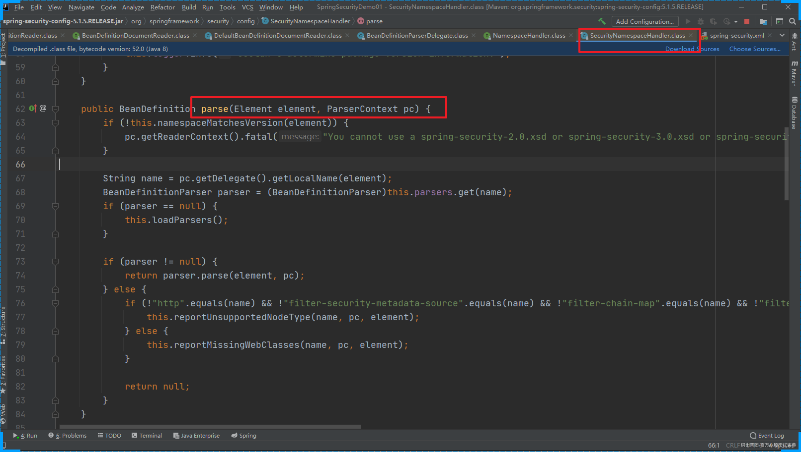

**SpringMVC的初始化和SpringSecurity其实是没有多大关系的**

**DelegatingFilterProxy过滤器：拦截所有的请求。而且这个过滤器本身是和SpringSecurity没有关系的！！！在之前介绍Shiro的时候，和Spring整合的时候我们也是使用的这个过滤器。 其实就是完成从IoC容器中获取DelegatingFilterProxy这个过滤器配置的 FileterName 的对象。**

**系统启动的时候会执行DelegatingFilterProxy的init方法**

```java
protected void initFilterBean() throws ServletException {
    synchronized(this.delegateMonitor) {
        // 如果委托对象为null 进入
        if (this.delegate == null) {
            // 如果targetBeanName==null
            if (this.targetBeanName == null) {
                // targetBeanName = 'springSecurityFilterChain'
                this.targetBeanName = this.getFilterName();
            }
// 获取Spring的容器对象
            WebApplicationContext wac = this.findWebApplicationContext();
            if (wac != null) {
                // 初始化代理对象
                this.delegate = this.initDelegate(wac);
            }
        }

    }
}
```

```java
protected Filter initDelegate(WebApplicationContext wac) throws ServletException {
    // springSecurityFilterChain
    String targetBeanName = this.getTargetBeanName();
    Assert.state(targetBeanName != null, "No target bean name set");
    // 从IoC容器中获取 springSecurityFilterChain的类型为Filter的对象
    Filter delegate = (Filter)wac.getBean(targetBeanName, Filter.class);
    if (this.isTargetFilterLifecycle()) {
        delegate.init(this.getFilterConfig());
    }

    return delegate;
}
```

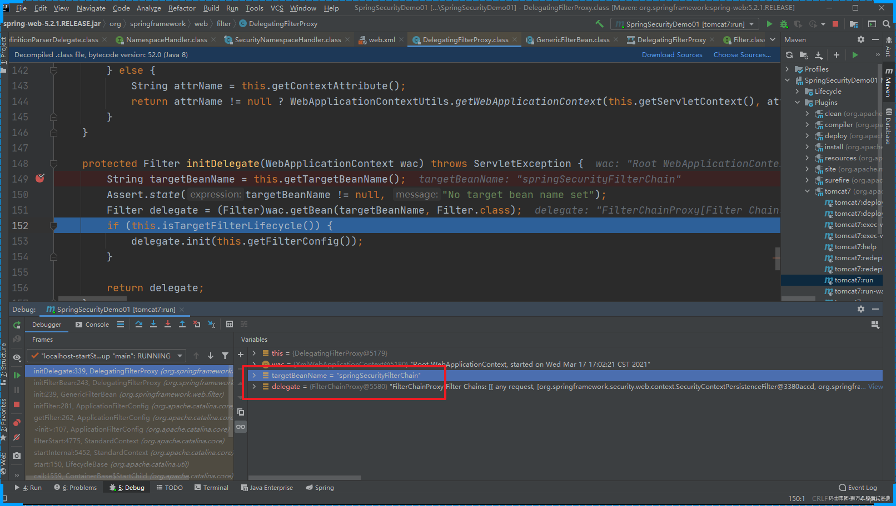

**init方法的作用是：从IoC容器中获取 FilterChainProxy的实例对象，并赋值给 DelegatingFilterProxy的delegate属性**

### 1.2 第一次请求

**客户发送请求会经过很多歌Web Filter拦截。**

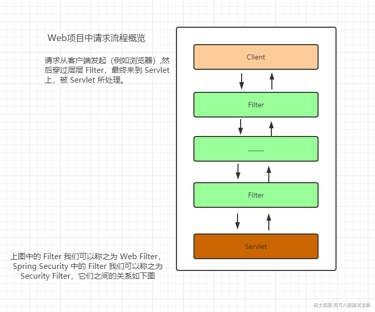

**然后经过系统启动的分析，我们知道有一个我们定义的过滤器会拦截客户端的所有的请求。DelegatingFilterProxy**

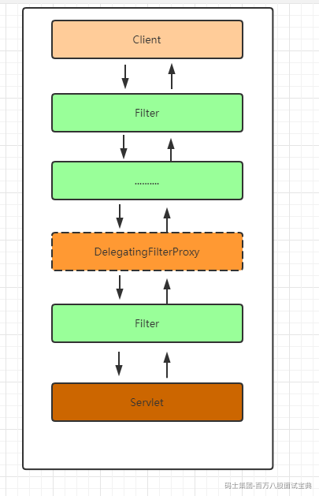

**当用户请求进来的时候会被doFilter方法拦截**

```java
public void doFilter(ServletRequest request, ServletResponse response, FilterChain filterChain) throws ServletException, IOException {
    Filter delegateToUse = this.delegate;
    if (delegateToUse == null) {
        // 如果 delegateToUse 为空 那么完成init中的初始化操作
        synchronized(this.delegateMonitor) {
            delegateToUse = this.delegate;
            if (delegateToUse == null) {
                WebApplicationContext wac = this.findWebApplicationContext();
                if (wac == null) {
                    throw new IllegalStateException("No WebApplicationContext found: no ContextLoaderListener or DispatcherServlet registered?");
                }

                delegateToUse = this.initDelegate(wac);
            }

            this.delegate = delegateToUse;
        }
    }

    this.invokeDelegate(delegateToUse, request, response, filterChain);
}
```

**invokeDelegate**

```java
protected void invokeDelegate(Filter delegate, ServletRequest request, ServletResponse response, FilterChain filterChain) throws ServletException, IOException {
    // delegate.doFilter() FilterChainProxy
    delegate.doFilter(request, response, filterChain);
}
```

**所以在此处我们发现DelegatingFilterProxy最终是调用的委托代理对象的doFilter方法**

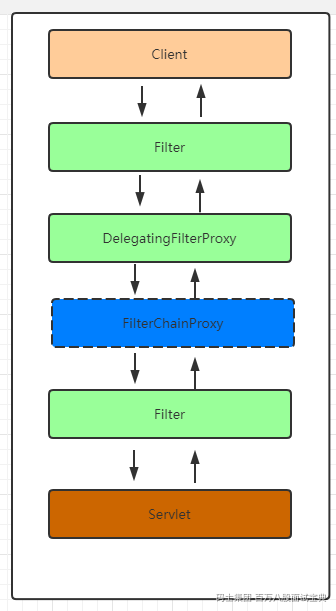

**FilterChainProxy**

*过滤器链的代理对象：增强过滤器链(具体处理请求的过滤器还不是FilterChainProxy ) 根据客户端的请求匹配合适的过滤器链链来处理请求*

```java
public class FilterChainProxy extends GenericFilterBean {
    private static final Log logger = LogFactory.getLog(FilterChainProxy.class);
    private static final String FILTER_APPLIED = FilterChainProxy.class.getName().concat(".APPLIED");
    // 过滤器链的集合  保存的有很多个过滤器链  一个过滤器链中包含的有多个过滤器
    private List<SecurityFilterChain> filterChains;
    private FilterChainProxy.FilterChainValidator filterChainValidator;
    private HttpFirewall firewall;
// .....
}
```

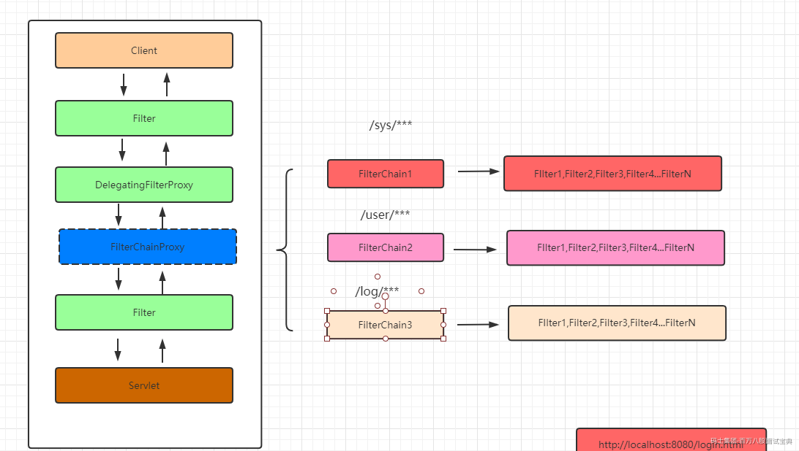

```java
// 处理用户请求
public void doFilter(ServletRequest request, ServletResponse response, FilterChain chain) throws IOException, ServletException {
    boolean clearContext = request.getAttribute(FILTER_APPLIED) == null;
    if (clearContext) {
        try {
            request.setAttribute(FILTER_APPLIED, Boolean.TRUE);
            this.doFilterInternal(request, response, chain);
        } finally {
            SecurityContextHolder.clearContext();
            request.removeAttribute(FILTER_APPLIED);
        }
    } else {
        this.doFilterInternal(request, response, chain);
    }

}
```

**doFilterInternal**

```java
private void doFilterInternal(ServletRequest request, ServletResponse response, FilterChain chain) throws IOException, ServletException {
    FirewalledRequest fwRequest = this.firewall.getFirewalledRequest((HttpServletRequest)request);
    HttpServletResponse fwResponse = this.firewall.getFirewalledResponse((HttpServletResponse)response);
    // 根据当前的请求获取对应的过滤器链
    List<Filter> filters = this.getFilters((HttpServletRequest)fwRequest);
    if (filters != null && filters.size() != 0) {
        FilterChainProxy.VirtualFilterChain vfc = new FilterChainProxy.VirtualFilterChain(fwRequest, chain, filters);
        vfc.doFilter(fwRequest, fwResponse);
    } else {
        if (logger.isDebugEnabled()) {
            logger.debug(UrlUtils.buildRequestUrl(fwRequest) + (filters == null ? " has no matching filters" : " has an empty filter list"));
        }

        fwRequest.reset();
        chain.doFilter(fwRequest, fwResponse);
    }
}
```

**获取到了对应处理请求的过滤器链**

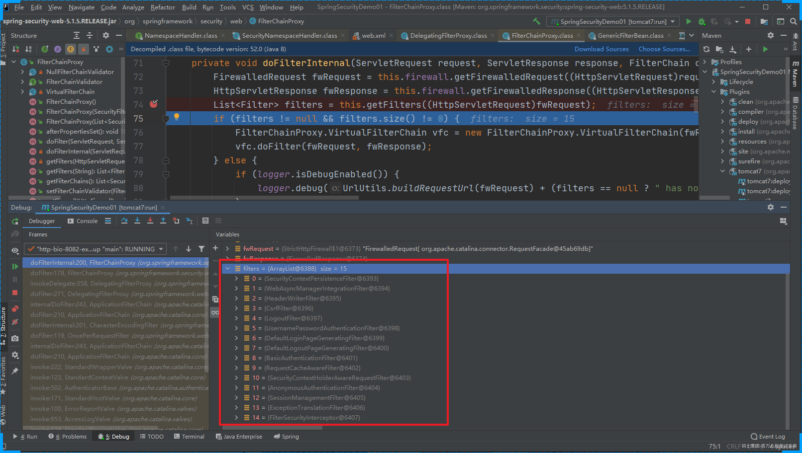

**SpringSecurity中处理请求的过滤器中具体处理请求的方法**

```java
public void doFilter(ServletRequest request, ServletResponse response) throws IOException, ServletException {
    if (this.currentPosition == this.size) {
        if (FilterChainProxy.logger.isDebugEnabled()) {
            FilterChainProxy.logger.debug(UrlUtils.buildRequestUrl(this.firewalledRequest) + " reached end of additional filter chain; proceeding with original chain");
        }

        this.firewalledRequest.reset();
        this.originalChain.doFilter(request, response);
    } else {
        ++this.currentPosition;
        Filter nextFilter = (Filter)this.additionalFilters.get(this.currentPosition - 1);
        if (FilterChainProxy.logger.isDebugEnabled()) {
            FilterChainProxy.logger.debug(UrlUtils.buildRequestUrl(this.firewalledRequest) + " at position " + this.currentPosition + " of " + this.size + " in additional filter chain; firing Filter: '" + nextFilter.getClass().getSimpleName() + "'");
        }

        nextFilter.doFilter(request, response, this);
    }

}
```

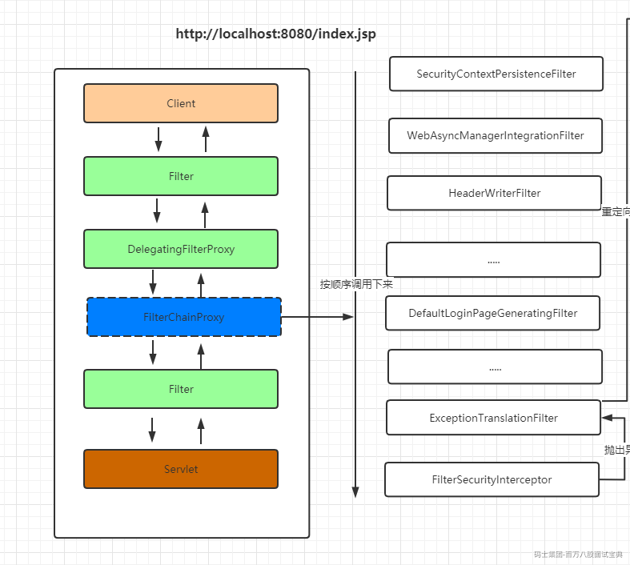

**主要过滤器的介绍**

<https://www.processon.com/view/link/5f7b197ee0b34d0711f3e955>

**ExceptionTranslationFilter**

ExceptionTranslationFilter是我们看的过滤器链中的倒数第二个，作用是捕获倒数第一个过滤器抛出来的异常信息。

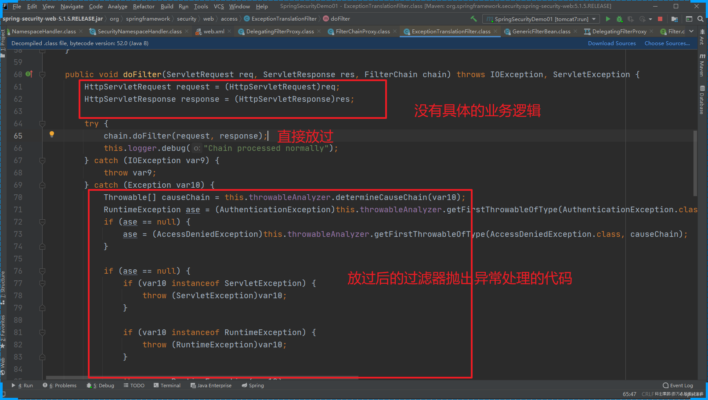

**FilterSecurityInterceptor**

做权限相关的内容

```java
    public void invoke(FilterInvocation fi) throws IOException, ServletException {
        if (fi.getRequest() != null && fi.getRequest().getAttribute("__spring_security_filterSecurityInterceptor_filterApplied") != null && this.observeOncePerRequest) {
            fi.getChain().doFilter(fi.getRequest(), fi.getResponse());
        } else {
            if (fi.getRequest() != null && this.observeOncePerRequest) {
                fi.getRequest().setAttribute("__spring_security_filterSecurityInterceptor_filterApplied", Boolean.TRUE);
            }
// 抛出异常 ExceptionTranslationFilter就会捕获异常
            InterceptorStatusToken token = super.beforeInvocation(fi);

            try {
                fi.getChain().doFilter(fi.getRequest(), fi.getResponse());
            } finally {
                super.finallyInvocation(token);
            }

            super.afterInvocation(token, (Object)null);
        }

    }
```

**ExceptionTranslationFilter 处理异常的代码**

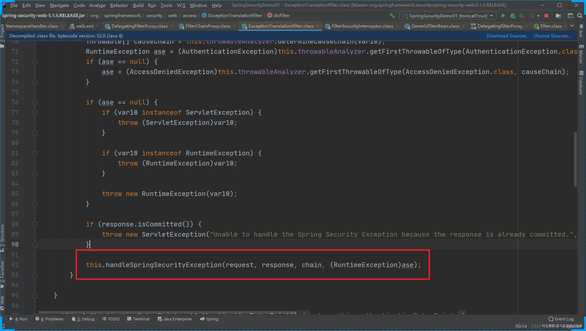

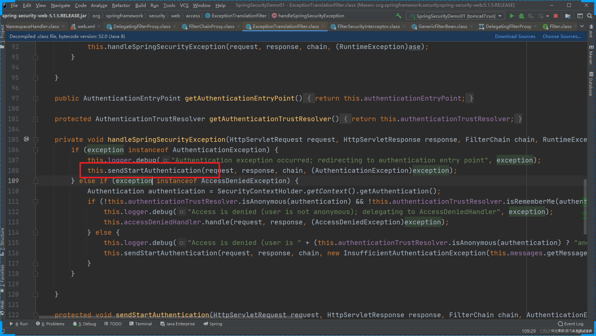

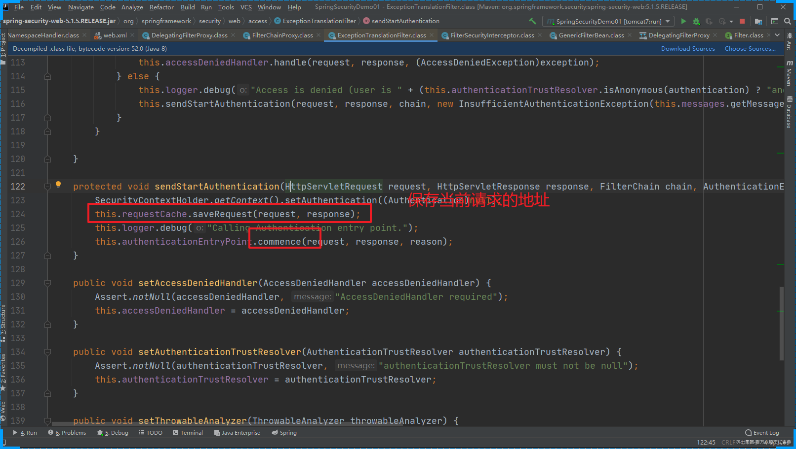

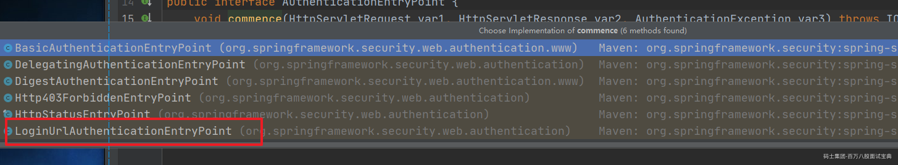

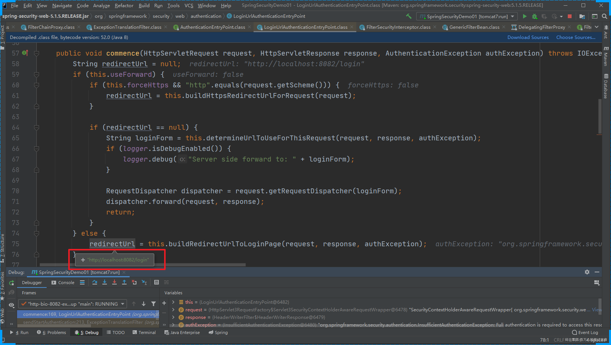

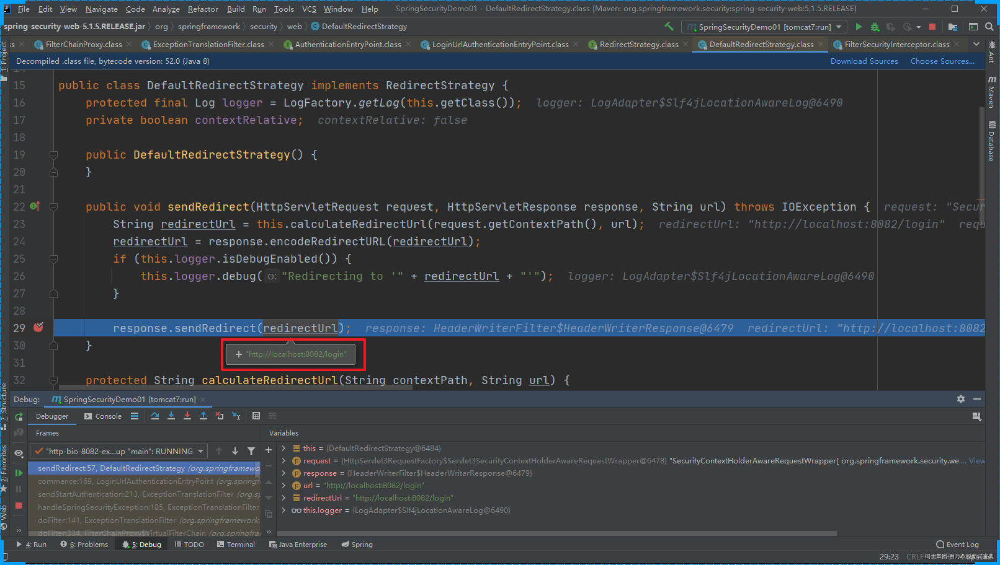

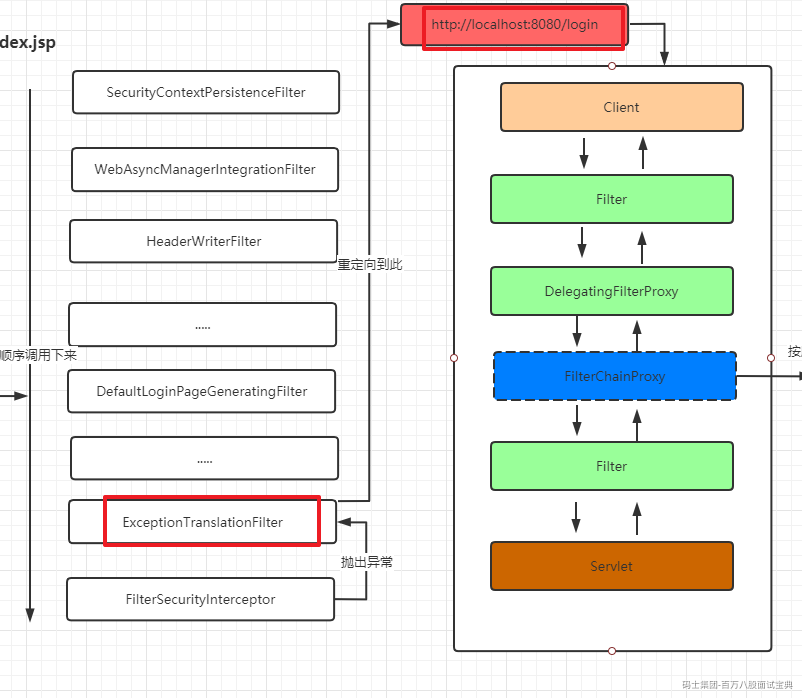

当用第二次提交 <http://localhost:8082/login>时 我们要关注的是 DefaultLoginPageGeneratingFilter 这个过滤器

```java
public void doFilter(ServletRequest req, ServletResponse res, FilterChain chain) throws IOException, ServletException {
    HttpServletRequest request = (HttpServletRequest)req;
    HttpServletResponse response = (HttpServletResponse)res;
    boolean loginError = this.isErrorPage(request);
    boolean logoutSuccess = this.isLogoutSuccess(request);
    if (!this.isLoginUrlRequest(request) && !loginError && !logoutSuccess) {
        // 正常的业务请求就直接放过
        chain.doFilter(request, response);
    } else {
        // 需要跳转到登录页面的请求
        String loginPageHtml = this.generateLoginPageHtml(request, loginError, logoutSuccess);
        // 直接响应登录页面
        response.setContentType("text/html;charset=UTF-8");
        response.setContentLength(loginPageHtml.getBytes(StandardCharsets.UTF_8).length);
        response.getWriter().write(loginPageHtml);
    }
}
```

**generateLoginPageHtml**

```java
private String generateLoginPageHtml(HttpServletRequest request, boolean loginError, boolean logoutSuccess) {
    String errorMsg = "Invalid credentials";
    if (loginError) {
        HttpSession session = request.getSession(false);
        if (session != null) {
            AuthenticationException ex = (AuthenticationException)session.getAttribute("SPRING_SECURITY_LAST_EXCEPTION");
            errorMsg = ex != null ? ex.getMessage() : "Invalid credentials";
        }
    }

    StringBuilder sb = new StringBuilder();
    sb.append("<!DOCTYPE html>\n<html lang=\"en\">\n  <head>\n    <meta charset=\"utf-8\">\n    <meta name=\"viewport\" content=\"width=device-width, initial-scale=1, shrink-to-fit=no\">\n    <meta name=\"description\" content=\"\">\n    <meta name=\"author\" content=\"\">\n    <title>Please sign in</title>\n    <link href=\"https://maxcdn.bootstrapcdn.com/bootstrap/4.0.0-beta/css/bootstrap.min.css\" rel=\"stylesheet\" integrity=\"sha384-/Y6pD6FV/Vv2HJnA6t+vslU6fwYXjCFtcEpHbNJ0lyAFsXTsjBbfaDjzALeQsN6M\" crossorigin=\"anonymous\">\n    <link href=\"https://getbootstrap.com/docs/4.0/examples/signin/signin.css\" rel=\"stylesheet\" crossorigin=\"anonymous\"/>\n  </head>\n  <body>\n     <div class=\"container\">\n");
    String contextPath = request.getContextPath();
    if (this.formLoginEnabled) {
        sb.append("      <form class=\"form-signin\" method=\"post\" action=\"" + contextPath + this.authenticationUrl + "\">\n        <h2 class=\"form-signin-heading\">Please sign in</h2>\n" + createError(loginError, errorMsg) + createLogoutSuccess(logoutSuccess) + "        <p>\n          <label for=\"username\" class=\"sr-only\">Username</label>\n          <input type=\"text\" id=\"username\" name=\"" + this.usernameParameter + "\" class=\"form-control\" placeholder=\"Username\" required autofocus>\n        </p>\n        <p>\n          <label for=\"password\" class=\"sr-only\">Password</label>\n          <input type=\"password\" id=\"password\" name=\"" + this.passwordParameter + "\" class=\"form-control\" placeholder=\"Password\" required>\n        </p>\n" + this.createRememberMe(this.rememberMeParameter) + this.renderHiddenInputs(request) + "        <button class=\"btn btn-lg btn-primary btn-block\" type=\"submit\">Sign in</button>\n      </form>\n");
    }

    if (this.openIdEnabled) {
        sb.append("      <form name=\"oidf\" class=\"form-signin\" method=\"post\" action=\"" + contextPath + this.openIDauthenticationUrl + "\">\n        <h2 class=\"form-signin-heading\">Login with OpenID Identity</h2>\n" + createError(loginError, errorMsg) + createLogoutSuccess(logoutSuccess) + "        <p>\n          <label for=\"username\" class=\"sr-only\">Identity</label>\n          <input type=\"text\" id=\"username\" name=\"" + this.openIDusernameParameter + "\" class=\"form-control\" placeholder=\"Username\" required autofocus>\n        </p>\n" + this.createRememberMe(this.openIDrememberMeParameter) + this.renderHiddenInputs(request) + "        <button class=\"btn btn-lg btn-primary btn-block\" type=\"submit\">Sign in</button>\n      </form>\n");
    }

    if (this.oauth2LoginEnabled) {
        sb.append("<h2 class=\"form-signin-heading\">Login with OAuth 2.0</h2>");
        sb.append(createError(loginError, errorMsg));
        sb.append(createLogoutSuccess(logoutSuccess));
        sb.append("<table class=\"table table-striped\">\n");
        Iterator var7 = this.oauth2AuthenticationUrlToClientName.entrySet().iterator();

        while(var7.hasNext()) {
            Entry<String, String> clientAuthenticationUrlToClientName = (Entry)var7.next();
            sb.append(" <tr><td>");
            String url = (String)clientAuthenticationUrlToClientName.getKey();
            sb.append("<a href=\"").append(contextPath).append(url).append("\">");
            String clientName = HtmlUtils.htmlEscape((String)clientAuthenticationUrlToClientName.getValue());
            sb.append(clientName);
            sb.append("</a>");
            sb.append("</td></tr>\n");
        }

        sb.append("</table>\n");
    }

    sb.append("</div>\n");
    sb.append("</body></html>");
    return sb.toString();
}
```

**第一次请求的完整的流程**

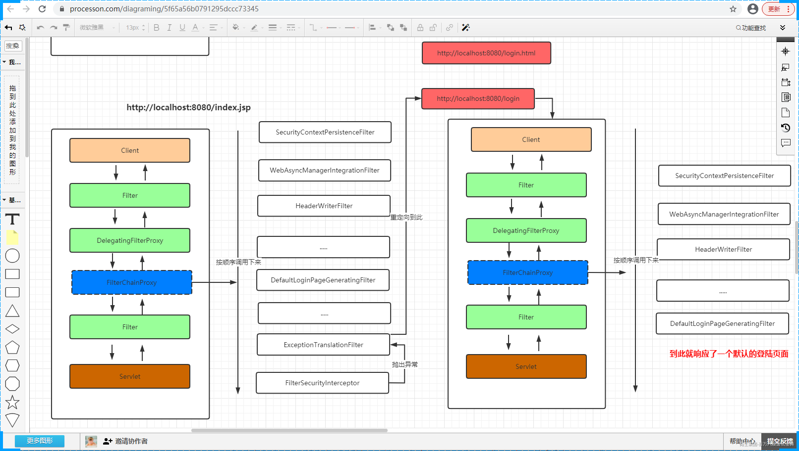

**页面调试也可以验证我的推论**

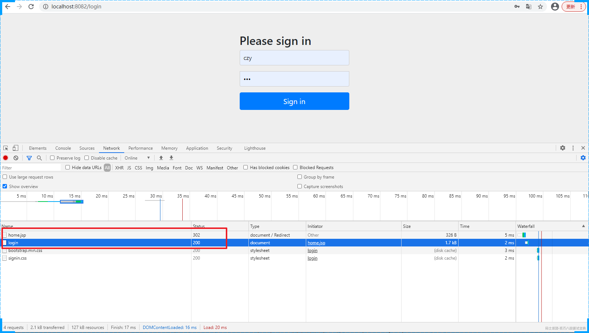
