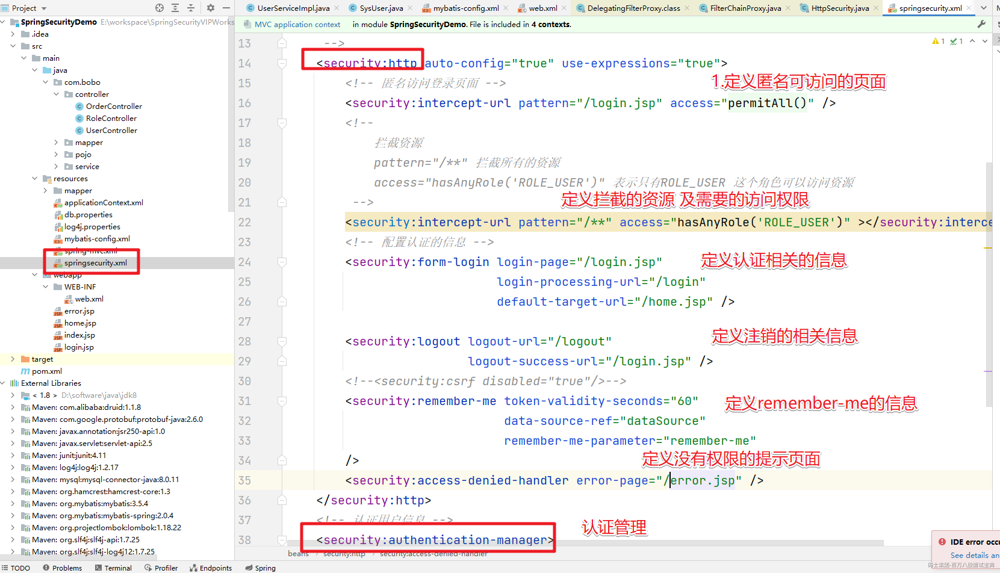
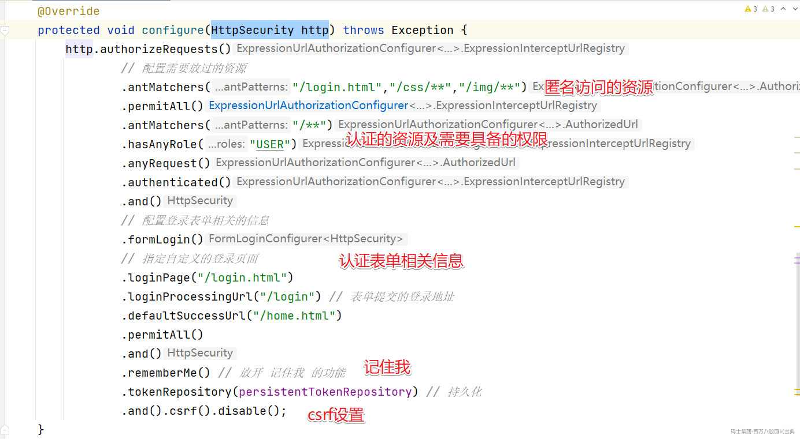
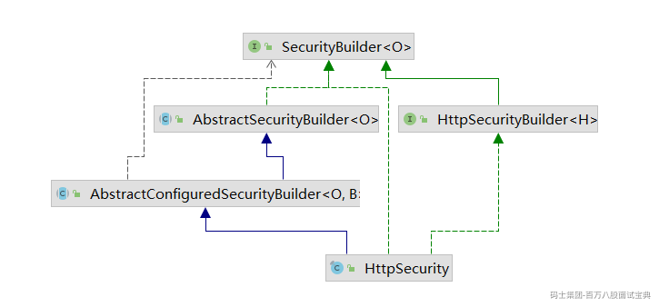
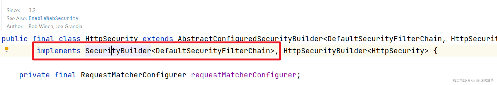
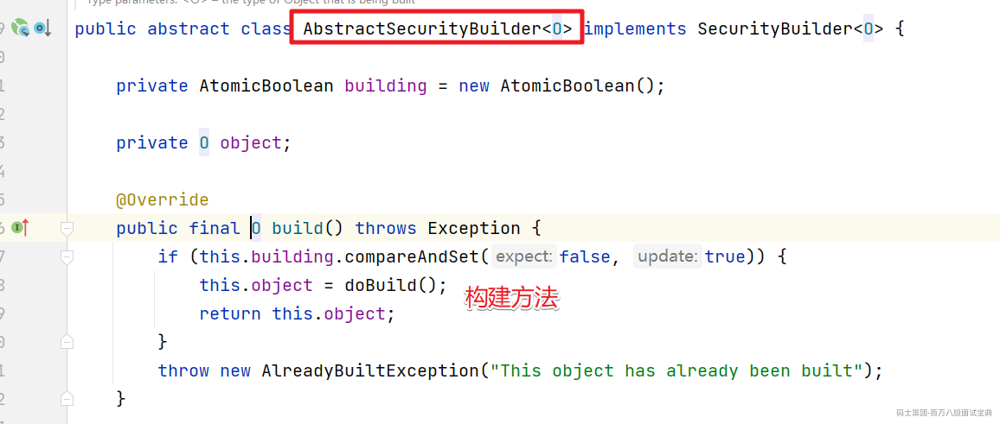
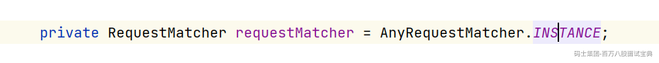
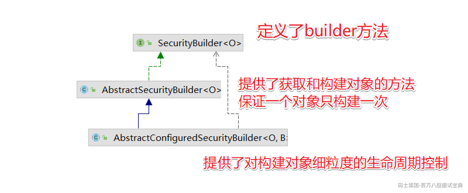
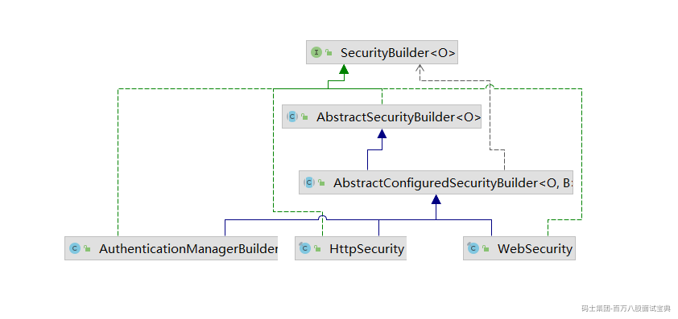
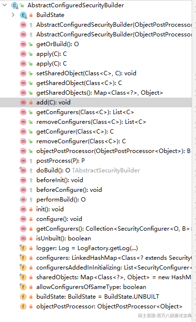
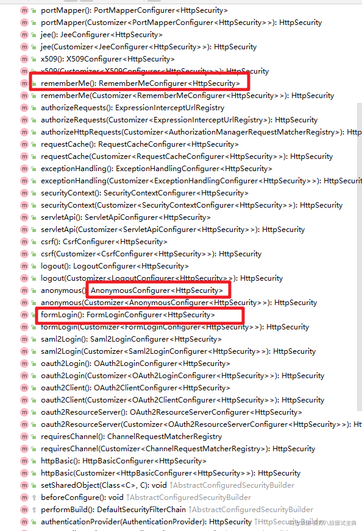

# 深入理解HttpSecurity的设计

# 一、HttpSecurity的应用

  在前章节的介绍中我们讲解了基于配置文件的使用方式，也就是如下的使用。



  也就是在配置文件中通过 security:http 等标签来定义了认证需要的相关信息，但是在SpringBoot项目中，我们慢慢脱离了xml配置文件的方式，在SpringSecurity中提供了HttpSecurity等工具类，这里HttpSecurity就等同于我们在配置文件中定义的http标签。要使用的话方式如下。



  通过代码结果来看和配置文件的效果是一样的。基于配置文件的方式我们之前分析过，是通过标签对应的handler来解析处理的，那么HttpSecurity这块是如何处理的呢？我们来详细分析下。

# 二、HttpSecurity的类图结构



  可以看出HttpSecurity的类图结构相对比较简单，继承了一个父类，实现了两个接口。我们分别来看看他们的作用是什么？

## 1.SecurityBuilder接口

  我们先来看看SecurityBuilder接口，通过字面含义我们就可以发现这是一个帮我们创建对象的工具类。

```java
public interface SecurityBuilder<O> {

    /**
     * Builds the object and returns it or null.
     * @return the Object to be built or null if the implementation allows it.
     * @throws Exception if an error occurred when building the Object
     */
    O build() throws Exception;

}
```

  通过源码我们可以看到在SecurityBuilder中给我们提供了一个build()方法。在接口名称处声明了一个泛型，而build()方法返回的正好是这个泛型的对象，其实就很好理解了，也就是SecurityBuilder会创建指定类型的对象。结合HttpSecurity中实现SecurityBuilder接口时指定的泛型我们可以看出创建的具体对象是什么类型。



  可以看出SecurityBuilder会通过build方法给我们创建一个DefaultSecurityFilterChain对象。也就是拦截请求的那个默认的过滤器链对象。



然后进入到doBuild()方法，会进入到AbstractConfiguredSecurityBuilder中的方法

```java
    @Override
    protected final O doBuild() throws Exception {
        synchronized (this.configurers) {
            this.buildState = BuildState.INITIALIZING;
            beforeInit();
            init();
            this.buildState = BuildState.CONFIGURING;
            beforeConfigure();
            configure();
            this.buildState = BuildState.BUILDING;
     		// 获取构建的对象，上面的方法可以先忽略
            O result = performBuild();
            this.buildState = BuildState.BUILT;
            return result;
        }
    }
```

进入到HttpSecurity中可以查看performBuild()方法的具体实现。

```java
    @Override
    protected DefaultSecurityFilterChain performBuild() {
        // 对所有的过滤器做排序
        this.filters.sort(OrderComparator.INSTANCE);
        List<Filter> sortedFilters = new ArrayList<>(this.filters.size());
        for (Filter filter : this.filters) {
            sortedFilters.add(((OrderedFilter) filter).filter);
        }
        // 然后生成 DefaultSecurityFilterChain
        return new DefaultSecurityFilterChain(this.requestMatcher, sortedFilters);
    }
```

在构造方法中绑定了对应的请求匹配器和过滤器集合。



对应的请求匹配器则是 AnyRequestMatcher 匹配所有的请求。当然我们会比较关心默认的过滤器链中的过滤器是哪来的，这块儿我们继续来分析。

## 2.AbstractConfiguredSecurityBuilder

  然后我们再来看看AbstractConfiguredSecurityBuilder这个抽象类，他其实是SecurityBuilder的实现，在这儿需要搞清楚他们的关系。



|  |  |
| --- | --- |
| 类型 | 作用 |
| SecurityBuilder | 声明了build方法 |
| AbstractSecurityBuilder | 提供了获取对象的方法以及控制一个对象只能build一次 |
| AbstractConfiguredSecurityBuilder | 除了提供对对象细粒度的控制外还扩展了对configurer的操作 |

然后对应的三个实现类。



首先 AbstractConfiguredSecurityBuilder 中定义了一个枚举类，将整个构建过程分为 5 种状态，也可  
以理解为构建过程生命周期的五个阶段，如下：

```java
private enum BuildState {

        /**
         * 还没开始构建
         */
        UNBUILT(0),

        /**
         * 构建中
         */
        INITIALIZING(1),

        /**
         * 配置中
         */
        CONFIGURING(2),

        /**
         * 构建中
         */
        BUILDING(3),

        /**
         * 构建完成
         */
        BUILT(4);

        private final int order;

        BuildState(int order) {
            this.order = order;
        }

        public boolean isInitializing() {
            return INITIALIZING.order == this.order;
        }

        /**
         * Determines if the state is CONFIGURING or later
         * @return
         */
        public boolean isConfigured() {
            return this.order >= CONFIGURING.order;
        }

    }
```

通过这些状态来管理需要构建的对象的不同阶段。

### 2.1 add方法

  AbstractConfiguredSecurityBuilder中方法概览



  我们先来看看add方法。

```java
private <C extends SecurityConfigurer<O, B>> void add(C configurer) {
        Assert.notNull(configurer, "configurer cannot be null");
        Class<? extends SecurityConfigurer<O, B>> clazz = (Class<? extends SecurityConfigurer<O, B>>) configurer
                .getClass();
        synchronized (this.configurers) {
            if (this.buildState.isConfigured()) {
                throw new IllegalStateException("Cannot apply " + configurer + " to already built object");
            }
            List<SecurityConfigurer<O, B>> configs = null;
            if (this.allowConfigurersOfSameType) {
                configs = this.configurers.get(clazz);
            }
            configs = (configs != null) ? configs : new ArrayList<>(1);
            configs.add(configurer);
            this.configurers.put(clazz, configs);
            if (this.buildState.isInitializing()) {
                this.configurersAddedInInitializing.add(configurer);
            }
        }
    }

    /**
     * Gets all the {@link SecurityConfigurer} instances by its class name or an empty
     * List if not found. Note that object hierarchies are not considered.
     * @param clazz the {@link SecurityConfigurer} class to look for
     * @return a list of {@link SecurityConfigurer}s for further customization
     */
    @SuppressWarnings("unchecked")
    public <C extends SecurityConfigurer<O, B>> List<C> getConfigurers(Class<C> clazz) {
        List<C> configs = (List<C>) this.configurers.get(clazz);
        if (configs == null) {
            return new ArrayList<>();
        }
        return new ArrayList<>(configs);
    }
```

  add 方法，这相当于是在收集所有的配置类。将所有的 xxxConfigure 收集起来存储到 configurers  
中，将来再统一初始化并配置，configurers 本身是一个 LinkedHashMap ，key 是配置类的 class，  
value 是一个集合，集合里边放着 xxxConfigure 配置类。当需要对这些配置类进行集中配置的时候，  
会通过 getConfigurers 方法获取配置类，这个获取过程就是把 LinkedHashMap 中的 value 拿出来，  
放到一个集合中返回。

### 2.2 doBuild方法

  然后来看看doBuild方法中的代码

```java
     @Override
    protected final O doBuild() throws Exception {
        synchronized (this.configurers) {
            this.buildState = BuildState.INITIALIZING;
            beforeInit(); //是一个预留方法，没有任何实现
            init(); // 就是找到所有的 xxxConfigure，挨个调用其 init 方法进行初始化
            this.buildState = BuildState.CONFIGURING;
            beforeConfigure(); // 是一个预留方法，没有任何实现
            configure(); // 就是找到所有的 xxxConfigure，挨个调用其 configure 方法进行配置。
            this.buildState = BuildState.BUILDING;
            O result = performBuild();
// 是真正的过滤器链构建方法，但是在 AbstractConfiguredSecurityBuilder中 performBuild 方法只是一个抽象方法，具体的实现在 HttpSecurity 中
            this.buildState = BuildState.BUILT;
            return result;
        }
    }
```

init方法:完成所有相关过滤器的初始化

```plain
    private void init() throws Exception {
        Collection<SecurityConfigurer<O, B>> configurers = getConfigurers();
        for (SecurityConfigurer<O, B> configurer : configurers) {
            configurer.init((B) this); // 初始化对应的过滤器
        }
        for (SecurityConfigurer<O, B> configurer : this.configurersAddedInInitializing) {
            configurer.init((B) this);
        }
    }
```

configure方法：完成HttpSecurity和对应的过滤器的绑定。

```java
    private void configure() throws Exception {
        Collection<SecurityConfigurer<O, B>> configurers = getConfigurers();
        for (SecurityConfigurer<O, B> configurer : configurers) {
            configurer.configure((B) this);
        }
    }
```

## 3.HttpSecurity

  HttpSecurity 做的事情，就是进行各种各样的 xxxConfigurer 配置



HttpSecurity 中有大量类似的方法，过滤器链中的过滤器就是这样一个一个配置的。我们就不一一介绍  
了。每个配置方法的结尾都会来一句 getOrApply，这个是干嘛的？我们来看下

```java
    private <C extends SecurityConfigurerAdapter<DefaultSecurityFilterChain, HttpSecurity>> C getOrApply(C configurer)
            throws Exception {
        C existingConfig = (C) getConfigurer(configurer.getClass());
        if (existingConfig != null) {
            return existingConfig;
        }
        return apply(configurer);
    }
```

  getConfigurer 方法是在它的父类 AbstractConfiguredSecurityBuilder 中定义的，目的就是去查看当前  
这个 xxxConfigurer 是否已经配置过了。  
  如果当前 xxxConfigurer 已经配置过了，则直接返回，否则调用 apply 方法，这个 apply 方法最终会调  
用到 AbstractConfiguredSecurityBuilder#add 方法，将当前配置 configurer 收集起来  
HttpSecurity 中还有一个 addFilter 方法.

```java
    @Override
    public HttpSecurity addFilter(Filter filter) {
        Integer order = this.filterOrders.getOrder(filter.getClass());
        if (order == null) {
            throw new IllegalArgumentException("The Filter class " + filter.getClass().getName()
                    + " does not have a registered order and cannot be added without a specified order. Consider using addFilterBefore or addFilterAfter instead.");
        }
        this.filters.add(new OrderedFilter(filter, order));
        return this;
    }
```

  这个 addFilter 方法的作用，主要是在各个 xxxConfigurer 进行配置的时候，会调用到这个方法，  
（xxxConfigurer 就是用来配置过滤器的），把 Filter 都添加到 fitlers 变量中。

小结：这就是 HttpSecurity 的一个大致工作流程。把握住了这个工作流程，剩下的就只是一些简单的重
