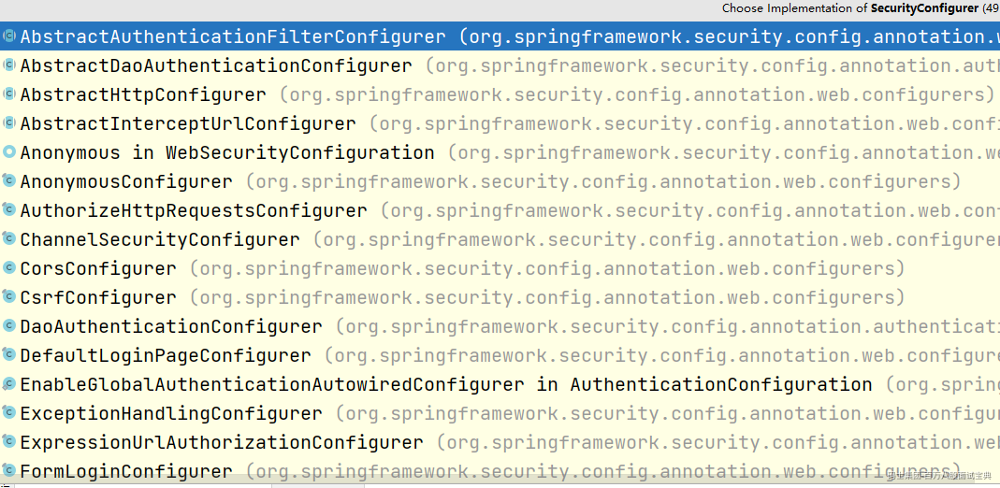
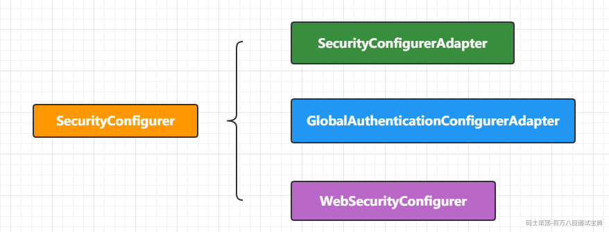
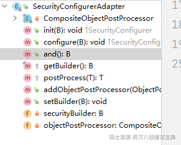
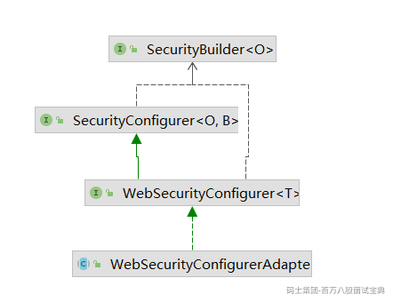
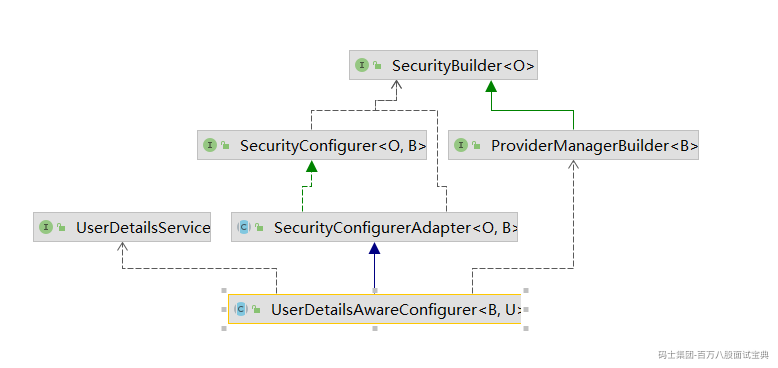
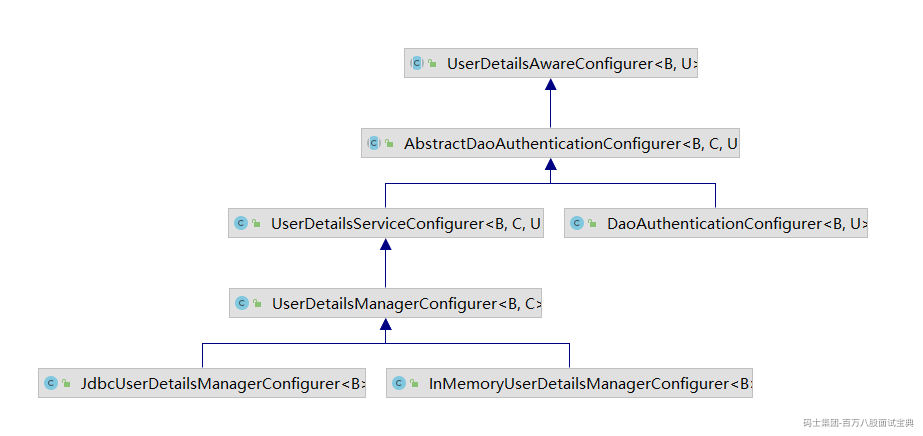

# 深入理解SecurityConfigurer

# 一、SecurityConfigurer

  SecurityConfigurer 在 Spring Security 中是一个非常重要的角色。在前面的内容中曾经多次提到过，  
Spring Security 过滤器链中的每一个过滤器，都是通过 xxxConfigurer 来进行配置的，而这些  
xxxConfigurer 实际上都是 SecurityConfigurer 的实现。所以我们也需要对 SecurityConfigurer 理解清楚.

```java
//  O（DefaultSecurityFilterChain）  B（HttpSecurity）
public interface SecurityConfigurer<O, B extends SecurityBuilder<O>> {

    /**
     * Initialize the {@link SecurityBuilder}. Here only shared state should be created
     * and modified, but not properties on the {@link SecurityBuilder} used for building
     * the object. This ensures that the {@link #configure(SecurityBuilder)} method uses
     * the correct shared objects when building. Configurers should be applied here.
     * @param builder
     * @throws Exception
     */
    void init(B builder) throws Exception;

    /**
     * Configure the {@link SecurityBuilder} by setting the necessary properties on the
     * {@link SecurityBuilder}.
     * @param builder
     * @throws Exception
     */
    void configure(B builder) throws Exception;

}
```

在init方法和configure方法中的形参都是SecurityBuilder类型，而SecurityBuilder是用来构建过滤器链  
的【DefaultSecurityFilterChainProxy】  
SecurityConfigurer的实现当然很多。

具体的Configurer实现我们可以先不关注，我需要了解的SecurityConfigurer的核心实现有三个



# 二、SecurityConfigurerAdapter

  SecurityConfigurerAdapter 实现了 SecurityConfigurer 接口，我们所使用的大部分的xxxConfigurer 也都是 SecurityConfigurerAdapter 的子类。  
  SecurityConfigurerAdapter 在 SecurityConfigurer 的基础上，还扩展出来了几个非常好用的方法



1. CompositeObjectPostProcessor ()  
   首先一开始声明了一个 CompositeObjectPostProcessor 实例，CompositeObjectPostProcessor  
   是 ObjectPostProcessor 的一个实现，ObjectPostProcessor 本身是一个后置处理器，该后置处  
   理器默认有两个实现，AutowireBeanFactoryObjectPostProcessor 和  
   CompositeObjectPostProcessor。其中 AutowireBeanFactoryObjectPostProcessor 主要是利用  
   了 AutowireCapableBeanFactory 对 Bean 进行手动注册，因为在 Spring Security 中，很多对象  
   都是手动 new 出来的，这些 new 出来的对象和容器没有任何关系，利用AutowireCapableBeanFactory 可以将这些手动 new 出来的对象注入到容器中，而AutowireBeanFactoryObjectPostProcessor 的主要作用就是完成这件事；CompositeObjectPostProcessor 则是一个复合的对象处理器，里边维护了一个 List 集合，这个List 集合中，大部分情况下只存储一条数据，那就是AutowireBeanFactoryObjectPostProcessor ，用来完成对象注入到容器的操作，如果用户自己手动调用了 addObjectPostProcessor 方法，那么 CompositeObjectPostProcessor 集合中维护的数据就会多出来一条，CompositeObjectPostProcessor #postProcess 方法中，会遍历集合中的所有 ObjectPostProcessor，挨个调用其 postProcess 方法对对象进行后置处理。

2. and ()，  
   该方法返回值是一个 securityBuilder，securityBuilder 实际上就是 HttpSecurity，我们在HttpSecurity 中去配置不同的过滤器时，可以使用 and 方法进行链式配置，就是因为这里定义了  
   and 方法并返回了 securityBuilder 实例

这便是 SecurityConfigurerAdapter 的主要功能，后面大部分的 xxxConfigurer 都是基于此类来实  
现的

# 三、GlobalAuthenticationConfigurerAdapter

  GlobalAuthenticationConfigurerAdapter 看名字就知道是一个跟全局配置有关的东西，它本身实  
现了 SecurityConfigurerAdapter 接口，但是并未对方法做具体的实现，只是将泛型具体化了

```java
@Order(100)
public abstract class GlobalAuthenticationConfigurerAdapter
        implements SecurityConfigurer<AuthenticationManager, AuthenticationManagerBuilder> {

    @Override
    public void init(AuthenticationManagerBuilder auth) throws Exception {
    }

    @Override
    public void configure(AuthenticationManagerBuilder auth) throws Exception {
    }

}
```

  可以看到，SecurityConfigurer 中的泛型，现在明确成了 AuthenticationManager 和  
AuthenticationManagerBuilder。所以 GlobalAuthenticationConfigurerAdapter 的实现类将来主要  
是和配置 AuthenticationManager 有关。当然也包括默认的用户名密码也是由它的实现类来进行配置  
的。  
  我们在 Spring Security 中使用的 AuthenticationManager 其实可以分为两种，一种是局部的，另一种  
是全局的，这里主要是全局的配置

# 四、WebSecurityConfigurer

  还有一个实现类就是 WebSecurityConfigurer，这个可能有的小伙伴比较陌生，其实他就是我们天  
天用的 WebSecurityConfigurerAdapter 的父接口。  
  所以 WebSecurityConfigurer 的作用就很明确了，用户扩展用户自定义的配置



# 五、SecurityConfigurerAdapter

SecurityConfigurerAdapter 的实现主要也是三大类：

- UserDetailsAwareConfigurer

- AbstractHttpConfigurer

- LdapAuthenticationProviderConfigurer

考虑到 LDAP 现在使用很少，所以这里我来和大家重点介绍下前两个。

## 1.UserDetailsAwareConfigurer

  这个配置类看名字大概就知道这是用来配置用户类的。



对应的实现类的结构图



UserDetailsAwareConfigurer接口

```java
public abstract class UserDetailsAwareConfigurer<B extends ProviderManagerBuilder<B>, U extends UserDetailsService>
        extends SecurityConfigurerAdapter<AuthenticationManager, B> {

    /**
     * 返回的是UserDetailsService 接口的实现
     * Gets the {@link UserDetailsService} or null if it is not available
     * @return the {@link UserDetailsService} or null if it is not available
     */
    public abstract U getUserDetailsService();

}
```

  通过定义我们可以看到泛型U必须是UserDetailsService接口的实现，也就是  
getUserDetailsService()方法返回的肯定是UserDetailsService接口的实现，还有通过泛型B及继承  
SecurityConfigurerAdapter来看会构建一个AuthenticationManager对象

AbstractDaoAuthenticationConfigurer

接下来我们再看下UserDetailsAwareConfigurer下的一个抽象类  
AbstractDaoAuthenticationConfigurer  
在类的头部声明了一堆的泛型，继承自UserDetailsAwareConfigurer

```java
public abstract class AbstractDaoAuthenticationConfigurer<B extends ProviderManagerBuilder<B>, C extends AbstractDaoAuthenticationConfigurer<B, C, U>, U extends UserDetailsService>
        extends UserDetailsAwareConfigurer<B, U> {
// 声明了一个 provider
    private DaoAuthenticationProvider provider = new DaoAuthenticationProvider();
// 声明了一个 userDetailsService 的泛型属性

    private final U userDetailsService;

    /**
     * Creates a new instance
构造器 传递的对象可以是UserDetailsService或者UserDetailsPasswordService
     * @param userDetailsService
     */
    AbstractDaoAuthenticationConfigurer(U userDetailsService) {
        this.userDetailsService = userDetailsService;
        this.provider.setUserDetailsService(userDetailsService);
        if (userDetailsService instanceof UserDetailsPasswordService) {
            this.provider.setUserDetailsPasswordService((UserDetailsPasswordService) userDetailsService);
        }
    }

    /**
     * Adds an {@link ObjectPostProcessor} for this class.
添加了一个ObjectPostProcessor 后置处理器
     * @param objectPostProcessor
     * @return the {@link AbstractDaoAuthenticationConfigurer} for further customizations
     */
    @SuppressWarnings("unchecked")
    public C withObjectPostProcessor(ObjectPostProcessor<?> objectPostProcessor) {
        addObjectPostProcessor(objectPostProcessor);
        return (C) this;
    }

    /**
添加密码编码器 加密
     * Allows specifying the {@link PasswordEncoder} to use with the
     * {@link DaoAuthenticationProvider}. The default is to use plain text.
     * @param passwordEncoder The {@link PasswordEncoder} to use.
     * @return the {@link AbstractDaoAuthenticationConfigurer} for further customizations
     */
    @SuppressWarnings("unchecked")
    public C passwordEncoder(PasswordEncoder passwordEncoder) {
        this.provider.setPasswordEncoder(passwordEncoder);
        return (C) this;
    }

    public C userDetailsPasswordManager(UserDetailsPasswordService passwordManager) {
        this.provider.setUserDetailsPasswordService(passwordManager);
        return (C) this;
    }

    @Override
    public void configure(B builder) throws Exception {
// 调用后置处理器 将provider添加到SpringIoC容器中
        this.provider = postProcess(this.provider);
// 将provider添加到builder对象中
        builder.authenticationProvider(this.provider);
    }

    /**
     * Gets the {@link UserDetailsService} that is used with the
     * {@link DaoAuthenticationProvider}  重写父类的方法
     * @return the {@link UserDetailsService} that is used with the
     * {@link DaoAuthenticationProvider}
     */
    @Override
    public U getUserDetailsService() {
        return this.userDetailsService;
    }

}
```

UserDetailsServiceConfigurer

  这个类就比较简单，扩展了AbstractDaoAuthenticationConfigurer中的configure方法，在  
configure 方法执行之前加入了 initUserDetailsService 方法，以方便开发展按照自己的方式去初始化  
UserDetailsService。不过这里的 initUserDetailsService 方法是空方法

```java
public class UserDetailsServiceConfigurer<B extends ProviderManagerBuilder<B>, C extends UserDetailsServiceConfigurer<B, C, U>, U extends UserDetailsService>
        extends AbstractDaoAuthenticationConfigurer<B, C, U> {

    /**
     * Creates a new instance
     * @param userDetailsService the {@link UserDetailsService} that should be used
     */
    public UserDetailsServiceConfigurer(U userDetailsService) {
        super(userDetailsService);
    }

    @Override
    public void configure(B builder) throws Exception {
        initUserDetailsService();
        super.configure(builder);
    }

    /**
     * Allows subclasses to initialize the {@link UserDetailsService}. For example, it
     * might add users, initialize schema, etc.
     */
    protected void initUserDetailsService() throws Exception {
    }

}
```

**UserDetailsManagerConfigurer**

  UserDetailsManagerConfigurer 中实现了 UserDetailsServiceConfigurer 中定义的  
initUserDetailsService 方法，具体的实现逻辑就是将 UserDetailsBuilder 所构建出来的 UserDetails  
以及提前准备好的 UserDetails 中的用户存储到 UserDetailsService 中。  
  该类同时添加了 withUser 方法用来添加用户，同时还增加了一个 UserDetailsBuilder 用来构建用  
户，这些逻辑都比较简单，小伙伴们可以自行查看。

**JdbcUserDetailsManagerConfigurer**

  JdbcUserDetailsManagerConfigurer 在父类的基础上补充了 DataSource 对象，同时还提供了相应  
的数据库查询方法

**InMemoryUserDetailsManagerConfigurer**

InMemoryUserDetailsManagerConfigurer 在父类的基础上重写了构造方法，将父类中的  
UserDetailsService 实例定义为 InMemoryUserDetailsManager

```java
public class InMemoryUserDetailsManagerConfigurer<B extends ProviderManagerBuilder<B>>
        extends UserDetailsManagerConfigurer<B, InMemoryUserDetailsManagerConfigurer<B>> {

    /**
     * Creates a new instance
     */
    public InMemoryUserDetailsManagerConfigurer() {
        super(new InMemoryUserDetailsManager(new ArrayList<>()));
    }

}
```
