# SpringSecurity中的权限管理

  SpringSecurity是一个权限管理框架，核心是认证和授权，前面已经系统的给大家介绍过了认证的实现和源码分析，本文重点来介绍下权限管理这块的原理。

# 一、权限管理的实现

  服务端的各种资源要被SpringSecurity的权限管理控制我们可以通过注解和标签两种方式来处理。

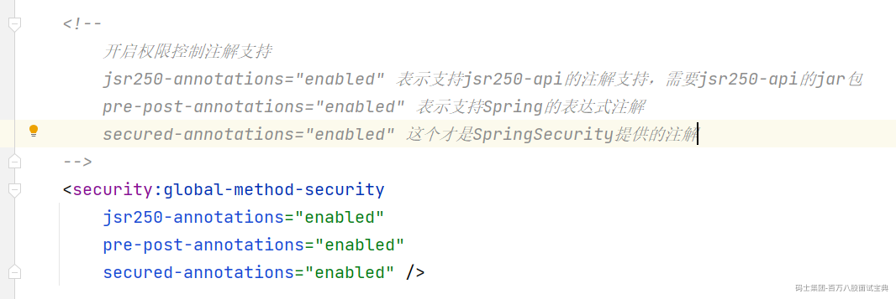

放开了相关的注解后我们在Controller中就可以使用相关的注解来控制了

```java
/**
 * JSR250
 */
@Controller
@RequestMapping("/user")
public class UserController {

    @RolesAllowed(value = {"ROLE_ADMIN"})
    @RequestMapping("/query")
    public String query(){
        System.out.println("用户查询....");
        return "/home.jsp";
    }
    @RolesAllowed(value = {"ROLE_USER"})
    @RequestMapping("/save")
    public String save(){
        System.out.println("用户添加....");
        return "/home.jsp";
    }

    @RequestMapping("/update")
    public String update(){
        System.out.println("用户更新....");
        return "/home.jsp";
    }
}
```

```java
/**
 * Spring表达式
 */
@Controller
@RequestMapping("/order")
public class OrderController {

    @PreAuthorize(value = "hasAnyRole('ROLE_USER')")
    @RequestMapping("/query")
    public String query(){
        System.out.println("用户查询....");
        return "/home.jsp";
    }
    @PreAuthorize(value = "hasAnyRole('ROLE_ADMIN')")
    @RequestMapping("/save")
    public String save(){
        System.out.println("用户添加....");
        return "/home.jsp";
    }

    @RequestMapping("/update")
    public String update(){
        System.out.println("用户更新....");
        return "/home.jsp";
    }
}
```

```java
@Controller
@RequestMapping("/role")
public class RoleController {

    @Secured(value = "ROLE_USER")
    @RequestMapping("/query")
    public String query(){
        System.out.println("用户查询....");
        return "/home.jsp";
    }

    @Secured("ROLE_ADMIN")
    @RequestMapping("/save")
    public String save(){
        System.out.println("用户添加....");
        return "/home.jsp";
    }

    @RequestMapping("/update")
    public String update(){
        System.out.println("用户更新....");
        return "/home.jsp";
    }
}
```

然后在页面模板文件中我们可以通过taglib来实现权限更细粒度的控制

```html
<%@ page contentType="text/html;charset=UTF-8" language="java" %>
<%@ taglib prefix="security" uri="http://www.springframework.org/security/tags" %>
<html>
<head>
    <title>Title</title>

</head>

<body>
    <h1>HOME页面</h1>

<security:authentication property="principal.username" />
<security:authorize access="hasAnyRole('ROLE_USER')" >
    <a href="#">用户查询</a><br>
</security:authorize>

    <security:authorize access="hasAnyRole('ROLE_ADMIN')" >
        <a href="#">用户添加</a><br>
    </security:authorize>

</body>

</html>

```

然后我们在做用户认证的时候会绑定当前用户的角色和权限数据

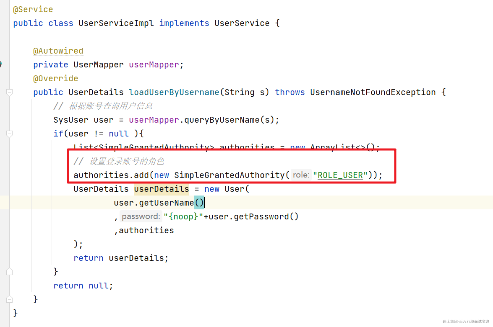

# 二、权限校验的原理

  接下来我们看看在用户提交请求后SpringSecurity是如何对用户的请求资源做出权限校验的。首先我们要回顾下SpringSecurity处理请求的过滤器链。如下：

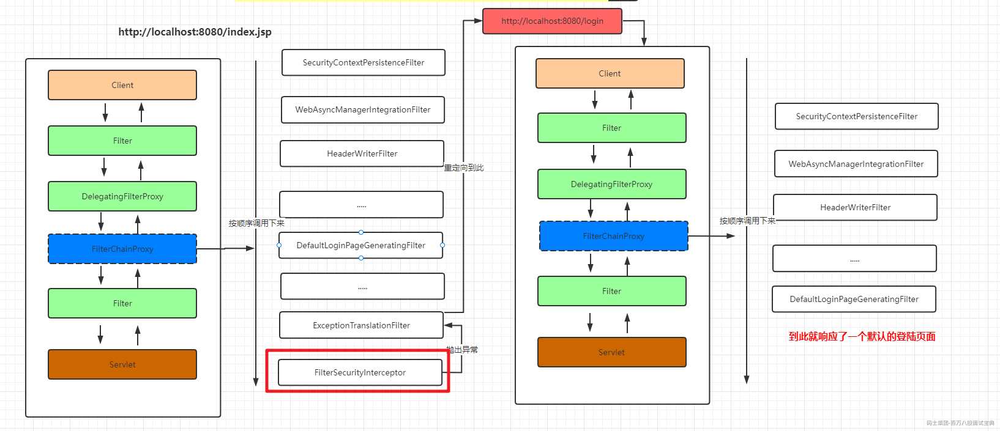

  通过前面介绍我们请求，当一个请求到来的时候会经过上面的过滤器来一个个来处理对应的请求，最后在FilterSecurityInterceptor中做认证和权限的校验操作，

## 1.FilterSecurityInterceptor

  我们进入FilterSecurityInterceptor中找到对应的doFilter方法

```java
    public void doFilter(ServletRequest request, ServletResponse response,
            FilterChain chain) throws IOException, ServletException {
        // 把 request response 以及对应的 FilterChain 封装为了一个FilterInvocation对象
        FilterInvocation fi = new FilterInvocation(request, response, chain);
        invoke(fi); // 然后执行invoke方法
    }
```

  首先看看FilterInvocation的构造方法，我们可以看到FilterInvocation其实就是对Request，Response和FilterChain做了一个非空的校验。

```plain
    public FilterInvocation(ServletRequest request, ServletResponse response,
            FilterChain chain) {
        // 如果有一个为空就抛出异常
        if ((request == null) || (response == null) || (chain == null)) {
            throw new IllegalArgumentException("Cannot pass null values to constructor");
        }

        this.request = (HttpServletRequest) request;
        this.response = (HttpServletResponse) response;
        this.chain = chain;
    }
```

  然后进入到invoke方法中。

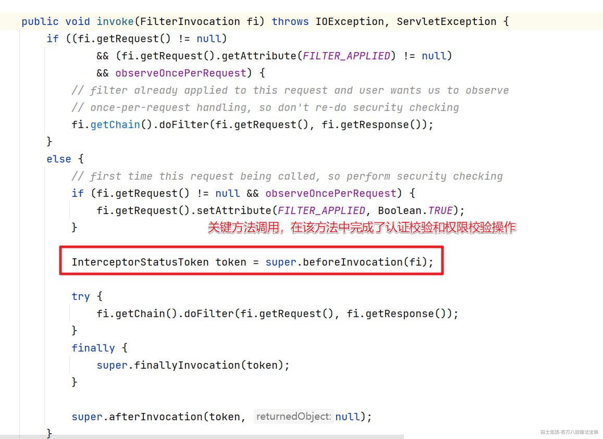

  所以关键我们需要进入到beforeInvocation方法中

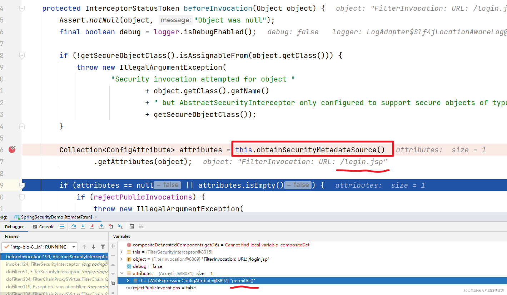

  首先是obtainSecurityMetadataSource()方法，该方法的作用是根据当前的请求获取对应的需要具备的权限信息，比如访问/login.jsp需要的信息是 permitAll 也就是可以匿名访问。

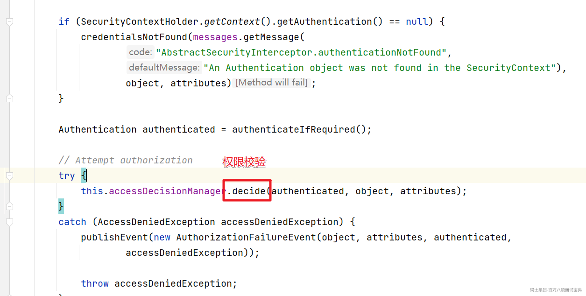

  然后就是decide()方法，该方法中会完成权限的校验。这里会通过AccessDecisionManager来处理。

## 2.AccessDescisionManager

  AccessDescisionManager字面含义是决策管理器。源码中的描述是

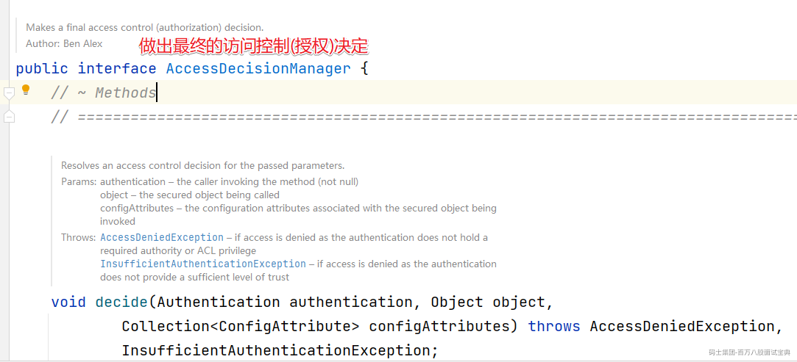

  AccessDescisionManager有三个默认的实现

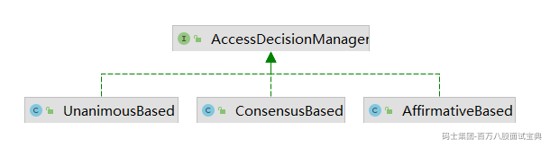

### 2.1 AffirmativeBased

  在SpringSecurity中默认的权限决策对象就是AffirmativeBased。AffirmativeBased的作用是在众多的投票者中只要有一个返回肯定的结果，就会授予访问权限。具体的决策逻辑如下：

```plain
public void decide(Authentication authentication, Object object,
            Collection<ConfigAttribute> configAttributes) throws AccessDeniedException {
        int deny = 0; // 否决的票数
        // getDecisionVoters() 获取所有的投票器
        for (AccessDecisionVoter voter : getDecisionVoters()) {
            // 投票处理
            int result = voter.vote(authentication, object, configAttributes);

            if (logger.isDebugEnabled()) {
                logger.debug("Voter: " + voter + ", returned: " + result);
            }

            switch (result) {
            case AccessDecisionVoter.ACCESS_GRANTED:
                return; // 如果投票器做出了 同意的操作，那么整个方法就结束了

            case AccessDecisionVoter.ACCESS_DENIED:
                deny++;

                break;

            default:
                break;
            }
        }

        if (deny > 0) { // 如果deny > 0 说明没有投票器投赞成的，有投了否决的 则抛出异常
            throw new AccessDeniedException(messages.getMessage(
                    "AbstractAccessDecisionManager.accessDenied", "Access is denied"));
        }
        // 执行到这儿说明 deny = 0 说明都投了弃权 票   然后检查是否支持都弃权
        // To get this far, every AccessDecisionVoter abstained
        checkAllowIfAllAbstainDecisions();
    }
```

### 2.2 ConsensusBased

  ConsensusBased则是基于少数服从多数的方案来实现授权的决策方案。具体看看代码就非常清楚了

```java
    public void decide(Authentication authentication, Object object,
            Collection<ConfigAttribute> configAttributes) throws AccessDeniedException {
        int grant = 0; // 同意
        int deny = 0;  // 否决

        for (AccessDecisionVoter voter : getDecisionVoters()) {
            int result = voter.vote(authentication, object, configAttributes);

            if (logger.isDebugEnabled()) {
                logger.debug("Voter: " + voter + ", returned: " + result);
            }

            switch (result) {
            case AccessDecisionVoter.ACCESS_GRANTED:
                grant++; // 同意的 grant + 1

                break;

            case AccessDecisionVoter.ACCESS_DENIED:
                deny++; // 否决的 deny + 1

                break;

            default:
                break;
            }
        }

        if (grant > deny) {
            return; // 如果 同意的多与 否决的就放过
        }

        if (deny > grant) { // 如果否决的占多数 就拒绝访问
            throw new AccessDeniedException(messages.getMessage(
                    "AbstractAccessDecisionManager.accessDenied", "Access is denied"));
        }

        if ((grant == deny) && (grant != 0)) { // 如果同意的和拒绝的票数一样 继续判断
            if (this.allowIfEqualGrantedDeniedDecisions) {
                return; // 如果支持票数相同就放过
            }
            else { // 否则就抛出异常 拒绝
                throw new AccessDeniedException(messages.getMessage(
                        "AbstractAccessDecisionManager.accessDenied", "Access is denied"));
            }
        }
        // 所有都投了弃权票的情况
        // To get this far, every AccessDecisionVoter abstained
        checkAllowIfAllAbstainDecisions();
    }
```

  上面代码的逻辑还是非常简单的，只需要注意下授予权限和否决权限相等时的逻辑就可以了。决策器也考虑到了这一点，所以提供了 allowIfEqualGrantedDeniedDecisions 参数，用于给用户提供自定义的机会，其默认值为 true，即代表允许授予权限和拒绝权限相等，且同时也代表授予访问权限。

### 2.3 UnanimousBased

  UnanimousBased是最严格的决策器，要求所有的AccessDecisionVoter都授权，才代表授予资源权限，否则就拒绝。具体来看下逻辑代码：

```java
    public void decide(Authentication authentication, Object object,
            Collection<ConfigAttribute> attributes) throws AccessDeniedException {

        int grant = 0; // 赞成的计票器

        List<ConfigAttribute> singleAttributeList = new ArrayList<>(1);
        singleAttributeList.add(null);

        for (ConfigAttribute attribute : attributes) {
            singleAttributeList.set(0, attribute);

            for (AccessDecisionVoter voter : getDecisionVoters()) {
                int result = voter.vote(authentication, object, singleAttributeList);

                if (logger.isDebugEnabled()) {
                    logger.debug("Voter: " + voter + ", returned: " + result);
                }

                switch (result) {
                case AccessDecisionVoter.ACCESS_GRANTED:
                    grant++;

                    break;

                case AccessDecisionVoter.ACCESS_DENIED: // 只要有一个拒绝 就 否决授权 抛出异常
                    throw new AccessDeniedException(messages.getMessage(
                            "AbstractAccessDecisionManager.accessDenied",
                            "Access is denied"));

                default:
                    break;
                }
            }
        }
        // 执行到这儿说明没有投 否决的， grant>0 说明有投 同意的
        // To get this far, there were no deny votes
        if (grant > 0) {
            return;
        }
        // 说明都投了 弃权票
        // To get this far, every AccessDecisionVoter abstained
        checkAllowIfAllAbstainDecisions();
    }
```

  上面看了在SpringSecurity中的各种决策器外我们可以再来看看各种投票器AccessDecisionVoter

## 3.AccessDecisionVoter

  AccessDecisionVoter是一个投票器，负责对授权决策进行表决。表决的结构最终由AccessDecisionManager统计，并做出最终的决策。

```java
public interface AccessDecisionVoter<S> {

    int ACCESS_GRANTED = 1; // 赞成

    int ACCESS_ABSTAIN = 0; // 弃权

    int ACCESS_DENIED = -1;  // 否决

    boolean supports(ConfigAttribute attribute);

    boolean supports(Class<?> clazz);

    int vote(Authentication authentication, S object, Collection<ConfigAttribute> attributes);

}
```

  AccessDecisionVoter的具体实现有

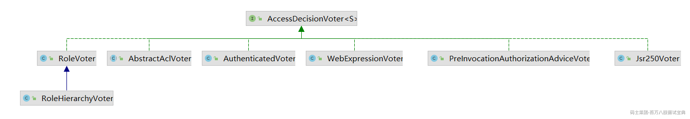

  然后我们来看看常见的几种投票器

### 3.1 WebExpressionVoter

  最常用的，也是SpringSecurity中默认的 FilterSecurityInterceptor实例中 AccessDecisionManager默认的投票器，它其实就是 http.authorizeRequests()基于 Spring-EL进行控制权限的授权决策类。

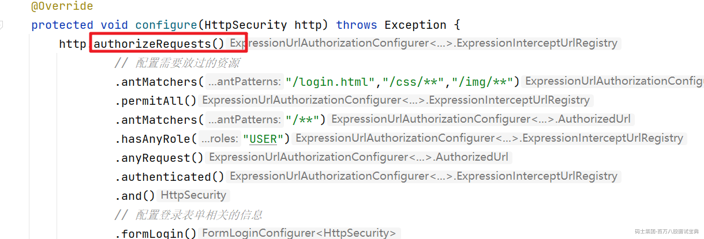

进入authorizeRequests()方法

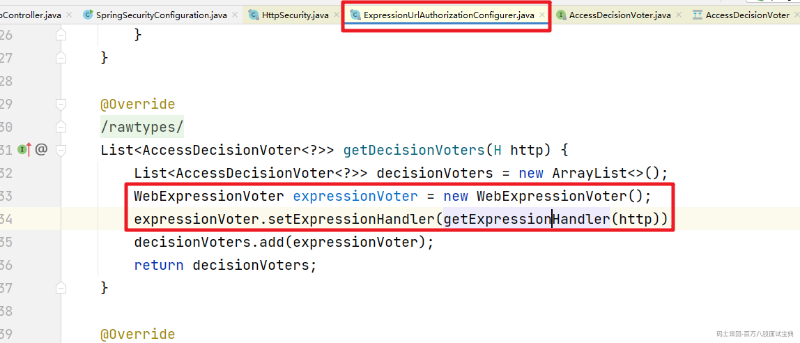

而对应的ExpressionHandler其实就是对SPEL表达式做相关的解析处理

### 3.2 AuthenticatedVoter

  AuthenticatedVoter针对的是ConfigAttribute#getAttribute() 中配置为 IS\_AUTHENTICATED\_FULLY 、IS\_AUTHENTICATED\_REMEMBERED、IS\_AUTHENTICATED\_ANONYMOUSLY 权限标识时的授权决策。因此，其投票策略比较简单：

```java
    @Override
    public int vote(Authentication authentication, Object object, Collection<ConfigAttribute> attributes) {
        int result = ACCESS_ABSTAIN; // 默认 弃权 0
        for (ConfigAttribute attribute : attributes) {
            if (this.supports(attribute)) {
                result = ACCESS_DENIED; // 拒绝
                if (IS_AUTHENTICATED_FULLY.equals(attribute.getAttribute())) {
                    if (isFullyAuthenticated(authentication)) {
                        return ACCESS_GRANTED; // 认证状态直接放过
                    }
                }
                if (IS_AUTHENTICATED_REMEMBERED.equals(attribute.getAttribute())) {
                    if (this.authenticationTrustResolver.isRememberMe(authentication)
                            || isFullyAuthenticated(authentication)) {
                        return ACCESS_GRANTED; // 记住我的状态 放过
                    }
                }
                if (IS_AUTHENTICATED_ANONYMOUSLY.equals(attribute.getAttribute())) {
                    if (this.authenticationTrustResolver.isAnonymous(authentication)
                            || isFullyAuthenticated(authentication)
                            || this.authenticationTrustResolver.isRememberMe(authentication)) {
                        return ACCESS_GRANTED; // 可匿名访问 放过
                    }
                }
            }
        }
        return result;
    }
```

### 3.3 PreInvocationAuthorizationAdviceVoter

  用于处理基于注解 @PreFilter 和 @PreAuthorize 生成的 PreInvocationAuthorizationAdvice，来处理授权决策的实现.

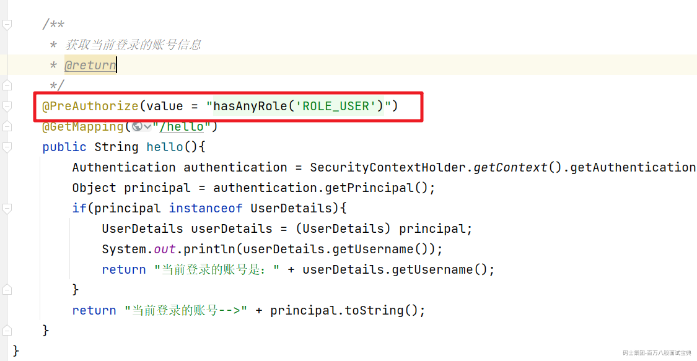

具体是投票逻辑

```java
    @Override
    public int vote(Authentication authentication, MethodInvocation method, Collection<ConfigAttribute> attributes) {
        // Find prefilter and preauth (or combined) attributes
        // if both null, abstain else call advice with them
        PreInvocationAttribute preAttr = findPreInvocationAttribute(attributes);
        if (preAttr == null) {
            // No expression based metadata, so abstain
            return ACCESS_ABSTAIN;
        }
        return this.preAdvice.before(authentication, method, preAttr) ? ACCESS_GRANTED : ACCESS_DENIED;
    }
```

### 3.4 RoleVoter

  角色投票器。用于 ConfigAttribute#getAttribute() 中配置为角色的授权决策。其默认前缀为 ROLE\_，可以自定义，也可以设置为空，直接使用角色标识进行判断。这就意味着，任何属性都可以使用该投票器投票，也就偏离了该投票器的本意，是不可取的。

```java
    @Override
    public int vote(Authentication authentication, Object object, Collection<ConfigAttribute> attributes) {
        if (authentication == null) {
            return ACCESS_DENIED;
        }
        int result = ACCESS_ABSTAIN;
        Collection<? extends GrantedAuthority> authorities = extractAuthorities(authentication);
        for (ConfigAttribute attribute : attributes) {
            if (this.supports(attribute)) {
                result = ACCESS_DENIED;
                // Attempt to find a matching granted authority
                for (GrantedAuthority authority : authorities) {
                    if (attribute.getAttribute().equals(authority.getAuthority())) {
                        return ACCESS_GRANTED;
                    }
                }
            }
        }
        return result;
    }
```

**注意，决策策略比较简单，用户只需拥有任一当前请求需要的角色即可，不必全部拥有** 。

### 3.5 RoleHierarchyVoter

  基于 RoleVoter，唯一的不同就是该投票器中的角色是附带上下级关系的。也就是说，角色A包含角色B，角色B包含 角色C，此时，如果用户拥有角色A，那么理论上可以同时拥有角色B、角色C的全部资源访问权限.

```java
    @Override
    Collection<? extends GrantedAuthority> extractAuthorities(Authentication authentication) {
        return this.roleHierarchy.getReachableGrantedAuthorities(authentication.getAuthorities());
    }
```
