# SpringSecurity中的核心过滤器-CsrfFilter

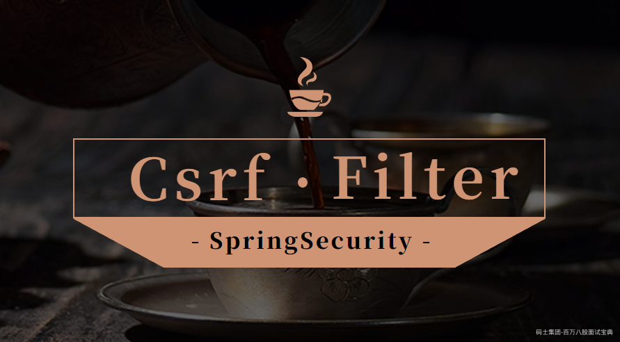

  Spring Security除了认证授权外功能外，还提供了安全防护功能。本文我们来介绍下SpringSecurity中是如何阻止CSRF攻击的。

# 一、什么是CSRF攻击

  跨站请求伪造（英语：Cross-site request forgery），也被称为 one-click attack 或者 session riding，通常缩写为 CSRF 或者 XSRF， 是一种挟制用户在当前已登录的 Web 应用程序上执行非本意的操作的攻击方法。跟跨网站脚本（XSS）相比，XSS利用的是用户对指定网站的信任，CSRF 利用的是网站对用户网页浏览器的信任。

  跨站请求攻击，简单地说，是攻击者通过一些技术手段欺骗用户的浏览器去访问一个自己曾经认证过的网站并运行一些操作（如发邮件，发消息，甚至财产操作如转账和购买商品）。由于浏览器曾经认证过，所以被访问的网站会认为是真正的用户操作而去运行。这利用了 web 中用户身份验证的一个漏洞：简单的身份验证只能保证请求发自某个用户的浏览器，却不能保证请求本身是用户自愿发出的。举个例子如下：

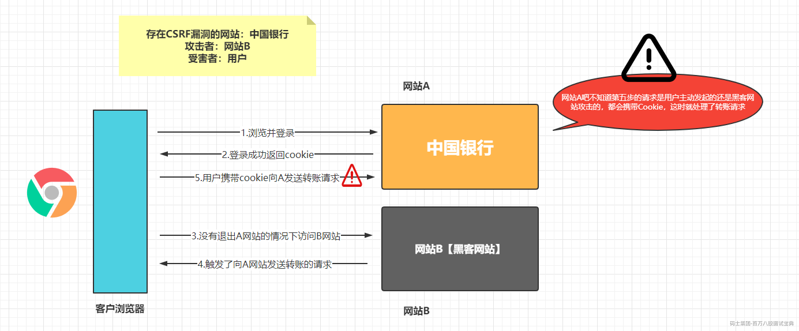

# 二、解决方案

## 1.检查Referer字段

  HTTP头中有一个Referer字段，这个字段用以标明请求来源于哪个地址。在处理敏感数据请求时，通常来说，Referer字段应和请求的地址位于同一域名下。以上文银行操作为例，Referer字段地址通常应该是转账按钮所在的网页地址，应该也位于[www.bankchina.com之下。而如果是CSRF攻击传来的请求，Referer字段会是包含恶意网址的地址，不会位于www.bankhacker.com之下，这时候服务器就能识别出恶意的访问。](http://www.bankchina.com之下。而如果是CSRF攻击传来的请求，Referer字段会是包含恶意网址的地址，不会位于www.bankhacker.com之下，这时候服务器就能识别出恶意的访问。)

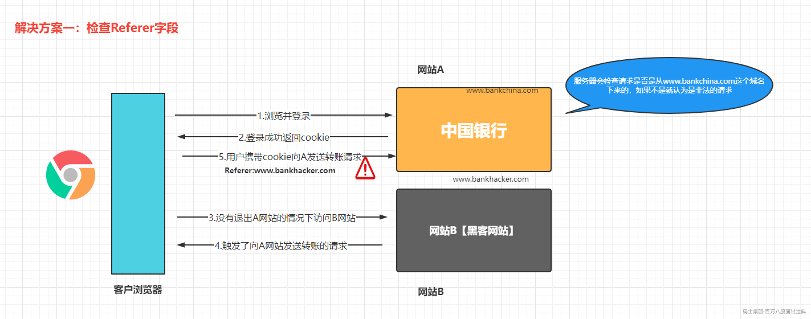

  这种办法简单易行，工作量低，仅需要在关键访问处增加一步校验。但这种办法也有其局限性，因其完全依赖浏览器发送正确的Referer字段。虽然http协议对此字段的内容有明确的规定，但并无法保证来访的浏览器的具体实现，亦无法保证浏览器没有安全漏洞影响到此字段。并且也存在攻击者攻击某些浏览器，篡改其Referer字段的可能。

## 2.CsrfToken

  其实CSRF攻击是在用户登录且没有退出浏览器的情况下访问了第三方的站点而被攻击的，完全是携带了认证的cookie来实现的，我们只需要在服务端响应给客户端的页面中绑定随机的信息，然后提交请求后在服务端校验，如果携带的数据和之前的不一致就认为是CSRF攻击，拒绝这些请求即可。

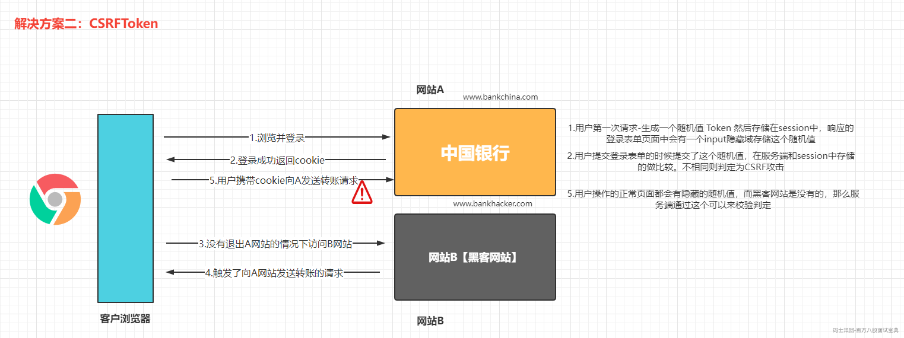

# 三、SpringSecurity是如何防止CSRF攻击的

  首先从 Spring Security 4.0 开始，默认情况下会启用 CSRF 保护，以防止 CSRF 攻击应用程序，Spring Security CSRF 会针对 PATCH，POST，PUT 和 DELETE 方法进行防护。

## 1.开启关闭CSRF防御

  在SpringSecurity中默认是开启csrf防御的，我们可以通过一下配置来关闭csrf防御

```plain
http.csrf().disable();
```

或者在基于配置文件的使用中使用如下操作关闭

```xml
<security:csrf disabled="true"/>
```

## 2.SpringSecurity的实现

### 2.1 CSRF的原理

1. 生成csrfToken保存到HttpSession或者Cookie中

2. 请求到来时，程序会从请求中获取提交的csrfToken，同时会从HttpSession中获取之前存储的csrfToken进行比较，如果相同则认为是合法的请求，继续后面的操作，如果不相等则认为是CSRF工具，拒绝该请求

### 2.2 源码分析

  然后我们来看下SpringSecurity中的代码是如何实现的。我们主要看的是 spring-security-web.jar中的

org.springframework.security.web.csrf包下的源码。

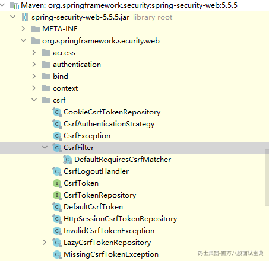

#### 2.2.1 CsrfToken

  CsrfToken是一个非常简单的接口，定义了Token令牌，消息头和请求参数。

```java
public interface CsrfToken extends Serializable {

    /**
     * 获取我们放置在请求头中CSRF随机值的名称
     */
    String getHeaderName();

    /**
     * 获取请求体中的csrf随机值的参数名称
     */
    String getParameterName();

    /**
     * 返回具体的Token值
     */
    String getToken();

}
```

CsrfToken的默认实现是DefaultCsrfToken。

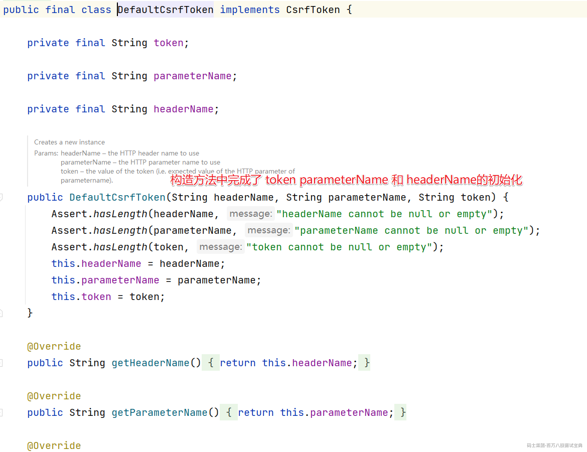

#### 2.2.2 CsrfTokenRepository

  CsrfTokenRepository接口也非常简单，定义了Token的生成，存储和获取的相关API

```java
public interface CsrfTokenRepository {

    /**
     * 生成Token
     */
    CsrfToken generateToken(HttpServletRequest request);

    /**
     * 存储生成的Token
     */
    void saveToken(CsrfToken token, HttpServletRequest request, HttpServletResponse response);

    /**
     * 返回Token
     */
    CsrfToken loadToken(HttpServletRequest request);

}
```

CsrfTokenRepository的实现在SpringSecurity中有两个实现。

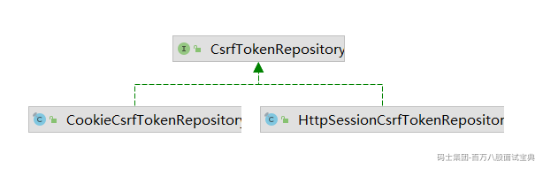

默认的实现是HttpSessionCsrfTokenRepository。是一个基于HttpSession保存csrfToken的实现。

```java
public final class HttpSessionCsrfTokenRepository implements CsrfTokenRepository {

    private static final String DEFAULT_CSRF_PARAMETER_NAME = "_csrf";

    private static final String DEFAULT_CSRF_HEADER_NAME = "X-CSRF-TOKEN";

    private static final String DEFAULT_CSRF_TOKEN_ATTR_NAME = HttpSessionCsrfTokenRepository.class.getName()
            .concat(".CSRF_TOKEN");

    private String parameterName = DEFAULT_CSRF_PARAMETER_NAME;

    private String headerName = DEFAULT_CSRF_HEADER_NAME;

    private String sessionAttributeName = DEFAULT_CSRF_TOKEN_ATTR_NAME;

    // 保存Token到session中
    @Override
    public void saveToken(CsrfToken token, HttpServletRequest request, HttpServletResponse response) {
        if (token == null) {
            HttpSession session = request.getSession(false);
            if (session != null) {
                session.removeAttribute(this.sessionAttributeName);
            }
        }
        else {
            HttpSession session = request.getSession();
            session.setAttribute(this.sessionAttributeName, token);
        }
    }

// 从session中加载token
    @Override
    public CsrfToken loadToken(HttpServletRequest request) {
        HttpSession session = request.getSession(false);
        if (session == null) {
            return null;
        }
        return (CsrfToken) session.getAttribute(this.sessionAttributeName);
    }
  // 生成Token 
    @Override
    public CsrfToken generateToken(HttpServletRequest request) {
        return new DefaultCsrfToken(this.headerName, this.parameterName, createNewToken());
    }

    /**
     * Sets the {@link HttpServletRequest} parameter name that the {@link CsrfToken} is
     * expected to appear on
     * @param parameterName the new parameter name to use
     */
    public void setParameterName(String parameterName) {
        Assert.hasLength(parameterName, "parameterName cannot be null or empty");
        this.parameterName = parameterName;
    }

    /**
     * Sets the header name that the {@link CsrfToken} is expected to appear on and the
     * header that the response will contain the {@link CsrfToken}.
     * @param headerName the new header name to use
     */
    public void setHeaderName(String headerName) {
        Assert.hasLength(headerName, "headerName cannot be null or empty");
        this.headerName = headerName;
    }

    /**
     * Sets the {@link HttpSession} attribute name that the {@link CsrfToken} is stored in
     * @param sessionAttributeName the new attribute name to use
     */
    public void setSessionAttributeName(String sessionAttributeName) {
        Assert.hasLength(sessionAttributeName, "sessionAttributename cannot be null or empty");
        this.sessionAttributeName = sessionAttributeName;
    }
    // 通过UUID来生成Token信息
    private String createNewToken() {
        return UUID.randomUUID().toString();
    }

}
```

#### 2.2.3 CsrfFilter

  CsrfFilter用于处理跨站请求伪造。检查表单提交的\_csrf隐藏域的value与内存中保存的的是否一致，如果一致框架则认为当然登录页面是安全的，如果不一致，会报403forbidden错误。

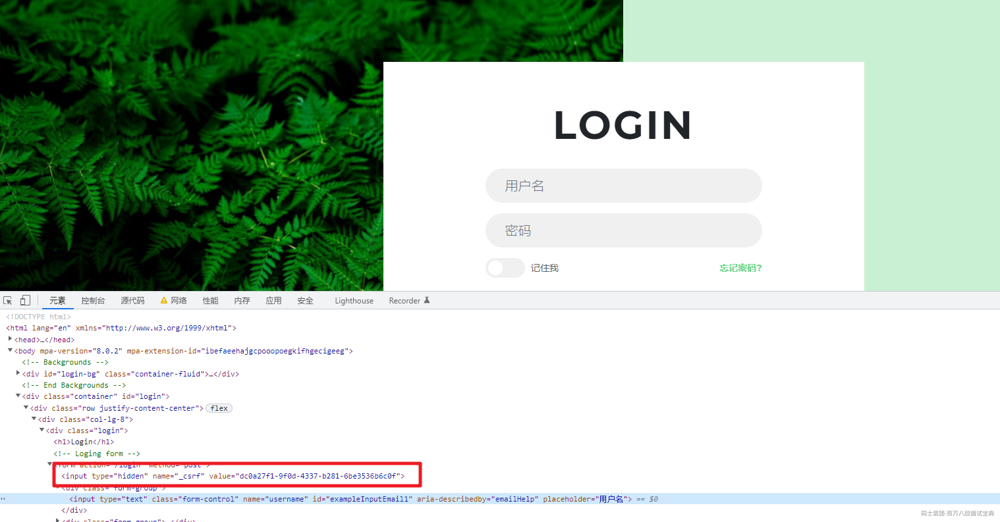

具体处理请求的方法

```java
    @Override
    protected void doFilterInternal(HttpServletRequest request, HttpServletResponse response, FilterChain filterChain)
            throws ServletException, IOException {
        request.setAttribute(HttpServletResponse.class.getName(), response);
// 从session中加载 Token
        CsrfToken csrfToken = this.tokenRepository.loadToken(request);
        boolean missingToken = (csrfToken == null);
// 如果是第一次访问就生成Token信息
        if (missingToken) {
            csrfToken = this.tokenRepository.generateToken(request);
// 把生成的Token信息存储在Session中
            this.tokenRepository.saveToken(csrfToken, request, response);
        }
        request.setAttribute(CsrfToken.class.getName(), csrfToken);
        request.setAttribute(csrfToken.getParameterName(), csrfToken);
// 匹配是否是需要做CSRF防御的相关请求
        if (!this.requireCsrfProtectionMatcher.matches(request)) {
            if (this.logger.isTraceEnabled()) {
                this.logger.trace("Did not protect against CSRF since request did not match "
                        + this.requireCsrfProtectionMatcher);
            }
            filterChain.doFilter(request, response);
            return;
        }
// 获取请求携带在header中的Token信息
        String actualToken = request.getHeader(csrfToken.getHeaderName());
        if (actualToken == null) {
// 从请求参数中获取Token信息
            actualToken = request.getParameter(csrfToken.getParameterName());
        }
// 判断请求中的Token是否和Session中存储的Token相等
        if (!equalsConstantTime(csrfToken.getToken(), actualToken)) {
            this.logger.debug(
                    LogMessage.of(() -> "Invalid CSRF token found for " + UrlUtils.buildFullRequestUrl(request)));
// Token不相等，说明是CSRF攻击，抛出访问拒绝的异常
            AccessDeniedException exception = (!missingToken) ? new InvalidCsrfTokenException(csrfToken, actualToken)
                    : new MissingCsrfTokenException(actualToken);
            this.accessDeniedHandler.handle(request, response, exception);
            return;
        }
// 说明是正常的访问，放过
        filterChain.doFilter(request, response);
    }
```

## 3.分布式Session

  上面介绍的CsrfToken校验，生成的Token信息是存储在HttpSession中的，那么我们在分布式环境下，跨进程的场景下我们要如何实现Session共享呢？这时我们可以通过SpringSession来实现，但是这里有个前提就是分布式的项目必须都得是在一个一级域名下的多个二级域名是可以实现的。

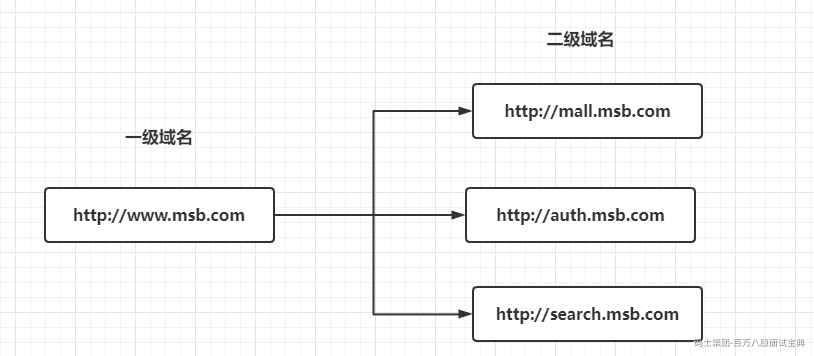

### 3.1 配置SpringSession

  配置SpringSession可以参考Spring的官网：<https://docs.spring.io/spring-session/docs/2.5.6/reference/html5/> 因为在分布式Session我们需要把Session数据独立的存储在Redis服务中，所以还需要启动Redis服务。

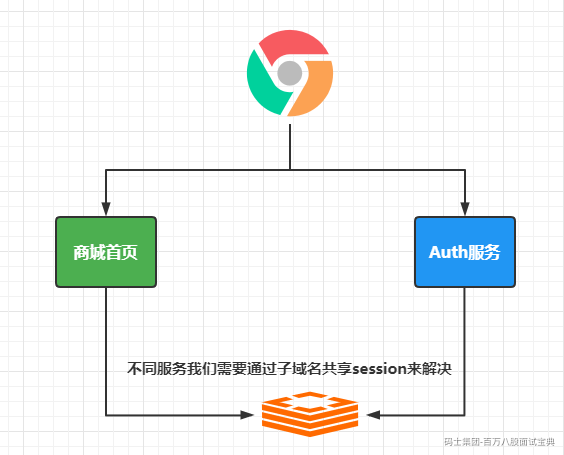

添加相关依赖：

```java
        <dependency>
            <groupId>org.springframework.session</groupId>

            <artifactId>spring-session-data-redis</artifactId>

        </dependency>

        <dependency>
            <groupId>org.springframework.boot</groupId>

            <artifactId>spring-boot-starter-data-redis</artifactId>

        </dependency>

```

然后添加对应的配置

```properties
spring.redis.host=192.168.56.100
spring.redis.port=6379
spring.session.store-type=redis
spring.session.redis.namespace=spring:session
```

修改host文件，设置域名关系

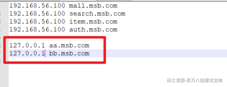

添加配置文件，设置Cookie中的domain为一级域名

```java
@Configuration
public class MySessionConfig {

    @Bean
    public CookieSerializer cookieSerializer(){
        DefaultCookieSerializer cookieSerializer = new DefaultCookieSerializer();
        cookieSerializer.setDomainName("msb.com");
        cookieSerializer.setCookieName("csrfSession");
        return cookieSerializer;
    }
}
```

然后测试看效果，然后aa.msb.com:8080

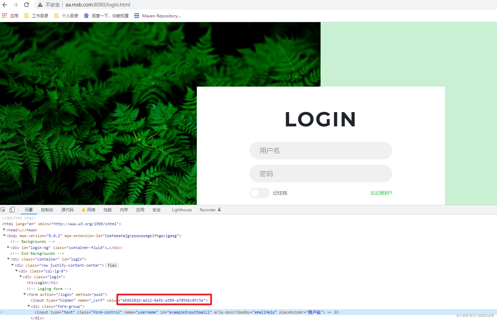

然后访问bb.msb.com:8081

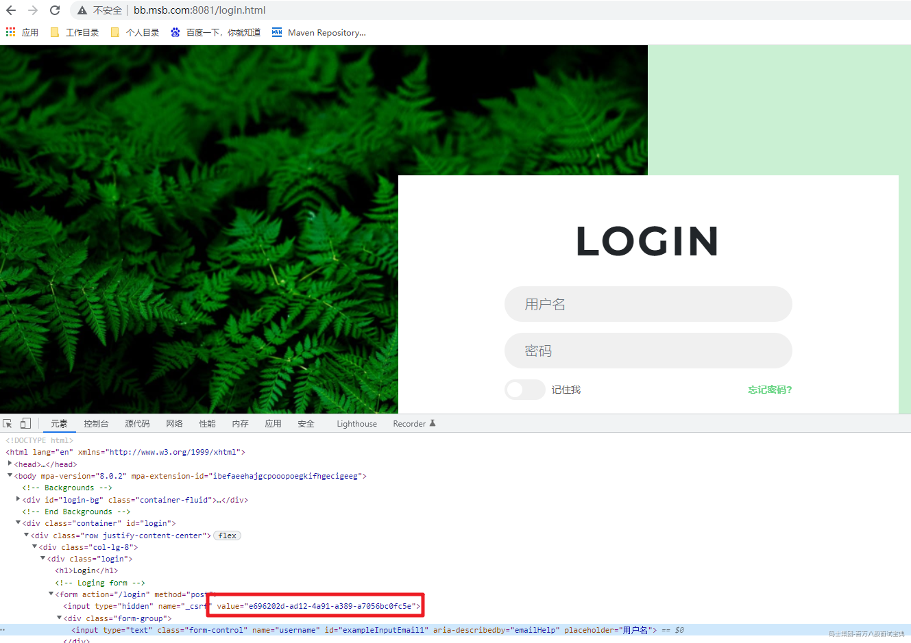

可以看到两个页面中生成的csrfToken是一样的，说明共享了数据，而且Cookie中的Session信息也一致。


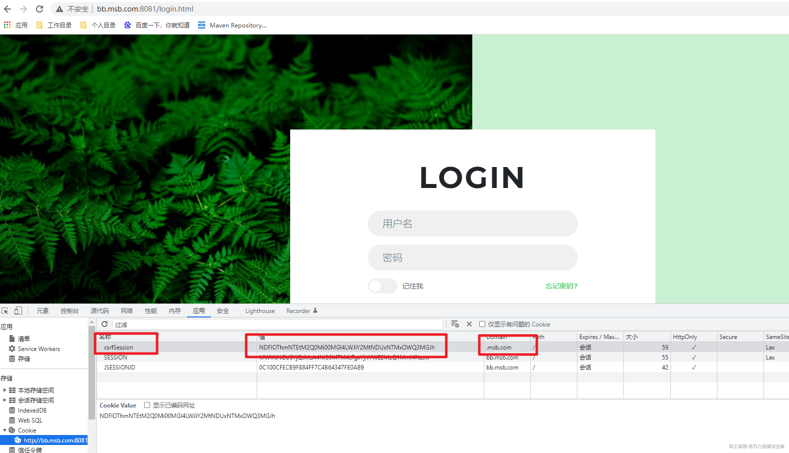

搞定~
