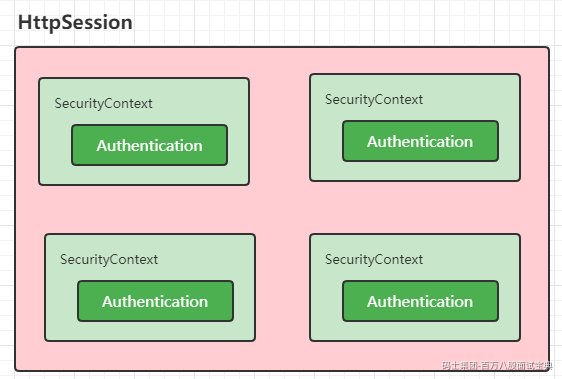

# SpringSecurity核心过滤器-SecurityContextPersistenceFilter


# 一、SpringSecurity中的核心组件

  在SpringSecurity中的jar分为4个，作用分别为

|  |  |
| --- | --- |
| jar | 作用 |
| spring-security-core | SpringSecurity的核心jar包，认证和授权的核心代码都在这里面 |
| spring-security-config | 如果使用Spring Security XML名称空间进行配置或Spring Security的&#x3c;br />Java configuration支持，则需要它 |
| spring-security-web | 用于Spring Security web身份验证服务和基于url的访问控制 |
| spring-security-test | 测试单元 |

## 1.SecurityContextHolder

  首先来看看在spring-security-core中的SecurityContextHolder，这个是一个非常基础的对象，存储了当前应用的上下文SecurityContext，而在SecurityContext可以获取Authentication对象。也就是当前认证的相关信息会存储在Authentication对象中。


  默认情况下，SecurityContextHolder是通过 `ThreadLocal`来存储对应的信息的。也就是在一个线程中我们可以通过这种方式来获取当前登录的用户的相关信息。而在SecurityContext中就只提供了对Authentication对象操作的方法

```java
public interface SecurityContext extends Serializable {

    Authentication getAuthentication();

    void setAuthentication(Authentication authentication);

}
```

xxxStrategy的各种实现


|  |  |
| --- | --- |
| 策略实现 | 说明 |
| GlobalSecurityContextHolderStrategy | 把SecurityContext存储为static变量 |
| InheritableThreadLocalSecurityContextStrategy | 把SecurityContext存储在InheritableThreadLocal中&#x3c;br />InheritableThreadLocal解决父线程生成的变量传递到子线程中进行使用 |
| ThreadLocalSecurityContextStrategy | 把SecurityContext存储在ThreadLocal中 |

## 2.Authentication

  Authentication是一个认证对象。在Authentication接口中声明了如下的相关方法。

```java
public interface Authentication extends Principal, Serializable {

    // 获取认证用户拥有的对应的权限
    Collection<? extends GrantedAuthority> getAuthorities();

    // 获取哦凭证
    Object getCredentials();

    // 存储有关身份验证请求的其他详细信息。这些可能是 IP地址、证书编号等
    Object getDetails();

     // 获取用户信息 通常是 UserDetails 对象
    Object getPrincipal();

    // 是否认证
    boolean isAuthenticated();

    // 设置认证状态
    void setAuthenticated(boolean isAuthenticated) throws IllegalArgumentException;

}
```


  基于上面讲解的三者的关系我们在项目中如此来获取当前登录的用户信息了。

```java
    public String hello(){
        Authentication authentication = SecurityContextHolder.getContext().getAuthentication();
        Object principal = authentication.getPrincipal();
        if(principal instanceof UserDetails){
            UserDetails userDetails = (UserDetails) principal;
            System.out.println(userDetails.getUsername());
            return "当前登录的账号是：" + userDetails.getUsername();
        }
        return "当前登录的账号-->" + principal.toString();
    }
```

  调用 `getContext()`返回的对象是 `SecurityContext`接口的一个实例，这个对象就是保存在线程中的。接下来将看到，Spring Security中的认证大都返回一个 `UserDetails`的实例作为principa。

## 3.UserDetailsService

  在上面的关系中我们看到在Authentication中存储当前登录用户的是Principal对象，而通常情况下Principal对象可以转换为UserDetails对象。`UserDetails`是Spring Security中的一个核心接口。它表示一个principal，但是是可扩展的、特定于应用的。可以认为 `UserDetails`是数据库中用户表记录和Spring Security在 `SecurityContextHolder`中所必须信息的适配器。

```java
public interface UserDetails extends Serializable {

    // 对应的权限
    Collection<? extends GrantedAuthority> getAuthorities();

    // 密码
    String getPassword();

    // 账号
    String getUsername();

    // 账号是否过期
    boolean isAccountNonExpired();

    // 是否锁定
    boolean isAccountNonLocked();

    // 凭证是否过期
    boolean isCredentialsNonExpired();

    // 账号是否可用
    boolean isEnabled();

}
```

  而这个接口的默认实现就是 `User`


  那么这个UserDetails对象什么时候提供呢？其实在我们前面介绍的数据库认证的Service中我们就用到了，有一个特殊接口 `UserDetailsService`，在这个接口中定义了一个loadUserByUsername的方法，接收一个用户名，来实现根据账号的查询操作，返回的是一个 `UserDetails`对象。

```plain
public interface UserDetailsService {

    UserDetails loadUserByUsername(String username) throws UsernameNotFoundException;

}
```

  UserDetailsService接口的实现有如下：


  Spring Security提供了许多 `UserDetailsSerivice`接口的实现，包括使用内存中map的实现（`InMemoryDaoImpl` 低版本 InMemoryUserDetailsManager）和使用JDBC的实现（`JdbcDaoImpl`）。但在实际开发中我们更喜欢自己来编写，比如UserServiceImpl我们的案例

```java
/**
 * 用户的Service
 */
public interface UserService extends UserDetailsService {

}

/**
 * UserService接口的实现类
 */
@Service
public class UserServiceImpl implements UserService {

    @Autowired
    UserMapper userMapper;

    /**
     * 根据账号密码验证的方法
     * @param username
     * @return
     * @throws UsernameNotFoundException
     */
    @Override
    public UserDetails loadUserByUsername(String username) throws UsernameNotFoundException {
        SysUser user = userMapper.queryByUserName(username);
        System.out.println("---------->"+user);
        if(user != null){
            // 账号对应的权限
            List<SimpleGrantedAuthority> authorities = new ArrayList<>();
            authorities.add(new SimpleGrantedAuthority("ROLE_USER"));
            // 说明账号存在 {noop} 非加密的使用
            UserDetails details = new User(user.getUserName()
                    ,user.getPassword()
                    ,true
                    ,true
                    ,true
                    ,true
                    ,authorities);
            return details;
        }
        throw new UsernameNotFoundException("账号不存在...");

    }
}
```

## 4.GrantedAuthority

  我们在Authentication中看到不光关联了Principal还提供了一个getAuthorities()方法来获取对应的GrantedAuthority对象数组。和权限相关，后面在权限模块详细讲解

```java
public interface GrantedAuthority extends Serializable {

    String getAuthority();

}
```

上面介绍到的核心对象小结：

|  |  |
| --- | --- |
| 核心对象 | 作用 |
| SecurityContextHolder | 用于获取SecurityContext |
| SecurityContext | 存放了Authentication和特定于请求的安全信息 |
| Authentication | 特定于Spring Security的principal |
| GrantedAuthority | 对某个principal的应用范围内的授权许可 |
| UserDetail | 提供从应用程序的DAO或其他安全数据源构建Authentication对象所需的信息 |
| UserDetailsService | 接受String类型的用户名，创建并返回UserDetail |

而这块和SpringSecurity的运行关联我们就需要来看看SecurityContextPersistenceFilter的作用了

# 二、SecurityContextPersistenceFilter

  首先在Session中维护一个用户的安全信息就是这个过滤器处理的。从request中获取session，从Session中取出已认证用户的信息保存在SecurityContext中,提高效率,避免每一次请求都要解析用户认证信息，方便接下来的filter直接获取当前的用户信息。

## 1.SecutiryContextRepository

  SecutiryContextRepository接口非常简单，定义了对SecurityContext的存储操作，在该接口中定义了如下的几个方法

```plain
public interface SecurityContextRepository {

    /**
     * 获取SecurityContext对象
     */
    SecurityContext loadContext(HttpRequestResponseHolder requestResponseHolder);

    /**
     * 存储SecurityContext
     */
    void saveContext(SecurityContext context, HttpServletRequest request, HttpServletResponse response);

    /**
     * 判断是否存在SecurityContext对象
     */
    boolean containsContext(HttpServletRequest request);

}
```

  默认的实现是HttpSessionSecurityContextRepository。也就是把SecurityContext存储在了HttpSession中。对应的抽象方法实现如下：

  先来看看loadContext方法

```java
    public SecurityContext loadContext(HttpRequestResponseHolder requestResponseHolder) {
        // 获取对有的Request和Response对象
        HttpServletRequest request = requestResponseHolder.getRequest();
        HttpServletResponse response = requestResponseHolder.getResponse();
        // 获取HttpSession对象
        HttpSession httpSession = request.getSession(false);
        // 从HttpSession中获取SecurityContext对象
        SecurityContext context = readSecurityContextFromSession(httpSession);
        if (context == null) {
            // 如果HttpSession中不存在SecurityContext对象就创建一个
            // SecurityContextHolder.createEmptyContext();
            // 默认是ThreadLocalSecurityContextHolderStrategy存储在本地线程中
            context = generateNewContext();
            if (this.logger.isTraceEnabled()) {
                this.logger.trace(LogMessage.format("Created %s", context));
            }
        }
        // 包装Request和Response对象
        SaveToSessionResponseWrapper wrappedResponse = new SaveToSessionResponseWrapper(response, request,
                httpSession != null, context);
        requestResponseHolder.setResponse(wrappedResponse);
        requestResponseHolder.setRequest(new SaveToSessionRequestWrapper(request, wrappedResponse));
        return context;
    }
```

  然后再来看看saveContext方法。

```java
    @Override
    public void saveContext(SecurityContext context, HttpServletRequest request, HttpServletResponse response) {
        SaveContextOnUpdateOrErrorResponseWrapper responseWrapper = WebUtils.getNativeResponse(response,
                SaveContextOnUpdateOrErrorResponseWrapper.class);
        Assert.state(responseWrapper != null, () -> "Cannot invoke saveContext on response " + response
                + ". You must use the HttpRequestResponseHolder.response after invoking loadContext");

        responseWrapper.saveContext(context);
    }
```

继续进入

```java
@Override
        protected void saveContext(SecurityContext context) {
            // 获取Authentication对象
            final Authentication authentication = context.getAuthentication();
            // 获取HttpSession对象
            HttpSession httpSession = this.request.getSession(false);
            // 
            String springSecurityContextKey = HttpSessionSecurityContextRepository.this.springSecurityContextKey;
            // See SEC-776
            if (authentication == null
                    || HttpSessionSecurityContextRepository.this.trustResolver.isAnonymous(authentication)) {
                if (httpSession != null && this.authBeforeExecution != null) {
                    // SEC-1587 A non-anonymous context may still be in the session
                    // SEC-1735 remove if the contextBeforeExecution was not anonymous
                    httpSession.removeAttribute(springSecurityContextKey);
                    this.isSaveContextInvoked = true;
                }
                if (this.logger.isDebugEnabled()) {
                    if (authentication == null) {
                        this.logger.debug("Did not store empty SecurityContext");
                    }
                    else {
                        this.logger.debug("Did not store anonymous SecurityContext");
                    }
                }
                return;
            }
            httpSession = (httpSession != null) ? httpSession : createNewSessionIfAllowed(context, authentication);
            // If HttpSession exists, store current SecurityContext but only if it has
            // actually changed in this thread (see SEC-37, SEC-1307, SEC-1528)
            if (httpSession != null) {
                // We may have a new session, so check also whether the context attribute
                // is set SEC-1561
                if (contextChanged(context) || httpSession.getAttribute(springSecurityContextKey) == null) {
                    // HttpSession 中存储SecurityContext
                    httpSession.setAttribute(springSecurityContextKey, context);
                    this.isSaveContextInvoked = true;
                    if (this.logger.isDebugEnabled()) {
                        this.logger.debug(LogMessage.format("Stored %s to HttpSession [%s]", context, httpSession));
                    }
                }
            }
        }
```

最后就是containsContext方法

```java
    @Override
    public boolean containsContext(HttpServletRequest request) {
        // 获取HttpSession
        HttpSession session = request.getSession(false);
        if (session == null) {
            return false;
        }
        // 从session中能获取就返回true否则false
        return session.getAttribute(this.springSecurityContextKey) != null;
    }
```

## 2.SecurityContextPersistenceFilter

  然后我们来看看SecurityContextPersistenceFilter的具体处理逻辑

```java
    private void doFilter(HttpServletRequest request, HttpServletResponse response, FilterChain chain)
            throws IOException, ServletException {
        // 同一个请求之处理一次
        if (request.getAttribute(FILTER_APPLIED) != null) {
            chain.doFilter(request, response);
            return;
        }
        // 更新状态
        request.setAttribute(FILTER_APPLIED, Boolean.TRUE);
        // 是否提前创建 HttpSession
        if (this.forceEagerSessionCreation) {
            // 创建HttpSession
            HttpSession session = request.getSession();
            if (this.logger.isDebugEnabled() && session.isNew()) {
                this.logger.debug(LogMessage.format("Created session %s eagerly", session.getId()));
            }
        }
        // 把Request和Response对象封装为HttpRequestResponseHolder对象
        HttpRequestResponseHolder holder = new HttpRequestResponseHolder(request, response);
        // 获取SecurityContext对象
        SecurityContext contextBeforeChainExecution = this.repo.loadContext(holder);
        try {
            // SecurityContextHolder绑定SecurityContext对象
            SecurityContextHolder.setContext(contextBeforeChainExecution);
            if (contextBeforeChainExecution.getAuthentication() == null) {
                logger.debug("Set SecurityContextHolder to empty SecurityContext");
            }
            else {
                if (this.logger.isDebugEnabled()) {
                    this.logger
                            .debug(LogMessage.format("Set SecurityContextHolder to %s", contextBeforeChainExecution));
                }
            }// 结束交给下一个过滤器处理
            chain.doFilter(holder.getRequest(), holder.getResponse());
        }
        finally {
            // 当其他过滤器都处理完成后
            SecurityContext contextAfterChainExecution = SecurityContextHolder.getContext();
            // 移除SecurityContextHolder中的Security
            SecurityContextHolder.clearContext();
            // 把
            this.repo.saveContext(contextAfterChainExecution, holder.getRequest(), holder.getResponse());
            // 存储Context在HttpSession中
            request.removeAttribute(FILTER_APPLIED);
            this.logger.debug("Cleared SecurityContextHolder to complete request");
        }
    }
```

  通过上面的代码逻辑其实我们就清楚了在SpringSecurity中的认证信息的流转方式了。首先用户的认证状态Authentication是存储在SecurityContext中的，而每个用户的SecurityContext是统一存储在HttpSession中的。一次请求流转中我们需要获取当前的认证信息是通过SecurityContextHolder来获取的，默认是在ThreadLocal中存储的。


