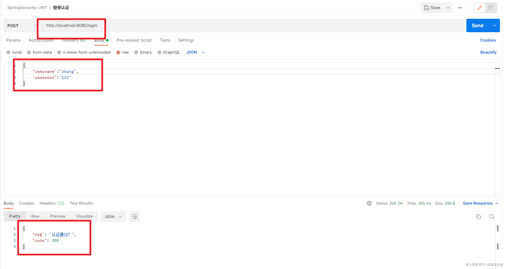
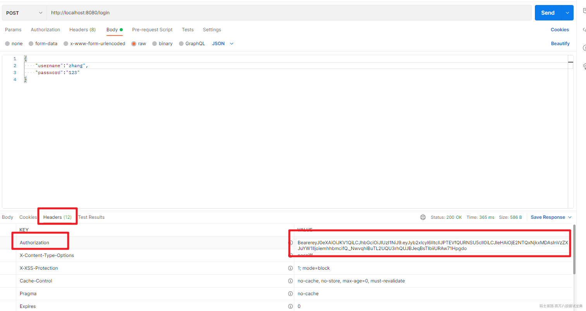
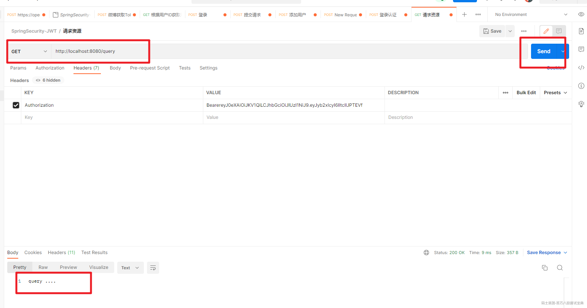

# SpringSecurity基于JWT实现Token的处理

  前面介绍了手写单点登录和JWT的应用，本文结合SpringSecurity来介绍下在SpringBoot项目中基于SpringSecurity作为认证授权框架的情况下如何整合JWT来实现Token的处理。

# 一、认证思路分析

  SpringSecurity主要是通过过滤器来实现功能的！我们要找到SpringSecurity实现认证和校验身份的过滤器！

## 1.回顾集中式认证流程

`用户认证`：  
  使用 `UsernamePasswordAuthenticationFilter`过滤器中 `attemptAuthentication`方法实现认证功能，该过滤器父类中 `successfulAuthentication`方法实现认证成功后的操作。认证失败是在  `unsuccessfulAuthentication`

`身份校验` ：

  使用 `BasicAuthenticationFilter` 过滤器中 `doFilterInternal`方法验证是否登录，以决定能否进入后续过滤器。

## 2.分析分布式认证流程

`用户认证`：  
  由于分布式项目，多数是前后端分离的架构设计，我们要满足可以接受异步post的认证请求参数，需要修改UsernamePasswordAuthenticationFilter过滤器中attemptAuthentication方法，让其能够接收请求体。  
  另外，默认successfulAuthentication方法在认证通过后，是把用户信息直接放入session就完事了，现在我们需要修改这个方法，在认证通过后生成token并返回给用户。  
`身份校验`：  
  原来BasicAuthenticationFilter过滤器中doFilterInternal方法校验用户是否登录，就是看session中是否有用户信息，我们要修改为，验证用户携带的token是否合法，并解析出用户信息，交给SpringSecurity，以便于后续的授权功能可以正常使用。

# 二、具体实现

## 1.创建项目

  创建一个SpringBoot项目.引入必要的依赖

```plain
<dependencies>
        <dependency>
            <groupId>org.springframework.boot</groupId>

            <artifactId>spring-boot-starter-security</artifactId>

        </dependency>

        <dependency>
            <groupId>org.springframework.boot</groupId>

            <artifactId>spring-boot-starter-web</artifactId>

        </dependency>

        <dependency>
            <groupId>org.projectlombok</groupId>

            <artifactId>lombok</artifactId>

            <optional>true</optional>

        </dependency>

        <dependency>
            <groupId>org.springframework.boot</groupId>

            <artifactId>spring-boot-starter-test</artifactId>

            <scope>test</scope>

        </dependency>

        <dependency>
            <groupId>org.springframework.security</groupId>

            <artifactId>spring-security-test</artifactId>

            <scope>test</scope>

        </dependency>

        <dependency>
            <groupId>com.bobo</groupId>

            <artifactId>security-jwt-common</artifactId>

            <version>1.0-SNAPSHOT</version>

        </dependency>

        <dependency>
            <groupId>com.alibaba</groupId>

            <artifactId>fastjson</artifactId>

            <version>1.2.80</version>

        </dependency>

    <dependency>
            <groupId>com.auth0</groupId>

            <artifactId>java-jwt</artifactId>

            <version>3.4.0</version>

        </dependency>

    </dependencies>

```

## 2.JWT工具类

  引入前面创建的JWT的工具类。

```java

import com.auth0.jwt.JWT;
import com.auth0.jwt.JWTCreator;
import com.auth0.jwt.algorithms.Algorithm;
import com.auth0.jwt.exceptions.AlgorithmMismatchException;
import com.auth0.jwt.exceptions.SignatureVerificationException;
import com.auth0.jwt.interfaces.DecodedJWT;

import java.security.SignatureException;
import java.util.Calendar;
import java.util.Map;

public class JWTUtils {
    // 秘钥
    private static final String SING = "123qwaszx";

    /**
     * 生成Token  header.payload.sing 组成
     * @return
     */
    public static String getToken(Map<String,String> map){
        Calendar instance = Calendar.getInstance();
        instance.add(Calendar.DATE,7); // 默认过期时间 7天
        JWTCreator.Builder builder = JWT.create();
        // payload 设置
        map.forEach((k,v)->{
            builder.withClaim(k,v);
        });
        // 生成Token 并返回
        return builder.withExpiresAt(instance.getTime())
                .sign(Algorithm.HMAC256(SING));
    }

    /**
     * 验证Token
     * @return
     *     DecodedJWT  可以用来获取用户信息
     */
    public static DecodedJWT verify(String token){
        // 如果不抛出异常说明验证通过，否则验证失败
        DecodedJWT verify = null;
        try {
            verify = JWT.require(Algorithm.HMAC256(SING)).build().verify(token);
        }catch (SignatureVerificationException e){
            e.printStackTrace();
        }catch (AlgorithmMismatchException e){
            e.printStackTrace();
        }catch (Exception e){
            e.printStackTrace();
        }
        return verify;
    }
}

```

## 3.用户实例

  创建用户的实例，添加必要的属性

```java
@Data
public class UserPojo implements UserDetails {

    private Integer id;

    private String username;

    private String password;

    private Integer status;

    @JsonIgnore
    @Override
    public Collection<? extends GrantedAuthority> getAuthorities() {
        List<SimpleGrantedAuthority> auth = new ArrayList<>();
        auth.add(new SimpleGrantedAuthority("ROLE_ADMIN"));
        return auth;
    }

    @Override
    public String getPassword() {
        return this.password;
    }

    @Override
    public String getUsername() {
        return this.username;
    }
    @JsonIgnore
    @Override
    public boolean isAccountNonExpired() {
        return true;
    }
    @JsonIgnore
    @Override
    public boolean isAccountNonLocked() {
        return true;
    }
    @JsonIgnore
    @Override
    public boolean isCredentialsNonExpired() {
        return true;
    }
    @JsonIgnore
    @Override
    public boolean isEnabled() {
        return true;
    }
}
```

## 4.UserService

  完成基于SpringSecurity的数据库认证。创建UserService接口并实现

```java
public interface UserService extends UserDetailsService {
}

@Service
public class UserServiceImpl implements UserService {
    @Override
    public UserDetails loadUserByUsername(String username) throws UsernameNotFoundException {
        UserPojo userPojo = new UserPojo();
        if("zhang".equals(username)){
            userPojo.setUsername("zhang");
            userPojo.setPassword("$2a$10$hbMJRuxJoa6kWcfeT7cNPOGdoEXm5sdfSm5DQtp//2cmCF0MHO8b6");
            return userPojo;
        }
        return userPojo;
    }
}
```

## 5.自定义认证过滤器

  在SpringSecurity中的认证是通过UsernamePasswordAuthenticationFilter来处理的，现在我们要通过JWT来处理，那么我们就需要重写其中几个处理的方法

### 5.1 认证的方法

  认证的逻辑还是走的UserService处理，但是我们需要自己来手动的调用认证逻辑。

```java
    @Override
    public Authentication attemptAuthentication(HttpServletRequest request, HttpServletResponse response)
            throws AuthenticationException {

        UserPojo sysUser = null;
        try {
            sysUser = JSON.parseObject(getJson(request), UserPojo.class);
        } catch (IOException e) {
            e.printStackTrace();
        }
        UsernamePasswordAuthenticationToken authRequest = new UsernamePasswordAuthenticationToken(sysUser.getUsername(), sysUser.getPassword());
        this.setDetails(request, authRequest);
        return authenticationManager.authenticate(authRequest);
    }

    public String getJson(HttpServletRequest request) throws IOException{
        BufferedReader streamReader = new BufferedReader( new InputStreamReader(request.getInputStream(), "UTF-8"));
        StringBuilder sb = new StringBuilder();
        String inputStr;
        while ((inputStr = streamReader.readLine()) != null) {
            sb.append(inputStr);
        }
        return sb.toString();
    }
```

### 5.2 认证成功

  认证成功生成Token信息，并保存在响应的header头中。

```java
@Override
    protected void successfulAuthentication(HttpServletRequest request
            , HttpServletResponse response
            , FilterChain chain
            , Authentication authResult) throws IOException, ServletException {
        // 生成Token信息
        Map<String,String> map = new HashMap<>();
        map.put("username",authResult.getName());
        Collection<? extends GrantedAuthority> authorities = authResult.getAuthorities();
        List<String> list = new ArrayList<>();
        for (GrantedAuthority authority : authorities) {
            list.add(authority.getAuthority());
        }
        map.put("roles", JSON.toJSONString(list));
        String token = JWTUtils.getToken(map);
        response.addHeader("Authorization","Bearer"+token);
        try {
            response.setContentType("application/json;charset=utf-8");
            response.setStatus(HttpServletResponse.SC_OK);
            PrintWriter out = response.getWriter();
            Map<String,Object> resultMap = new HashMap();
            resultMap.put("code", HttpServletResponse.SC_OK);
            resultMap.put("msg", "认证通过！");
            out.write(JSON.toJSONString(resultMap));
            out.flush();
            out.close();
        }catch (Exception outEx){
            outEx.printStackTrace();
        }
    }
```

### 5.3 认证失败

  认证失败会调用 unsuccess... 方法来处理，那么在这儿我们就需要直接响应了

```java
    @Override
    protected void unsuccessfulAuthentication(HttpServletRequest request, HttpServletResponse response, AuthenticationException failed) throws IOException, ServletException {
        try {
            response.setContentType("application/json;charset=utf-8");
            response.setStatus(HttpServletResponse.SC_UNAUTHORIZED);
            PrintWriter out = response.getWriter();
            Map resultMap = new HashMap();
            resultMap.put("code", HttpServletResponse.SC_UNAUTHORIZED);
            resultMap.put("msg", "用户名或密码错误！");
            out.write(new ObjectMapper().writeValueAsString(resultMap));
            out.flush();
            out.close();
        }catch (Exception outEx){
            outEx.printStackTrace();
        }
    }
```

完整代码：

```java
package com.bobo.jwt.filter;

public class TokenLoginFilter extends UsernamePasswordAuthenticationFilter {

    private  AuthenticationManager authenticationManager;
    public TokenLoginFilter(AuthenticationManager authenticationManager){
        this.authenticationManager = authenticationManager;
    }

    /**
     * 具体认证的方法
     * @param request
     * @param response
     * @return
     * @throws AuthenticationException
     */
    @Override
    public Authentication attemptAuthentication(HttpServletRequest request, HttpServletResponse response)
            throws AuthenticationException {

        UserPojo sysUser = null;
        try {
            sysUser = JSON.parseObject(getJson(request), UserPojo.class);
        } catch (IOException e) {
            e.printStackTrace();
        }
        UsernamePasswordAuthenticationToken authRequest = new UsernamePasswordAuthenticationToken(sysUser.getUsername(), sysUser.getPassword());
        this.setDetails(request, authRequest);
        return authenticationManager.authenticate(authRequest);
    }

    @Override
    protected void unsuccessfulAuthentication(HttpServletRequest request, HttpServletResponse response, AuthenticationException failed) throws IOException, ServletException {
        try {
            response.setContentType("application/json;charset=utf-8");
            response.setStatus(HttpServletResponse.SC_UNAUTHORIZED);
            PrintWriter out = response.getWriter();
            Map resultMap = new HashMap();
            resultMap.put("code", HttpServletResponse.SC_UNAUTHORIZED);
            resultMap.put("msg", "用户名或密码错误！");
            out.write(new ObjectMapper().writeValueAsString(resultMap));
            out.flush();
            out.close();
        }catch (Exception outEx){
            outEx.printStackTrace();
        }
    }

    public String getJson(HttpServletRequest request) throws IOException{
        BufferedReader streamReader = new BufferedReader( new InputStreamReader(request.getInputStream(), "UTF-8"));
        StringBuilder sb = new StringBuilder();
        String inputStr;
        while ((inputStr = streamReader.readLine()) != null) {
            sb.append(inputStr);
        }
        return sb.toString();
    }

    /**
     * 登录成功后的处理
     * @param request
     * @param response
     * @param chain
     * @param authResult
     * @throws IOException
     * @throws ServletException
     */
    @Override
    protected void successfulAuthentication(HttpServletRequest request
            , HttpServletResponse response
            , FilterChain chain
            , Authentication authResult) throws IOException, ServletException {
        // 生成Token信息
        Map<String,String> map = new HashMap<>();
        map.put("username",authResult.getName());
        Collection<? extends GrantedAuthority> authorities = authResult.getAuthorities();
        List<String> list = new ArrayList<>();
        for (GrantedAuthority authority : authorities) {
            list.add(authority.getAuthority());
        }
        map.put("roles", JSON.toJSONString(list));
        String token = JWTUtils.getToken(map);
        response.addHeader("Authorization","Bearer"+token);
        try {
            response.setContentType("application/json;charset=utf-8");
            response.setStatus(HttpServletResponse.SC_OK);
            PrintWriter out = response.getWriter();
            Map<String,Object> resultMap = new HashMap();
            resultMap.put("code", HttpServletResponse.SC_OK);
            resultMap.put("msg", "认证通过！");
            out.write(JSON.toJSONString(resultMap));
            out.flush();
            out.close();
        }catch (Exception outEx){
            outEx.printStackTrace();
        }
    }
}

```

## 6.自定义校验过滤器

  然后就是当客户端提交请求，我们需要拦截请求检查header头中是否携带了对应的Token信息，并检查是否合法。

```java
/**
 * 校验Token是否合法的Filter
 */
public class TokenVerifyFilter  extends BasicAuthenticationFilter {

    public TokenVerifyFilter(AuthenticationManager authenticationManager) {
        super(authenticationManager);
    }

    @Override
    protected void doFilterInternal(HttpServletRequest request, HttpServletResponse response, FilterChain chain) throws IOException, ServletException {
        String header = request.getHeader("Authorization");
        if (header == null || !header.startsWith("Bearer")) {
            //如果携带错误的token，则给用户提示请登录！
            chain.doFilter(request, response);
            response.setContentType("application/json;charset=utf-8");
            response.setStatus(HttpServletResponse.SC_FORBIDDEN);
            PrintWriter out = response.getWriter();
            Map resultMap = new HashMap();
            resultMap.put("code", HttpServletResponse.SC_FORBIDDEN);
            resultMap.put("msg", "请登录！");
            out.write(JSON.toJSONString(resultMap));
            out.flush();
            out.close();
        } else {
            //如果携带了正确格式的token要先得到token
            String token = header.replace("Bearer", "");
            //验证tken是否正确
            DecodedJWT verify = JWTUtils.verify(token);
            String userName = verify.getClaim("username").asString();
            String roleJSON = verify.getClaim("roles").asString();
            System.out.println("roleJSON = " + roleJSON);
            List<String> roleArray = JSON.parseArray(roleJSON,String.class);
            List<SimpleGrantedAuthority> list = new ArrayList<>();
            for (String s : roleArray) {
                list.add(new SimpleGrantedAuthority(s));
            }
            UsernamePasswordAuthenticationToken authResult =
                    new UsernamePasswordAuthenticationToken(userName, null, list);
            SecurityContextHolder.getContext().setAuthentication(authResult);
            chain.doFilter(request, response);

        }
    }
}
```

## 7.配置类

  然后我们需要添加SpringSecurity的配置类，添加自定义的过滤器

```java
@Configuration
@EnableWebSecurity
@EnableGlobalMethodSecurity(prePostEnabled = true)
public class SpringSecurityWebConfig extends WebSecurityConfigurerAdapter {
    @Autowired
    private UserService userService;

    @Bean
    public BCryptPasswordEncoder passwordEncoder(){
        return new BCryptPasswordEncoder();
    }

    //指定认证对象的来源
    public void configure(AuthenticationManagerBuilder auth) throws Exception {
        auth.userDetailsService(userService).passwordEncoder(passwordEncoder());
    }
    //SpringSecurity配置信息
    public void configure(HttpSecurity http) throws Exception {
        http.csrf()
                .disable()
                .authorizeRequests()
                .antMatchers("/user/query").hasAnyRole("ADMIN")
                .anyRequest()
                .authenticated()
                .and()
                .addFilter(new TokenLoginFilter(super.authenticationManager()))
                .addFilter(new TokenVerifyFilter(super.authenticationManager()))
                .sessionManagement().sessionCreationPolicy(SessionCreationPolicy.STATELESS);
    }
}
```

## 8.Controller

  为了便于测试，我们添加了一个Controller，如下：

```java
@RestController
public class UserController {

    @PreAuthorize(value = "hasAnyRole('ROLE_ADMIN')")
    @GetMapping("/query")
    public String query(){
        System.out.println("---------->query");
        return "query .... ";
    }

    @PreAuthorize(value = "hasAnyRole('ROOT')")
    @GetMapping("/update")
    public String update(){
        System.out.println("---------->update");
        return "update .... ";
    }

    @GetMapping("/save")
    public String save(){
        System.out.println("---------->save");
        return "save .... ";
    }
}
```

## 9.测试

  我们通过Postman来调试，首先登录测试：



同时在header中可以获取对应的Token信息



  然后根据返回的Token来测试访问Controller的接口



有权限的能正常访问，没有权限的就访问不了。搞定!!!
