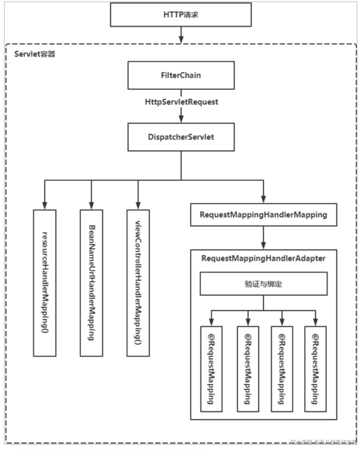
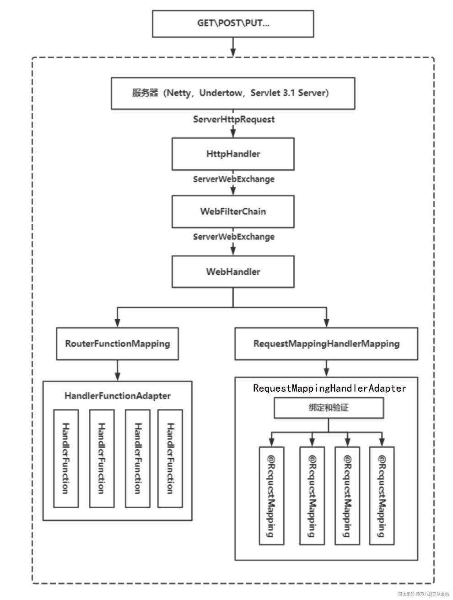
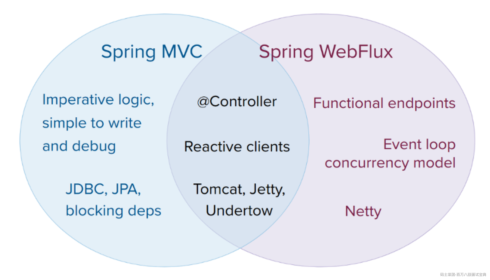
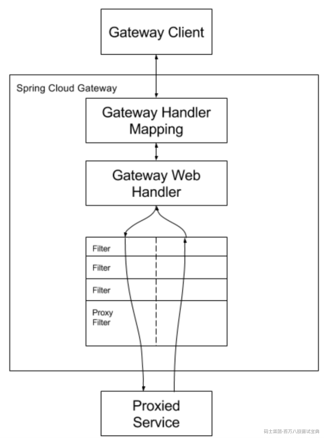

# Spring WebFlux高级实战

## 1、**WebFlux作为核心响应式服务器基础**

Spring 框架的整个基础设施都是围绕Servlet API 构建的，它们之间紧密耦合。

因此在开始深入响应式Web 之前，先回顾一下Web 模块的设计，看看它做了什么。



底层Servlet 容器负责处理容器内的所有映射Servlet。

DispatchServlet 作为一个集成点，用于集成灵活且高度可配置的Spring Web基础设施和繁重且复杂的Servlet API。

HandlerMapping将业务逻辑与Servlet API 分离。

Spring MVC的缺点：

1. 不允许在整个请求声明周期中出现非阻塞操作。没有开箱即用的非阻塞HTTP客户端。

2. WebMVC 抽象不能支持非阻塞 Servlet 3.1 的所有功能。

3. 对于非 Servlet 服务器，重用 Spring Web 功能变成模块不灵活。

因此，Spring团队在过去几年中的核心挑战，就是如何构建一个新的解决方案，以在使用基于注解

的编程模型的同时，提供异步非阻塞服务的所有优势。

### 1.1、响应式Web内核

Spring 框架的整个基础设施都是围绕Servlet API 构建的，它们之间紧密耦合。

响应式Web内核首先需要使用模拟接口和对请求进行处理的方法替换javax.servlet.Servlet.service 方法

更改相关的类和接口

增强和定制 Servlet API 对客户端请求和服务器响应的交互方式

```java
/**
* 请求的封装。
* 获取请求报文体的类型是Flux，表示具备响应式能力。
* DataBuffer是针对字节缓冲区的抽象，便于对特定服务器实现数据交换。
* 除了请求报文体，还有消息头、请求路径、cookie、查询参数等信息，可以在该接口或子接口中提
供。
*/
interface ServerHttpRequest {
    // 这个方法在：ReactiveHttpInputMessage中
    Flux<DataBuffer> getBody();
    // ...
}
```

```java
/**
 * 响应的封装。
 * writeWith方法接收的参数是Publisher，提供了响应式，并与特定响应式库解耦。
 * 返回值是Mono<Void>，表示向网络发送数据是一个异步的过程。
 * 即，只有当订阅Mono时才会执行发送数据的过程。
 * 接收服务器可以根据传输协议的流控支持背压。
 */
interface ServerHttpResponse {
    // ... 对应父类接口上ReactiveHttpOutputMessage
    Mono<Void> writeWith(Publisher<? extends DataBuffer> body);
    // ...
}
```

```java
/**
 * HTTP请求-响应的容器。
 * 这是高层接口，除了HTTP交互，还可以保存框架相关信息。
 * 如请求的已恢复的WebSession信息等。
 *
 *
 */
interface ServerWebExchange {
    // ...
    ServerHttpRequest getRequest();
    ServerHttpResponse getResponse();
    // ...
    Mono<WebSession> getSession();
// ...
}
```

上述三个接口类似于Servlet API 中的接口。

响应式接口旨在从交互模型的角度提供几乎相同的方法，同时提供开箱即用的响应式。

请求的处理程序和过滤器 API：

```java
/**
* 对应于WebMVC中的DispatcherServlet
* 查找请求的处理程序，使用视图解析器渲染视图，因此handle方法不需要返回任何结果。
*
* 返回值Mono<Void>提供了异步处理。
* 如果在指定的时间内没有信号出现，可以取消执行。
*/
interface WebHandler {
    Mono<Void> handle(ServerWebExchange exchange);
}
/**
* 过滤器链
*/
interface WebFilterChain {
    Mono<Void> filter(ServerWebExchange exchange);
}
/**
* 过滤器
*/
interface WebFilter {
    Mono<Void> filter(ServerWebExchange exchange, WebFilterChain chain);
}
```

以上是响应式Web应该具备的基础API。

还需要为这些接口适配不同的服务器。

即与ServerHttpRequest和ServerHttpResponse进行直接交互的组件。

同时负责ServerWebExchange的构建，特定的会话存储、本地化解析器等信息的保存

```java
public interface HttpHandler {
    Mono<Void> handle(ServerHttpRequest request, ServerHttpResponse response);
}
```

通过该适当的抽象，隐藏了服务器引擎的细节，具体服务器的工作方式对 Spring WebFlux 用户不重要。

### 1.2、 **响应式Web和MVC框架**

Spring Web MVC 模块的关键特性 **基于注解**。因此，需要为响应式Web 栈提供相同的概念。

重用 WebMVC 的基础设施，用 Flux 、 Mono 和 Publisher 等响应式类型替换同步通信。

保留与 Spring Web MVC 相同的 HandlerMapping 和 HandlerAdapter 链，使用基于 Reactor 的响应式交互替换实时命令：

```java
interface HandlerMapping {
    /*
    HandlerExecutionChain getHandler(HttpServletRequest request)
    */
    Mono<Object> getHandler(ServerWebExchange exchange);
}
```

```java
interface HandlerAdapter {
    boolean supports(Object handler);
    /*
    ModelAndView handle(HttpServletRequest request, HttpServletResponse response, Object handler);
    */
    Mono<HandlerResult> handle(ServerWebExchange exchange, Object handler);
}
```

响应式 HandlerMapping 中，两个方法整体上类似，

不同之处在于响应式返回Mono 类型支持响应式。

响应式HandlerAdapter 接口中，由于 ServerWebExchange 类同时组合了请求和响应，因此handle 方法的响应式版本更简洁。

该方法返回 HandlerResult 的 Mono 而不是 ModelAndView 。

遵循这些步骤，我们将得到一个响应式交互模型，而不会破坏整个执行层次结构，从而可以保留现有设计并能以最小的更改重用现有代码。

最后设计：



1. 传入请求，由底层服务器引擎处理。服务器引擎列表不限于基于ServletAPI 的服务器。每个服务器引擎都有自己的响应式适配器，将 HTTP 请求和 HTTP 响应的内部表示映射到ServerHttpRequest 和 ServerHttpResponse 。

2. HttpHandler 阶段，该阶段将给定的 ServerHttpRequest 、 ServerHttpResponse 、用户Session 和相关信息组合到 ServerWebExchage 实例中。

3. WebFilterChain 阶段，它将定义的 WebFilter 组合到链中。然后， WebFilterChain 会负责执行此链中每个 WebFilter 实例的 WebFilter#filter 方法，以过滤传入的ServerWebExchange 。

4. 如果满足所有过滤条件， WebFilterChain 将调用 WebHandler 实例。

5. 查找 HandlerMapping 实例并调用第一个合适的实例。可以是RouterFunctionMapping、也可以是RequestMappingHandlerMapping 。RouterFunctionMapping，引入到WebFlux 之中，超越了纯粹的功能请求处理。

6. 阶段，与以前功能相同，使用响应式流来构建响应式流。

在WebFlux 模块中，默认服务器引擎是Netty。

Netty 服务器很适合作为默认服务器，因为它广泛用于响应式领域。

该服务器引擎还同时提供客户端和服务器

**异步非阻塞交互**。

同时，可以灵活地选择服务器引擎。

WebFlux 模块对应了Spring Web MVC 模块的体系结构，很容易理解。

### 1.3、基于WebFlux的纯函数式Web

纯函数式Web主要是函数式路由映射。

通过函数式映射，可以生成轻量级应用。

示例如下：

增加依赖

```plain
<?xml version="1.0" encoding="UTF-8"?>
<project xmlns="http://maven.apache.org/POM/4.0.0"
         xmlns:xsi="http://www.w3.org/2001/XMLSchema-instance"
         xsi:schemaLocation="http://maven.apache.org/POM/4.0.0 http://maven.apache.org/xsd/maven-4.0.0.xsd">
    <modelVersion>4.0.0</modelVersion>

    <parent>
        <artifactId>spring-boot-starter-parent</artifactId>

        <groupId>org.springframework.boot</groupId>

        <version>2.7.3</version>

        <relativePath/>
    </parent>

    <groupId>com.msb</groupId>

    <artifactId>msb-vip-webFlux.4.1.3</artifactId>

    <version>1.0-SNAPSHOT</version>

    <properties>
        <maven.compiler.source>8</maven.compiler.source>

        <maven.compiler.target>8</maven.compiler.target>

    </properties>

    <dependencies>
        <dependency>
            <groupId>org.springframework.boot</groupId>

            <artifactId>spring-boot-starter-webflux</artifactId>

        </dependency>

        <dependency>
            <groupId>org.projectlombok</groupId>

            <artifactId>lombok</artifactId>

        </dependency>

        <dependency>
            <groupId>org.springframework.security</groupId>

            <artifactId>spring-security-crypto</artifactId>

        </dependency>

    </dependencies>

</project>

```

创建实体

```plain
@Data
@AllArgsConstructor
@NoArgsConstructor
public class Order {
    private String id;
}

```

增加handler

```plain
package com.msb.handler;

import com.msb.bean.Order;
import org.springframework.stereotype.Service;
import org.springframework.web.reactive.function.server.ServerRequest;
import org.springframework.web.reactive.function.server.ServerResponse;
import reactor.core.publisher.Mono;

import java.net.URI;
import java.util.HashMap;
import java.util.Map;
import java.util.stream.Collectors;

@Service
public class OrderHandler {
    private Map<String, Order> orderMap = new HashMap<>();

    /**
     * 创建订单
     * @param serverRequest
     * @return
     */
    public Mono<ServerResponse> create (ServerRequest serverRequest){
        return  serverRequest.bodyToMono(Order.class)
                .doOnNext(order ->{
                    orderMap.put(order.getId(),order);
                })
                .flatMap(order -> ServerResponse.created(URI.create("/order/" + order.getId())).build());

    }

    /**
     * 获取订单信息
     * @param request
     * @return
     */
    public Mono<ServerResponse> get(ServerRequest request){
        String id = request.pathVariable("id");
        Order order1 = orderMap.get(id);
        return Mono.just(order1)
                .flatMap(order -> ServerResponse.ok().syncBody(order)).switchIfEmpty(ServerResponse.notFound().build());
    }

    /**
     * 获取订单列表
     * @param request
     * @return
     */
    public Mono<ServerResponse> list(ServerRequest request){
        return Mono.just(orderMap.values().stream().collect(Collectors.toList()))
                .flatMap(order -> ServerResponse.ok().syncBody(order))
                .switchIfEmpty(ServerResponse.notFound().build());

    }

}

```

配置路由

```plain
package com.msb;

import com.msb.handler.OrderHandler;
import org.springframework.boot.SpringApplication;
import org.springframework.boot.autoconfigure.SpringBootApplication;
import org.springframework.context.annotation.Bean;
import org.springframework.http.HttpMethod;
import org.springframework.http.MediaType;
import org.springframework.web.reactive.function.server.RouterFunction;
import org.springframework.web.reactive.function.server.ServerResponse;

import static org.springframework.web.reactive.function.server.RequestPredicates.*;
import static org.springframework.web.reactive.function.server.RouterFunctions.nest;
import static org.springframework.web.reactive.function.server.RouterFunctions.route;

@SpringBootApplication
public class WebFluxApplication {
    public static void main(String[] args) {
        SpringApplication.run(WebFluxApplication.class);
    }

    @Bean
    public RouterFunction<ServerResponse> routes(OrderHandler orderHandler){
        // 包含两个参数： 1、测试条件是否通过 如果通过则路由到第二个参数指定的路由函数
        return nest(
                // 判断请求路径是否匹配指定的前缀
                path("/orders"),
                //如果匹配成功，则路由到这个函数
                nest(accept(MediaType.APPLICATION_JSON),// 判断请求报文头字段accept是否匹配APPLICATION_JSON
                        // 如果匹配则路由到下面的路由函数 ，将/orders/{id} 路由到handler的get
                        route(GET("/{id}"),orderHandler::get))
                        // 如果get请求 /orders ，则路由到orderhandler.list
                        .andRoute(method(HttpMethod.GET),orderHandler::list)
                        // 如果contentType匹配，并路径匹配orders,则路由到这个函数

                        .andNest(contentType(MediaType.APPLICATION_JSON),
                                //如果是POST请求/orders，则路由到handler的create方法
                                route(POST("/"),orderHandler::create)));
    }
}

```

create 方法接收ServerRequest（函数式路由请求类型）。

ServerRequest可以将请求体手动映射到Mono 或Flux。该API 还可以指定请求体应映射的类。

最后，WebFlux 中的函数式附加功能提供了一个API，使用ServerResponse 类的流式API 构建响应。

我们可以看到，除函数式路由声明的API 之外，我们还有一个用于请求和响应处理的函数式API。

同时，函数式Web 框架允许在不启动整个Spring 基础设施的情况下构建Web 应用程序。

如下案例：

```plain

import com.fasterxml.jackson.annotation.JsonProperty;
import lombok.Data;

@Data
public class PassswordDTO {
    private String raw;
    private String secured;

    public PassswordDTO(@JsonProperty("raw") String raw,@JsonProperty("secured") String secured){
        this.raw = raw;
        this.secured = secured;
    }

}

```

```plain
package com.msb;

import com.msb.bean.PassswordDTO;
import org.slf4j.Logger;
import org.slf4j.LoggerFactory;
import org.springframework.http.HttpStatus;
import org.springframework.http.server.reactive.HttpHandler;
import org.springframework.http.server.reactive.ReactorHttpHandlerAdapter;
import org.springframework.security.crypto.bcrypt.BCryptPasswordEncoder;
import org.springframework.web.reactive.function.server.RouterFunction;
import org.springframework.web.reactive.function.server.RouterFunctions;
import org.springframework.web.reactive.function.server.ServerResponse;
import reactor.netty.DisposableServer;
import reactor.netty.http.server.HttpServer;

import static org.springframework.web.reactive.function.server.RequestPredicates.POST;
import static org.springframework.web.reactive.function.server.RouterFunctions.route;

public class StandaloneApplication {
    static Logger LOGGER = LoggerFactory.getLogger(StandaloneApplication.class);
    public static void main(String[] args) {
        long start = System.currentTimeMillis();
        // 调用Routes方法，然后将RouteFunction转化为HttpHandler
       HttpHandler handler =  RouterFunctions.toHttpHandler(routes(
                // BCryt算法进行18次三列， 这里需要耗时几秒
           new BCryptPasswordEncoder(18)
        ));
       // 内置HttpHandler适配器
        ReactorHttpHandlerAdapter reactorAdapter = new ReactorHttpHandlerAdapter(handler);
        // 创建HTTPServer实例，它是ReatorNettyAPI一部分
        DisposableServer server = HttpServer.create()
                .host("localhost")
                .port(8080) // 配置端口
                .handle(reactorAdapter)  // 指定handler
                .bindNow();// 调用bindNow 启动服务
        LOGGER.info("started in" + (System.currentTimeMillis() - start) + "ms");
        // 为了是使应用程序保持活动状态，阻塞Thread,并监听服务器处理事件
        server.onDispose().block();
    }

    private static RouterFunction<?> routes(BCryptPasswordEncoder passwordEncoder) {
        return
                //匹配请求POST 并且路径是password
                route(POST("password"),
                        reqeust -> reqeust
                                .bodyToMono(PassswordDTO.class)
                                .doOnNext(System.out::println)
                                // BCryptPasswordEncoder检查已加密的原始密码，加密密码
                                .map(p -> passwordEncoder.matches(p.getRaw(),p.getSecured()))
                                // 如果秘密匹配成功过 则OK
                                // 否则EXPECTATION_FAILED
                                .flatMap(isMatched -> isMatched ? ServerResponse.ok().build():
                                        ServerResponse.status(HttpStatus.EXPECTATION_FAILED).build()));
    }
}

```

通过切换到函数式路由声明，

1. 可以在一个位置维护所有路由配置，并使用响应式方法对传入请求进行处理。

2. 在访问传入的请求参数、路径变量和请求的其他重要组件方面，函数式路由的灵活性与基于注解的常规方法几乎相同。

3. 函数式路由不但能避免运行整个Spring 框架基础设施，并且在路由设置方面同样灵活，让应用程序的启动更快。

### 1.4 **基于WebClient的非阻塞跨服务通信**

从本质上讲， WebClient 是旧 RestTemplate 的响应式替代品。

WebClient 中有一个函数式API，并提供内置的到 Project Reactor 类型（如 Flux 或 Mono ）的映射。

以下示例

```java
// 创建的时候指定基础URI
WebClient.create("http://localhost/api")
     // 指定请求方法：GET
     .get()
     // 指定相对URI，并对URI变量进行扩展
     // 还可以指定消息头、cookie 和请求主体。
     .uri("/users/{id}", userId)
     // 指定结果的处理方式
     .retrieve()
     // 将响应体进行反序列化
     .bodyToMono(User.class)
     // 进行其他操作
     .map(...)
     // 订阅触发异步执行，发起远程调用。这里只使用了订阅的副作用。
     .subscribe();
```

> WebClient 遵循响应式流规范中描述的行为。
>
> 只有通过 subscribe 方法， WebClient 才会建立连接并开始发送数据到远程服务器。

构建一个对密码检查服务的调用，并使用WebClient API以自定义方式处理响应状态：

### 1.5 响应式模板引擎

**Spring 5.x 和 WebFlux 模块**已经放弃支持包括Apache Velocity 在内的许多技术。

Spring WebFlux 与 Web MVC 拥有相同的视图渲染技术。

以下示例展示了一种指定渲染视图的常用方法：

```plain
@RequestMapping("/")
public String index() {
    // 返回一个字符串，作为逻辑视图名
return "index";
}
```

**模板渲染过程中如何支持响应式方法？**

**考虑一个涉及渲染大型音乐播放列表的案例:**

```plain
<dependency>
    <groupId>org.springframework.boot</groupId>

    <artifactId>spring-boot-starter-freemarker</artifactId>

</dependency>

<dependency>
    <groupId>org.springframework.boot</groupId>

    <artifactId>spring-boot-starter-webflux</artifactId>

</dependency>

<dependency>
    <groupId>org.projectlombok</groupId>

    <artifactId>lombok</artifactId>

    <optional>true</optional>

</dependency>

<dependency>
    <groupId>org.springframework.boot</groupId>

    <artifactId>spring-boot-starter-test</artifactId>

    <scope>test</scope>

</dependency>

<dependency>
    <groupId>io.projectreactor</groupId>

    <artifactId>reactor-test</artifactId>

    <scope>test</scope>

</dependency>

```

```plain
 @RequestMapping("/play-list-view-ftl")
    public Mono<String> getPlaylist(final Model model) {
        List<Song> songs = new ArrayList<>();
        // 一般是异步从数据源中获取数据
        Song song = null;
        for (int i = 0; i < 5; i++) {
            song = new Song("曲目" + i, "张三" + i, "1001" + i, "专辑1" + (i %
                    3));
            songs.add(song);
        }
        // 转化为响应式流
        final Flux<Song> playlistStream = Flux.fromIterable(songs);
        // 渲染数据
        return playlistStream
            // 收到集合里面去,这里不是异步
                .collectList()
                // 放到模型里面去
                .doOnNext(list -> model.addAttribute("playList", list))
            // 返回一个逻辑视图名
                .then(Mono.just("/freemarker/play-list-view"));
    }
```

```plain
@Getter
@AllArgsConstructor
public class Song {

    private String id;
    private String name;
    private String artist;
    private String album;

}
```

**正如上述示例中所示，使用了一个响应式类型 Mono** ，以便异步返回视图名称。另外，我们的模板有一个占位符dataSource，它应该由给定Song 的列表填充。

提供特定于上下文数据的常用方法是定义Model，并在其中放置所需的属性。

**FreeMarker** **不支持****数据的**响应式呈现和非阻塞呈现，必须将所有歌曲收集到列表中并将收集的数据全部放入Model 中。

src/main/resources/templates/freemarker/play-list-view.ftl：

```plain
<!DOCTYPE html>
<html>
<body>
<head>
    <meta charset="UTF-8"/>
    <title>曲目列表-freemarker</title>

</head>

<table border="1">
    <thead>
    </thead>

    <tbody>
    <#list playList as e>
        <tr>
            <td>${e.id}</td>

            <td>${e.name}</td>

            <td>${e.artist}</td>

            <td>${e.album}</td>

        </tr>

    </#list>

    </tbody>

</table>

</body>

</html>

```

**src/main/java/com/webflux/demo/config/WebConfig.java：**

```plain
@Configuration
@EnableWebFlux
public class MyConfig implements WebFluxConfigurer {

    @Override
    public void configureViewResolvers(ViewResolverRegistry registry) {
        // 注册FreeMakrerViewResolver这样一个模板
        registry.freeMarker();
    }

    @Bean
    public FreeMarkerConfigurer freeMarkerConfigurer() {
        // 设置配置器
        final FreeMarkerConfigurer configurer = new FreeMarkerConfigurer();
        // 设置模板路径
        configurer.setTemplateLoaderPath("classpath:/templates");
        return configurer;
    }
}

```

Thymeleaf

渲染这些模板是一项CPU 密集型操作。

如果我们有一个庞大的数据集，执行该操作可能需要一些时间和内存。

Thymeleaf 支持响应式WebFlux，并为异步和流模板渲染提供更多可能性。

Thymeleaf 提供与FreeMarker 类似的功能，并允许编写相同的代码来呈现UI。

Thymeleaf 能够将响应式类型用作模板内的数据源，并在流中的新元素可用时呈现模板的一部分。

以下示例展示了在处理请求期间如何将响应式流与Thymeleaf 一起使用：

```plain
<dependency>
    <groupId>org.springframework.boot</groupId>

    <artifactId>spring-boot-starter-thymeleaf</artifactId>

</dependency>

<dependency>
    <groupId>org.springframework.boot</groupId>

    <artifactId>spring-boot-starter-webflux</artifactId>

</dependency>

<dependency>
    <groupId>org.projectlombok</groupId>

    <artifactId>lombok</artifactId>

    <optional>true</optional>

</dependency>

```

```plain
<!DOCTYPE html>
<html xmlns:th="http://www.thymeleaf.org">
<body>
<head>
 <meta charset="UTF-8"/>
 <title>曲目列表</title>

</head>

<table border="1">
 <thead>
 </thead>

 <tbody>
 <tr th:each="e : ${playList}">
     <td th:text="${e.id}">...</td>

     <td th:text="${e.name}">...</td>

     <td th:text="${e.artist}">...</td>

     <td th:text="${e.album}">...</td>

 </tr>

 </tbody>

</table>

</body>

</html>

```

生成一个表，带有一些表头和一个正文。该表是由 Song 条目的 playList 和它们的信息构成的行所填充的。

Thymeleaf 的渲染引擎开始将数据流传输到客户端，而不必等待最后一个元素被发射。

它支持渲染无限的元素流。这可以通过添加对 Transfer-Encoding:chunked 的支持来实现。

Thymeleaf 不会渲染内存中的整个模板，而会首先渲染可用的部分，然后在新元素可用时以块的形式异步发送模板的其余部分。

```plain
@Controller
public class PlayListController {

    @RequestMapping("/play-list-view-thy")
    public String getPlayList(Model model) {
        List<Song> songs = new ArrayList<>();
        Song song = null;
        for (int i = 0; i < 1000; i++) {
            song = new Song(i, "张三" + i, "1001" + i, "专辑1" + (i % 3));
            songs.add(song);
        }
        final Flux<Song> playlistStream = Flux.fromIterable(songs)
                .delayElements(Duration.ofMillis(500));
        model.addAttribute(
                "playList",
                new ReactiveDataDriverContextVariable(playlistStream, 1, 1)
        );
        return "play-list-view";
    }

}
```

```plain
@AllArgsConstructor
@Getter
public class Song {
    private Integer id;
    private String name;
    private String artist;
    private String album;
}
```

### 1.6 Spring Web Flux和Spring Web MVC对比

使用Spring MVC还是WebFlux？

Spring MVC和Spring WebFlux并不是分立的。它们都扩展了开发的可用选项。

两者设计的目标就是彼此的连续性和一致性，可以一起使用，发挥各自优势。

下图展示了两者的联系和区别：



具体如何使用，考虑如下：

- 如果现存的项目是基于Spring MVC的并且没有问题，就别更改了。命令式编程开发、阅读、debug都是最简单的。同时可选择的库也很多，只不过大多数都是阻塞式的。

- 如果项目的技术栈是非阻塞的，则使用WebFlux可以使用与环境相同的模型来执行，WebFlux也提供了服务器的选项（Netty、Tomcat、Jetty、Undertow以及Servlet 3.1及以上的容器），提供了编程模型的选项（基于注解的控制器和函数式web端点），以及响应式库的选项（Reactor、RxJava以及其他的）。

- 如果希望发挥java8 lambda或Kotlin的优势，使用轻量级、函数式的web框架，则可以使用Spring WebFlux函数式web端点的编程模型。Spring WebFlux非常适合小型的应用或没有复杂需求的微服务。

- 在微服务架构中，可以同时使用Spring WebFlux和Spring MVC，或者将Spring WebFlux作为函数式端点来使用。由于它们基于相同的注解编程模型，可以很方便的做到在正确的场合使用正确的工具。

- 一个简单的评估应用的方式是检查应用的依赖。如果使用的是阻塞式的持久化API（JPA，JDBC）或者阻塞式的网络API，Spring MVC基本上是最好的选择。技术上Reactor和RxJava也可以使用分立的线程支持阻塞式的操作，但无法发挥非阻塞web技术栈的全部优势。

- 如果Spring MVC应用需要调用远程服务，可以使用响应式的 WebClient 。可以让Spring MVC控制器的方法直接返回响应式类型（Reactor、RxJava或其他的）数据。每个远程调用的延迟越大，各个远程调用之间的依赖越大，响应式模型的优势发挥的越明显。当然，Spring MVC的控制器也可以调用其他响应式组件。

- 如果开发团队很大，就要考虑到转向非阻塞、函数式、声明式编程模型的陡峭的学习曲线。最佳实践是先使用响应式 WebClient 做部分转向。然后在小的模块中使用并评估响应式模型带来的优势。一般对于整个项目，没必要全部转向响应式模型。如果不确定响应式编程带来的优势，可以先学习一下非阻塞I/O的工作流程（例如单线程Node.js的并发）以及效果。

## 2、WebFlux的应用

### 2.1 基于微服务的系统

WebFlux 的第一个应用是微服务系统。

微服务系统最显著的特点是**大量的I/O** **通信**。

I/O 的存在，尤其是阻塞式I/O，会降低整体系统延迟和吞吐量。

**Spring Cloud Gateway**

```plain
Spring Cloud Gateway 是 Spring 官方基于 Spring 5.0，Spring Boot 2.0 和 Project Reactor 等技术开发的网关，Spring Cloud Gateway 旨在为微服务架构提供一种简单而有效的统一的 API 路由管理方式。
```

**Spring Cloud Gateway** **作为** **Spring Cloud** **生态系中的网关，目标是替代** **Netflix ZUUL**，其不仅提供统一的路由方

式，并且基于 Filter 链的方式提供了网关基本的功能，例如：安全，监控/埋点，和限流等。

**Spring Cloud Gateway** **功能特征**

- 基于 Spring Framework 5，Project Reactor 和 Spring Boot 2.0

- 动态路由

- Predicates 和 Filters 作用于特定路由

- 集成 Hystrix 断路器

- 集成 Spring Cloud DiscoveryClient

- 易于编写的 Predicates 和 Filters

- 限流

- 路径重写

**Spring Cloud Gateway** **工程流程**



```plain
客户端向 Spring Cloud Gateway 发出请求。然后在 Gateway Handler Mapping 中找到与请求相匹配的路由，将其发送到 Gateway Web Handler。Handler 再通过指定的过滤器链来将请求发送到实际服务执行业务逻辑，然后返回。
```

```plain
过滤器之间用虚线分开是因为过滤器可能会在发送代理请求之前（ pre ）或之后（ post ）执行业务逻辑。
```

### 2.2 大文件上传

```plain
<dependency>
    <groupId>org.springframework.boot</groupId>

    <artifactId>spring-boot-starter-webflux</artifactId>

</dependency>

```

src/main/resources/static/index.html：

```html
<!DOCTYPE html>
<html lang="en">
<head>
    <meta charset="UTF-8">
    <title>文件上传</title>

</head>

<body>
<form action="/single" method="post" enctype="multipart/form-data">
    <input type="file" name="file">
    <input type="submit" value="上传单个文件">
</form>

<hr>
<form action="/multi" method="post" enctype="multipart/form-data">
    <input type="file" name="file">
    <input type="file" name="file">
    <input type="file" name="file">
    <input type="file" name="file">
    <input type="submit" value="上传多个文件">
</form>

</body>

</html>

```

```plain

@RestController
public class FileController {
    @RequestMapping("/single")
    public Mono<String> singleFile(@RequestPart("file")Mono<FilePart> file){
        return file.map(filePart -> {
            Path tempFile = null;
            try {
                 tempFile = Files.createTempFile("file-", filePart.filename());
            } catch (IOException e) {
                e.printStackTrace();
            }
            System.out.println("文件路径：" + tempFile.toAbsolutePath());
            //异步文件channel
            AsynchronousFileChannel channel = null;
            try {
                //打开指定文件写操作channel
                channel = AsynchronousFileChannel.open(tempFile, StandardOpenOption.WRITE);
            } catch (IOException e) {
                e.printStackTrace();
            }

            DataBufferUtils.write(filePart.content(),channel,0)
                    .doOnNext(System.out::println)
                    .doOnComplete(()->{
                        System.out.println("文件拷贝完成");
                    }).subscribe();
            // 封装了我们的文件信息
            return tempFile;
        }).map(tmp -> tmp.toFile())
                .flatMap(fileSingle -> file.map(FilePart::filename));
    }

    @RequestMapping("/multi")
    public Mono<List<String>> multiFiles(@RequestPart("file") Flux<FilePart> filePartFlux){
        return filePartFlux.map(filePart -> {
            Path tempFile = null;
            try {
                 tempFile = Files.createTempFile("mfile-", filePart.filename());
            } catch (IOException e) {
                e.printStackTrace();
            }
            System.out.println("文件路径：" + tempFile.toAbsolutePath());
            // 底层用的是一个零拷贝
            filePart.transferTo(tempFile.toFile());
            return tempFile;
        }).map(file -> file.toFile())
                .flatMap(fileSingle ->filePartFlux.map(FilePart::filename)).collectList();
    }
}
```

## 3、Spring WebFlux数据库访问

响应式关系型数据库连接（Reactive Relational Database Connectivity，**R2DBC**）是一项探索完全响应式数据库 API 的倡议。

Spring Data 团队领导 R2DBC 倡议，并使用它在响应式应用程序内的响应式数据访问环境中探测和验证想法。

R2DBC 在 Spring OnePlatform 2018 会议上被公开，其目标是定义具有**背压支持的响应式数据库**访问API。Spring Data 团队在响应式 NoSQL 持久化方面获得了一些先进经验，因此决定提出对真正响应式语言级数据访问 API的愿景。

R2DBC 项目包括以下部分。

- R2DBC 服务提供程序接口（Service Provider Interface，SPI）定义了实现驱动程序的简约API，便于彻底减少驱动程序实现者必须遵守的 API。SPI 不适合在应用程序代码中直接使用，需要专用的客户端库。

- R2DBC 客户端提供了人性化的 API 和帮助类，可将用户请求转换为 SPI 级别。R2DBC 客户端对R2DBC SPI 的作用与 Jdbi 库对 JDBC 的作用相同。

### 3.1 Spring Data R2DBC集成MySQL

**引入依赖**

```plain
<dependency>
    <groupId>org.springframework.boot</groupId>

    <artifactId>spring-boot-starter-data-r2dbc</artifactId>

</dependency>

<dependency>
    <groupId>org.springframework.boot</groupId>

    <artifactId>spring-boot-starter-webflux</artifactId>

</dependency>

<dependency>
    <groupId>dev.miku</groupId>

    <artifactId>r2dbc-mysql</artifactId>

    <scope>runtime</scope>

</dependency>

<dependency>
    <groupId>mysql</groupId>

    <artifactId>mysql-connector-java</artifactId>

    <scope>runtime</scope>

</dependency>

<dependency>
    <groupId>org.projectlombok</groupId>

    <artifactId>lombok</artifactId>

    <optional>true</optional>

</dependency>

```

**创建数据库spring\_r2dbc，执行如下SQL：**

```plain
CREATE DATABASE `spring_r2dbc`;
```

```plain
CREATE TABLE `student` (
`id` int(11) AUTO_INCREMENT,
`code` varchar(50) NOT NULL,
`name` varchar(50) NOT NULL,
`gender` char(1) NOT NULL,
`birthday` date NOT NULL,
`address` varchar(300) NULL,
`remark` varchar(1000) NULL,
`active` tinyint NOT NULL DEFAULT 1,
`createdAt` datetime(0) NOT NULL DEFAULT CURRENT_TIMESTAMP(0),
`createdBy` varchar(50) NOT NULL,
`updatedAt` datetime(0) NOT NULL DEFAULT CURRENT_TIMESTAMP(0) ON UPDATE
CURRENT_TIMESTAMP(0),
`updatedBy` varchar(50) NOT NULL,
PRIMARY KEY (`id`),
UNIQUE INDEX `idx_main`(`code`)
);
```

**添加数据**

```plain
INSERT INTO student ( CODE, NAME, gender, birthday, address, createdBy, updatedBy )
VALUES
( 'S0001', 'Tom', 'M', '2022-03-05', NULL, 'TEST', 'TEST' ),
( 'S0002', 'Ted', 'M', '2022-06-12', NULL, 'TEST', 'TEST' ),
( 'S0003', 'Mary', 'F', '2022--9-12', 'Chicago', 'TEST', 'TEST' );
```

**配置数据源**

**修改配置文件 application.yml，加入以下配置：**

```plain
spring:
  r2dbc:
    url: r2dbc:mysql://localhost:3306/spring_r2dbc?serverTimezone=Asia/Shanghai
    username: root
    password: 123456
```

```plain
@RestController
@RequestMapping("/api/students")
public class StudentController {
    private final StudentRepository studentRepository;

    public StudentController(StudentRepository studentRepository) {
        this.studentRepository = studentRepository;
    }

    @GetMapping
    public Flux<Student> index() {
        return studentRepository.findAll();
    }
}
```

**创建实体类**

**代码如下：**

```plain
@Data
public class Student {
    @Id
    private Long id;

    private String code;
    private String name;
    private String gender;
    private LocalDate birthday;
    private String address;

    private String remark;
    private boolean active;

    private LocalDateTime createdAt;
    private String createdBy;

    private LocalDateTime updatedAt;
    private String updatedBy;
}
```

**创建仓库类**

**Spring Data R2DBC 基本沿用了Spring Data JPA的概念，但是功能上没有 JPA 那么强大。**

**代码如下：**

```plain
@Repository
public interface StudentRepository extends ReactiveCrudRepository<Student, Long> {
}
```

**创建控制器**

**代码如下：**

```plain
import reactor.core.publisher.Flux;

@RestController
@RequestMapping("/api/students")
public class StudentController {
    private final StudentRepository studentRepository;
    public StudentController (StudentRepository studentRepository){
        this.studentRepository = studentRepository;
    }

    @GetMapping
    public Flux<Student> index(){
        return studentRepository.findAll();
    }
}
```

**启动并访问**

**使用**<http://localhost:8080/students>访问接口。

### 3.2 Spring Web Flux集成Redis

- **引入依赖：**

```plain
<dependency>
    <groupId>org.springframework.boot</groupId>

    <artifactId>spring-boot-starter-data-redis-reactive</artifactId>

</dependency>

<dependency>
    <groupId>org.springframework.boot</groupId>

    <artifactId>spring-boot-starter-webflux</artifactId>

</dependency>

<dependency>
    <groupId>org.projectlombok</groupId>

    <artifactId>lombok</artifactId>

    <optional>true</optional>

</dependency>

```

- **yml配置**

```plain
spring:
  redis:
    host: 110.40.198.77
    port: 6379
    timeout: 5000
```

- **config配置**

```plain
@Configuration
@EnableCaching
public class MyRedisConfig extends CachingConfigurerSupport {

    @Bean
    public ReactiveRedisTemplate<String, Object> reactiveRedisTemplate(ReactiveRedisConnectionFactory factory) {

        RedisSerializer serializer = new StringRedisSerializer();
        GenericJackson2JsonRedisSerializer valueSerializer = new GenericJackson2JsonRedisSerializer();

        RedisSerializationContext<String, Object> context = RedisSerializationContext.newSerializationContext()
                .key(serializer)
                .value(valueSerializer)
                .hashKey(serializer)
                .hashValue(valueSerializer).build();

        ReactiveRedisTemplate<String, Object> reactiveRedisTemplate = new ReactiveRedisTemplate<String, Object>(factory, context);
        return reactiveRedisTemplate;
    }
}
```

- **实体**

```plain
@Data
public class City implements Serializable {

    private static final long serialVersionUID = -1L;

    // 城市编号
    @Id
    private Long id;

    // 省份编号
    private Long provinceId;

    // 城市名称
    private String cityName;

    // 描述
    private String description;
}
```

- **controller**

```plain
@RestController
@RequestMapping("/city")
public class ReactiveCityController {
    @Autowired
    private ReactiveRedisTemplate reactiveRedisTemplate;

    @GetMapping(value = "/{id}")
    public Mono<City> findCityById(@PathVariable("id") Long id) {
        String key = "city_" + id;
        ReactiveValueOperations<String, City> operations = reactiveRedisTemplate.opsForValue();
        Mono<City> city = operations.get(key);
        return city;
    }

    @PostMapping
    public Mono<City> saveCity(@RequestBody City city) {
        return reactiveRedisTemplate.opsForValue()
                .getAndSet("city_" + city.getId(), city);
    }

    @DeleteMapping(value = "/{id}")
    public Mono<Long> deleteCity(@PathVariable("id") Long id) {
        String key = "city_" + id;
        return reactiveRedisTemplate.delete(key);
    }

}
```

## 4、 **使用StepVerifier测试响应式流**

```plain
出于测试目的，Reactor 提供了额外的 reactor-test 模块，该模块提供了 StepVerifier。StepVerifier 提供了一个流式 API，用于为任何 Publisher 构建验证流程。
```

### 4.1 **StepVerifier要点**

验证 Publisher 主要有两种方法。第一种是 StepVerifier.&#x3c;T>create(Publisher&#x3c;T> source)。使用此技术构建的测试如下所示

```java
StepVerifier
        .create(Flux.just("foo", "bar"))
        .expectSubscription()
        .expectNext("foo")
        .expectNext("bar")
        .expectComplete()
        .verify();
```

在此示例中，Publisher 应生成两个特定元素，后续操作将验证特定元素是否已传递给最终订阅者

该类提供的构建器技术可以

**定义验证过程中事件发生的顺序**。

根据前面的代码，第一个发出的事件必须是与订阅相关的事件，紧跟其后的事件必须是 foo 和bar 字符串。

最后， StepVerifier#expectCompletion 定义终止信号的存在。

在此例中，必须是 Subscriber#onComplete 的调用，或者成功完成给定的 Flux。

要执行验证，或者说对创建流进行订阅，就必须调用 .verify() 方法。

verify() 是一个阻塞调用，它阻塞执行，直到流发出所有预期的事件。

通过使用这种简单的技术，可以使用可计数的元素和事件来验证 Publisher。但是，用大量元素来验证流程是很困难的。

如果检查的是

**该发布者已发出元素是否达到特定数量**，可以使用 .expectNextCount() 。

如下代码：

```java
    StepVerifier
            // .create(Flux.range(0, 101))
            .create(Flux.range(0, 100))
            // .create(Flux.range(0, 99))
            .expectSubscription()
            .expectNext(0) // 期望下一个元素与指定的相等
            .expectNextCount(98) // 从上个期望或从开始订阅开始，期望收到指定个数的元素
            .expectNext(99) // 期望下一个元素与指定的相等
            .expectComplete() // 期望收到onComplete信号
            .verify(); // 阻塞验证
}
```

尽管 .expectNextCount() 方法解决了一部分问题，但在某些情况下，仅仅检查发出元素的数量是不够的

例如，在

**验证负责按特定规则过滤或选择元素的代码**时，检查所有发出的项**是否与过滤规则匹配**非常重要。

为此，StepVerifier 可以使用 Java Hamcrest 等工具立即记录发出的数据及其验证。

如下代码：

```java
   Publisher<Wallet> usersWallets = findAllUsersWallets();
        StepVerifier.create(usersWallets)
                .expectSubscription()
                .recordWith(ArrayList::new)
                .expectNextCount(1)
                .consumeRecordedWith(
                        wallets -> assertThat(
                                wallets,
                                everyItem(hasProperty("owner", equalTo("admin")))
                        )
                )
                .expectComplete()
                .verify();
```

与前面的示例相反，每个期望仅涵盖一个元素或指定数量元素的验证， .consumeRecordedWith()可以验证给定 Publisher 发布的所有元素。应该注意的是 .consumeRecordedWith() 只有在指定了.recordWith() 时才有效。反过来，我们应该仔细定义存储记录的集合类。对于多线程发布者而言，用于记录事件的集合类型应该支持并发访问，因此在这些情况下，最好使用

.recordWith(ConcurrentLinkedQueue :: new) 而不是 .recordWith(ArrayList :: new) ，因为与 ArrayList 相比，ConcurrentLinkedQueue 是线程安全的。

除此之外，还有其他功能相似的方法。例如，对下一个元素的期望的定义，如以下代码所示：

```java
StepVerifier
        .create(Flux.just("alpha-foo", "betta-bar"))
        .expectSubscription()
        .expectNextMatches(e -> e.startsWith("alpha"))
        .expectNextMatches(e -> e.startsWith("betta"))
        .expectComplete()
        .verify();
```

expectNextMatches() 和 .expectNext() 之间的唯一区别是，前者可以定义自定义的匹配器Predicate ，这使其比后者更灵活。这是因为 .expectNext() 基于元素之间的比较，而这种比较使用元素的 .equals() 方法

类似地， .assertNext() 和 .consumeNextWith() 使编写自定义断言成为可能。要注意， .assertNext() 是 .consumeNextWith() 的别名。 .expectNextMatches() 和.assertNext() 之间的区别在于前者接受 Predicate，必须返回 true 或 false，而后者接收可能抛出异常的Consumer，并且捕获消费者抛出的任何 AssertionError，然后通过 .verify() 方法抛出。

如下面的代码所示：

```java
 StepVerifier
     .create(findUsersUSDWallet())
     .expectSubscription()
     .assertNext(wallet -> assertThat(wallet, hasProperty("currency",
                                                          equalTo("USD")))
                ).expectComplete().verify();
```

最后，只剩下未覆盖的错误情况，这也是正常系统生命周期的一部分。可以检查错误信号的API 方法不是很多，最简单的是 .expectError() 方法，该方法没有参数。

如以下代码所示：

```java
StepVerifier.create(Flux.error(new RuntimeException("Error")))
.expectError()
.verify();
```

在某些情况下，测试特定错误类型至关重要。例如，如果用户在登录期间输入了错误的凭据，则安全服务应发出 BadCredentialsException.class 。为了验证发出的错误，我们可以使用.expectError(Class&#x3c;? extends Throwable>)

如以下代码所示：

```java
StepVerifier.create(securityService.login("admin", "wrong"))
.expectSubscription()
.expectError(BadCredentialsException.class)
.verify();
```

还可以使用名为 .expectErrorMatches() 和 .consumeErrorWith() 的扩展，它们能与发出的Throwable 进行直接交互。

### 4.2 使用StepVerifier进行高级测试

发布者测试的第一步是验证无界 Publisher。根据响应式流规范，无限流意味着流永远不会调用Subscriber#onComplete() 方法。由于 StepVerifier 将无限期地等待完成信号，因此，测试将被阻塞，直到它被杀死。

为了解决这个问题，StepVerifier 提供了一个

**取消** **API**，在满足某些期望时，它可以取消对源的订阅。

如下面的代码所示:

```java
Flux<String> webSocketPublisher = ...;
StepVerifier.create(websocketPublisher)
    .expectSubscription()
    .expectNext("Connected")
    .expectNext("Price: $12.00")
    .thenCancel() // 取消订阅
    .verify();
```

上述代码表示，在收到 Connected 以及 Price:$ 12.00 消息后，我们将断开或取消订阅WebSocket。

系统验证过程的另一个关键阶段是检查 Publisher 的背压行为。例如，通过 WebSocket与外部系统交互会产生一个只推式的 Publisher。防止此类行为的一种简单方法是使用.onBackpressureBuffer() 操作符保护下游。要使用所选的背压策略检查系统是否按预期运行，必须手动控制用户需求。为此，StepVerifier 提供了 .thenRequest() 方法，它允许我们控制用户需求。

这由以下代码描述：

```java
 Flux<String> websocketPublisher = ...;
        Class<Exception> expectedErrorClass =
                reactor.core.Exceptions.failWithOverflow().getClass();
        StepVerifier.create(websocketPublisher.onBackpressureBuffer(5), 0) // 使用背 压控制
                .expectSubscription()
                .thenRequest(1)
                .expectNext("Connected")
                .thenRequest(1)
                .expectNext("Price: $12.00")
                .expectError(expectedErrorClass)
   
```

在前面的示例中，使用的是 StepVerifier.create() 方法的重载，它接收初始订阅者的请求作为第二个参数。在单参数方法的重载中，默认需求是 Long.MAX\_VALUE ，即无限需求。

**Spring 5.x 和 WebFlux 模块\*\*\*\*已经放弃**支持包括Apache Velocity 在内的许多技术。

\*\* \*\*Spring WebFlux 与 Web MVC 拥有相同的视图渲染技术。

\*\* \*\*以下示例展示了一种指定渲染视图的常用方法：

```plain
@RequestMapping("/")
public String index() {
    // 返回一个字符串，作为逻辑视图名
return "index";
}
```

**模板渲染过程中如何支持响应式方法？**

**考虑一个涉及渲染大型音乐播放列表的案例:**

```plain
<dependency>
    <groupId>org.springframework.boot</groupId>

    <artifactId>spring-boot-starter-freemarker</artifactId>

</dependency>

<dependency>
    <groupId>org.springframework.boot</groupId>

    <artifactId>spring-boot-starter-webflux</artifactId>

</dependency>

<dependency>
    <groupId>org.projectlombok</groupId>

    <artifactId>lombok</artifactId>

    <optional>true</optional>

</dependency>

<dependency>
    <groupId>org.springframework.boot</groupId>

    <artifactId>spring-boot-starter-test</artifactId>

    <scope>test</scope>

</dependency>

<dependency>
    <groupId>io.projectreactor</groupId>

    <artifactId>reactor-test</artifactId>

    <scope>test</scope>

</dependency>

```

```plain
 @RequestMapping("/play-list-view-ftl")
    public Mono<String> getPlaylist(final Model model) {
        List<Song> songs = new ArrayList<>();
        // 一般是异步从数据源中获取数据
        Song song = null;
        for (int i = 0; i < 5; i++) {
            song = new Song("曲目" + i, "张三" + i, "1001" + i, "专辑1" + (i %
                    3));
            songs.add(song);
        }
        // 转化为响应式流
        final Flux<Song> playlistStream = Flux.fromIterable(songs);
        // 渲染数据
        return playlistStream
            // 收到集合里面去,这里不是异步
                .collectList()
                // 放到模型里面去
                .doOnNext(list -> model.addAttribute("playList", list))
            // 返回一个逻辑视图名
                .then(Mono.just("/freemarker/play-list-view"));
    }
```

```plain
@Getter
@AllArgsConstructor
public class Song {

    private String id;
    private String name;
    private String artist;
    private String album;

}
```

\*\* **正如上述示例中所示，使用了一个响应式类型 Mono**\*\* ，以便异步返回视图名称。另外，我们的模板有一个占位符dataSource，它应该由给定Song 的列表填充。

\*\* \*\*提供特定于上下文数据的常用方法是定义Model，并在其中放置所需的属性。

\*\* **FreeMarker** **不支持****数据的**响应式呈现和非阻塞呈现\*\*，必须将所有歌曲收集到列表中并将收集的数据全部放入Model 中。

\*\* \*\*src/main/resources/templates/freemarker/play-list-view.ftl：

```plain
<!DOCTYPE html>
<html>
<body>
<head>
    <meta charset="UTF-8"/>
    <title>曲目列表-freemarker</title>

</head>

<table border="1">
    <thead>
    </thead>

    <tbody>
    <#list playList as e>
        <tr>
            <td>${e.id}</td>

            <td>${e.name}</td>

            <td>${e.artist}</td>

            <td>${e.album}</td>

        </tr>

    </#list>

    </tbody>

</table>

</body>

</html>

```

**src/main/java/com/webflux/demo/config/WebConfig.java：**

```plain
@Configuration
@EnableWebFlux
public class MyConfig implements WebFluxConfigurer {

    @Override
    public void configureViewResolvers(ViewResolverRegistry registry) {
        // 注册FreeMakrerViewResolver这样一个模板
        registry.freeMarker();
    }

    @Bean
    public FreeMarkerConfigurer freeMarkerConfigurer() {
        // 设置配置器
        final FreeMarkerConfigurer configurer = new FreeMarkerConfigurer();
        // 设置模板路径
        configurer.setTemplateLoaderPath("classpath:/templates");
        return configurer;
    }
}
```
