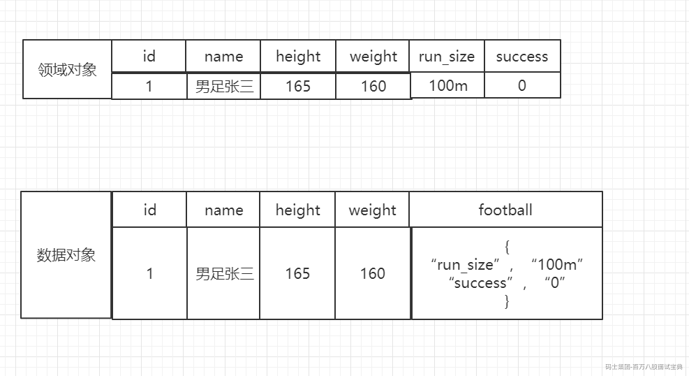
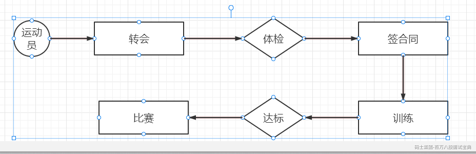
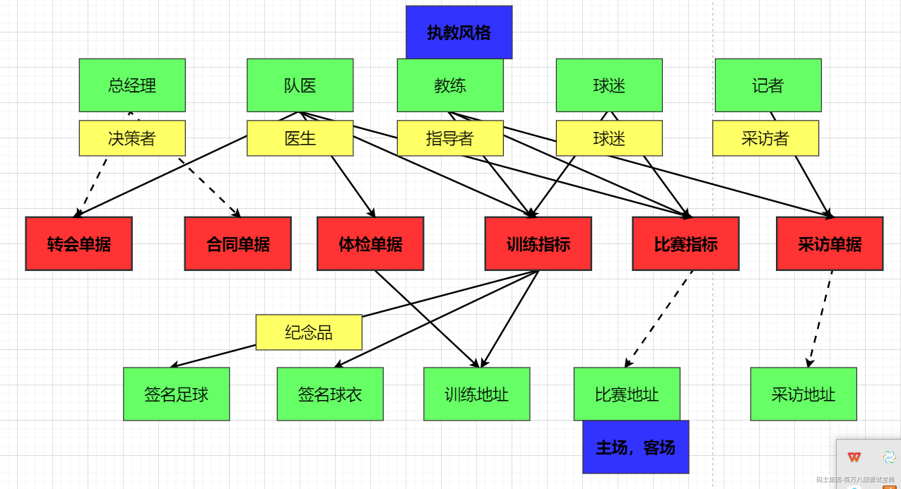
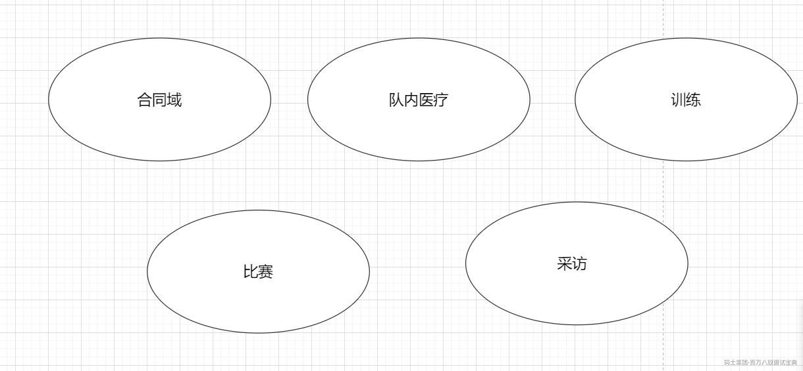

# 六个问题

### 1.为什么我们使用

DDD的方法论的核心将我们的问题不断的分解，将大问题分解成为小问题，将大的业务范围分解成小的领域，简单的说就是分而治之，各个击破。

分而治之，我们可能直接会面对大业务，我们无从下手。我们就需要分解，雏形：多少业务功能-每个功能--接口

分解成为高内聚的小领域，可以让我们的业务有边界。但是领域是实际的边界。这就是领域驱动设计的核心。

各个击破，是指的我们的问题被划分成为小领域之后，因为小领域业务内聚，所以说子域的相关度高，同时我们在设计的时候可以对他进行详细设计。并且我们在管理的维度我们也可以对项目进行分工。所以我们的DDD的战略设计是不能替代详细设计的，DDD的本质是为了更加清晰的进行详细设计。

现在微服务是特别流行的，当我们的业务逻辑越发复杂的时候，实际上也可以靠我们的DDD来解决我们的业务逻辑复杂的问题。

### 2.方法与目标

首先，我们需要明确一点，我们去使用DDD是干什么事，就是将我们的业务划分为边界清晰的模块。DDD只是其中的方法之一，DDD在这里是方法，不是目标。比如你的业务模型很简单，很容易分析的项目就不需要DDD，短平快，你也不需要。

### 3.不必纠结于局部

由于项目过于庞大，导致我们整个项目可以无限极的划分，比如我划分了领域，子域，子子域，限界上下文的划分，本质上不就是子域。

我认为大家不必纠结，这取决于你当前功能的重要性，如果你当前的功能是核心模块，那么这个时候你的划分需要尽可能详细一些，其他的一些子域，划分可以不用那么详细。你认为的局部，在别人看来是整体。高内聚，将与核心业务高度关联的功能，优先收敛。

### 4.业务粒度的粗细

关于微服务的粒度划分至今是没有粗细的详细标准的。根据业务需要，开发资源，技术实力综合考虑。拆分微服务过细会导致开发难度增加，部署难度增大，维护难度增加，但是迭代成本减少。

建议大家核心领域单独划分模块，非核心可以选择性聚合

### 5.领域与数据

领域对象与数据对象，区别：值对象的存储方式

足球运动员指标



### 6.抽象与灵活

抽象的核心是找相同的，对不同事物的相同的地方提取公因式，变相的体现了灵活性。

# 六个步骤

### 2.1流程梳理

梳理的视角是什么？

如果对于业务不熟悉，那么我们应该怎么做？



### 2.2四色建模法

1.时标对象：1.事实的不可变性 2.责任的可追溯性

2.参与方，地，物

3.角色对象

4.描述对象



### 2.3划分领域



### 2.4 领域事件

当业务系统发生了一件事情，这个事情会影响到其他子域的后续动作，那么这个时候我们将这个事情称之为领域事件。

事件订阅的交互，需要注意一个问题，在软件当中，事件模式只能用到最终一致性，需要放弃强一致性，所以，领域事件的产生会引入技术复杂度的权衡。

### 2.5项目构建

参见架构代码结构对照表

### 2.6详细的设计

领域已经确定了，根据领域划分任务，用例图，活动图，时序图，数据库设计，接口设计规范。

# 跟大家聊聊战略设计

DDD方法论 用屁股来看技术

简短的看一下战略设计

Domain：领域，你们公司是干什么的

核心域: 电商

支撑子域 ：拆分的功能

通用域：

通用语言： 跳水 定义名词的特性

防腐层：系统与系统的对接层

```java
AFADFFDSSADAS
```
