# 领域驱动模型设计与微服务架构落地

引语：在我多年的职业生涯中，我发现就算是互联网公司，大部分部门也是由业务驱动，业务决定了我们的技术选型以及代码边界。也就是说我们并不是一定需要对于所谓的架构标准进行墨守成规。并且市面上大多数项目并不能直接体现出架构专业度以及架构特性。不过领域驱动设计又是我们互联网大厂必问的这样一个问题。所以我希望能够将领域驱动设计结合业务场景进行解析。这里补充说明一句，DDD（领域驱动设计）实际上是一套软件架构设计的方法论，我们可以在此之上更好的理解业务。并且我们可以根据这套方法论进行架构风格填充，包括微服务架构，面向服务架构，REST风格架构以及六边形架构等等。并且我们还能够将上述的架构风格进行结合使用。架构风格本质上就是一组架构约束。也就是说他其实就是规则。

- 领域驱动本身不涉及任何的技术栈，很多同学很喜欢聊微服务，那是因为微服务本身就有实现以及落地，但是领域驱动这么多年以来，其实并没有一个实现以及落地。

- 其实来领域驱动设计DDD的各位同学，其实你们也应该发现了，当你们浅浅的去看领域驱动设计的时候，你会感觉领域驱动设计好像非常契合我们的业务场景，并且感觉非常的规范，但是我不得不说这是你们的错觉。每一个程序员刚接触到DDD的时候都是这个感觉。

- 建议学习这门课程的同学最好拥有2年以上开发经验，并且对于业务非常熟练。你的业务经验越丰富，实际上你的理解越深入

- 领域驱动设计并没有一个完整的规范或者说约束，现今市面上你所看到的所有资料都是基于（Eric Evans）埃里克·埃文斯的《领域驱动设计-软件核心复杂性应对之道》这本书进行衍生，本课程是我对于领域驱动设计的理解。所以不要拿这里的概念与市面上一些概念进行对比。

## 1.领域驱动模型不得不说的秘密

### 1.1 业务决定技术边界，业务边界定义领域模型

#### 1.1.1 什么是领域驱动设计

**什么是领域驱动设计**

实际上领域驱动设计的英文是**Domain-Driven Design[dɪˈzaɪn].**

为什么会出现一个这样的概念呢？这是由于软件其实对于行业并没有什么非常高的要求，因为软件本身就是为了能够帮助某一些业务进行更好的发展。软件本身其实是赋能以及变革。软件具有行业兼容性，同时又带来固有的复杂性。

> 比如医疗行业跟金融行业，都能够去使用软件进行业务开发，但是他们的业务完全不一样，这个时候我们就需要进行大量的业务梳理，甚至需要专门的岗位（产品经理）去完成这个工作。而完成这项工作之后，我们才会进行软件的设计层面，在软件设计的时候，由于信息层层传递，就有可能会导致信息的失真以及遗失，从而导致产品预期以及产品落地会产生较大的差异性。
>
> *(⚠️ 图片缺失:源知识库原图已失效)*

大家应该都有过这样的经历，比如我们去开发一个项目，由于需求的不断变动，导致你不得不去改动你原本的代码来保证功能的完备性。

但是这样导致了代码复杂度的增加，以至于这种项目最终都将面临重构。

> 举例：
>
> 比如一个电商项目，我们可能需要跟产品经理预先进行沟通，比如，我们预先定好了，整个项目最终可能需要承受1W的并发量，但是运行一段时间后，公司的效益很好，可能能够到达了10万并发，在你没有考虑线性扩容方案的情况下，这个时候你该怎么拓展，是不是可能你们整个项目都需要进行大的改动，甚至重构。

为了解决这个问题，领域模型的概念就被提了出来。其实，对于领域模型大家也不陌生，甚至可能你正在使用这种方式，只不过你没有意识到，比如早期的领域模型其实就是数据库设计。

比如，我们早期的设计方式是直接建表，然后针对表去进行对象的建立，但是在我们的开发过程中，我们会发现很多问题，比如表字段建立不合理，有些字段少了，或者说有些字段冗余了，然后再不断的进行调整，最后再上线。

> 建表 -- > 根据表来建立对象
>
> 大家看到这个方式之后，就会发现问题所在。
>
> 首先，这个模型的业务逻辑非常重，可能会导致故障级联。而且这样的业务会越来越复杂，最终导致耦合度变高。
>
> 所以，我们认为，依赖数据库去进行领域模型的建立可能有点问题，或者说不满足越来越快的开发节奏。
>
> 因为，原本我们是瀑布式开发，我们使用数据库进行领域建模是没有问题的。因为我们的需求已经确定了，在这个版本完成之前我不会去考虑其他的需求。
>
> 但是由于互联网进入了快节奏，敏捷开发实际上成为了我们的常态。而敏捷开发实际上带来的问题就是，我的需求实际上是在不断的变的，同时，你整个生命周期其实都处于一个实验的阶段。并且你在不断的发布新的版本。这样带来的问题就是，昨天定好的东西，可能今天就会发生改变。

所以为了更加契合敏捷开发。我们就在考虑一件事。能不能不使用数据库做为领域模型的建立依据。因为数据库字段的不断增加与修改，是基于物理表结构的。物理表结构只要有改动，就避免不了耦合的产生。

**那么这个时候我们能不能用更加抽象的东西做为我们领域建模的依据呢？？**

而就在外界还在讨论这个问题的时候，其实我们的软件设计流程已经发生了巨大的改变。

我们需要去预先定义咱们的业务边界，也就是说，咱们的项目，比如数据库，承载数据的上线是多少，比如有10TB数据，我们应该如何设计数据库才能够满足我们的要求，是否需要分库分表，单表过大要进行分表，磁盘负载过大要进行分库。是否要做主备，我们预先需要准备多少机器，设计是否能够支持线性扩容。我们现在需要采购多少机器等等，预算是否充足等等。

缓存，消息引擎，各个模块也要进行相关的设计，这就是我们的架构设计应该做的事情。架构师本质上就是文档与图形的载体。

所以我们定义了这样的一个流程以及阶段。

**项目开发流程图**

*(⚠️ 图片缺失:源知识库原图已失效)*

大家可以看一下这张图，我们会将我们软件上线之前的流程划分成为8个阶段，而每一个阶段都会对应的文档给到对应的人员。

很多的同学其实认为领域驱动设计很虚，觉得我看不到东西或者说对于领域驱动的概念非常模糊，这是因为你不清楚领域驱动的本质，领域驱动的本质是模型，并且是业务模型。他一定是基于你对于业务非常熟练的情况下，才能够定义出合理的模型。

### 1.2 让领域驱动设计占据你的大脑

市面上有非常多跟大家聊DDD概念的书籍以及课程，并且也会附上相应的场景，但实际上并没有对于领域驱动进行落地。因为一般这种讲解都是基于某一个小的场景，而这类小的场景实际上并不能够将DDD进行淋漓尽致的体现。

比如我们的软件开发流程的第一个阶段，范围定义，它实际上是属于领域驱动落地设计中概念设计的部分。

整个概念设计会包含第一第二第三，三个阶段，而每个阶段我们都应该有相应落地的概念关联图，概念类文档，领域类图以及填充完毕属性的概念类。这个阶段是高级开发人员（架构师）与产品方以及运营方进行共同设计。

而中级开发人员应该能够看到这些图，并且能够根据这些图来设计业务逻辑，建立业务模型，抽取可复用的业务逻辑。所以，如果你的项目真的运用了领域驱动设计思想，那么在这个阶段，你也应该能够看到业务建模相关的文档资料。

包括业务用例视图，用例规约，业务规则，对象模型，以及业务用例场景等。

这个阶段应该是中级开发人员（技术专家，技术经理）以及产品方还有架构师以及项目模块核心开发人员共同完成。

最后，进入物理设计阶段后，就是所有开发人员进行共同设计，不过这个阶段才是最重要的阶段，可能前期的逻辑设计会有漏洞，我们需要弥补漏洞，甚至有的时候我们为了性能可能会推翻模型。在这个阶段，我们会完成数据存储问题，索引，视图，分区等一系列问题。并且会对异常进行统一处理。还会使用不同的架构风格进行填充，比如使用到了REST架构风格，那么在这个阶段我们便会将模型落地为REST风格的API，如果使用的是微服务架构，我们就会进行微服务构件设计。我们可以使用多种风格进行糅合，具体使用各种架构风格是根据逻辑设计阶段系统特定所定。

其实大家听我讲完了之后，是不是发现，我们的领域驱动设计并非想象中全是概念。

**那么我们很多同学的项目为什么并没有用上领域驱动设计呢？**

因为我们的领域驱动设计有几个要求

首先，对于项目中架构师的技术要求非常高。并且，架构师不仅仅应该对于各个组件，框架了如指掌。更需要对于业务有非常强的掌控力。

其次，整个项目中，各个角色都应该非常专业，有相当的专业度。

> 比如：技术专家不懂领域驱动，不能够协助架构师完成逻辑设计阶段。那么项目进度就会停滞。
>
> 不过，对于非核心开发并没有过多的限制，反而，底层开发难度会降低。因为全部都定义好了，只需要CRUD就行了。

最后，如果项目没有到达一定的体量，那么做这样的设计反而会拉长整个开发周期。因为很明显，如果完整的按照需求进行设计，前期的概念设计阶段以及逻辑设计阶段必然需要大量的时间。很多的公司尤其是创业型公司并没有这么多所谓的时间来进行所谓的标准化生产。

很多公司宁可先花费少量的时间出一个产品，后期再进行迭代。

所以，大家会发现，自己所在的公司好像根本就没用提到过领域驱动的概念。但是去大厂面试又会发现，这是必备的基础功底。因为大厂的很多项目从一开始就会进行这样的考虑。

这正是由于场景不一样，所导致出来的技术差异性。所以，很多的同学能够很明显的感受到，大公司与小公司之间技术的迥异。

而我们的课程会将各种各样的软件设计之道与领域驱动设计相结合，根据你自己的项目情况，总结出一套适合你自己的可供实践的理论指导。并且我们可以根据这套理论建立一套属于你自己的复杂业务场景设计方案。

### 1.3领域驱动与微服务

​ 2004年，我们的埃里克·埃文斯（Eric Evans）发表了《领域驱动设计-软件核心复杂性应对之道》这本书，并且确定了领域驱动设计的核心思想：即通过领域驱动设计方法定义领域模型，从而确定业务和应用边界，保证业务模型与代码模型的一致性。

​ 但是，提出来这个概念之后，DDD一直处于概念火，但是并没有落地方案的阶段。直到微服务的出现。

​ 微服务自2015年开始，一下子在软件开发领域成为了当红辣子鸡，包括他还能够解决在集群架构下的很多问题，比如拓展性，比如弹性伸缩，比如小规模团队的敏捷开发等等。不过随之而来的，微服务架构的问题也暴露了出来，比如微服务的微，到底应该拆多小呢？不同的人会根据自己的理解而拆出不同的微服务，并且每个人都会觉得自己说的还很有道理。

​ 实际上在我们微服务落地的过程中，我们也遇到过很多项目在进行服务拆分的时候会有这样的困惑，很多的项目甚至是沿用的SOA架构的服务拆分思想，进行专业领域划分，比如订单，商品，这样进行划分。而这样的划分实际上会导致哪怕用上了微服务架构以及技术，实际上原本的面向服务跟微服务差异性也体现不出来。

​ 还有一些项目拆分的粒度可能太细，导致整体项目被拆分成上百个小的服务，但是运维部署的难度呈几何倍数增加，最终在上线前流产。

​ **那么是不是有什么理论或者架构方法论能够帮助我们进行微服务架构设计呢？**

​ 其实这就是最近两年领域驱动突然火起来的原因，我们能够通过领域驱动设计，去定义我们的领域模型，划分领域边界，然后再根据我们的领域边界从业务角度去进行微服务边界定义。并且很多人尝试使用这种这种方式之后发现，好像这样划分出来的微服务，不管是业务边界还是技术边界都很合理，还能完美的契合咱们的微服务核心思想。“高内聚，低耦合”的思想，所以，很多的人又开始重新的学习咱们的DDD，并且还将DDD做为微服务设计的指导思想。觉得这两个东西很搭。

​ 现在，很多的一线互联网公司已经将领域驱动设计做为微服务设计的指导思想了。所以现在大厂面试也会经常问到这样的点。但并不是说我们的DDD就不适用于我们的单体架构设计了，单体架构依然可以选择DDD做为我们架构设计的指导思想，而微服务，仅仅只是跟我们的DDD恰好搭配。什么意思呢？

打个比方，你有一个手机充电线，Type - C 接口一直以来这跟充电线都是充你的华为手机的。这个时候，突然，有个人招你借数据线，借完之后发现你的数据线刚好合适，他的手机也是华为，并且是最新款，很火。所以连带着你这根数据线也火起来了，但是你能说他不能给老款华为充电吗？也可以的吧。 等以后最新的手机出来之后，说不定其他数据线也火了呢？所以，技术永远要成为我们手上的工具。不然说不定什么时候就更新换代了。

**那么DDD怎么帮助我们确定业务边界以及技术边界呢？**

- 围绕着业务边界，我们可以从业务角度进行出发，建立业务领域模型，合理的划分业务边界，建立泛语言的限界上下文，而这里的限界，就可以帮助我们做为微服务设计的业务边界。这个叫战略设计。

- 而我们的技术边界，则可以从技术角度进行出发，并且我们在这个阶段会围绕着战略设计所定义的领域模型进行技术实现，并完成软件的开发以及落地，包括聚合根，实体，值对象，领域服务，应用服务以及资源库等代码逻辑进行设计。

### 1.4 战略设计

#### 1.4.1 领域

首先，既然我们的DDD是领域驱动设计。那么领域必然是我们的重中之重，**那么什么是领域呢？**

\*\*一个领域本质上可以理解为就是一个问题域，只要是同一个领域，那问题域就相同。所以，只要我们确定了系统所属的领域，那这个系统的核心业务，即要解决的关键问题、问题的范围边界就基本确定了。\*\*通常我们说，要成为一个领域的专家，必须要在这个领域深入研究很多年才行。因为只有你研究了很多年，你才会遇到非常多的该领域的问题，同时你解决这个领域中的问题的经验也非常丰富。

同时大家从字面上的意思也能够知道，**领域其实就是我们的范围**，而范围实际上就是我们的边界，我们做什么，做到什么程度，最低多少 ，最高多少。而范围定义下来之后，我们根据这个范围去计划我们要做的事情。这不就是领域驱动设计吗？？

比如你现在要去做一个电商网站，那么你的进货，优惠规则，物流仓储，销售报表，这些直接跟你的业务相关的东西都归属于领域，而所谓的领域驱动设计就是你需要预先把领域中所涉及到的数据，流程以及业务规则搞清楚，然后再通过面向对象的方式为他去建立一个模型，这个模型就叫做领域模型。我们再去选择合适的技术去对他进行实现。

#### 1.4.2 子域

那么这个时候可能有同学会问，老师，按照你的说法，我们好像只需要建立一个大的领域模型，而建立完成这个大的领域模型之后，我如果说有一些小的功能点希望进行修改，这个时候我应该怎么操作呢？因为本身我们的DDD就是用来处理高度复杂的领域的设计思想，你都高度复杂了，我还用一个东西把你装起来。说要用一个领域将你全部装起来，是不是有点不合理啊。

那么我们的DDD是怎么做的呢？我们的DDD使用了一种非常简单的方式，大事化小，既然你整个领域太过于复杂，业务太过于分散，那么这个时候我们做一个拆分如何，你的电商系统很复杂，那么我单独将他拆分成比如一个个的模块，订单，商品，库存是不是会好处理一些呢？甚至我们的模块还能进行细分，比如库存，可以分为本地库，异地库，三方托管库。当然，这里只是类比，因为我们还在学概念的阶段。这里希望大家能够去理解这个概念。这一个个的模块，实际上在我们的领域驱动设计中还有好听的名字，叫做子域。

那么这个时候，我们可以一个个的去研究我们的子域，当我们所有的子域搞定了之后，是不是我们整个领域也就搞定了。当然是这样，因为原本我们的子域集合，就是我们的领域嘛。聊到这里，大家是不是觉得有点像微服务了，当然，本质上我们的微服务架构与领域驱动模型没有任何的关系。一个是思想，一个是架构风格。但是他们的目的都是一致的，都是希望能够将复杂的事情简单化。

那么随着我们划分子域，我们发现我们的子域的划分我们已经慢慢的掌握了，但是我发现不同的子域重要性以及功能属性完全不一样。所以我们又会将子域分为核心域、通用域和支撑域。

为什么要将这些子域进行单独的定义呢？

实际上是因为我们的公司在建设项目的时候，会有非常多的限制，比如预算，比如人员，但是这些资源我如果平均分配在每一个子域，就有可能会导致其中一些子域关注度不够。比如你们公司的核心业务。可能就会因为得不到足够的资源，导致项目失败。

所以，我们对应不同的子域应该采取不同的态度。

其实很多的同学会觉得，相同行业的领域模型是可以复制的，但是我告诉大家，这是错误的。

> 比如淘宝跟京东。一个是C2C，一个是B2C。那么，显而易见的，C2C更加注重于服务，当然，这是对于买卖双方的服务。所以，你们会发现，淘宝所有的一切，都是为了保证卖家能够好好的卖出去货，买家能够把货收到。那么这样一单完成，钱到手。所以，我们还会对于商品进行展示，甚至直播展示，所以会有淘直播。所以这种模式核心在交易保证。
>
> 而B2C呢，其实卖的是口碑，如果说C2C你需要直接保证交易，而B2C实际上会更加关注产品的质量，为什么这么说呢？因为我们的B2C实际上如果你产品质量不好，那么我就会直接找到你的B方，也就是商家端。所以他的生命线实际上是质量。包括同学们聊起京东，肯定第一反应是质量。这已经做为了产品属性标签。
>
> 可能有同学会说，淘宝就不用做质量了吗？或者说京东就不做交易保证吗？所以这就是我们的兼顾，我们的业务力量需要放在刀刃上，并不是说其他的地方我们不会兼顾。
>
> 这个时候可能有些同学会有一些问题，老师，京东跟苏宁是不是同一种商业模式啊，我去进行设计的时候能不能进行同类分析啊。
>
> 包括我们去进行子域划分的时候是不是可以Copy。
>
> 这里我告诉大家，肯定是不行的。苏宁实际上强调的是线下选货，线上卖货，他们的核心在于线下。是由典型的线下往线上走，这种方式其实看重的是线下的服务，包括他们核心的源头在于你线下要有足够的流量。你才能慢慢打通线上。

所以，其实大家会发现，我们的商业模式的不同，我们的侧重点不一样。所以我们去进行软件设计的时候方式也会不一样。如果是中小公司的架构，跟不懂技术的老板应该聊的是这些东西，而不是具体的技术栈。

##### 核心域

那么什么是核心域呢？实际上他就是当前领域的最核心的竞争力，也就是业务核心，

核心域是整个业务系统的核心，所有的业务都要围绕着核心业务域展开。如何明确核心域呢？

比如我们的淘宝，按照淘宝的模式，那么在交易保证的情况下，交易双方的属性必定就是我们的核心，比如返利，比如商户系统。

而京东则不一样，在京东自营模块而言，他们更加注重质量，这里的产品质量保证实际上不仅仅是产品本身，产品运输过程中也会导致质量问题。包括采购系统，包括仓储，物流，供应链才是他们的核心。

通常明确核心的方式是**精炼业务域**。精炼是一个持续的过程，具体来说有以下几种方式：

- 领域愿景说明（Domain Vision Statement）

比如某里，实际上他们的愿景，让天下没有难做的生意。就充分说明了他们的愿景。

其实这里有同学可能会不理解，说白了，就是你们项目最初立项的目的是什么，目标是什么。为什么要做这个项目。

很多同学会认为，我们立项的目的是赚钱。可是我用什么手段赚钱呢？比如客户交易手续费，或者说信息差，或者流量费用，打广告。

- 突出核心（Highlighted Core）我们通过“领域愿景说明”可以明确什么是核心域，但这是从一个较为宽泛的角度对核心域进行说明的。我们明确核心域的目的是为了形成**核心**领域模型，此时我们需要突出核心。突出核心域中的领域模型有两种方式：

问题：

不过最起码你有文档，才能够让需要接手项目的人能够去找到参考物

- 精炼文档

- 标明核心（Core）

1. 文档可能得不到维护.

2. 文档可能没人阅读.

3. 由于有多个信息来源,文档可能达不到简化复杂性的目的.

- 内聚机制（Cohesive Mechanism）

​ 这个是什么意思呢？其实当你的项目越来越大的时候，你的修改可能会越来越多，这个时候你的代码可能会在原本的代码上增加很多，那么就有可能导致你原本的代码

- 分离的核心（Segregated Core）

非核心的动作其实你可以稍微的关注度放低，比如物流，其实不属于交易保证范围之内，那么他就可以做为我们的支撑子域。

- 将核心域中的非核心元素（模型）分离出去。

- 将非核心域中的核心元素（模块）移动到核心域中。

- 抽象核心（Abstract Core）当不同模块的子领域之间有大量交互时,要么需要在模块之间创建很多引用(在很大程度上抵消了划分模块的价值),要么就必须间接的实现这些交互,而后者会使模型变得晦涩难懂.因此,把模型中最基本的概念识别出来,并分离到不同的类,抽象类或接口中.设计这个抽象模型,使之能够表达出重要组件之间的大部分交互.把这个完整的抽象模型放到它自己的模块中,而专用的详细的实现类则留在由子领域定义的模块中.

核心域的范围并不一定是一次就能确认的，可能需要迭代很多次，每一次都有可能扩大或缩小。

##### 通用域

接下来就是我们的通用域，通用域这个概念其实也很好理解，整个领域都能够用到的子域，比如我们的认证，权限等等相关的模块，这就是我们的通用域，你不需要定制化，只要能够去解决问题就OK了。

##### 支撑域

**什么是支撑域呢？**

支撑域实际上就是不包含核心竞争力的功能，也不包含通用的功能，但是又是必须的支撑。比如限时拼团功能，没有他电商网站能够正常运行吗，可以，但是为了配合活动，他能够辅助我们成单。但是在某些专门的拼团电商中他又是必须的核心。所以我们必须根据当前的情况来进行分析。

**总结：**

你会发现，领域驱动的核心思想就是将问题慢慢细化，同时找出最核心的问题点，倾斜资源保证核心资源不出问题，同时也可以通过领域的细分，去慢慢的缩小我们的子域所要解决的问题，并且构建合适的领域模型，到这一步为止，其实他跟我们的微服务都是有异曲同工之秒的。

所以如果你们公司正在向微服务架构转型，我认为你一定要好好的学习领域驱动设计，这将成为你进行微服务划分的时候的重要依据。

#### 1.4.3 通用语言

那么咱们接着往下聊，随着你们公司项目的推进，这个时候你们的技术专家，架构师，后端，前端，测试都会参与你们的整个项目。相信大家经常会遇到这样一个问题，做为后端开发，你觉得跟产品经理聊天在对牛弹琴，而测试觉得你们开发的代码全是BUG，项目经理觉得你每天没做事，觉得你工期还应该更紧一些。导致这样的问题出现的根本原因是什么呢？

其实，大家也能够想到，由于整个项目角色太多，每个角色都有自己的专业性，并且都有一套自己评估项目的方式。所以不同专业的内容碰撞起来就会导致信息的失真。那么这个时候怎么办呢？必须要有一个东西能够让我们的团队人员交流起来有一个标准。并且他还需要能够正确的，简单的，清晰的表达业务。让我们的技术专家，业务人员，产品，测试，架构都能够达成共识，并且协同合作。这个叫做通用语言。

#### 1.4.3 限界上下文

除此之外呢？还会有什么问题吗？比如我定义了这样的一个语言标准之后，问题又来了。我们讲话的时候都会有各种语义，比如这苹果不大好吃，可以是不大，好吃。表示好吃，也可以是不大好吃。表示不好吃。

那么到底是好吃还是不好吃呢？所以我们需要标点符号来帮助我们定义语义。同样的道理，其实我们的通用语言也会产生同样的问题。那么发生了这样的问题之后，我们的产品经理和开发人员是不是就有可能导致逻辑偏差或者信息失真。所以，为了解决这样的问题。在我们的战略设计上，我们提出来了限界上下文的概念。来确定领域的边界以及上下文环境。

我们可以将限界上下文拆解为两个词：限界和上下文。限界就是领域的边界，也就是范围，而上下文则是语义环境。通过领域的限界上下文，我们就可以在统一的领域边界内用统一的语言进行交流。

#### 1.4.4 战略设计总结

聊完了战略设计，其实我们会发现，他是一种用高层次视野审视软件系统的方式，我们不会去关注你具体实施的技术，包括我们所学习的通用语言，限界上下文，定义领域，子域。其实都在表达一个信息。我是运筹帷幄的。大家一定要按照我的角度进行执行，所以，其实战略设计者实际相当于高级将领，去进行战略部署。而这样设计其实有一个前提，就是我们的将领首先必须身经百战。而所以我一直再强调，战略设计的主导者必须要是一名领域专家，不然的话。限界上下文一旦划分的有问题，随之而来的战术设计以及相应的战术建模一定会有问题。并且，战略设计一定是停留在纸面上的。不会涉及到任何实现的。所以，在实际的应用场景中，你能够看到的，也不过是一系列的标准以及图上的模型。

同时，在这里我也需要跟大家强调一下，我们所谓的通用语言，实际上并没有我们想象中的那么好统一，因为我们还在概念阶段，所以我并没有给大家去进行真正意义上的建模。同时在聊概念的是时候，我也并没有给大家以过多的废话。因为我的想法是，等我们将概念全部纯熟了之后，我们再考虑真正的落地。很多的学习资料每做一步就给大家一个小的Demo。看起来很好理解，但是最终当你想要把这些概念汇总的时候，你就会发现巨大的问题。

### 1.7 领域模型

接下来，我们聊完了我们的战略设计，我们发现了一个问题，我们一直在聊咱们的领域模型，那么我们的领域模型到底是什么呢？

\*\*领域模型（ domain model）\*\*是对领域内的概念类或现实世界中对象的可视化表示。

这种官方概念一向是最复杂难以理解的了，其实我们的领域模型在我们的业务当中也有一个名字，叫做业务对象模型。很明显，我们能够从名字上就能够看出来，我们的业务对象模型是用来描述业务对象之间的引用关系的。

那么什么是我们的业务对象呢。实际上我们的业务对象分为三种

- **业务角色**，业务角色表示的是一个角色承担的一系列责任。比如收银员，他的责任是计算商品价格，收钱，找零，甚至退换货。

- **业务实体**，业务实体表示的是其实你使用或者可交付的工件，资源，事件。比如电商项目中的商品。你需要给卖家打印的发票。

- **业务用例**，实际上业务用例显示的是协作角色与业务实体之间如何执行工作流程，也就是我们的业务链路。

实际上，业务对象模型就是将实体的概念以及行为的概念结合起来了。也就是说，整理起来 ，就是你的业务逻辑流转以及中途所需要的角色。

那么领域模型实际上也分为很多的种类

第一种叫做失血模型，失血模型实际上就是我们的对象模型中只包含我们的get，set方法，像我们的排序，分页等等任何的通用性操作都不会包含在我们的对象中。这种逻辑实际上会让我们的领域模型比较傻瓜式。什么意思呢？我们的失血模型是没有Dao层的，我们所有的业务会全部写在我们的Service当中。所以，一般情况下，我们是不推荐用这种模型的，不过，也有同学正在使用这种方式。

举例代码;

```java
//基于失血模型的模型实现
public class User implements Serializable {

    private  Long id;
    private  String  age;
    //创建用户时间
    private Date createTime ;
    //最后修改用户信息时间
    private Date UpdateTime;

    public Date getCreateTime() {
        return createTime;
    }

    public Date getUpdateTime() {
        return UpdateTime;
    }

    public String getAge() {
        return age;
    }

    public Long getId() {
        return id;
    }

    public void setAge(String age) {
        this.age = age;
    }

    public void setId(Long id) {
        this.id = id;
    }

}
```

持久化操作：

```java
//定义业务逻辑接口
public interface  UserDao{
    public void save(User user){}
    public void findAll(){}
}

//业务逻辑接口实现
public class UserDaoImpl implements UserDao { 
   public void save(User user){
       //持久化操作
   }
    
    public void findAll(){
       //查询操作
    }
}
........
    

//定义管理的逻辑
public class UserManager { 
     private ItemDao itemDao; 
     public void setUserDao(ItemDao itemDao) { this.itemDao = itemDao;}
```

或者在上端设计一层抽象，做为抽象接口。

*(⚠️ 图片缺失:源知识库原图已失效)*

**优点**

- 领域对象结构简单

**缺点**

- 肿胀的业务服务代码逻辑，难于理解和维护

- 无法良好的应对复杂业务逻辑和场景

贫血模型:

贫血模型实际上就是在失血模型的基础上增加了不依赖于持久化的原子领域逻辑。

啥意思呢,就是你不用直接去访问数据库的操作，都可以定义在我们的这个对象当中。比如我们经常会使用到的排序，分页等等操作。这些操作，而任何跟持久化相关的操作，你都需要在业务逻辑层实现。

实际上我在这里会给大家划分一个概念，什么概念呢？就是固有行为以及非固有行为的概念。这个概念是我自己定义的。因为实际上模型是个很粗糙的东西，他跟你的具体实现可能会有很大的差别。我们会发现，假设我们有一个人的对象，那么这个人会有很多属性，比如我们姓名，年龄，性别这些固有属性，但是一个人还应该有一些能力，什么能力呢？比如我们的人肯定是要回走路的，还要会生孩子，还要会睡觉。这些能力加在一起配置上人的固有属性才能算是一个真正的人。但如果你希望它能够每天工作。这并不是人的固有属性，所以这个叫做逻辑。人不工作可以吗？可以对不对，比如很多的拆迁户，不工作也能活的好好的。那么一个人可以不睡觉吗？肯定不行。

那么关联到业务上来，实际上我们的业务其实在我的角度看是死的。但是我们可以用面向对象的思想进行设计，比如咱们的排序，分页这种不用持久化的操作，我称之为固有行为。而在贫血模型中，我这里给大家一个定义，固有行为可以写在对象模型中，而所有持久化操作，也就是真正的落库的操作，我称之为非固有行为。

为什么要这样划分呢？这是因为实际上我们的贫血模型，有的时候行为是否添加进模型是个非常大的问题。我们无法判定。那么在这里，我就帮大家进行一个概念的定义，让大家有个标准。

这种也是现在大家最常用的一种建模方式。

*(⚠️ 图片缺失:源知识库原图已失效)*

**优点**

- 层次结构清楚，各层之间单向依赖

- 对于只有少量业务逻辑的应用来说，使用起来非常自然

- 开发迅速，易于理解

**缺点**

- 无法良好的应对非常复杂逻辑和场景(画图)

> 怎么去理解这个复杂逻辑和场景呢？比如我的订单当中会有一些属性,但是我们下订单一般都是需要查询商品库存的,假设现在我有一个业务场景需要去拿到整个库存模型,或者说叫库存对象.这个时候我是不是就应该直接去获取库存对象.通过判断当前的库存来确定本次订单是否交易成功.
>
> 这样的逻辑有问题吗?看起来好像没有问题,但是这个时候回过头来,如果按照我们领域驱动设计的理念.我们的订单以及我们的库存实际上属于关联对象.按照关联对象的逻辑,实际上我订单模型中,是要包含关联模型的.或者说直白一点.按照我们领域驱动设计的思想.我们可能需要直接通过订单模型获取到库存对象的查询权限.所以我们可以直接用来连接到我们的仓储,哪怕大家现在不清楚我们的仓储是干什么的.我大概跟大家解释一下,我们的仓储其实就是用来解耦我们的业务逻辑层以及持久层的耦合的.也就是说,你想换个我们的ORM框架,那么改下仓储的实现就完事了.不用大费周章的重新写代码.
>
> 那么这个时候我们的我们的订单领域模型关联库存仓储的形式,其实正是我们下一种领域模型.充血模型.

充血模型:

按照我们刚才这个小例子,我们的充血模型实际上是更加符合我们的面向对象相关的原则的.并且我们会发现,我们的充血模型中实际上我们的领域对象不仅仅包含了我们的非持久化逻辑,甚至还包含了我们的持久化逻辑.那么我们的业务逻辑层在充血模型里还需不需要呢?依然是需要的,但是我们的充血模型的业务层实际上只会做一些整合的操作以及封装事务,其他的操作都会在我们的领域对象中完成.这里其实大家也会发现我们充血模型的优缺点

**优点**

- 更加符合OO的原则

- Business Logic层很薄，符合单一职责，不像在贫血模型里面那样包含所有的业务逻辑太过沉重，只充当事务管理以及整合的角色，不和DAO打交道。

**缺点**

- 职责不好进行划分,我们的业务逻辑到底是划分到我们的哪一个层级呢?是领域对象还是业务属性呢?哪些划分到领域对象呢?而且持久化的内容都放在我们的领域对象里.所以我们在写业务的时候会深入到领域对象去,这对于开发者的水平要求很高,变相的增加了企业的成本.

- 其次,由于充血模型包含了太多的操作,你实例化的时候也会有很大的麻烦,拿到了很多你不需要的关联模型.

胀血模型:

胀血模型取消了Service层，只剩下domain object和DAO两层

我们也不用在业务逻辑层面做事务,直接在方法上或者对象上进行事务操作以及授权等等.完全简化代码分层.所有的业务逻辑整合也放在了我们的领域对象里面.简单粗暴.这样其实也算是面向对象,但是代码的维护性太差.

**优点**

- 简化了代码分层结构

- 也算符合面向对象设计

**缺点:**

取消了Business Logic层(业务逻辑层)，在Domain Object的Domain Logic上面封装事务，授权等很多本不应该属于领域对象的逻辑，使业务逻辑再次进行到混论的状态，引起了Domain Object模型的不稳定

我们接下来对比一下我们的这几个模型.

其实失血模型以及胀血模型已经不在被推荐使用.

而贫血模型是我们用得最多的,因为充血模型对于程序员要求极高,很多的项目都不会去这样设计,包括如果我去进行这样设计的话,我也不能保证业务人员能够按照标准去进行代码编写.

### 1.8 DDD分层架构设计

那么聊完领域模型之后，其实我们会发现，接下来，很多的程序员可能就会直接上代码，因为很多的程序员觉得这个你的战略设计跟我们落地的代码没有关系。哪怕你可能说得天花乱坠，可是做为底层的开发人员，我只关心手头上的功能有没有实现，实现完成之后有没有BUG。

那么我们该如何对于我们的系统进行分层呢?

实际上到了今天为止，大家应该已经见到过很多系统的分层方式，包括我们最常见的三层架构。这也要感谢我们程序员前辈们的努力，让我们已经不用去写那种代码纠缠在一起，整个项目只有一个大的包，各个模块耦合及其严重，扩展性还差的代码了。

很多同学其实在学习架构设计的过程中会有一些误区，会认为MVC架构好像就是三层架构，其实不然，三层架构是一个分层式的软甲架构设计，他对于项目并不挑剔，任何项目都可以使用三层架构，至于好不好用，那是另一说，但是毕竟能用。

而MVC架构则是一个设计模式，也就是说，在我确定了使用分层式架构的三层架构后，我可以根据项目的需求来确定是否使用MVC模式。

不过我们可能只是清楚我们使用的是三层架构，而并不清楚为什么要进行这样的设计，那么为什么要将我们的架构分层呢？其实咱们刚才也已经聊过了。无非就是你如果不进行架构分层，就有可能会导致代码纠缠在一起，整个项目只有一个大的包，各个模块耦合及其严重，扩展性还差。那么我们的架构分层实际上就是为了帮助我们解决这些 痛点。用专业的属于来描述，我们的分层架构设计就是为了帮助我们达到高内聚，低耦合，复用以及扩展性。这四个点。

> 其实我们计算机领域当中还有很多经典的分层架构，比如TCP/IP模型，就可以是四层架构或者五层架构，而OSI七层模型，不过这些都只是网络分层。

而我们的三层架构，实际上就是表现层、业务逻辑层、数据访问层

*(⚠️ 图片缺失:源知识库原图已失效)*

首先，我们的表现层，实际上他就是展示给我们用户的层面，对应到项目当中实际上就是你们的servlet或者Controller。

而我们的业务逻辑层，实际上对应到你们的代码层面就是我们的service层，也就是说，他是用来处理我们的业务逻辑的。

而我们的数据访问层，则是直接对我们的数据库进行增删改查操作的。这个也就是我们的Dao层或者Mapper层。

而很多的同学我相信都使用过这样的架构，因为这种架构已经是以及传统CS架构的升级版，它能够将我们的业务逻辑以及数据库访问层面进行隔离。让这个两个非常重要的点能够进行解耦。

#### 1.8.1 四层架构

我们的领域驱动设计为了能够更好贴合业务进行落地，我们也经常会使用分层架构设计，这样做能够更好的凸显领域模型。

传统的三层架构实际上我们能够很明显的发现，我们的数据库将会做为架构起点，我们会从数据库层面开始分析以及设计，但是我们的DDD他的重点其实不在数据库，而是在领域模型，我们会将领域模型做为我们的分析基点，向上进行衍生。进而进行分层设计。

实际上，我们的Eric Evans在《领域驱动设计－软件核心复杂性应对之道》这本书中提出了传统的四层架构模式。

*(⚠️ 图片缺失:源知识库原图已失效)*

大家可以看到这张图，这个就是我们的四层架构，首先它分为四个层级，分别是

1. User Interface为用户界面层（或表示层），负责向用户显示信息和解释用户命令。这里指的用户可以是另一个计算机系统，不一定是使用用户界面的人。也就是说，其实大部分的情况，后端向前端展示信息，我们的前端也相当于我们的用户，后端则是暴漏接口。完整内容聚合操作。这里一般代码中会写到装配器，控制器。以及我们的model，不过这里的model是对外暴漏的model。因为我们的实体有可能不会直接对外暴漏，而装配器会对model进行模型转化，包括这里还会有转换过后的模型。

2. Application为应用层，定义软件要完成的任务，并且指挥表达领域概念的对象来解决问题。这一层所负责的工作对业务来说意义重大，也是与其它系统的应用层进行交互的必要渠道。比如我们的线程调度task，应用服务service等等。但是这里的service不是指的我们的具体的业务逻辑，而是指代的与模型，也就是实体无关的业务逻辑。

3. Domain为领域层（或模型层），负责表达业务概念，业务状态信息以及业务规则，也就是我们的领域模型。这里特别强调，其实我们的四层架构的业务与我们的实体实际上是放在一起的。我们是通过业务与实体来建立的一个完整的领域模型。一般我们的事件event、模型mpdel，包括模型中的工厂类，领域服务类，对象Vo，实体，Entity，聚合，还有我们的领域服务，比如分页操作，都会放在这里。

4. 应用层传递消息，为领域层提供持久化机制，为用户界面层绘制屏幕组件，等等。基础设施层还能够通过架构框架来支持四个层次间的交互模式。

分层架构可以简单分为两种，即严格分层架构和松散分层架构。在严格分层架构中，某层只能与位于其直接下方的层发生耦合，而在松散分层架构中，则允许某层与它的任意下方层发生耦合。

传统的四层架构都是限定型松散分层架构，即Infrastructure层的任意上层都可以访问该层（“L”型），而其它层遵守严格分层架构。

并且我们的上层架构可以调用下层架构，而下层架构则不能向上进行调用。

- `Interface` ——> `application` | `domain` | `infrastructure`

- `application` ——>`domain` | `infrastructure`

- `domain` ——>`infrastructure`

所以大家可以发现我们的第四层实际上是一个特殊的四层架构。虽然分层了，但是又有内在的关联性在里面。

其实这种架构现在也有很多的项目正在使用。比如大家可以看一下自己的包名层级划分，参照我们的四层架构代码结构对照表，看自己是否正在使用。

#### 1.8.2 五层架构

#### 1.8.2.1 MVC模式与DCI模式

接下来，随着我们的架构发展，其实我们又发现了一个问题，什么问题呢？传统的写代码方式当中，我们的MVC模式肯定是其中最火的方式之一，包括其实现在大家如果入门学习java，你的第一个项目，大概率可能就是MVC模式的项目.包括主流的框架一般也会支持MVC模式.你们可能学过的Struts,SpringMVC,包括我们的SpringBoot.基本上都是沿用的MVC这种模式.

*(⚠️ 图片缺失:源知识库原图已失效)*

我们把用户的请求接入到我们的MVC当中的C,也就是我们的Controller当中,而我们的Controller会对用户的请求进行URL匹配处理,并且我们会在我们的service处理业务,而处理业务过程中我们会用到实体,也就是我们的Entity,对应的就是MVC中的model.并且最后我们返回的时候肯定会封装一个模型,最终我们将会把这个模型返回,给到我们的前端,这就是我们的V,视图.

给大家举个例子：

我们的用户下单，实际上首先下单操作是从下单页面开始，然后我们直接从View到我们后端的Controller进行Url的匹配，那么我们需要在我们的Controller层面去进行业务处理。这里的Controller实际上泛指到我们的Service。进行逻辑处理之后，我们就会去操作我们的数据模型Model，生成Order，订单模型。同时我们会将这个模型同步到我们的DB，也就是我们的数据库当中。这个逻辑看起来没什么问题。

实际上大家可以发现,我们的软件架构这么多年的发展,一直被Spring生态影响到了骨子里.而我们的软件架构设计也是一直按照Spring生态所规划的方向去走的.这里不是说Spring不好,因为有人说过,要是没有Spring,我们的JAVA可能10年前就要开始衰落.这句话不是没有道理的.

但是同样的,他也有负面影响,而他的负面影响直接让我们的软件设计层面的人才趋于断层.因为实际上我没有看到中国的软件行业新生代真正的对软件架构层面有清楚的认知.

其实我们能够感受到MVC模式的缺陷,

- 导致代码部分层级冗余

> 首先,大家在学代码的过程中,你会发现我们的控制器,也就是我们的Controller,很复杂.这虽然说是由于程序员书写习惯带来的代码弊病.但是如果十个程序员有五个这样操作,那么就是这种模式本身的问题了.因为这种模式本身就在引导程序员去往我们的控制器当中去进行这样的写操作,因为他并没有明文禁止。所以这样会导致我们的经常会在我们的Controller里面写很多的代码。甚至会写上千行。

- 对于控制器依赖过重

> 第二,我们在写代码的时候，我们会发现我们的Controller，实际上他的作用就是去跟我们的业务逻辑以及我们的数据层面进行交互。那么这必然会让我们跟数据层面形成强依赖。我们的控制器依赖越重，那么意味着我们的领域对象能够做的事情越少，其实你会发现，我们的战略设计以及战术设计会完全耦合在一起。变成一体化形式的设计。

- 对象之间耦合

> 第三，我们的对象之间也会产生耦合，比如我们从Controller中查询出一个对象，并且我们把这个对象赋值给另外一个对象。这两个对象是不是就耦合在一起了。

- 由于框架，我们不符合面向对象OO原则

> 第四，由于Spring的存在，几乎所有的动态化操作都被赋予了业务逻辑以及我们的控制器，那么这个时候我们的角色模型只需要去get，set，这实际上是极度不符合我们的DDD的原则的。

所以其实我们原有的MVC架构本质上跟我们的DDD的设计原则是有冲突的理念的。我们的DDD更加注重于领域。而领域实际上更加针对角色的交互。角色的定义以及角色的场景。比如电商，那么就应该是电商应有的场景。

而在我们的MVC模式下，我们只能固化的形成业务。所以我们的MVC应该划分为结构型设计模式中。而我们的DDD更希望契合到行为型设计模式当中。这个时候，我们的James O. Coplien，（詹姆斯，考帕里安）和Trygve Reenskaug（崔格维，林斯考格）在2009年发表了一篇论文《DCI架构：面向对象编程的新构想》。而这篇论文中就描述了一个名为DCI的架构模式。

我总觉得MVC能够正确的帮助我们的程序员反映代码的层级架构。但是我觉得他可能有点傻瓜式，因为我们没有很好的结合面向对象的思想。你看看MVC，哪里面向对象了。所以我们现在要结合面向对象去干这个事情。

而他们推出的DCI架构，按照老爷子的描述，实际上是对于MVC模式的补充。但是我觉得，更像是我们面向对象的量化落地。

首先DCI架构，全称是Data Context Interactions的简称，实际上大家从我们的名称上也能够看出来，Data是数据。对象的数据。Context是对象的场景，也就是我们的上下文。而Interactions，是指的我们的交互行为。什么交互行为。当然是对象的交互行为。也就是对象的交互关系。

那么我们可以简单的对比一下两个架构

*(⚠️ 图片缺失:源知识库原图已失效)*

大家可以看到，下面的架构实际上我们会将我们的数据对象当成完全静态的东西。也就是说我们的数据对象其实用到的其实是典型的贫血模型，其实贫血模型就是大家常说的javabean 类，里面只有几个属性以及get set方法。以及一些排序逻辑，分页操作，生命周期管理（创建以及销毁）等等。

我们可以看到，我们会将用户的行为，也就是对象做的动作或者说操作给单独的抽取出来，成为我们的RoleObj（角色对象），做为一个层面。而这个层面其实映射出来的就是我们的模型。也就是这个层面实际上我们会对我们的数据模型进行引用或者说绑定并执行我们的运行逻辑.而我们的Context实际上就是一个非常简单的交互入口。大家会发现这样的设计会导致我们的整个对象是内聚的，因为我的行为动作已经有边界了。而我们的数据对象也有边界了。那么绑定这两个对象。那么我们的这两个对象也是有边界的。

而我们的Context，实际上就是非常薄的一层，他所负责的其实就是我们的上下文交互，也就是场景整合。

这里其实我们可以发现，我们的DCI架构与MVC架构相比，首先是更加的灵活。其次，我们更加贴近咱们的领域驱动设计。包括更加契合咱们的领域模型。并且我们的DCI模式跟我们后续要讲到的四色建模法也有异曲同工之妙。四色建模法是需求层面的方法论，而DCI则是架构层面的方法论。我们能够将这两种方式进行完美的统一以及结合。

#### 五层架构

其实上面跟大家聊了DCI架构，我们会发现DCI架构能够完美的跟咱们的DDD相契合。因为我们在进行领域建模的时候，最大的问题就是我们到底使用贫血模型还是充血模型，而我们的DCI模式正是通过双向绑定的方式，对于模型以及行为进行物理分离，但又互相绑定。这样既解决了数据边界与行为边界不一致的问题。也解决了领域对象中数据和行为高内聚低耦合的问题。

怎么理解这两句话呢？

其实我们的数据边界与行为边界不一致是我们在面向对象建模的时候经常会遇到的问题。因为我们去设计咱们的项目的时候，尤其是当面向服务架构以及微服务架构流行之后，我们一般会对项目进行模块化的划分，比如电商项目我们会分成订单，商品，用户这样子的模块。那么在模块当中我们肯定会去设计咱们的Order对象。goods对象以及User对象，那么这个时候会出现一个问题，什么问题呢？就是我们的Order模块中间所包含的操作，比如我们的下单操作。它是属于我们的订单当中的一部分，那么我们的Order模块当中必然会有这样的一个功能，但是下单这个功能其实归属于一条业务链路，那么我们从用户下单界面到商品模块，再到用户信息获取，包括后续的物流以及支付。我们会操作非常多的这样的数据模型。而这些模型则必然会暴漏自己的属性。或者内部状态信息。其实这个在各位同学看到可能问题不大，包括大家可能不太理解。但是这就是领域驱动设计的做法。

大家常用的做法其实就是把我们的领域对象的属性放入当前的模块当中，包括我们的行为一般也是根据自己的经验来进行划分。但是这个时候我们一般会在当前的模块中去进行服务通信式的远程调用，比如我们会用到PRC，或者RESTFUL的HTTP，进行调用。

而我们实际上也可以将这些业务全部汇总到我们的模块中，做一个臃肿式的设计。

所以，其实这也让我们出现了派系之争。

首先就是第一种，也就是大家常用的一种，我们会跨越多个子域，多个模型去进行行为设计，然后在当前的领域进行聚合或者额外的在架构层前面进行聚合，也就是大家所说的中台。那么这样操作之后，大家会发现，问题很明显。这样操作之后，我们会将我们所有的行为从我们的领域模型中隔离出来。因为为了方便我们其他的模块或者其他的领域进行使用，那么我们的领域对象就会变成一堆只提供get，set方法的对象。而这种对象我们通常称之为哑数据对象。或者直接简称为哑对象。这样进行对象模型建立，很明显我们会向贫血模型的方向进行发展。这种方式比较适合项目快速迭代的场景，或者说开发力量不足的场景。

而第二种呢，他们则认为我们的对象模型中应该包含咱们的领域对象，我们所有的对象行为就应该被包含在我们的领域模型之中。他们应该是我们领域模型不可缺少的一部分。所以很显然，这是使用的充血模型，而充血模型其实也会有问题，因为做为充血模型，我们必然会涵盖非常多的非固有行为。并且甚至我们可能还会涵盖很多其他领域模型特有行为。所以我们很难去定义我们的抽象层。并且由于我的业务链路可能会存在多个模块的交互，那么我们的仓储定义以及数据之间的访问关系也会更加复杂。而这种复杂的关系，实际上就会导致我们的行为边界难以界定。这也是我们充血模型所带来的复杂度。所以这种方式适合的场景是整个项目组的水平都比较高，并且开发人员对于业务比较熟悉的场景

这里我们可以发现，因为原本我们的贫血模型以及充血模型实际上选择最大的问题在于，贫血模型可以快速开发，但是会导致模型层太浅，而充血模型的固有行为与非固有行为耦合在一起。无法确定业务边界。而这里其实我们可以完美的使用DCI架构来避免。

同时DCI架构也可以让我们的耦合充分的降低，不会像充血模型一样，行为与角色耦合在一起，也不会跟我们的贫血模型一样，项目核心领域内聚度低。

所以我们的DCI架构也是理所当然的跟我们的领域驱动设计相结合。并且在我们的四层架构上做了衍生。引入了DCI架构之后，很明显，咱们的DCI架构他的数据模型是很薄的，所以我们的domain层也会变薄。以往四层架构下，我们的domian，也就是领域，对应的其实是我们的DCI架构的Data，Context以及InterActions三层。也就是业务角色，业务实体以及业务用例。但是当引入DCI之后，我们可以将domian仅仅划分成为两层，也就是数据对象以及通用对象所在的Object层，还有我们的行为role层。而我们的Context，场景，则会单独的被抽离出来，变成我们跟domian同级别的Context层，因此，当我们的DCI架构与四层架构结合之后，就演变了五层架构

*(⚠️ 图片缺失:源知识库原图已失效)*

1. User Interface是用户接口层，主要用于处理用户发送的Restful请求和解析用户输入的配置文件等，并将信息传递给Application层的接口。

2. Application层是应用层，负责多进程管理及调度、多线程管理及调度、多协程调度和维护业务实例的状态模型。当调度层收到用户接口层的请求后，委托Context层与本次业务相关的上下文进行处理。

3. Context是环境层，以上下文为单位，将Domain层的领域对象cast成合适的role，让role交互起来完成业务逻辑。

4. Domain层是领域层，定义领域模型，不仅包括领域对象及其之间关系的建模，还包括对象的角色role的显式建模。

5. Infrastructure层是基础实施层，为其他层提供通用的技术能力：业务平台，编程框架，持久化机制，消息机制，第三方库的封装，通用算法，等等。

那么这个时候，有同学可能会问，老师，我这边分层架构到此为止了嘛。其实并不是，很多的时候我们都需要根据自己的业务情况以及自身存储的技术栈来进行架构改造。比如我们的项目中消息交互比较多，或者说整合比较多。我们业务的链路较为复杂。有同步的，有异步的，一次还要经历十几个模块才能完成单条业务链路。那么这个时候我们的Context层面肯定会很复杂。那么这个时候我们也可以进行相应的改变。

所以这个时候我们可以进行很多相应的改变。比如假设我们可以将我们的Context分层，比如将Context层分为上下层。而上层我们将事务管理单独的抽离出来。而这边一般情况下我们会以Action序列为单位进行事务处理，所以这个上层的Context我们会做为事务处理层，而一般我们会用到Transaction DSL来进行实现，所以这个层面又叫做Transaction DSL层。

而下层的Context层面处理的单位则是单个的Action，对应一条同步消息或者异步消息。

而原本四层架构的Application层面，由于我们会进行大量的线程调度Task工作，所以我们习惯性的把Application变成了专门的Scheduler层，也就是调度层。

而这六层，实际上就是经过改造的6层架构。我们可以进行构图

*(⚠️ 图片缺失:源知识库原图已失效)*

1. User Interface是用户接口层，主要用于处理用户发送的Restful请求和解析用户输入的配置文件等，并将信息传递给Scheduler层的接口。

2. Scheduler是调度层，负责多进程管理及调度、多线程管理及调度、多协程调度和维护业务实例的状态模型。当调度层收到用户接口层的请求后，委托Transaction层与本次操作相关的事务进行处理。

3. Transaction是事务层，对应一个业务流程，比如UE Attach，将多个同步消息或异步消息的处理序列组合成一个事务，而且在大多场景下，都有选择结构。万一事务执行失败，则立即进行回滚。当事务层收到调度层的请求后，委托Context层的Action进行处理，常常还伴随使用Context层的Specification（谓词）进行Action的选择。

4. Context是环境层，以Action为单位，处理一条同步消息或异步消息，将Domain层的领域对象cast成合适的role，让role交互起来完成业务逻辑。环境层通常也包括Specification的实现，即通过Domain层的知识去完成一个条件判断。

5. Domain层是领域层，定义领域模型，不仅包括领域对象及其之间关系的建模，还包括对象的角色role的显式建模。

6. Infrastructure层是基础实施层，为其他层提供通用的技术能力：业务平台，编程框架，持久化机制，消息机制，第三方库的封装，通用算法，等等。

综上所述，DDD六层架构可以看做是DDD五层架构在特定领域的变体，我们统称为DDD五层架构，而DDD五层架构与传统的四层架构类似，都是限定型松散分层架构。

那么这边实际上这只是我们其中一种6层架构，包括可能各位同学希望划分的更细的话其实还有其他的划分方式，所以本质上不管你分多少层，只要是基于DCI与基础四层架构进行衍生的分层架构，都是5层架构的变体，但是一般也不建议各位同学做太多的分层设计，因为层级越多，那么这个层级结构虽然会越简洁，但是很多朋友应该听说过“设计过度”这个概念。其实在分层设计中这种错误是常见的，就是在没必要的项目中使用过与复杂的分层设计。也就是说，我们要如何分层，得根据项目的需求来确定。

而基于5层架构的各种变体，一般都是限定型松散分层架构。也就是说你可以根据业务进行分层，并且灵活调用，不用严格按照层级进行分层调用。

#### 1.8.3 六边形架构

但是这样的架构设计，不管你是严格的分层架构还是松散型的分层架构，都会有一个问题，我们会过于依赖下层架构，就比如5层架构或者4层架构，如果我们的底层基础设施层出了问题，那么整个结构就完蛋了。如果我们的下级层级出了问题，势必会影响到我们的上级设施。这就会导致典型的故障级联问题。

所以，为了解决这样的问题，我们引入了依赖倒置原则。它可以改变不同层之间的依赖关系达到改进目的。

那么他是如何改变的呢?

依赖倒置原则的正式定义是：

高层模块不应该依赖于底层模块，两者都应该依赖于抽象。

抽象不应该依赖于细节，细节应该依赖于抽象。

什么意思呢？我们原本的分层架构设计是不是耦合非常严重。因为一层接一层。但是现在我们使用依赖倒置原则在原本的分层架构设计的基础上进行衍生之后，我们所有的底层组件都会依赖于高层组件提供的接口，也就是说我们所有的层级都是依赖于抽象的，那么这个时候其实我们会发现我们的层级关系看起来就不是一个从上往下的层级了，而是一个平面的逻辑关系了。而再加上一些对称性设计。就是一种特殊的架构设计，一种基于对称性的架构风格，六边形架构，就出现了。六边形架构重点在于对称性设计。接下来，我们可以进行剖析一下，我们的六边形架构。

我们回想一下我们常规的分层架构设计，如果将咱们本身的架构看成一个整体，那么是不是我们的对外端口只有两个，第一个就是面向我们的用户或者前端程序的，我们需要将自己的API暴漏出去，这是其中的一端，而第二端则是我们的数据库。实际上我们的整个分层架构看起来也只有两端的出入口。而我们在开发的过程中，实际上会发现很多的问题。不管是严格分层架构还是松散分层架构。实际上在常规定义下，我们还是会对他进行分层定义。比如，架构驱动在前，我们曾几何时又想到过我们也会将业务逻辑分为固有行为以及非固有行为。所以未来的某一天，我们再对非固有行为进行分层，或者对固有行为进行分层。那么我们的层次是否会越来越多。未来可能7层架构，8层架构都有可能出现。那么这个时候我们的分层逻辑还会确定嘛。比如我新划分的层级中，我去将非固有行为进行拆分，但是我们怎么能保证。某些固有行为的逻辑不会演变成非固有行为呢。那么这个时候，难道我们要做整体的代码迁移，将这个业务逻辑转移到非固有行为层吗？

所以很显然，这样的设计维度是有一定的架构缺陷的。那么我们有没有办法去弥补这个缺陷呢？

其实我们一直在强调架构，架构是什么，架构是前人设计出来能够满足软件开发的一种规范。实际上，本质就是设计模式以及设计原则，加上架构特性的总和。他与你的框架从来都没有关系，不管你是ORM，JDBC，对于我架构而言，都没有关系。从来都没有最好的架构，只有最合适的架构。

所以，我们的Alistair Cockburn （阿利斯泰，科克本）博士，一位出名的架构师，并且他是敏捷开发的早期创始人之一。他基于敏捷开发，给了我们一个方案。叫做六边形架构。这个架构最出名的点就在于他完全摆脱了原本分层架构的束缚。并且可以称得上自成一系。他完全打破了原有的分层规则，将整个架构设计成了六边形。并且这个架构是有端口以及适配器组成。所以，这个架构也叫做端口和适配器架构。而所谓的端口，实际上很多开发者会以接口组的形式去进行设计。因为单纯的接口维度太小。而这无非就是我们的应用的出入口，

而适配器分为两种，分别叫做主适配器（**Driving Adapter**）以及次适配器（**Driven Adapter**）

主适配器主要负责用户的访问，也就是从接收用户输入，调用用户端口并返回。

次适配器主要实现应用的出口端口，向外部工具执行操作。也就是你的ES，Mysql，Redis，又或者你的Email工具等等这些，都算是第三方的交互，统称为应用出口。

这些适配器可以分布在六边形的每个侧边上，每个侧边都相当于一个类型的端口，端口要么处理输入，要么处理输出。对于外界的每一种类型，都会有专门的一个适配器与之对应以及匹配。

画图：

比如这里我们有三个请求，都是是HTTP协议的，那么我肯定是在一条边上的三个适配器。但是这个时候来了一个UDP的请求，那么我肯定又会适配到另外一条边的适配器上，这是一种可拔插的灵活设计方式。这种方式可以让你的系统进行灵活的设计，我们只需要对同类型的适配器进行端口归总即可。而我们的应用程序则是内部的一个层面，他负责提供公共的API进行适配。也就是说，我们的适配器负责的就是将定制化的外部请求转化成公共API可识别的参数，然后再向内进行调用。而应用程序内部最核心的用来处理业务的则是我们的领域模型。

大家可以思考一下，在我们日常的业务开发中，可能我们同一个功能需要满足不同的需求，但是这些需求的侧重点其实是不一样的，所以我们可能还要定义不同的接口，然后对接口进行实现。并且随着开发的进行，我们的业务越来越复杂，我们的接口则会面临重构，包括有的时候我们面临的最关键的问题就是不同需求产品线的产品经理会不断的找你讨论需求的变更问题，无形之中降低了你的开发效率。

而现在使用了六边形架构之后，我们会发现，我们只需要实现底层的需求，专注于功能的开发，确保功能稳定高效就OK了，在需求变更时，或者功能增强的时候，开发者再开发一个适配器就OK了。

而且这样进行操作之后，我们的核心功能也会更加内聚。所有核心业务都会在我们的领域模型中。

包括我们的次适配器也是同样的道理，不管时Redis，Mysql，甚至是我们自己的内存，都只需要相应的适配器进行适配。

相信大家应该都能够发现了，我们六边形架构实际上是一个平面分层。他是基于内外分层的架构设计，并且是按照非常严格的分层进行设计的，属于内部的代码不能与外部进行交互，并且层级划分也非常严格。比如应用程序层面，就绝对不能出现领域的内容。六边形实际上只是一个说法，随便你多少个边都行，一个边对应一个端口，一个端口则对应多个适配器，而适配器一般都是成组出现。比如数据库的，就应该统一放在一个端口。实际上这也算是变相的实现了单一职责原则。

咱们总结一下，其实我们的六边形架构很简单，我们将所有的对外的输入，输出，包括接口，数据库连接，第三方连接，全部进行整合。然后全部用适配器进行适配。并且由于系统的独立运行跟适配器的存在。我们核心业务完全内聚，而在应用程序层面则是暴漏公共API，考虑到了系统通用性。而外部的适配器则是完全考虑到了单一职责原则，并且由于API是公共的，所以也完全符合低耦合特性。

其实这就是从设计模式衍生出的架构，如果对于设计模式比较熟悉，那么理解起来应该完全没有问题。而迁移到微服务中，其实也可以对每个服务进行完全内聚的设计。业务可以自身完备，也可以与外部业务聚合实现定制化需求。

架构设计无非就是这些东西，包括还有干净架构，洋葱架构以及Life Preserver，实际上都是基于分层架构的衍生。并且同属于六边形架构一脉。架构演变是一个持续的过程。演变是没有尽头的，这里还是跟大家强调一句话，业务会驱动技术进行衍生，发展。所以大家要不断学习，不断创新，我们的架构设计人才才会有新鲜血液出现。

### 1.5 战术设计

那么回到整体，聊完了我们的战略设计，接下来我们就要聊我们的战术设计了。

而我们的战术设计则是去将这个战略进行落地。这个落地的前提是你的限界上下文划分以及通用语言制定完全没有问题的情况下，我们才能进行落地。所以我们一直在强调限界上下文的划分，其实限界上下文的划分也可以做为你微服务的划分依据。

那么我们的战术设计其实是由很多的概念组成的。包括实体， 值对象，领域服务，领域事件，聚合，工厂，资源库等等。其实，在DDD的思想中，代码本身就已经是设计了，因为我们能够通过你的代码来了解你的设计思路，并且你也不用去参照着固有的，无法及时更新的文档去进行设计，并且我们在设计中还需要尽可能避免贫血模型，因为去构建一个充血模型其实很简单，只需要转变一下思维就可以了。原本我们的实体对象仅仅只是被当成一个容器，甚至是一个另类的数据结构。而现在，我们需要将我们的实体对象当成一个服务的提供方，不仅仅是属性，连行为也要被写进我们的容器中，形成一个个的方法，在方法中利用属性。而不是单纯的利用数据。

#### 1.5.1 实体（Entity）

那么接下来首先我们要接触的概念就是实体。什么是实体呢，按照官方的描述,是非常大段的一句话:

> 实体核心是用唯一的标识符来定义，而不是通过属性来定义。即使属性完全相同也可能是两个不同的对象。同时实体本身有状态的，实体有演进的生命周期，实体本身会体现出相关的业务行为，业务行为会对实体属性或状态造成影响和改变。

什么意思呢？我们的JAVA是一门面向对象的语言。万事万物皆可用对象来表示。但是假设我们在一个电商网站中定义了一个名为User的用户对象。他有几个属性。比如姓名，性别，年龄，籍贯。

> 那么这个时候我们在业务的执行过程中产生了两个对象，他们的姓名都为张三，性别都是男性，年龄都是35岁，而籍贯都是北京。也就是说他们所有的属性都是一样的。那么我们能够定义他们为同一个人吗。应该不行吧。因为诺大的北京，仅仅就上述几个属性相同的人，没有1000也有800。那么在我们的JAVA中，怎样才能判断一个对象是唯一的呢。只有一个东西，叫做唯一标识。a比如主键，比如唯一索引等等。大家经常去设置的id就是为了帮助我们区分不同的对象。哪怕他们其他属性都相同，在程序的眼中，只要没有唯一的标识，那么无法确定你们是相同对象还是不同的对象。这就是**对象的唯一性确定**

而我们的实体则会在对象的属性中有这样的唯一标识。比如在之前的对象中加上id这样的唯一标识。这样就能够对对象进行区分。并且这个唯一标识不会影响到我们对象的业务属性。我们的实体本身也会出现业务属性。而且我们的实体海湖有生命周期的存在。而这个生命周期会引发相关的行为。比如实体的创建和销毁。而这会影响到我们的实体属性或者状态。

#### **1.5.2 值对象**（Value Object）

除了实体之外，其实我们还有另外一个在我们领域驱动设计当中非常重要的模型对象。其实很多同学刚接触值对象的时候，会发现他跟实体实际上很类似。很多同学都没有办法区分这两个概念。值对象的描述是：

> 它用于描述领域的某个方面本身没有概念标识的对象，值对象被实例化后只是提供值或叫设计元素，我们只关心这些设计元素是什么？而不关心这些设计元素是谁。这种对象无状态，本身不产生行为，不存在生命周期演进。

看起来好像我们的值对象只是比我们的实体少了一个唯一标识。并且是不产生行为的。那么意味着我们的值对象是无状态的，并且是不可变的。那么从这里来看的话，其实我们可以把我们的值对象看成是一个实体的依附属性集或者叫做多个属性聚合的结果集。因为我们的值对象一般不会进行单独的持久化，或者说不会单独的去进行对照的数据库表设计。这里跟我们的实体就有很大的区别。因为往往我们的实体会单独的进行数据表进行设计或者映射。

这里其实往往很多同学很难以搞懂实体以及值对象区别的原因是由于某些系统的业务不一样，侧重点不一样。

#### **值对象与实体的关联以及区别**

这里就引出来一个问题，实体与值对象的关联以及区别。

其实我们的实体跟值对象都是我们去进行领域模型设计的时候，必不可少的基础单元。

因为我们在逻辑领域模型映射到物理模型的时候，我们的一个实体可能会对应一个甚至有的时候也会对应多个数据库的表结构。也就是我们的持久化对象。

但也有特殊情况，比如电商项目中的折扣实体，有可能你是直接存储的价格，但是有的时候我们会有一个单独设计一个折扣引擎。而这个折扣引擎当中会有多个折扣以及优惠进行商品价格计算，比如双十一跨店的满减，这个价格不可能是提前指定好的，而会根据你的凑单商品，店铺不同的折扣来进行优惠。折扣前的商品实体肯定是做为单独的持久化对象。但是折扣后的实体，可能只是做为订单中单独的价格存在。他是不需要单独做为持久化存在去进行单独的表设计存储的。

而值对象呢？值对象在代码中会有两个形态

首先第一个形态就是假设你的值对象是单一属性，比如你的值对象可能是一个Address，而这个地址可能就是一个json形态的数据集，那么这个时候你直接把你的值对象直接当成一个实体类当中的其中一个属性就OK了。

比如现在有一个地址属性。在小型电商项目中，可能这只是做为用户对象属性的存在，比如某个用户id是13，而他所对应的行政区是中国，湖南省，长沙市，芙蓉区等等。这个时候我们很有可能单独的设计一张地址表，但是对于业务而言，这会增加我们表的构建代价。所以我们可以把这个对象融合起来做为一个属性。比如将我们的湖南省，长沙市，芙蓉区设计成为一个json串进行存储。而这样既减少了表设计的代价，也让我们的对象更加简洁。我们在设计对象状态的时候经常会使用这种方式。

```java
public class User implements Serializable {

    private Long id;
    //年龄
    private String age;
    //创建用户时间
    private Date createTime;
    //最后修改用户信息时间
    private Date UpdateTime;
    //地址
    private String address;

    //get,set方法省略
}

```

```java
public class address implements Serializable {
    //省份
    private String province;
    //城市
    private String city;
    //县区
    private String county;
}
```

而第二个形态则是我们的值对象多个属性情况下，也就是我们的属性集，那么这个时候我们可以考虑把我们的值对象做为单独的一个实体类Class。而实体想要使用我们的值对象，直接对值对象进行引用即可。

而实际上这样做的好处就是我们领域驱动设计可以完全的从领域开始出发，可以充分的考虑到领域模型到物理模型的落地。完美的降低了数据库表的数量。并且减少实体的数量。

我们在领域建模时，将部分对象设计为值对象，保留对象的业务含义，同时又减少了实体数量

在物理建模时，我们可以将值对象嵌入实体，减少实体表的数量，简化DB设计

同时值对象是一把双刃剑，它的优势是可以简化数据库设计，提升数据库性能。但如果值对象使用不当，也会造成适得其反的作用

所以，我们会发现，领域驱动设计与传统驱动设计相比，确实有非常大的优势。尤其是在领域模型的影响下，我们能够去避免非常多冗余的设计。

#### 1.5.5 聚合与聚合根

那么接下来往下聊，什么是聚合呢？同样的，我们先来找一个定义。

> 将实体和值对象划分为聚合并围绕着聚合定义边界。选择一个实体作为每个聚合的根，并仅允许外部对象持有对聚合根的引用。作为一个整体来定义聚合的属性和不变量，并把其执行责任赋予聚合根或指定的框架机制。

那么这里我将他翻译一下，这句话什么意思呢？

> 聚合是业务和逻辑紧密关联的实体和值对象组合而成，聚合是数据修改和持久化的基本单元，一个聚合对应一个数据的持久化；

也就是说，我们的一个数据对象如果需要持久化，那么他在持久化的过程中所需要使用到的实体与值对象总和在一起，便是我们的聚合。

聚合在我们的DDD中属于领域层，我们的领域层面将会是很多聚合共同实现我们的业务逻辑。

那么为什么会有聚合这样的一个概念出现呢？

这个时候我们来设计一个小案例。

这里用大家都能够进行理解的常规电商项目中的下单业务进行举例。

业务链路大概是这样的。

比如用户会登录我们的电商系统，登录之后我们会通过首页商品的点击跳转到商品购买页面，并且用户会将不同的商品加入到我们的购物车中。这个时候我们可以在购物车结算界面进行商品的结算。发起订单之后，我们后台会自动查询商品库存。当所有的商品都是库存充足的情况下，我们会拉起支付，返回用户。而用户会输入支付密码。当支付完成之后，我们则会正常的将订单从待支付状态转换成已支付状态，并顺利的返回用户界面下单成功提示。

这就是一个非常简单的订单下单流程。

那么我们会如何进行设计呢？

很多的同学立马就会想到面向数据库编程的设计方式，也就是我们直接去进行表的建立。

*(⚠️ 图片缺失:源知识库原图已失效)*

这样的设计方式有问题吗，其实本质上也没有什么问题，但是这种方式不一定合理。在软件开发的过程中，我们一定要考虑的就是业务规则的正确性以及一致性。什么意思呢？就是要保证你的项目不能被一些异常出现的情况打断了原有的业务规则。

比如：

1.我们的支付。假设由于你的网路问题，导致支付不知道成功还是失败。那么这个时候你会二次扣钱吗。或者直接判定支付成功。

2.比如这个时候你正在支付的过程中，商品库存清零了。那么这个时候就会出现超卖的情况，你会如何解决呢？

虽然这些问题会对应很多的解决方案。但是这些解决方案实际上都属于技术细节。而技术细节部分的讨论是不应该在业务交流的时候出现的。但往往我们在进行数据库驱动设计的时候缺会导致自己陷入这样的怪圈。我们一方面想快速的解决问题。快速交付，并且快速找到通用的方案。而我们又希望前期能够把能考虑到的点都进行考虑到。而殊不知，其实我们的如果本身架构或者思维层面没有考虑周全。才是为后来的代码设计层面埋下了大坑。

我们在进行数据库层面的设计时，往往都是觉得设计简单，快速实现需求，但是在复杂的业务场景下，我们更加注重的应该是对于业务规则的梳理。因为只有业务规则确定了，充分考虑到系统的通用性以及普适性，才能够设计出一个面对大部分情况都能够进行适当转换契合的架构。

其实我们也有一种设计方式，能够让我们专注于问题的领域，让我们的软件真正变成解决问题的工具。这就是面向对象设计

在面向对象的设计角度而言，我们看到的东西是这样的

*(⚠️ 图片缺失:源知识库原图已失效)*

这里很多同学可能会感到疑惑，老师，这个东西看起来好像并没有什么改变。仅仅只是我们将原本的表换成了对象。为什么就能够解决问题了。

大家其实会发现我们在思考问题的时候，面对现在这张图，我们完全可以不用深入细节，只在业务流程方面进行优化。包括外键约束，表关联等等之类的物理约束，我们完全不用考虑。这样我们也可以更加聚焦问题领域。而且业务人员也能够看懂流程。这样所有人都能基于同一套通用语言进行设计开发。而数据库开发，你用自己的方式去设计数据库，并不能保证其他人一定能够理解你的思维方式。

而这里其实我们可以考虑一个问题，我们的支付离开了订单，在我们的整个系统中有存在的必要吗，在一个简单的电商系统中，我没有其他支付渠道的情况下，一旦订单完蛋，我们的支付系统可能就已经没有单独存在的必要了。所以这里我们得出一个结论，我们应该把订单的下单操作与支付操作做为一个整体来进行设计，而不是将支付设计得非常完善。下单操作却由于业务逻辑得复杂度，而稳定性不高。

而我们的领域驱动设计则是将下单操作与支付操作做为一个整体。这个叫做聚合。像这种业务一体化的操作或者这种可以当作原子性聚合的操作。都可以称之为聚合。并且聚合是比对象更大粒度的整体。

而在刚才的业务中，我们的其他有着持久化业务的模块或者领域都在我们的订单领域中有着依赖，也就是我们的订单中有用户id，订单中也有支付单号，也有商品编号等等。那么相当于我们的订单对象就是这个聚合的关联者，同时也是管理者。那么我们的订单对象就是我们整个模块的聚合根。并且我们的聚合根必须要是实体，而不能是值对象。

这里我们也可以了解一下聚合根的特性：

> 聚合根是实体，拥有实体的业务属性和行为，同时也是聚合的管理者，负责协调聚合内的实体和值对象，按照固定的业务规则，完成业务逻辑。
>
> 聚合根是聚合对外唯一的接口人，聚合之间以聚合根ID关联的方式接受聚合的外部任务和请求，聚合外不能通过对象引用的方式访问聚合内的对象。需要将关联的聚合根ID作为入参，先访问聚合根，再通过聚合根导航到聚合内部实体
>
> 如果聚合根被删除了，他引用的实体和值对象就不会存在了
>
> 聚合根和聚合根所在层的领域服务都可以组合多个实体完成领域逻辑，但为了DDD分层架构的职责单一，聚合根最好只承担聚合管理职能，只实现聚合内实体和聚合根本身相关的业务逻辑，而跨多个实体的复杂领域逻辑统一放到领域服务中实现。
>
> 领域建模中，可能存在一些独立的找不到聚合根的实体，但可以根据高度依赖的业务逻辑，把这些实体集合也作为聚合处理。

而我们的聚合对外的操作入口就是我们的聚合根，聚合内的所有操作都必须由聚合根来进行

#### 聚合的边界划分设计原则

实际上我们应该立马想到，我们在进行代码设计时，尤其是当我们的架构风格已经确定是微服务架构风格时，我们的服务边界划分问题。

包括我们微服务高内聚的特性。我们将领域对象聚合在一起 <新建文本文档.txt> ，不就内聚了吗。显而易见。那么我们到底如何对领域对象进行聚合呢？

哪些对象该属于一个聚合？哪些对象不属于一个聚合？也就是聚合边界的划分问题，有没有一个可指导的原则呢？当然有。聚合边界的划分可以参考如下几个指导原则：

**生命周期一致性原则**

> 生命周期一致性是指聚合内部的对象，应该和聚合根具有相同的生命周期，聚合根消失，则聚合内部的所有对象都应该一起消失。
>
> 比如上面的例子，支付没有单独存在的意义，那么支付比下单操作生命周期长又有什么意义呢？如果这个支付还能支持其他的模块，比如你的电商还有会员售卖，那么你就应该把支付进行设计，而不是属于这个聚合。

**问题域一致性原则**

> 生命周期一致性只是指导原则之一，有时如果只考虑生命周期一致性原则可能会引起问题。让我们考虑一个这样的场景：
>
> 比如我们的电商网站上，订单与支付存在聚合，而订单显然就是我们的聚合根，那么订单被删除，我们的支付也要消失，那么支付一定属于订单聚合吗

我们来思考下，比如我们有会员系统，会员系统需要购买才能够提升会员等级，那么显然我们的会员系统也能够跟支付产生聚合。而这个时候如果只会由于订单与原本的支付存在逻辑关联就让订单聚合，显然约束了我们的支付的适用度以及作用域。

所以，我们得到了一个新的、凌驾于原则1之上的原则——**不属于同一个问题域的对象，不应该出现在同一个聚合中。**

**场景一致性原则**

通过上面两个原则，我们基本能够划分清楚一个聚合的边界，但是仍然会存在一些复杂的情况。这时我们可以根据第三个原则来判断：场景一致性原则。

什么是场景一致性呢？场景一致性就是场景操作频率的一致性。

在很多业务场景中，我们会对领域对象进行查看、修改等各种操作。 **经常被同时操作的对象，应该属于同一个聚合，而那些极少被同时关注的对象，即使上面两个原则都满足也不应该划为一个聚合。**

不在同一个场景下操作的对象，放入同一个聚合意味着每次操作一个对象，就需要把其他对象的所有信息抓取到，这是非常没有意义的。这在日常开发中我也是深有体会。

从实现层次，如果不紧密相关的对象出现在同一个聚合中，会导致它们经常在不同的场景中被并发修改，也增加了这些对象之间冲突的可能性。

所以：**大多数时候的操作场景都不一致的对象，应该把它们分到不同的聚合中**

**聚合应尽可能地小**

在划分聚合时，除了应该满足上面三个指导原则外，我们还应该让我们的聚合尽可能地小。通常，较小的聚合会让一个系统变得更快和更可靠，因为会传输较小的数据并且引发并发冲突的概率会较小。而设计一个大的聚合会带来各种问题：

- 大聚合会降低性能

- 大聚合更容易受到并发冲突的影响

- 大聚合扩展性差

### **领域服务**

其实我们之前也略微的带过领域服务的内容.

之前说过，业务逻辑尽量写到实体中，不能写到实体中逻辑，才会写到领域服务中

> 领域服务是很薄的一层

至于什么是不能写到实体中的逻辑，这个我们后面再说，我们先看一下领域服务的概念

```plain
有些重要的领域操作，不适合归到实体(Entity)和值对象(value object)的夷别中，这些操作从本质上讲是有些活动或动作，而不是事物，当领域中的某个重要过程或转换操作不属于实体或值对象的自然职责时，应该在模型中添加一个作为独立接口的操作，并将其中明为Service:
```

这次的概念还是比较清晰好懂的,简单的来说,在领域层，就是实体干不了的(或者说不属于实体的)操作,就交给领域服务

> 领域服务是实体的一种补充,是一种必要的妥协

不过,有人可能会问,那为什么不在应用服务层做这个操作呢?什么样的操作才适合放到领域服务里呢?

我的理解是，领域层.一些和实体紧密相关的,但是又不能放入实体的逻辑，才放入领域服务中.

再具体点,什么样的操作该放入领域服务中呢?我认为有两类

- **涉及到跨越多个实体的操作**

> 比如内部转账，从一个账户实体到另一个账户实体

- **涉及到和外部系统的交互**

> 还是举个转账的场景,在转账的时候,需要调用实体的转账方法,然后再调用第三方网关(支付宝/微信)
>
> 这种时候由于转账是核心业务,不适合放到应用服务层，但是由于要调第三方网关，也不适合放入实体,这时候就应该把这个逻辑写到领域服务中，

领域服务说到这里其实就算是讲完了，但是我还是得补充几个常见的关于领域服务的问题和回答

Q:必须要通过领域服务才能操作到实体吗?

A:并非,领域服务只是实体逻辑的一点补充,如果可以直接在应用层调用实体的方法完成业务,那就不需要调领域服务

Q:可以在**领域服务**内**调用dao层**吗?**领域服务**可以调仓储吗?

A;理论上是可以的，但是不推荐这么干,我们得尽量保证领域服务是很薄的一层，不额外的去增加领域层的依赖,让领域层变的好验证

> 虽然说可以通过接口mock或者是stub的方式进行模拟测试,但依然需要开发成本工

个人觉得,如果规定调用实体必须得通过领域服务,那么，可以在领域服务调用仓储和dao

> 领域层承担一定的持久层职责

如果规定**可以直接在应用层调用实体的方法**,那么就**不能在领域服务内调用仓储和dao**

我个人推荐第二种方式

> 我后面的约束都以第二种方式为前提

好了,下面再讲一个领域服务的一些约束，大家可以参考一下

- 不能在领域服务里写太多的业务逻辑

- 不能在领域服务里调用dao和仓储

- 领域服务视为实体的一种补充,里面的属性和逻辑也和实体一样,不能是基础类型得是含有业务含义的值对象

- ·领域服务之间可以进行调用,最好是保持父域的领域服务调用子域的领域服务,不允许跨越上下文进行调用

> 和实体一样,如果有不相关的领域服务的调用,或者有跨上下文的情况,使用领域事件进行解耦

### 领域事件

有些同学会不太接受事件驱动这种模式

觉得代码执行着执行着,突然发个事件,然后代码就跑完了，可读性也不好,如果是同一个应用的事件的话,还增加了代码的复杂度

确实如此,这个就是事件驱动的缺点了，可读性差，代码复杂度增加

> 相当于是增加了一个事件中间层

但是为什么领域驱动的世界里那么重视领域事件这个组件呢?

那就不得不说事件驱动的好处了

那就是**解耦**

> 事件驱动的优点就是解耦,如果是异步事件的话顺便还有削峰和异步的优点
>
> 最重要的还是解耦这一点

我们先来看一个场景,如果我们不用事件驱动的话，代码会是这样的

```java
下单() {
    修改订单状态();
    通知商家();
    通知并修改库存();
    通知买家();
}

支付成功() {
    修改订单状态();
    通知商家();
    通知头家();
}

申请退款() {
    修改订单状态();
    通知商家();
    通知物流();
    通知并修改库存();
    通知买家();
}
```

可以看到,上面的代码还是比较清晰的,无非是在修改完订单后,调用相应的通知方法,完成业务

> 其实代码要是那么清晰还挺好的

但是这个代码有一个问题

- 业务逻辑耦合

如果需求变更

> 1.需要在下单后判断一下如果存在商品是广告商品,调用广告服务的计费方法,那么我们就得去下单的方法下面加一个判断.
>
> 2.退款之后要记录退款日志，如果用户一个月退款超过三次就给用户的行为分-1
>
> 3.由于系统变更，物流系统拆分,用户下单后,需要调用另一个物流系统(之前是本地调用),要处理分布式事务的问题
>
> 4.增加一一个商家拒绝退款的场景,拒绝退款需要记录拒绝退款的理由，冻结订单,锁定库存,通知协调人员
>
> 5.增加用户取消退款的逻辑
>
> 6.记录多次申请退款的订单,通知大数据监控平台.
>
> 是不是听起来就头大?
>
> 需要不停的修改原来的代码去适应新的业务逻辑分支，还有增加新的总业务方法.
>
> 违反了开闭原则其实并不关键。
>
> 如果代码能一直清晰就好,但是我们的开发过程中,往往项目趋近尾声,就会愈发混乱
>
> 代码往往是在这种迭代中,逻辑分支越来越多，越来越不可控

有一位程序员曾经说过,编程届的任何问题都可以通过增加一层来解决

且不说这句话靠谱不靠谱,不过事件驱动这种方式就是通过增加一层事件派发的方式来解决的,让我们看一下使用事件驱动之后的代码吧.

```plain
下单({
    //修改订单状态,并发布下单成功的事件
    下单();
}

支付成功{
    //修改订单状态,并发布支付成功的事件
    修改订单状态();
}

申请退款(){
    //修改订单状态,并发布中请退款的事件
    修改订单状态();
}

//其他地方监听这些事件
@listen
pub1ic void 监听事件(){
}
```

是不是感觉清晰了很多，不用主函数去控制订单完成后的通知细节,其他业务只要监听自己相应的事件,就可以完成业务操作了

> 需要增加一个业务逻辑只需要新写一个监听方法就可以了
>
> 而且也很符合我们物质世界的规律.生产者消费老

回到我们的**领域事件**

按照规矩,我们先来讲领域事件的概念

```plain
领域专家所关心的发生在领域中的一些事件。
将领域中所发生的活动建模成一系列的离散事件。每个事件都用领域对象来表示...领域事件是领域模型的组成部分，表示领域中所发生的事情。
```

什么样的场最该使用领域事件呢?

- 某个**实体**完成某个**动作**,触发**后续的事件**的时候

> 领域事件的命名一般也就是“"产生事件的对象名称+完成的动作的过去式"的形式，比如:订单已经发货的事件(OrderDispatchedEvent)、订单已被收货和确认的事件(OrderConfirmedEvent)等。

领域事件有什么约束吗?

准确的来说，没有什么特别的约束,不要滥用就行,属于实体的逻辑务必不要使用事件,多次一举

> 务必不要为了设计而设计!

#### 仓储与工厂

好了,我们之前已经讲了**业务的边界应该是放在聚合根上**,如果有一些**不适合放在聚合根内部的核心业务**,我们**用领域服务进行封装**.我们也说了聚合根中聚合了其他实体和值对象,聚合根是比较复杂的一个数据结构.

我们之前在实体那一章也说了,**实体必须得有明确的构造方法**,而且往往不止一个,不能只有空参的构造方法,new出来然后set,set,set

> 实体创建好之后,必须是可以运行逻辑的一个对象

那么问题就来了，一个聚合的创建会显的很复杂,实体里面套实体,实体里面又有很多值对象

我们该如何解决实体的创建这个问题呢?还有就是保存入库的时候该咋保存呢?

答案其实显而易见了,那就是**封装聚合根/实体的创建/持久化的过程**，

我们有哪些场景需要去创建实体呢?

我们的日常的业务中,其实也就两种场景，

- 根据入参进行实体的创建

> 从无到有

● 从数据库把实体给拉出来

> 从持久层拉出来

我们有哪些场景需要去持久化实体呢?

- 业务跑完了,持久化一下实体/聚合根，

> 按回到持久层

答案其实已经很明显了，无非就是完成上面这几个场景嘛

好了,接下来要讲的就是DDD领域驱动设计中**规定**的封装聚合根/实体的创建/持久化的**最佳实践->仓储和工厂**

封装根据**入参进行实体的创建的逻辑**,那就是我们的**工厂**了

根据**入参把聚合根/实体从仓储里面拉出来,用完了就把聚合根/实体给按回仓储里面去**,那就是我们**仓储**了

好了,今天这个概念还算是比较简单吧，下面我们就来简单的过一下**仓储和工厂的一些基本规范**.

先讲讲仓储的规范吧，

●原则上，只有聚合根会需要一个仓储,不要给每个实体的创建一个仓储

> 因为聚合根是业务的边界,原则上,，一个合理的领域驱动设计指导下的代码，不需要给每个实体都创建一个仓储

- 原则上,仓储的方法最好只有一个byld()和save(,最多可能会有一些byBizld()直接的方法

> 仓储只是封装聚合根/实体和持久层交互的逻辑,和dao不一样,有更细的查询/保存的需求,请交给dao去干

其实仓储也就两个规范,下面我们来讲讲工厂

说是工厂,其实和设计模式里面的简单工厂和抽象工厂之类是其实没啥太大的关系

甚至都可以没有工厂类,比如你直接在实体里面写一个create()方法,类似

> 由于是实体的方法，入参也必须得是值对象

```java
public static Product create(ProductName name, ProductDec description, price price){ 
    return new Product(name, description, price);
}
private Product(ProductName name, Productbec description, price price) {
    this.id - productld.newProductIdo;
    this.name = name;
    this.description = description;         
    this.price = price;
    this.createdAt = Instant.now();
}

```

简单的实体其实就这么搞就可以了，

复杂的聚合根/实体,可以写一个工厂类去进行创建，就搞定了。

# 微服务架构筑基

## 软件架构演进

软件架构的发展经历了从单体结构、垂直架构、SOA架构到微服务架构的过程.

### 1.单体架构

*(⚠️ 图片缺失:源知识库原图已失效)*

### 特点：

1、所有的功能集成在一个项目工程中。

2、所有的功能打一个war包部署到服务器。

3、应用与数据库分开部署。

4、通过部署应用集群和数据库集群来提高系统的性能。

### 优点：

1、项目架构简单，前期开发成本低，周期短，小型项目的首选。

### 缺点：

1、全部功能集成在一个工程中，对于大型项目不易开发、扩展及维护。

2、系统性能扩展只能通过扩展集群结点，成本高、有瓶颈。

3、技术栈受限。

### 2.集群架构

*(⚠️ 图片缺失:源知识库原图已失效)*

### 特点：

在单体架构的基础上进行了水平扩容

### 3.垂直架构

*(⚠️ 图片缺失:源知识库原图已失效)*

### 特点：

1、以单体结构规模的项目为单位进行垂直划分项目即将一个大项目拆分成一个一个单体结构项目。

2、项目与项目之间的存在数据冗余，耦合性较大，比如上图中三个项目都存在客户信息。

3、项目之间的接口多为数据同步功能，如：数据库之间的数据库，通过网络接口进行数据库同步。

### 优点：

1、项目架构简单，前期开发成本低，周期短，小型项目的首选。

2、通过垂直拆分，原来的单体项目不至于无限扩大。

3、不同的项目可采用不同的技术。

### 缺点：

1、全部功能集成在一个工程中，对于大型项目不易开发、扩展及维护。

2、系统性能扩展只能通过扩展集群结点，成本高、有瓶颈。

### 4.SOA架构

### 特点：

1、基于SOA的架构思想将重复公用的功能抽取为组件，以服务的方式给各各系统提供服务。

2、各各项目（系统）与服务之间采用webservice、rpc等方式进行通信。

3、ESB企业服务总线作为项目与服务之间通信的桥梁。解决**信息孤岛**

### 优点：

1、将重复的功能抽取为服务，提高开发效率，提高系统的可重用性、可维护性。

2、可以针对不同服务的特点制定集群及优化方案。

3、采用ESB减少系统中的接口耦合。

### 缺点：

1、系统与服务的界限模糊，不利于开发及维护。

2、虽然使用了ESB，但是服务的接口协议不固定，种类繁多，不利于系统维护。

3、抽取的服务的粒度过大，系统与服务之间耦合性高。

### 5.微服务架构

*(⚠️ 图片缺失:源知识库原图已失效)*

### 特点：

1、将系统服务层完全独立出来，并将服务层抽取为一个一个的微服务。

2、微服务遵循单一原则。

3、微服务之间采用RESTful等轻量协议传输。

4、**解耦**

### 优点：

1、服务拆分粒度更细，有利于资源重复利用，提高开发效率。

2、可以更加精准的制定每个服务的优化方案，提高系统可维护性。

3、微服务架构采用去中心化思想，服务之间采用RESTful等轻量协议通信，相比ESB更轻量。

4、适用于互联网时代，产品迭代周期更短。

### 缺点：

1、微服务过多，服务治理成本高，不利于系统维护。

2、分布式系统开发的技术成本高（容错、分布式事务等），对团队挑战大。

## 微服务与SOA的区别

SOA：解决服务可复用性 ，信息孤岛

微服务： 解耦 拓展

## **微服务解决方案之SpringCloud**

构建分布式系统不需要复杂和容易出错。Spring Cloud 为最常见的分布式系统模式提供了一种简单且易于接受的编程模型，帮助开发人员构建有弹性的、可靠的、协调的应用程序。Spring Cloud 构建于 Spring Boot 之上，使得开发者很容易入手并快速应用于生产中。

我所理解的 `Spring Cloud` 就是微服务系统架构的一站式解决方案，在平时我们构建微服务的过程中需要做如 **服务发现注册** 、**配置中心** 、**消息总线** 、**负载均衡** 、**断路器** 、**数据监控** 等操作，而 Spring Cloud 为我们提供了一套简易的编程模型，使我们能在 Spring Boot 的基础上轻松地实现微服务项目的构建。

### 服务通信

作用：解决服务间通信

1.远程调用过程[(Remote procedure call)](https://links.jianshu.com/go?to=https://en.wikipedia.org/wiki/Remote_procedure_call)，也叫做RPC

2.基于Rest风格的Http

#### RPC与HTTP的区别

*(⚠️ 图片缺失:源知识库原图已失效)*

### 应用网关

作用：api网关，路由，负载均衡等多种作用

#### 什么是有状态的服务呢？

两个来自相同发起者的请求在服务器端是否具备上下文关系

### 注册中心

作用：解决服务治理问题（服务发现，服务续约，服务下线，动态感知等）

### 负载均衡

作用：，主要提供客户侧的软件负载均衡算法。

### 配置中心

作用：解决配置一致化问题以及统一管理

### 链路追踪

作用：优化系统瓶颈以及生成网络拓扑

### 日志监控

作用：日志数据分析可视化

### 断路器

作用：断路器，保护系统，控制故障范围。

### 事件风暴（Event Storiming）

**Alberto Brandolini**

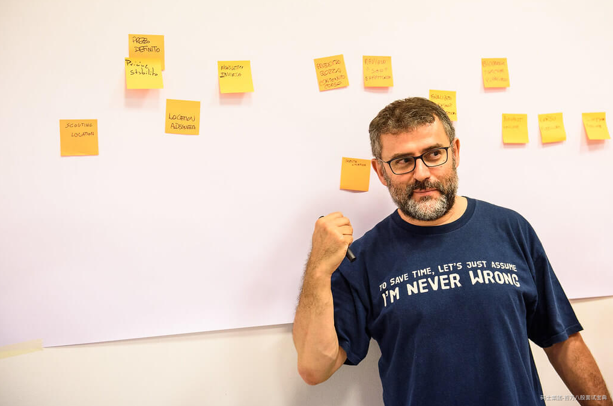

### 事件风暴目的

统一语言的素材，包含对商业流程的共同理解，包含名词使用、责任范围、使用者体验等。

—份整体流程的概览图(Big Picture)

可以找出商业流程中的核心价值、风险与机会。

导入DDD的好起点

### 什么是事件风暴

探索功能 找出盲点 建立共识

### 事件风暴的优点

快速

事件风暴方法减少了创建全面的业务域模型所需的时间。过去需要数周的时间，一次研讨会可以在几个小时内完成。

简单明确

事件风暴不使用复杂的UML，而是将过程分解为技术和非技术利益相关者都可以理解的简单术语。不需要有过多准备，直接识别利益相关者就可以开始。

参与

事件风暴的目标之一是使建模变得有趣。这是一种动手的领域建模方法，可邀请每个人参与和交互。除了使参与者更加愉快之外，事件参与者还可以使参与者获得更多有价值的见解，因为参与者可以更轻松地参与该过程并提供他们的建议和专业知识。

有效

事件风暴不是数据建模，但通过大家讨论可以快速实施和验证的行为模型。同时为了获得最佳结果，团队应将事件风暴与面向领域驱动设计的实施相结合。

### 事件风暴应用场景

**Big Picture（概览图）**

厘清混沌商业系统，凸显出合作关系、边界、责任归属与不同利益相关者的观点。邀请任何有兴趣的人、不用限制讨论范围。

找出瓶颈、核心价值甚至是新的解决方案

主要以Event.、 System、Question为主。

适合新创或小团队(人少、技术债少)

**Process Modelling（流程模型）**

讨论特定功能流程，以确保大家理解没有明显分歧，最后达到理解的一致性。

有明确范围，所以路径越完整越好。

在细节中找出流程的Bug，并且每个Bug都需要被处理。

包含Event、Actor、Command、 System、Policy、 Read Modelo

**Software Design（软件开发）**

利用前面的产出进一步设计软件

加入Aggregate（聚合）、 BoundedContext（限界上下文）建立模型边界。

用词更加精准

### 事件风暴准备

提前准备：人事时地物

#### 场地设置

- 找到一面限制最少的表面来进行活动。不管是墙面、窗边甚至用多面移动白板组成都可以。你无法预测最后的产出有多少，所以尽你所能，不要因为空间而限制活动的品质。

- 在表面上贴上大型画纸卷方便收纳产出以及进行另一场Event Storming

- 以最大化活动空间。将现场的杂物移开，不过可以留下一张小桌子放道具。

- 一定要将椅子移走。经验中，只要有人坐下，就会开始沉默，最后自我放逐。。(建议)一面白板或海报写上名词定义清单。这场会议中的对话都要遵照清单上的用词。

- 提供几张有图示标明(Legend)的海报纸。

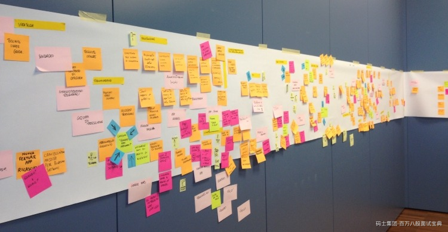

### 海报纸

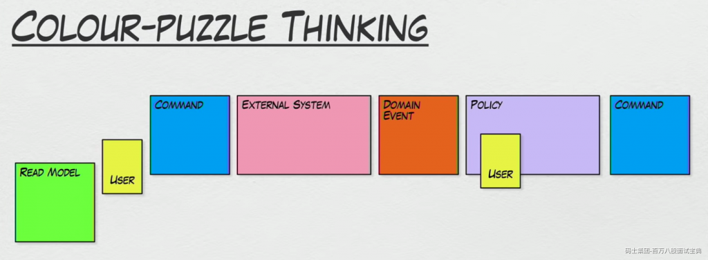

### 邀请正确的人来参与

传统的建模过程通常需要一名或几名研发人员来一起进行类设计、接口设计，通讯协议和数据映射等。而事件风暴则可能是较大的不同团队的成员来一起构建领域模型。

谁是合适的人?根据Brandolini的说法，他们是知道提出正确问题和拥有答案的人。该小组可能是代表用户体验，业务，架构，开发，运维和营销等利益相关者的混合体。

**主持人/Facilitator:**

建议一定要有一名参与者负责主持会议进行、推动议程讨论。要严格注意时间与流程。最好不要跟Domain Expert重复。

**领域专家(们)Domain expert(s):**

专案的主要推动者，或是拥有足够领域知识的人，建议最好有一定的决定权，在陷入泥沼时才可以做出决定。如果是新创领域，可以事先做好使用者访谈或是找使用者来参加。可以不只一名。

**其他利益相关者Other Stackholder:**

可能是参与专案的工程师、设计师，也可能任何能提供专业意见的人士如业务、商业分析师甚至是主管。

### 事件分类颜色

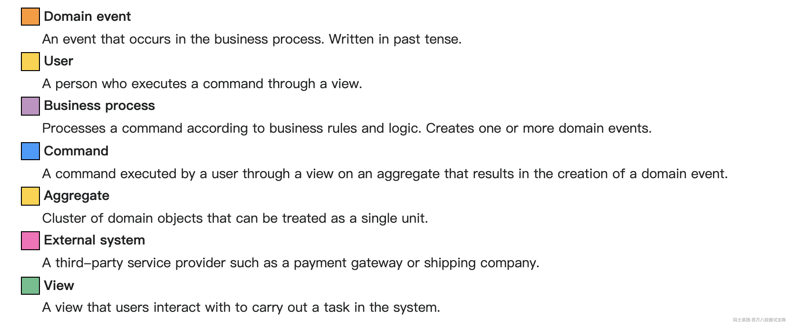

•橘色（正方形 76\*76）：Event 事件

•蓝色（正方形）：Command 命令

•紫色（长方形）: Policy/Process 商业政策/流程

•黄色（小张长方形）:Actor 角色

•黄色（长方形）:Aggregate 聚合

•粉红色（长方形）：System 外部系统

•红色（正方形）:Hotspot 热点

•红色（小张长方形）:Problem 疑问

•绿色（小张长方形）:Opportunity 机会

•绿色（正方形）：Read Model 资料读取模型

•白色（大张正方形）：Uset Interface 使用者介面

### 实施步骤

**从事件开始**

主持人会先请领域专家简介专案需求，然后由领域专家(或是主持人)在画面正中央贴上第一张Event。贴在中

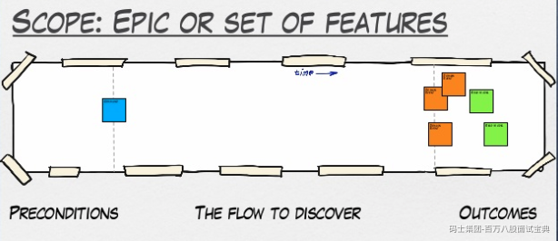

1.橘色便利贴。

2.使用过去式(根据Alberto Brandolini本人的叙述，使用过去式代表着系统的状态)如订单已成立、货物已送出、早餐已买到等等。

3.领域专家所在乎的事件。

如整合第三方物流时，领域专家可能只在乎送达时间而不在乎中间细节的运输过程。

4.有时间性，请从左到右排列。同时加上时间概念。

如「凌晨三点帐款已对帐完成」、「午夜十二点马车已变成南瓜」，甚至是某个时间点，如「本季度已结束」

「已过了一个月」。

5.可以加上原因。

如「因为密码输入错误三次，所以帐号已被锁住」。

比如商城的订单模块 用户下单事件

状态 主流程

待支付 待审核 待发货 。。。。

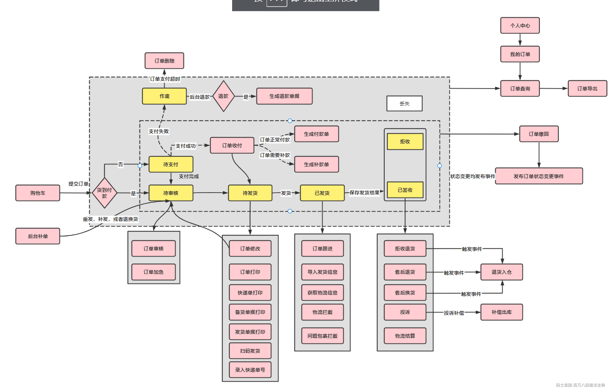

**提出问题：**

比如(主持人此时重要功能是将大家讨论全部针对事情上来)主持人鼓励随时打断、不要放过任何模棱两可，比如:

- 我不懂

- 商业逻辑和自己理解不同

- 与现有的处理逻辑不同

- 用户体验差

**热点问题（HotSpot)**

如果过程中某个节点卡住太久，很有可能是因为领域专家也不太了解这个问题，也有可能是目前资料量不足以做出决定。先贴上一张45度角旋转后的红色的Hotspot待日后解决。

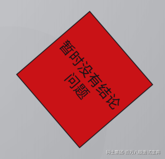

**Command**

·事件的触发器

**Read Model**

一些读取的信息

**System**

Policy

围绕Aggregate对事件和命令进行分组。

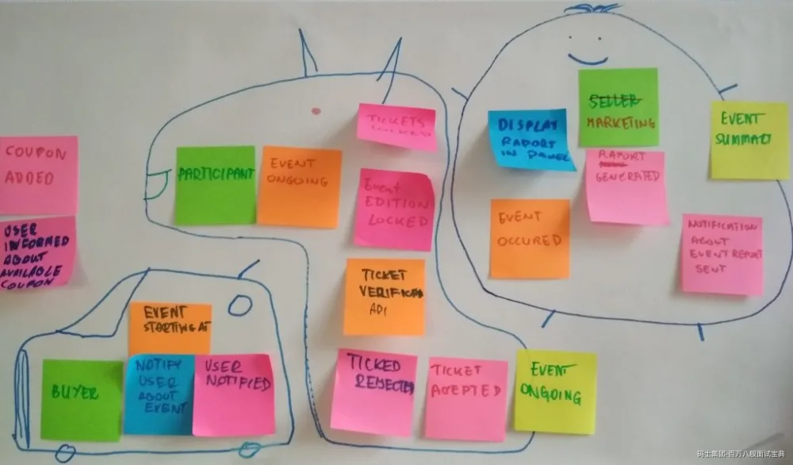

Aggregate想成是一个State Machine(有限状态机)，一个Model会有很多的状态，因此一种Aggregate可能会对应到多组Command与Event。

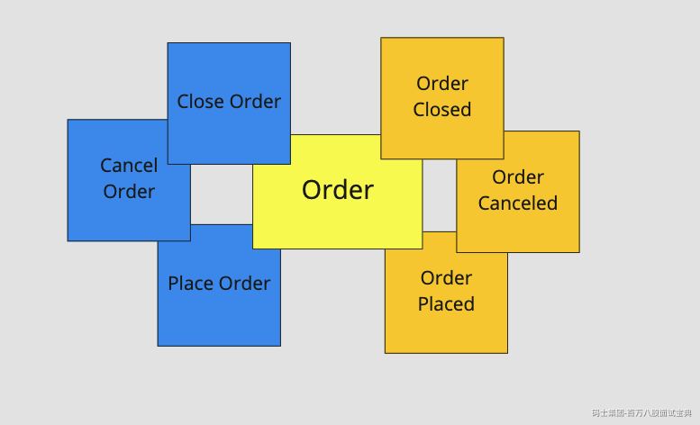

最终聚合定义的模型再结合DDD

如何设计一个电商项目

DDD可以将业务分析与技术进行分离。

我们在进行领域驱动设计时，需要考虑战略设计以及战术设计。包括架构选型。

#### **设计流程**

- 战略设计通过限界上下文从全局的角度规划整个系统的业务模块

- 逐步细化,对每个模块开展事件风暴会议进行领域建模

- 逐步落实到每个模块的数据库设计与微服务设计以及需要涉及的分布式技术与云端部署

我们就以我们的一体化商城平台项目为例，我们的一体化商城项目是一套集物流，仓储，电商为一体的智慧电商平台。同时，服务于广大的中小型商家。商家可以在平台进行申请开店。平台提供对应的第三方物流，仓储以及一系列交易保证功能。

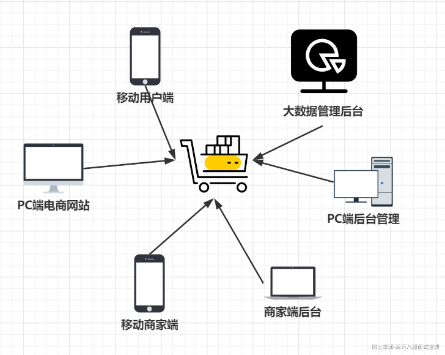

一体化商城系统

- 移动用户端 + PC端电商网站

- PC端商家后台 + 移动端商家后台

- PC端后台管理

- 大数据管理后台

基于限界上下文进行粗略划分，分配给不同团队开发

并且需要明确每个团队的支撑子域，不同的团队提供什么接口。每个产品线都配备一名技术专家，负责解决微服务或者领域相关问题.一名技术经理或技术负责人,负责团队敏捷开发,周期迭代以及代码质量把控.

整个项目由架构师进行管理. 架构师与技术专家组成架构委员会.进行公共支持.区分什么团队提供什么接口支持.

接下来就到了具体的团队内部职责划分,各个产品线再进行精细化划分，每个模块按照事件风暴的方式，划分成多个聚合,比如APP端下单操作

就可以参照我们上面的方式,设计出用例模型,用例描述以及领域模型.

而后续才会到我们的建模阶段.事件风暴只是其中的一种.还有四色建模法等等很多的方法.

模型建立完毕之后.我们就可以根据每个模块的特定需求去设计我们的架构图.

并且需要明确每个团队的支撑子域，不同的团队提供什么接口。每个产品线都配备一名技术专家，负责解决微服务或者领域相关问题.一名技术经理或技术负责人,负责团队敏捷开发,周期迭代以及代码质量把控.

整个项目由架构师进行管理. 架构师与技术专家组成架构委员会.进行公共支持.区分什么团队提供什么接口支持.

接下来就到了具体的团队内部职责划分,各个产品线再进行精细化划分，每个模块按照事件风暴的方式，划分成多个聚合,比如APP端下单操作

就可以参照我们上面的方式,设计出用例模型,用例描述以及领域模型.

而后续才会到我们的建模阶段.事件风暴只是其中的一种.还有四色建模法等等很多的方法.

模型建立完毕之后.我们就可以根据每个模块的特定需求去设计我们的架构图.

**架构技术填充（商城项目技术架构图）**

选择合适的技术进行使用

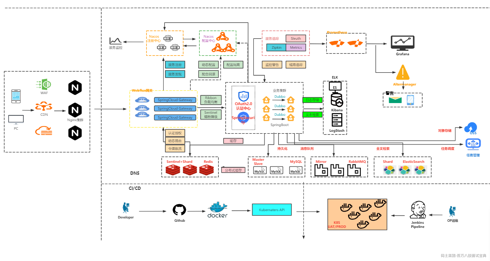
