**Apache Airflow**

## 0.1 什么是Airflow

Apache Airflow是一个提供基于DAG有向无环图来编排工作流的、可视化的分布式任务调度平台，与Oozie、Azkaban等任务流调度平台类似。Airflow在2014年由Airbnb发起，2016年3月进入Apache基金会，在2019年1月成为顶级项目。Airflow采用Python语言编写，提供可编程方式定义DAG工作流，可以定义一组有依赖的任务，按照依赖依次执行， 实现任务管理、调度、监控功能。

另外，Airflow提供了WebUI可视化界面，提供了工作流节点的运行监控，可以查看每个节点的运行状态、运行耗时、执行日志等。也可以在界面上对节点的状态进行操作，如：标记为成功、标记为失败以及重新运行等。在Airflow中工作流上每个task都是原子可重试的，一个工作流某个环节的task失败可自动或手动进行重试，不必从头开始跑。

Airflow官网：<http://airflow.apache.org/>，Airflow支持的任务调度类型如下：

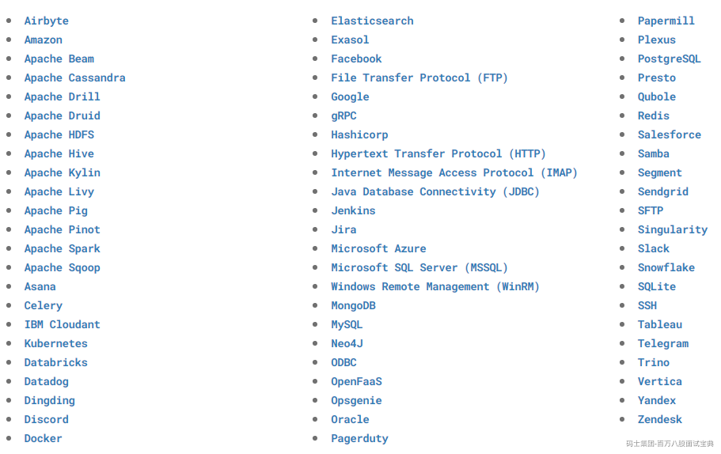

## 0.2 Airflow架构及原理

### 0.2.1 Airflow架构

Airflow我们可以构建Workflow工作流，工作流使用DAG有向无环图来表示，DAG指定了任务之间的关系，如下图：

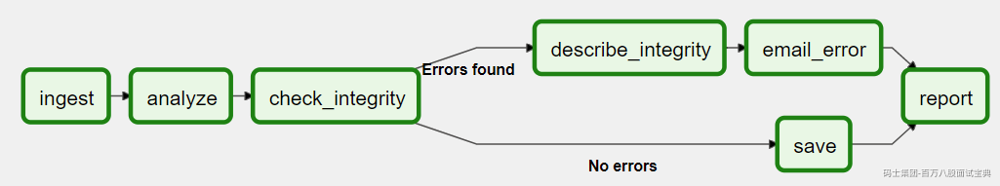

Airflow架构图如下：

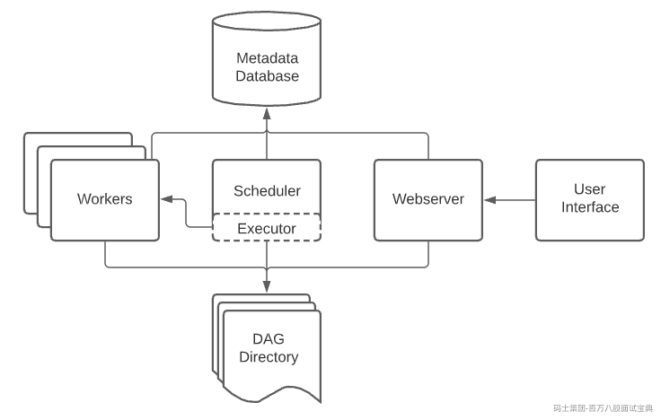

Airflow在运行时有很多守护进程，这些进程提供了airflow全部功能，守护进程包括如下：

- webserver：

WebServer服务器可以接收HTTP请求，用于提供用户界面的操作窗口，主要负责中止、恢复、触发任务；监控任务；断点续跑任务；查询任务状态、详细日志等。

- Scheduler:

调度器，负责周期性调度处理工作流，并将工作流中的任务提交给Executor执行。

- Executor:

执行器，负责运行task任务，在默认本地模式下（单机airflow）会运行在调度器Scheduler中并负责所有任务的处理。但是在airflow集群模式下的执行器Executor有很多类型，负责将任务task实例推送给Workers节点执行。

在Airflow中执行器有很多种选择，最关键的执行器有以下几种：

1. SequentialExecutor：默认执行器，单进程顺序执行任务，通常只用于测试。
2. LocalExecutor:多进程本地执行任务。
3. CeleryExecutor：分布式执行任务，多用于生产场景，使用时需要配置消息队列。
4. DaskExecutor:动态任务调度，支持远程集群执行airflow任务。

生产环境中建议使用CeleryExecutor作为执行器，Celery是一个分布式调度框架，本身无队列功能，需要使用第三方插件，例如：RabbitMQ或者Redis。

关于不同Executor类型可以参考官网：<https://airflow.apache.org/docs/apache-airflow/stable/executor/index.html>

- work:

Worker负责执行具体的DAG任务，会启动1个或者多个Celery任务队列，当ariflow的Executor设置为CeleryExecutor时才需要开启Worker进程。

- DAG Directory:

存放定义DAG任务的Python代码目录，代表一个Airflow的处理流程。需要保证Scheduler和Executor都能访问到。

- metadata database:

Airflow的元数据库，用于Webserver、Executor及Scheduler存储各种状态数据，通常是MySQL或PostgreSQL。

### 0.2.2 Airflow术语

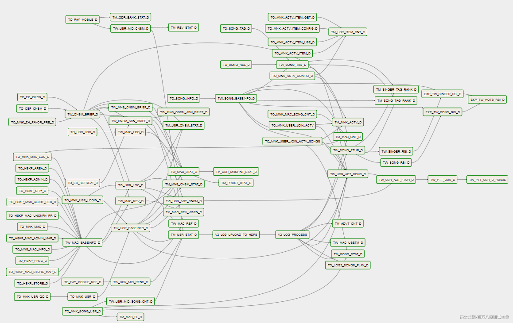

- **DAG**

DAG是Directed Acyclic Graph有向无环图的简称，描述其描述数据流的计算过程。

- **Operators**

描述DAG中一个具体task要执行的任务，可以理解为Airflow中的一系列“算子”，底层对应python class。不同的Operator实现了不同的功能，如：BashOperator为执行一条bash命令，EmailOperator用户发送邮件，HttpOperators用户发送HTTP请求，PythonOperator用于调用任意的Python函数。

- **Task**

Task是Operator的一个实例，也就是DAG中的一个节点，在某个Operator的基础上指定具体的参数或者内容就形成一个Task，DAG中包含一个或者多个Task。

- **Task Instance**

task每一次运行对应一个Task Instance，Task Instance有自己的状态，例如：running,success,failed,skipped等。

- **Task Relationships：**

一个DAG中可以有很多task，这些task执行可以有依赖关系，例如：task1执行后再执行task2，表明task2依赖于task1，这就是task之间的依赖关系。

### 0.2.3 Airflow工作原理

airflow中各个进程彼此之间是独立不互相依赖，也不互相感知，每个进程在运行时只处理分配到自身的任务，各个进程在一起运行，提供了Airflow全部功能，其工作原理如下：

1. 调度器Scheduler会间隔性轮询元数据库（Metastore）已注册的DAG有向无环图作业流，决定是否执行DAG，如果一个DAG根据其调度计划需要执行，Scheduler会调度当前DAG并触发DAG内部task，这里的触发其实并不是真正的去执行任务，而是推送task消息到消息队列中，每一个task消息都包含此task的DAG ID,Task ID以及具体需要执行的函数，如果task执行的是bash脚本，那么task消息还会包含bash脚本代码。
2. Worker进程将会监听消息队列，如果有消息就从消息队列中获取消息并执行DAG中的task，如果成功将状态更新为成功，否则更新成失败。
3. 用户可以通过webserver webui来控制DAG，比如手动触发一个DAG去执行，手动触发DAG与自动触发DAG执行过程都一样。

## 0.3 Airflow单机搭建

Airflow是基于Python的，就是Python中的一个包。安装要求Python3.6版本之上，Metadata DataBase支持PostgreSQL9.6+，MySQL5.7+，SQLLite3.15.0+。

### 0.3.1 安装Anconda及python3.7

1. **官网下载Anconda ,选择linux版本，并安装**

下载官网地址：[https://www.anaconda.com/products/individual#macos](https://www.anaconda.com/products/individual" \l "macos)

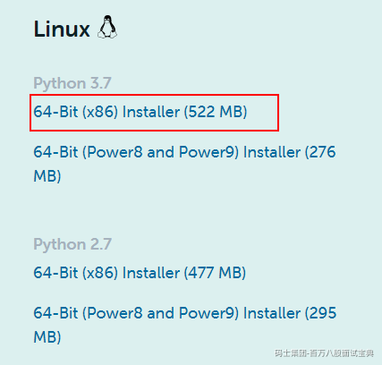

1. **将下载好的anconda安装包上传至mynode4节点，进行安装**

1. **配置Anconda的环境变量**

1. **安装python3.7 python环境**

1. **激活使用python37 python环境**

相关命令如下：

### 0.3.2 单机安装Airflow

单节点部署airflow时，所有airflow 进程都运行在一台机器上，架构图如下：

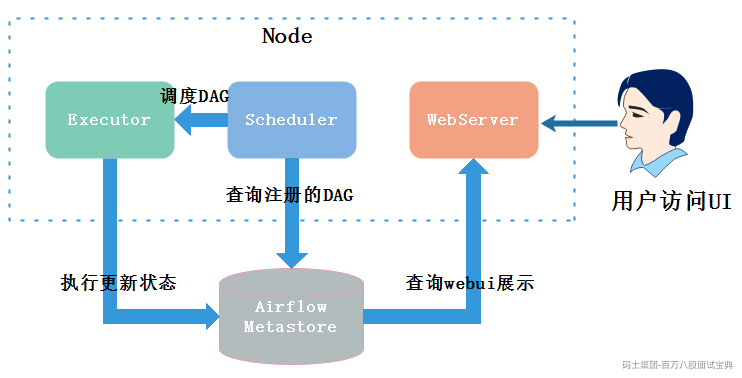

1. **安装Airflow必须需要的系统依赖**

Airflow正常使用必须需要一些系统依赖，在mynode4节点上安装以下依赖：

1. **在MySQL中创建对应的库并设置参数**

aiflow使用的Metadata database我们这里使用mysql,在node2节点的mysql中创建airflow使用的库及表信息。

在mysql安装节点node2上修改”/etc/my.cnf”，在[mysqld]下添加如下内容：

*注意：以上配置explicit\_defaults\_for\_timestamp 系统变量决定MySQL服务端对timestamp列中的默认值和NULL值的不同处理方法。此变量自MySQL 5.6.6 版本引入，默认值为0，在默认情况下，如果timestamp列没有显式的指明null属性，那么该列会被自动加上not null属性，如果往这个列中插入null值，会自动的设置该列的值为current timestamp值。当这个值被设置为1时，如果timestamp列没有显式的指定not null属性，那么默认的该列可以为null，此时向该列中插入null值时，会直接记录null，而不是current timestamp，如果指定not null 就会报错。*

在Airflow中需要对应mysql这个参数设置为1。以上修改完成“my.cnf”值后，重启Mysql即可，重启之后，可以查询对应的参数是否生效：

1. **安装Airflow**

在node4上切换python37环境，安装airflow，指定版本为2.1.3

默认Airflow安装在$ANCONDA\_HOME/envs/python37/lib/python3.7/site-packages/airflow目录下。Airflow文件存储目录默认在/root/airflow目录下，但是这个目录需要执行下“airflow version”后自动创建，查看安装Airflow版本信息：

*注意：如果不想使用默认的“/root/airflow”目录当做文件存储目录，也可以在安装airflow之前设置环境变量：*

*这样安装完成的airflow后，查看对应的版本会将“AIRFLOW\_HOME”配置的目录当做airflow的文件存储目录。*

1. **配置Airflow使用的数据库为MySQL**

打开配置的airflow文件存储目录，默认在$AIRFLOW\_HOME目录“/root/airflow”中，会有“airflow.cfg”配置文件，修改配置如下：

1. **安装需要的python依赖包**

初始化Airflow数据库时需要使用到连接mysql的包，执行如下命令来安装mysql对应的python包。

1. **初始化Airflow 数据库**

初始化之后在MySQL airflow库下会生成对应的表。

1. **创建管理员用户信息**

在node4节点上执行如下命令，创建操作Airflow的用户信息:

执行完成之后，设置密码为“123456”并确认，完成Airflow管理员信息创建。

### 0.3.3 启动Airflow

1. **启动webserver**

1. **启动scheduler**

新开窗口，切换python37环境，启动Schduler：

1. **访问Airflow webui**

浏览器访问：<http://node4:8080>

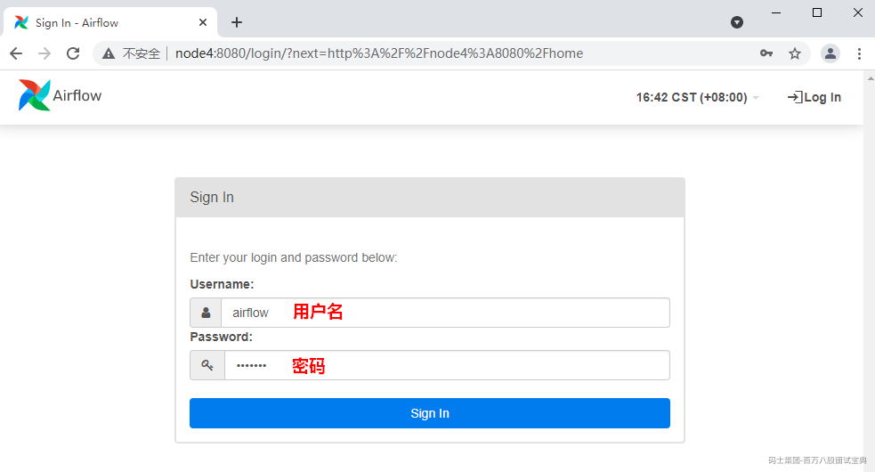

输入前面创建的用户名：airflow 密码：123456

## 0.4 Airflow WebUI操作介绍

### 0.4.1 DAG

DAG有对应的id,其id全局唯一，DAG是airflow的核心概念，任务装载到DAG中，封装成任务依赖链条，DAG决定这些任务的执行规则。

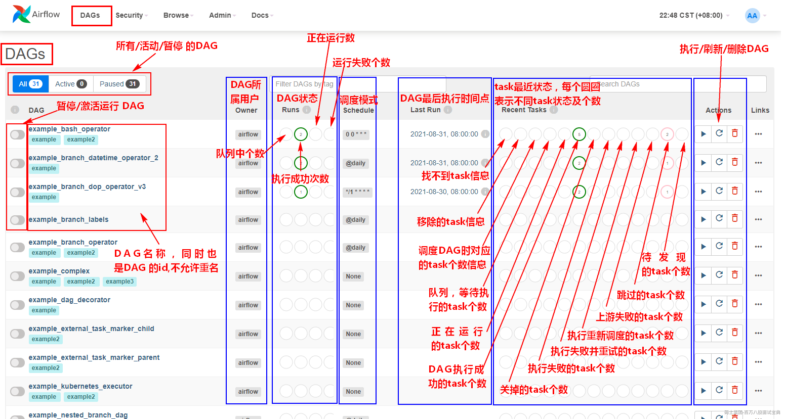

点击以上每个DAG对应的id可以直接进入对应“Graph View”视图，可以查看当前DAG任务执行顺序图。

以上“Runs”列与“Recent Tasks”列下的“圆圈”代表当前DAG执行的某种状态，鼠标放到对应的“圆圈”上可以查看对应的提示说明。点击以上“Links”之后，出现以下选项：

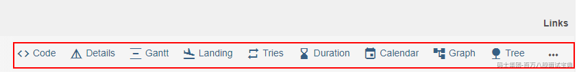

- **Tree View**

将DAG以树的形式表示，如果执行过程中有延迟也可以通过这个界面查看问题出现在哪个步骤，在生产环境下，经常通过这个页面查看每个任务执行情况。

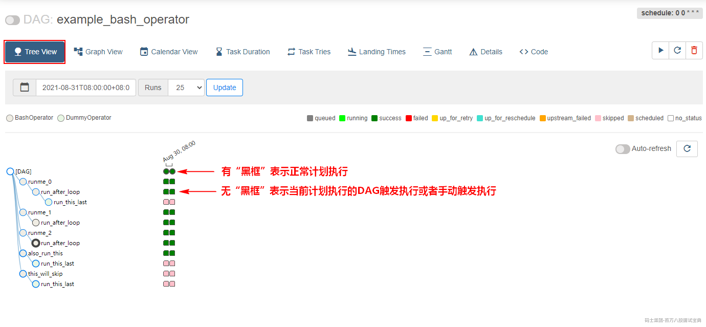

点击以上每个有颜色的“小块”都可以看到task详情：

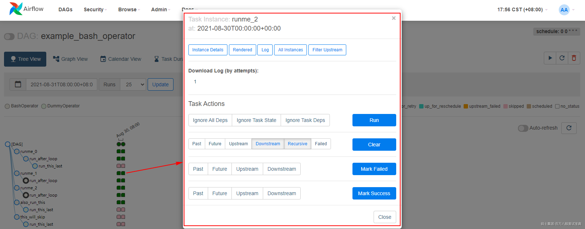

- **Graph View**

此页面以图形方式呈现DAG有向无环图，对于理解DAG执行非常有帮助，不同颜色代表task执行的不同状态。

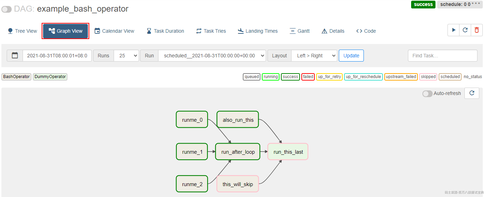

点击任意一个task，都可以看到当前task执行情况：

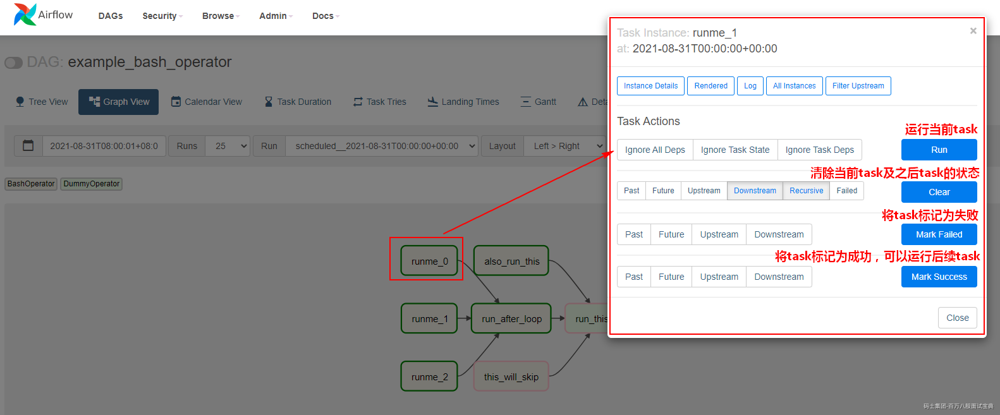

- **Calendar View**

日期视图，显示当前年每月每天任务执行情况。

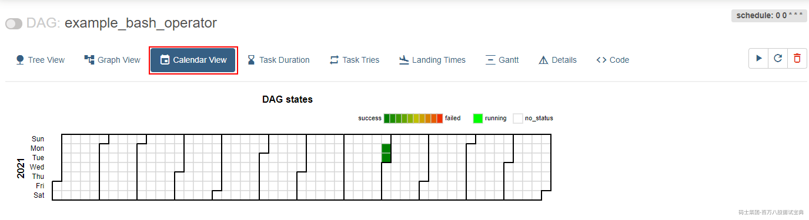

- **Task Duration**

此视图表示不同的task在过去每天执行的时长，可以通过每日执行时长对比，发现同一个task执行耗时情况。

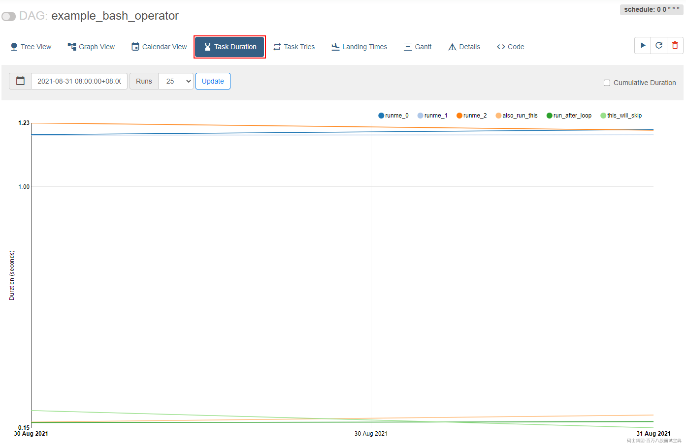

- **Task Tries**

此视图显示每个task重试次数情况。

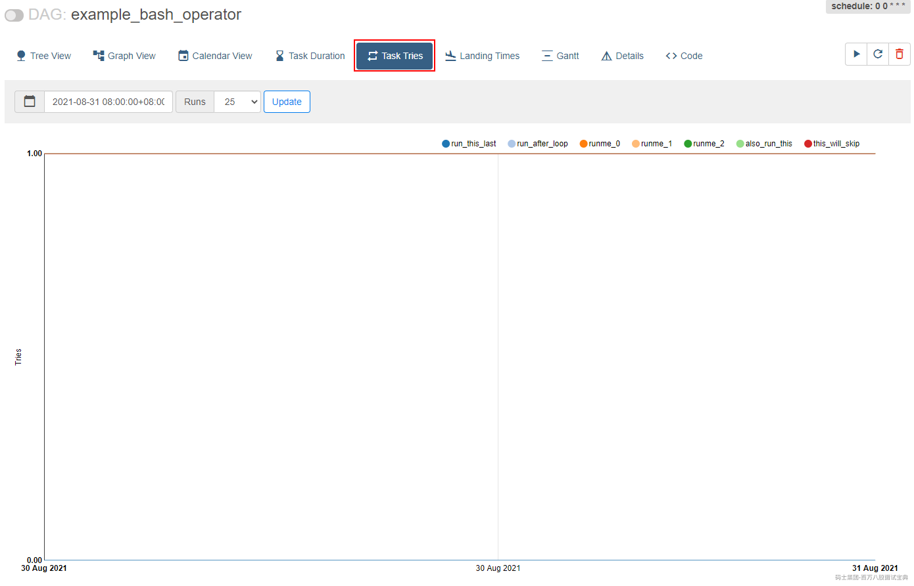

- **Landing Times**

Landing Times显示每个任务实际执行完成时间减去该task定时设置调度的时间，得到的小时数，可以通过这个图看出任务每天执行耗时、延迟情况。

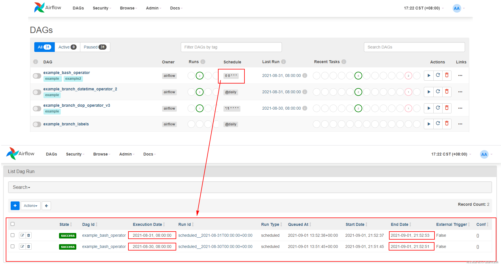

以上得到的“Landing Times”如下：

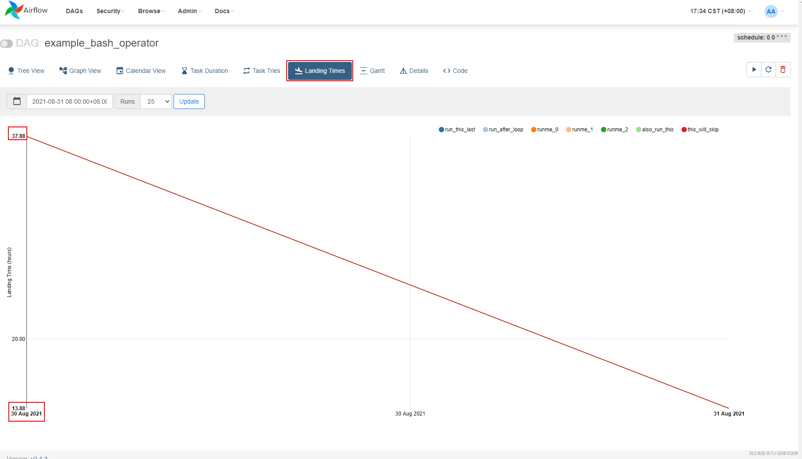

- **Gantt**

甘特图，可以通过甘特图来分析task执行持续时间和重叠情况，可以直观看出哪些task执行时间长。

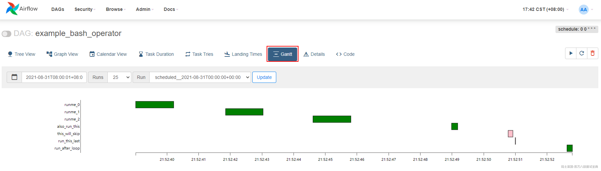

- **Details**

可以通过“Details”发现任务详细情况。

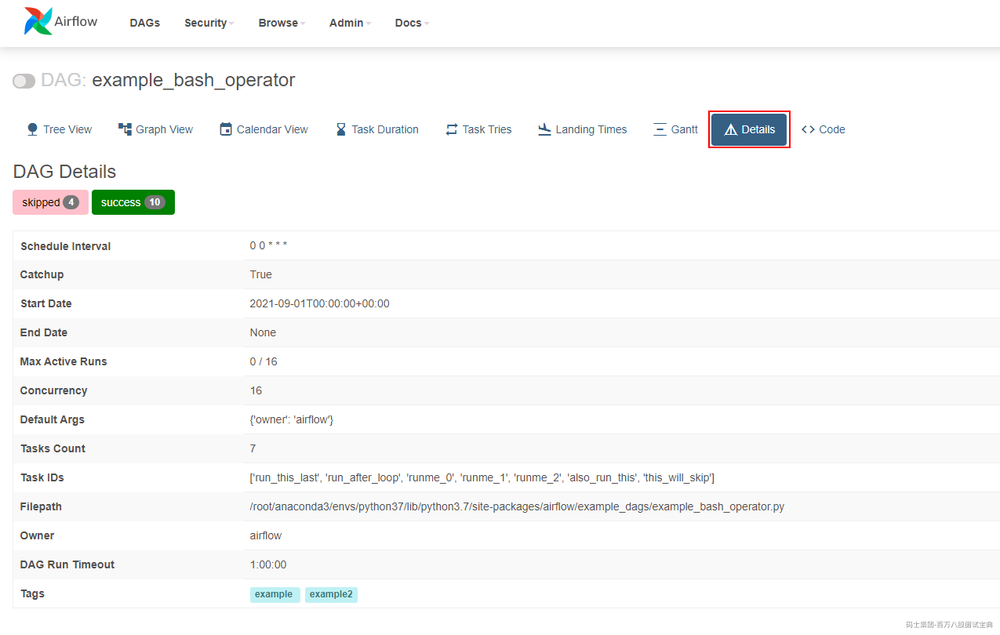

- **Code**

Code页面主要显示当前DAG python代码编码，当前DAG如何运行以及任务依赖关系、执行成功失败做什么，都可以在代码中进行定义。

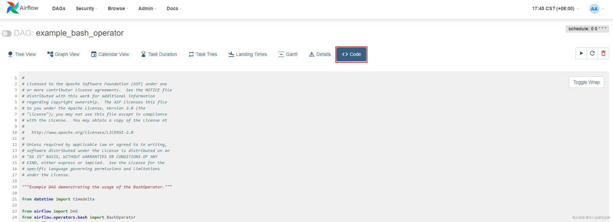

### 0.4.2 Security

“Security”涉及到Airflow中用户、用户角色、用户状态、权限等配置。

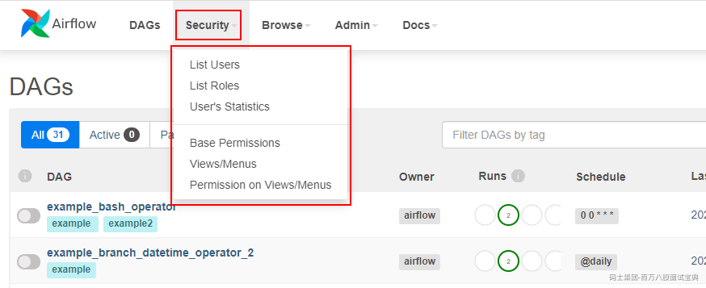

### 0.4.3 Browse

- **DAG Runs**

显示所有DAG状态

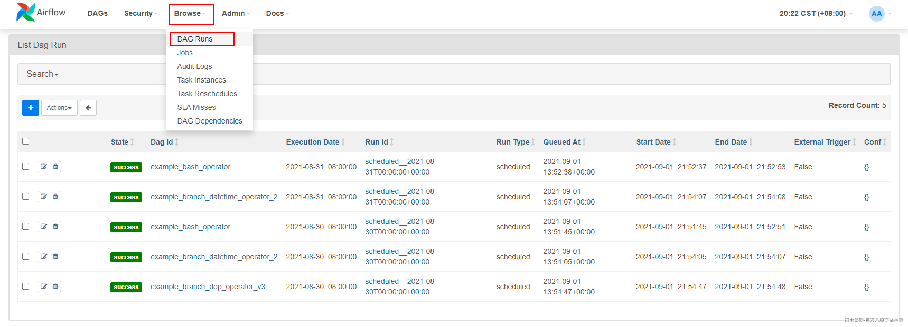

- **Jobs**

显示Airflow中运行的DAG任务

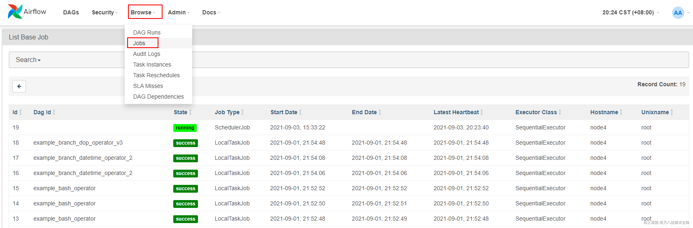

- **Audit Logs**

审计日志，查看所有DAG下面对应的task的日志，并且包含检索。

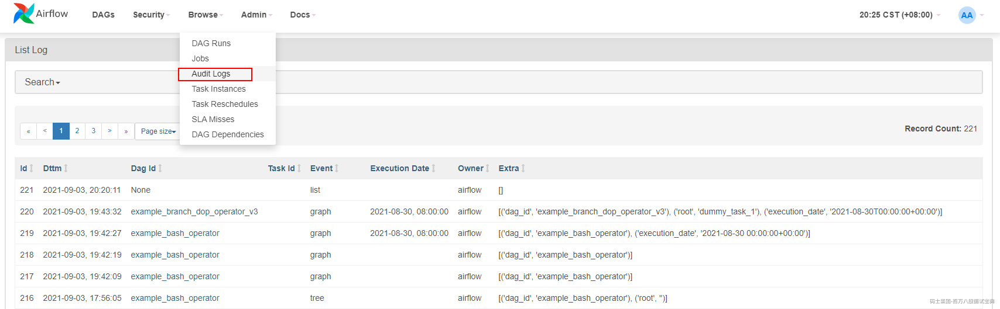

- **Task Instances**

查看每个task实例执行情况。

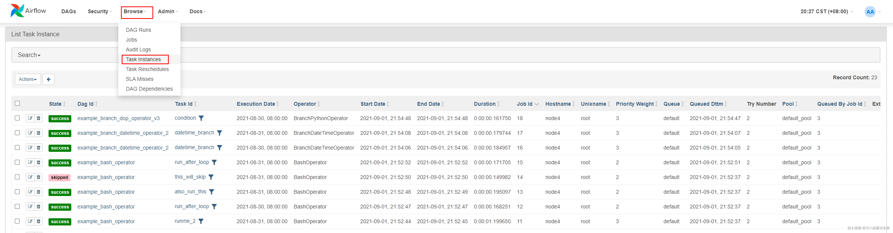

- **Task Reschedules**

Task 重新调度的实例情况。

- **SLA Misses**

如果有一个或者多个实例未成功，则会发送报警电子邮件，此选项页面记录这些事件。

- **DAG Dependencies**

查看DAG任务对应依赖关系。

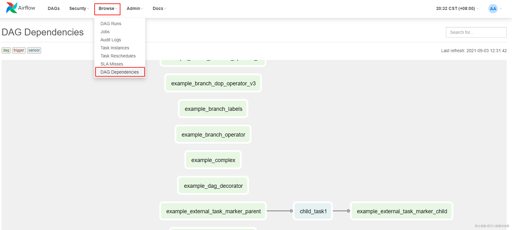

### 0.4.4 Admin

在Admin标签下可以定义Airflow变量、配置Airflow、配置外部连接等。

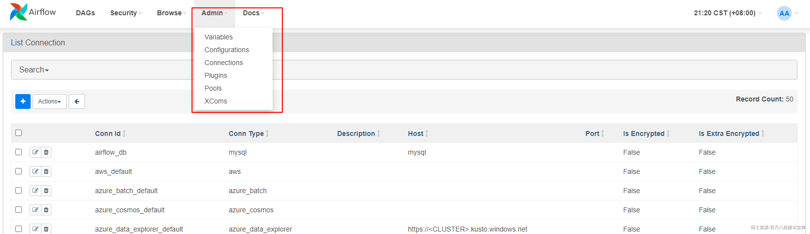

### 0.4.5 Docs

Docs中是关于用户使用Airflow的一些官方使用说明文档连接。

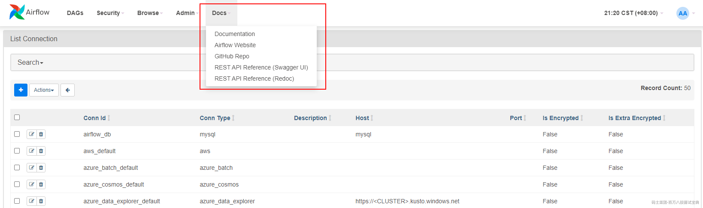

## 0.5 Airflow使用

上文说到使用Airflow进行任务调度大体步骤如下：

1. **创建python文件，根据实际需要，使用不同的Operator**
2. **在python文件不同的Operator中传入具体参数，定义一系列task**
3. **在python文件中定义Task之间的关系，形成DAG**
4. **将python文件上传执行，调度DAG，每个task会形成一个Instance**
5. **使用命令行或者WEBUI进行查看和管理**

以上python文件就是Airflow python脚本，使用代码方式指定DAG的结构。

### 0.5.1 Airflow调度Shell命令

下面我们以调度执行shell命令为例，来讲解Airflow使用。

1. **首先我们需要创建一个python文件，导入需要的类库**

注意：以上代码可以在开发工具中创建，但是需要在使用的python3.7环境中导入安装Airflow包。

1. **实例化DAG**

注意：

- 实例化DAG有三种方式

第一种方式：

第二种方式（以上采用这种方式）：

第三种方式：

- baseoperator基础参数说明：

可以参照：

<http://airflow.apache.org/docs/apache-airflow/stable/_api/airflow/models/baseoperator/index.html#module-airflow.models.baseoperator>查看baseopartor中更多参数。

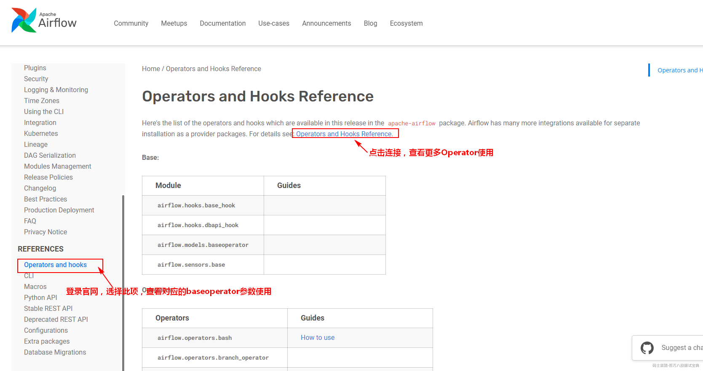

- DAG参数说明

可以参照：

<http://airflow.apache.org/docs/apache-airflow/stable/_api/airflow/models/dag/index.html> 查看DAG参数说明，也可以直接在开发工具点击DAG进入源码看下对应参数有哪些。

1. **定义Task**

当实例化Operator时会生成Task任务，从一个Operator中实例化出来对象的过程被称为一个构造方法，每个构造方法中都有“task\_id”充当任务的唯一标识符。

下面我们定义三个Operator，也就是三个Task，每个task\_id 不能重复。

注意：

- 每个operator中可以传入对应的参数，覆盖DAG默认的参数，例如：last task中“retries”=3 就替代了默认的1。任务参数的优先规则如下：①.显示传递的参数 ②.default\_args字典中存在的值③.operator的默认值（如果存在）。
- BashOperator使用方式参照：<http://airflow.apache.org/docs/apache-airflow/stable/howto/operator/bash.html#howto-operator-bashoperator>

1. **设置task依赖关系**

注意：当执行脚本时，如果在DAG中找到一条环形链路（例如：A->B->C-A）会引发异常。更多DAG task依赖关系可参照官网：<http://airflow.apache.org/docs/apache-airflow/stable/concepts/dags.html#task-dependencies>

1. **上传python配置脚本**

到目前为止，python配置如下：

将以上python配置文件上传到$AIRFLOW\_HOME/dags目录下，默认$AIRFLOW\_HOME为安装节点的“/root/airflow”目录，当前目录下的dags目录需要手动创建。

1. **重启Airflow**

“ps aux|grep webserver”和“ps aux|grep scheduler”找到对应的airflow进程杀掉，重新启动Airflow。重启之后，可以在airflow webui看到对应的DAG ID ”myairflow\_execute\_bash”。

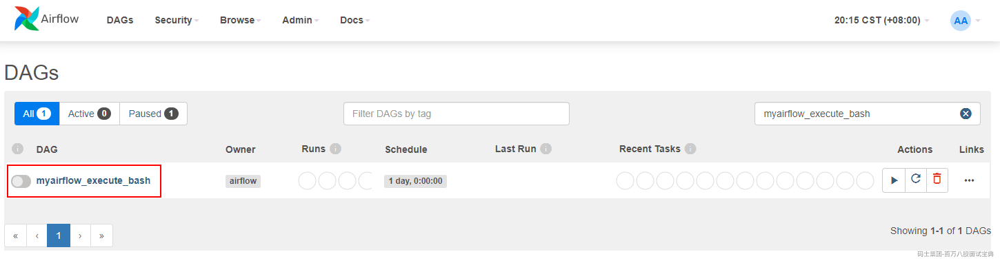

1. **执行airflow**

按照如下步骤执行DAG，首先打开工作流，然后“Trigger DAG”执行，随后可以看到任务执行成功。

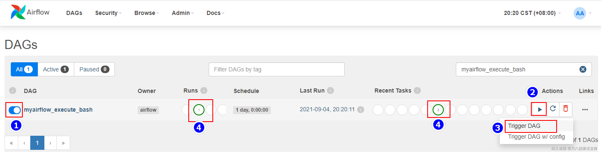

查看task执行日志：

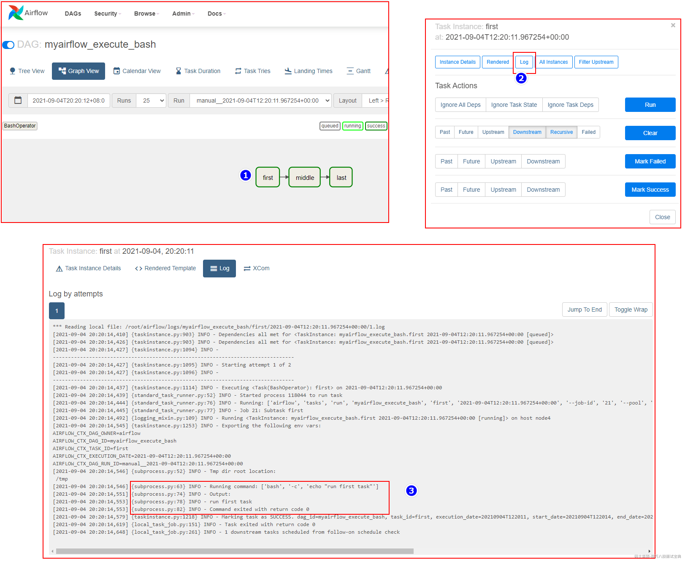

### 0.5.2 DAG调度触发时间

在Airflow中，调度程序会根据DAG文件中指定的“start\_date”和“schedule\_interval”来运行DAG。特别需要注意的是Airflow计划程序在计划时间段的末尾触发执行DAG，而不是在开始时刻触发DAG，例如：

以上配置的DAG是从世界标准时间2021年9月4号开始调度，每隔1天执行一次，这个DAG的具体运行时间如下图：

以上表格中以第一条数据为例解释，Airflow正常调度是每天00:00:00 ，假设当天日期为2021-09-04，正常我们认为只要时间到了2021-09-04 00:00:00 就会执行，改调度时间所处于的调度周期为2021-09-04 00:00:00 ~ 2021-09-05 00:00:00 ，在Airflow中实际上是在调度周期末端触发执行，也就是说2021-09-04 00:00:00 自动触发执行时刻为 2021-09-05 00:00:00。

如下图，在airflow中，“execution\_date”不是实际运行时间，而是其计划周期的开始时间戳。例如：execution\_date 是2021-09-04 00:00:00 的DAG 自动调度运行的实际时间为2021-09-05 00:00:00。当然除了自动调度外，我们还可以手动触发执行DAG执行，要判断DAG运行时计划调度（自动调度）还是手动触发，可以查看“Run Type”。

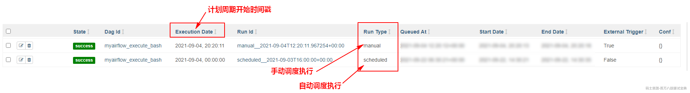

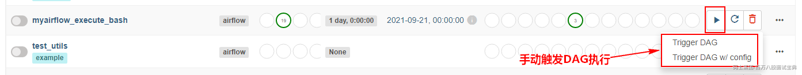

### 0.5.3 DAG catchup 参数设置

在Airflow的工作计划中，一个重要的概念就是catchup（追赶），在实现DAG具体逻辑后，如果将catchup设置为True（默认就为True）,Airflow将“回填”所有过去的DAG run，如果将catchup设置为False,Airflow将从最新的DAG run时刻前一时刻开始执行 DAG run，忽略之前所有的记录。

例如：现在某个DAG每隔1分钟执行一次，调度开始时间为2001-01-01 ，当前日期为2021-10-01 15:23:21，如果catchup设置为True，那么DAG将从2001-01-01 00:00:00 开始每分钟都会运行当前DAG。如果catchup 设置为False，那么DAG将从2021-10-01 15:22:20（当前2021-10-01 15:23:21前一时刻）开始执行DAG run。

举例：有first ,second,third三个shell命令任务，按照顺序调度，每隔1分钟执行一次，首次执行时间为2000-01-01。

设置catchup 为True（默认），DAG python配置如下：

上传python配置文件到$AIRFLOW\_HOME/dags下，重启airflow,DAG执行调度如下：

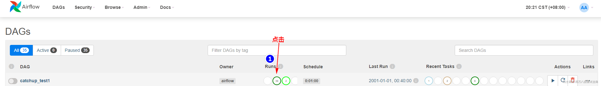

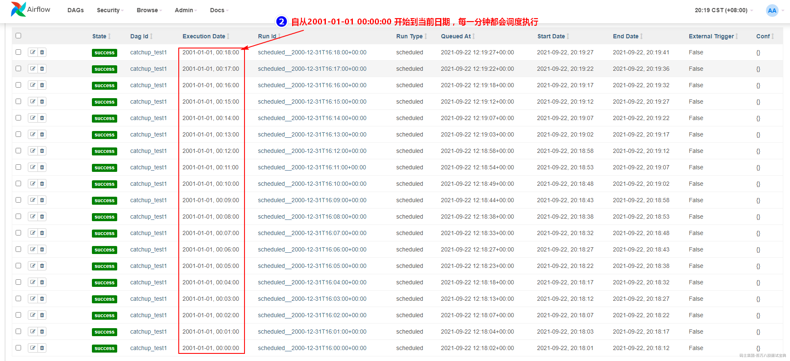

设置catchup 为False,DAG python配置如下：

上传python配置文件到$AIRFLOW\_HOME/dags下，重启airflow,DAG执行调度如下：

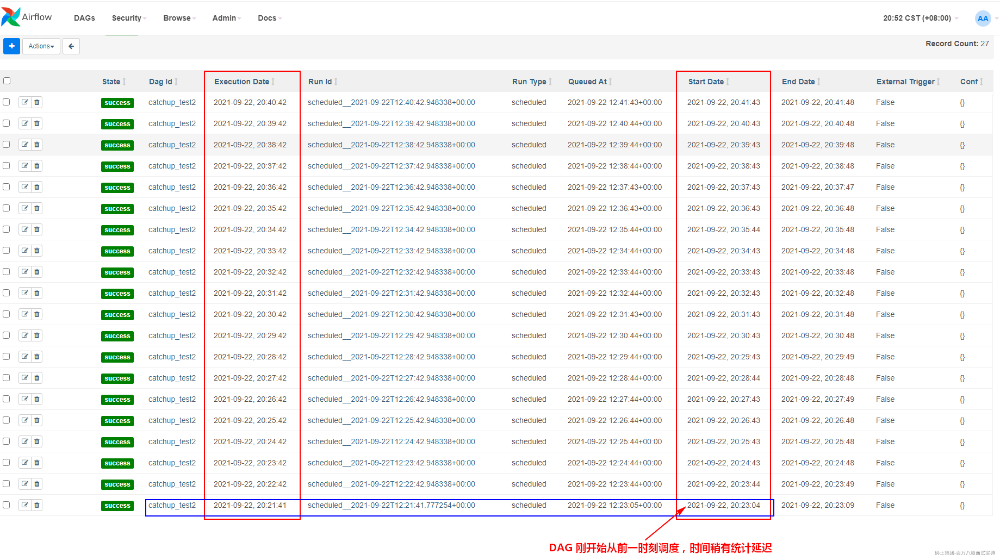

有两种方式在Airflow中配置catchup:

- **全局配置**

在airflow配置文件airflow.cfg的scheduler部分下，设置catchup\_by\_default=True（默认）或False，这个设置是全局性的设置。

- **DAG文件配置**

在python代码配置中设置DAG对象的参数：dag.catchup=True或False。

### 0.5.4 DAG调度周期设置

每个DAG可以有或者没有调度执行周期，如果有调度周期，我们可以在python代码DAG配置中设置“schedule\_interval”参数来指定调度DAG周期，可以通过以下三种方式来设置。

- **预置的Cron调度**

Airflow预置了一些Cron调度周期，可以参照：

<http://airflow.apache.org/docs/apache-airflow/stable/dag-run.html#cron-presets>，如下图：

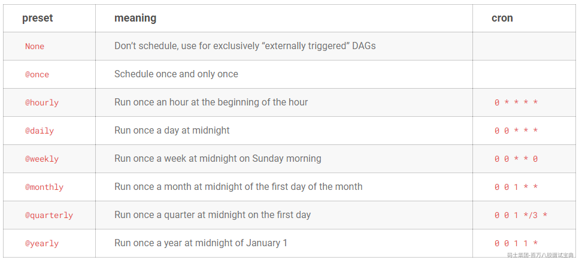

在python配置文件中使用如下：

- **Cron**

这种方式就是写Linux系统的crontab定时任务命令，可以在<https://crontab.guru/>网站先生成对应的定时调度命令，其格式如下：

以上各个字段中还可以使用特殊符号代表不同意思：

在python配置文件中使用如下：

- **datetime.timedelta**

timedelta是使用python timedelta 设置调度周期，可以配置天、周、小时、分钟、秒、毫秒。在python配置文件中使用如下：

### 0.5.5 DAG任务依赖设置

#### 0.5.5.1 DAG任务依赖设置一

- **DAG调度流程图**

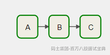

- **task执行依赖**

- **完整代码**

#### 0.5.5.2 DAG任务依赖设置二

- **DAG调度流程图**

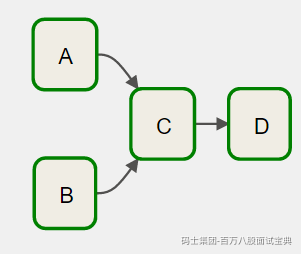

- **task执行依赖**

- **完整代码**

#### 0.5.5.3 DAG任务依赖设置三

- **DAG调度流程图**

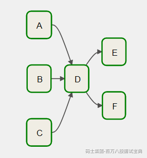

- **task执行依赖**

- **完整代码**

#### 0.5.5.4 DAG任务依赖设置四

- **DAG调度流程图**

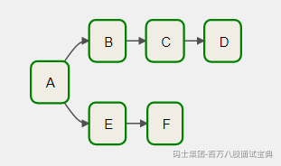

- **task执行依赖**

- **完整代码**

#### 0.5.5.5 DAG任务依赖设置五

- **DAG调度流程图**

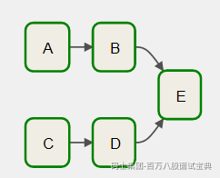

- **task执行依赖**

- **完整代码**

## 0.6 Airflow Operators及案例

Airflow中最重要的还是各种Operator，其允许生成特定类型的任务，这个任务在实例化时称为DAG中的任务节点，所有的Operator均派生自BaseOparator,并且继承了许多属性和方法。关于BaseOperator的参数可以参照：

[http://airflow.apache.org/docs/apache-airflow/stable/\_api/airflow/models/baseoperator/index.html#module-airflow.models.baseoperator](http://airflow.apache.org/docs/apache-airflow/stable/_api/airflow/models/baseoperator/index.html#module-airflow.models.baseoperator。)

BaseOperator中常用参数如下：

### 0.6.1 BashOperator及调度Shell命令及脚本

BashOperator主要执行bash脚本或命令，BashOperator参数如下：

- **BashOperator 调度Shell命令案例**

注意在t3中使用了Jinja模板，“”内部是for标签，用于循环操作，但是必须以结束。“{{}}”内部是变量，其中ds是执行日期，是airflow的宏变量，params.name和params.age是自定义变量。

在default\_args中的email是指当DAG执行失败时，发送邮件到指定邮箱，想要使用airflow发送邮件，需要在$AIRFLOW\_HOME/airflow.cfg中配置如下内容：

此外，关于邮箱的信息如下：

邮箱1：kettle\_test1@163.com password:kettle123456

邮箱2：kettle\_test2@163.com password:kettle123456

163邮箱SMTP服务器地址: smtp.163.com 端口：25

配置163邮箱时需要开启“POP3/SMTP/IMAP服务”服务，设置如下：

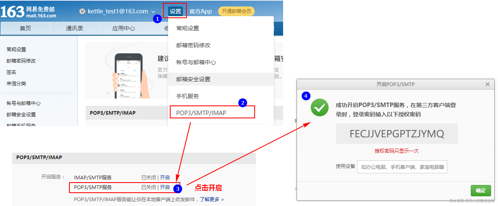

[kettle\_test1@163.com](mailto:kettle_test1@163.com) FECJJVEPGPTZJYMQ

[kettle\_test2@163.com](mailto:kettle_test1@163.com) VIOFSYMFDIKKIUEA

- **BashOperator 调度Shell脚本案例**

准备如下两个shell脚本,将以下两个脚本放在$AIRFLOW\_HOME/dags目录下，BashOperator默认执行脚本时，默认从/tmp/airflow\*\*临时目录查找对应脚本，由于临时目录名称不定，这里建议执行脚本时，在“bash\_command”中写上绝对路径。如果要写相对路径，可以将脚本放在/tmp目录下，在“bash\_command”中执行命令写上“sh ../xxx.sh”也可以。

**first\_shell.sh**

**second\_shell.sh**

编写airflow python 配置：

执行结果：

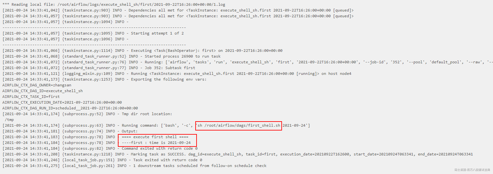

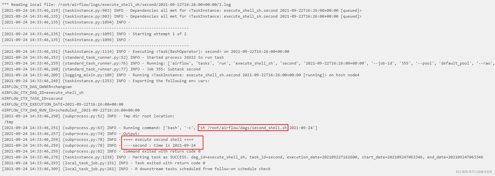

**特别注意：**在“bash\_command”中写执行脚本时，一定要在脚本后跟上空格，有没有参数都要跟上空格，否则会找不到对应的脚本。如下：

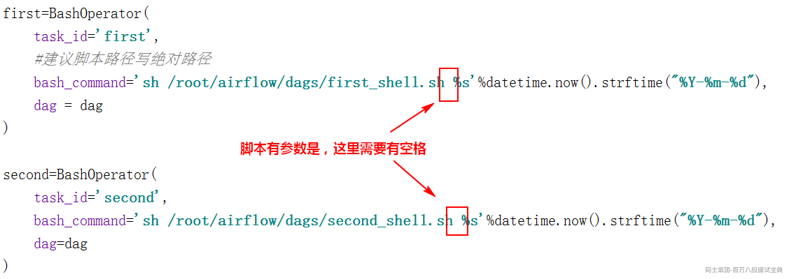

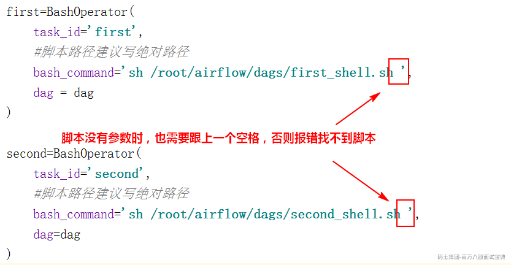

### 0.6.2 SSHOperator及调度远程Shell脚本

在实际的调度任务中，任务脚本大多分布在不同的机器上，我们可以使用SSHOperator来调用远程机器上的脚本任务。SSHOperator使用ssh协议与远程主机通信，需要注意的是SSHOperator调用脚本时并不会读取用户的配置文件，最好在脚本中加入以下代码以便脚本被调用时会自动读取当前用户的配置信息：

关于SSHOperator参数详解可以参照：

<http://airflow.apache.org/docs/apache-airflow-providers-ssh/stable/_api/airflow/providers/ssh/operators/ssh/index.html#module-airflow.providers.ssh.operators.ssh>

SSHOperator的常用参数如下：

- **SSHOperator调度远程节点脚本案例**

按照如下步骤来使用SSHOperator调度远程节点脚本：

1. **安装“apache-airflow-providers-ssh ”provider package**

首先停止airflow webserver与scheduler,在node4节点切换到python37环境，安装ssh Connection包。另外，关于Providers package安装方式可以参照如下官网地址：

<https://airflow.apache.org/docs/apache-airflow-providers/packages-ref.html#apache-airflow-providers-ssh>

1. **配置SSH Connection连接**

登录airflow webui ，选择“Admin”->“Connections”:

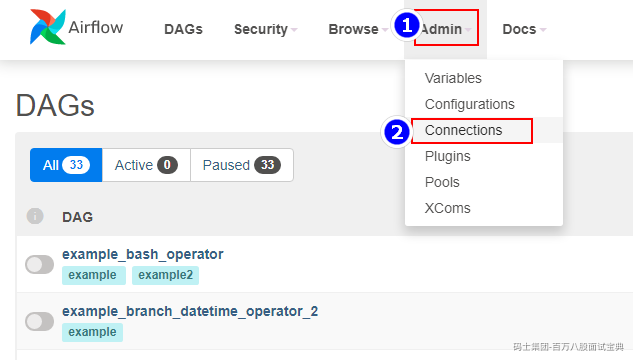

点击“+”添加连接，这里host连接的是node5节点：

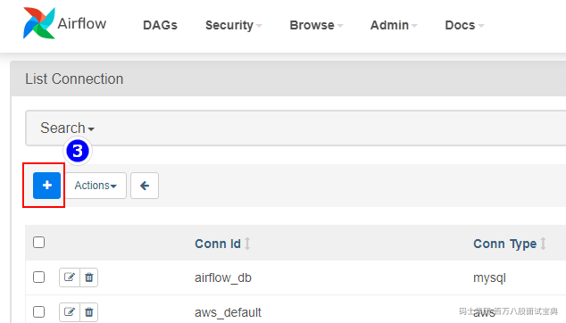

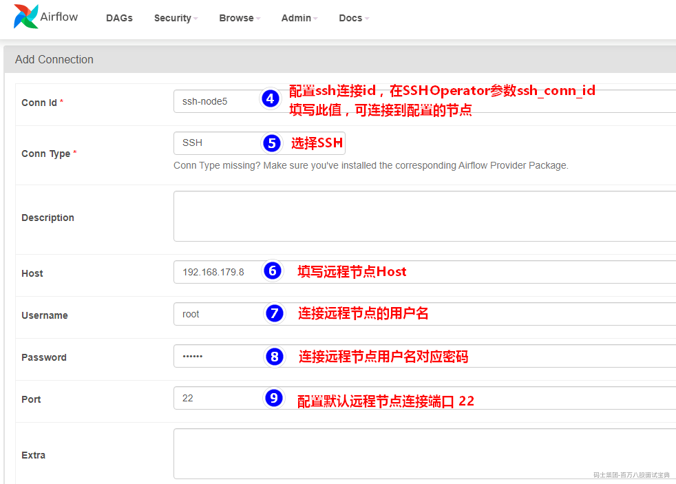

1. **准备远程执行脚本**

在node5节点/root路径下创建first\_shell.sh，内容如下：

在node3节点/root路径下创建second\_shell.sh，内容如下：

1. **编写DAG python配置文件**

注意在本地开发工具编写python配置时，需要用到SSHOperator，需要在本地对应的python环境中安装对应的provider package。

python配置文件：

1. **调度python配置脚本**

将以上配置好的python文件上传至node4节点$AIRFLOW\_HOME/dags下，重启Airflow websever与scheduler，登录webui，开启调度：

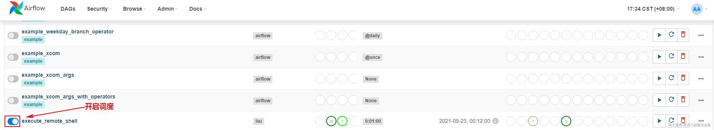

调度结果如下：

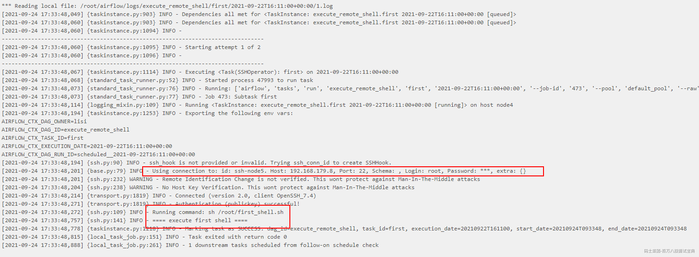

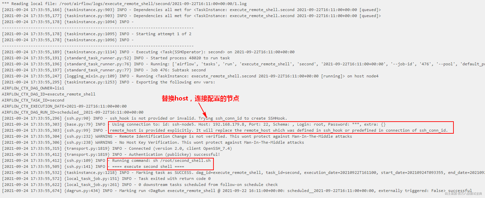

### 0.6.3 HiveOperator及调度HQL

可以通过HiveOperator直接操作Hive SQL ，HiveOperator的参数如下：

想要在airflow中使用HiveOperator调用Hive任务，首先需要安装以下依赖并配置Hive Metastore：

登录Airflow webui并设置Hive Metastore，登录后找到”Admin”->”Connections”，点击“+”新增配置：

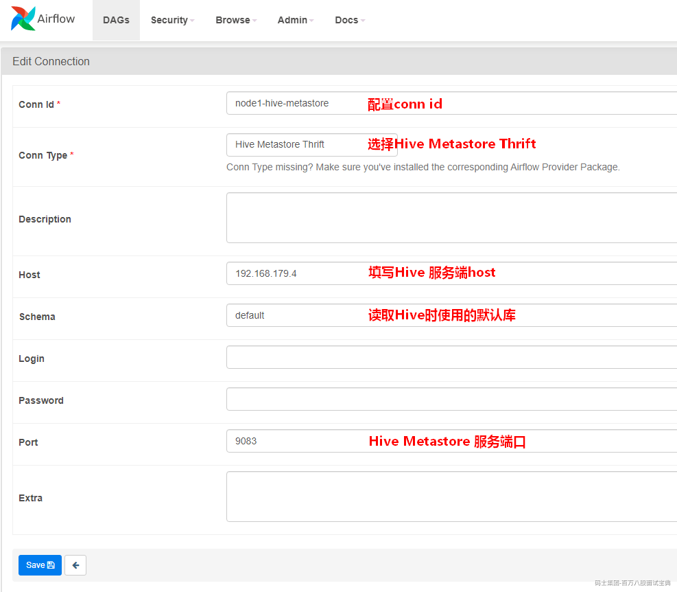

- **HiveOperator调度HQL案例**

1. **启动Hive，准备表**

启动HDFS、Hive Metastore，在Hive中创建以下三张表：

向表 person\_info加载如下数据：

向表score\_info加载如下数据：

1. **在node4节点配置Hive 客户端**

由于Airflow 使用HiveOperator时需要在Airflow安装节点上有Hive客户端，所以需要在node4节点上配置Hive客户端。

将Hive安装包上传至node4 “/software”下解压，并配置Hive环境变量

修改HIVE\_HOME/conf/hive-site.xml ，写入如下内容：

1. **编写DAG python配置文件**

注意在本地开发工具编写python配置时，需要用到HiveOperator，需要在本地对应的python环境中安装对应的provider package。

Python配置文件:

1. **调度python配置脚本**

将以上配置好的python文件上传至node4节点$AIRFLOW\_HOME/dags下，重启Airflow websever与scheduler，登录webui，开启调度：

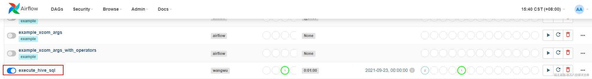

调度结果如下：

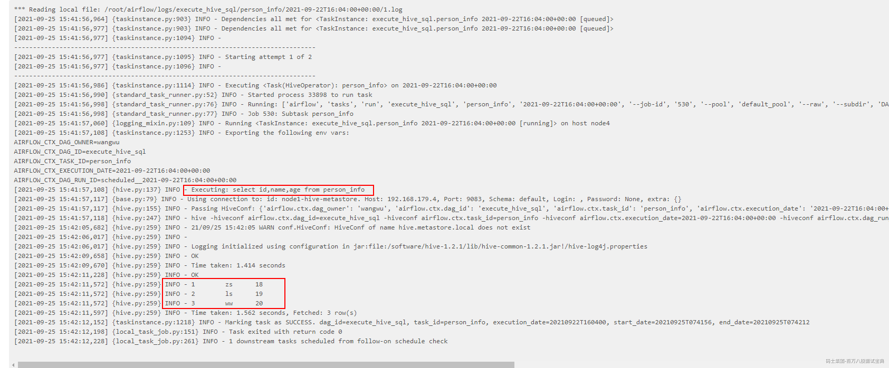

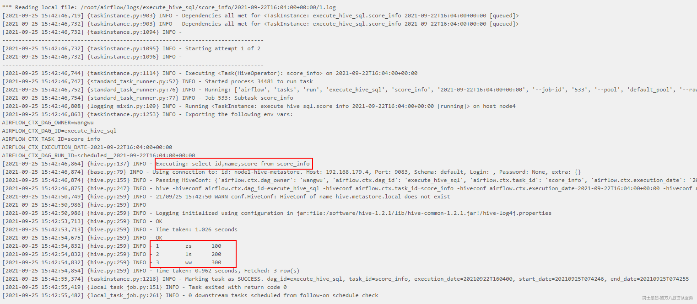

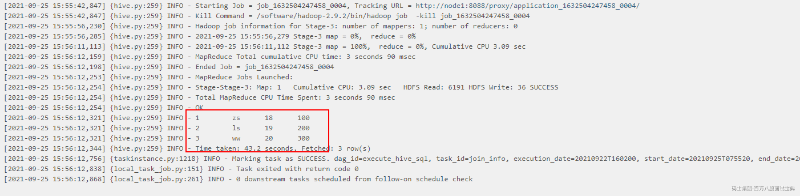

### 0.6.4 PythonOperator

PythonOperator可以调用Python函数，由于Python基本可以调用任何类型的任务，如果实在找不到合适的Operator，将任务转为Python函数，使用PythonOperator即可。

关于PythonOperator常用参数如下，更多参数可以查看官网：<http://airflow.apache.org/docs/apache-airflow/stable/_api/airflow/operators/python/index.html#module-airflow.operators.python>

- **PythonOperator调度案例**

## 0.7 Airflow分布式集群搭建及使用

### 0.7.1 Airflow分布式集群搭建原因

在稳定性要求较高的场景中，例如：金融交易系统，airflow一般采用集群、高可用方式搭建部署，airflow对应的进程分布在多个节点上运行，形成Airflow集群、高可用部署，架构图如下：

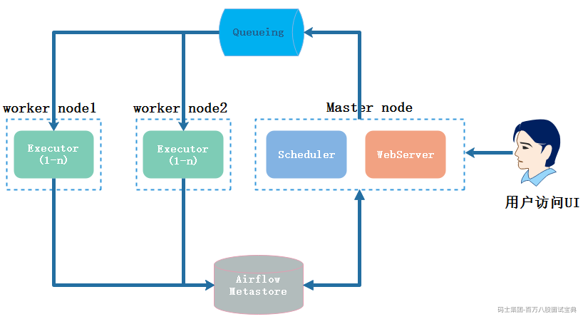

以上集群、高可用方式搭建Airflow好处如下：

- 如果一个worker节点崩溃挂掉，集群仍然可以正常利用其他worker节点来调度执行任务。
- 当工作流中有内存密集型任务，任务最好分布在多态机器上执行以得到更好效果，airflow分布式集群满足这点。

### 0.7.2 Airflow分布式集群其他扩展

#### 0.7.2.1 扩展Worker节点

我们可以通过向集群中添加更多的worker节点来水平扩展集群，并使这些新节点使用同一个元数据库，从而分布式处理任务。由于Worker不需要再任何进程注册即可执行任务，因此worker节点可以在不停机，不重启服务下的情况进行扩展。

我们也可以通过增加单个worker节点的进程数来垂直扩展集群，可以通过修改airflow配置文件AIRFLOW\_HOME/airflow.cfg中celeryd\_concurrency的值来实现，例如：celeryd\_concurrency=30,我们可以根据集群上运行任务性质、CPU的内核数量等增加Worker单节点并发数量来满足实际需求。

扩展worker节点后的架构如下：

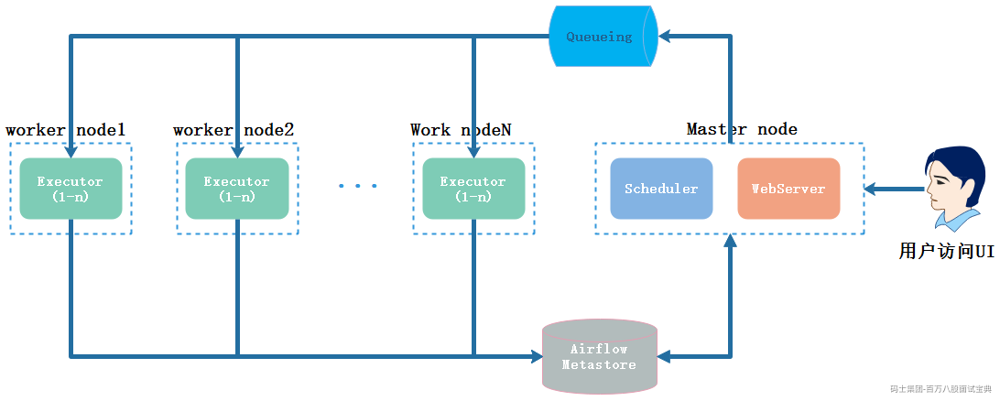

#### 0.7.2.2 扩展Master节点

我们还可以向集群中添加更多的主节点，以扩展主节点上运行的服务。我们可以扩展webserver，防止太多的HTTP请求出现在一台机器上防止webserver挂掉，需要注意，Master节点包含Scheduler与webServer，在一个Airflow集群中我们只能一次运行一个Scheduler进程，如果有多个Scheduler运行，那么可能出现同一个任务被执行多次，导致任务流重复执行。

Master扩展参照后续Airflow分布式集群搭建，扩展Master后的架构如下：

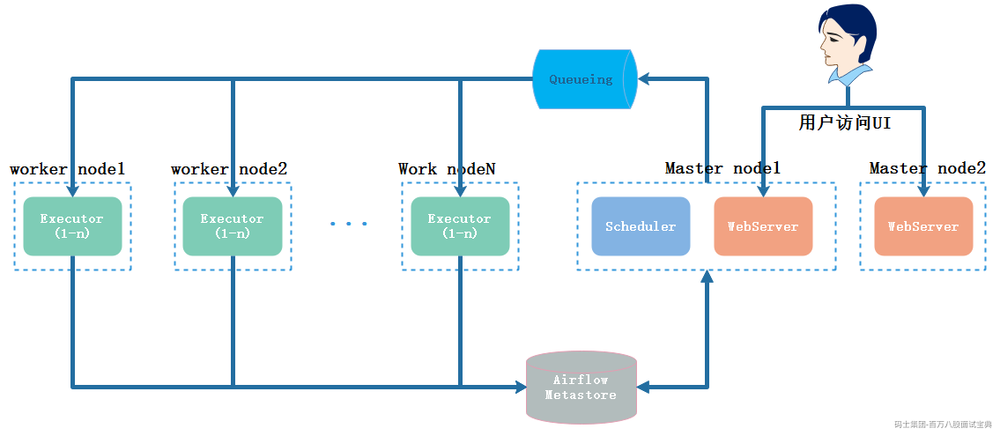

#### 0.7.2.3 Scheduler HA

扩展Master后的Airflow集群中只能运行一个Scheduler，那么运行的Scheudler进程挂掉，任务同样不能正常调度运行，这种情况我们可以在两台机器上部署scheduler，只运行一台机器上的Scheduler进程，一旦运行Schduler进程的机器出现故障，立刻启动另一台机器上的Scheduler即可，这种就是Schduler HA，我们可以借助第三方组件airflow-scheduler-failover-controller实现Scheduler的高可用。

详细操作参照后续Airflow分布式集群搭建，加入Scheduler HA的架构如下：

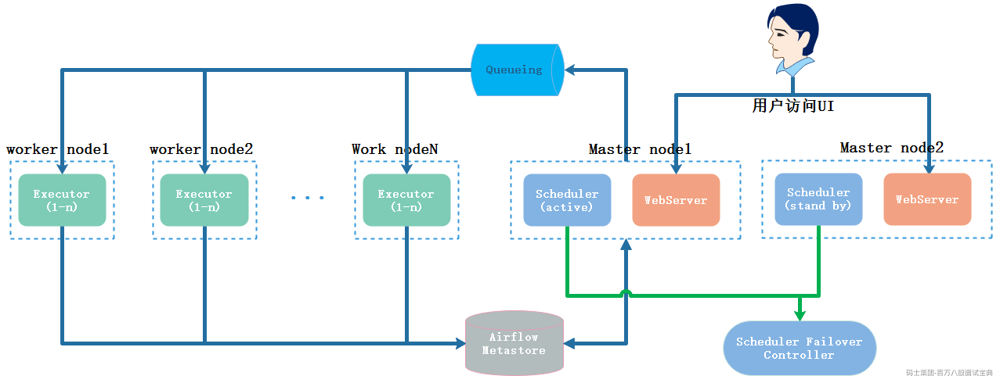

### 0.7.3 Airflow分布式集群搭建及测试

#### 0.7.3.1 节点规划

#### 0.7.3.2 airflow集群搭建步骤

1. **在所有节点安装python3.7**

参照单节点安装Airflow中安装anconda及python3.7。

1. **在所有节点上安装airflow**

- **每台节点安装airflow需要的系统依赖**

- **每台节点配置airflow环境变量**

- **每台节点切换airflow环境，安装airflow，指定版本为2.1.3**

默认Airflow安装在$ANCONDA\_HOME/envs/python37/lib/python3.7/site-packages/airflow目录下。配置了AIRFLOW\_HOME，Airflow安装后文件存储目录在AIRFLOW\_HOME目录下。可以每台节点查看安装Airflow版本信息：

- **在Mysql中创建对应的库并设置参数**

aiflow使用的Metadata database我们这里使用mysql,在node2节点的mysql中创建airflow使用的库及表信息。

在mysql安装节点node2上修改”/etc/my.cnf”，在[mysqld]下添加如下内容：

以上修改完成“my.cnf”值后，重启Mysql即可，重启之后，可以查询对应的参数是否生效：

- **每台节点配置Airflow airflow.cfg文件**

修改AIRFLOW\_HOME/airflow.cfg文件，确保所有机器使用同一份配置文件，在node1节点上配置airflow.cfg，配置如下：

将node1节点配置好的airflow.cfg发送到node2、node3、node4节点上：

#### 0.7.3.3 初始化Airflow

1. **每台节点安装需要的python依赖包**

初始化Airflow数据库时需要使用到连接mysql的包，执行如下命令来安装mysql对应的python包。

1. **在node1上初始化Airflow 数据库**

初始化之后在MySQL airflow库下会生成对应的表。

#### 0.7.3.4 创建管理员用户信息

在node1节点上执行如下命令，创建操作Airflow的用户信息:

执行完成之后，设置密码为“123456”并确认，完成Airflow管理员信息创建。

#### 0.7.3.5 配置Scheduler HA

1. **下载failover组件**

登录<https://github.com/teamclairvoyant/airflow-scheduler-failover-controller>下载 airflow-scheduler-failover-controller 第三方组件，将下载好的zip包上传到node1 “/software”目录下。

在node1节点安装unzip，并解压failover组件：

1. **使用pip进行安装failover需要的依赖包**

需要在node1节点上安装failover需要的依赖包。

1. **node1节点初始化failover**

注意：初始化airflow时，会向airflow.cfg配置中追加配置，因此需要先安装 airflow 并初始化。

1. **修改airflow.cfg**

首先修改node1节点的AIRFLOW\_HOME/airflow.cfg

配置完成后，可以通过以下命令进行验证Airflow Master节点：

将node1节点配置好的airflow.cfg同步发送到node2、node3、node4节点上：

#### 0.7.3.6 启动Airflow集群

1. **在所有节点安装启动Airflow依赖的python包**

1. **在Master1节点(node1)启动相应进程**

1. **在Master2节点(node2)启动相应进程**

1. **在Worker1(node3)、Worker2(node4)节点启动Worker**

在node3、node4节点启动Worker：

1. **在node1启动Scheduler HA**

至此，Airflow高可用集群搭建完成。

#### 0.7.3.7 访问Airflow 集群WebUI

浏览器输入node1:8080，查看Airflow WebUI:

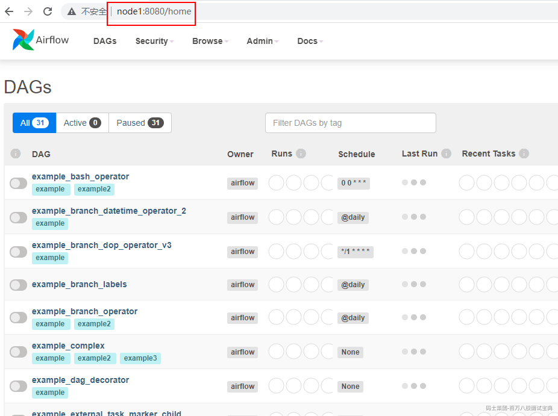

#### 0.7.3.8 测试Airflow HA

1. **准备shell脚本**

在**Airflow集群所有节点**{AIRFLOW\_HOME}目录下创建dags目录，准备如下两个shell脚本,将以下两个脚本放在$AIRFLOW\_HOME/dags目录下，BashOperator默认执行脚本时，默认从/tmp/airflow\*\*临时目录查找对应脚本，由于临时目录名称不定，这里建议执行脚本时，在“bash\_command”中写上绝对路径。如果要写相对路径，可以将脚本放在/tmp目录下，在“bash\_command”中执行命令写上“sh ../xxx.sh”也可以。

first\_shell.sh

second\_shell.sh

1. **编写airflow python 配置**

将以上内容写入execute\_shell.py文件，上传到**所有Airflow节点**{AIRFLOW\_HOME}/dags目录下。

1. **重启Airflow，进入Airflow WebUI查看对应的调度**

重启Airflow之前首先在node1节点关闭webserver ，Scheduler进程，在node2节点关闭webserver ，Scheduler进程，在node3，node4节点上关闭worker进程。

如果各个进程是后台启动，查看后台进程方式:

重启后进入Airflow WebUI查看任务：

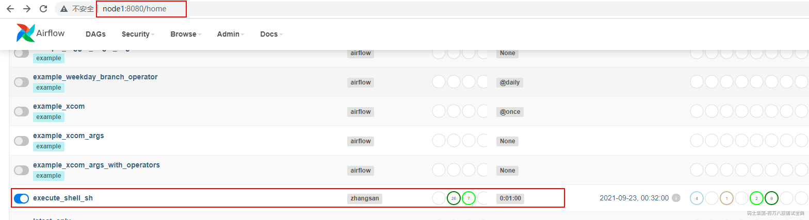

点击“success”任务后，可以看到脚本执行成功日志：

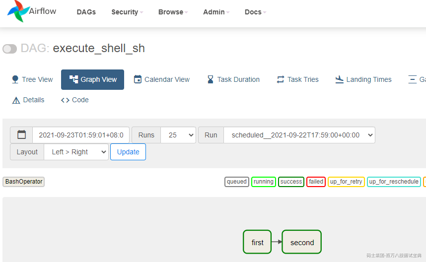

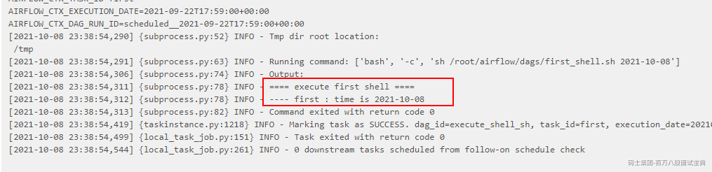

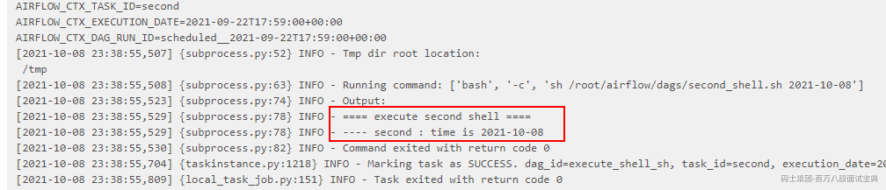

1. **测试Airflow HA**

当我们把node1节点的websever关闭后，可以直接通过node2节点访问airflow webui:

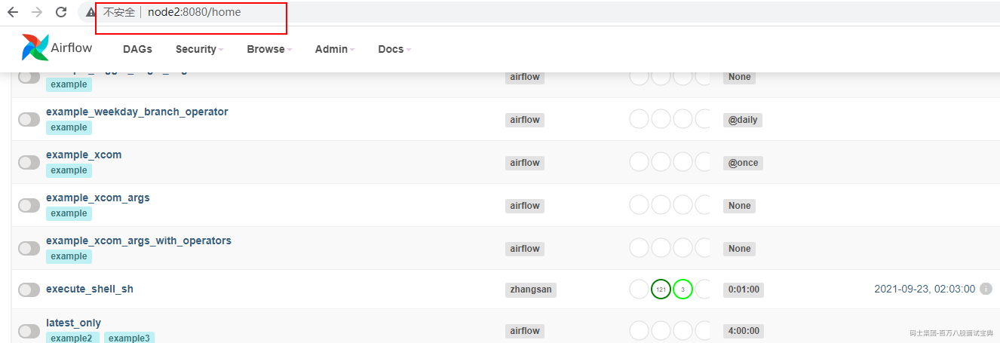

在node1节点上，查找“scheduler”进程并kill,测试scheduler HA 是否生效：
