### 第一节 分布式架构设计理论与Zookeeper环境搭建

# 1. 分布式架构设计理论

学习Zookeeper之前,我们需要掌握一些分布式系统基础知识：了解分布式系统的概念、原理。

配置管理 域名服务 分布式同步 发布订阅

## 1. 分布式架构介绍

### 1.1 什么是分布式

《分布式系统原理和范型》一书中是这样定义分布式系统的：“分布式系统是若干独立计算机的集合，这些计算机对于用户来说就像是单个相关系统”。

- 分布式系统是一个硬件或软件组件分布在不同的网络计算机上，彼此之间仅仅通过消息传递进行通信和协调的系统。

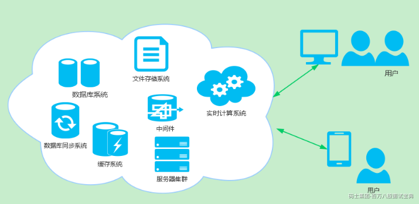

### 1.2 分布式与集群的区别

- 集群: 多个服务器做同一个事情

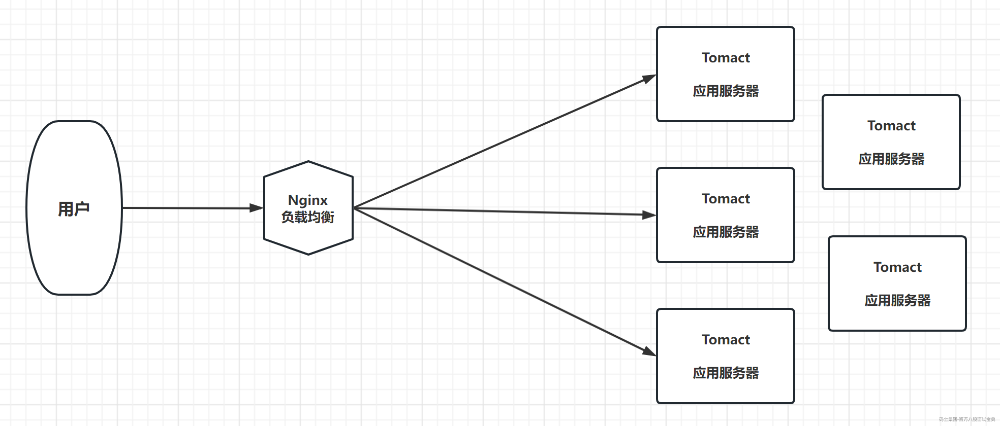

- 分布式: 多个服务器做不同的事情

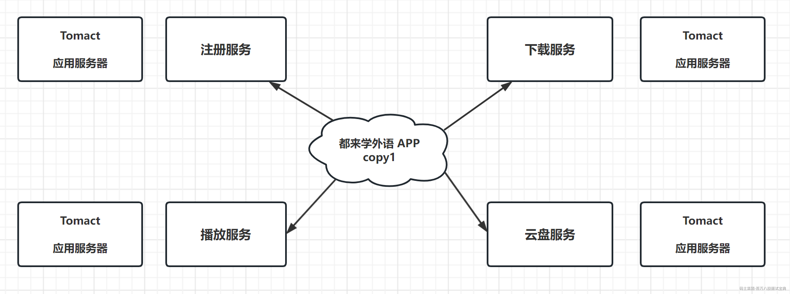

### 1.3 分布式系统特性

**分布式系统：**

- **一个硬件或软件组件分布在不同的网络计算机上，彼此之间仅仅通过消息传递进行通信和协调的系统这是分布式系统.**

- **在不同的硬件，不同的软件，不同的网络，不同的计算机上，仅仅通过消息来进行通讯与协调, 这是他的特点，更细致的看这些特点又可以有：分布性、对等性、并发性、缺乏全局时钟、故障随时会发生。**

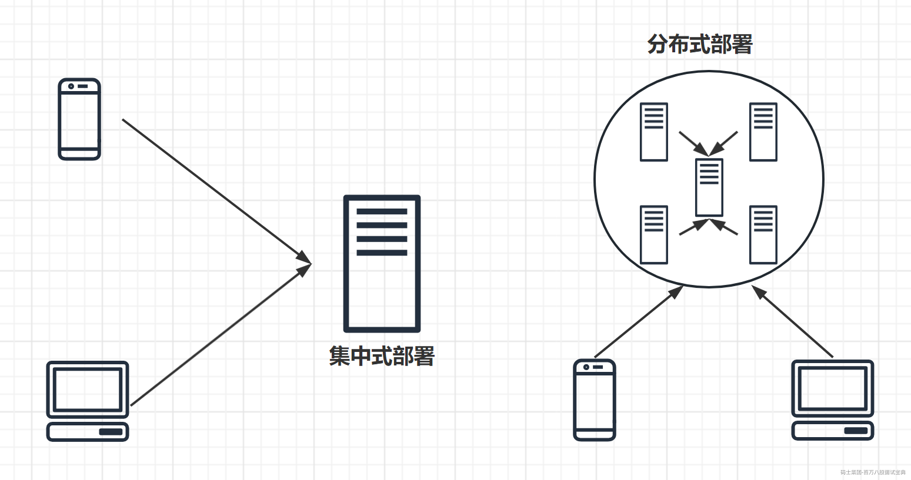

### 1.4 分布式系统面临的问题

1. 通信异常

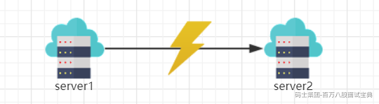

2. 网络分区

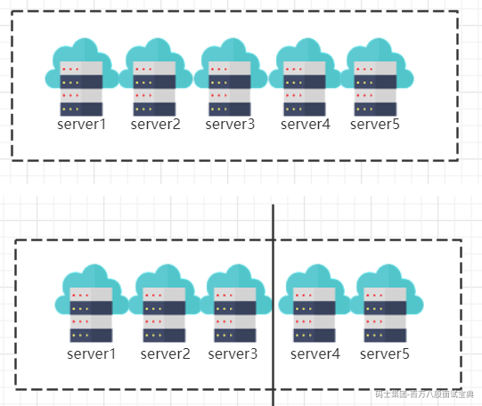

3. 节点故障

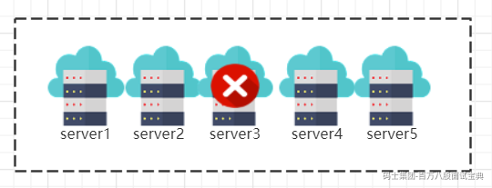

4. 三态

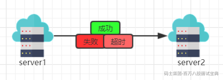

5. 重发

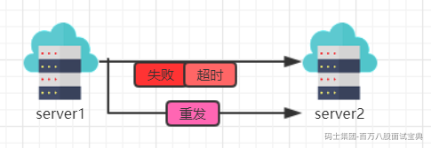

## 2. 分布式理论

### 2.1 数据一致性

#### 2.1.1 什么是分布式数据一致性

分布式数据一致性，指的是数据在多份副本中存储时，各副本中的数据是一致的。

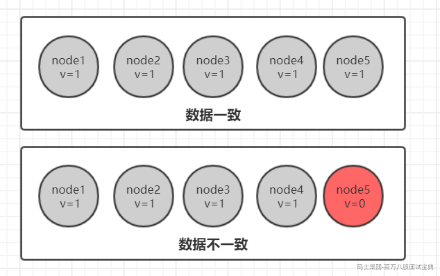

#### 2.1.2 副本一致性

**分布式系统当中，数据往往会有多个**副本。多个副本就需要保证数据的一致性。这就带来了同步的问题，因为网络延迟(节点故障、并发操作)等因素, 我们几乎没有办法保证可以同时更新所有机器当中的包括备份所有数据. 就会有数据不一致的情况.

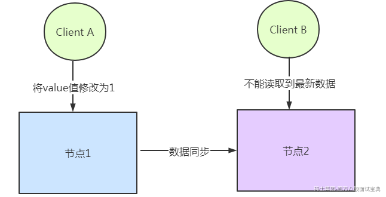

**总得来说，我们无法找到一种能够满足分布式系统中数据一致性解决方案。因此，如何既保证数据的一致性，同时又不影响系统运行的性能，是每一个分布式系统都需要重点考虑和权衡的。于是，一致性级别由此诞生.**

#### 2.1.3 一致性分类

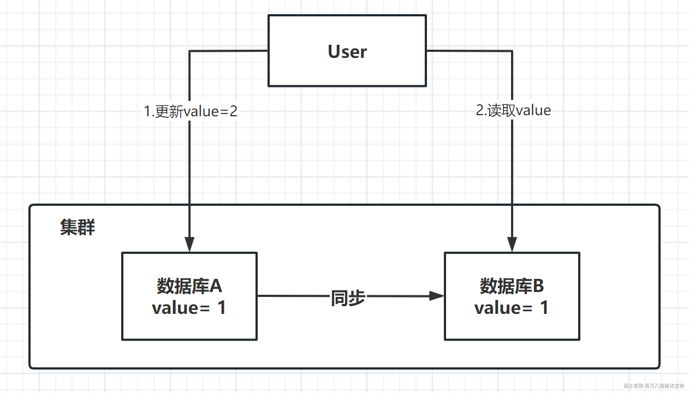

**1) 强一致性**  
这种一致性级别是最符合用户直觉的，它要求系统写入什么，读出来的也会是什么，(`任何读操作都会返回最新的写操作的结果`)用户体验好，但实现起来往往对系统的性能影响大。强一致性很难实现,并且实现强一致性可能需要牺牲系统的可用性和性能。

**2) 弱一致性**  
这种一致性级别约束了系统在写入成功后，不承诺立即可以读到写入的值，也不承诺多久之后数据能够达到一致，但会尽可能地保证到某个时间级别（比如秒级别）后，数据能够达到一致状态。

**3) 最终一致性**  
最终一致性也是弱一致性的一种，它无法保证数据更新后，所有后续的访问都能看到最新数值，而是需要一个时间，在这个时间之后可以保证这一点（就是在一段时间后，节点间的数据会最终达到一致状态），而在这个时间内，数据也许是不一致的，这个系统无法保证强一致性的时间片段被称为「不一致窗口」。不一致窗口的时间长短取决于很多因素，比如备份数据的个数、网络传输延迟速度、系统负载等。

**最终一致性在实际应用中又有多种变种：**

- **因果一致性**  
  如果进程A通知进程B它已更新了一个数据项，那么进程B的后续访问将返回更新后的值。与进程A无因果关系的进程C的访问遵守一般的最终一致性规则.

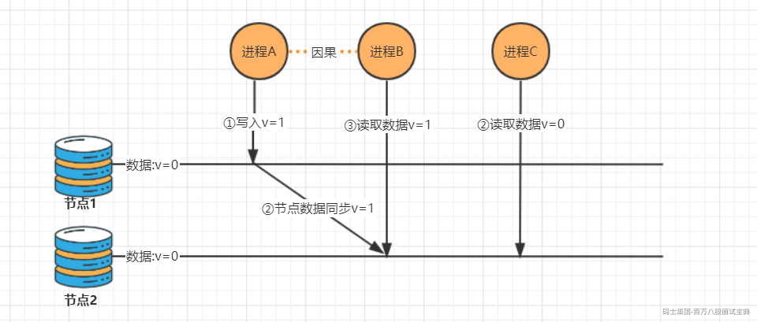

- **读己之所写 一致性**  
  当进程A自己更新一个数据项之后，它总是访问到更新过的值，绝不会看到旧值。这是因果一致性模型的一个特例.

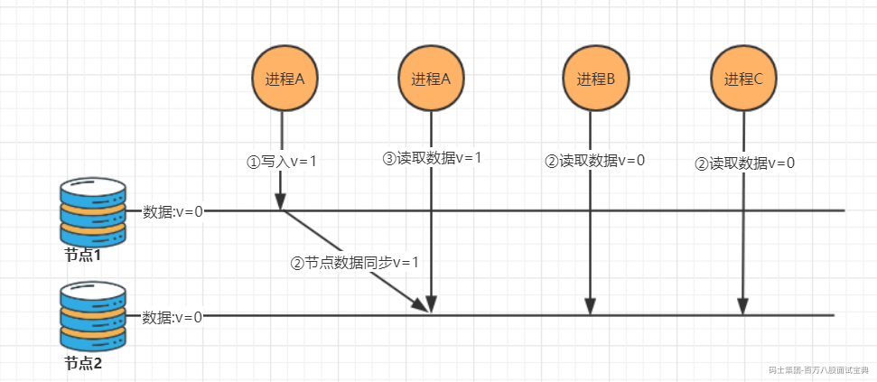

- **会话一致性**  
  **会话一致性是一种最终一致性模型，强调在单个会话期间的一致性。在同一个会话中，操作的顺序和结果必须保证一致。然而，在不同的会话之间，操作的顺序和结果可能是无序的。**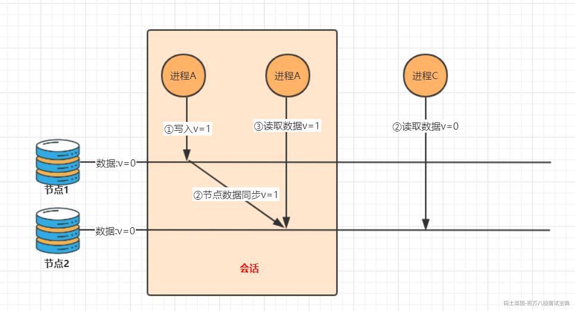

- **单调读一致性**  
  **如果一个进程已经读取到一个特定值，那么该进程不会读取到该值以前的任何值。换句话说，如果一个进程在读取了一个数据项的某个值之后，再次读取该数据项，它要么读取到相同的值，要么读取到一个更新的值。**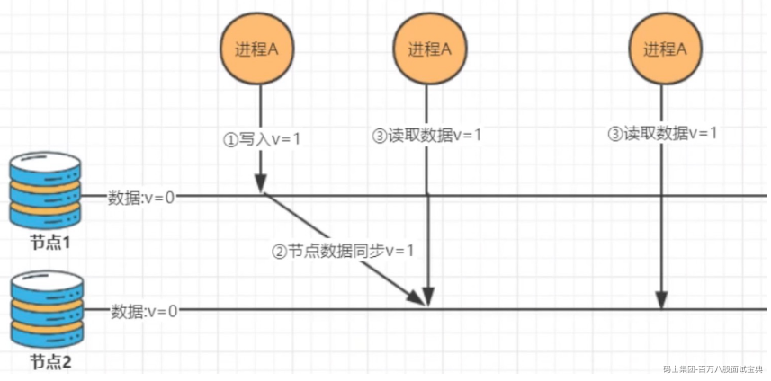

- **单调写一致性****系统保证对同一个进程的写操作串行化。**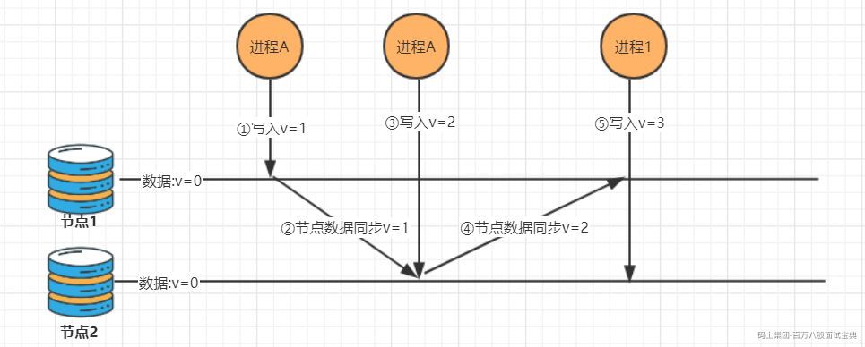

- **一致性模型图**

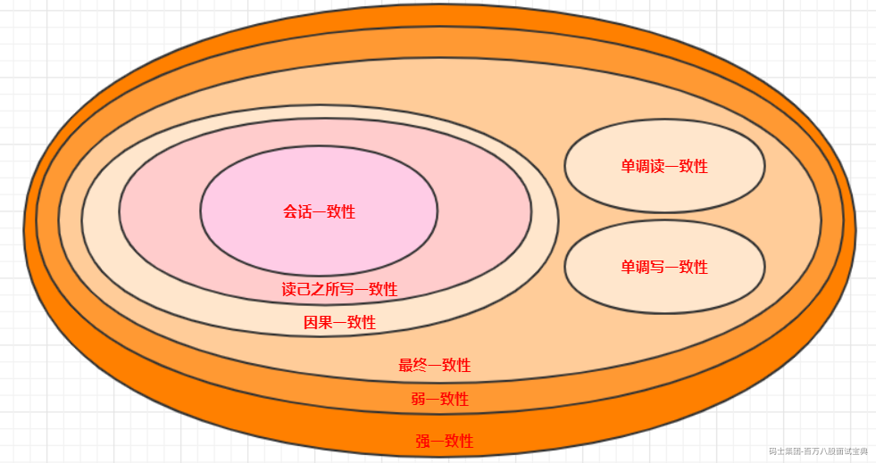

### 2.2 CAP定理

#### 2.2.1 CAP定理介绍

CAP 定理（CAP theorem）又被称作布鲁尔定理（Brewer's theorem），是加州大学伯克利分校的计算机科学家埃里克·布鲁尔（Eric Brewer）在 2000 年的 ACM PODC 上提出的一个猜想。对于设计分布式系统的架构师来说，CAP 是必须掌握的理论。

在一个分布式系统中，当涉及读写操作时，只能保证一致性（Consistence）、可用性（Availability）、分区容错性（Partition Tolerance）三者中的两个，另外一个必须被牺牲。

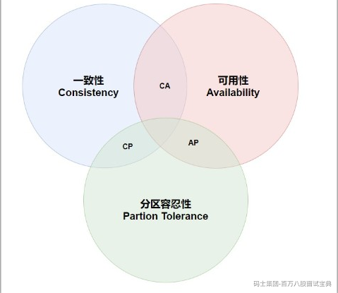

|  |  |
| --- | --- |
| **选项** | **具体意义** |
| **一致性（Consistency）** | **所有节点访问时都是同一份最新的数据副本** |
| **可用性（Availability）** | **每次请求都能获取到非错的响应，但是不保证获取的数据为最新数据** |
| **分区容错性（Partition tolerance）** | **分布式系统在遇到任何网络分区故障的时候，仍然能够对外提供满足一致性和可用性的服务，除非整个网络环境都发生了故障** |

1. **一致性（C-Consistency)**  
   **这里指的是强一致性**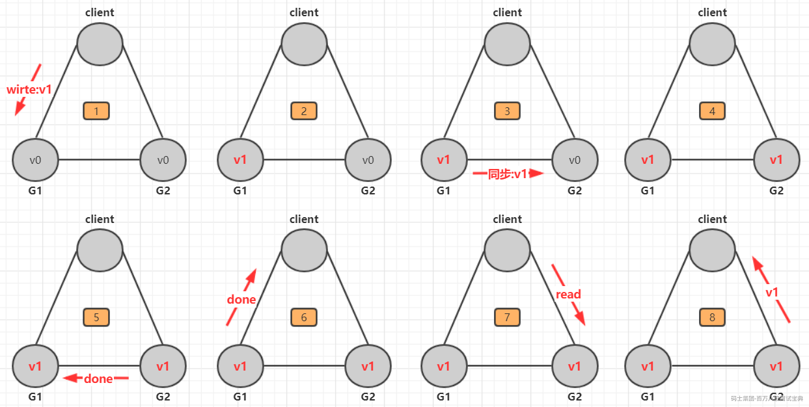

- **客户端向G1写入数据v1，并等待响应**

- **此时，G1服务器的数据为v1，而G2服务器的数据为v0，两者不一致**

- **接着，在返回响应给客户端之前，G2服务器会自动同步G1服务器的数据，使得G2服务器的数据也是v1**

- **一致性保证了不管向哪台服务器（比如这边向G1）写入数据，其他的服务器（G2）能实时同步数据**

- **G2已经同步了G1的数据，会告诉G1，我已经同步了**

- **G1接收了所有同步服务器的已同步的报告，才将“写入成功”信息响应给client**

- **client再发起请求，读取G2的数据**

- **此时得到的响应是v1，即使client读取数据到G2**

3. **可用性（A-Availability)**  
   **系统中非故障节点收到的每个请求都必须有响应**. 在可用性系统中，如果我们的客户端向服务器发送请求，并且服务器未崩溃，则服务器必须最终响应客户端，不允许服务器忽略客户的请求.

4. **分区容错性（P-Partition tolerance）**  
   允许网络丢失从一个节点发送到另一个节点的任意多条消息，即不同步. 也就是说，G1和G2发送给对方的任何消息都是可以放弃的，也就是说G1和G2可能因为各种意外情况，导致无法成功进行同步，**分布式系统要能容忍这种情况。**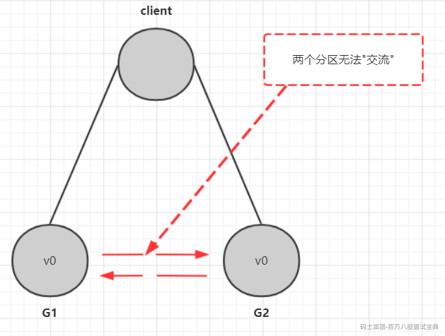

#### 2.2.2 CAP三者不可能同时满足论证

**假设确实存在三者能同时满足的系统**

1. **那么我们要做的第一件事就是分区我们的系统，由于满足**分区容错性，也就是说可能因为通信不佳等情况，G1和G2之间是没有同步

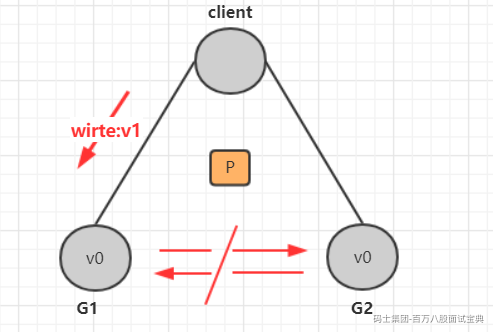

2. **接下来，我们的客户端将v1写入G1，但G1和G2之间是不同步的，所以如下G1是v1数据，G2是v0数据。**

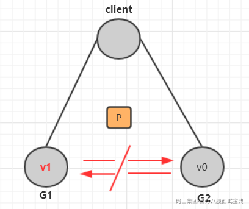

3. **由于要满足可用性，即一定要返回数据，所以G1必须在数据没有同步给G2的前提下返回数据给client，如下**


- **接下去，client请求的是G2服务器，由于G2服务器的数据是v0，所以client得到的数据是v0**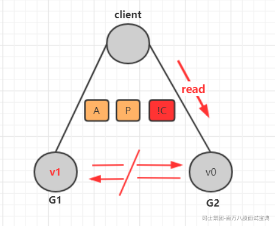**结论:**`很明显，G1返回的是v1数据，G2返回的是v0数据，两者不一致。其余情况也有类似推导，也就是说CAP三者不能同时出现。`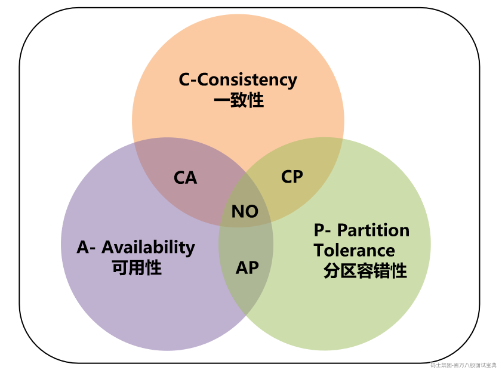

#### 2.2.3 CAP三者如何权衡

**三选二利弊如何**

- CA (Consistency + Availability)：强一致性和高可用性，放弃分区容错性。在这种情况下，系统能够保证所有节点之间的数据一致性，并且一旦某个节点出现故障或网络分区，整个系统将无法提供服务。这种模型适用于一些对**一致性要求非常高、容忍服务不可用的场**景，如金融交易系统。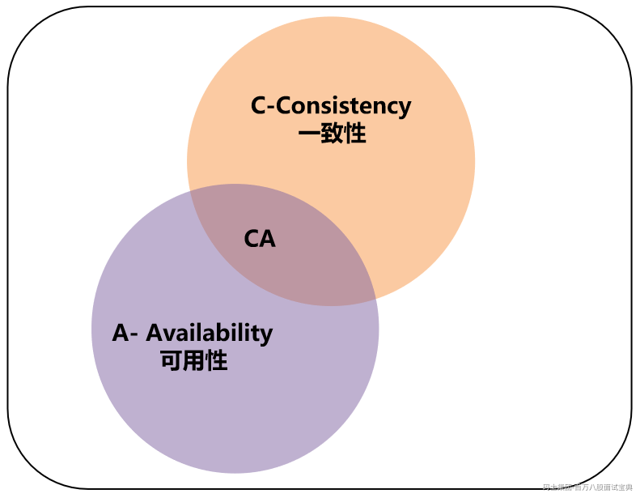

- CP (consistency + partition tolerance)：强一致性和分区容错性，牺牲可用性。在这种情况下，系统能够保证数据的一致性，并且在面对网络分区时仍然可以正常运行，但是可能会导致某些节点无法提供服务。这种模型适用于对一致性要求高、可以容忍服务不可用的场景，如数据库系统。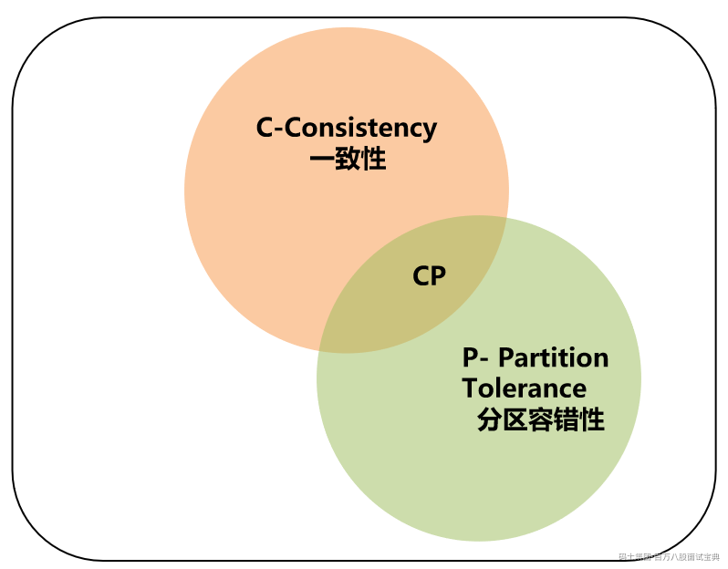

- AP (availability + partition tolerance)：可用性和分区容错性，可能牺牲一致性。在这种情况下，系统能够保证在面对网络分区时仍然能够提供服务，并且允许节点之间的数据出现一定的不一致性。这种模型适用于对可用性要求高、可以容忍一定的数据不一致的场景，如大规模分布式存储系统。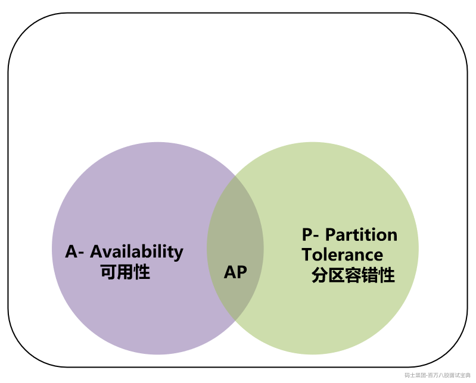

**如何进行三选二**

放弃了一致性，满足分区容错，那么节点之间就有可能失去联系，为了高可用，每个节点只能用本地数据提供服务，而这样会容易导致全局数据不一致性。对于互联网应用来说，机器数量庞大，节点分散，网络故障再正常不过了，那么此时就是保障AP，放弃C的场景，而从实际中理解，像网站这种偶尔没有一致性是能接受的，但不能访问问题就非常大了。


对于银行来说，就是必须保证强一致性，也就是说C必须存在，那么就只用CA和CP两种情况，当保障强一致性和可用性（CA），那么一旦出现通信故障，系统将完全不可用。另一方面，如果保障了强一致性和分区容错（CP），那么就具备了部分可用性。实际究竟应该选择什么，是需要通过业务场景进行权衡的（并不是所有情况都是CP好于CA，只能查看信息但不能更新信息有时候还不如直接拒绝服务）


### 2.3 BASE理论

BASE 是指基本可用（Basically Available）、软状态（ Soft State）、最终一致性（ Eventual Consistency）。**它的核心思想是即使无法做到强一致性（CAP 就是强一致性），但应用可以采用适合的方式达到最终一致性。**

- BA指的是基本业务可用性，支持分区失败；

- S表示柔性状态，也就是允许短时间内不同步；

- E表示最终一致性，数据最终是一致的，但是实时是不一致的。

**Basically Available(基本可用)**  
什么是基本可用呢？假设系统，出现了不可预知的故障，但还是能用，相比较正常的系统而言：

- 响应时间上的损失：正常情况下的搜索引擎 0.5 秒即返回给用户结果，而基本可用的搜索引擎可以在 1 秒返回结果。

- 功能上的损失：在一个电商网站上，正常情况下，用户可以顺利完成每一笔订单，但是到了大促期间，为了保护购物系统的稳定性，部分消费者可能会被引导到一个降级页面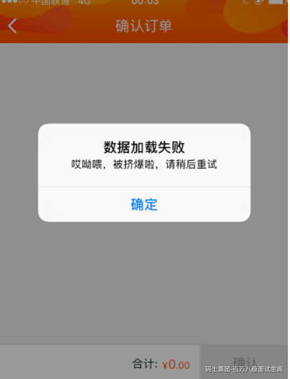

**Soft state（软状态）**  
什么是软状态呢？相对于原子性而言，要求多个节点的数据副本都是一致的，这是一种 “硬状态”。  
软状态指的是：**允许系统中的数据存在中间状态，并认为该状态不会影响系统的整体可用性，即允许系统在多个不同节点的数据副本存在数据延时。**

**Eventually consistent（最终一致性）**  
上面说软状态，然后不可能一直是软状态，必须有个时间期限。在期限过后，应当保证所有副本保持数据一致性。从而达到数据的最终一致性。这个时间期限取决于网络延时，系统负载，数据复制方案设计等等因素。

# 2. Zookeeper介绍

## 1.1 分布式系统面临的问题

**分布式系统是一个硬件或软件组件分布在不同的网络计算机上，彼此之间仅仅通过消息传递进行通信和协调的系统。**

**面临的问题：系统每个节点之间信息同步及共享**

- 以一个小团队为例,面临的问题

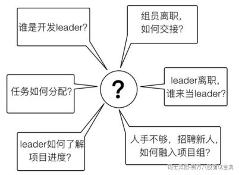

- 通过网络进行信息共享  
  开发Leader在会上把任务分配下去,组员通过Leader的命令或者邮件 之类的系统知道自己要干什么.在分配有变化时,Leader会通知到具体的人,或者再次开会,通过人与人之间的直接沟通,完成信息传递

- 通过共享存储  
  Leader将任务分配放到SVN或者git等上,组员每天去svn,git上拉取最新的任务分配表,然后干活,其中svn,git 就是共享存储,更好一点的做法是,当svn,git文件更新时,触发邮件通知,每个组员再去拉,任务表,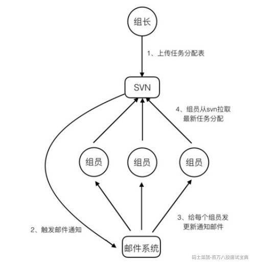

**Zookeeper如何解决分布式系统面临的问题**

ZooKeeper对分布式系统的协调，使用的是第二种方式，即共享存储。其实共享存储，分布式应用也需要和存储进行网络通信。  
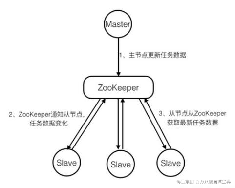

Zookeeper解决分布式系统协同工作问题

## 1.2 什么是Zookeeper

**举个例子**

**美团，饿了么，等等应用都是zookeeper的现实生活版, 我开了个饭店，如何才能让大家都能吃到我们的饭菜？需要入驻美团，这样大家就可以在美团app中看到我的饭店，下订单，从而完成一次交易.**


ZooKeeper是一个开源的分布式协调服务，由Apache软件基金会开发和维护。它旨在帮助构建分布式应用程序，提供高可用性和可靠性。ZooKeeper 允许开发人员专注于核心应用程序逻辑，而不必担心应用程序的分布式特性。

**ZooKeeper的主要特点如下：**

- 分布式协调：ZooKeeper提供了一个可靠的协调机制，使得分布式系统中的各个组件能够相互通信和协调工作。它维护了一个分层的命名空间，类似于一个文件系统，允许客户端创建、删除、查看和更新节点。

- 高可用性：ZooKeeper通过在集群中多个服务器之间复制数据来实现高可用性。当其中一个服务器发生故障时，其他服务器能够接管服务并继续提供数据访问。

- 顺序一致性：ZooKeeper提供了强一致性的保证，即所有的更新操作将按照它们被提交的顺序进行处理。这对于分布式系统中需要有序操作的场景非常重要，例如选举算法或分布式锁的实现。

- 小巧灵活：ZooKeeper的设计简单轻量，核心功能集中在分布式协调方面，使其易于部署和集成到现有系统中。它使用Java编写，但也提供了对其他编程语言的支持。

## 1.3 Zookeeper的应用场景

**1) 配置管理**

- 通常在分布式系统或集群中，所有节点的配置应该一致，比如Hadoop集群，要求对配置的修改，能够快速同步到各个节点中，可以通过 Zookeeper 实现

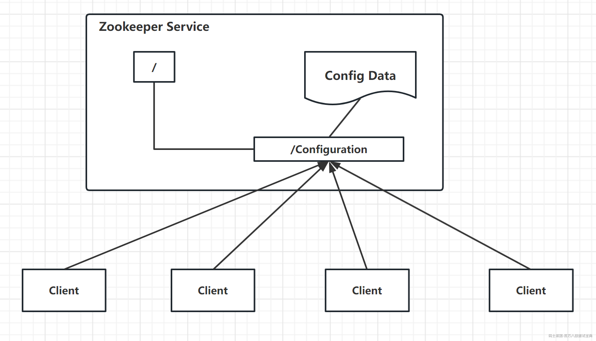

**2) 服务注册中心**

- ZooKeeper服务注册中心，服务提供者将自己的服务信息（例如IP地址、端口号等）注册到ZooKeeper中，而服务消费者则通过查询ZooKeeper来发现可用的服务。

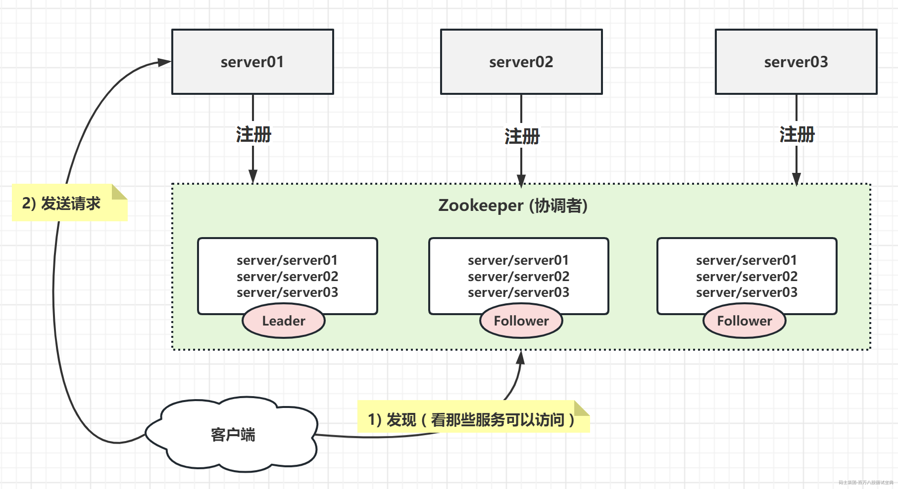

1. 启动一个秒杀服务之后会向 ZooKeeper 进行注册操作（向 ZooKeeper 的指定文件夹写入该秒杀服务的信息，如 name、ip、port）；然后 ZooKeeper 会创建当前秒杀服务的节点

2. 客户端（服务调用者）连接 ZooKeeper 并获取秒杀服务的地址列表信息（① 不是每次发送请求都会获取地址列表信息，客户端会把地址列表信息缓存到本地；② 客户端会绑定节点改变事件）

3. 客户端获得了秒杀服务的地址列表信息，在地址列表信息中随机选择一台秒杀服务发送请求

4. 假如有秒杀服务宕机，ZooKeeper 会在注册中心移除掉该秒杀服务的地址信息并通知客户端进行地址列表信息的更新（ZooKeeper 通过心跳机制知道服务器是否宕机）

5. 客户端接收到 ZooKeeper 的通知，并修改地址列表信息

**3) 主从协调**

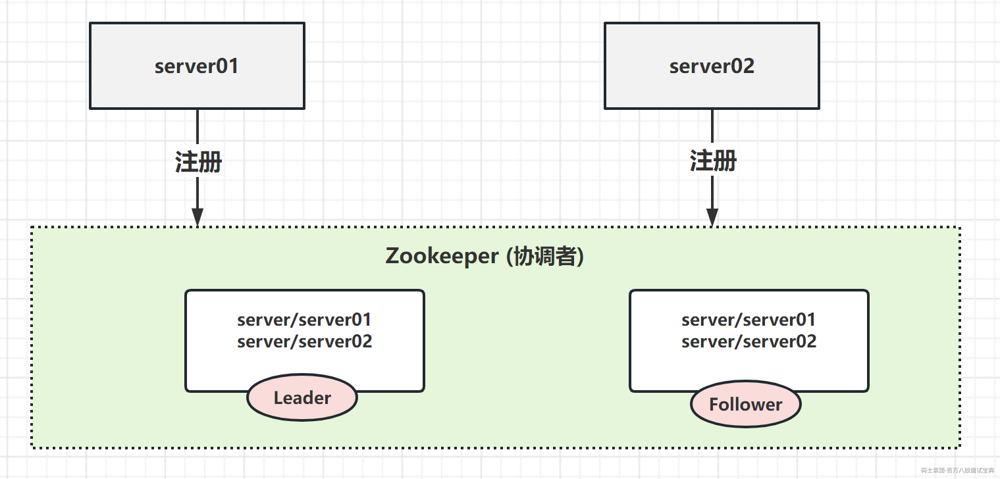

上图，两台服务器 server 01、server 02 构成集群。如果是主备集群，那台服务器一开始是 Active ？那台服务器一开始是 Standby ？ 可通过 ZooKeeper 进行协调指定。

1. 两台服务器启动，向 ZooKeeper 注册中心写入注册信息，并绑定对应的值绑定事件

2. 两台服务器都判断一下自己写入的注册信息在 ZooKeeper 注册中心的注册信息列表中是否是第一条记录？第一条记录作为 Active 节点或 Master 节点，除第一条记录之外的都是 Standby 节点或 Slave 节点。

3. ZooKeeper 的节点信息发生改变（新的服务器加入、旧的服务器宕机）之后，① 通知所有的已绑定值改变事件的客户端更新节点列表信息；② 向所有的服务器发送值改变的通知

4. 所有的服务器接收到值改变通知后，执行步骤 2

**4) 分布式锁**

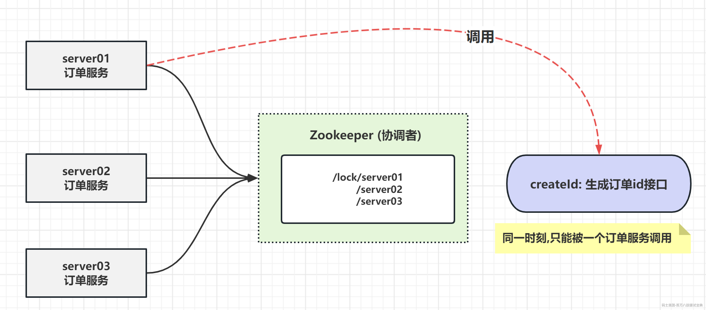

1. **全部的订单服务在调用 createId 接口前都往 ZooKeeper 的注册中心的指定目录写入注册信息（如 /lock/server 01）和绑定值改变事件**

2. **全部的订单服务判断自己往注册中心指定目录写入的注册信息是否是全部注册信息中的第一条？如果是，调用 createId 接口（不是第一条就等着）。调用结束后，去注册中心移除自己的信息**

3. **ZooKeeper 注册中心信息改变后，通知所有的绑定了值改变事件的订单服务执行第 2 条**

# 3. 搭建Zookeeper服务器

### 3.1 windows下部署

#### 3.1.1 下载安装包

下载地址: <https://mirrors.cloud.tencent.com/apache/zookeeper/zookeeper-3.7.1/>

**也可以直接从资料中获取**

#### 3.1.2 修改配置文件

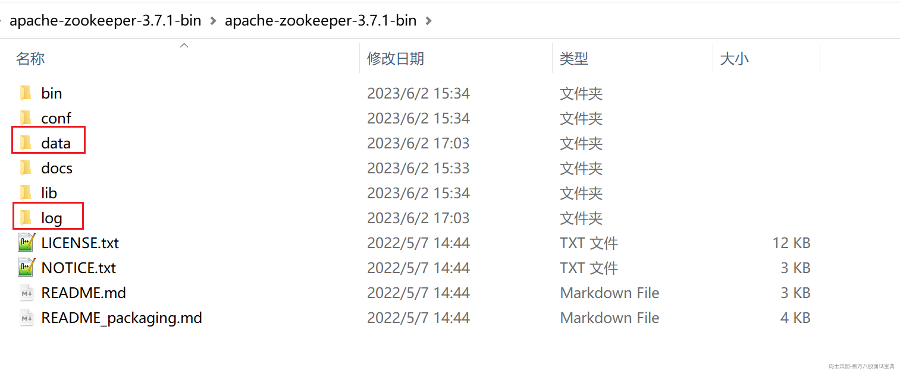

- **打开apache-zookeeper-3.7.0-bin\conf目录，将** `zoo_sample.cfg`复制一份，命名为 `zoo.cfg`

- **打开** `zoo.cfg`，修改 `dataDir`路径，新增日志 `dataLogDir`路径

```plain
 dataDir=../data
 dataLogDir=../log
```

#### 3.1.3 zoo.cfg 配置文件说明

```plain
 # zookeeper时间配置中的基本单位 (毫秒)
 tickTime=2000
 # 允许follower初始化连接到leader最大时长，它表示tickTime时间倍数 即:initLimit*tickTime
 initLimit=10
 # 允许follower与leader数据同步最大时长,它表示tickTime时间倍数 
 syncLimit=5
 #zookeper 数据存储目录及日志保存目录（如果没有指明dataLogDir，则日志也保存在这个文件中）
 dataDir=/tmp/zookeeper
 #对客户端提供的端口号
 clientPort=2181
 #单个客户端与zookeeper最大并发连接数
 maxClientCnxns=60
 # 保存的数据快照数量，之外的将会被清除
 autopurge.snapRetainCount=3
 #自动触发清除任务时间间隔，小时为单位。默认为0，表示不自动清除。
 autopurge.purgeInterval=1
```

#### 3.1.4 启动Zookeeper

- **启动Zookeeper服务端**

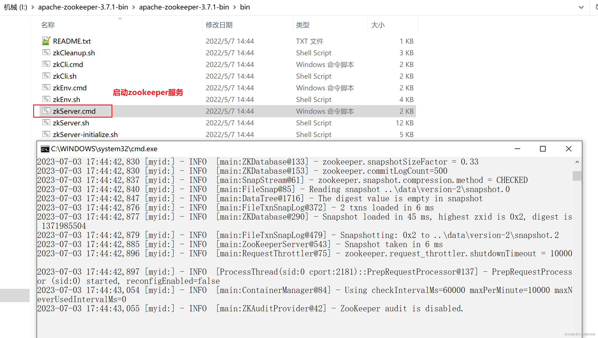

- **启动Zookeeper客户端**

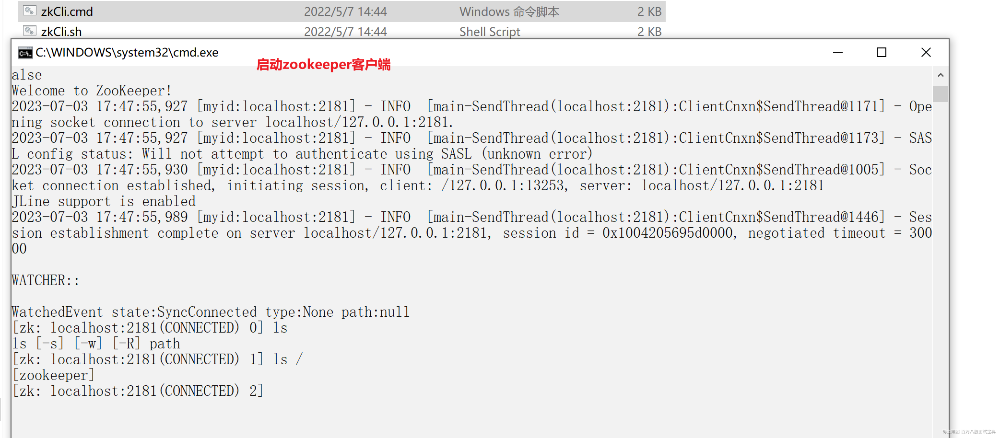

### 3.2 linux下部署

#### 3.2.1 上传zookeeper

***前提：由于zookeeper是使用java语言开发的，所以，在安装zookeeper之前务必先在本机安装配置好java环境！***

**1) 上传zookeeper**

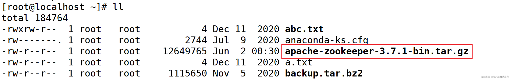

**2) 解压zookeeper**

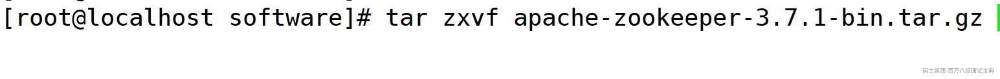

#### 3.2.2 配置环境变量

**1) 配置conf**

进入到安装目录的…/conf目录下

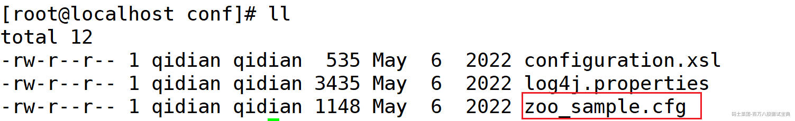

可以看到这里有个zoookeeper给我们的一个样例配置文件：zoo\_sample.cfg，我们在配置我们自己的zk时，需要做的就是将这个文件复制一份，并命名为：zoo.cfg，然后在zoo.cfg中修改自己的配置即可。

```plain
[root@localhost conf]# cp zoo_sample.cfg  zoo.cfg
[root@localhost conf]# vim zoo.cfg 
```

zoo.cfg的相关配置项其实并不多，这边各个配置项的详细说明如下：

```plain
# zookeeper内部的基本单位，单位是毫秒，这个表示一个tickTime为2000毫秒，在zookeeper的其他配置中，都是基于tickTime来做换算的
tickTime=2000

#集群中的follower服务器(F)与leader服务器(L)之间 初始连接 时能容忍的最多心跳数（tickTime的数量）。
initLimit=10

#syncLimit：集群中的follower服务器(F)与leader服务器(L)之间 请求和应答 之间能容忍的最多心跳数（tickTime的数量）
syncLimit=5

# 数据存放文件夹，zookeeper运行过程中有两个数据需要存储，一个是快照数据（持久化数据）另一个是事务日志
dataDir=/tmp/zookeeper

# 客户端访问端口
clientPort=2181

```

**2) 配置环境变量**

vim /etc/profile

```plain
export ZOOKEEPER_PREFIX=/root/software/apache-zookeeper-3.7.1-bin
export PATH=$PATH:$ZOOKEEPER_PREFIX/bin
```

执行下面的命令,使配置生效

```plain
source profile
```

#### 3.2.3 启动服务

```plain
zkServer.sh start
```

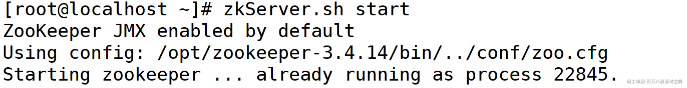

可以看到我们的zkServer以及启动好了。  
可以查看下启动状态：

```plain
zkServer.sh status
```

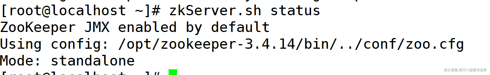

客户端连接

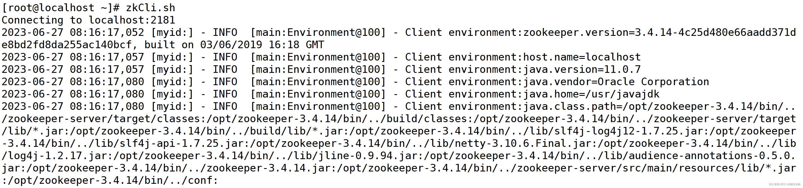

根目录下有一个自带的/zookeeper子节点，它来保存Zookeeper的配额管理信息，不要轻易删除。

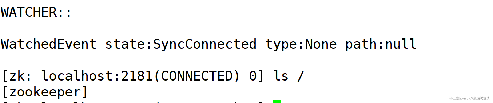
