# 第二节 zookeeper基础应用与实战

# 1. Zookeeper命令操作

## 1.1 Zookeeper 数据模型

ZooKeeper 是一个树形目录服务,其数据模型和Unix的文件系统目录树很类似，拥有一个层次化结构。

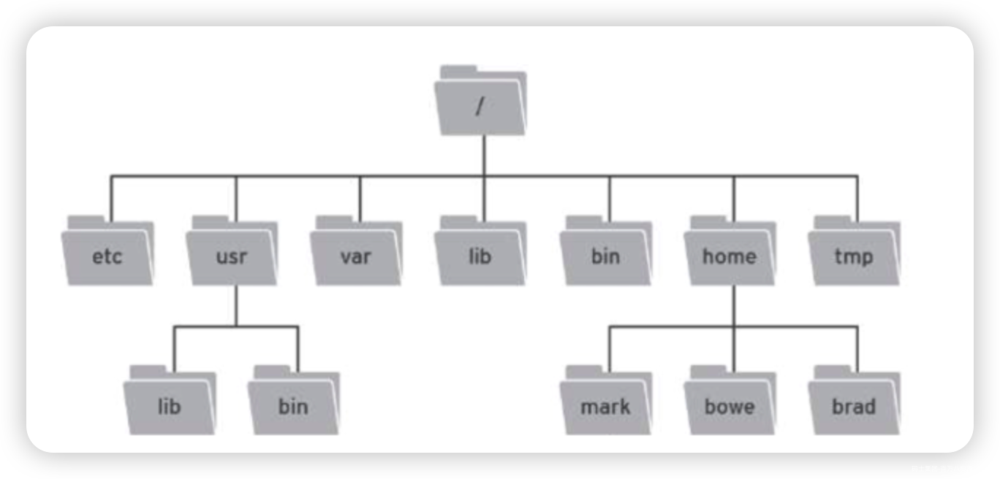

Zookeeper这里面的每一个节点都被称为： ZNode，每个节点上都会保存自己的数据和节点信息。

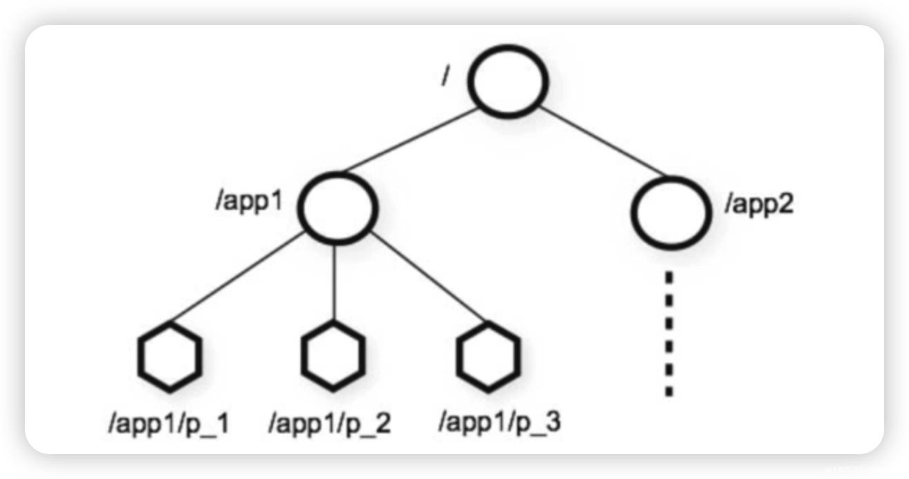

节点可以拥有子节点，同时也允许少量（1MB）数据存储在该节点之下。

节点可以分为四大类：

- PERSISTENT 持久化节点

- EPHEMERAL 临时节点 ：-e

- PERSISTENT\_SEQUENTIAL 持久化顺序节点 ：-s

- EPHEMERAL\_SEQUENTIAL 临时顺序节点 ：-es

## 1.2 Zookeeper服务端常用命令

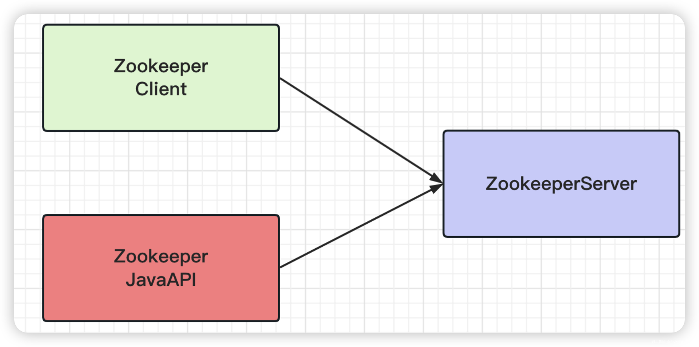

•启动 ZooKeeper 服务

```plain
./zkServer.sh start
```

•查看 ZooKeeper 服务状态

```plain
./zkServer.sh status
```

•停止 ZooKeeper 服务

```plain
./zkServer.sh stop 
```

•重启 ZooKeeper 服务

```plain
./zkServer.sh restart 
```

## 1.3 Zookeeper客户端常用命令

### 1.3.1 基本CRUD

- 连接Zookeeper客户端

```shell
# 本地连接
zkCli.sh

# 远程连接
zkCli.sh -server ip:2181
```

- 断开连接

```plain
quit
```

- 查看命令帮助

```plain
help
```

- 显示制定目录下节点

```shell
# ls 目录
ls /
```

- 创建节点

```shell
# create /节点path value
[zk: localhost:2181(CONNECTED) 0] ls /
[zookeeper]
[zk: localhost:2181(CONNECTED) 1] create /app1 msb123
Created /app1
[zk: localhost:2181(CONNECTED) 2] ls /
[app1, zookeeper]
[zk: localhost:2181(CONNECTED) 3] create /app2
Created /app2
[zk: localhost:2181(CONNECTED) 4] ls /
[app1, app2, zookeeper]
```

- 获取节点值

```shell
# get /节点path
[zk: localhost:2181(CONNECTED) 15] get /app1
msb123
[zk: localhost:2181(CONNECTED) 16] get /app2
null
```

- 设置节点值

```shell
# set /节点path value
[zk: localhost:2181(CONNECTED) 17] set /app2 msb456
[zk: localhost:2181(CONNECTED) 18] get /app2
msb456
```

- 删除单个节点

```shell
# delete /节点path
[zk: localhost:2181(CONNECTED) 19] delete /app2
[zk: localhost:2181(CONNECTED) 20] get /app2
Node does not exist: /app2
[zk: localhost:2181(CONNECTED) 21] ls /
[app1, zookeeper]
```

- 删除带有子节点的节点

```shell
# deleteall /节点path
[zk: localhost:2181(CONNECTED) 22] create /app1
Node already exists: /app1
[zk: localhost:2181(CONNECTED) 23] create /app1/p1
Created /app1/p1
[zk: localhost:2181(CONNECTED) 24] create /app1/p2
Created /app1/p2
[zk: localhost:2181(CONNECTED) 25] delete /app1
Node not empty: /app1
[zk: localhost:2181(CONNECTED) 26] deleteall /app1
[zk: localhost:2181(CONNECTED) 27] ls /
[zookeeper]
```

### 1.3.2 创建临时&顺序节点

- 创建临时节点 (-e)

- 临时节点是在会话结束后，自动被删除的

```shell
# create -e /节点path value
[zk: localhost:2181(CONNECTED) 29] create -e /app1 msb123
Created /app1
[zk: localhost:2181(CONNECTED) 30] get /app1
msb123
[zk: localhost:2181(CONNECTED) 31] quit

# 退出后再次连接，临时节点已经删除
[zk: localhost:2181(CONNECTED) 0] ls /
[zookeeper]
```

- 创建顺序节点 (-s)

- 创建出的节点，根据先后顺序，会在节点之后带上一个数值，越后执行数值越大，适用于分布式锁的应用场景- 单调递增.

```shell
# create -s /节点path value
[zk: localhost:2181(CONNECTED) 0] ls /
[zookeeper]
[zk: localhost:2181(CONNECTED) 1] create -s /app2
Created /app20000000003
[zk: localhost:2181(CONNECTED) 2] ls /
[app20000000003, zookeeper]
[zk: localhost:2181(CONNECTED) 3] create -s /app2 
Created /app20000000004
[zk: localhost:2181(CONNECTED) 4] ls /
[app20000000003, app20000000004, zookeeper]
[zk: localhost:2181(CONNECTED) 5] create -s /app2 
Created /app20000000005
[zk: localhost:2181(CONNECTED) 6] ls /
[app20000000003, app20000000004, app20000000005, zookeeper]

# 创建临时顺序节点
[zk: localhost:2181(CONNECTED) 7] create -es /app3
Created /app30000000006
[zk: localhost:2181(CONNECTED) 8] ls /
[app20000000003, app20000000004, app20000000005, app30000000006, zookeeper]
# 退出
[zk: localhost:2181(CONNECTED) 9] quit

# 重新链接，临时顺序节点已经被删除
[zk: localhost:2181(CONNECTED) 0] ls /
[app20000000003, app20000000004, app20000000005, zookeeper]
```

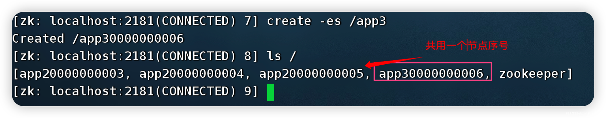

- 查询节点详细信息

```shell
# ls –s /节点path 
[zk: localhost:2181(CONNECTED) 5] ls / -s
[app20000000003, app20000000004, app20000000005, zookeeper]
cZxid = 0x0
ctime = Thu Jan 01 08:00:00 CST 1970
mZxid = 0x0
mtime = Thu Jan 01 08:00:00 CST 1970
pZxid = 0x14
cversion = 10
dataVersion = 0
aclVersion = 0
ephemeralOwner = 0x0
dataLength = 0
numChildren = 4
```

- czxid：节点被创建的事务ID

- ctime: 创建时间

- mzxid: 最后一次被更新的事务ID

- mtime: 修改时间

- pzxid：子节点列表最后一次被更新的事务ID

- cversion：子节点的版本号

- dataversion：数据版本号

- aclversion：权限版本号

- ephemeralOwner：用于临时节点，代表临时节点的事务ID，如果为持久节点则为0

- dataLength：节点存储的数据的长度

- numChildren：当前节点的子节点个数

# 2. Zookeeper JavaAPI操作

## 2.1 Curator介绍

Curator是Netflix公司开源的一套zookeeper客户端框架，Curator是对Zookeeper支持最好的客户端框架。Curator封装了大部分Zookeeper的功能，比如Leader选举、分布式锁等，减少了技术人员在使用Zookeeper时的底层细节开发工作。

Curator框架主要解决了三类问题：

- 封装ZooKeeper Client与ZooKeeper Server之间的连接处理（提供连接重试机制等）。

- 提供了一套Fluent风格的API，并且在Java客户端原生API的基础上进行了增强（创捷多层节点、删除多层节点等）。

- 提供ZooKeeper各种应用场景（分布式锁、leader选举、共享计数器、分布式队列等）的抽象封装。

## 2.2 引入Curator

- 创建maven项目，引入依赖

```xml
<?xml version="1.0" encoding="UTF-8"?>
<project xmlns="http://maven.apache.org/POM/4.0.0"
         xmlns:xsi="http://www.w3.org/2001/XMLSchema-instance"
         xsi:schemaLocation="http://maven.apache.org/POM/4.0.0 http://maven.apache.org/xsd/maven-4.0.0.xsd">
    <modelVersion>4.0.0</modelVersion>

    <groupId>com.mashibing</groupId>

    <artifactId>zk-client1</artifactId>

    <version>1.0-SNAPSHOT</version>

    <dependencies>
        <dependency>
            <groupId>junit</groupId>

            <artifactId>junit</artifactId>

            <version>4.10</version>

            <scope>test</scope>

        </dependency>

        <!--curator-->
        <dependency>
            <groupId>org.apache.curator</groupId>

            <artifactId>curator-framework</artifactId>

            <version>4.0.0</version>

        </dependency>

        <dependency>
            <groupId>org.apache.curator</groupId>

            <artifactId>curator-recipes</artifactId>

            <version>4.0.0</version>

        </dependency>

        <!--日志-->
        <dependency>
            <groupId>org.slf4j</groupId>

            <artifactId>slf4j-api</artifactId>

            <version>1.7.21</version>

        </dependency>

        <dependency>
            <groupId>org.slf4j</groupId>

            <artifactId>slf4j-log4j12</artifactId>

            <version>1.7.21</version>

        </dependency>

    </dependencies>

    <build>
        <plugins>
            <plugin>
                <groupId>org.apache.maven.plugins</groupId>

                <artifactId>maven-compiler-plugin</artifactId>

                <version>3.1</version>

                <configuration>
                    <source>1.8</source>

                    <target>1.8</target>

                </configuration>

            </plugin>

        </plugins>

    </build>

</project>

```

## 2.3 建立连接

方式1

```java
public class CuratorTest {

    /**
     * 建立连接
     */
    @Test
    public void testConnect(){

        /**
         * String connectString     连接字符串。 zk地址和端口： "192.168.58.100:2181,192.168.58.101:2181"
         * int sessionTimeoutMs     会话超时时间 单位ms
         * int connectionTimeoutMs  连接超时时间 单位ms
         * RetryPolicy retryPolicy  重试策略
         */
        //1. 第一种方式

        //重试策略 baseSleepTimeMs 重试之间等待的初始时间，maxRetries 重试的最大次数
        RetryPolicy retryPolicy = new ExponentialBackoffRetry(3000,10);

        CuratorFramework client = CuratorFrameworkFactory.newClient("192.168.58.100:2181", 60 * 1000,
                15 * 1000, retryPolicy);

        //开启连接
        client.start();

    }
}
```

重试策略

- RetryNTimes： 重试没有次数限制

- RetryOneTime：只重试没有次数限制，一般也不常用

- ExponentialBackoffRetry： 只重试一次的重试策略

方式2

```java
public class CuratorTest {

    private CuratorFramework client;

    /**
     * 建立连接
     */
    @Test
    public void testConnect(){

        /**
         * String connectString     连接字符串。 zk地址和端口： "192.168.58.100:2181,192.168.58.101:2181"
         * int sessionTimeoutMs     会话超时时间 单位ms
         * int connectionTimeoutMs  连接超时时间 单位ms
         * RetryPolicy retryPolicy  重试策略
         */
        //1. 第一种方式

        //重试策略 baseSleepTimeMs 重试之间等待的初始时间，maxRetries 重试的最大次数
        RetryPolicy retryPolicy = new ExponentialBackoffRetry(3000,10);

//      client   = CuratorFrameworkFactory.newClient("192.168.58.100:2181", 60 * 1000,
//                15 * 1000, retryPolicy);

        //2. 第二种方式，建造者方式创建
        client = CuratorFrameworkFactory.builder()
                .connectString("192.168.58.100:2181")
                .sessionTimeoutMs(60*1000)
                .connectionTimeoutMs(15 * 1000)
                .retryPolicy(retryPolicy)
                .namespace("mashibing")  //根节点名称设置
                .build();

        //开启连接
        client.start();
    }
}
```

## 2.4 添加节点

修改testConnect注解，@Before

```java
   /**
     * 建立连接
     */
    @Before
    public void testConnect()
```

创建节点：create 持久 临时 顺序 数据

```java
public class CuratorTest {
    /**
     * 创建节点 create 持久 临时 顺序 数据
     */
    //1.创建节点
    @Test
    public void testCreate1() throws Exception {

        // 如果没有创建节点，没有指定数据，则默认将当前客户端的IP 作为数据存储
        String path = client.create().forPath("/app1");
        System.out.println(path);
    }

    @After
    public void close(){
        client.close();
    }
}
```

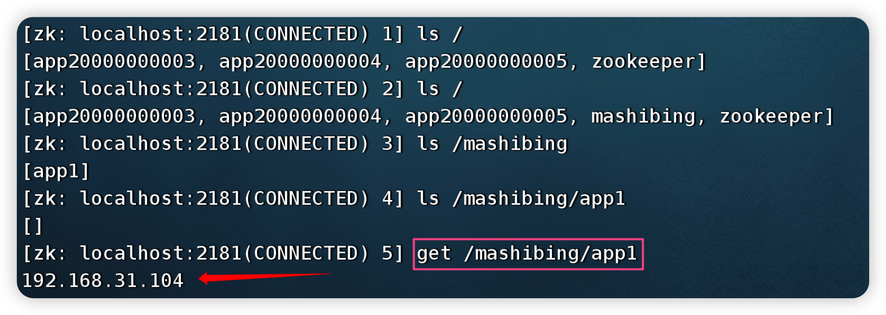

```java
    //2.创建节点 带有数据
    @Test
    public void testCreate2() throws Exception {
        String path = client.create().forPath("/app2","hehe".getBytes());
        System.out.println(path);
    }
```


```java
    //3.设置节点类型 默认持久化
    @Test
    public void testCreate3() throws Exception {
        //设置临时节点
        String path = client.create().withMode(CreateMode.EPHEMERAL).forPath("/app3");
        System.out.println(path);
    }
```

由于是临时节点，需要打断点才能看到节点信息


```java
//1.查询数据 getData
@Test
public void testGet1() throws Exception {
    byte[] data = client.getData().forPath("/app1");
    System.out.println(new String(data));
}

//2.查询子节点 getChildren()
@Test
public void testGet2() throws Exception {
    List<String> path = client.getChildren().forPath("/");
    System.out.println(path);
}

//3.查询节点状态信息
@Test
public void testGet3() throws Exception {
    Stat status = new Stat();
    System.out.println(status);
    //查询节点状态信息： ls -s
    client.getData().storingStatIn(status).forPath("/app1");
    System.out.println(status);
}
```

## 2.5 修改节点

```java
    //1. 基本数据修改
    @Test
    public void testSet() throws Exception {
        client.setData().forPath("/app1","hahaha".getBytes());
    }

    //根据版本修改（乐观锁）
    @Test
    public void testSetVersion() throws Exception {
        //查询版本
        Stat status = new Stat();
        //查询节点状态信息： ls -s
        client.getData().storingStatIn(status).forPath("/app1");
        int version = status.getVersion();
        System.out.println(version);  //2

        client.setData().withVersion(version).forPath("/app1","hehe".getBytes());
    }
```

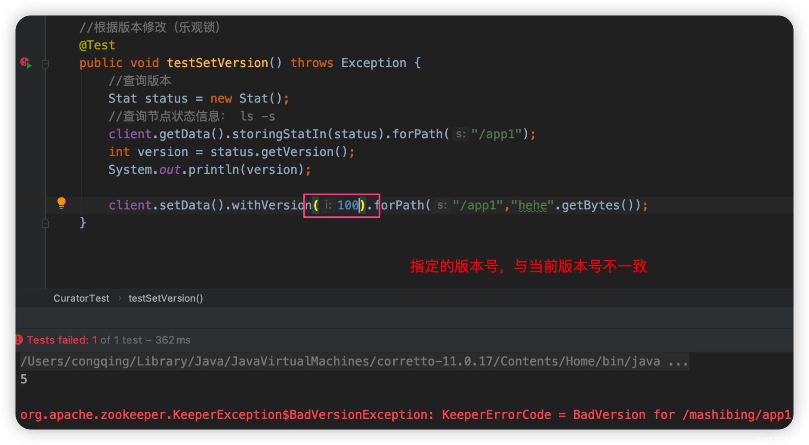

## 2.6 删除节点

```java
    //1.删除单个节点
    @Test
    public void testDelete1() throws Exception {

        client.delete().forPath("/app4");
    }

    //删除带有子节点的节点
    @Test
    public void testDelete2() throws Exception {

        client.delete().deletingChildrenIfNeeded().forPath("/app4");
    }

    //必须删除成功（超时情况下，重试删除）
    @Test
    public void testDelete3() throws Exception {

        client.delete().guaranteed().forPath("/app2");
    }

    //回调 删除完成后执行
    @Test
    public void testDelete4() throws Exception {

        client.delete().guaranteed().inBackground((curatorFramework, curatorEvent) -> {
            System.out.println("我被删除了");
            System.out.println(curatorEvent);
        }).forPath("/app1");
    }
```

## 2.7 Watch事件监听

ZooKeeper 允许用户在指定节点上注册一些Watcher，并且在一些特定事件触发的时候，ZooKeeper 服务端会将事件通知到感兴趣的客户端上去，该机制是 ZooKeeper 实现分布式协调服务的重要特性。

ZooKeeper 中引入了Watcher机制来实现了发布/订阅功能能，能够让多个订阅者同时监听某一个对象，当一个对象自身状态变化时，会通知所有订阅者。

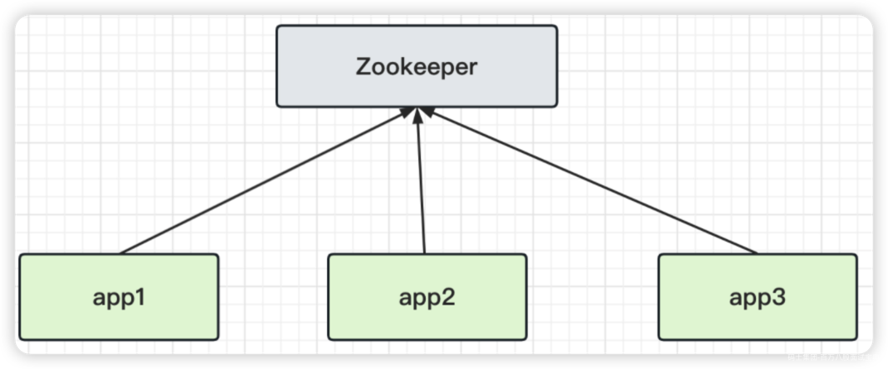

### 2.7.1 zkCli客户端使用watch

添加 -w 参数可实时监听节点与子节点的变化，并且实时收到通知。非常适用保障分布式情况下的数据一至性。

其使用方式如下

|  |  |
| --- | --- |
| 命令 | 描述 |
| ls -w path | 监听子节点的变化（增，删） [监听目录] |
| get -w path | 监听节点数据的变化 |
| stat -w path | 监听节点属性的变化 |
|  |  |

**Zookeeper事件类型**

- NodeCreated： 节点创建

- NodeDeleted： 节点删除

- NodeDataChanged：节点数据变化

- NodeChildrenChanged：子节点列表变化

- DataWatchRemoved：节点监听被移除

- ChildWatchRemoved：子节点监听被移除

**1）get -w path 监听节点数据变化**

- 会话1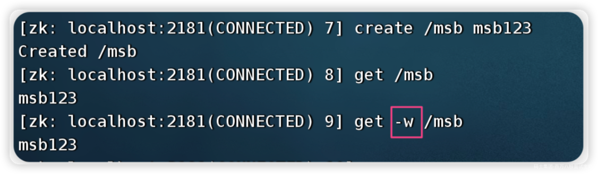

- 会话2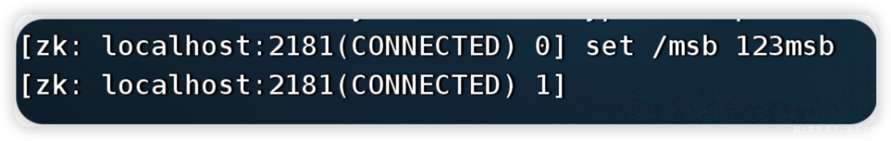

- 再回到会话一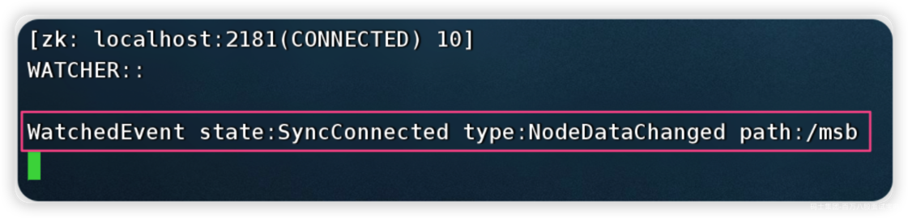

**2） ls -w /path 监听子节点的变化（增，删） [监听目录]**

- 会话1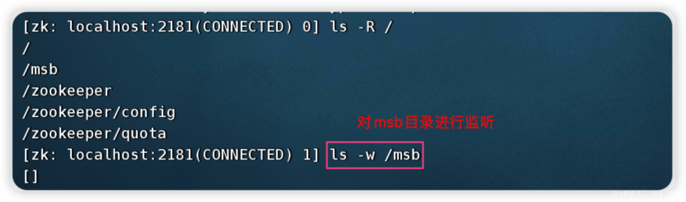

- 会话2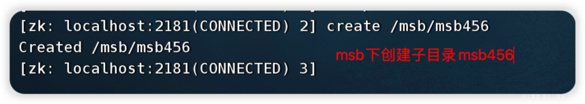

- 切到【会话一】 观察输出的监听日志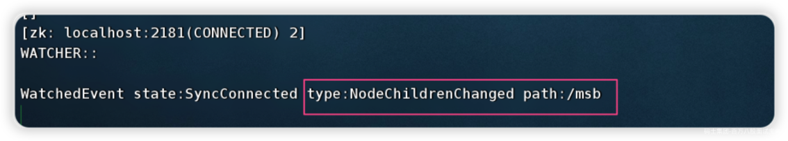

当然了 delete 目录，也会发生变化

如果对节点数据内容，ls -w 是收不到通知的，只能通过 get -w来实现 。

这里，监听一点触发，就失效了，切记。

**3) ls -R -w /path 例子二 循环递归的监听**

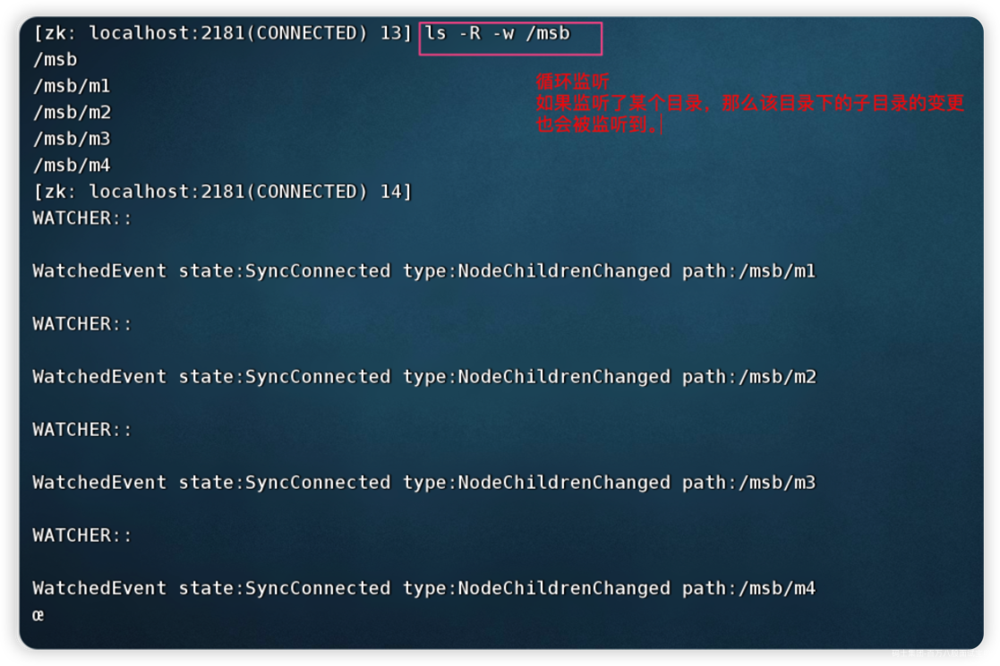

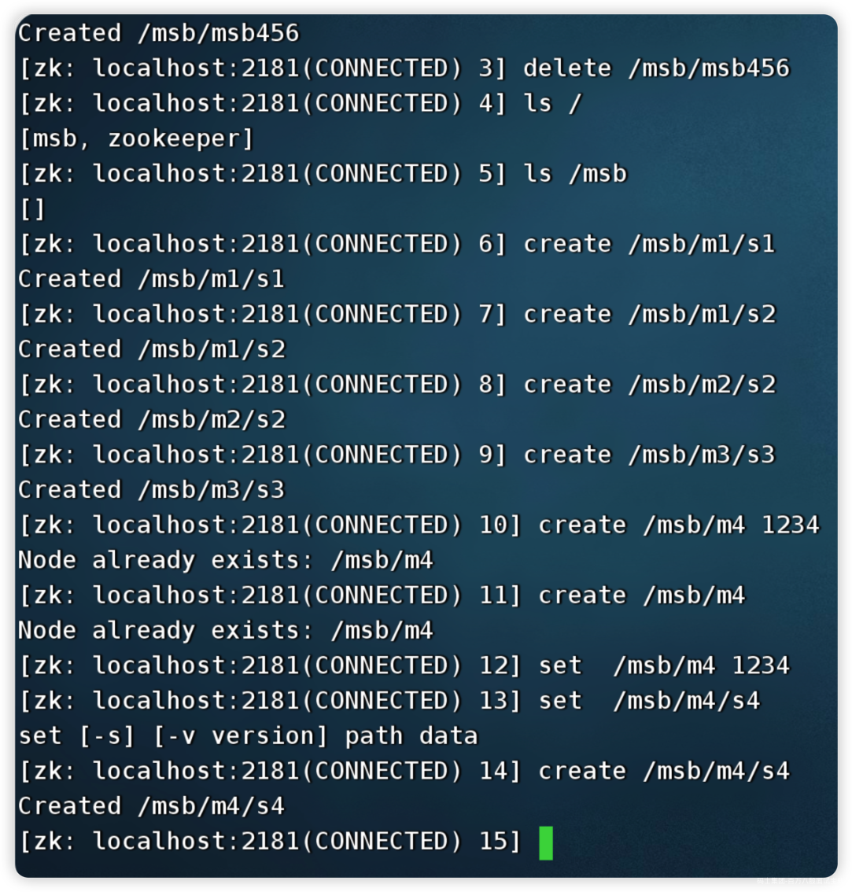

### 2.7.2 curator客户端使用watch

ZooKeeper 原生支持通过注册Watcher来进行事件监听，但是其使用并不是特别方便需要开发人员自己反复注册Watcher，比较繁琐。

Curator引入了 Cache 来实现对 ZooKeeper 服务端事件的监听。

ZooKeeper提供了三种Watcher：

- NodeCache : 只是监听某一个特定的节点

- PathChildrenCache : 监控一个ZNode的子节点.

- TreeCache : 可以监控整个树上的所有节点，类似于PathChildrenCache和NodeCache的组合

**1）watch监听 NodeCache**

```java
public class CuratorWatchTest {
        /**
     * 演示 NodeCache : 给指定一个节点注册监听
     */
    @Test
    public void testNodeCache() throws Exception {

        //1. 创建NodeCache对象
        NodeCache nodeCache = new NodeCache(client, "/app1");  //监听的是 /mashibing和其子目录app1

        //2. 注册监听
        nodeCache.getListenable().addListener(new NodeCacheListener() {
            @Override
            public void nodeChanged() throws Exception {
                System.out.println("节点变化了。。。。。。");

                //获取修改节点后的数据
                byte[] data = nodeCache.getCurrentData().getData();
                System.out.println(new String(data));
            }
        });

        //3. 设置为true，开启监听
        nodeCache.start(true);

        while(true){

        }
    } 
}
```

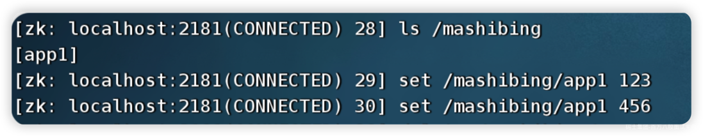

**2）watch监听 PathChildrenCache**

```java
    /**
     * 演示 PathChildrenCache: 监听某个节点的所有子节点
     */
    @Test
    public void testPathChildrenCache() throws Exception {

        //1.创建监听器对象 (第三个参数表示缓存每次节点更新后的数据)
        PathChildrenCache pathChildrenCache = new PathChildrenCache(client, "/app2", true);

        //2.绑定监听器
        pathChildrenCache.getListenable().addListener(new PathChildrenCacheListener() {
            @Override
            public void childEvent(CuratorFramework curatorFramework, PathChildrenCacheEvent pathChildrenCacheEvent) throws Exception {
                System.out.println("子节点发生变化了。。。。。。");
                System.out.println(pathChildrenCacheEvent);

                if(PathChildrenCacheEvent.Type.CHILD_UPDATED == pathChildrenCacheEvent.getType()){
                    //更新子节点
                    System.out.println("子节点更新了！");
                    //在一个getData中有很多数据，我们只拿data部分
                    byte[] data = pathChildrenCacheEvent.getData().getData();
                    System.out.println("更新后的值为：" + new String(data));

                }else if(PathChildrenCacheEvent.Type.CHILD_ADDED == pathChildrenCacheEvent.getType()){
                    //添加子节点
                    System.out.println("添加子节点！");
                    String path = pathChildrenCacheEvent.getData().getPath();
                    System.out.println("子节点路径为： " + path);

                }else if(PathChildrenCacheEvent.Type.CHILD_REMOVED == pathChildrenCacheEvent.getType()){
                    //删除子节点
                    System.out.println("删除了子节点");
                    String path = pathChildrenCacheEvent.getData().getPath();
                    System.out.println("子节点路径为： " + path);
                }
            }
        });

        //3. 开启
        pathChildrenCache.start();

        while(true){

        }
    }
```

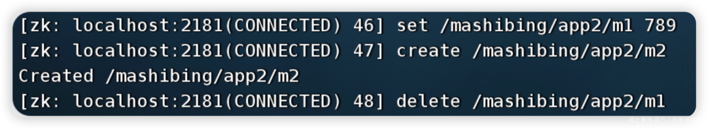

**事件对象信息分析**

```json
PathChildrenCacheEvent{
    type=CHILD_UPDATED, 
    data=ChildData
    {
        path='/app2/m1', 
        stat=164,166,1670114647087,1670114698259,1,0,0,0,3,0,164, 
        data=[49, 50, 51]
    }
}
```

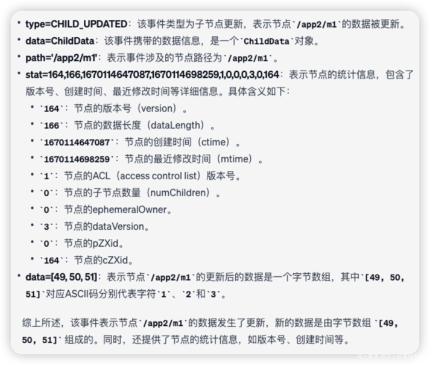

**3）watch监听 TreeCache**

TreeCache相当于NodeCache（只监听当前结点）+ PathChildrenCache（只监听子结点）的结合版，即监听当前和子结点。

```java
  /**
     * 演示 TreeCache: 监听某个节点的所有子节点
     */
    @Test
    public void testCache() throws Exception {

        //1.创建监听器对象
        TreeCache treeCache = new TreeCache(client, "/app2");

        //2.绑定监听器
        treeCache.getListenable().addListener(new TreeCacheListener() {
            @Override
            public void childEvent(CuratorFramework curatorFramework, TreeCacheEvent treeCacheEvent) throws Exception {
                System.out.println("节点变化了");
                System.out.println(treeCacheEvent);

                if(TreeCacheEvent.Type.NODE_UPDATED == treeCacheEvent.getType()){
                    //更新节点
                    System.out.println("节点更新了！");
                    //在一个getData中有很多数据，我们只拿data部分
                    byte[] data = treeCacheEvent.getData().getData();
                    System.out.println("更新后的值为：" + new String(data));

                }else if(TreeCacheEvent.Type.NODE_ADDED == treeCacheEvent.getType()){
                    //添加子节点
                    System.out.println("添加节点！");
                    String path = treeCacheEvent.getData().getPath();
                    System.out.println("子节点路径为： " + path);

                }else if(TreeCacheEvent.Type.NODE_REMOVED == treeCacheEvent.getType()){
                    //删除子节点
                    System.out.println("删除节点");
                    String path = treeCacheEvent.getData().getPath();
                    System.out.println("删除节点路径为： " + path);
                }
            }
        });

        //3. 开启
        treeCache.start();

        while(true){

        }
    }
```

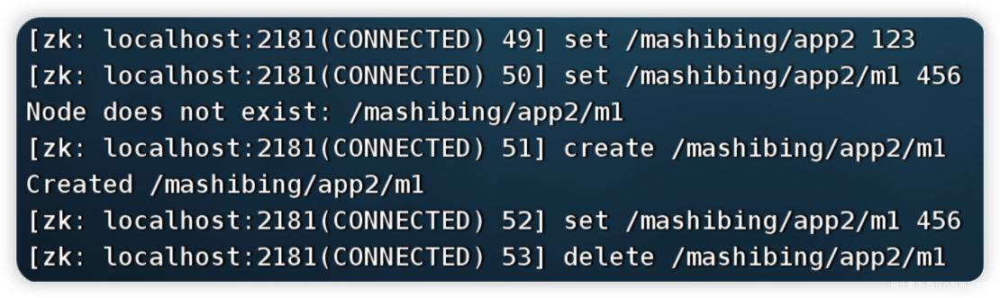
