# 第三节 zookeeper基础应用与实战2

# 1. Watch事件监听

## 1.1 一次性监听方式：Watcher

利用 Watcher 来对节点进行监听操作，可以典型业务场景需要使用可考虑，但一般情况不推荐使用。

```java
public class CuratorWatchTest {

    private CuratorFramework client;

    /**
     * 建立连接
     */
    @Before
    public void testConnect(){

        /**
         * String connectString,  连接字符串 zk地址 端口： "192.168.58.100:2181，，，，"
         * int sessionTimeoutMs,  会话超时时间
         * int connectionTimeoutMs,  连接超时时间
         * RetryPolicy retryPolicy   重试策略
         */
        //1. 第一种方式
        RetryPolicy retryPolicy =new ExponentialBackoffRetry(3000,10);

        //2. 第二种方式
        client = CuratorFrameworkFactory.builder()
                .connectString("192.168.58.100:2181")
                .sessionTimeoutMs(60*1000)
                .connectionTimeoutMs(15*1000)
                .retryPolicy(retryPolicy)
                .namespace("mashibing")  //当前程序创建目录的根目录
                .build();

        client.start();
    }

    /**
     * 演示一次性监听
     */
    @Test
    public  void testOneListener() throws Exception {

        byte[] data = client.getData().usingWatcher(new Watcher() {
            @Override
            public void process(WatchedEvent watchedEvent) {
                System.out.println("监听器 watchedEvent: " + watchedEvent);
            }
        }).forPath("/test");

        System.out.println("监听节点内容：" + new String(data));

        while(true){

        }
    }
  
    @After
    public void close(){
        client.close();
    }
}
```

上面这段代码对 **/test** 节点注册了一个 Watcher 监听事件，并且返回当前节点的内容。后面进行两次数据变更，实际上第二次变更时，监听已经失效，无法再次获得节点变动事件了。测试中控制台输出的信息如下：

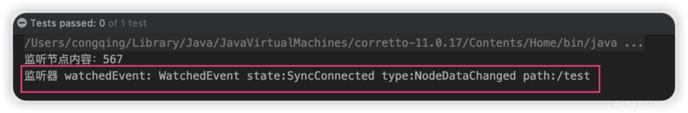

## 1.2 Curator事件监听机制

ZooKeeper 原生支持通过注册Watcher来进行事件监听，但是其使用并不是特别方便需要开发人员自己反复注册Watcher，比较繁琐。

Curator引入了 Cache 来实现对 ZooKeeper 服务端事件的监听。

ZooKeeper提供了三种Watcher：

- NodeCache : 只是监听某一个特定的节点

- PathChildrenCache : 监控一个ZNode的子节点.

- TreeCache : 可以监控整个树上的所有节点，类似于PathChildrenCache和NodeCache的组合

**1）watch监听 NodeCache**

监听数据节点本身的变化。NodeCacheListener 来完成后续处理。

```java
public class CuratorWatchTest {
        /**
     * 演示 NodeCache : 给指定一个节点注册监听
     */
    @Test
    public void testNodeCache() throws Exception {

        //1. 创建NodeCache对象
        NodeCache nodeCache = new NodeCache(client, "/app1");  //监听的是 /mashibing和其子目录app1

        //2. 注册监听
        nodeCache.getListenable().addListener(new NodeCacheListener() {
            @Override
            public void nodeChanged() throws Exception {
                System.out.println("节点变化了。。。。。。");

                //获取修改节点后的数据
                byte[] data = nodeCache.getCurrentData().getData();
                System.out.println(new String(data));
            }
        });

        //3. 设置为true，开启监听
        nodeCache.start(true);

        while(true){

        }
    } 
}
```

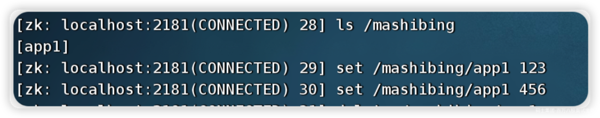

> NodeCache不仅可以监听节点内容变化，还可以监听指定节点是否存在。如果原本节点不存在，那么Cache就会在节点被创建时触发监听事件，如果该节点被删除，就无法再触发监听事件。

**2）watch监听 PathChildrenCache**

```java
    /**
     * 演示 PathChildrenCache: 监听某个节点的所有子节点
     */
    @Test
    public void testPathChildrenCache() throws Exception {

        //1.创建监听器对象 (第三个参数表示缓存每次节点更新后的数据)
        PathChildrenCache pathChildrenCache = new PathChildrenCache(client, "/app2", true);

        //2.绑定监听器
        pathChildrenCache.getListenable().addListener(new PathChildrenCacheListener() {
            @Override
            public void childEvent(CuratorFramework curatorFramework, PathChildrenCacheEvent pathChildrenCacheEvent) throws Exception {
                System.out.println("子节点发生变化了。。。。。。");
                System.out.println(pathChildrenCacheEvent);

                if(PathChildrenCacheEvent.Type.CHILD_UPDATED == pathChildrenCacheEvent.getType()){
                    //更新子节点
                    System.out.println("子节点更新了！");
                    //在一个getData中有很多数据，我们只拿data部分
                    byte[] data = pathChildrenCacheEvent.getData().getData();
                    System.out.println("更新后的值为：" + new String(data));

                }else if(PathChildrenCacheEvent.Type.CHILD_ADDED == pathChildrenCacheEvent.getType()){
                    //添加子节点
                    System.out.println("添加子节点！");
                    String path = pathChildrenCacheEvent.getData().getPath();
                    System.out.println("子节点路径为： " + path);

                }else if(PathChildrenCacheEvent.Type.CHILD_REMOVED == pathChildrenCacheEvent.getType()){
                    //删除子节点
                    System.out.println("删除了子节点");
                    String path = pathChildrenCacheEvent.getData().getPath();
                    System.out.println("子节点路径为： " + path);
                }
            }
        });

        //3. 开启
        pathChildrenCache.start();

        while(true){

        }
    }
```

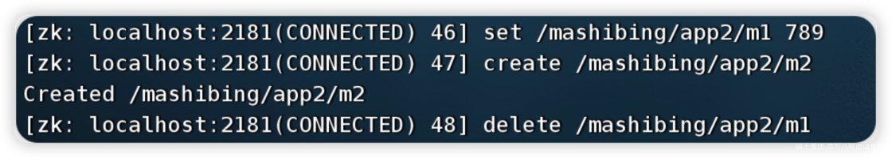

- **事件对象信息分析**

```json
PathChildrenCacheEvent{
    type=CHILD_UPDATED, 
    data=ChildData
    {
        path='/app2/m1', 
        stat=164,166,1670114647087,1670114698259,1,0,0,0,3,0,164, 
        data=[49, 50, 51]
    }
}
```

**3）watch监听 TreeCache**

TreeCache相当于NodeCache（只监听当前结点）+ PathChildrenCache（只监听子结点）的结合版，即监听当前和子结点。

```java
  /**
     * 演示 TreeCache: 监听某个节点的所有子节点
     */
    @Test
    public void testCache() throws Exception {

        //1.创建监听器对象
        TreeCache treeCache = new TreeCache(client, "/app2");

        //2.绑定监听器
        treeCache.getListenable().addListener(new TreeCacheListener() {
            @Override
            public void childEvent(CuratorFramework curatorFramework, TreeCacheEvent treeCacheEvent) throws Exception {
                System.out.println("节点变化了");
                System.out.println(treeCacheEvent);

                if(TreeCacheEvent.Type.NODE_UPDATED == treeCacheEvent.getType()){
                    //更新节点
                    System.out.println("节点更新了！");
                    //在一个getData中有很多数据，我们只拿data部分
                    byte[] data = treeCacheEvent.getData().getData();
                    System.out.println("更新后的值为：" + new String(data));

                }else if(TreeCacheEvent.Type.NODE_ADDED == treeCacheEvent.getType()){
                    //添加子节点
                    System.out.println("添加节点！");
                    String path = treeCacheEvent.getData().getPath();
                    System.out.println("子节点路径为： " + path);

                }else if(TreeCacheEvent.Type.NODE_REMOVED == treeCacheEvent.getType()){
                    //删除子节点
                    System.out.println("删除节点");
                    String path = treeCacheEvent.getData().getPath();
                    System.out.println("删除节点路径为： " + path);
                }
            }
        });

        //3. 开启
        treeCache.start();

        while(true){

        }
    }
```

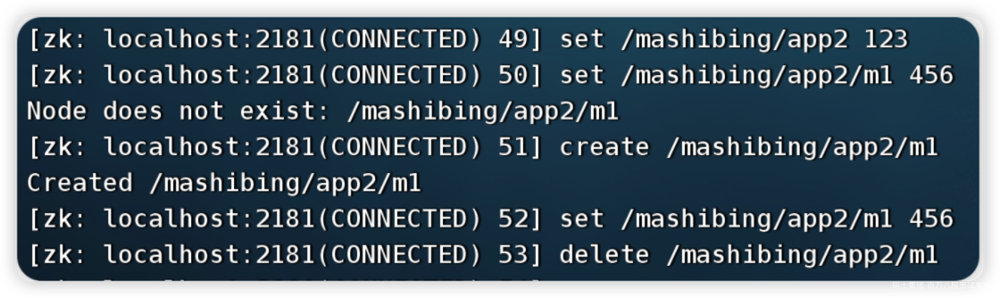

# 2. 事务&异步操作演示

## 2.1 事务演示

CuratorFramework 的实例包含 inTransaction( ) 接口方法，调用此方法开启一个 ZooKeeper 事务。

可以复合create、 setData、 check、and/or delete 等操作然后调用 commit() 作为一个原子操作提交。

```java
/**
    * 事务操作
    */
@Test
public void TestTransaction() throws Exception {

  //1. 创建Curator对象，用于定义事务操作
  CuratorOp createOp = client.transactionOp().create().forPath("/app3", "app1-data".getBytes());
  CuratorOp setDataOp = client.transactionOp().setData().forPath("/app2", "app2-data".getBytes());
  CuratorOp deleteOp = client.transactionOp().delete().forPath("/app2");

  //2. 添加事务操
  Collection<CuratorTransactionResult> results = client.transaction().forOperations(createOp, setDataOp, deleteOp);

  //3. 遍历事务操作结果
  for (CuratorTransactionResult result : results) {
    System.out.println(result.getForPath() + " - " + result.getType());
  }
}
```

## 2.2 异步操作

前面提到的增删改查都是同步的，但是 Curator 也提供了异步接口，引入了 BackgroundCallback 接口用于处理异步接口调用之后服务端返回的结果信息。

BackgroundCallback 接口中一个重要的回调值为 CuratorEvent，里面包含事件类型、响应码和节点的详细信息。

```java

    // 异步操作
    @Test
    public void TestAsync() throws Exception {

        while(true){

            // 异步获取子节点列表
            GetChildrenBuilder builder = client.getChildren();
            builder.inBackground(new BackgroundCallback() {
                @Override
                public void processResult(CuratorFramework curatorFramework, CuratorEvent curatorEvent) throws Exception {
                    System.out.println("子节点列表：" + curatorEvent.getChildren());
                }
            }).forPath("/");

            TimeUnit.SECONDS.sleep(5);
        }

    }
```

# 3. Zookeeper权限控制

## 3.1 zk权限控制介绍

Zookeeper作为一个分布式协调框架，内部存储了一些分布式系统运行时的状态的数据，比如master选举、比如分布式锁。对这些数据的操作会直接影响到分布式系统的运行状态。因此，为了保证zookeeper中的数据的安全性，避免误操作带来的影响。Zookeeper提供了一套ACL权限控制机制来保证数据的安全。

ACL权限控制，使用：`scheme:id:perm`来标识。

- Scheme（权限模式），标识授权策略

- ID（授权对象）

- Permission：授予的权限

ZooKeeper的权限控制是基于每个znode节点的，需要对每个节点设置权限，每个znode支持设置多种权限控制方案和多个权限，子节点不会继承父节点的权限，客户端无权访问某节点，但可能可以访问它的子节点。

## 3.2 Scheme 权限模式

Zookeeper提供以下权限模式，所谓权限模式，就是使用什么样的方式来进行授权。

- **world:** 默认方式，相当于全部都能访问。

- **auth**：代表已经认证通过的用户

> cli中可以通过 `addauth digest user:pwd` 来添加当前上下文中的授权用户

- **digest**：即用户名:密码这种方式认证，这也是业务系统中最常用的。

> 用 *username:password* 字符串来产生一个MD5串，然后该串被用来作为ACL ID。认证是通过明文发送*username:password* 来进行的，当用在ACL时，表达式为*username:base64* ，base64是password的SHA1摘要的编码。

- **ip**：通过ip地址来做权限控制

> 比如 ip:192.168.1.1 表示权限控制都是针对这个ip地址的。也可以针对网段 ip:192.168.1.1/24，此时addr中的有效位与客户端addr中的有效位进行比对。

## 3.3 ID 授权对象

指权限赋予的用户或一个指定的实体，不同的权限模式下，授权对象不同。

```java
Id ipId = new Id("ip", "192.168.58.100");
Id ANYONE_ID_UNSAFE = new Id("world", "anyone");
```

## 3.4 Permission权限类型

指通过权限检查后可以被允许的操作，create /delete /read/write/admin

- Create 允许对子节点Create 操作

- Read 允许对本节点GetChildren 和GetData 操作

- Write 允许对本节点SetData 操作

- Delete 允许对子节点Delete 操作

- Admin 允许对本节点setAcl 操作

权限模式(Schema)和授权对象主要用来确认权限验证过程中使用的验证策略：

**比如ip地址、digest:username:password**，匹配到验证策略并验证成功后，再根据权限操作类型来决定当前客户端的访问权限。

## 3.5 在控制台实现操作

在Zookeeper中提供了ACL相关的命令

```shell
getAcl        getAcl <path>     读取ACL权限
setAcl        setAcl <path> <acl>     设置ACL权限
addauth      addauth <scheme> <auth>     添加认证用户
```

**1）word方式**

创建一个节点后默认就是world模式

```shell
[zk: localhost:2181(CONNECTED) 6] create /auth
Created /auth

[zk: localhost:2181(CONNECTED) 7] getAcl /auth
'world,'anyone
: cdrwa

[zk: localhost:2181(CONNECTED) 8] create /auth2
Created /auth2

[zk: localhost:2181(CONNECTED) 9] getAcl /auth2
'world,'anyone
: cdrwa

[zk: localhost:2181(CONNECTED) 10] 
```

> 其中， cdrwa，分别对应 create . delete read write admin

**2）IP方式**

在ip模式中，首先连接到zkServer的命令需要使用如下方式

```shell
zkCli.sh -server 127.0.0.1:2181 
```

接着按照IP的方式操作如下

```shell
[zk: 127.0.0.1:2181(CONNECTED) 0] create /ip-model
Created /ip-model

[zk: 127.0.0.1:2181(CONNECTED) 1] setAcl /ip-model ip:127.0.0.1:cdrwa

[zk: 127.0.0.1:2181(CONNECTED) 3] getAcl /ip-model
'ip,'127.0.0.1
: cdrwa
```

**3） Auth模式**

auth模式的操作如下。

```shell
[zk: 127.0.0.1:2181(CONNECTED) 5] create /spike
Created /spike

[zk: 127.0.0.1:2181(CONNECTED) 6] addauth digest spike:123456

[zk: 127.0.0.1:2181(CONNECTED) 9] setAcl /spike auth:spike:cdrwa

[zk: 127.0.0.1:2181(CONNECTED) 10] getAcl /spike
'digest,'spike:pPeKgz2N9Xc8Um6wwnzFUMteLxk=
: cdrwa
```

当我们退出当前的会话后，再次连接，执行如下操作，会提示没有权限

```shell
[zk: localhost:2181(CONNECTED) 0] get /spike
Insufficient permission : /spike 
```

这时候，我们需要重新授权。

```shell
[zk: localhost:2181(CONNECTED) 1] addauth digest spike:123456
[zk: localhost:2181(CONNECTED) 2] get /spike
null 
```

\*\*4） Digest模式 \*\*

使用语法，会发现使用方式和Auth模式相同

```shell
setAcl /digest digest:用户名:密码:权限
```

但是有一个不一样的点，密码需要用加密后的，否则无法被识别。

**密码： 用户名和密码加密后的字符串。**

使用下面程序生成密码

```java
public class TestAcl {

    @Test
    public void createPw() throws NoSuchAlgorithmException {

        String up = "msb:msb";
        byte[] digest = MessageDigest.getInstance("SHA1").digest(up.getBytes());
        String encodeStr = Base64.getEncoder().encodeToString(digest);
        System.out.println(encodeStr);
    }
}
```

得到： **5FAC7McRhLdx0QUWsfEbK8pqwxc=**

再回到client上进行如下操作

```shell
[zk: localhost:2181(CONNECTED) 14] create /digest
Created /digest

[zk: localhost:2181(CONNECTED) 15] setAcl /digest digest:msb:5FAC7McRhLdx0QUWsfEbK8pqwxc=:cdrwa

[zk: localhost:2181(CONNECTED) 16] getAcl /digest
'digest,'msb:5FAC7McRhLdx0QUWsfEbK8pqwxc=
: cdrwa
```

当退出当前会话后，需要再次授权才能访问\*\*/digest\*\*节点

```shell
[zk: localhost:2181(CONNECTED) 0] get /digest
Insufficient permission : /digest

[zk: localhost:2181(CONNECTED) 1] addauth digest msb:msb

[zk: localhost:2181(CONNECTED) 2] get /digest
null
```

## 3.6 Curator演示ACL的使用

接下来我们使用Curator简单演示一下ACL权限的访问操作。

```java
public class TestAcl {

    private CuratorFramework client;

    @Test
    public void createPw() throws NoSuchAlgorithmException {

        String up = "msb:msb";
        byte[] digest = MessageDigest.getInstance("SHA1").digest(up.getBytes());
        String encodeStr = Base64.getEncoder().encodeToString(digest);
        System.out.println(encodeStr);
    }

    //1.创建连接
    @Before
    public void createConnect(){

        client = CuratorFrameworkFactory.builder()
                .connectString("192.168.58.100:2181")
                .sessionTimeoutMs(5000).connectionTimeoutMs(20000)
                .retryPolicy(new ExponentialBackoffRetry(1000, 3))
                .namespace("msbAcl").build();

        client.start();
    }

    @Test
    public void testCuratorAcl() throws Exception {

        //创建ID，以Digest方式认证，用户名和密码为 msb:msb
        Id id = new Id("digest", DigestAuthenticationProvider.generateDigest("msb:msb"));

        //为ID对象指定权限
        List<ACL> acls = new ArrayList<>();
        acls.add(new ACL(ZooDefs.Perms.ALL,id));

        //创建节点 "auth",设置节点数据，并设置ACL权限
        String node = client.create().creatingParentsIfNeeded()
                .withMode(CreateMode.PERSISTENT)  // 设置节点类型是持久节点
                .withACL(acls,false)    //设置节点的ACL权限
                .forPath("/auth","hello".getBytes());   //设置节点的路径和数据

        System.out.println("成功创建带权限的节点： " + node);

        //获取刚刚创建的节点的数据
        byte[] bytes = client.getData().forPath(node);
        System.out.println("获取数据结果： " + new String(bytes));
    }

}
```

上述代码执行后会报错

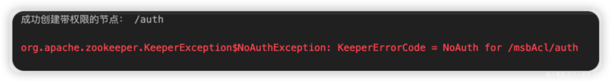

先删除节点

```plain
[zk: localhost:2181(CONNECTED) 6] deleteall /msbAcl
```

修改代码， 连接时增加授权

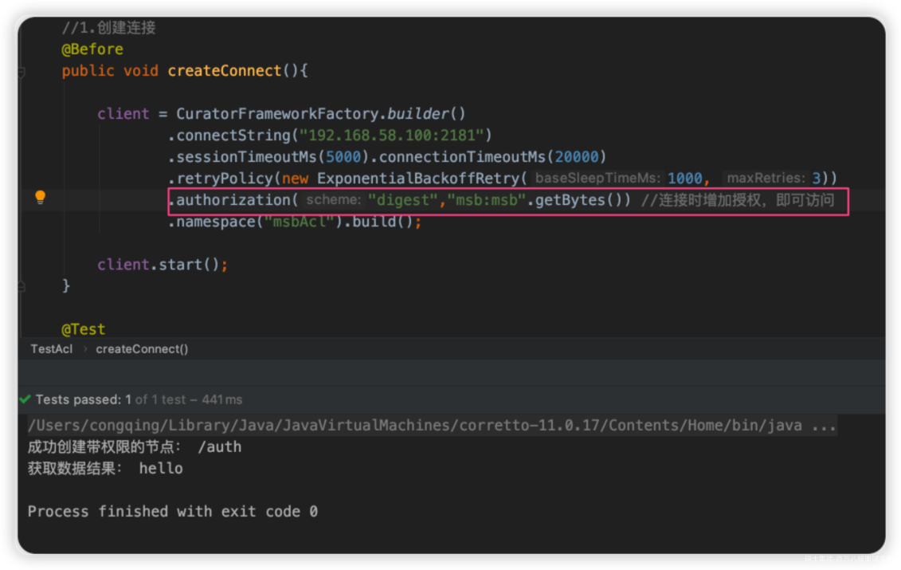

# 4. Zookeeper集群搭建

## 4.1 搭建要求

真实的集群是需要部署在不同的服务器上的，但是在我们测试时同时启动很多个虚拟机内存会吃不消，所以我们通常会搭建**伪集群**，也就是把所有的服务都搭建在一台虚拟机上，用端口进行区分。

我们这里要求搭建一个三个节点的Zookeeper集群（伪集群）。

## 4.2 Zookeeper集群角色

zookeeper集群中的节点有三种角色

- Leader：处理集群的所有事务请求（增删改），集群中只有一个Leader。

- Follower：只能处理读请求，参与Leader选举。

- Observer：只能处理读请求，提升集群读的性能，但不能参与Leader选举。

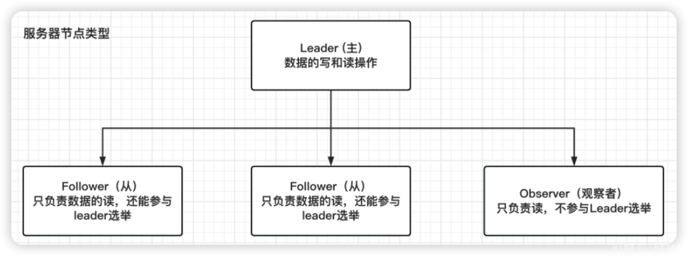

## 4.2 准备工作

重新部署一台虚拟机作为我们搭建集群的测试服务器。

（1）安装JDK 【此步骤省略】。

（2）Zookeeper压缩包上传到服务器  
（3）将Zookeeper解压 ，建立/usr/local/zookeeper-cluster目录，将解压后的Zookeeper复制到以下三个目录。

```shell
[root@localhost ~]# mkdir /usr/local/zookeeper-cluster

[root@localhost software]# cp -r apache-zookeeper-3.7.1-bin /usr/local/zookeeper-cluster/zookeeper-1
  
[root@localhost software]# cp -r apache-zookeeper-3.7.1-bin /usr/local/zookeeper-cluster/zookeeper-2
  
[root@localhost software]# cp -r apache-zookeeper-3.7.1-bin /usr/local/zookeeper-cluster/zookeeper-3
```

（4）创建data目录 ，并且将 conf下zoo\_sample.cfg 文件改名为 zoo.cfg

```shell
mkdir /usr/local/zookeeper-cluster/zookeeper-1/data
mkdir /usr/local/zookeeper-cluster/zookeeper-2/data
mkdir /usr/local/zookeeper-cluster/zookeeper-3/data

mv  /usr/local/zookeeper-cluster/zookeeper-1/conf/zoo_sample.cfg  /usr/local/zookeeper-cluster/zookeeper-1/conf/zoo.cfg
mv  /usr/local/zookeeper-cluster/zookeeper-2/conf/zoo_sample.cfg  /usr/local/zookeeper-cluster/zookeeper-2/conf/zoo.cfg
mv  /usr/local/zookeeper-cluster/zookeeper-3/conf/zoo_sample.cfg  /usr/local/zookeeper-cluster/zookeeper-3/conf/zoo.cfg
```

（5） 配置每一个Zookeeper 的dataDir 和 clientPort 分别为：2181 2182 2183

修改/usr/local/zookeeper-cluster/zookeeper-1/conf/zoo.cfg

```shell
vim /usr/local/zookeeper-cluster/zookeeper-1/conf/zoo.cfg

clientPort=2181
dataDir=/usr/local/zookeeper-cluster/zookeeper-1/data
```

修改/usr/local/zookeeper-cluster/zookeeper-2/conf/zoo.cfg

```shell
vim /usr/local/zookeeper-cluster/zookeeper-2/conf/zoo.cfg

clientPort=2182
dataDir=/usr/local/zookeeper-cluster/zookeeper-2/data
```

修改/usr/local/zookeeper-cluster/zookeeper-3/conf/zoo.cfg

```shell
vim /usr/local/zookeeper-cluster/zookeeper-3/conf/zoo.cfg

clientPort=2183
dataDir=/usr/local/zookeeper-cluster/zookeeper-3/data
```

## 4.3 配置集群

（1）在每个zookeeper的 data 目录下创建一个 myid 文件，内容分别是1、2、3 。这个文件就是记录每个服务器的ID

```shell
[root@localhost software]# echo 1 > /usr/local/zookeeper-cluster/zookeeper-1/data/myid
[root@localhost software]# echo 2 > /usr/local/zookeeper-cluster/zookeeper-2/data/myid
[root@localhost software]# echo 3 > /usr/local/zookeeper-cluster/zookeeper-3/data/myid   
```

（2）在每一个zookeeper 的 zoo.cfg配置客户端访问端口（clientPort）和集群服务器IP列表。

集群服务器IP列表如下

```shell
vim /usr/local/zookeeper-cluster/zookeeper-1/conf/zoo.cfg
vim /usr/local/zookeeper-cluster/zookeeper-2/conf/zoo.cfg
vim /usr/local/zookeeper-cluster/zookeeper-3/conf/zoo.cfg

server.1=192.168.58.200:2881:3881
server.2=192.168.58.200:2882:3882
server.3=192.168.58.200:2883:3883   
```

解释：server.服务器ID=服务器IP地址：服务器之间通信端口：服务器之间投票选举端口

## 4.4 启动集群

启动集群就是分别启动每个实例。

```shell
/usr/local/zookeeper-cluster/zookeeper-1/bin/zkServer.sh start
/usr/local/zookeeper-cluster/zookeeper-2/bin/zkServer.sh start
/usr/local/zookeeper-cluster/zookeeper-3/bin/zkServer.sh start
```

启动后我们查询一下每个实例的运行状态

```shell
/usr/local/zookeeper-cluster/zookeeper-1/bin/zkServer.sh status
/usr/local/zookeeper-cluster/zookeeper-2/bin/zkServer.sh status
/usr/local/zookeeper-cluster/zookeeper-3/bin/zkServer.sh status
```

查询第一个服务，Mode为follower表示是**跟随者**（从）

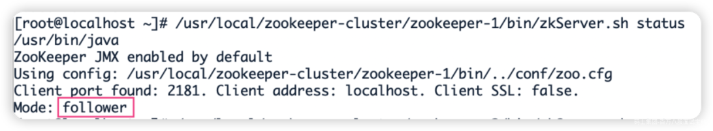

再查询第二个服务Mode 为leader表示是**领导者**（主）

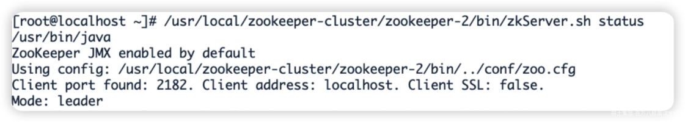

查询第三个为跟随者（从）

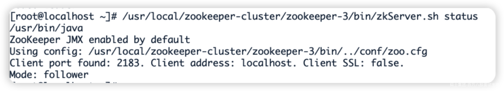

# 5.Zookeeper集群操作

## 5.1 客户端操作zk集群

**1) 第一步启动集群,启动后查看Zookeeper进程。**

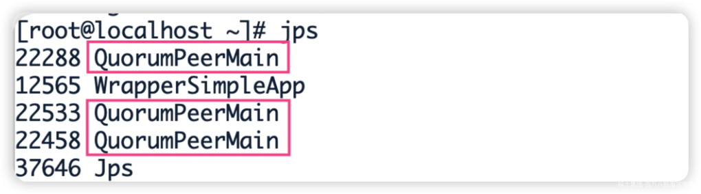

> jps命令 作用是显示当前所有java 进程的pid 的*命令*，QuorumPeerMain是zookeeper集群的启动入口类

**2) 客户端连接**

- 连接集群所有客户端

```shell
[root@localhost zookeeper-1]# ./bin/zkCli.sh -server 192.168.58.200:2181,192.168.58.200:2182,192.168.58.200:2183                        
```

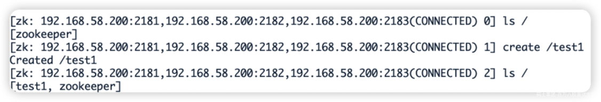

- 连接集群单个客户端

```shell
# 连接2181
[root@localhost zookeeper-1]# ./bin/zkCli.sh -server 192.168.58.200:2181 

# 连接2182
[root@localhost zookeeper-1]# ./bin/zkCli.sh -server 192.168.58.200:2182

# 在2181中创建节点
[zk: 192.168.58.200:2181(CONNECTED) 0] create /test2

# 在2182中查询，发现数据已同步
[zk: 192.168.58.200:2182(CONNECTED) 0] ls /
[test1, test2, zookeeper]
```

以上两种方式的区别在于：

- 如果只连接单个客户端，如果当前连接的服务器挂掉，当前客户端连接也会挂掉，连接失败。

- 如果是连接所有客户端的形式，则允许集群中半数以下的服务挂掉！当半数以上服务挂掉才会停止服务，可用性更高一点！

**3）集群节点信息查看**

集群中的节点信息被存放在每一个节点/zookeeper/config/目录下

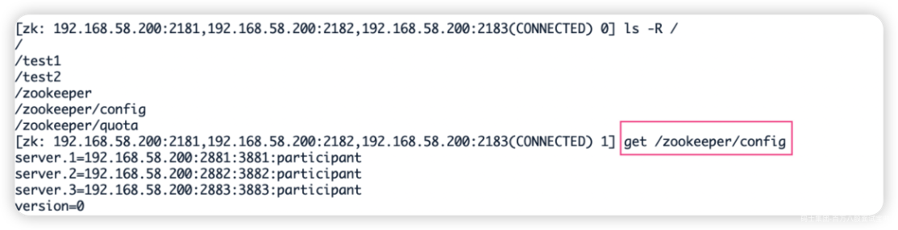

## 5.2 模拟集群异常操作

（1）首先我们先测试如果是从服务器挂掉，会怎么样

把3号服务器停掉，观察1号和2号，发现状态并没有变化

```shell
/usr/local/zookeeper-cluster/zookeeper-3/bin/zkServer.sh stop

/usr/local/zookeeper-cluster/zookeeper-1/bin/zkServer.sh status
/usr/local/zookeeper-cluster/zookeeper-2/bin/zkServer.sh status
```

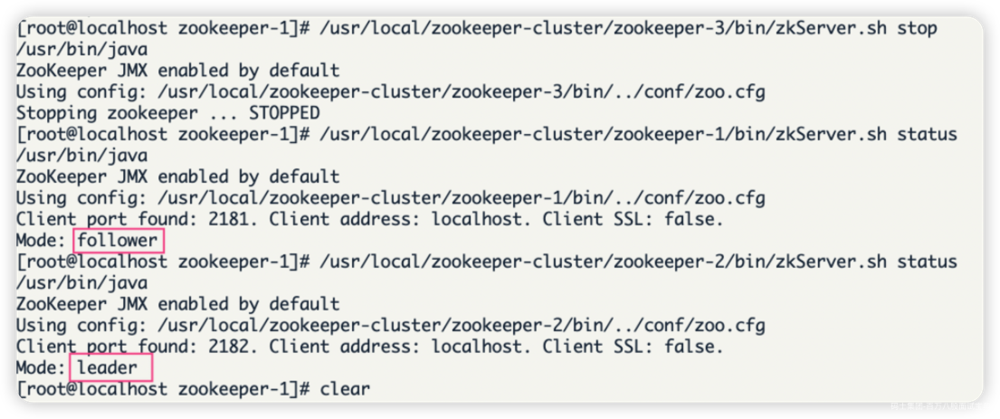

由此得出结论，3个节点的集群，从服务器挂掉，集群正常

（2）我们再把1号服务器（从服务器）也停掉，查看2号（主服务器）的状态，发现已经停止运行了。

```shell
/usr/local/zookeeper-cluster/zookeeper-1/bin/zkServer.sh stop

/usr/local/zookeeper-cluster/zookeeper-2/bin/zkServer.sh status
```

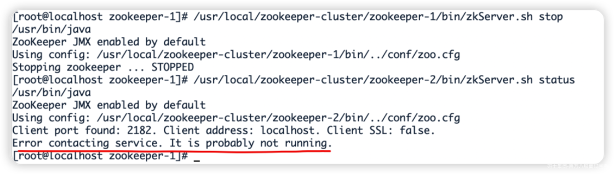

由此得出结论，3个节点的集群，2个从服务器都挂掉，主服务器也无法运行。因为可运行的机器没有超过集群总数量的半数。

（3）我们再次把1号服务器启动起来，发现2号服务器又开始正常工作了。而且依然是领导者。

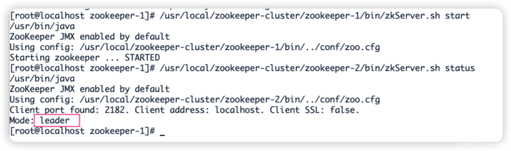

（4）我们把3号服务器也启动起来，把2号服务器停掉,停掉后观察1号和3号的状态。

```shell
/usr/local/zookeeper-cluster/zookeeper-3/bin/zkServer.sh start
/usr/local/zookeeper-cluster/zookeeper-2/bin/zkServer.sh stop

/usr/local/zookeeper-cluster/zookeeper-1/bin/zkServer.sh status
/usr/local/zookeeper-cluster/zookeeper-3/bin/zkServer.sh status
```

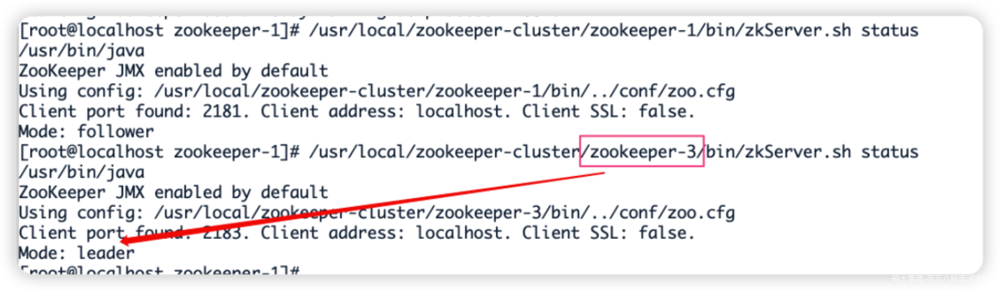

发现新的leader产生了~

由此我们得出结论，当集群中的主服务器挂了，集群中的其他服务器会自动进行选举状态，然后产生新得leader 。

（5）我们再次测试，当我们把2号服务器重新启动起来启动后，会发生什么？2号服务器会再次成为新的领导吗？我们看结果

```shell
/usr/local/zookeeper-cluster/zookeeper-2/bin/zkServer.sh start

/usr/local/zookeeper-cluster/zookeeper-2/bin/zkServer.sh status
/usr/local/zookeeper-cluster/zookeeper-3/bin/zkServer.sh status
```

我们会发现，2号服务器启动后依然是跟随者（从服务器），3号服务器依然是领导者（主服务器），没有撼动3号服务器的领导地位。

由此我们得出结论，当领导者产生后，再次有新服务器加入集群，不会影响到现任领导者。

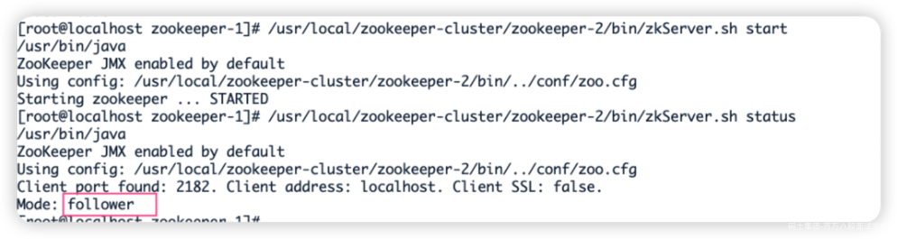

## 5.3 curate客户端连接zookeeper集群

```java
public class CuratorCluster {

    //zookeeper连接
    private final static String CLUSTER_CONNECT = "192.168.58.200:2181,192.168.58.200:2182,192.168.58.200:2183";

    //session超时时间
    private static final int sessionTimeoutMs = 60 * 1000;

    //连接超时时间
    private static final int connectionTimeoutMs = 5000;

    private static CuratorFramework client;

    public static String getClusterConnect() {
        return CLUSTER_CONNECT;
    }

    @Before
    public void init(){

        // 重试策略
        RetryPolicy retryPolicy =new ExponentialBackoffRetry(3000,10);

        // zookeeper连接
        client = CuratorFrameworkFactory.builder()
                .connectString(getClusterConnect())
                .sessionTimeoutMs(60*1000)
                .connectionTimeoutMs(15*1000)
                .retryPolicy(retryPolicy)
                .namespace("mashibing")  //当前程序创建目录的根目录
                .build();

        // 添加监听器
        client.getConnectionStateListenable().addListener(new ConnectionStateListener() {
            @Override
            public void stateChanged(CuratorFramework curatorFramework, ConnectionState connectionState) {
                System.out.println("连接成功！");
            }
        });

        client.start();
    }

    //创建节点
    public void createIfNeed(String path) throws Exception {
        Stat stat = client.checkExists().forPath(path);
        if(stat == null){
            String s = client.create().forPath(path);
            System.out.println("创建节点： " + s);
        }
    }

    //从集群中获取数据
    @Test
    public void testCluster() throws Exception {
  
        createIfNeed("/test");

        //每隔一段时间 获取一次数据
        while(true){
            byte[] data = client.getData().forPath("/test");
            System.out.println(new String(data));

            TimeUnit.SECONDS.sleep(5);
        }
    }
}
```

在集群中的任意服务器节点，为test设置数据

```plain
[zk: 192.168.58.200:2181,192.168.58.200:2182,192.168.58.200:2183(CONNECTED) 2] set /mashibing/test 12345
```

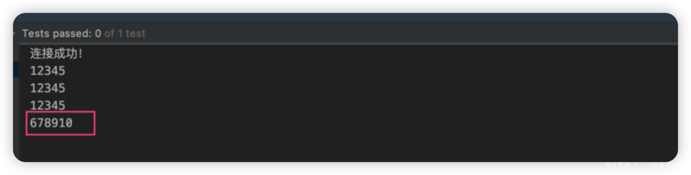
