# 第四节 zookeeper集群与分布式锁

# 1. Zookeeper集群操作

## 1.1 客户端操作zk集群

**1) 第一步启动集群,启动后查看Zookeeper进程。**

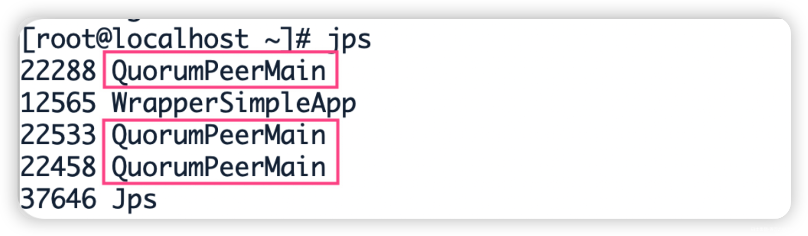

> jps命令 作用是显示当前所有java 进程的pid 的*命令*，QuorumPeerMain是zookeeper集群的启动入口类

**2) 客户端连接**

- 连接集群所有客户端

```shell
[root@localhost zookeeper-1]# ./bin/zkCli.sh -server 192.168.58.200:2181,192.168.58.200:2182,192.168.58.200:2183                  
```

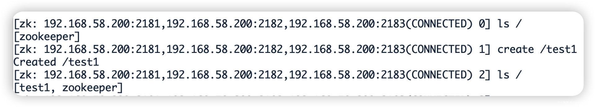

连接集群单个客户端

```shell
# 连接2181
[root@localhost zookeeper-1]# ./bin/zkCli.sh -server 192.168.58.200:2181 

# 连接2182
[root@localhost zookeeper-1]# ./bin/zkCli.sh -server 192.168.58.200:2182

# 在2181中创建节点
[zk: 192.168.58.200:2181(CONNECTED) 0] create /test2

# 在2182中查询，发现数据已同步
[zk: 192.168.58.200:2182(CONNECTED) 0] ls /
[test1, test2, zookeeper]
```

以上两种方式的区别在于：

- 如果只连接单个客户端，如果当前连接的服务器挂掉，当前客户端连接也会挂掉，连接失败。

- 如果是连接所有客户端的形式，则允许集群中半数以下的服务挂掉！当半数以上服务挂掉才会停止服务，可用性更高一点！

**3）集群节点信息查看**

集群中的节点信息被存放在每一个节点/zookeeper/config/目录下

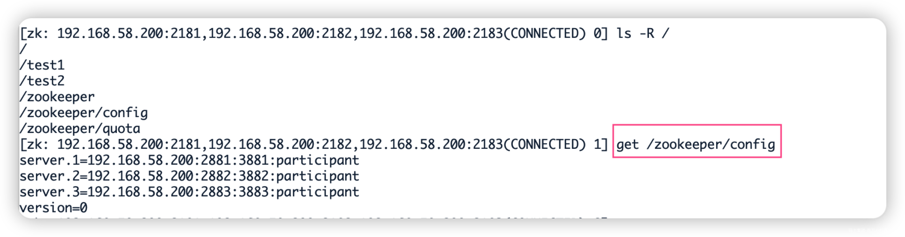

## 1.2 模拟集群异常操作

Leader选举

- Serverid : 服务器ID

- 三台服务 编号分别是 1 2 3

- 编号越大在选择算法中权重越大

- Zxid: 数据ID

- 服务器中存放的最大的数据ID， 值越大数据越新

- 在Leader选举的过程中 如果某台Zookeeper获得了超过半数的选票，就可以当选Leader

（1）首先我们先测试如果是从服务器挂掉，会怎么样

把3号服务器停掉，观察1号和2号，发现状态并没有变化

```shell
/usr/local/zookeeper-cluster/zookeeper-3/bin/zkServer.sh stop

/usr/local/zookeeper-cluster/zookeeper-1/bin/zkServer.sh status
/usr/local/zookeeper-cluster/zookeeper-2/bin/zkServer.sh status
```

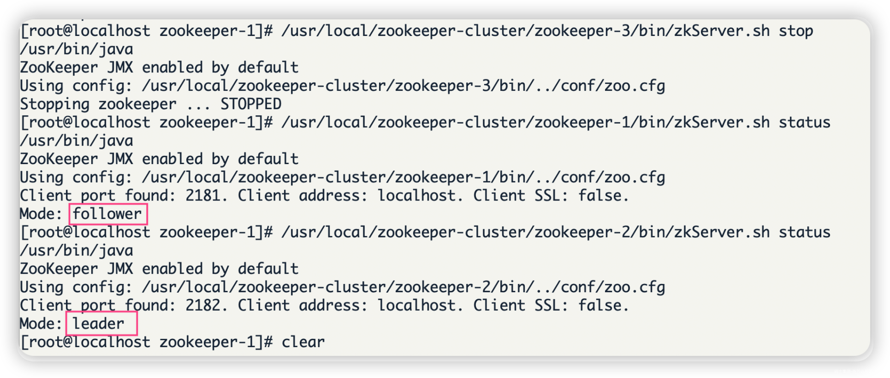

由此得出结论，3个节点的集群，从服务器挂掉，集群正常

（2）我们再把1号服务器（从服务器）也停掉，查看2号（主服务器）的状态，发现已经停止运行了。

```shell
/usr/local/zookeeper-cluster/zookeeper-1/bin/zkServer.sh stop

/usr/local/zookeeper-cluster/zookeeper-2/bin/zkServer.sh status
```

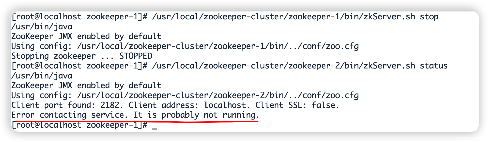

由此得出结论，3个节点的集群，2个从服务器都挂掉，主服务器也无法运行。因为可运行的机器没有超过集群总数量的半数。

（3）我们再次把1号服务器启动起来，发现2号服务器又开始正常工作了。而且依然是领导者。

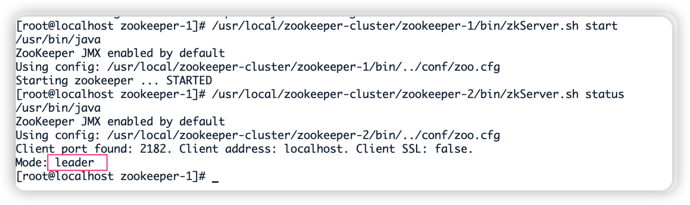

（4）我们把3号服务器也启动起来，把2号服务器停掉,停掉后观察1号和3号的状态。

```shell
/usr/local/zookeeper-cluster/zookeeper-3/bin/zkServer.sh start
/usr/local/zookeeper-cluster/zookeeper-2/bin/zkServer.sh stop

/usr/local/zookeeper-cluster/zookeeper-1/bin/zkServer.sh status
/usr/local/zookeeper-cluster/zookeeper-3/bin/zkServer.sh status
```

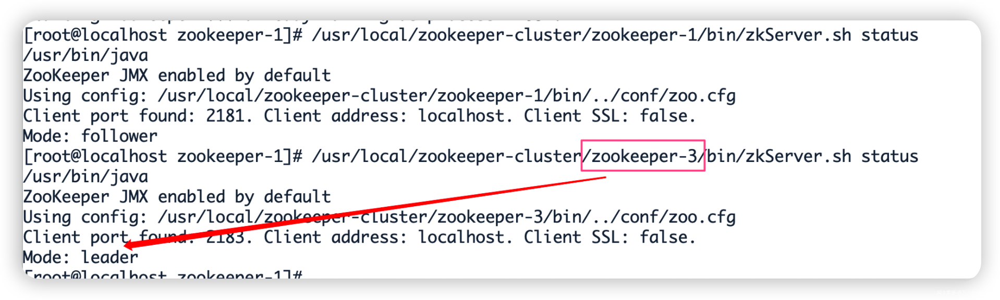

发现新的leader产生了~

由此我们得出结论，当集群中的主服务器挂了，集群中的其他服务器会自动进行选举状态，然后产生新得leader 。

（5）我们再次测试，当我们把2号服务器重新启动起来启动后，会发生什么？2号服务器会再次成为新的领导吗？我们看结果

```shell
/usr/local/zookeeper-cluster/zookeeper-2/bin/zkServer.sh start

/usr/local/zookeeper-cluster/zookeeper-2/bin/zkServer.sh status
/usr/local/zookeeper-cluster/zookeeper-3/bin/zkServer.sh status
```

我们会发现，2号服务器启动后依然是跟随者（从服务器），3号服务器依然是领导者（主服务器），没有撼动3号服务器的领导地位。

由此我们得出结论，当领导者产生后，再次有新服务器加入集群，不会影响到现任领导者。

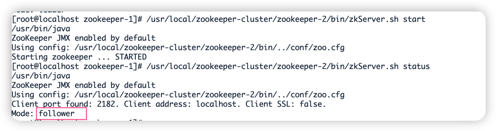

## 1.3 curate客户端连接zookeeper集群

```java
public class CuratorCluster {

    //zookeeper连接
    private final static String CLUSTER_CONNECT = "192.168.58.200:2181,192.168.58.200:2182,192.168.58.200:2183";

    //session超时时间
    private static final int sessionTimeoutMs = 60 * 1000;

    //连接超时时间
    private static final int connectionTimeoutMs = 5000;

    private static CuratorFramework client;

    public static String getClusterConnect() {
        return CLUSTER_CONNECT;
    }

    @Before
    public void init(){

        // 重试策略
        RetryPolicy retryPolicy =new ExponentialBackoffRetry(3000,10);

        // zookeeper连接
        client = CuratorFrameworkFactory.builder()
                .connectString(getClusterConnect())
                .sessionTimeoutMs(60*1000)
                .connectionTimeoutMs(15*1000)
                .retryPolicy(retryPolicy)
                .namespace("mashibing")  //当前程序创建目录的根目录
                .build();

        // 添加监听器
        client.getConnectionStateListenable().addListener(new ConnectionStateListener() {
            @Override
            public void stateChanged(CuratorFramework curatorFramework, ConnectionState connectionState) {
                System.out.println("连接成功！");
            }
        });

        client.start();
    }

    //创建节点
    public void createIfNeed(String path) throws Exception {
        Stat stat = client.checkExists().forPath(path);
        if(stat == null){
            String s = client.create().forPath(path);
            System.out.println("创建节点： " + s);
        }
    }

    //从集群中获取数据
    @Test
    public void testCluster() throws Exception {
  
        createIfNeed("/test");

        //每隔一段时间 获取一次数据
        while(true){
            byte[] data = client.getData().forPath("/test");
            System.out.println(new String(data));

            TimeUnit.SECONDS.sleep(5);
        }
    }
}
```

在集群中的任意服务器节点，为test设置数据

```plain
[zk: 192.168.58.200:2181,192.168.58.200:2182,192.168.58.200:2183(CONNECTED) 2] set /mashibing/test 12345
```

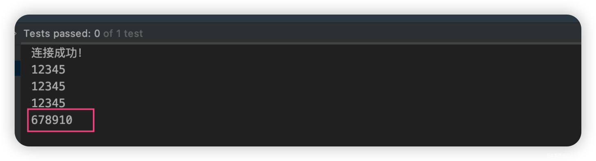

# 2. Zookeeper实战案例

## 2.1 创建项目引入依赖

```xml
<dependency>
    <groupId>com.101tec</groupId>

    <artifactId>zkclient</artifactId>

    <version>0.10</version>

</dependency>

```

## 2.2 获取zk客户端对象

```java
public class ZkClientTest {

    private String connectString = "192.168.58.200:2181,192.168.58.200:2182,192.168.58.200:2183";
    private int sessionTimeout = 2000;

    private ZkClient zkClient;

    /**
     * 获取zk客户端连接
     */
    @Before
    public void Before(){

        /**
         * 参数1：服务器的IP和端口
         * 参数2：会话的超时时间
         * 参数3：会话的连接时间
         * 参数4：序列化方式
         */
        zkClient = new ZkClient(connectString, sessionTimeout, 1000 * 15, new SerializableSerializer());

    }

    @After
    public void after(){
        zkClient.close();
    }
}
```

## 2.3 常用API

- 创建节点

```java
    /**
     * 创建节点
     */
    @Test
    public void testCreateNode(){

        //创建方式 返回创建节点名称
        String nodeName = zkClient.create("/node1", "lisi", CreateMode.PERSISTENT);
        System.out.println("路径名称为：" + nodeName);

        zkClient.create("/node2","wangwu",CreateMode.PERSISTENT_SEQUENTIAL);
        zkClient.create("/node3","hehe",CreateMode.EPHEMERAL);
        zkClient.create("/node4","haha",CreateMode.EPHEMERAL_SEQUENTIAL);

        while(true){}
    }
```

- 删除节点

```java
    /**
     * 删除节点
     */
    @Test
    public void testDeleteNode(){
        // 删除没有子节点的节点
//        boolean b1 = zkClient.delete("/node2");
//        System.out.println("删除成功： " + b1);

        // 递归删除节点信息
        boolean b2 = zkClient.deleteRecursive("/node2");
        System.out.println("删除成功： " + b2);
    }
```

- 查看节点的子节点

```java
    /**
     * 查询节点的子节点
     */
    @Test
    public void testFindNodes(){

        //返回指定路径的节点信息
        List<String> ch = zkClient.getChildren("/");

        for (String c1 : ch) {
            System.out.println(c1);
        }
    }
```

- 查看当前节点的数据

- 注意:如果出现:org.I0Itec.zkclient.exception.ZkMarshallingError: java.io.StreamCorruptedException: invalid stream header: 61616161

```java
    /**
     * 获取节点数据
     */
    @Test
    public void testFindNodeData(){
        String nodeName = zkClient.create("/node3", "taotao", CreateMode.PERSISTENT);
        Object data = zkClient.readData("/node3");
        System.out.println(data);
    }
```

- 查看当前节点的数据并获取状态信息

```java
    /**
     * 获取数据以及当前节点状态信息
     */
    @Test
    public void testFindNodeDataAndStat(){
        Stat stat = new Stat();
        Object data = zkClient.readData("/node20000000004", stat);

        System.out.println(data);
        System.out.println(stat);
    }
```

- 修改节点数据

```java
    /**
     * 修改节点
     */
    @Test
    public void testUpdateNodeData(){

        zkClient.writeData("/node3","123456");
    }
```

- 监听节点数据的变化

```java
    /**
     * 监听节点数据
     */
    @Test
    public void testNodeChange(){

        zkClient.subscribeDataChanges("/node3", new IZkDataListener() {

            // 当节点的值在修改时，会自动调用这个方法
            @Override
            public void handleDataChange(String nodeName, Object result) throws Exception {
                System.out.println("节点名称： " + nodeName);
                System.out.println("节点数据： " + result);
            }

            // 当节点被删除时，会调用该方法
            @Override
            public void handleDataDeleted(String nodeName) throws Exception {
                System.out.println("节点名称： " + nodeName);
            }
        });

        while(true){}
    }
```

- 监听节点目录的变化

```java
    /**
     * 监听节点目录的变化
     */
    @Test
    public void testNodesChange(){

        zkClient.subscribeChildChanges("/node3", new IZkChildListener() {

            @Override
            public void handleChildChange(String nodeName, List<String> list) throws Exception {
                System.out.println("父节点名称： " + nodeName);
                System.out.println("发生变更后，所有子节点名称： ");
                for (String name : list) {
                    System.out.println(name);
                }
            }
        });

        while(true){}
    }
```

- 判断某一个节点是否存在

```java
    //判断节点是否存在
    @Test
    public void exist(){

        boolean exists = zkClient.exists("/node3");

        System.out.println(exists == true ? "节点存在" : "节点不存在");

    }
```

## 2.4 客户端向服务端写入数据流程

- 写流程之写入请求，直接发送给Leader

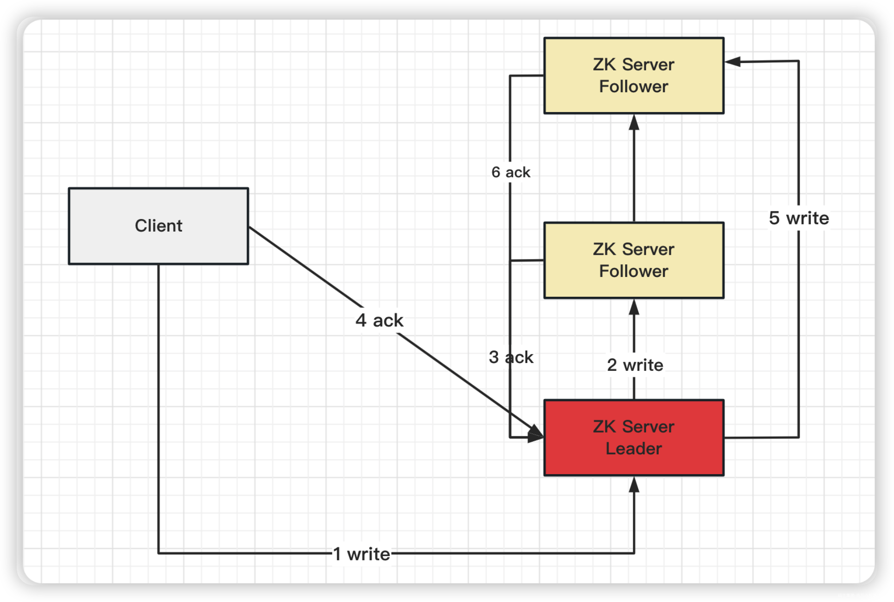

- 写流程之写入请求，发送给follower节点

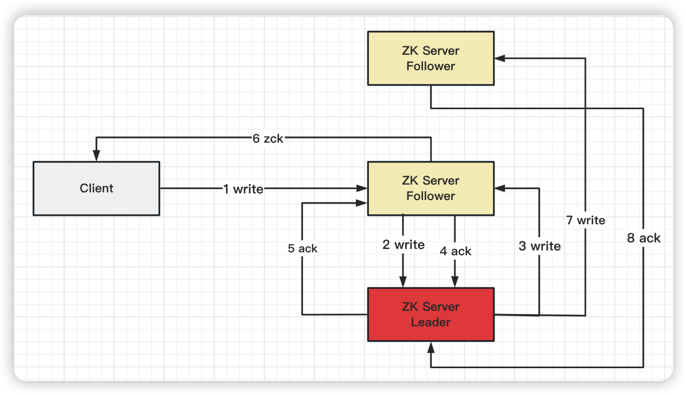

## 2.5 服务器动态上下线、客户端动态监听

> 某分布式系统中，主节点可以有多台，可以动态上下线，任意一台客户端都能实时感知到主节点服务器的上下线。

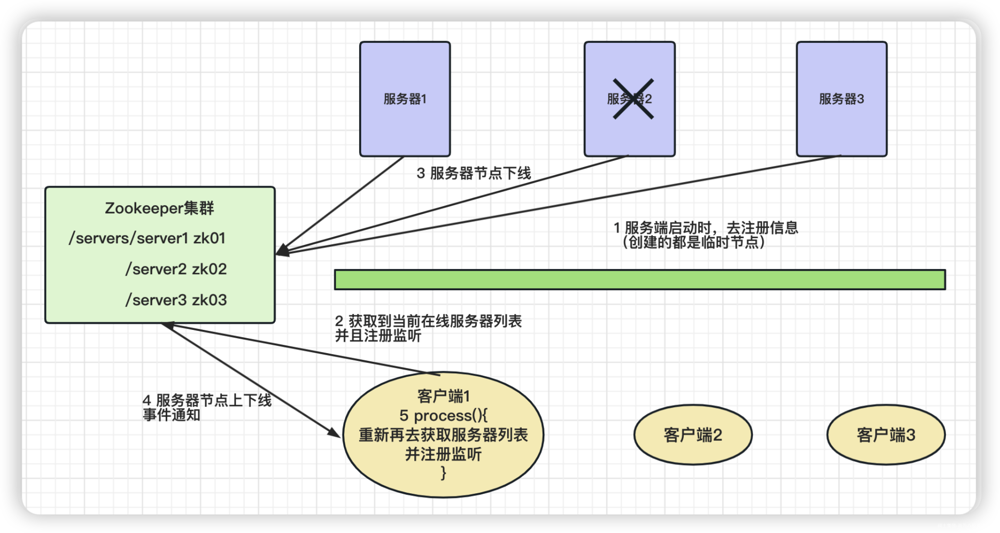

**1）根节点下，创建servers节点**

```shell
[zk: 192.168.58.200:2181,192.168.58.200:2182,192.168.58.200:2183(CONNECTED) 0] 
create /servers "servers"
Created /servers
```

**2）服务端代码**

完成服务端向zookeeper注册、动态上下线的代码。

```java
/**
 * 服务端
 */
public class DistributeServer {

    private ZooKeeper client;

    // 连接信息
    private String connectString = "192.168.58.200:2181,192.168.58.200:2182,192.168.58.200:2183";

    // 超时时间
    private int sessionTimeOut = 30000;

    public static void main(String[] args) throws Exception {

        DistributeServer server = new DistributeServer();

        //1.获取zk连接
        server.getConnect();

        //2.将服务器注册到zk集群，args参数通过启动 main方法时传入即可
        server.register(args[0]);

        //3.启动业务逻辑（线程睡眠）
        Thread.sleep(Long.MAX_VALUE);
    }

    /**
     * 注册操作
     * @param hostName 将服务器注册到zk集群时，所需的服务名称
     */
    private void register(String hostName) throws Exception {

        /**
         * ZooDefs.Ids.OPEN_ACL_UNSAFE: 此权限表示允许所有人访问该节点（服务器）
         * CreateMode.EPHEMERAL_SEQUENTIAL: 由于服务器是动态上下线的，上线后存在，下线后不存在，所以是临时节点
         * 而服务器一般都是有序号的，所以是临时、有序的节点.
         */
        String node = client.create("/servers/" + hostName,
                hostName.getBytes(), ZooDefs.Ids.OPEN_ACL_UNSAFE, CreateMode.EPHEMERAL_SEQUENTIAL);

        System.out.println("已成功创建" + node + "节点");
        System.out.println(hostName + " 已经上线");
    }

    /**
     * 获取连接
     */
    private void getConnect() throws IOException {
        client = new ZooKeeper(connectString, sessionTimeOut, new Watcher() {
            @Override
            public void process(WatchedEvent watchedEvent) {

            }
        });
    }
}
```

**2）客户端代码**

服务端代码写好之后，再来完成客户端动态监听zk服务端各个节点的代码。

```java
/**
 * 客户端
 */
public class DistributeClient {

    private ZooKeeper zk;

    // 连接信息
    private String connectString = "192.168.58.200:2181,192.168.58.200:2182,192.168.58.200:2183";

    // 超时时间
    private int sessionTimeOut = 30000;

    public static void main(String[] args) throws Exception {

        DistributeClient client = new DistributeClient();

        //1.获取zk连接
        client.getConnection();

        //2.监听 /servers下面所有的子节点变化
        client.getServerList();

        //3.业务逻辑
        Thread.sleep(Long.MAX_VALUE);
    }

    /**
     * 获取连接
     */
    private void getConnection() throws Exception {
        zk = new ZooKeeper(connectString, sessionTimeOut, new Watcher() {
            @Override
            public void process(WatchedEvent watchedEvent) {
                //监听服务器地址的上下线
                try {
                    getServerList();
                } catch (Exception e) {
                    e.printStackTrace();
                }
            }
        });
    }

    /**
     * 监听 /servers路径下的所有子节点变化，true表示启动监听器
     */
    private void getServerList() throws Exception {

        List<String> zkChildren = zk.getChildren("/servers", true);
        List<String> servers = new ArrayList<>();

        zkChildren.forEach(node -> {
            //拼接服务完整信息
            try {
                byte[] data = zk.getData("/servers/" + node, false, null);
                servers.add(new String(data));
            } catch (Exception e) {
                e.printStackTrace();
            }
        });

        System.out.println(servers);
        System.out.println("=======================");
    }
}
```

## 2.6 测试

**1）Zookeeper命令行，完成测试**

```shell
[zk: localhost:2181(CONNECTED) 1] create -e -s /servers/zk01 "192.168.58.200:2181"
Created /servers/zk010000000000
```


```shell
[zk: localhost:2181(CONNECTED) 2] create -e -s /servers/zk02 "192.168.58.200:2182"
Created /servers/zk020000000001
```

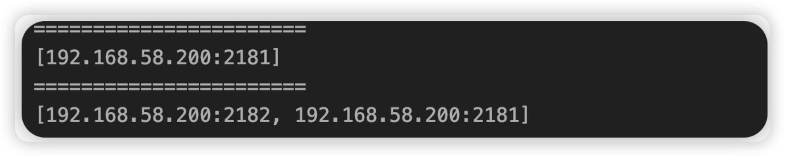

```shell
[zk: localhost:2181(CONNECTED) 3] create -e -s /servers/zk03 "192.168.58.200:2183"
Created /servers/zk030000000002
```

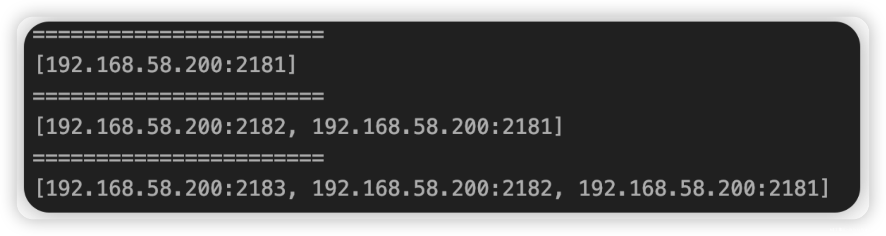

上面的执行结果可以看到，在servers下面依次创建子结点，客户端代码都可以成功监听到。

下面我们删除节点，看看客户端能不能做到动态监听功能（也即删除的节点不会再被监听到）。

```shell
[zk: localhost:2181(CONNECTED) 5] delete /servers/zk010000000000

[zk: localhost:2181(CONNECTED) 7] delete /servers/zk020000000001

[zk: localhost:2181(CONNECTED) 8] delete /servers/zk030000000002 
```

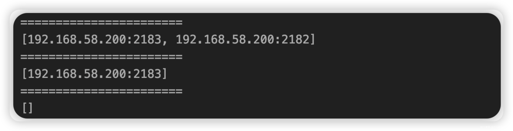

使用Java代码来测试

- 先启动客户端代码

- 再启动服务端代码

> 只是在服务端代码中，我们的 register 方法中传参用到了 args ，所以启动之前要传入这个参数。

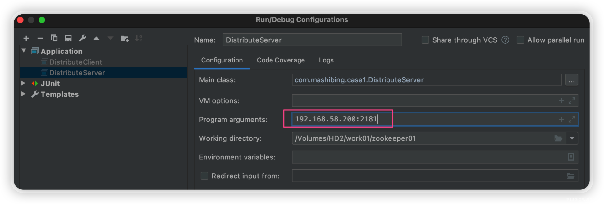

> 传入 192.168.58.200 之后，可以看到服务端代码已经能够实现动态上线了。

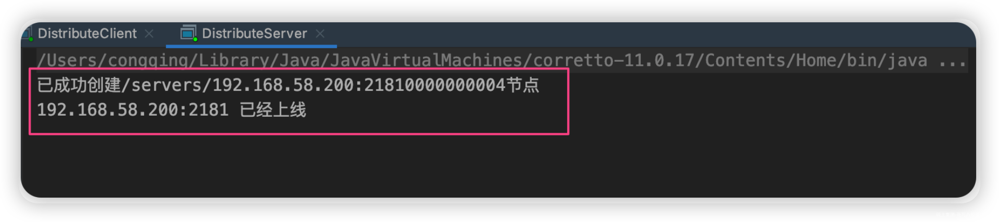

> 这里我们的 192.168.58.200 动态上线之后，可以看到客户端也正常的监听到它了。

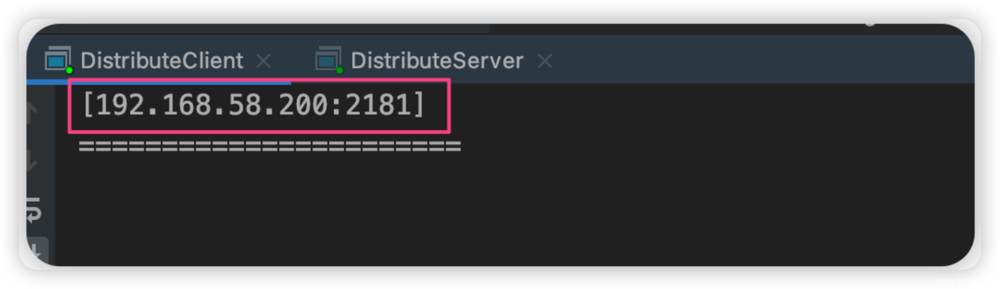

> 转到zk命令行中，也可以看到这台服务器的节点信息。

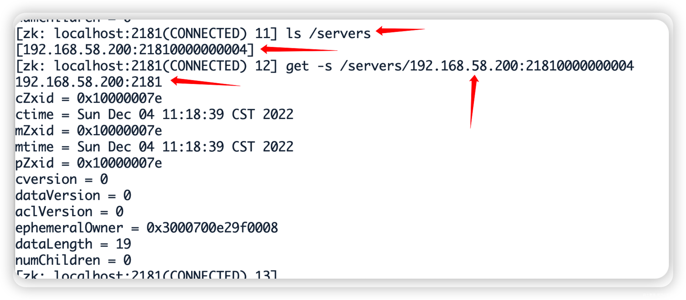

由于我们之前的服务端代码还启动着，此时我们再传入新的参数 192.168.58.200:2182，那么之前的2181服务器肯定会被挤掉（这里模拟就是main方法，同一个类肯定只能同时启动一次main方法了），那么我们看看客户端能不能动态监听到2181下线、2182上线。

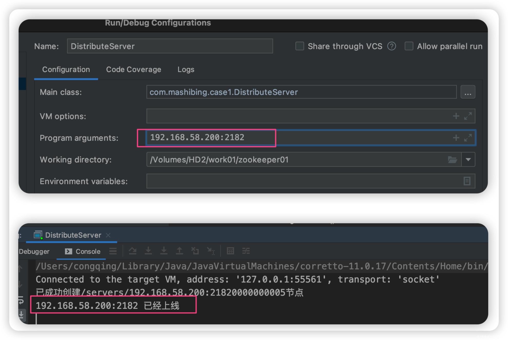

服务端自然可以正常实现2182这台服务器的动态上线。在客户端代码中可以看到List集合中已经没有2181了（即2181已经下线了），而2182正常上线

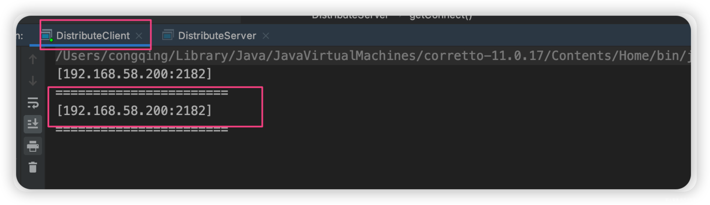

# 3.Zookeeper分布式锁

## 3.1 什么是分布式锁

传统单体应用单机部署的情况下，可以使用并发处理相关的功能进行互斥控制，但是原单体单机部署的系统被演化成分布式集群系统后，由于分布式系统多线程、多进程并且分布在不同机器上，这将使原单机部署情况下的并发控制锁策略失效。提出分布式锁的概念，是为了解决跨机器的互斥机制来控制共享资源的访问。

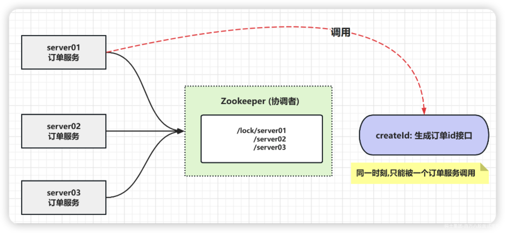

## 3.2 Zookeeper分布式锁分析

客户端（对zookeeper集群而言）向zookeeper集群进行上线注册,并在一个永久节点下创建有序的临时子节点后，根据编号顺序，最小顺序的子节点获取到锁，其他子节点由小到大监听前一个节点。

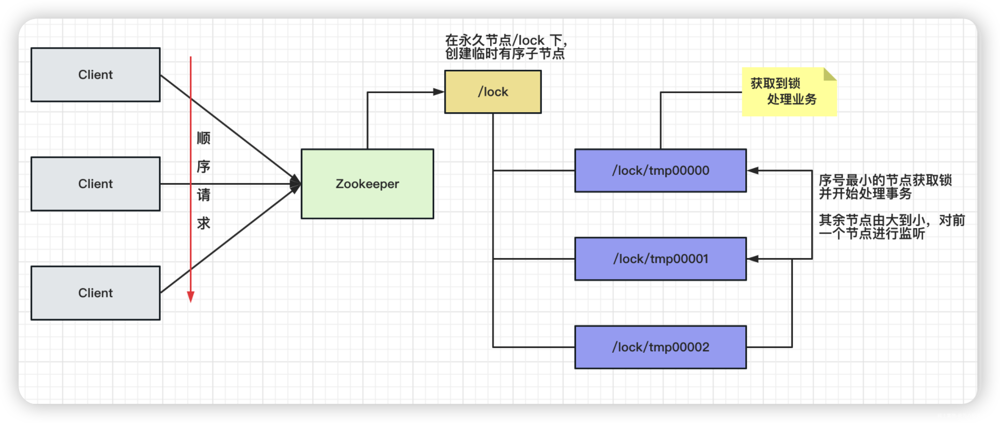

当拿到锁的节点处理完事务后，释放锁，后一个节点监听到前一个节点释放锁后，立刻申请获得锁，以此类推

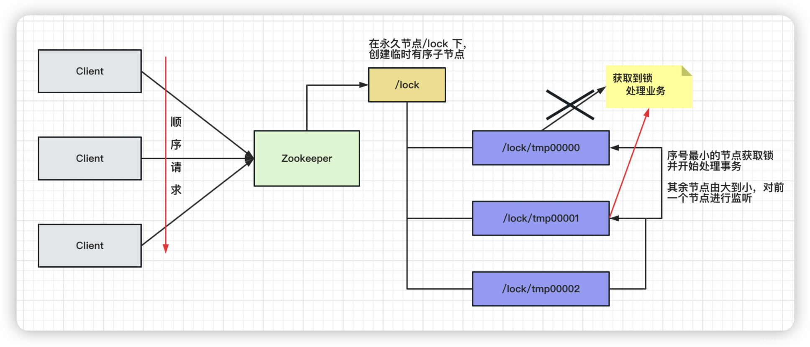

## 3.3 分布式锁实现

**1）创建 Distributedlock类, 获取与zookeeper的连接**

- 构造方法中获取连接

- 添加 CountDownLatch

> CountDownLatch是具有synchronized机制的一个工具，目的是让一个或者多个线程等待，直到其他线程的一系列操作完成。
>
> CountDownLatch初始化的时候，需要提供一个整形数字，数字代表着线程需要调用countDown()方法的次数，当计数为0时，线程才会继续执行await()方法后的其他内容。

```java
/**
 * 分布式锁
 */
public class DistributedLock {

    private ZooKeeper client;

    // 连接信息
    private String connectString = "192.168.58.200:2181,192.168.58.200:2182,192.168.58.200:2183";

    // 超时时间
    private int sessionTimeOut = 30000;

    private CountDownLatch countDownLatch = new CountDownLatch(1);

    //1. 在构造方法中获取连接
    public DistributedLock() throws Exception {

        client = new ZooKeeper(connectString, sessionTimeOut, new Watcher() {
            @Override
            public void process(WatchedEvent watchedEvent) {

            }
        });

        //等待Zookeeper连接成功，连接完成继续往下走
        countDownLatch.await();

        //2. 判断节点是否存在

    }

    //3.对ZK加锁
    public void zkLock(){
        //创建 临时带序号节点

        //判断 创建的节点是否是最小序号节点，如果是 就获取到锁；如果不是就监听前一个节点
    }

    //4.解锁
    public void unZkLock(){

        //删除节点
    }
}
```

**2）对zk加锁**

```java
/**
 * 分布式锁
 */
public class DistributedLock {

    private ZooKeeper client;

    // 连接信息
    private String connectString = "192.168.58.200:2181,192.168.58.200:2182,192.168.58.200:2183";

    // 超时时间
    private int sessionTimeOut = 30000;

    // 等待zk连接成功
    private CountDownLatch countDownLatch = new CountDownLatch(1);

    // 等待节点变化
    private CountDownLatch waitLatch = new CountDownLatch(1);

    //当前节点
    private String currentNode;

    //前一个节点路径
    private String waitPath;

    //1. 在构造方法中获取连接
    public DistributedLock() throws Exception {

        client = new ZooKeeper(connectString, sessionTimeOut, new Watcher() {
            @Override
            public void process(WatchedEvent watchedEvent) {
                //countDownLatch 连上ZK，可以释放
                if(watchedEvent.getState() == Event.KeeperState.SyncConnected){
                    countDownLatch.countDown();
                }

                //waitLatch 需要释放 (节点被删除并且删除的是前一个节点)
                if(watchedEvent.getType() == Event.EventType.NodeDeleted &&
                        watchedEvent.getPath().equals(waitPath)){
                    waitLatch.countDown();
                }
            }
        });

        //等待Zookeeper连接成功，连接完成继续往下走
        countDownLatch.await();

        //2. 判断节点是否存在
        Stat stat = client.exists("/locks", false);
        if(stat == null){
            //创建一下根节点
            client.create("/locks","locks".getBytes(), ZooDefs.Ids.OPEN_ACL_UNSAFE, CreateMode.PERSISTENT);
        }

    }

    //3.对ZK加锁
    public void zkLock(){
        //创建 临时带序号节点
        try {
            currentNode = client.create("/locks/" + "seq-", null, ZooDefs.Ids.OPEN_ACL_UNSAFE, CreateMode.EPHEMERAL_SEQUENTIAL);

            //判断 创建的节点是否是最小序号节点，如果是 就获取到锁；如果不是就监听前一个节点
            List<String> children = client.getChildren("/locks", false);

            //如果创建的节点只有一个值，就直接获取到锁，如果不是，监听它前一个节点
            if(children.size() == 1){
                return;
            }else{
                //先排序
                Collections.sort(children);

                //获取节点名称
                String nodeName = currentNode.substring("/locks/".length());

                //通过名称获取该节点在集合的位置
                int index = children.indexOf(nodeName);

                //判断
                if(index == -1){
                    System.out.println("数据异常");
                }else if(index == 0){
                    //就一个节点，可以获取锁
                    return;
                }else{
                    //需要监听前一个节点变化
                    waitPath = "/locks/" + children.get(index-1);
                    client.getData(waitPath,true,null);

                    //等待监听执行
                    waitLatch.await();
                    return;
                }
            }

        } catch (KeeperException e) {
            e.printStackTrace();
        } catch (InterruptedException e) {
            e.printStackTrace();
        }
    }
}
```

**3）zk删除锁**

```java
    //4.解锁
    public void unZkLock() throws KeeperException, InterruptedException {

        //删除节点
        client.delete(currentNode,-1);
    }
```

**4）测试**

```java
public class DistributedLockTest {

    public static void main(String[] args) throws Exception {

        final DistributedLock lock1 = new DistributedLock();
        final DistributedLock lock2 = new DistributedLock();

        new Thread(new Runnable() {
            @Override
            public void run() {

                try {
                    lock1.zkLock();
                    System.out.println("线程1 启动 获取到锁");

                    Thread.sleep(5 * 1000);
                    lock1.unZkLock();
                    System.out.println("线程1 释放锁");
                } catch (InterruptedException | KeeperException e) {
                    e.printStackTrace();
                }
            }
        }).start();

        new Thread(new Runnable() {
            @Override
            public void run() {

                try {
                    lock2.zkLock();
                    System.out.println("线程2 启动 获取到锁");

                    Thread.sleep(5 * 1000);
                    lock2.unZkLock();
                    System.out.println("线程2 释放锁");
                } catch (InterruptedException | KeeperException e) {
                    e.printStackTrace();
                }
            }
        }).start();
    }
}
```
