# 第五节 zookeeper集群与分布式锁\_2

# 1.分布式锁概述

## 1.1 什么是分布式锁

**1）要介绍分布式锁，首先要提到与分布式锁相对应的是线程锁。**

- **线程锁**：主要用来给方法、代码块加锁。当某个方法或代码使用锁，在同一时刻仅有一个线程执行该方法或该代码段。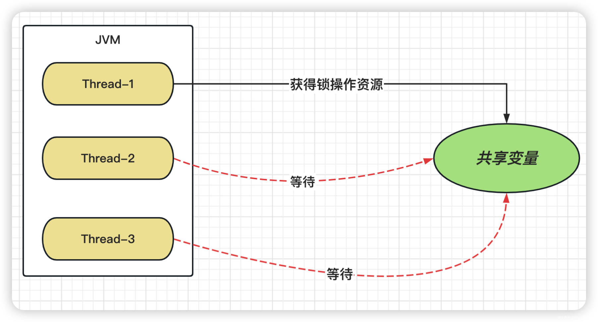

> 线程锁只在同一JVM中有效果，因为线程锁的实现在根本上是依靠线程之间共享内存实现的，比如synchronized是共享对象头，显示锁Lock是共享某个变量（state）。

- **分布式锁**：分布式锁，即分布式系统中的锁。在单体应用中我们通过锁解决的是控制共享资源访问的问题，而分布式锁，就是解决了分布式系统中控制共享资源访问的问题。与单体应用不同的是，分布式系统中竞争共享资源的最小粒度从线程升级成了进程。**分布式锁是在分布式或者集群环境下， 多进程可见，并且互斥的锁。**

**2）分布式锁介绍**

- 传统单体应用单机部署的情况下，可以使用并发处理相关的功能进行互斥控制，但是原单体单机部署的系统被演化成分布式集群系统后，由于分布式系统多线程、多进程并且分布在不同机器上，这将使原单机部署情况下的并发控制锁策略失效。提出分布式锁的概念，是为了解决跨机器的互斥机制来控制共享资源的访问。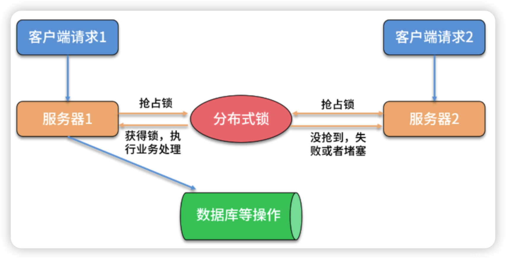

- 分布式场景下解决并发问题，需要应用分布式锁技术。如上图所示，分布式锁的目的是保证在分布式部署的应用集群中，多个服务在请求同一个方法或者同一个业务操作的情况下，对应业务逻辑只能被一台机器上的一个线程执行，避免出现并发问题。

## 1.2 分布式锁的设计原则

Redis官网上对使用分布式锁提出至少需要满足如下三个要求：

- **互斥**（属于安全性）: 在任何给定时刻，只有一个客户端可以持有锁。

- **无死锁**（属于有效性）: 即如果一个线程已经持有了锁，那么它可以多次获取该锁而不会发生死锁。

- **容错性**（属于有效性）: 如果一个线程获取了锁，那么即使崩溃或者失去连接，锁也必须被释放。

除此之外，分布式锁的设计中还可以需要考虑：

- 加锁解锁的**同源性**：A加的锁，不能被B解锁。

- 获取锁**非阻塞：** 如果获取不到锁，不能无限期等待（在某个服务来获取锁时，假设该锁已经被另一个服务获取，我们要能直接返回失败，不能一直等待。）。

- \*\*锁失效机制：\*\*假设某个应用获取到锁之后，一直没有来释放锁，可能服务本身已经挂掉了，不能一直不释放，导致其他服务一直获取不到锁。

- \*\*高性能： \*\*加锁解锁是高性能的，加锁时间一般是几毫秒。（我们这个分布式锁，可能会有很多的服务器来获取，所以加锁解锁一定是需要高能的）。

- **高可用：** 为了避免单点故障，锁需要有一定的容错方式。例如锁服务本身就是一个集群的形式。

## 1.3 分布式锁的实现方式

分布式锁的使用流程： 加锁 -----》 执行业务逻辑 ----》释放锁

- 基于数据库实现分布式锁

- 基于 redis 实现分布式锁

- 基于 zookeeper实现分布式锁

# 2.基于mysql实现分布式锁

基于Mysql实现分布式锁，适用于**对性能要求不高，并且不希望因为要使用分布式锁而引入新组件**。

可以利用唯一键索引不能重复插入的特点实现。

## 2.1 基于唯一索引实现

### 2.1.1 实现思路

1. 创建锁表，内部存在字段表示资源名及资源描述，同一资源名使用数据库唯一性限制。

2. 多个进程同时往数据库锁表中写入对某个资源的占有记录，当某个进程成功写入时则表示其获取锁成功

3. 其他进程由于资源字段唯一性限制插入失败陷入自旋并且失败重试。

4. 当执行完业务后持有该锁的进程则删除该表内的记录，此时回到步骤一。

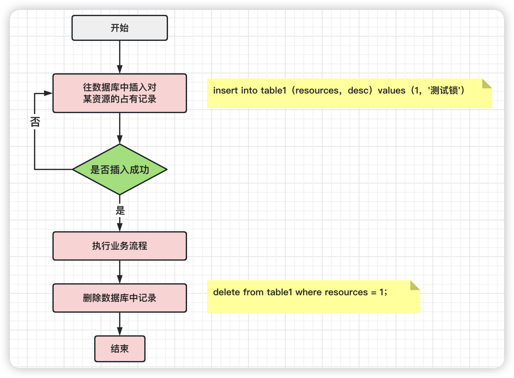

### 2.1.2 创建数据库以及表

1. 在mysql下创建数据库，名为: **distribute\_lock** (这里使用navicat创建)

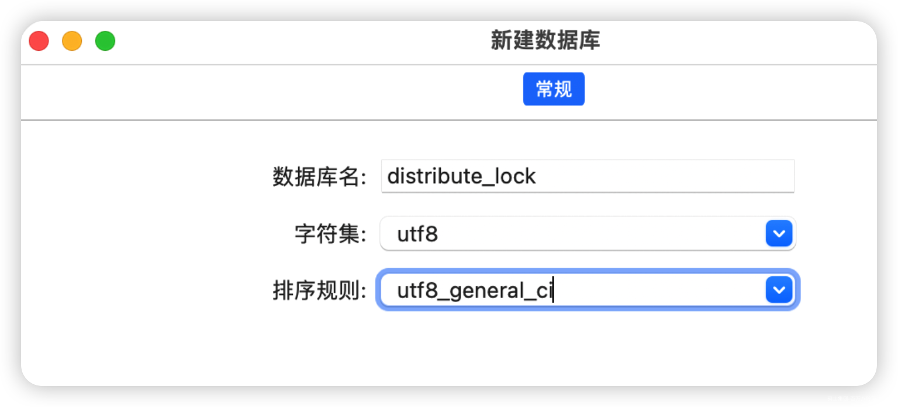

2. 多个进程同时往表中插入记录（锁资源为1，描述为测试锁），插入成功则执行流程，执行完流程后删除其在数据库表中的记录。

```java
create table `database_lock`(
    `id` BIGINT NOT NULL AUTO_INCREMENT,
    `resource` INT NOT NULL COMMENT '锁资源',
    `description` varchar(1024) NOT NULL DEFAULT "" COMMENT '描述',
    PRIMARY KEY (`id`),
    UNIQUE KEY `resource` (`resource`)
) ENGINE=InnoDB DEFAULT CHARSET=utf8mb4 COMMENT='数据库分布式锁表';
```

### 2.1.3 创建maven工程

1. 创建maven工程，distribute-lock,引入依赖

```xml
<?xml version="1.0" encoding="UTF-8"?>
<project xmlns="http://maven.apache.org/POM/4.0.0"
         xmlns:xsi="http://www.w3.org/2001/XMLSchema-instance"
         xsi:schemaLocation="http://maven.apache.org/POM/4.0.0 http://maven.apache.org/xsd/maven-4.0.0.xsd">
    <modelVersion>4.0.0</modelVersion>

    <groupId>com.mashibing</groupId>

    <artifactId>zk-client1</artifactId>

    <version>1.0-SNAPSHOT</version>

    <dependencies>
        <dependency>
            <groupId>junit</groupId>

            <artifactId>junit</artifactId>

            <version>4.10</version>

            <scope>test</scope>

        </dependency>

        <!--curator-->
        <dependency>
            <groupId>org.apache.curator</groupId>

            <artifactId>curator-framework</artifactId>

            <version>4.0.0</version>

        </dependency>

        <dependency>
            <groupId>org.apache.curator</groupId>

            <artifactId>curator-recipes</artifactId>

            <version>4.0.0</version>

        </dependency>

  
        <!--日志-->
        <dependency>
            <groupId>org.slf4j</groupId>

            <artifactId>slf4j-api</artifactId>

            <version>1.7.21</version>

        </dependency>

        <dependency>
            <groupId>org.slf4j</groupId>

            <artifactId>slf4j-log4j12</artifactId>

            <version>1.7.21</version>

        </dependency>

        <!-- zookeeper -->
        <dependency>
            <groupId>com.101tec</groupId>

            <artifactId>zkclient</artifactId>

            <version>0.10</version>

        </dependency>

        <!-- lombok -->
        <dependency>
            <groupId>org.projectlombok</groupId>

            <artifactId>lombok</artifactId>

            <version>1.18.6</version>

        </dependency>

        <!-- jdbc -->
        <dependency>
            <groupId>mysql</groupId>

            <artifactId>mysql-connector-java</artifactId>

            <version>5.1.48</version>

        </dependency>

    </dependencies>

    <build>
        <plugins>
            <plugin>
                <groupId>org.apache.maven.plugins</groupId>

                <artifactId>maven-compiler-plugin</artifactId>

                <version>3.1</version>

                <configuration>
                    <source>1.8</source>

                    <target>1.8</target>

                </configuration>

            </plugin>

        </plugins>

    </build>

</project>

```

2. 添加数据库配置文件 **db.properties**

```properties
driver=com.mysql.cj.jdbc.Driver
url=jdbc:mysql://localhost:3306/distribute_lock?useUnicode=true&characterEncoding=utf-8&useSSL=true&serverTimezone=Asia/Shanghai
user=root
password=123456
```

3. 创建包结构

**基础包结构： com.mashibing.lock** ， 在lock包下创建 **mysql** 包

```plain
com.mashibing.lock.mysql
```

4. 导入工具类

- PropertiesReader

```java
@Slf4j
public class PropertiesReader {

    // Properties缓存文件
    private static final Map<String, Properties> propertiesCache = new HashMap<String, Properties>();

    public static Properties getProperties(String propertiesName) throws IOException {
        if (propertiesCache.containsKey(propertiesName)) {
            return propertiesCache.get(propertiesName);
        }
        loadProperties(propertiesName);
        return propertiesCache.get(propertiesName);
    }

    private synchronized static void loadProperties(String propertiesName) throws IOException {
        FileReader fileReader = null;

        try {
            // 创建Properties集合类
            Properties pro = new Properties();
            // 获取src路径下的文件--->ClassLoader类加载器
            ClassLoader classLoader = PropertiesReader.class.getClassLoader();
            URL resource = classLoader.getResource(propertiesName);
            // 获取配置路径
            String path = resource.getPath();
            // 读取文件
            fileReader = new FileReader(path);
            // 加载文件
            pro.load(fileReader);
            // 初始化
            propertiesCache.put(propertiesName, pro);
        } catch (IOException e) {
            log.error("读取Properties文件失败，Properties名为:" + propertiesName);
            throw e;
        } finally {
            try {
                if (fileReader != null) {
                    fileReader.close();
                }
            } catch (IOException e) {
                log.error("fileReader关闭失败！", e);
            }
        }
    }
}
```

- JDBCUtils

```java
@Slf4j
public class JDBCUtils {

    private static String url;
    private static String user;
    private static String password;

    static {
        //读取文件，获取值
        try {
            Properties properties = PropertiesReader.getProperties("db.properties");
            url = properties.getProperty("url");
            user = properties.getProperty("user");
            password = properties.getProperty("password");
            String driver = properties.getProperty("driver");
            //4.注册驱动
            Class.forName(driver);
        } catch (IOException | ClassNotFoundException e) {
            log.error("初始化jdbc连接失败！", e);
        }
    }

    /**
     * 获取连接
     *
     * @return 连接对象
     */
    public static Connection getConnection() throws SQLException {
        return DriverManager.getConnection(url, user, password);
    }

    /**
     * 释放资源
     *
     * @param rs
     * @param st
     * @param conn
     */
    public static void close(ResultSet rs, Statement st, Connection conn) {
        if (rs != null) {
            try {
                rs.close();
            } catch (SQLException e) {
                e.printStackTrace();
            }
        }
        if (st != null) {
            try {
                st.close();
            } catch (SQLException e) {
                e.printStackTrace();
            }
        }
        if (conn != null) {
            try {
                conn.close();
            } catch (SQLException e) {
                e.printStackTrace();
            }
        }
    }
}
```

### 2.1.4 数据库操作类

- com.mashibing.lock.mysql.service

```java
/**
 * MySQL 锁操作类（加锁+释放锁）
 */
@Slf4j
public class MySQLDistributedLockService {

    private static Connection connection;
    private static Statement statement;
    private static ResultSet resultSet;

    static{
        try {
            connection = JDBCUtils.getConnection();
            statement = connection.createStatement();
            resultSet = null;
        } catch (SQLException e) {
            log.error("数据库连接失败！");
        }
    }

    /**
     * 锁表 - 获取锁
     * @param resource      资源
     * @param description   锁描述
     * @return  是否操作成功
     */
    public static boolean tryLock(int resource,String description){

        String sql = "insert into database_lock (resource,description) values (" + resource + ", '" + description + "');";

        //获取数据库连接
        try {
            int stat = statement.executeUpdate(sql);
            return stat == 1;
        } catch (SQLException e) {
            return false;
        }
    }

    /**
     * 锁表-释放锁
     * @return
     */
    public static boolean releaseLock(int resource) throws SQLException {
        String sql = "delete from database_lock where resource = " + resource;
        //获取数据库连接
        int stat = statement.executeUpdate(sql);
        return stat == 1;
    }

    /**
     * 关闭连接
     */
    public static void close(){
        log.info("当前线程： " + ManagementFactory.getRuntimeMXBean().getName().split("@")[0] +
                ",关闭了数据库连接！");
        JDBCUtils.close(resultSet,statement,connection);
    }
}
```

### 2.1.5 创建LockTable

```java
/**
 * mysql分布式锁
 *      执行流程： 多进程抢占数据库某个资源，然后执行业务，执行完释放资源
 *      锁机制： 单一进程获取锁时，则其他进程提交失败
 */
@Slf4j
public class LockTable extends Thread {

    @Override
    public void run() {
        super.run();

        //获取Java虚拟机的进程ID
        String pid = ManagementFactory.getRuntimeMXBean().getName().split("@")[0];
        try{
            while(true){
                log.info("当前进程PID：" + pid + ",尝试获取锁资源！");
                if(MySQLDistributedLockService.tryLock(1,"测试锁")){
                    log.info("当前进程PID：" + pid + ",获取锁资源成功！");

                    //sleep模拟业务处理过程
                    log.info("开始处理业务！");
                    Thread.sleep(10*1000);
                    log.info("业务处理完成！");

                    MySQLDistributedLockService.releaseLock(1);
                    log.info("当前进程PID： " + pid + ",释放了锁资源！");
                    break;
                }else{
                    log.info("当前进程PID： " + pid + "，获取锁资源失败！");
                    Thread.sleep(2000);
                }
            }
        }catch (Exception e){
            log.error("抢占锁发生错误！",e);
        }finally {
            MySQLDistributedLockService.close();
        }
    }

    // 程序入口
    public static void main(String[] args) {

        new LockTable().start();
    }
}
```

### 2.1.6 分布式锁测试

- 运行时开启并行执行选项，每次运行三个或三个以上进程. Allow parallel run 运行并行执行

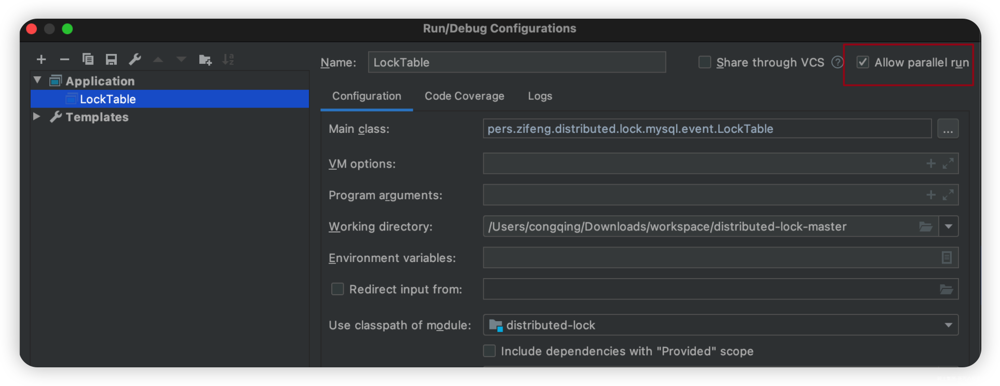

- 三个进程的执行情况

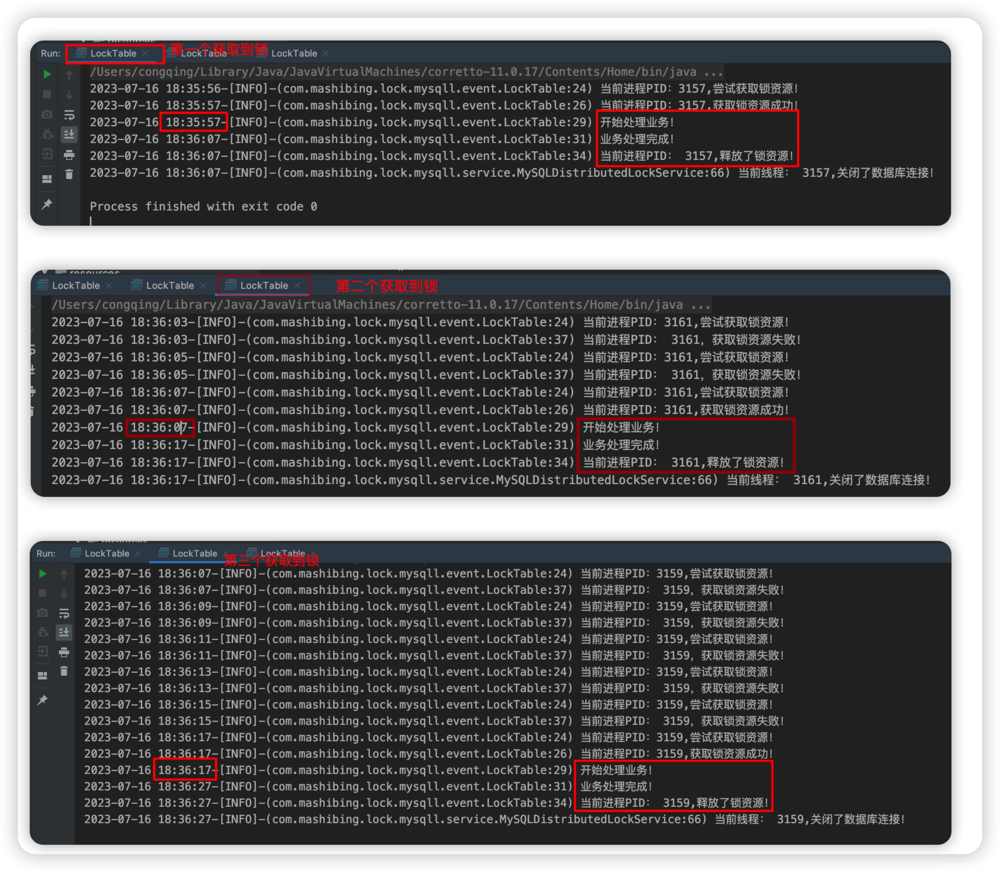

注意事项：

- 该锁为非阻塞的

- 当某进程持有锁并且挂死时候会造成资源一直不释放的情况，造成死锁，因此需要维护一个定时清理任务去清理持有过久的锁

- 要注意数据库的单点问题，最好设置备库，进一步提高可靠性

- 该锁为非可重入锁，如果要设置成可重入锁需要添加数据库字段记录持有该锁的设备信息以及加锁次数

## 2.2 基于乐观锁

### 2.2.1 需求分析

需求： 数据库中设定某商品基本信息（名为外科口罩，数量为10），多进程对该商品进行抢购，当商品数量为0时结束抢购。

- 创建表

```sql
# 创建表
create table `database_lock_2`(
    `id` BIGINT NOT NULL AUTO_INCREMENT,
    `good_name` VARCHAR(256) NOT NULL DEFAULT "" COMMENT '商品名称',
    `good_count` INT NOT NULL COMMENT '商品数量',
    PRIMARY KEY (`id`)
) ENGINE=InnoDB DEFAULT CHARSET=utf8mb4 COMMENT='数据库分布式锁表2';

# 插入原始数据
insert into database_lock_2 (good_name,good_count) values ('医用口罩',10);
```

### 2.2.2 实现思路

- 每次执行业务前首先进行数据库查询，查询当前的需要修改的资源值（或版本号）。

- 进行资源的修改操作，并且修改前进行资源（或版本号）的比对操作，比较此时数据库中的值是否和上一步查询结果相同。

- 查询结果相同则修改对应资源值，不同则回到第一步。

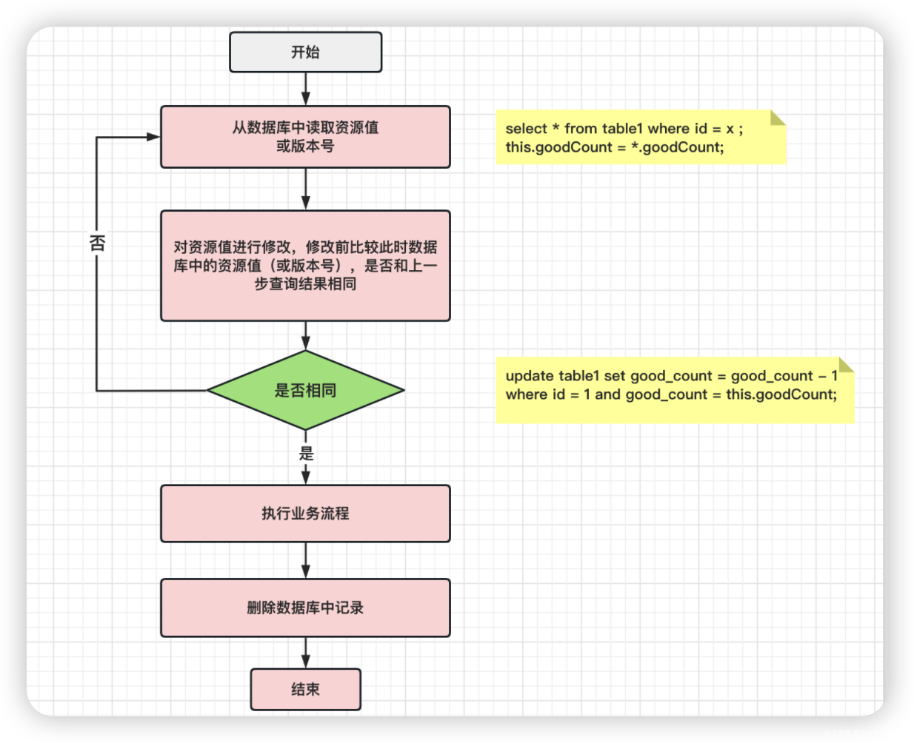

### 2.2.3 代码实现

1. 在 **MySQLDistributedLockService** 中，添加对乐观锁的操作

```java
    /**
     * 乐观锁-获取资源
     * @param id 资源ID
     * @return result
     */
    public static ResultSet getGoodCount(int id) throws SQLException {

        String sql = "select  * from  database_lock_2 where id = " + id;

        //查询数据
        resultSet = statement.executeQuery(sql);
        return resultSet;
    }

    /**
     * 乐观锁-修改资源
     * @param id        资源ID
     * @param goodCount 资源
     * @return  修改状态
     */
    public static boolean setGoodCount(int id, int goodCount) throws SQLException {

        String sql = "update database_lock_2 set good_count = good_count - 1 where id =" + id +"  and good_count = " + goodCount;

        int stat = statement.executeUpdate(sql);
        return stat == 1;
    }

    /**
     * 乐观锁-开启事务自动提交
     */
    public static void AutoCommit(){
        try {
            connection.setAutoCommit(true);
        } catch (SQLException e) {
            log.error("开启自动提交！",e);
        }
    }
```

2. 创建**OptimisticLock**，模拟并发操作分布式锁

```java
/**
 * mysql分布式锁-乐观锁
 *  执行流程： 多进程抢购同一商品，每次抢购成功商品数量-1，商品数据量为0时退出
 *  锁机制： 单一进程获取锁时，则其他进程提交失败
 */
@Slf4j
public class OptimisticLock extends Thread{

    @Override
    public void run() {
        super.run();

        String pid = ManagementFactory.getRuntimeMXBean().getName().split("@")[0];

        ResultSet resultSet = null;
        String goodName = null;
        int goodCount = 0;

        try {
            while(true){
                log.info("当前线程：" + pid + "，开始抢购商品！");
                //获取当前商品信息
                resultSet = MySQLDistributedLockService.getGoodCount(1);
                while (resultSet.next()){
                    goodName = resultSet.getString("good_name");
                    goodCount = resultSet.getInt("good_count");
                }
                log.info("获取库存成功，当前商品名为：" + goodName + "，当前库存剩余量为：" + goodCount);

                //模拟执行业务操作
                Thread.sleep(2*3000);
                if(0 == goodCount){
                    log.info("抢购失败，当前库存为0！ ");
                    break;
                }
                //修改库存信息，库存量-1
                if(MySQLDistributedLockService.setGoodCount(1,goodCount)){
                    log.info("当前线程：" + pid + " 抢购商品：" + goodName + "成功，剩余库存为：" + (goodCount -1));
                    //模拟延迟，防止锁每次被同一进程获取
                    Thread.sleep(2 * 1000);
                }else{
                    log.error("抢购商品：" + goodName +"失败，商品数量已被修改");
                }
            }
        }catch (Exception e){
            log.error("抢购商品发生错误！",e);
        }finally {
            if(resultSet != null){
                try {
                    resultSet.close();
                } catch (SQLException e) {
                    e.printStackTrace();
                    log.error("关闭Result失败！" , e);
                }
            }

            MySQLDistributedLockService.close();
        }
    }

    public static void main(String[] args) {
        new OptimisticLock().start();
    }
}
```

### 2.3.4 代码测试

开启三个进程，查看执行情况

- 9 7 4 1

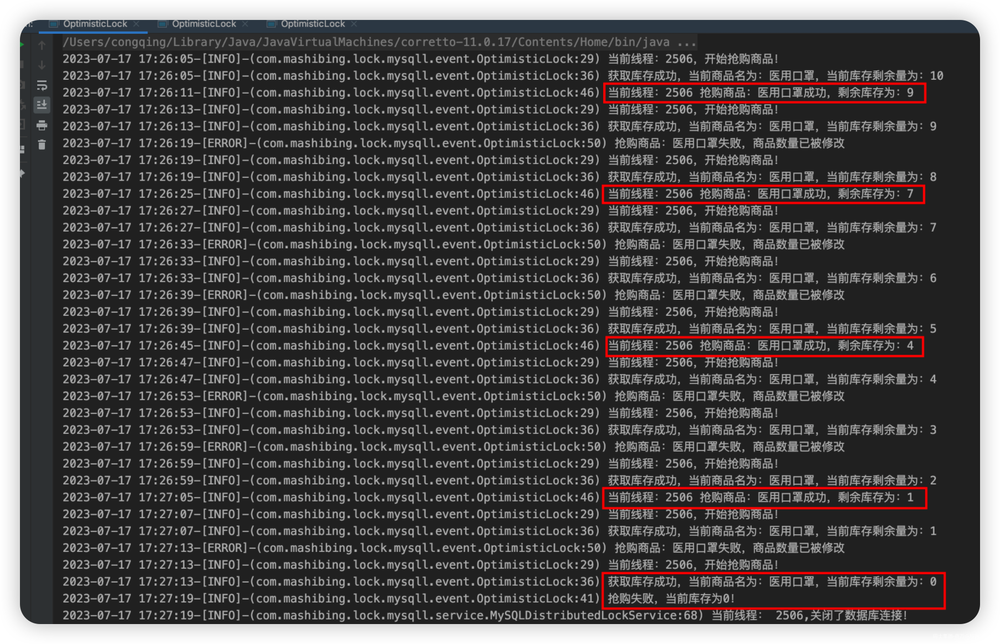

- 8 5 2

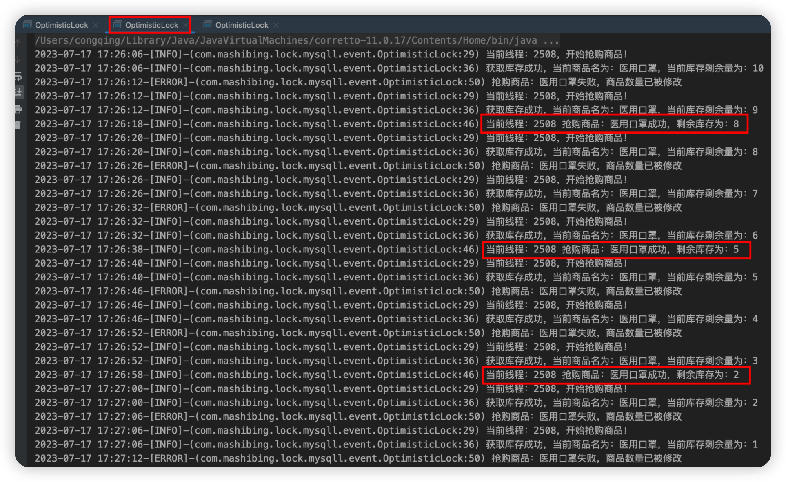

- 6 3

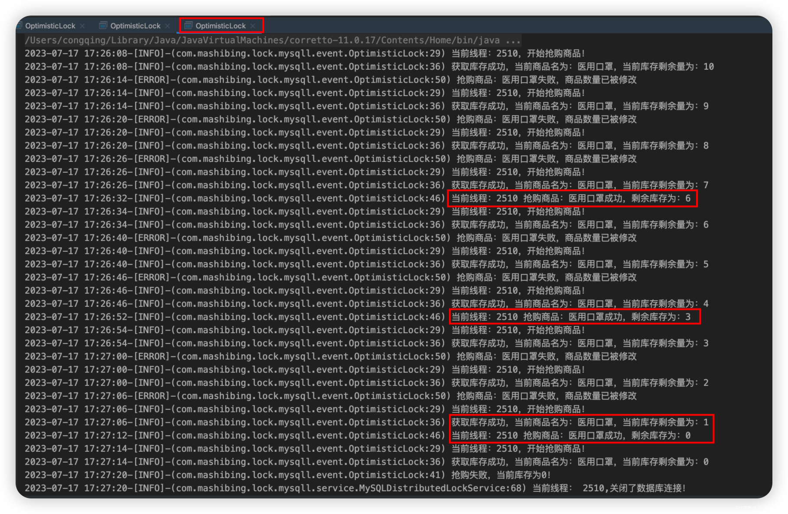

***注意事项：***

- 该锁为非阻塞的

- 该锁对于业务具有侵入式，如果设置版本号校验则增加的额外的字段，增加了数据库冗余

- 当并发量过高时会有大量请求访问数据库的某行记录，对数据库造成很大的写压力

- 因此乐观锁适用于并发量不高，并且写操作不频繁的场景

## 2.3 基于悲观锁

### 2.3.1 实现思路

- 关闭jdbc连接自动commit属性

- 每次执行业务前先使用查询语句后接for update表示锁定该行数据（注意查询条件如果未命中主键或索引，此时将会从行锁变为表锁）

- 执行业务流程修改表资源

- 执行commit操作

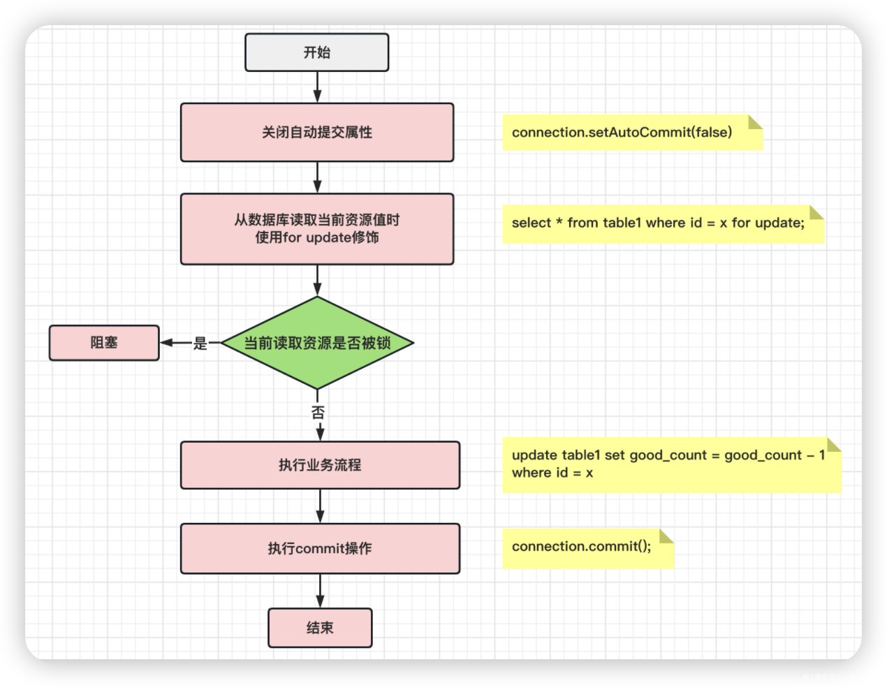

### 2.3.2 代码实现

1. 在 **MySQLDistributedLockService** 中，添加对悲观锁的操作

```java

    /**
     * 悲观锁-获取资源
     * @param id 资源ID
     * @return result
     */
    public static ResultSet getGoodCount2(int id) throws SQLException {

        String sql = "select  * from  database_lock_2 where id = " + id + "for update";

        //查询数据
        resultSet = statement.executeQuery(sql);
        return resultSet;
    }

    /**
     * 悲观锁-修改资源
     * @param id        资源ID
     * @return  修改状态
     */
    public static boolean setGoodCount2(int id) throws SQLException {

        String sql = "update database_lock_2 set good_count = good_count - 1 where id =" + id;

        int stat = statement.executeUpdate(sql);
        return stat == 1;
    }

    /**
     * 悲观锁-关闭事务自动提交
     */
    public static void closeAutoCommit(){
        try {
            connection.setAutoCommit(false);
        } catch (SQLException e) {
            log.error("关闭自动提交失败！",e);
        }
    }

    /**
     * 悲观锁-提交事务
     */
    public static void commit(String pid,String goodName,int goodCount) throws SQLException {
        connection.commit();
        log.info("当前线程：" + pid + "抢购商品： " + goodName + "成功，剩余库存为：" + (goodCount-1));
    }

    /**
     * 悲观锁-回滚
     */
    public static void rollBack() throws SQLException {
        connection.rollback();
    }
```

2. 创建**PessimisticLock**，模拟并发操作分布式锁

```java
/**
 * mysql 分布式锁-悲观锁
 *     执行流程：多个进程抢占同一个商品，执行业务完毕则通过connection.commit() 释放锁
 *     锁机制：单一进程获取锁时，则其他进程将阻塞等待
 */
@Slf4j
public class PessimisticLock extends Thread {

    @Override
    public void run() {
        super.run();
        ResultSet resultSet = null;
        String goodName = null;
        int goodCount = 0;
        String pid = ManagementFactory.getRuntimeMXBean().getName().split("@")[0];
        //关闭自动提交
        MySQLDistributedLockService.closeAutoCommit();
        try{
            while(true){
                log.info("当前线程：" + pid + "");
                //获取库存
                resultSet = MySQLDistributedLockService.getGoodCount2(1);
                while (resultSet.next()) {
                    goodName = resultSet.getString("good_name");
                    goodCount = resultSet.getInt("good_count");
                }
                log.info("获取库存成功，当前商品名称为:" + goodName + ",当前库存剩余量为:" + goodCount);
                // 模拟执行业务事件
                Thread.sleep(2 * 1000);
                if (0 == goodCount) {
                    log.info("抢购失败，当前库存为0！");
                    break;
                }
                // 抢购商品
                if (MySQLDistributedLockService.setGoodCount2(1)) {
                    // 模拟延时，防止锁每次被同一进程获取
                    MySQLDistributedLockService.commit(pid, goodName, goodCount);
                    Thread.sleep(2 * 1000);
                } else {
                    log.error("抢购商品:" + goodName + "失败!");
                }
            }
        }catch (Exception e){
            //抢购失败
            log.error("抢购商品发生错误！",e);
            try {
                MySQLDistributedLockService.rollBack();
            } catch (SQLException ex) {
                log.error("回滚失败！ ",e);
            }
        }finally {
            if(resultSet != null){
                try {
                    resultSet.close();
                } catch (SQLException e) {
                    log.error("Result关闭失败！",e);
                }
            }
            MySQLDistributedLockService.close();
        }
    }

    public static void main(String[] args) {
        new PessimisticLock().start();
    }
}
```

### 2.3.3 代码测试

开启三个进程，查看执行情况

- 9 6 3 0

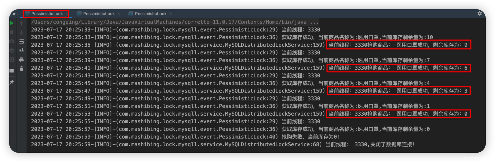

- 8 5 2

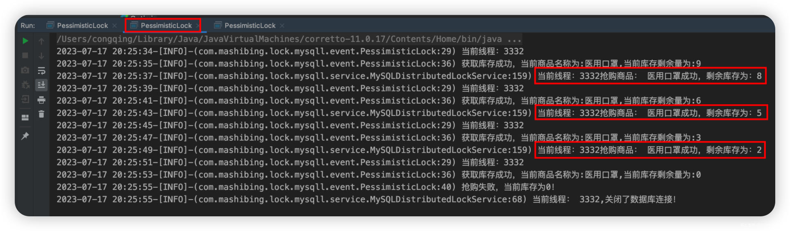

- 7 4 1

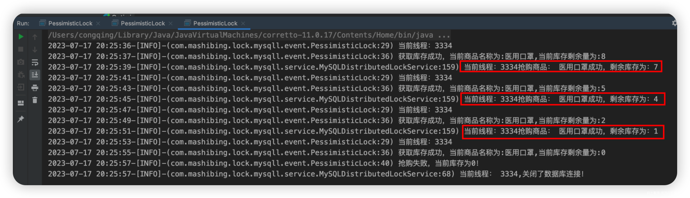

***注意事项：***

- 该锁为阻塞锁

- 每次请求存在额外加锁的开销

- 在并发量很高的情况下会造成系统中存在大量阻塞的请求，影响系统的可用性

- 因此悲观锁适用于并发量不高，读操作不频繁的写场景

**总结：**

- 在实际使用中，由于受到性能以及稳定性约束，对于关系型数据库实现的分布式锁一般很少被用到。但是对于一些并发量不高、系统仅提供给内部人员使用的单一业务场景可以考虑使用关系型数据库分布式锁，因为其复杂度较低，可靠性也能够得到保证。

# 3.基于Zookeeper分布式锁

## 3.1 Zookeeper分布式锁应用场景

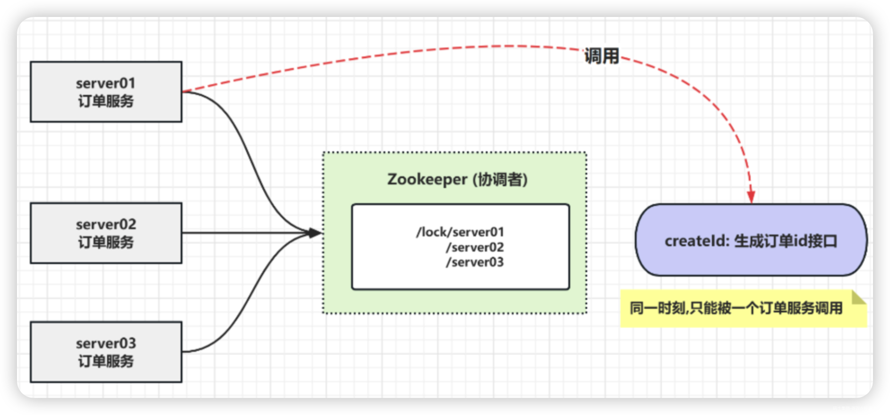

- 全部的订单服务在调用 createId 接口前都往 ZooKeeper 的注册中心的指定目录写入注册信息（如 /lock/server 01）和绑定值改变事件

- 全部的订单服务判断自己往注册中心指定目录写入的注册信息是否是全部注册信息中的第一条？如果是，调用 createId 接口（不是第一条就等着）。调用结束后，去注册中心移除自己的信息

- ZooKeeper 注册中心信息改变后，通知所有的绑定了值改变事件的订单服务执行第 2 条

## 3.2 Zookeeper分布式锁分析

客户端（对zookeeper集群而言）向zookeeper集群进行了上线注册并在一个永久节点下创建有序的临时子节点后，根据编号顺序，最小顺序的子节点获取到锁，其他子节点由小到大监听前一个节点。

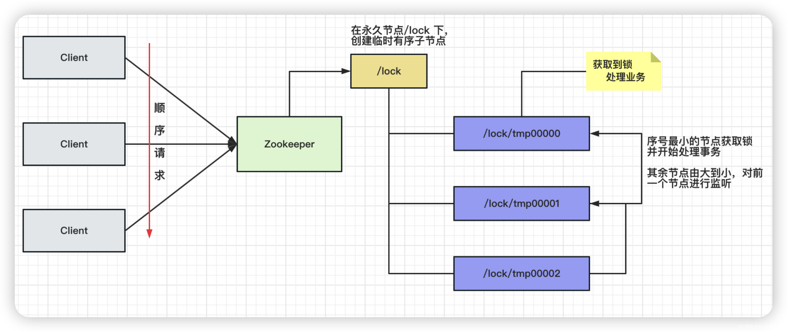

当拿到锁的节点处理完事务后，释放锁，后一个节点监听到前一个节点释放锁后，立刻申请获得锁，以此类推

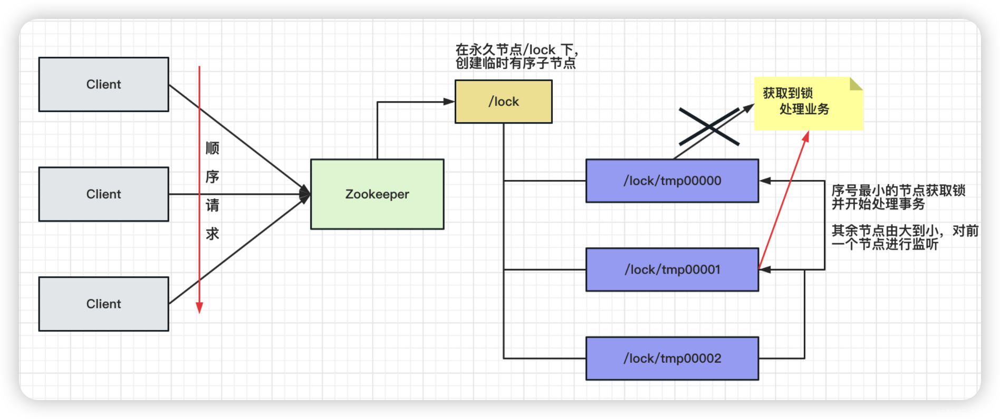

**过程解析**

- 第一部分：客户端在zookeeper集群创建带序号的、临时的节点

- 第二部分：判断节点是否是最小的节点，如果是，获取到锁，如果不是，监听前一个节点

## 3.3 分布式锁实现

**1）创建 Distributedlock类, 获取与zookeeper的连接**

- 构造方法中获取连接

- 添加 CountDownLatch (闭锁)

> CountDownLatch是具有synchronized机制的一个工具，目的是让一个或者多个线程等待，直到其他线程的一系列操作完成。
>
> CountDownLatch初始化的时候，需要提供一个整形数字，数字代表着线程需要调用countDown()方法的次数，当计数为0时，线程才会继续执行await()方法后的其他内容。

```java
/**
 * 分布式锁
 */
public class DistributedLock {

    private ZooKeeper client;

    // 连接信息
    private String connectString = "192.168.58.200:2181,192.168.58.200:2182,192.168.58.200:2183";

    // 超时时间
    private int sessionTimeOut = 30000;

    private CountDownLatch countDownLatch = new CountDownLatch(1);

    //1. 在构造方法中获取连接
    public DistributedLock() throws Exception {

        client = new ZooKeeper(connectString, sessionTimeOut, new Watcher() {
            @Override
            public void process(WatchedEvent watchedEvent) {

            }
        });

        //等待Zookeeper连接成功，连接完成继续往下走
        countDownLatch.await();

        //2. 判断节点是否存在
        Stat stat = client.exists("/locks", false);
        if(stat == null){
            //创建一下根节点
            client.create("/locks","locks".getBytes(), ZooDefs.Ids.OPEN_ACL_UNSAFE, CreateMode.PERSISTENT);
        }
  
    }

    //3.对ZK加锁
    public void zkLock(){
        //创建 临时带序号节点

        //判断 创建的节点是否是最小序号节点，如果是 就获取到锁；如果不是就监听前一个节点
    }

    //4.解锁
    public void unZkLock(){

        //删除节点
    }
}
```

**2）对zk加锁**

```java
/**
 * 分布式锁
 */
public class DistributedLock {

    private ZooKeeper client;

    // 连接信息
    private String connectString = "192.168.58.200:2181,192.168.58.200:2182,192.168.58.200:2183";

    // 超时时间
    private int sessionTimeOut = 30000;

    // 等待zk连接成功
    private CountDownLatch countDownLatch = new CountDownLatch(1);

    // 等待节点变化
    private CountDownLatch waitLatch = new CountDownLatch(1);

    //当前节点
    private String currentNode;

    //前一个节点路径
    private String waitPath;

    //1. 在构造方法中获取连接
    public DistributedLock() throws Exception {

        client = new ZooKeeper(connectString, sessionTimeOut, new Watcher() {
            @Override
            public void process(WatchedEvent watchedEvent) {
                //countDownLatch 连上ZK，可以释放
                if(watchedEvent.getState() == Event.KeeperState.SyncConnected){
                    countDownLatch.countDown();
                }

                //waitLatch 需要释放 (节点被删除并且删除的是前一个节点)
                if(watchedEvent.getType() == Event.EventType.NodeDeleted &&
                        watchedEvent.getPath().equals(waitPath)){
                    waitLatch.countDown();
                }
            }
        });

        //等待Zookeeper连接成功，连接完成继续往下走
        countDownLatch.await();

        //2. 判断节点是否存在
        Stat stat = client.exists("/locks", false);
        if(stat == null){
            //创建一下根节点
            client.create("/locks","locks".getBytes(), ZooDefs.Ids.OPEN_ACL_UNSAFE, CreateMode.PERSISTENT);
        }

    }

    //3.对ZK加锁
    public void zkLock(){
        //创建 临时带序号节点
        try {
            currentNode = client.create("/locks/" + "seq-", null, ZooDefs.Ids.OPEN_ACL_UNSAFE, CreateMode.EPHEMERAL_SEQUENTIAL);

            //判断 创建的节点是否是最小序号节点，如果是 就获取到锁；如果不是就监听前一个节点
            List<String> children = client.getChildren("/locks", false);

            //如果创建的节点只有一个值，就直接获取到锁，如果不是，监听它前一个节点
            if(children.size() == 1){
                return;
            }else{
                //先排序
                Collections.sort(children);

                //获取节点名称
                String nodeName = currentNode.substring("/locks/".length());

                //通过名称获取该节点在集合的位置
                int index = children.indexOf(nodeName);

                //判断
                if(index == -1){
                    System.out.println("数据异常");
                }else if(index == 0){
                    //就一个节点，可以获取锁
                    return;
                }else{
                    //需要监听前一个节点变化
                    waitPath = "/locks/" + children.get(index-1);
                    client.getData(waitPath,true,null);

                    //等待监听执行
                    waitLatch.await();
                    return;
                }
            }

        } catch (KeeperException e) {
            e.printStackTrace();
        } catch (InterruptedException e) {
            e.printStackTrace();
        }
    }
}
```

**3）zk删除锁**

```java
    //4.解锁
    public void unZkLock() throws KeeperException, InterruptedException {

        //删除节点
        client.delete(currentNode,-1);
    }
```

**4）测试**

```java
public class DistributedLockTest {

    public static void main(String[] args) throws Exception {

        final DistributedLock lock1 = new DistributedLock();
        final DistributedLock lock2 = new DistributedLock();

        new Thread(new Runnable() {
            @Override
            public void run() {

                try {
                    lock1.zkLock();
                    System.out.println("线程1 启动 获取到锁");

                    Thread.sleep(5 * 1000);
                    lock1.unZkLock();
                    System.out.println("线程1 释放锁");
                } catch (InterruptedException | KeeperException e) {
                    e.printStackTrace();
                }
            }
        }).start();

        new Thread(new Runnable() {
            @Override
            public void run() {

                try {
                    lock2.zkLock();
                    System.out.println("线程2 启动 获取到锁");

                    Thread.sleep(5 * 1000);
                    lock2.unZkLock();
                    System.out.println("线程2 释放锁");
                } catch (InterruptedException | KeeperException e) {
                    e.printStackTrace();
                }
            }
        }).start();
    }
}
```

## 3.4 Curator框架实现分布式锁案例

### 3.4.1 InterProcessMutex介绍

Apache Curator 内置了分布式锁的实现： `InterProcessMutex`。

- InterProcessMutex有两个构造方法

```java
public InterProcessMutex(CuratorFramework client, String path)
{
    this(client, path, new StandardLockInternalsDriver());
}

public InterProcessMutex(CuratorFramework client, String path, LockInternalsDriver driver)
{
    this(client, path, LOCK_NAME, 1, driver);
}
```

- 参数说明如下

|  |  |
| --- | --- |
| 参数 | 说明 |
| client | curator中zk客户端对象 |
| path | 抢锁路径，同一个锁path需一致 |
| driver | 可自定义lock驱动实现分布式锁 |

- 主要方法如下

```java
//获取锁，若失败则阻塞等待直到成功，支持重入
public void acquire() throws Exception
  
//超时获取锁，超时失败
public boolean acquire(long time, TimeUnit unit) throws Exception
  
//释放锁
public void release() throws Exception
```

- 注意点，调用acquire()方法后需相应调用release()来释放锁

### 3.4.2 实现思路

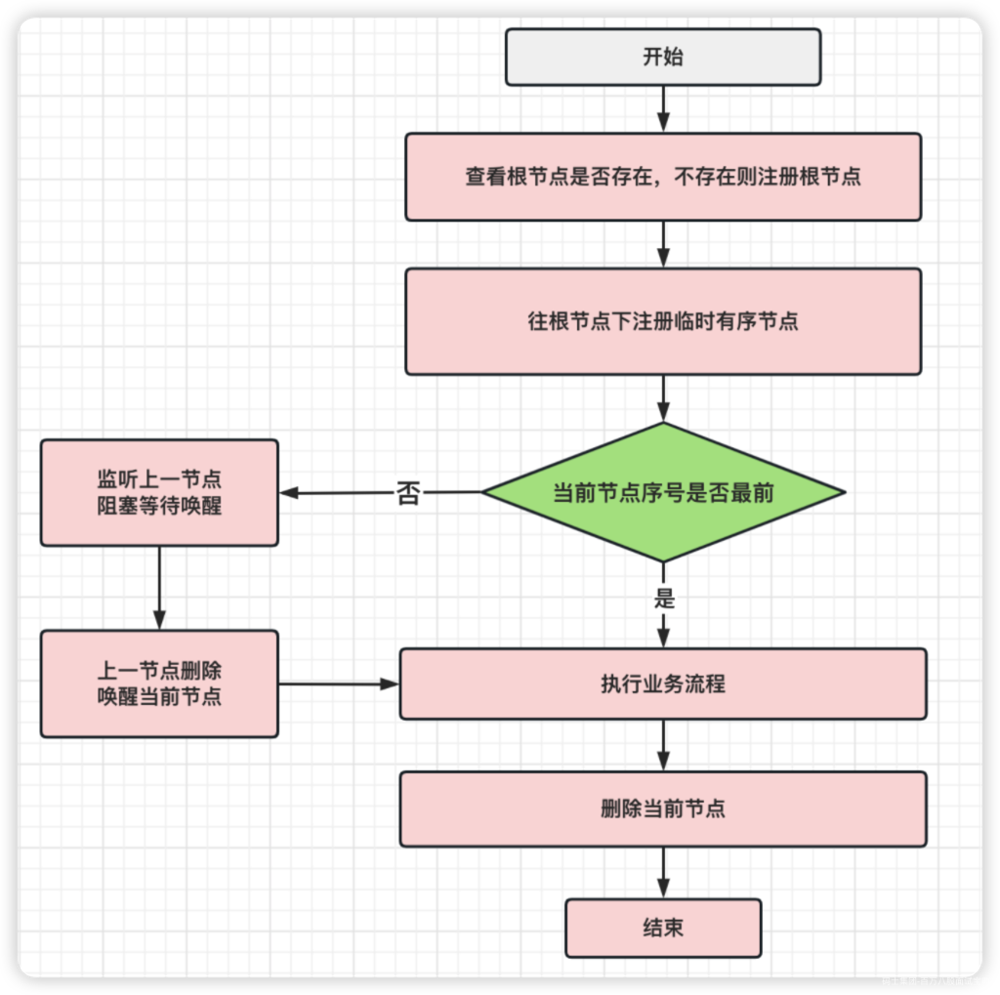

### 3.4.3 分布式锁测试

- 9 6 3 0

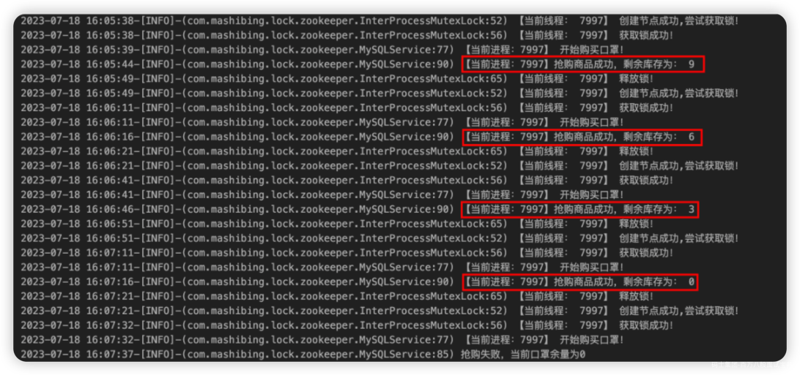

- 8 5 2

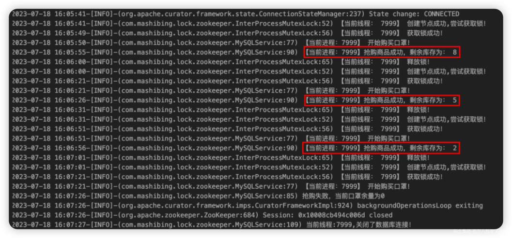

- 7 4 1

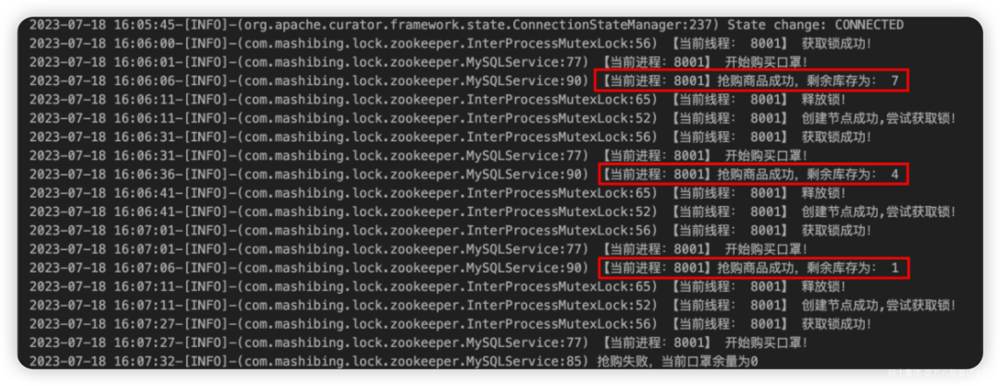
