# 第六节 zookeeper底层原理解析

# 1.Zookeeper集群选举和ZAB协议

Zookeeper是如何保证数据一致性的？这也是困扰分布式系统框架的一个难题。

ZK提供了两个功能

1. 管理（存储 读取）用户程序提交的数据

2. 为用户程序提供节点监听服务

ZK特点

1. 小数据存储 （小而重要）

2. 快速的读写

3. 可靠watch机制

4. 高可用性：ZK采用了多副本机制，数据在多个节点上进行复制存储

5. 强一致性：所有客户端对共享数据的读取都获取最新的一致的视图。每次的写入操作都会经过 Leader节点，确保数据在所有节点同步

6. 顺序性： ZK保证了所有操作请求的顺序性

对于一个分布式系统来说，保障集群中所有节点的数据完全相同（即一致性）是很重要的，随着多节点的引入，这影响的是整个分布式系统对外服务的表象一致性。也就是说，一个分布式系统想要做到完全的一致性，需要对外表现为顺序一致性，即各个节点上的操作顺序都一致。

而在现实运行情况下，节点可能故障，可能增加，甚至可能被篡改，这就给分布式一致性带来了挑战。在这种情况的干扰下，分布式系统需要通过某些机制，来就一些事情达成一致的看法，也就是共识。

## 1.1 拜占庭将军问题

在各类介绍 Paxos 算法的文章中，都会提到著名的“拜占庭将军问题”，以及偶尔也会提到的“两军问题”。

简单的来说，拜占庭将军问题描述了这样一个场景：

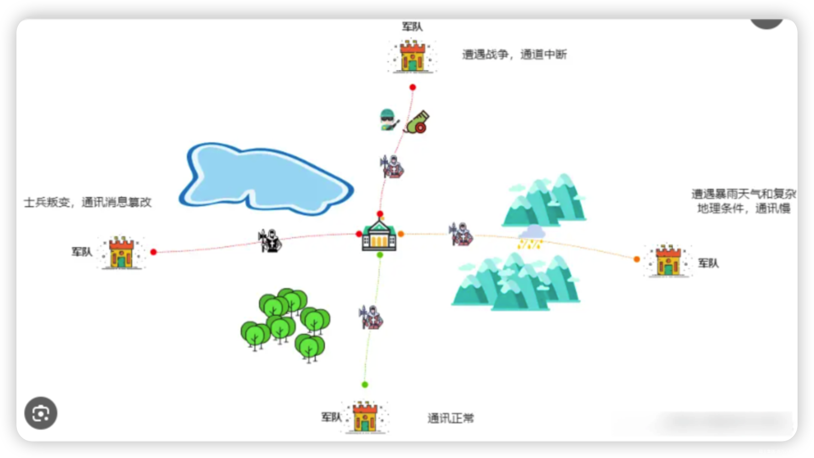

> 拜占庭帝国有许多支军队，不同军队的将军之间必须制订一个统一的行动计划，从而做出进攻或者撤退的决定，同时，各个将军在地理上都是被分隔开来的，只能依靠军队的通讯员来进行通讯。然而，在所有的通讯员中可能会存在叛徒，这些叛徒可以任意篡改消息，从而达到欺骗将军的目的。这就是著名的“拜占廷将军问题”。

从理论上来说，在分布式计算领域，试图在异步系统和不可靠的通道上来达到一致性状态是不可能的。因此在对一致性的研究过程中，往往假设信道是可靠的。

事实上，大多数系统都是部署在同一个局域网中的，因此消息被篡改的情况非常罕见；另一方面，由于硬件和网络原因而造成的消息不完整问题，只需一套简单的校验算法即可避免——因此，在实际工程实践中，可以假设不存在拜占庭问题，即假设所有消息都是完整的，没有被篡改的。

## 1.2 Paxos算法

### 1.2.1 Paxos算法概述

**1）拜占庭将军问题与Paxos 的关系**

拜占庭将军问题是由 Paxos 算法作者**莱斯利·兰伯特**提出的点对点通信中的基本问题。该问题要说明的含义是，在不可靠信道上试图通过消息传递的方式达到一致性是不可能的。

所以，Paxos 算法的前提是不存在拜占庭将军问题，即信道是安全的、可靠的，集群节点间传递的消息是不会被篡改的。

**2）什么是Paxos算法**

Paxos是一种用于在分布式系统中达成一致的经典算法。它由Leslie Lamport于1998年首次提出，被认为是分布式一致性算法中最复杂和最难理解的算法之一（Paxos使其在2013年获得图灵奖）。

**少数服从多数**

- Paxos采取了一个我们非常熟悉的达成共识的方法：**少数服从多数**。只要有超过一半的机器认可某一个消息，那么最终就所有机器都接受这条消息并将它作为本次的结论。而竞选失败的少数派消息，就会被拒绝，并由第一个从客户端处接收到该消息的机器，向客户端发送失败结果，由客户端进行重试，去尝试在下一轮竞选中胜出。

> Lamport 为了讲述这个算法，假想了一个叫做 Paxos 的希腊城邦进行选举的情景。这个算法也是因此而得名。在他的假想中，这个城邦要采用民主提议和投票的方式选出一个最终的决议，但由于城的居民没有人原意把全部时间和精力放在这种事情上，所以他们只能不定时的来参加提议，不定时来了解提议、投票进展，不定时的表达自己的投票意见。 Paxos 算法的目标就是让他们按照少数服从多数的方式，最终达成一致意见。

**3） Paxos中常见的角色**

1. Proposer（提案者/提议者）：提议一个值，用于被投票决议。

> 提案者。也就是在选举中提出提案的人，放到分布式系统里，就是接收到客户端写操作的人。一切行为都由Proposer提出提案开始，Paxos会将提案想要进行的操作，抽象为一个“value”，去在多台机器中传递，最后被所有机器接受。

2. Acceptor（附议者/接受者）：对每个提议进行投票。

> 接受者。Acceptor 从含义上来说就是除了当前Proposer以外的其他机器，他们之间完全平等和独立，Proposer需要争取超过半数（N/2+1）的 Acceptor 批准后，其提案才能通过，它倡导的“value”操作才能被所有机器所接受。

3. Learner（学习者/告知者）：被告知投票的结果，不参与投票过程。

> 该角色是在达成决议时，对结论的学习者，也即是从其他节点“学习”最终提案内容，Learner将学习到这个值，并将其应用到本地系统中，从而确保所有节点最终达成一致。

### 1.2.2 一个简单的提案

在最简单的情况下，假设有4台机器，其中一台机器收到了来自客户端的写操作请求，需要将这个请求同步给其他机器。

我们将这台收到请求的机器称为Proposer，因为它将要开始将收到的请求作为一个提案提议给其他的机器。为了方便起见，我们假设这个请求是要将一个名字设置为“吴x凡”。如下图所示：

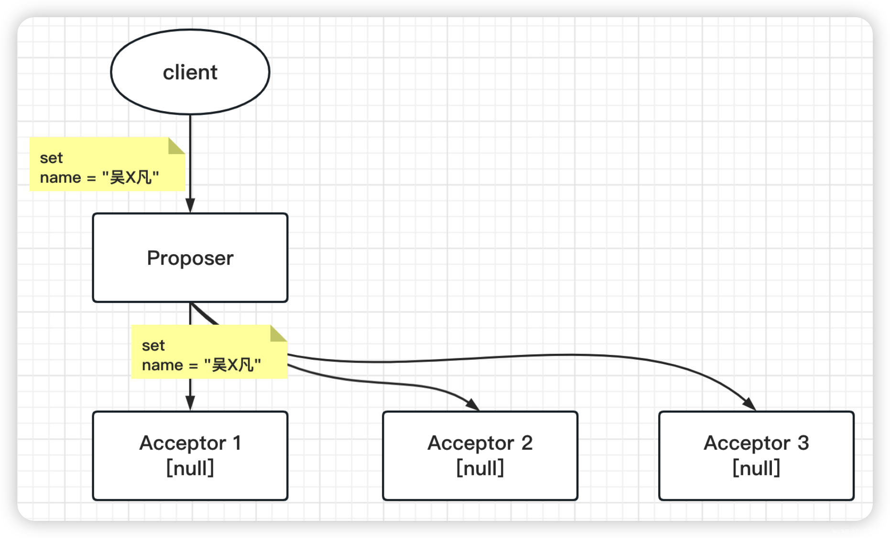

此时，其他的Acceptor都闲着呢，也没其他人找，所以当它们收到Proposer的提案时，就直接投票了，说可以可以，我是空的，赞成提案（同意提议）：

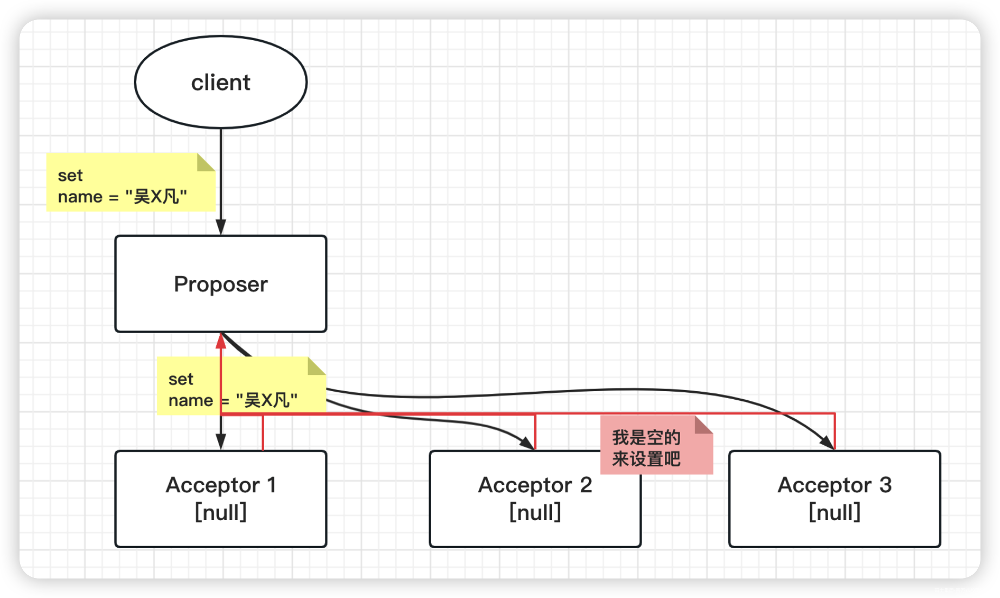

在这个简单的同步故事中，Proposer实际上经历了两个阶段：

1. Proposer阶段：Proposer首先向所有其他机器发送消息，告知它们有一个提案（操作），并请求它们投票支持。Acceptor检查自己当前没有接受过其他提案（操作），因此都表示支持该提案。

2. Accept阶段：Proposer收到其他机器的回复，得知它们也都没有接受其他提案（操作），于是正式通知所有机器该提案被集体通过，并可生效。操作将同步到所有机器，最终生效。

### 1.2.3 两个提案并发进行

现在考虑一个更复杂的分布式场景，由于我们处于一个分布式环境中，每台机器都可能会同时收到来自两个不同客户端的请求。那么在这种情况下，我们该如何处理呢？谁的请求会被优先接受并作为最终的共识？如下图

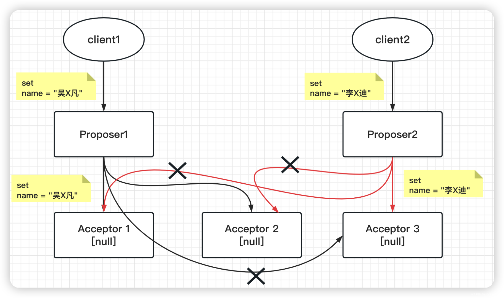

由于网络传输的时间问题，两个Proposer的提案到达各个机器，是会存在先后顺序的。

- 假设Proposer 1 的提案先达到了 Acceptor 1 和 Acceptor 2，而Proposer 2 的提案先达到了 Acceptor 3，其达到 Acceptor 1 和 Acceptor 2 时，由于机器已经投票给Proposer 1 了，所以Proposer 2 的提案遭到拒绝，Proposer 1 达到 Acceptor 3 的时候同样被拒。

此时，到底该接受谁的申请，就要遵循自由民主的法则 ----> **少数服从多数**。

- Proposer 1 发现超过半数的Acceptor都接受了自己，所以放心大胆地发起要求，让所有Acceptor都按照自己的值来操作。而Proposer 2 发现只有不到半数的Acceptor支持自己，而有超过半数是支持Proposer 1 的值的，因此只能拒绝Client 2，并将自己也改为Proposer 1 的操作：

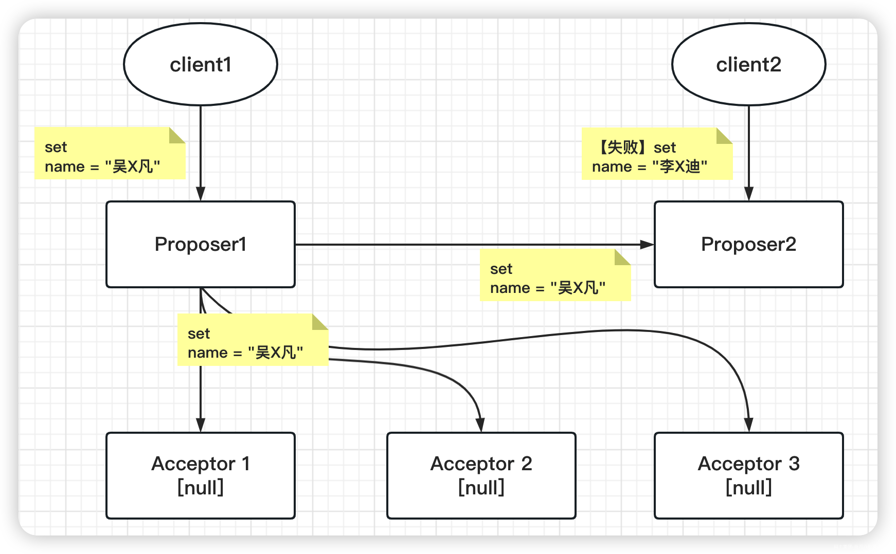

到此为止，看起来没有问题，但是，这是因为\*\*恰好Acceptor的数量是单数，可以选出“大多数”，\*\*但是因为同时成为Proposer的机器数量是不确定的，因此是无法保证Acceptor的数量一定是单数的，如下面这种情况就无法选出“大多数”了：

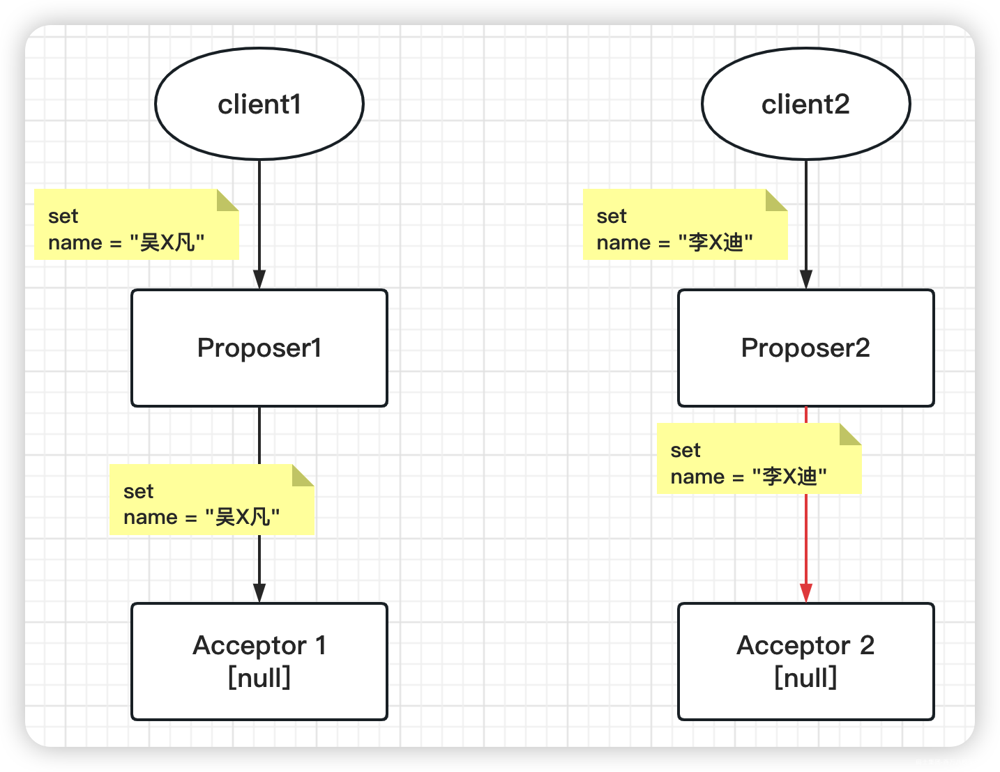

这时，两个Proposer有可能总是先抢到一个Acceptor的支持，然后在另一个Acceptor处折戟沉沙，算法就一直循环死锁下去了。为了解决这种情况，Paxos给提案加了一个**编号**。

### 1.2.4 给提案添加编号

之前我们Proposer的提案都是只有操作内容的，现在我们给他加一个编号，即：

- Proposer 1 的提案为：[n1, v1]

- Proposer 2 的提案为：[n2, v2]

假设Proposer 1 接到Clint 1 的消息稍微早一点，那么它的编号就是1，Proposer 2 的编号就是2，那么他们的提案实际就是：

- Proposer 1 的提案为：[1, { Set name = "吴x凡"}]

- Proposer 2 的提案为：[2, { Set name = "李x迪"}]

此时，Paxos加上一条规则：

- **Acceptor如果还没有正式通过提案（即还没有Accept使操作生效），就可以接受编号更大的Prepare请求**。

所以，回到上面的困境

1. 当Proposer 1 想要向Acceptor 2 寻求支持时，Acceptor 2 一看你的编号（1）比我已经支持的编号（2）要小，拒绝拒绝。此时Proposer 1 由于没有得到过半数的支持，会重新寻求支持。

2. 而当Proposer 2 想要向Acceptor 1 寻求支持时，Acceptor 1 一看你的编号（2）比我已经支持的编号（1）要大，好的你是老大我听你的。此时Proposer 2 已经得到了超过半数的支持，可以进入正式生效的Accept阶段了。

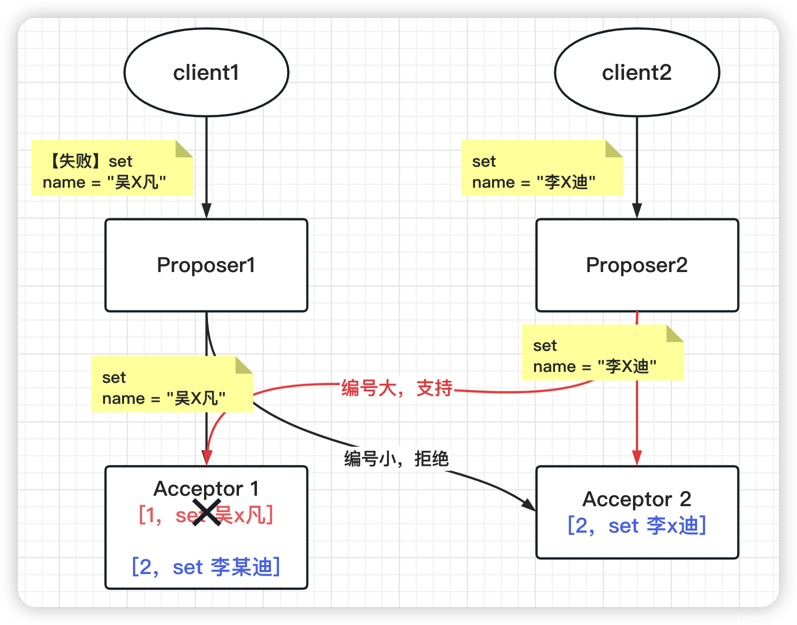

这里需要补充一下，Proposer 1 这里支持提案失败，他是怎么让自己也接受Proposer 2 的提案的呢？

所以这里的后续会发生的事情是：

1. Proposer 2 发现得到了过半数的支持，开始向所有Acceptor发送Accept请求。

2. 所有Acceptor接收到Accept请求后，按照之前Prepare时收到的信息与承诺，去生效Proposer 2 的提案内容（即Set Addr = “北京”的操作）。

3. Proposer 1 之前已经收到了所有Acceptor的回复，发现没有得到过半数的支持，直接回复Client 1 请求失败，并变成一个Acceptor（或者说Learner），接受Proposer 2 的Accept请求。

### 1.2.5 可能发生的异常情况

**异常情况一**：假设现在有三个Proposer同时收到客户端的请求，那么他们会生成全局唯一的不同编号，带着各自接收到的请求提案，去寻求Acceptor的支持。但假设他们都分别争取到了一个Acceptor的支持，此时由于Prepare阶段只会接受编号更大的提案，所以正常情况下只有Proposer 3 的提案会得到所有Acceptor的支持。

但假设这时候Proposer 3 机器挂了，无法进行下一步的Accept了，怎么办呢？那么所有Acceptor就会陷入持续的等待，而其他的Proposer也会一直重试然后一直失败。

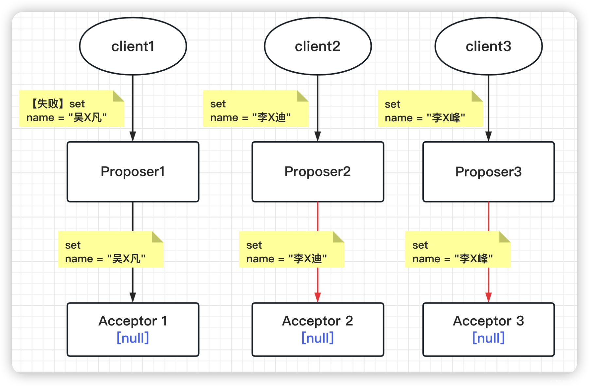

为了解决这个问题，Paxos决定，**允许Proposer在提案遭到过半数的拒绝时，更新自己的提案编号，用新的更大的提案编号，去发起新的Prepare请求**。

那么此时Proposer 1 和Proposer 2 就会更新自己的编号，从【1】与【2】，改为比如【4】和【5】，重新尝试提案。这时即使Proposer 3 机器挂了，没有完成Accept，Acceptor也会由于接收到了编号更大的提案，从而覆盖掉Proposer 3 的提案，进入新的投票支持阶段。

### 1.3.1 ZAB协议介绍

ZAB（ZooKeeper Atomic Broadcast）协议是Apache ZooKeeper分布式协调服务中使用的一种原子广播协议。ZooKeeper是一个开源的、高性能的分布式协调服务，用于管理分布式系统中的配置信息、命名服务、分布式锁等。ZAB协议是ZooKeeper的核心组件，它通过确保ZooKeeper集群中所有服务器之间的事务广播顺序，实现了ZooKeeper数据的一致性.

#### 1.3.1.1 Paxos和ZAB的区别与联系

Paxos和ZAB（ZooKeeper Atomic Broadcast）是两种不同的分布式一致性算法，用于保证分布式系统中的数据一致性。它们的区别包括 一下几点：

1. 提出时间：

- Paxos：Paxos算法最早由Leslie Lamport于1998年提出。

- ZAB：ZAB协议是Apache ZooKeeper分布式协调服务中使用的一种原子广播协议，是在Paxos算法基础上进行优化和简化的。

2. 算法复杂性：

- Paxos：Paxos算法被认为是分布式一致性算法中最复杂和最难理解的算法之一。它的理论基础相对复杂，理解和实现都较为困难。

- ZAB：ZAB协议相对于Paxos算法来说，更简单和易于理解。它通过对Paxos算法的优化，去掉了一些不必要的阶段，使得实现和使用更加便捷。

3. 角色划分：

- Paxos：Paxos算法中有Proposer（提议者）、Acceptor（接受者）和Learner（学习者）三种角色，一个节点可以同时担任这三种角色。

- ZAB：ZAB协议中也有类似的角色划分，包括Leader（领导者）、Follower（追随者）和Observer（观察者）。ZAB中的Leader类似于Paxos中的Proposer，负责处理客户端请求和事务的广播，而Follower则类似于Paxos中的Acceptor，按照Leader广播的顺序执行事务。

**Paxos算法和ZAB协议之间的关系在于**，ZAB协议可以被视为Paxos算法的一种变体或实现。ZAB协议在设计上借鉴了Paxos算法的一些思想，但做了一些优化和简化，使得ZAB协议更适合用于ZooKeeper这样的分布式协调服务。

#### 1.3.1.2 Zab 协议核心

在 Zookeeper 中只有一个 Leader，并且只有 Leader 可以处理外部客户端的事务请求，并将其转换成一个事务 Proposal（写操作），然后 Leader 服务器再将事务 Proposal 操作的数据同步到所有 Follower（数据广播/数据复制）。

Zookeeper 采用 Zab 协议的核心就是只要有一台服务器提交了 Proposal，就要确保所有服务器最终都能正确提交 Proposal，这也是 CAP/BASE 最终实现一致性的体现。

从大体上看，Zab 协议的原理可细分为四个阶段：

1. 选举（Leader Election）

2. 发现（Discovery）

3. 同步（Synchronization）

4. 广播（Broadcast）

但是在 ZooKeeper 的实现中，将发现和同步两部分内容合成数据恢复一部分，所以按实现划分可以分为三个阶段：

1. Leader 选举（Fast Leader Election）

2. 数据恢复（Recovery Phase）

3. 广播（Broadcast Phase）

#### 1.3.1.3 Zab 模式

Zab 协议按照功能的不同，有两种模式：一种是消息广播模式，另一种是崩溃恢复模式。

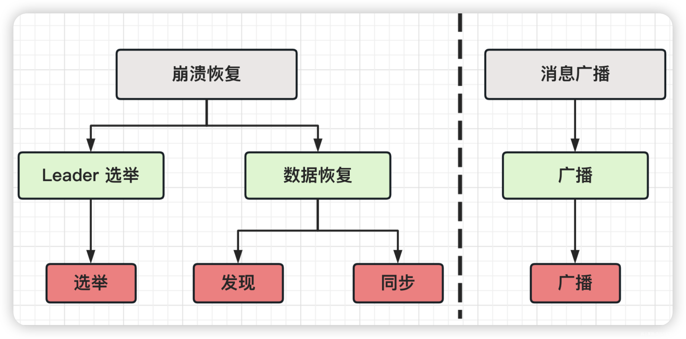

> 消息广播模式用于处理客户端的请求，崩溃恢复模式用于在节点意外崩溃时能够快速恢复，继续对外提供服务，让集群达成高可用状态。

**1) 消息广播模式**

- 在 Zookeeper 集群中数据副本的传递策略就是采用消息广播模式，Zookeeper 中的数据副本同步方式与2PC方式相似但却不同，2PC是要求协调者必须等待所有参与者全部反馈ACK确认消息后，再发送 commit 消息，要求所有参与者要么全成功要么全失败，2PC方式会产生严重的阻塞问题。

- 而 Zookeeper 中 Leader 等待 Follower 的 ACK 反馈是指：只要半数以上的 Follower 成功反馈即可，不需要收到全部的 Follower 反馈。

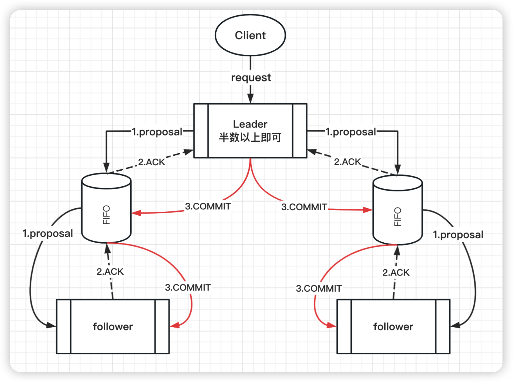

Zookeeper 中广播消息步骤：

- 客户端发起一个写操作请求

- Leader 服务器处理客户端请求后将请求转换为 Proposal，同时为每个 Proposal 分配一个全局唯一 ID，即 ZXID

- Leader 服务器与每个 Follower 之间都有一个队列，Leader 将消息发送到该队列

- Follower 机器从队列中取出消息处理完（写入本地事务日志中）后，向 Leader 服务器发送 ACK 确认

- Leader 服务器收到半数以上的 Follower 的 ACK 后，即认为可以发送 Commit

- Leader 向所有的 Follower 服务器发送 Commit 消息

**2) 崩溃恢复模式**

**一旦 Leader 服务器出现崩溃或者由于网络原因导致 Leader 服务器失去了与过半 Follower 的联系，那么就会进入崩溃恢复模式。**

Zookeeper 集群中为保证任何进程能够顺序执行，只能是 Leader 服务器接收写请求，其他服务器接收到客户端的写请求，也会转发至 Leader 服务器进行处理。

**Zab 协议崩溃恢复需满足以下2个请求：**

- 确保已经被 Leader 提交的 proposal 必须最终被所有的 Follower 服务器提交

- 确保丢弃已经被 Leader 提出的但没有被提交的 Proposal

也就是新选举出来的 Leader 不能包含未提交的 Proposal，必须都是已经提交了的 Proposal 的 Follower 服务器节点，新选举出来的 Leader 节点中含有最高的 ZXID，所以，在 Leader 选举时，将 ZXID 作为每个 Follower 投票时的信息依据。这样做的好处是避免了 Leader 服务器检查 Proposal 的提交和丢弃工作。

### 1.3.2 相关名词概念

#### 1.3.2.1 Zookeeper 节点的三种角色

**Leader：**

- 负责处理客户端发送的读、写事务请求。这里的事务请求可以理解这个请求具有事务的 ACID 特性。

- 同步写事务请求给其他节点，且需要保证事务的顺序性。

**Follower：**

- 负责处理客户端发送的读请求

- 转发写事务请求给 Leader。

- 参与 Leader 的选举。

**Observer：**

- 和 Follower 一样，唯一不同的是，不参与 Leader 的选举，且状态为 OBSERING。

- 可以用来线性扩展读的 QPS。

#### 1.3.2.2 Zookeeper 节点的四种状态

在知道了 Zookeeper 中有三种角色后，我们可能会问： **Zookeeper 是如何知道自己目前是什么角色的呢？**

在 ZAB 协议中定义：通过自身的状态来区分自己的角色的，在运行期间各个进程可能出现以下四种状态之一：

- Looking：不确定Leader状态，该状态下的服务器认为当前集群中没有Leader，会发起Leader选举

- Following：跟随者状态，表明当前服务器角色是Follower，并且它知道Leader是谁

- Leading：领导者状态，表明当前服务器角色是Leader，它会维护与Follower间的心跳

- Observing：观察者状态，表明当前服务器角色是Observer，与Follower唯一的不同在于不参与选举，也不参与集群写操作时的投票

在组成 ZAB 协议的所有进程启动的时候，初始化状态都是 LOOKING 状态，此时进程组中不存在 Leader，选举之后才有，在进行选举成功后，就进入消息广播模式，此时 Zookeeper 集群中的角色状态就不再是 LOOKING 状态。

#### 1.3.2.3 myid与zxid

- **myid** ： 每个 Zookeeper 服务器，都需要在数据文件夹下创建一个名为 myid 的文件，该文件包含整个 Zookeeper 集群唯一的 ID

> 例如，某个 Zookeeper 集群包含三台服务器，在配置文件中，server.后面的数据即为 myid
>
> server.1=zoo1:2888:3888
>
> server.2=zoo2:2888:3888
>
> server.3=zoo3:2888:3888

- **zxid** ： 类似于 RDBMS 中的事务ID，用于标识一个 Proposal ID，为了保证顺序性，ZXID 必须单调递增.

### 1.3.3 启动阶段选举Leader 流程

Zookeeper 刚启动的时候，多个节点需要找出一个 Leader。怎么找呢，就是用投票。

比如集群中有两个节点，A 和 B，原理图如下所示：

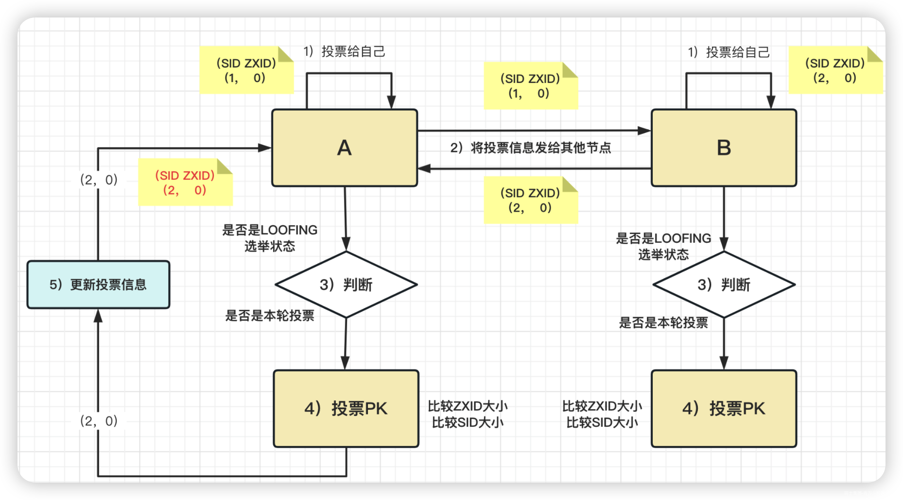

- 节点 A 先投票给自己，投票信息包含节点 id(SID) 和一个 ZXID，如 (1,0)。SID 是配置好的，且唯一，ZXID 是唯一的递增编号。

- 节点 B 先投票给自己，投票信息为(2,0)。

- 然后节点 A 和 B 将自己的投票信息投票给集群中所有节点。

- 节点 A 收到节点 B 的投票信息后，检查下节点 B 的状态是否是本轮投票，以及是否是正在选举(LOOKING)的状态。

- 投票 PK：节点 A 会将自己的投票和别人的投票进行 PK，如果别的节点发过来的 ZXID 较大，则把自己的投票信息更新为别的节点发过来的投票信息，如果 ZXID 相等，则比较 SID。这里节点 A 和 节点 B 的 ZXID 相同，SID 的话，节点 B 要大些，所以节点 A 更新投票信息为(2，0)，然后将投票信息再次发送出去。而节点 B 不需要更新投票信息，但是下一轮还需要再次将投票发出去。

这个时候节点 A 的投票信息为(2，0)，如下图所示：

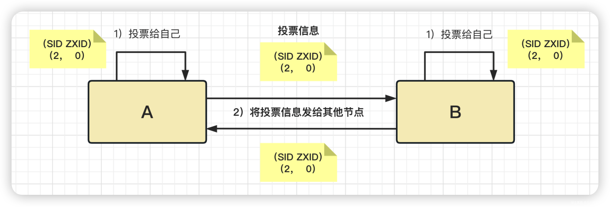

- **统计投票**：每一轮投票，都会统计每台节点收到的投票信息，判断是否有过半的节点收到了相同的投票信息。节点 A 和 节点 B 收到的投票信息都为(2，0)，且数量来说，大于一半节点的数量，所以将节点 B 选出来作为 Leader。

- **更新节点状态**：节点 A 作为 Follower，更新状态为 FOLLOWING，节点 B 作为 Leader，更新状态为 LEADING。

### 1.3.4 运行期间，Leader宕机了如何处理

当整个集群启动过程中，或者当 Leader 服务器出现网络中弄断、崩溃退出或重启等异常时，ZAB 协议就会 **进入崩溃恢复模式**，选举产生新的 Leader。

在 Zookeeper 运行期间，Leader 会一直保持为 LEADING 状态，直到 Leader 宕机了，这个时候就要重新选 Leader，而选举过程和启动阶段的选举过程基本一致。

需要注意的点：

- 剩下的 Follower 进行选举，Observer 不参与选举。

- 投票信息中的 zxid 用的是本地磁盘日志文件中的。如果这个节点上的 zxid 较大，就会被当选为 Leader。如果 Follower 的 zxid 都相同，则 Follower 的节点 id 较大的会被选为 Leader。

**恢复模式的两个原则**

> 当集群正在启动过程中，或 Leader 与超过半数的主机断连后，集群就进入了恢复模式。对于要恢复的数据状态需要遵循两个原则。

- **已被处理过的消息不能丢失**当 Leader 收到超过半数 Follower 的 ACKs 后，就向各个 Follower 广播 COMMIT 消息， 批准各个 Server 执行该写操作事务。当各个 Server 在接收到 Leader 的 COMMIT 消息后就会在本地执行该写操作，然后会向客户端响应写操作成功。但是如果在非全部 Follower 收到 COMMIT 消息之前 Leader 就挂了，这将导致一种后 果：**部分 Server 已经执行了该事务，而部分 Server 尚未收到 COMMIT 消息**，所以其并没有执行该事务。当新的 Leader 被选举出，集群经过恢复模式后需要保证所有 Server 上都执行 了那些已经被部分 Server 执行过的事务。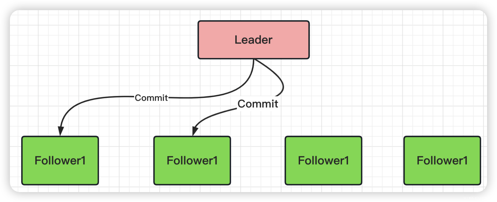

- **被丢弃的消息不能再现**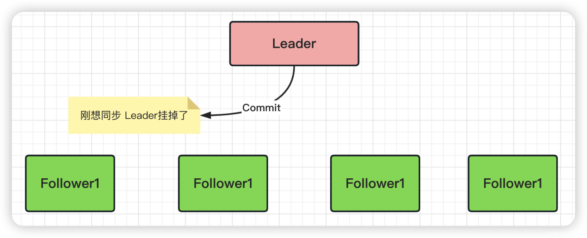当新事务在 Leader 上已经通过，其已经将该事务更新到了本地，但所有 Follower 还都没有收到 COMMIT 之前，Leader 宕机了（比前面叙述的宕机更早），此时，所有 Follower 根本 就不知道该 Proposal 的存在。当新的 Leader 选举出来，整个集群进入正常服务状态后，之 前挂了的 Leader 主机重新启动并注册成为了 Follower。若那个别人根本不知道的 Proposal 还保留在那个主机，那么其数据就会比其它主机多出了内容，导致整个系统状态的不一致。所以，该 Proposa 应该被丢弃。类似这样应该被丢弃的事务，是不能再次出现在集群中的， 应该被清除。

### 1.3.5 节点之间如何数据同步

不同的客户端可以分别连接到主节点或备用节点。

而客户端发送读写请求时是不知道自己连的是Leader 还是 Follower，如果客户端连的是主节点，发送了写请求，那么 Leader 执行 2PC(两阶段提交协议)同步给其他 Follower 和 Observer 就可以了。但是如果客户端连的是 Follower，发送了写请求，那么 Follower 会将写请求转发给 Leader，然后 Leader 再进行 2PC 同步数据给 Follower。

两阶段提交协议：

- 第一阶段：Leader 先发送 proposal 给 Follower，Follower 发送 ack 响应给 Leader。如果收到的 ack 过半，则进入下一阶段。

- 第二阶段： Leader 从磁盘日志文件中加载数据到内存中，Leader 发送 commit 消息给 Follower，Follower 加载数据到内存中。

我们来看下 Leader 同步数据的流程：

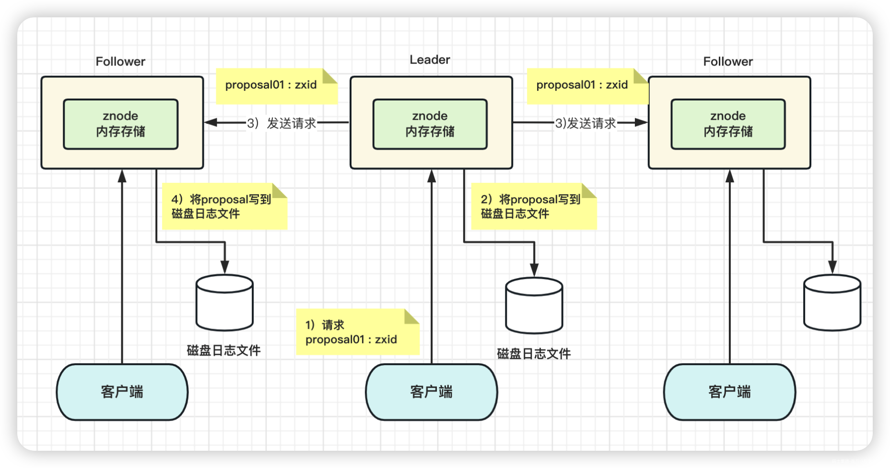

- ① 客户端发送写事务请求。

- ② Leader 收到写请求后，转化为一个 "proposal01：zxid1" 事务请求，存到磁盘日志文件。

- ③ 发送 proposal 给其他 Follower。

- ④ Follower 收到 proposal 后，Follower 写磁盘日志文件。

接着我们看下 Follower 收到 Leader 发送的 proposal 事务请求后，怎么处理的：

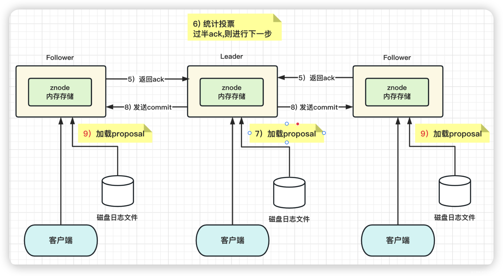

- ⑤ Follower 返回 ack 给 Leader。

- ⑥ Leader 收到超过一半的 ack，进行下一阶段

- ⑦ Leader 将磁盘中的日志文件的 proposal 加载到 znode 内存数据结构中。

- ⑧ Leader 发送 commit 消息给所有 Follower 和 Observer。

- ⑨ Follower 收到 commit 消息后，将 磁盘中数据加载到 znode 内存数据结构中。

现在 Leader 和 Follower 的数据都是在内存数据中的，且是一致的，客户端从 Leader 和 Follower 读到的数据都是一致的。

### 1.3.6 Zookeeper是不是强一致性

写操作时强一直性，读操作不是

**1）什么是强一致性？**

- **数据的强一致性指的是: 一个外部的客户端，去请求一个分布式系统时，一旦这个数据被允许查询，那么我们任何一个被要求存储该数据的节点上，在任何时候都能够查询到这份数据，且数据内容要求一模一样。**

**2）什么是顺序一致性**

- 写入操作顺序一致性：当多个客户端同时向ZooKeeper进行写入操作时，这些写入操作会被按照客户端发起的顺序逐个执行。ZooKeeper通过强制所有写入操作都经过Leader节点进行协调，保证了写入操作的顺序一致性（Leader节点与从节点写入的数据一定是一致的）。

- **读取数据顺序一致性：无论客户端连接到哪个ZooKeeper节点，它们在读取数据时都会获得相同的数据视图。**

**3）Zookeeper官方定义：顺序一致性。**（Sequential consistency）

- **zookeeper 并不能保证所有客户端在某一时刻读到的数据是一致的，客户端还是有可能读到旧数据的，但可以使用sync()方法向leader节点同步最新的已提交数据。**

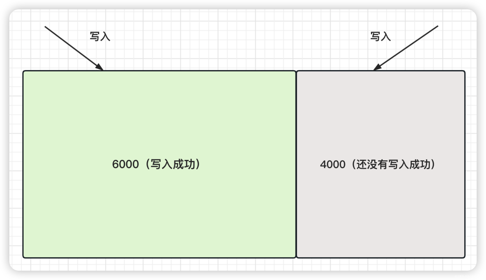

**已上图为例，如果一个zk集群有10000台节点，当进行写入的时候，如果已经有6K个节点写入成功，zk就认为本次写请求成功。但是这时候如果一个客户端读取的刚好是另外4K个节点的数据，那么读取到的就是旧的过期数据。**

**在zk的官方文档中对此有解释，地址在：**<https://zookeeper.apache.org/doc/r3.1.2/zookeeperProgrammers.html>

**ZK保证了保持长链接的单个客户端，总是能得到自己保持链接的机器上的最新值，这个值不一定是Leader的最新值。如果该机器挂了，会连接到zxid不小于当前节点的机器，从而保证不会读到更旧的值。**

### 1.3.7 Zookeeper顺序一致性怎么做到的？

Leader 发送 proposal 时，其实会为每个 Follower 创建一个队列，都往各自的队列中发送 proposal。

**如下图所示是 Zookeeper 的消息广播流程：**

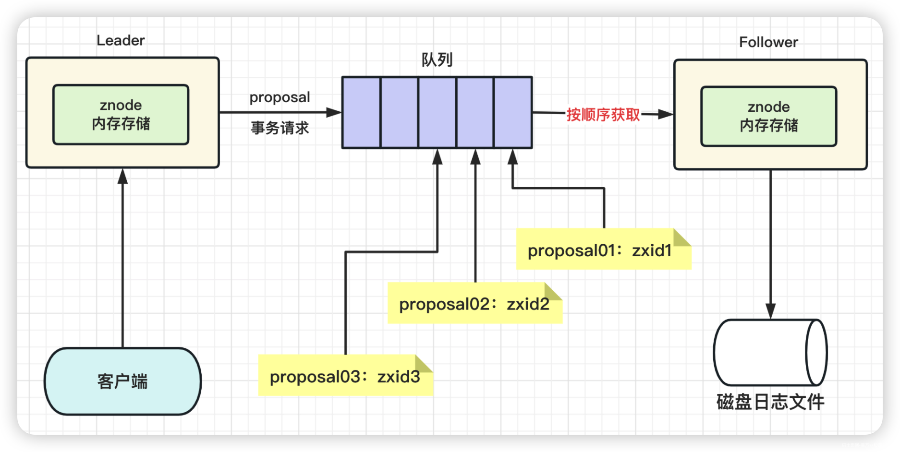

客户端发送了三条写事务请求，对应的 proposal 为：

```plain
proposal01:zxid1
proposal02:zxid2
proposal03:zxid31.2.3.
```

Leader 收到请求后，依次放到队列中，然后 Follower 依次从队列中获取请求，这样就保证了数据的顺序性。

## 1.4 事务日志

ZooKeeper适合读多写少的场景，读操作几乎是内存级别的，这得益于ZooKeeper将数据保存在内存中。数据在内存中，就有一个问题，ZooKeeper重启了数据还会在吗？

当然在了，ZooKeeper将数据以事务日志形式持久化到文件中。每个更新请求，必须先将事务日志写到文件中，然后才把数据同步到内存数据库。

### 1.4.1 事务日志存放目录

事务日志文件默认存储在dataDir目录下，因为每次事务请求都是一次磁盘IO操作，事务日志的写入性能直接影响了ZooKeeper对事务请求的吞吐，为了更高的吞吐和低延迟，建议单独为事务日志配置一个目录dataLogDir，以免受其他操作影响。

**dataLogDir**下会先生成一个子目录**version2**，2表示ZooKeeper日志格式的版本号，同一版本的日志可以互相迁移恢复数据。

version2下才是事务日志文件 。

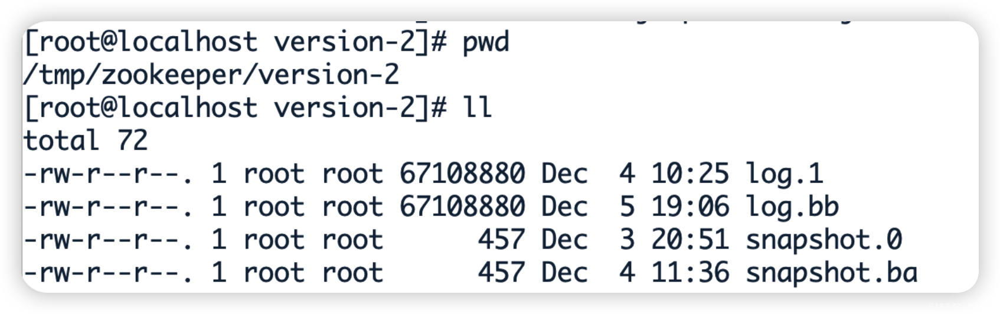

### 1.4.2 文件大小和后缀名

事务日志的文件有两个特点：

- 文件大小出奇一致：都是67108880KB，即64MB。

- 文件名后缀是一串看似有些规律的数字，而且随着修改时间推移呈递增状态。

```plain
dataDir=/usr/local/zookeeper-cluster/zookeeper-1/data
```

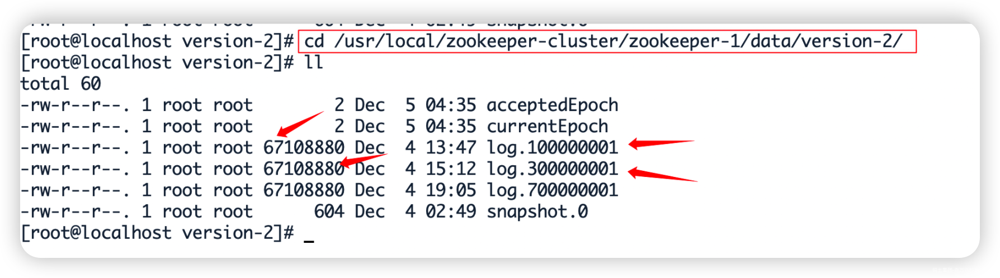

**1）磁盘空间预分配**

- 文件大小都是64MB，是因为日志文件的磁盘空间预分配。

- 事务日志不断追加写入文件的操作会触发底层磁盘IO为文件开辟新的磁盘块，即磁盘Seek，为了避免频繁的文件大小增长带来的磁盘Seek开销，ZooKeeper在创建事务日志文件时就向操作系统预分配了一块比较大的磁盘块，保证了单一事务日志文件所占用的磁盘块是连续的，以此提升事务的写入性能。默认是64MB，空闲部分用空字符（\0）填充。

- 如果后续检测到文件空间不足4KB，将扩容再次预分配64MB，直到创建新的事务日志文件。

**2）ZXID作为后缀名**

- 文件名后面的一串数字是事务ID：ZXID，并且是写入事务日志文件的第一条事务ZXID。

### 1.4.3 事务日志可视化

- 事务日志文件中存放的是二进制格式的数据，不能用vim、cat等工具直接打开，需要用apache-zookeeper-3.7.1 提供的脚本bin/zkTxnLogToolkit.sh打开：

```shell
[root@localhost zookeeper-1]# cd /usr/local/zookeeper-cluster/zookeeper-1/bin/

[root@localhost bin]# ./zkTxnLogToolkit.sh /usr/local/zookeeper-cluster/zookeeper-1/data/version-2/log.100000001 
```

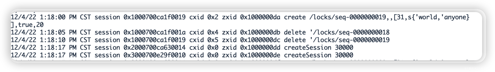

一行就是一个事务记录，每行从左到右依次是操作时间、客户端session ID、CXID（客户端操作序列号）、ZXID、操作类型（做了什么），如果操作类型是 createSession，后面的30000就是session的超时时间。
