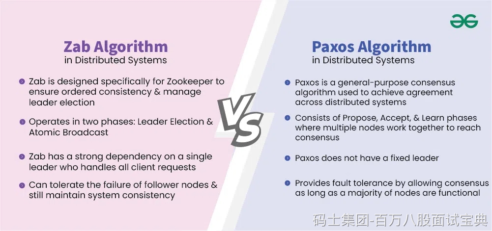

ZAB（ZooKeeper Atomic Broadcast）和 Paxos 都是分布式系统中用于实现一致性的协议，尽管它们在设计理念和应用场景上有所不同。M

**共同点：**

- **领导者驱动与多数派确认：**两者都采用领导者选举机制，确保由一个节点负责协调操作，并通过多数派节点的确认来达成一致性。
- **保证顺序一致性：**ZAB 和 Paxos 都确保所有节点接收到的操作顺序一致，避免因顺序不同导致的数据不一致问题。

**主要区别：S**

1. **设计目标：**

- **ZAB：**专为 ZooKeeper 设计，主要用于实现主备模式的日志复制，强调高可用性和顺序一致性。
- **Paxos：**通用的状态机复制协议，适用于各种分布式系统，强调理论上的一致性保障。

2. **协议复杂度：**

- **ZAB：**实现相对简单，适合特定场景，如 ZooKeeper 的主备复制。
- **Paxos：**协议复杂，实际应用中常常需要多轮交互，理解和实现难度较高。

3. **消息顺序处理：**

- **ZAB：**严格按照提案的顺序进行处理，确保操作的顺序一致性。
- **Paxos：**允许在不同的提案中选择不同的值，可能导致操作顺序的变化。

4. **恢复机制：**

- **ZAB：**在领导者故障时，通过恢复机制确保系统的高可用性。
- **Paxos：**在领导者故障时，需要重新选举，可能导致系统暂时不可用。

**总结：**ZAB 和 Paxos 都是实现分布式一致性的协议，但它们在设计目标、协议复杂度、消息顺序处理和恢复机制等方面存在差异。ZAB 更适用于特定场景，如 ZooKeeper 的主备复制，而 Paxos 提供了更通用的一致性保障，适用于各种分布式系统。 B
