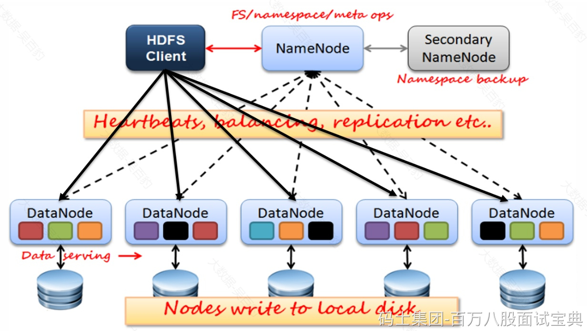

HDFS 全称为Hadoop Distribute File System——分布式文件系统，主要是用于分布式存储数据，其设计思想是将大文件、大批量数据分布式存储在大量廉价的服务器上，以便于采取分而治之的方式对海量数据进行运算分析。

HDFS是一个主从（Master/Slaves）架构，由一个NameNode和一些DataNode组成，下图是HDFS架构：

HDFS架构中包含NameNode、SecondaryNameNode、DataNode 、HDFS Client各角色，各个角色作用如下：

## **NameNode**

NameNode就是主从架构中的Master，是HDFS中的管理者。HDFS中数据文件分布式存储在各个DataNode节点上，**NameNode维护和管理文件系统元数据**（空间目录树结构、文件、Block信息、访问权限），随着存储文件的增多，NameNode上存储的信息越来越多，NameNode主要通过两个组件实现元数据管理：fsimage（命名空间镜像文件）和editslog（编辑日志）。

- fsimage：HDFS文件系统元数据的镜像文件，包含了HDFS文件系统的所有目录和文件相关信息元数据，**例如：文件名称、路径、权限关系、副本数、修改、访问时间等**。**当HDFS启动后，首先会将磁盘中的fsimage加载到内存中，这样可以保证用户操作HDFS的高效和低延迟**。注意，fsimage中不记录每个block所在的DataNode信息，这些信息在每次HDFS启动时从DataNode重建，之后DataNode会周期性的通过心跳向NameNode报告block信息。
- edits：在NameNode运行期间，**客户端对HDFS的操作(文件或目录的创建、重命名、删除)日志**都会保存在edits文件中，edits文件保存在磁盘中。

当NameNode重启时，会将fsimage内容映射到内存中，然后再一条条执行edits文件中的操作就可以恢复到NameNode重启前的状态，HDFS中基于fsimage和edits两个组件做到不丢失数据。

总体来看：NameNode作用如下：

1. 完全基于内存存储文件元数据、目录结构、文件block的映射信息。
2. 提供文件元数据持久化/管理方案。
3. 提供副本放置策略。
4. 处理客户端读写请求。

## **SecondaryNameNode**

随着操作HDFS的数据变多，久而久之就会造成edits文件变的很大，如果namenode重启后再一条条执行edits日志恢复状态就需要很长时间，导致重启速度慢，所以在NameNode运行的时候就需要将editslog和fsimage定期合并。这个合并操作就由SecondaryNameNode负责。

所以SecondaryNameNode作用就是辅助NameNode定期合并fsimage和editslog，并将合并后的fsimage推送给NameNode。

## **DataNode**

DataNode是主从架构中的Slave,**DataNode存储文件block块**，Block在DataNode上以文件形式存储在磁盘上，包括2个文件，一个是数据文件本身，一个是元数据（包括block长度、block校验和、时间戳）。**当DataNode启动后会向NameNode进行注册，并汇报block列表信息**，后续会周期性（参数dfs.blockreport.intervalMsec决定，默认6小时）向NameNode上报所有的块信息。同时，DataNode会每隔3秒与NameNode保持心跳，如果超过10分钟NameNode没有收到某个DataNode的心跳，则认为该节点不可用。

总结，DataNode作用如下：

1. 基于本地磁盘存储block数据块。
2. 保存block的校验和数据保证block的可靠性。
3. 与NameNode保持心跳并汇报block列表信息。

## **Client**

Client是操作HDFS的客户端，作用如下：

1. 与NameNode交互，获取文件block位置信息。
2. 与DataNode交互，读写文件block数据。
3. 文件上传时，负责文件切分成block并上传。
4. 可以通过client访问HDFS进行文件操作或管理HDFS。
