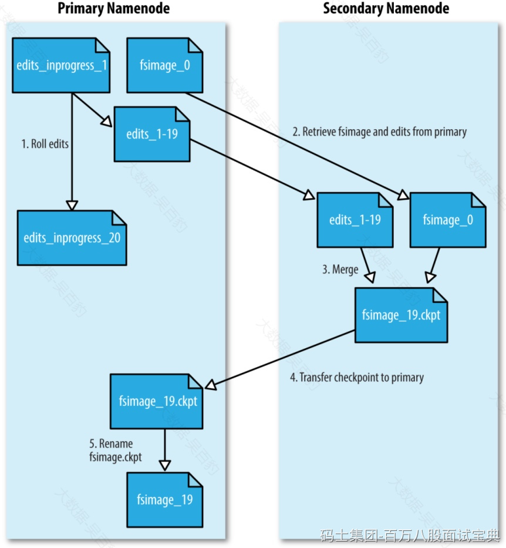

HDFS 中NameNode管理通过fsimage和editslog来管理集群元数据，SecondaryNameNode会负责定期合并fsimage和editslog，以保证HDFS集群重启后快速恢复到之前状态。

下图是SecondaryNameNode进行fsimage和editslog合并整个流程图：

1. 当HDFS集群首次启动会在NameNode上创建空的fsimage，对HDFS的操作会记录到edits文件中。
2. 当开始进行editslog和fsimage合并时，SecondaryNameNode请求namenode生成新的editslog文件并向其中写日志。
3. SecondaryNameNode通过HTTP GET的方式从NameNode下载fsimage和edits文件到本地。
4. SecondaryNameNode将fsimage加载到自己的内存，并根据editslog更新内存中的fsimage信息，然后将更新完毕之后的fsimage写到磁盘上。
5. SecondaryNameNode通过HTTP PUT将新的fsimage文件发送到NameNode，NameNode将该文件保存为.ckpt的临时文件备用。
6. NameNode重命名该临时文件并准备使用，此时NameNode拥有一个新的fsimage文件和一个新的很小的editslog文件（可能不是空的，因为在SecondaryNameNode合并期间可能对元数据进行了读写操作）。
7. 后续SecondaryNameNode会按照以上步骤周期性进行editslog和fsimage的合并。

默认情况下，SecondaryNameNode每隔1小时执行edits和fsimage合并，通过参数“dfs.namenode.checkpoint.period”进行控制，默认该参数为3600s，即：1小时。

HDFS还会每分钟进行NameNode操作事务数量检查，如果editslog存储的事务(即操作数)到了1000000个也会进行editslog和fsimage的合并。每分钟检查操作事务参数通过dfs.namenode.checkpoint.check.period设置，默认60s，editslog操作数控制参数为dfs.namenode.checkpoint.txns，默认1000000。
