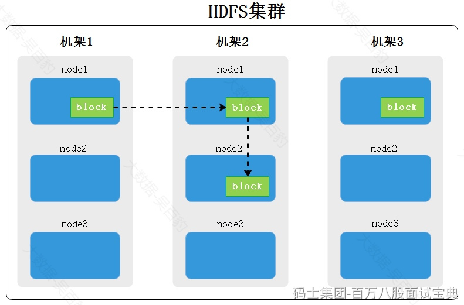

HDFS中每个block块有3副本，由参数dfs.replication决定。三个副本会按照副本放置策略进行存储，如下图所示就是一个block有3副本存储情况。

第一个副本：放置在上传文件的DataNode，也就是Client所在节点上；如果是集群外提交，则随机挑选一台磁盘不太满，CPU不太忙的节点。

第二个副本：放置在于第一个副本不同的机架的节点上。

第三个副本：与第二个副本相同机架的随机节点。

更多副本：随机节点存放。

这样存放的好处是避免一个机架出故障导致所有数据丢失，同一个机架上的节点通信网路会比不同机架节点通信更好，所有副本2与副本3在同一个机架中，这样节省带宽。如果block有更多的副本，则随机选择机架。
