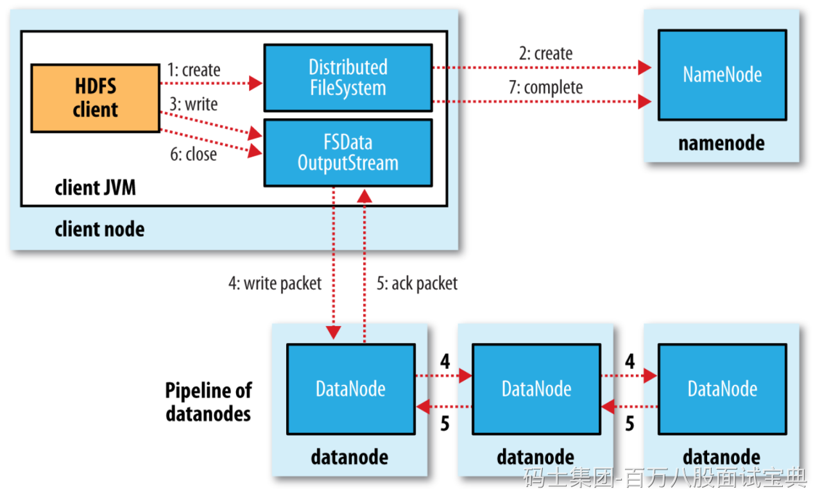
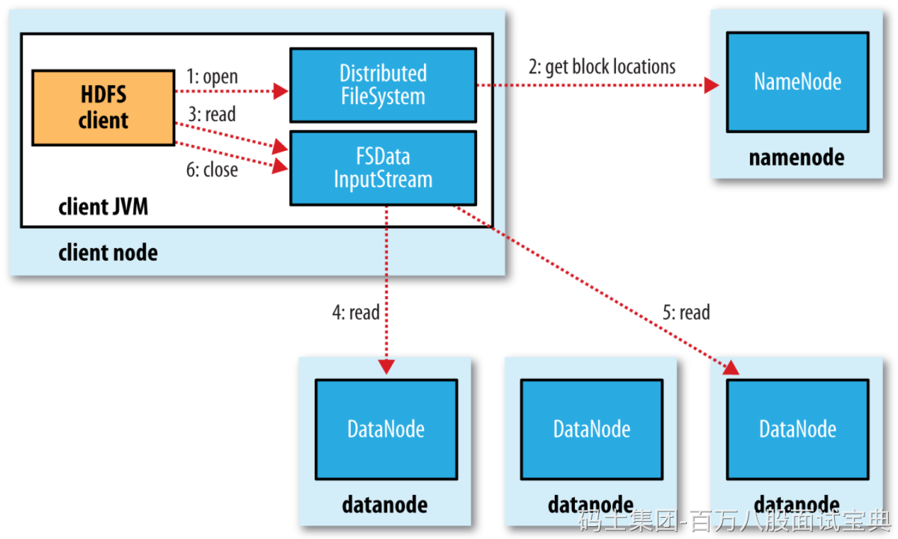

## **HDFS写文件流程**

1. 客户端会创建DistributedFileSystem对象，DistributedFileSystem会发起对namenode的一个RPC连接，请求创建一个文件，不包含关于block块的请求。namenode会执行各种各样的检查，确保要创建的文件不存在，并且客户端有创建文件的权限。如果检查通过，namenode会创建一个文件（在edits中，同时更新内存状态），否则创建失败，客户端抛异常IOException。
2. NN在文件创建后，返回给HDFS Client可以开始上传文件块。
3. DistributedFileSystem返回一个FSDataOutputStream对象给客户端用于写数据。FSDataOutputStream封装了一个DFSOutputStream对象负责客户端跟datanode以及namenode的通信。
4. 客户端中的FSDataOutputStream对象将数据切分为小的packet数据包（64kb，core-default.xml：file.client-write-packet-size默认值65536），并写入到一个内部队列（“数据队列”）。DataStreamer会读取其中内容，并请求namenode返回一个datanode列表来存储当前block副本。列表中的datanode会形成管线，DataStreamer将数据包发送给管线中的第一个datanode，第一个datanode将接收到的数据发送给第二个datanode，第二个发送给第三个，依次类推。
5. FSDataOutputStream维护着一个数据包的队列，这的数据包是需要写入到datanode中的，该队列称为确认队列。当一个数据包在管线中所有datanode中写入完成，就从ack队列中移除该数据包。如果在数据写入期间datanode发生故障，则执行以下操作
6. 关闭管线，把确认队列中的所有包都添加回数据队列的最前端，以保证故障节点下游的datanode不会漏掉任何一个数据包。
7. 为存储在另一正常datanode的当前数据块指定一个新的标志，并将该标志传送给namenode，以便故障datanode在恢复后可以删除存储的部分数据块。
8. 从管线中删除故障数据节点并且把余下的数据块写入管线中另外两个正常的datanode。namenode在检测到副本数量不足时，会在另一个节点上创建新的副本。
9. 后续的数据块继续正常接受处理。
10. 在一个块被写入期间可能会有多个datanode同时发生故障，但非常少见。只要设置了dfs.replication.min的副本数（默认为1），写操作就会成功，并且这个块可以在集群中异步复制，直到达到其目标副本数（dfs.replication默认值为3）。
11. 当block传输完成，DN会向NN汇报block信息，同时Client继续传输下一个block，如果有多个block，则会反复从步骤4开始执行。
12. 当客户端完成了数据的传输，调用数据流的close方法。该方法将数据队列中的剩余数据包写到datanode的管线并等待管线的确认。
13. 客户端收到管线中所有正常datanode的确认消息后，通知namenode文件写入成功。

## **HDFS读文件流程**

1. 客户端通过FileSystem对象的open方法打开希望读取的文件，DistributedFileSystem对象通过RPC调用namenode，以确保文件起始位置。对于每个block，namenode返回存有该副本的datanode地址。这些datanode根据它们与客户端的距离来排序。如果客户端本身就是一个datanode，并保存有相应block一个副本，会从本地读取这个block数据。
2. DistributedFileSystem返回一个FSDataInputStream对象给客户端读取数据。该对象管理着datanode和namenode的I/O，用于给客户端使用。客户端对这个输入调用read方法，存储着文件起始几个block的datanode地址的DFSInputStream连接距离最近的datanode。通过对数据流反复调用read方法，可以将数据从datnaode传输到客户端。到达block的末端时，DFSInputSream关闭与该datanode的连接，然后寻找下一个block的最佳datanode。客户端只需要读取连续的流，并且对于客户端都是透明的。
3. 客户端从流中读取数据时，block是按照打开DFSInputStream与datanode新建连接的顺序读取的。它也会根据需要询问namenode来检索下一批数据块的datanode的位置。一旦客户端完成读取，就close掉FSDataInputStream的输入流。
4. 在读取数据的时候如果DFSInputStream在与datanode通信时遇到错误，会尝试从这个块的一个最近邻datanode读取数据。同时也记住故障datanode，保证以后不会反复读取该节点上后续的block。DFSInputStream也会通过校验和确认从datanode发来的数据是否完整。如果发现有损坏的块，DFSInputStream会尝试从其他datanode读取其副本并通知namenode。
5. Client下载完block后会验证DN中的MD5，保证块数据的完整性。
