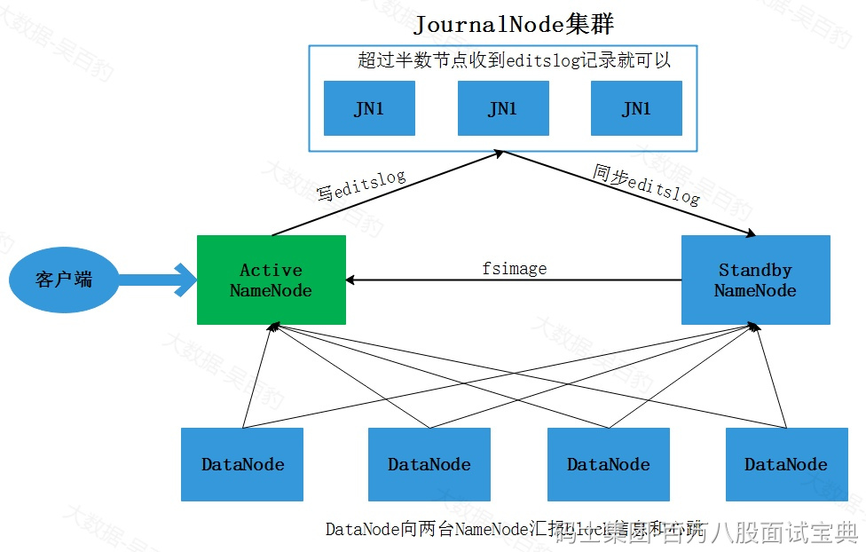
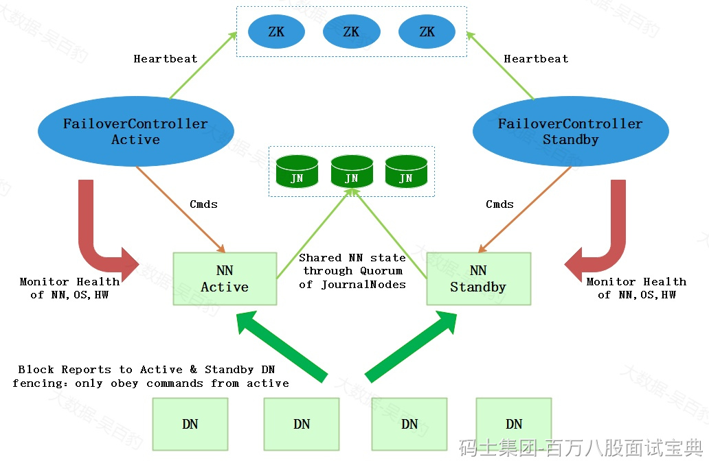

NameNode中存储了HDFS中所有元数据信息（包括用户操作元数据和block元数据），在NameNode HA中，当Active NameNode(ANN)挂掉后，StandbyNameNode(SNN)要及时顶上，这就需要将所有的元数据同步到SNN节点。如向HDFS中写入一个文件时，如果元数据同步写入ANN和SNN，那么当SNN挂掉势必会影响ANN，所以元数据需要异步写入ANN和SNN中。如果某时刻ANN刚好挂掉，但却没有及时将元数据异步写入到SNN也会引起数据丢失，所以向SNN同步元数据需要引入第三方存储，在HA方案中叫做“共享存储”。每次向HDFS中写入文件时，需要将edits log同步写入共享存储，这个步骤成功才能认定写文件成功，然后SNN定期从共享存储中同步editslog，以便拥有完整元数据便于ANN挂掉后进行主备切换。

HDFS将Cloudera公司实现的QJM(Quorum Journal Manager)方案作为默认的共享存储实现。在QJM方案中注意如下几点：

- 基于QJM的共享存储系统主要用于保存Editslog,并不保存FSImage文件，FSImage文件还是在NameNode本地磁盘中。
- QJM共享存储采用多个称为JournalNode的节点组成的JournalNode集群来存储EditsLog。每个JournalNode保存同样的EditsLog副本。
- 每次NameNode写EditsLog时，除了向本地磁盘写入EditsLog外，也会并行的向JournalNode集群中每个JournalNode发送写请求，只要大多数的JournalNode节点返回成功就认为向JournalNode集群中写入EditsLog成功。
- 如果有2N+1台JournalNode，那么根据大多数的原则，最多可以容忍有N台JournalNode节点挂掉。

NameNode HA 实现原理图如下：

当客户端操作HDFS集群时，Active NameNode 首先把 EditLog 提交到 JournalNode 集群，然后 Standby NameNode 再从 JournalNode 集群定时同步 EditLog。当处 于 Standby 状态的 NameNode 转换为 Active 状态的时候，有可能上一个 Active NameNode 发生了异常退出，那么 JournalNode 集群中各个 JournalNode 上的 EditLog 就可能会处于不一致的状态，所以首先要做的事情就是让 JournalNode 集群中各个节点上的 EditLog 恢复为一致，然后Standby NameNode会从JournalNode集群中同步EditsLog，然后对外提供服务。

**注意：在NameNode HA中不再需要SecondaryNameNode角色，该角色被StandbyNameNode替代。**

通过Journal Node实现NameNode HA时，可以手动将Standby NameNode切换成Active NameNode，也可以通过自动方式实现NameNode切换。

上图需要手动进行切换StandbyNamenode为Active NameNode，对于高可用场景时效性较低，那么可以通过zookeeper进行协调自动实现NameNode HA，实现代码通过Zookeeper来检测Activate NameNode节点是否挂掉，如果挂掉立即将Standby NameNode切换成Active NameNode，这种方式也是生产环境中常用情况。其原理如下：

上图中引入了zookeeper作为分布式协调器来完成NameNode自动选主，以上各个角色解释如下：

- AcitveNameNode：主 NameNode，只有主NameNode才能对外提供读写服务。
- Secondby NameNode：备用NameNode，定时同步Journal集群中的editslog元数据。
- ZKFailoverController：ZKFailoverController 作为独立的进程运行，对 NameNode 的主备切换进行总体控制。ZKFailoverController 能及时检测到 NameNode 的健康状况，在主 NameNode 故障时借助 Zookeeper 实现自动的主备选举和切换。
- Zookeeper集群：分布式协调器，NameNode选主使用。
- Journal集群：Journal集群作为共享存储系统保存HDFS运行过程中的元数据，ANN和SNN通过Journal集群实现元数据同步。
- DataNode节点：除了通过共享存储系统共享 HDFS 的元数据信息之外，主 NameNode 和备 NameNode 还需要共享 HDFS 的数据块和 DataNode 之间的映射关系。DataNode 会同时向主 NameNode 和备 NameNode 上报数据块的位置信息。
