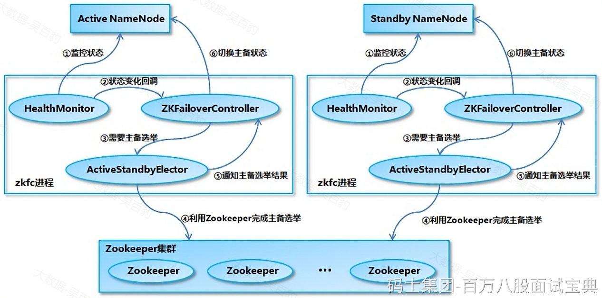

NameNode 主备切换主要由 ZKFailoverController、HealthMonitor 和 ActiveStandbyElector 这 3 个组件来协同实现：

- ZKFailoverController 作为 NameNode 机器上一个独立的进程启动 (在 hdfs 集群中进程名为 zkfc)，启动的时候会创建 HealthMonitor 和 ActiveStandbyElector 这两个主要的内部组件，ZKFailoverController 在创建 HealthMonitor 和 ActiveStandbyElector 的同时，也会向 HealthMonitor 和 ActiveStandbyElector 注册相应的回调方法。
- HealthMonitor 主要负责检测 NameNode 的健康状态，如果检测到 NameNode 的状态发生变化，会回调 ZKFailoverController 的相应方法进行自动的主备选举。
- ActiveStandbyElector 主要负责完成自动的主备选举，内部封装了 Zookeeper 的处理逻辑，一旦 Zookeeper 主备选举完成，会回调 ZKFailoverController 的相应方法来进行 NameNode 的主备状态切换。

NameNode主备切换流程如下:

1. HealthMonitor 初始化完成之后会启动内部的线程来定时调用对应 NameNode 的 HAServiceProtocol RPC 接口的方法，对 NameNode 的健康状态进行检测。
2. HealthMonitor 如果检测到 NameNode 的健康状态发生变化，会回调 ZKFailoverController 注册的相应方法进行处理。
3. 如果 ZKFailoverController 判断需要进行主备切换，会首先使用 ActiveStandbyElector 来进行自动的主备选举。
4. ActiveStandbyElector 与 Zookeeper 进行交互完成自动的主备选举。
5. ActiveStandbyElector 在主备选举完成后，会回调 ZKFailoverController 的相应方法来通知当前的 NameNode 成为主 NameNode 或备 NameNode。
6. ZKFailoverController 调用对应 NameNode 的 HAServiceProtocol RPC 接口的方法将 NameNode 转换为 Active 状态或 Standby 状态。
