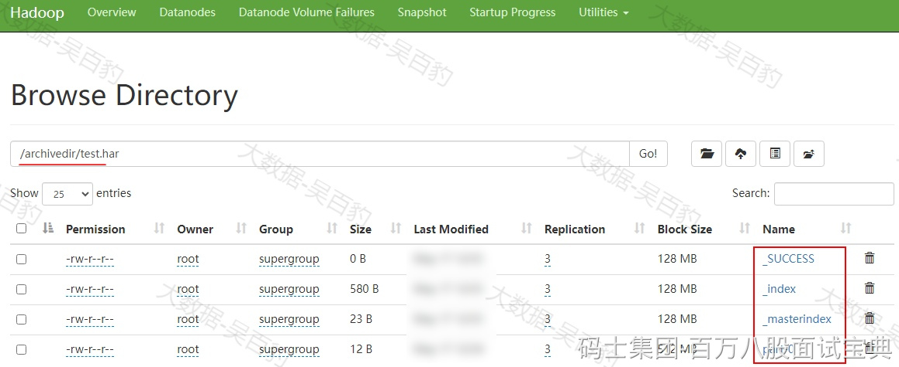

HDFS中存储小文件时，每个小文件都会对应一个block块，每个block的元数据都会占用NameNode内存，当系统中存储大量小文件时，这些文件的元数据会迅速耗尽NameNode节点的内存资源，从而影响HDFS正常使用，为了解决这个问题，Hadoop Archives(HAR)被引入。

HAR是一种有效的存档工具，能够将多个小文件归档成一个文件，并且在归档后仍然保持了对每个文件的透明访问。通过将文件存储为HDFS块的方式，HDFS存档文件能够降低NameNode内存的使用率，从而减轻了存储大量小文件所带来的压力。

注意：假设小文件数据为1M ，那么会对应到一个block上，但是实际占用磁盘空间是1M ，HAR可以将所有小文件合并归档为一个大的文件，形成少量block存储这些数据，从而减少元数据占用空间。

## **HAR文件归档**

HAR使用语法如下：

|  |
| --- |
| $hadoop archive -archiveName name -p <parent> <src>\* <dest> |

- -archiveName ：指定要创建的归档文件夹目录的名字，archive的名字扩展名必须是\*.har，例如：test.har。
- -p：指定要存档文件的父路径，例如：/a/b/c、/a/b/d两个路径下的文件要被归档，那么-p可以指定为/a/b 即：/a/b/c、/a/b/d的父路径，然后<src>再分别指定为c或者d。
- src：指定待归档小文件路径，可以指定多个，空格隔开即可。
- dest：指定归档文件输出路径。

以上HAR命令会转换成MapReduce任务进行文件归档处理，所以需要Yarn环境。按照如下步骤进行文件归档测试。

1. **在HDFS中创建/a/b/c 和 /a/b/d 两个路径，并向两个路径中分别创建小文件**

|  |
| --- |
| **#创建路径**  [root@node5 ~]# hdfs dfs -mkdir -p /a/b/c  [root@node5 ~]# hdfs dfs -mkdir -p /a/b/d    **#向两个路径下写入小文件**  [root@node5 ~]# echo 1 > c1.txt  [root@node5 ~]# echo 2 > c2.txt  [root@node5 ~]# echo 3 > c3.txt  [root@node5 ~]# echo 4 > d1.txt  [root@node5 ~]# echo 5 > d2.txt  [root@node5 ~]# echo 6 > d3.txt    **#上传小文件到对应路径下**  [root@node5 ~]# hdfs dfs -put ./c\*.txt /a/b/c  [root@node5 ~]# hdfs dfs -put ./d\*.txt /a/b/d    **#查看上传的小文件**  [root@node5 ~]# hdfs dfs -ls /a/b/c  /a/b/c/c1.txt  /a/b/c/c2.txt  /a/b/c/c3.txt  [root@node5 ~]# hdfs dfs -ls /a/b/d  /a/b/d/d1.txt  /a/b/d/d2.txt  /a/b/d/d3.txt |

2. **进行小文件归档**

|  |
| --- |
| **#归档 /a/b/c 和 /a/b/d 目录中的小文件到指定目录**  [root@node5 ~]# hadoop archive -archiveName test.har -p /a/b c d /archivedir    **#查看归档的文件**  [root@node5 ~]# hdfs dfs -ls /archivedir/test.har  /archivedir/test.har/\_SUCCESS  /archivedir/test.har/\_index  /archivedir/test.har/\_masterindex  /archivedir/test.har/part-0 |

以上“\_SUCCESS”是标记文件；“\_index”和“\_masterindex”是索引文件，通过索引文件可以找到对应的原文件；“part-0”是多个原小文件的集合文件。

通过HDFS WebUI查看test.har目录下的文件：

也可以通过hadoop archive命令归档一个目录下的文件：

|  |
| --- |
| **#归档/a/b/c目录下的文件**  [root@node5 ~]# hadoop archive -archiveName test.har -p /a/b/c /archivedir2 |

## **HAR查询归档文件**

可以正常使用HDFS 命令查询归档文件中的数据，如下命令：

|  |
| --- |
| **#使用 hdfs访问协议访问归档数据**  [root@node5 ~]# hdfs dfs -cat /archivedir/test.har/part-0  1  2  3  4  5  6 |

也可以通过har uri访问协议，访问到数据原来的文件，har uri 访问写法如下：

|  |
| --- |
| **#schema-hostname格式为hdfs-域名:port**  har://schema-hostname:port/archivepath/harfile |

如下是通过har uri协议访问har原有文件的命令操作：

|  |
| --- |
| **#通过har uri访问har文件中打包数据路径及文件信息**  [root@node5 ~]# hdfs dfs -ls har://hdfs-node1:8020/archivedir/test.har/  har://hdfs-node1:8020/archivedir/test.har/c  har://hdfs-node1:8020/archivedir/test.har/d    [root@node5 ~]# hdfs dfs -ls har://hdfs-node1:8020/archivedir/test.har/c  har://hdfs-node1:8020/archivedir/test.har/c/c1.txt  har://hdfs-node1:8020/archivedir/test.har/c/c2.txt  har://hdfs-node1:8020/archivedir/test.har/c/c3.txt    [root@node5 ~]# hdfs dfs -ls har://hdfs-node1:8020/archivedir/test.har/d  har://hdfs-node1:8020/archivedir/test.har/d/d1.txt  har://hdfs-node1:8020/archivedir/test.har/d/d2.txt  har://hdfs-node1:8020/archivedir/test.har/d/d3.txt    **#通过har uri 访问har文件中的原文件信息**  [root@node5 ~]# hdfs dfs -cat har://hdfs-node1:8020/archivedir/test.har/d/d1.txt  4 |

注意：har中获取到的原文件信息是根据har中索引文件获取到的，与归档前的源文件目录没有关系

## **HAR提取归档文件**

可以使用“hdfs dfs -cp <haruri har file> <distdir>” 来将归档文件提取到新的文件目录中。具体操作如下：

|  |
| --- |
| **#创建路径**  [root@node5 ~]# hdfs dfs -mkdir /newdir    **#提取归档文件，这里会将归档的文件按照目录关系提取**  [root@node5 ~]# hdfs dfs -cp har://hdfs-node1:8020/archivedir/test.har/\* /newdir    **#查看提取文件，可以查询到对应的目录和数据文件**  [root@node5 ~]# hdfs dfs -ls /newdir  /newdir/c  /newdir/d |
