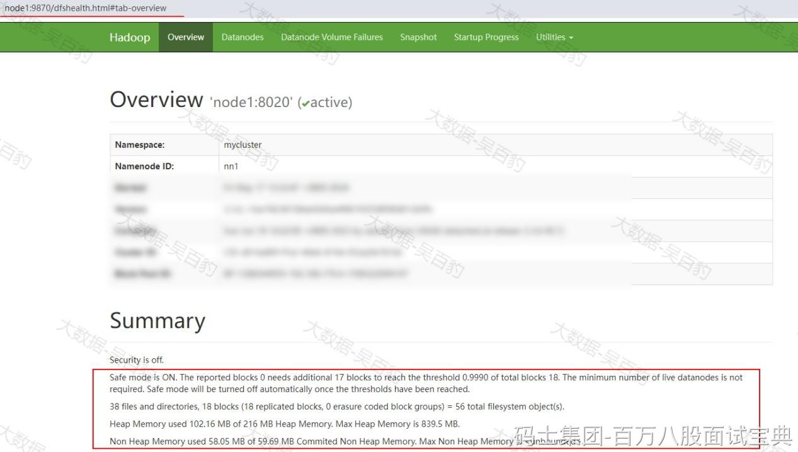
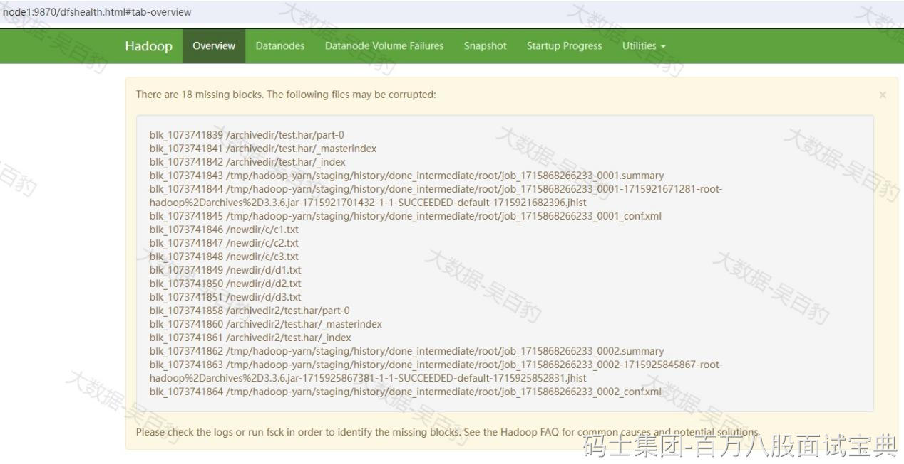

DataNode数据丢失处理是指当DataNode节点上的数据目录被意外删除后导致HDFS集群启动异常。默认在HDFS中数据存储会有3个副本，3个副本分别存在不同的DataNode节点上，每个DataNode节点存储数据的目录由hdfs-site.xml文件中的参数hadoop.tmp.dir来配置，默认为file://${hadoop.tmp.dir}/dfs/data 路径。

当意外删除HDFS数据所在DataNode节点数据时，由于HDFS集群中有该数据副本，所以重启HDFS集群后，这些删除的数据会自动复制还原回来。但如果所有DataNode节点上的数据目录被意外删除，重启HDFS集群后HDFS集群会进入安全模式，如下：

解决以上问题需要先退出安全模式，然后执行“hdfs fsck”工具（fsck用于检查HDFS文件系统的完整性和一致性）查看并删除缺失block的数据文件，这样会导致这些文件数据丢失。

具体测试如下：

1. **在node3~node5 DataNode节点上删除数据目录**

|  |
| --- |
| **#进入node3~node5各个节点数据目录并删除数据目录**  cd /opt/data/hadoop/dfs/data  rm -rf ./\* |

2. **重启HDFS集群**

重启HDFS集群后，可以看到集群进入到安全模式。

3. **退出安全模式**

执行如下命令查看和退出HDFS 安全模式。

|  |
| --- |
| [root@node5 ~]# hdfs dfsadmin -safemode get  Safe mode is ON in node1/192.168.179.4:8020  Safe mode is ON in node2/192.168.179.5:8020  Safe mode is ON in node3/192.168.179.6:8020    [root@node5 ~]# hdfs dfsadmin -safemode leave  Safe mode is OFF in node1/192.168.179.4:8020  Safe mode is OFF in node2/192.168.179.5:8020  Safe mode is OFF in node3/192.168.179.6:8020    [root@node5 ~]# hdfs dfsadmin -safemode get  Safe mode is OFF in node1/192.168.179.4:8020  Safe mode is OFF in node2/192.168.179.5:8020  Safe mode is OFF in node3/192.168.179.6:8020 |

当执行如下命令后，在HDFS WebUI中可以看到如下block 丢失信息：

4. **检查并删除缺失block的数据文件**

使用fsck工具检查并删除缺失block数据文件。

|  |
| --- |
| **#查看HDFS中缺失block文件**  [root@node5 ~]# hdfs fsck /  ... ...  /archivedir/test.har/\_index: MISSING 1 blocks of total size 580 B.  /archivedir/test.har/\_masterindex: MISSING 1 blocks of total size 23 B.  /archivedir/test.har/part-0: MISSING 1 blocks of total size 12 B.  /archivedir2/test.har/\_index: MISSING 1 blocks of total size 251 B.  /archivedir2/test.har/\_masterindex: MISSING 1 blocks of total size 23 B.  /archivedir2/test.har/part-0: MISSING 1 blocks of total size 6 B.  /newdir/c/c1.txt: MISSING 1 blocks of total size 2 B.  /newdir/c/c2.txt: MISSING 1 blocks of total size 2 B.  /newdir/c/c3.txt: MISSING 1 blocks of total size 2 B.  /newdir/d/d1.txt: MISSING 1 blocks of total size 2 B.  /newdir/d/d2.txt: MISSING 1 blocks of total size 2 B.  /newdir/d/d3.txt: MISSING 1 blocks of total size 2 B.  ... ...    **#删除缺失文件，正常文件不会被删除**  [root@node5 ~]# hdfs fsck / -delete |

注意：通过“hdfs fsck / -delete”命令会将缺失block的文件删除掉，导致这些文件丢失。
