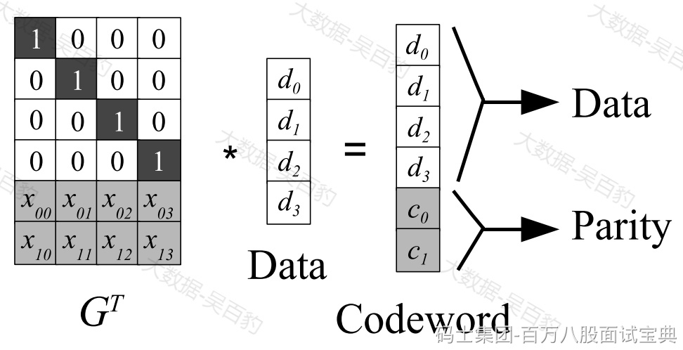
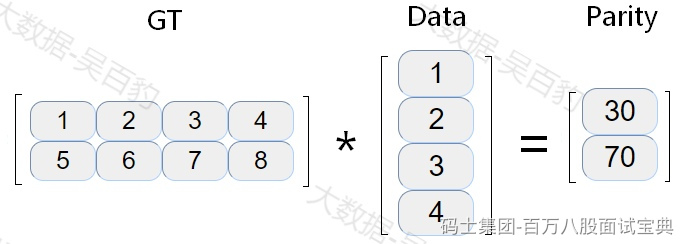

在HDFS中存储的数据默认有3副本，这些副本存储在不同的节点上保证数据的可靠性，这种可靠性保证的代价是有很高的存储开销，例如：3副本存储会带来额外2份冗余存储，为了节省存储空间又能保证数据可靠性，Hadoop3.x 引入了纠删码技术（Erasure Coding）,相比于传统的副本复制方式，纠删码技术可以节省50%的存储空间。

Erasurecoding纠删码技术简称EC ，是一种编码容错技术，最早用于通信行业中数据传输中的数据恢复，其原理是通过在原始数据中加入新的校验数据，使得各个部分的数据产生关联性，在一定范围数据出错的情况下，通过纠删码技术都可以进行恢复。

## **纠删码原理**

纠删码有不同种类，其中里德所罗门码（Reed-SolomonCodes,RS）比较常见，该编码使用复杂的线性代数运算来生成多个奇偶检验块，可以容忍多个块故障，RS需要配置2个参数：k和m，如下图，RS(k,m)通过将k个数据块的向量（Data）与生成矩阵(GT)相乘来实现，从而得到一个码字（codeword）向量，该向量由k个数据块和m个校验块组成，如果一个数据块丢失，可以用GT和codeword逆运算恢复出丢失的数据块，RS(k,m)最多容忍m个块（包括数据块和校验块）丢失。

举个类似的例子，如下GT为2行4列矩阵，Data为4行1列矩阵，两者相乘得到2行1列的parity结果，当Data或者Parity中任意两个数据丢失，都可以通过逆运算方式重新获取丢失的数据块。

在HDFS中数据以block存储，每个block默认为128M，上图中的data实际上是将Block划分成细粒度的数据矩阵单元（cell），每个数据矩阵称为单元条带（stripes of cells），单元条带是在一组block块中轮询方式读取写出形成。

## **HDFS 纠删码策略**

可以通过命令“hdfs ec -listPolicies”来查询HDFS中支持的纠删码策略，如下：

|  |
| --- |
| [root@node5 ~]# hdfs ec -listPolicies  Erasure Coding Policies:  ErasureCodingPolicy=[Name=RS-10-4-1024k, ...], State=DISABLED  ErasureCodingPolicy=[Name=RS-3-2-1024k, ...], State=DISABLED  ErasureCodingPolicy=[Name=RS-6-3-1024k, ...], State=ENABLED  ErasureCodingPolicy=[Name=RS-LEGACY-6-3-1024k, ...], State=DISABLED  ErasureCodingPolicy=[Name=XOR-2-1-1024k, ...], State=DISABLED |

对以上纠删码策略解释如下：

- **RS-10-4-1024k**

使用RS编码，每10个数据单元（cell）生成4个校验单元，共14个单元，只要14个单元中任意10个单元存在，就可以保证数据容错，每个数据单元大小为1024\*1024。要求集群中有14个DataNode。

- **RS-3-2-1024k**

使用RS编码，每3个数据单元（cell）生成2个校验单元，共5个单元，只要5个单元中任意3个单元存在，就可以保证数据容错，每个数据单元大小为1024\*1024。要求集群中有5个DataNode。

- **RS-6-3-1024k**

使用RS编码，HDFS中使用纠删码后，默认的编码方式。每6个数据单元（cell）生成3个校验单元，共9个单元，只要9个单元中任意6个单元存在，就可以保证数据容错，每个数据单元大小为1024\*1024。要求集群中有9个DataNode。

- **RS-LEGACY-6-3-1024k**

与RS-6-3-1024类似，使用相对旧的算法实现。要求集群中有9个DataNode。

- **XOR-2-1-1024k**

使用XOR算法，每2个数据单元（cell）生成1个校验单元，共3个单元，只要3个单元中任意2个单元存在，就可以保证数据容错，每个数据单元大小为1024\*1024要求集群有3个机架。

## **纠删码使用**

在HDFS中如果想要使用纠删码需要对相应的HDFS目录进行设置，当给某个目录设置了纠删码后，所有存储在当前目录下的文件都会执行对应的策略，默认只有“RS-6-3-1024k”策略开启，可以给目录直接设置该策略，如果想要使用其他策略需要开启。操作命令如下：

|  |
| --- |
| **#HDFS中创建目录 aaa ,并指定纠删码策略**  [root@node5 ~]# hdfs dfs -mkdir /aaa  [root@node5 ~]# hdfs ec -setPolicy -path /aaa -policy RS-6-3-1024k  Set RS-6-3-1024k erasure coding policy on /aaa    **#如果想要给目录指定其他纠删码策略，需要先enable**  [root@node5 ~]# hdfs ec -setPolicy -path /input -policy RS-3-2-1024k  RemoteException: Policy 'RS-3-2-1024k' does not match any enabled erasure coding policies: [RS-6-3-1024k]. An erasure coding policy can be enabled by enableErasureCodingPolicy API.    **#开启指定的纠删码策略**  [root@node5 ~]# hdfs ec -enablePolicy -policy RS-3-2-1024k    **#给 /aaa 目录设置 RS-3-2-1024k 策略**  [root@node5 ~]# hdfs ec -setPolicy -path /aaa -policy RS-3-2-1024k  Set RS-3-2-1024k erasure coding policy on /aaa |

注意：这里使用对应策略需要设置DataNode节点符合各个策略要求的DataNode节点，然后可以通过删除对应个数的DataNode数据存储目录来测试纠删码策略，当删除DataNode上数据块个数大于对应策略要求的最少数据块时会导致数据丢失。这里由于只有3个DataNode节点不再测试。

## **纠删码优缺点**

纠删码优势可以减少数据存储空间的消耗，但同时会带来网络带宽和CPU资源的消耗，当进行数据恢复时需要去其他节点获取数据块和校验块然后通过大量CPU计算还原数据，所以一般冷数据存储可以采用纠删码存储，可以大大节省存储空间，但对于线上集群建议使用副本容错机制。
