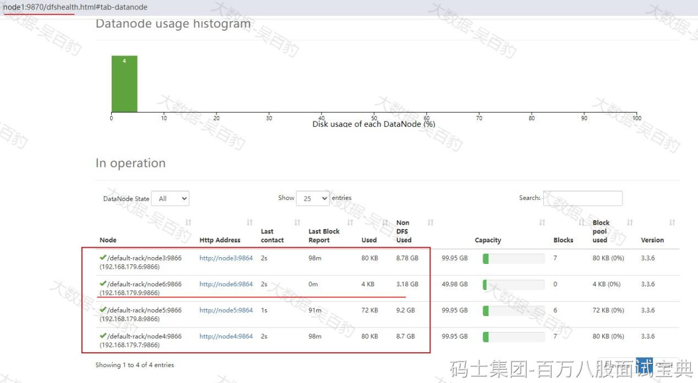
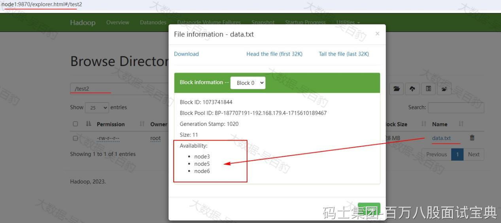
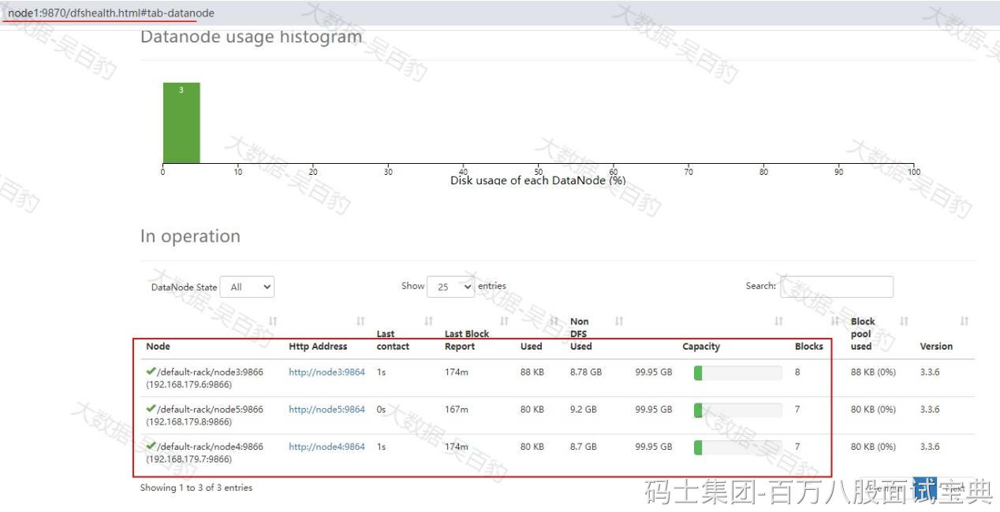

HDFS集群已有DataNode节点不能满足数据存储需求，支持在原有集群基础上动态添加新的DataNode节点，这就是HDFS动态扩容。

我们希望将一个DataNode节点在HDFS中“退役”下线，HDFS也同样支持动态将DataNode下线，这就是HDFS动态缩容。

## **动态扩容DataNode**

按照如下步骤操作即可。

1. **将node1节点配置好的hadoop 安装包发送到node6节点**

|  |
| --- |
| [root@node1 ~]# cd /software/  [root@node1 software]# scp -r ./hadoop-3.3.6 node6:`pwd` |

2. **node6节点配置Hadoop环境变量**

|  |
| --- |
| [root@node6 software]# vim /etc/profile  export HADOOP\_HOME=/software/hadoop-3.3.6/  export PATH=$PATH:$HADOOP\_HOME/bin:$HADOOP\_HOME/sbin:    **#使配置生效**  source /etc/profile |

3. **node6节点启动DataNode**

在node6节点执行如下命令启动DataNode：

|  |
| --- |
| [root@node6 ~]# hdfs --daemon start datanode |

4. **在各个节点白名单中加入node6**

在node1~node6各个节点 $HADOOP\_HOME/etc/whitelist白名单中加入node6。各个节点whitelist 内容如下：

|  |
| --- |
| node3  node4  node5  node6 |

5. **刷新NameNode**

在任意NameNode节点执行如下命令重新刷新HDFS 节点：

|  |
| --- |
| **#在任意NameNode节点执行如下命令，最好保证所有NameNode进程存在**  [root@node1 hadoop]# hdfs dfsadmin -refreshNodes  Refresh nodes successful for node1/192.168.179.4:8020  Refresh nodes successful for node2/192.168.179.5:8020  Refresh nodes successful for node3/192.168.179.6:8020 |

执行如上命令后，可以通过HDFS WebUI看到node6 DataNode节点加入了集群中：

6. **测试数据上传**

在node6节点创建HDFS目录 /test2 并将data.txt上传到该目录下：

|  |
| --- |
| **#创建/test目录**  [root@node6 ~]# hdfs dfs -mkdir /test2    **#上传data.txt到/test目录下**  [root@node6 ~]# hdfs dfs -put ./data.txt /test2/ |

通过WebUI我们发现刚上传的data.txt 副本分布如下，优先将数据副本存储在HDFS客户端node6上，集群DataNode动态扩容完成。

向HDFS集群中加入新的DataNode后，可能会导致新DataNode节点上数据分布少，其他DataNode节点数据分布多，这样导致集群整体负载不均衡，我们可以通过命令脚本对HDFS中数据进行负载均衡操作。

|  |
| --- |
| **#启动HDFS负载均衡操作，-threadshold 表示各个节点磁盘使用空间相差不超过5%**  [root@node6 ~]# hdfs balancer -threshold 5 |

注意：建议在负载不高的一台节点上执行数据负载均衡操作。

## **HDFS动态缩容**

我们希望将一个DataNode节点在HDFS中“退役”下线，HDFS也同样支持动态将DataNode下线，这就是HDFS动态缩容。

这里将node6 DataNode进行下线演示，可以按照如下步骤操作即可。

1. **配置各个节点的黑白名单**

在各个Hadoop节点上$HADOOP\_HOME/etc/hadoop路径下配置blacklist和whitelist，将node6节点从whitelist中删除，加入到blacklist中。

blacklist:

|  |
| --- |
| node6 |

whitelist:

|  |
| --- |
| node3  node4  node5 |

将以上blacklist和whitelist分发到其他Hadoop节点上。

2. **刷新NameNode**

在任意NameNode节点执行如下命令重新刷新HDFS 节点：

|  |
| --- |
| **#在任意NameNode节点执行如下命令，最好保证所有NameNode进程存在**  [root@node1 hadoop]# hdfs dfsadmin -refreshNodes  Refresh nodes successful for node1/192.168.179.4:8020  Refresh nodes successful for node2/192.168.179.5:8020  Refresh nodes successful for node3/192.168.179.6:8020 |

执行如上命令后，可以通过HDFS WebUI看到node6 DataNode节点在集群中下线：

## ​
