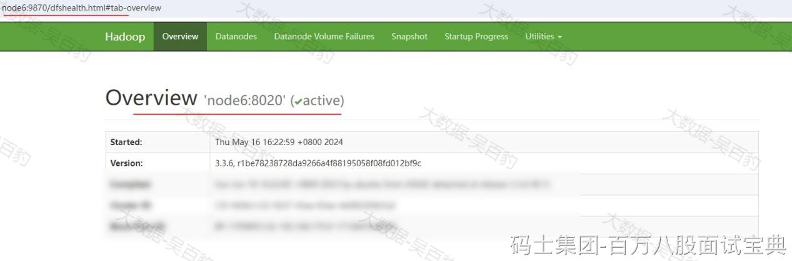

HDFS数据迁移是指将Hadoop分布式文件系统（HDFS）中的数据从一个位置或一个集群移动到另一个位置或另一个集群的过程。数据迁移通常是一种大规模的操作，可能涉及跨机房、跨集群，并且需要考虑到数据迁移规模的不同，导致整个数据迁移的周期也会有所不同。

在HDFS中，数据迁移通常用于以下几种场景：

1. 冷热集群数据同步、分类存储：将冷热数据从一个集群移动到另一个集群，以便更有效地管理和存储不同类型的数据。例如，将不经常访问的冷数据移动到成本更低的存储层，而将热数据保留在性能更高的存储层上。
2. 集群数据整体搬迁：当公司的业务发展导致当前服务器资源紧张时，可能需要将整个HDFS集群的数据迁移到另一个机房或集群，以利用更多资源或降低成本。
3. 数据的准实时同步：确保数据的双备份可用性，即将数据实时同步到另一个集群，以便在主集群发生故障时能够无缝切换到备份集群。

进行HDFS 数据迁移时我们可以使用DistCp工具，DistCp（分布式拷贝）是Apache Hadoop生态系统中的一个工具，用于在Hadoop分布式文件系统（HDFS）之间或者同一HDFS集群内部进行数据复制和迁移。DistCp底层使用MapReduce进行数据文件复制迁移，所以执行DistCp命令后会在对应集群中生成MR Job。

## **搭建HDFS伪分布式集群**

下面在node6节点上搭建HDFS 伪分布式集群，与现有的HDFS集群进行数据迁移同步来进行HDFS数据迁移测试。

1. **下载安装包并解压**

我们安装Hadoop3.3.6版本，搭建HDFS集群前，首先需要在官网下载安装包，地址如下：<https://hadoop.apache.org/releases.html>。下载完成安装包后，上传到node6节点的/software目录下并解压到opt目录下。

|  |
| --- |
| **#将下载好的hadoop安装包上传到node6节点上**  [root@node6 ~]# ls /software/  hadoop-3.3.6.tar.gz    **#将安装包解压到/opt目录下**  [root@node6 ~]# cd /software/  [root@node6 software]# tar -zxvf ./hadoop-3.3.6.tar.gz -C /opt |

2. **在node6节点上配置Hadoop的环境变量**

|  |
| --- |
| [root@node6 software]# vim /etc/profile  export HADOOP\_HOME=/software/hadoop-3.3.6/  export PATH=$PATH:$HADOOP\_HOME/bin:$HADOOP\_HOME/sbin:    **#使配置生效**  source /etc/profile |

3. **配置hadoop-env.sh**

启动伪分布式HDFS集群时会判断$HADOOP\_HOME/etc/hadoop/hadoop-env.sh文件中是否配置JAVA\_HOME，所以需要在hadoop-env.sh文件加入以下配置（大概在54行有默认注释配置的JAVA\_HOME）:

|  |
| --- |
| **#vim /opt/hadoop-3.3.6/etc/hadoop/hadoop-env.sh**  export JAVA\_HOME=/usr/java/jdk1.8.0\_181-amd64/ |

4. **配置core-site.xml**

进入 $HADOOP\_HOME/etc/hadoop路径下，修改core-site.xml文件，指定HDFS集群数据访问地址及集群数据存放路径。

|  |
| --- |
| #vim /opt/hadoop-3.3.6/etc/hadoop/core-site.xml  <configuration>  **<!-- 指定NameNode的地址 -->**  <property>  <name>fs.defaultFS</name>  <value>**hdfs://node6:8020**</value>  </property>    **<!-- 指定 Hadoop 数据存放的路径 -->**  <property>  <name>hadoop.tmp.dir</name>  <value>/opt/data/local\_hadoop</value>  </property>  </configuration> |

**注意：如果node6节点配置启动过HDFS，需要将“hadoop.tmp.dir”配置的目录清空。**

5. **配置hdfs-site.xml**

进入 $HADOOP\_HOME/etc/hadoop路径下，修改hdfs-site.xml文件，指定NameNode和SecondaryNameNode节点和端口。

|  |
| --- |
| **#vim /opt/hadoop-3.3.6/etc/hadoop/hdfs-site.xml**  <configuration>  <!-- 指定block副本数-->  <property>  <name>dfs.replication</name>  <value>1</value>  </property>  <!-- NameNode WebUI访问地址-->  <property>  <name>dfs.namenode.http-address</name>  <value>**node6:9870**</value>  </property>  <!-- SecondaryNameNode WebUI访问地址-->  <property>  <name>dfs.namenode.secondary.http-address</name>  <value>**node6:9868**</value>  </property>  </configuration> |

6. **配置workers指定DataNode节点**

进入 $HADOOP\_HOME/etc/hadoop路径下，修改workers配置文件，加入以下内容：

|  |
| --- |
| **#vim /opt/hadoop-3.3.6/etc/hadoop/workers**  **node6** |

7. **配置start-dfs.sh&stop-dfs.sh**

进入 $HADOOP\_HOME/sbin路径下，在start-dfs.sh和stop-dfs.sh文件顶部添加操作HDFS的用户为root，防止启动错误。

|  |
| --- |
| **#分别在start-dfs.sh 和stop-dfs.sh文件顶部添加如下内容**  HDFS\_NAMENODE\_USER=root  HDFS\_DATANODE\_USER=root  HDFS\_SECONDARYNAMENODE\_USER=root |

8. **格式化并启动HDFS集群**

HDFS完全分布式集群搭建完成后，首次使用需要进行格式化，在NameNode节点（node6）上执行如下命令：

|  |
| --- |
| **#在node6节点上格式化集群**  [root@node6 ~]# hdfs namenode -format |

格式化集群完成后就可以在node6节点上执行如下命令启动集群：

|  |
| --- |
| **#在node6节点上启动集群**  [root@node6 ~]# start-dfs.sh |

至此，Hadoop完全分布式搭建完成，可以浏览器访问HDFS WebUI界面，NameNode WebUI访问地址为：https://node6:9870，需要在window中配置hosts。

## **DistCp集群间数据迁移**

DistCp命令的基本用法如下：

|  |
| --- |
| $ hadoop distcp OPTIONS [source\_path...] <target\_path> |

其中OPTIONS主要参数有如下：

- -update：拷贝数据时，只拷贝相对于源端，目标端不存在的文件数据或源端修改的数据。
- -delete：删除相对于源端，目标端多出来的文件。

下面对hdfs://node1:8020集群（A集群）中的数据迁移到hdfs://node6:8020集群（B集群）中进行测试。

1. **将A集群中 test目录下的数据迁移到B集群**

|  |
| --- |
| **#在A集群中执行迁移命令**  [root@node1 ~]# hadoop distcp hdfs://node1:8020/test/ hdfs://node6:8020/test    **#在B集群中查询数据**  [root@node6 ~]# hdfs dfs -cat /test/data.txt  1,zs  2,ls  3,ww  4,ml  5,tq |

2. **测试distcp -update参数**

替换A集群中/test/data.txt文件，向data.txt文件写入新的数据如下：

|  |
| --- |
| 1,zs  2,ls  3,ww  4,ml  5,tq  6,x1  7,x2 |

A集群中替换HDFS中/test/data.txt文件，并通过distcp 命令将追加的数据同步到B集群

|  |
| --- |
| [root@node6 sbin]# hdfs dfs -rm /test/data.txt    **#再次上传**  [root@node1 ~]# hdfs dfs -put ./data.txt /test/data.txt    **#同步新的文件数据**  [root@node1 ~]# hadoop distcp -update hdfs://node1:8020/test/ hdfs://node6:8020/test |

3. **测试distcp -delete参数**

向B集群HDFS集群/test目录下上传a.txt 文件，内容随意，如下：

|  |
| --- |
| [root@node6 ~]# hdfs dfs -put ./a.txt /test/  [root@node6 ~]# hdfs dfs -ls /test  /test/a.txt  /test/data.txt |

使用distcp命令指定-delete参数删除B集群指定目录与源端A集群相应目录中相比多出的数据文件，delete参数需要结合update参数一起使用：

|  |
| --- |
| [root@node1 ~]# hadoop distcp -update -delete hdfs://node1:8020/test/ hdfs://node6:8020/test |

以上命令执行后，B集群中创建的/test/a.txt文件被删除。

4. **如果在同一个集群中使用distcp命令，相当于集群内数据复制备份**

|  |
| --- |
| **#在A集群中执行如下命令，可以将test目录下数据备份到back目录下**  [root@node1 ~]# hadoop distcp /test/ /back    **#检查数据**  [root@node1 ~]# hdfs dfs -ls /back  /back/data.txt |
